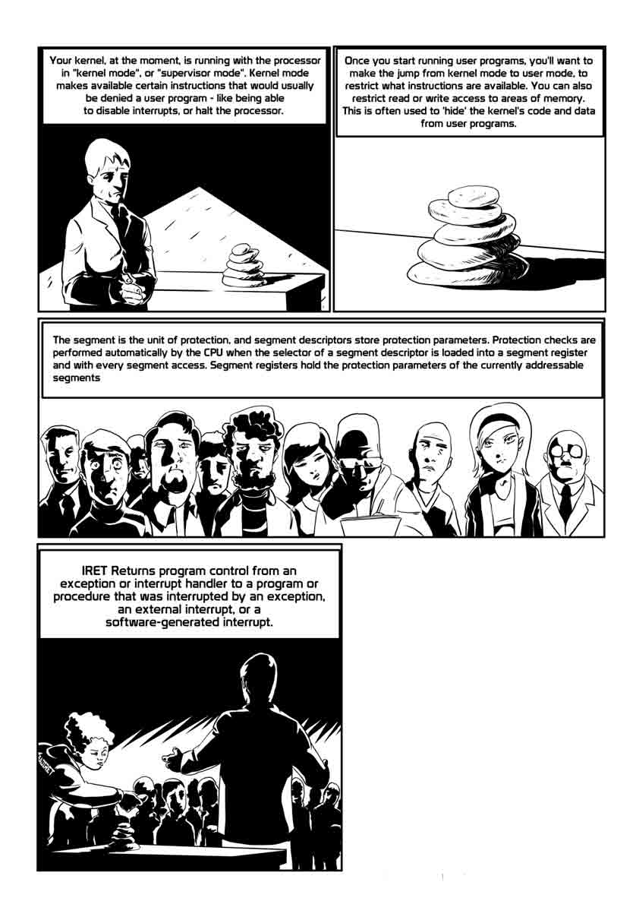

# Exploiting “BadIRET” vulnerability (CVE-2014-9322, Linux kernel privilege escalation)

2015/02/06 14:24 | [insight-labs](http://drops.wooyun.org/author/insight-labs "由 insight-labs 发布")   | [漏洞分析](http://drops.wooyun.org/category/papers "查看 漏洞分析 中的全部文章")  | 占个座先  | 捐赠作者

from:http://labs.bromium.com/2015/02/02/exploiting-badiret-vulnerability-cve-2014-9322-linux-kernel-privilege-escalation/

POC( 感谢 Mickey 提供的链接):

[`rdot.org/forum/showthread.php?t=3341`](https://rdot.org/forum/showthread.php?t=3341)

Shawn：对于这个漏洞，本文的结论是 SMEP 虽然被绕过了，但 SMAP 是依然奏效的，这里只想提一下类似 PaX/Grsecurity 的 UDEREF 特性和 SMAP 类似，只是属于纯软件 实现，大概 2006 年左右这个特性就已经有了而且被一些 anarchy 广泛使用。

## 0x00 Intro

* * *

CVE-2014-9322 的描述如下：

```
linux 内核代码文件 arch/x86/kernel/entry_64.S 在 3.17.5 之前的版本都没有正确的处理跟 SS（堆栈区）段寄存器相关的错误，这可以让本地用户通过触发一个 IRET 指令从错误的地址空间去访问 GS 基地址来提权。 
```

这个漏洞于 2014 年 11 月 23 日被社区修复[2](https://bromiumlabs.files.wordpress.com/2015/01/badiret-cartoon.jpg?w=1190)，至今我并没有见到公开的利用代码和详细的讨论。这篇文章我会尝试去解释这个漏洞的本质以及利用的过程。不幸的 是，我无法完全引用 Intel 白皮书[3](https://bromiumlabs.files.wordpress.com/2015/01/diagram1_png.jpg)的所有内容，如果有读者不熟悉一些术语可以直接查 Intel 白皮书。所有的实验都是在 Fedora 20 64-bit 发行版上完成的，内核是 3.11.10-301，所有的讨论基于 64 位进行。

简单结论概要：

```
1\. 通过测试，这个漏洞可以完全稳定的被利用。
2\. SMEP[4]不能阻止任意代码执行；SMAP[5]可以阻止任意代码执行。 
```

## 0x01 Digression: kernel, usermode, iret

* * *



## 0x02 漏洞

* * *

在一些情况下，linux 内核通过 iret 指令返回用户空间时会产生一个异常。异常处理程序把执行路径返回到了 bad_iret 函数，她做了：

```
 /* So pretend we completed the iret and took the #GPF in user mode.*/
 pushq $0
 SWAPGS
 jmp general_protection

```

正如这行评论所解释，接下来的代码流应该和一般保护异常(General Protection)在用户空间发生时（转跳到#GP 处理程序）完全相同。这种异常处理情况大多是由 iret 指令引发的，e.g. #GP。

问题在于#SS 异常。如果有漏洞的内核（比如 3.17.5）也有"espfix"功能（从 3.16 引入的特性），之后 bad_iret 函数会在只读的栈上执行"push"指令，这会导致页错误（page fault）而会直接引起两个错误。我不考虑这种场景；从现在开始，我们只关注在 3.16 以前的没有"espfix"的内核。

这个漏洞根源于#SS 的异常处理程序没有符合“pretend-it-was-#GP-in-userspace”[6]的规划，与#GP 处理程序相比，#SS 异常处理会多做一次 swapgs 指令。如果你对 swapgs 不了解，请不要跳过下面的章节。

## 0x03 偏题：swapgs 指令

* * *

当内存通过 gs 段进行访问时，像这样：

```
mov %gs:LOGICAL_ADDRESS, %eax

```

实际会发生以下几步：

```
1\. BASE_ADDRESS 值从段寄存器的隐藏部分取出
2\. 内存中的线性地址 LOGICAL_ADDRESS+BASE_ADDRESS 被 dereferenced（Shawn:char *p; *p 就是 deref）。 
```

基地址是从 GDT（或者 LDT）继承过来的。无论如何，有一些情况是 GS 段基地址被修改的动作不需要 GDT 的参与。

引用自 Intel 白皮书：

> “SWAPGS 把当前 GS 基寄存器值和在 MSR 地址 C0000102H(IA32_KERNEL_GS_BASE)所包含的值进行交换。SWAPGS 指令是一个为系统软件设计的特权指令。(....)内核可以使用 GS 前缀在正常的内存引用去访问[per-cpu]内核数据结构。”

Linux 内核为每个 CPU 在启动时分配一个固定大小的结构体来存放关键数据。之后为每个 CPU 加载 IA32_KERNEL_GS_BASE 到相应的结构地址上，因此，通常的情况，比如系统调用的处理程序是：

```
1\. swapgs（现在是 GS 指向内核空间）
2\. 通过内存指令和 gs 前缀访问 per-cpu 内核数据结构
3\. swapgs（撤销之前的 swapgs，GS 指向用户空间）
4\. 返回用户空间 
```

## 0x04 触发漏洞

* * *

现在很明显可以看到这个漏洞简直就是坟墓，因为多了一个 swapgs 指令在有漏洞代码路径里，内核会尝试从可能被用户操控的错误 GS 基地址访问重要的数据结构。

当 iret 指令产生了一个#SS 异常？有趣的是，Intel 白皮书在这方面介绍不完全(Shawn:是阴谋论的话又会想到 BIG BROTHER?)；描述 iret 指令时，Intel 白皮书这 么讲：

```
64 位模式的异常：
#SS(0)
如果一个尝试从栈上 pop 一个值违反了 SS 限制。
如果一个尝试从栈上 pop 一个值引起了 non-canonical 地址（Shawn: 64-bit 下只允许访问 canonical 地址）的引用。 
```

没有一个条件能被强制在内核空间里发生。无论如何，Intel 白皮书里的 iret 伪代码展示了另外一种情况：when the segment defined by the return frame is not present:

```
IF stack segment is not present
THEN #SS(SS selector); FI; 
```

所以在用户空间，我们需要设置 ss 寄存器为某个值来表示不存在。这不是很直接：

我们不能仅仅使用：

```
mov $nonpresent_segment_selector, %eax
mov %ax, %ss 
```

第二条指令会引发#GP。通过调试器（任何 ptrace)设置 ss 寄存器是不允许的；类似的，sys_sigreturn 系统调用不会在 64 位系统上设置这个寄存器（可能 32 位能工作）。解决方案是：

```
1\. 线程 A：通过 sys_modify_ldt 系统调用在 LDT 里创建一个定制段 X
2\. 线程 B：s:=X_selector
3\. 线程 A：通过 sys_modify_ldt 使 X 无效
4\. 线程 B：等待硬件中断 
```

为什么需要在一个进程里使用两个线程的原因是从系统调用（包括 sys_modify_ldt）返回是通过硬编码了#ss 值的 sysret 指令。如果我们使 X 在相同的线程中无效就等同于"ss:=X 指令“，ss 寄存器会处于未完成设置的状态。运行以上代码会导致内核 panic。按照更有意义的做法，我们将需要控制用户空间的 gs 基地址；她可以通过系统调用 arch_prctl(ARCH_SET_GS)被设置。

## 0x05 Achieving write primitive

* * *

如果运行以上代码，#SS 处理程序会正常的返回 bad_iret（意思是没有触及到内存的 GS 基地址），之后转跳到#GP 异常处理程序，执行一段时间后就调用到了这个函数：

```
289 dotraplinkage void
290 do_general_protection(struct pt_regs *regs, long error_code)
291 {
292         struct task_struct *tsk;
...
306         tsk = current;
307         if (!user_mode(regs)) {
                ... it is not reached
317         }
318 
319         tsk->thread.error_code = error_code;
320         tsk->thread.trap_nr = X86_TRAP_GP;
321 
322         if (show_unhandled_signals && unhandled_signal(tsk, SIGSEGV) &&
323                         printk_ratelimit()) {
324                 pr_info("%s[%d] general protection ip:%lx sp:%lx
error:%lx",
325                         tsk->comm, task_pid_nr(tsk),
326                         regs->ip, regs->sp, error_code);
327                 print_vma_addr(" in ", regs->ip);
328                 pr_cont("\n");
329         }
330 
331         force_sig_info(SIGSEGV, SEND_SIG_PRIV, tsk);
332 exit:
333         exception_exit(prev_state);
334 }

```

C 代码不太明显，但从 gs 前缀读取到现有宏的值赋给了 tsk。第 306 行是：

```
0xffffffff8164b79d :    mov    %gs:0xc780,%rbx

```

这很变得有意思起来了。我们控制了 current 指针，她指向用于描述整个 Linux 进程的数据结构。

```
319         tsk->thread.error_code = error_code;
320         tsk->thread.trap_nr = X86_TRAP_GP; 
```

写入（从 task_struct 开始的固定偏移）我们控制的地址。注意值本身不能被控制（分别是 0 和 0xd 常量），但这不应该成为一个问题。游戏结束？

不会，我们想覆盖一些在 X 上的重要数据结构。如果我们按照以下的步骤：

```
1\. 准备在 FAKE_PERCPU 的用户空间内存，设置 gs 基地址给她
2\. 让地址 FAKE_PERCPU+0xc780 存着指针 FAKE_CURRENT_WITH_OFFSET，以满足 FAKE_CURRENT_WITH_OFFSET= X – offsetof(struct task_struct,thread.error_code)
3\. 触发漏洞 
```

之后 do_general_protection 会写入 X。但很快就会尝试再次访问 current task_current 的其他成员，e.g.unhandled_signal()函数从 task_struct 指针解引用。我们没有依赖 X 来控制，最终会在内核产生一个页错误。我们怎么避免这个问题？选项有：

1.  什么都不做。Linux 内核不像 Windows，Linux 内核是完全允许当一个不是预期的页错误在内核出现，如果可能的话，内核会杀死当前进程之后尝试继续运行（Windows 会蓝屏）。这种机制对于大量内核数据污染就无能为力了。我的猜测是在当前进程被杀死后，swapgs 不平衡的保持下来，这会导致其他进程上下文的更多页错误。

2.  使用“tsk->thread.error_code = error_code”覆盖为页错误处理程序的 IDT 入口。之后页错误发生（被 unhandled_signal()触发）。这个技术曾经在一些偶然的环境中成功过。但在这里不会成功，因为有 2 个原因：

    *   Linux 让 IDT 只读
    *   就算 IDT 可写，我们也不能控制覆盖的值 -- 0 或者 0xd。SMEP/SMAP 也会是问题。
3.  我们可以尝试产生一个竞争。“tsk->thread.error_code = error_code”会促进代码执行，比如允许通过系统调用控制的代码指针 P。之后我们可以在 CPU 0 上触发漏洞，在同一时间段 CPU 1 可以循环执行一些系统调用。这个思路可以在 CPU 0 被破坏前让通过 CPU 1 获得代码执行，比如 hook 页错误处理程序，这样 CPU 0 不会影响更多的地方，我尝试了这种方法多次，但都失败了。可能不同的漏洞在时间线上的不同所致。

4.  Throw a towel on “tsk->thread.error_code = error_code” write.

虽然有些恶心，我们会尝试最后一个选项。我们会让 current 指向用户空间，设置这个指针可以通过读的 deref 到我们能控制的内存。自然的，我们观察接下来的代码，找找更多的写 deref。

0x06\. Achieving write primitive continued, aka life after do_general_protection

下一个机会是 do_general_protection()所调用的函数：

```
int
force_sig_info(int sig, struct siginfo *info, struct task_struct *t)
{
        unsigned long int flags;
        int ret, blocked, ignored;
        struct k_sigaction *action;

        spin_lock_irqsave(&t->sighand->siglock, flags);
        action = &t->sighand->action[sig-1];
        ignored = action->sa.sa_handler == SIG_IGN;
        blocked = sigismember(&t->blocked, sig);   
        if (blocked || ignored) {
                action->sa.sa_handler = SIG_DFL;
                if (blocked) {
                        sigdelset(&t->blocked, sig);
                        recalc_sigpending_and_wake(t);
                }
        }
        if (action->sa.sa_handler == SIG_DFL)
                t->signal->flags &= ~SIGNAL_UNKILLABLE;
        ret = specific_send_sig_info(sig, info, t);
        spin_unlock_irqrestore(&t->sighand->siglock, flags);

        return ret;
}

```

task_struct 的成员 sighand 是一个指针，我们可以设置任意值。

```
action = &t->sighand->action[sig-1];
action->sa.sa_handler = SIG_DFL; 
```

我们无法控制写的值，SIG_DFL 是常量的 0。这里最终能工作了，虽然有些扭曲。假设我们想覆盖内核地址 X。为此我们准备伪造的 task_struct，所以 X 等于 t->sighand->action[sig-1].sa.sa_handler 的地址。上面还有一行要注意：

```
spin_lock_irqsave(&t->sighand->siglock, flags);

```

t->sighand->siglock 在 t->sighand->action[sig-1].sa.sa_handler 的常量偏移上，内核会调用 spin_local_irqsave 在某些地址上，X+SPINLOCK 的内容无法控制。这会发生什么呢？两种可能性：

1.  X+SPINLOCK 所在的内存地址看起来像没有锁的 spinlock。spin_lock_irqsave 会立即完成。最后，spin_unlock_irqrestore 会撤销 spin_lock_irqsave 的写操作。

2.X+SPINLOCK 所在的内存地址看起来像上锁的 spinlock。如果我们不介入的话，spin_lock_irqsave 会无线循环等待 spinlock。有些担心，要绕过这个障碍我们得需要其他假设 ---|| X+SPINLOCK 所在内存地址的内容。这是可接受的，我们可以在后面看到在内核.data 区域里设置 X。

```
* 首先，准备 FAKE_CURRENT，让 t->sighand->siglock 指向用户空间上锁的区域，SPINLOCK_USERMODE
* force_sig_info()会挂在 spin_lock_irqsave 里
* 这时，另外一个用户空间的线程在另外一个 CPU 上运行，并且改变了 t->sighand，所以 t->sighand->actionsig-1.sa.sa_hander 成了我们的覆盖目标，之后解锁 SPINLOCK_USERMODE
* spin_lock_irqsave 会返回
* force_sig_info()会重新载入 t->sighand，执行期望的写操作 
```

鼓励细心的读者追问为什么不能使用第 2 种方案，即 X+SPINLOCK 在初始时是没有锁的。这并不是全部 ---|| 我们需要准备一些 FAKE_CURRENT 的字段来让尽量少的代码执行。我不会再透露更多细节 ---|| 这篇 BLOG 已经够长了....下一步会发生什么？force_sig_info()和 do_general_protection()返回。接下来 iret 指令会再次产生#SS 异常处理（因为仍然是用户空间 ss 的值在栈上引用了一个 nonpresent 段），但这一次，#SS 处理程序里的额外 swapgs 指令会返回并取消之前不正确的 swapgs。 do_general_protection()会调用和操作真正的 task_struct，而不是伪造的 FAKE_CURRENT。最终，current 会发出 SIGSEGV 信号，其他进程会被调度来执行。这个系统仍然是稳定的。

![enter image description here

## 0x07 插曲：SMEP

* * *

SMEP 是 Intel 处理器从第 3 代 Core（Shawn：酷睿）时加入的硬件特性。如果控制寄存器 CR4 里的 SMEP 位被设置的话，当 RING0（Shawn：标准 Linux 内核是 RING0，在 XEN 下是例外，RING0 是 Hypervisor）尝试执行的代码来自标记为用户空间的内存页，CPU 就会生成一个错误（Shawn：就是拒绝）。如果可能的话，Linux 内核会默认开启 SMEP。

## 0x08 实现代码执行

* * *

之前的章节讲述了一种如何以 0 在内核内存中覆盖 8 个连续字节的方法。如果 SMEP 开启的情况下如何实现代码执行呢？

直接覆盖一个内核代码的指针是不行的。我们可以清零 top bytes( Shawn: MSB)- 但之后的地址会在用户空间，所以 SMEP 会阻止这个指针的 deref。

换一种方式，我们可以清零几个 low bytes( Shawn: LSB)，但是之后能利用这个指针的概率也很低。

我们需要一个内核指针 P 指向结构 X 包含了代码指针。我们可以覆盖 P 的 top bytes 让她成为一个用户空间的地址，这样 P->code_pointer_in_x()调用会跳转到一个我们能选择的地址。我不确定最好选择哪个攻击对象。从我的经验来看，我选择内核 proc_root 变量，这是一个结构体：

```
struct proc_dir_entry {
            ...
        const struct inode_operations *proc_iops;
        const struct file_operations *proc_fops;
        struct proc_dir_entry *next, *parent, *subdir;
        ...
        u8 namelen;
        char name[];
};

```

这个结构体是一个 proc 文件系统的入口（proc_root 是/proc 作为 proc 文件系统的根目录）。当一个文件名路径开始在/proc 里查询时，subdir 指针（从 proc_root.subdir 开始）会跟进，直到名字被找到。之后 proc_iops 的指针会被调用：

```
struct inode_operations {
        struct dentry * (*lookup) (struct inode *,struct dentry *, unsigned int);
        void * (*follow_link) (struct dentry *, struct nameidata *);
        ...many more...
        int (*update_time)(struct inode *, struct timespec *, int);
        ...
} ____cacheline_aligned;

```

proc_root 驻扎在内核代码段里，这意味着漏洞利用需要知道她的地址。这个信息可以从/proc/kallsyms 符号表得到；当然，很多加固过的内核不允许普通用户读取这个文件。但如果内核是一个已知的 build（标准的 GNU/Linux 发行版），这个地址可以轻松获得；和一堆偏移一样需要构建 FAKE_CURRENT。

我们会覆盖 proc_root.subdir，让她成为一个指向一个在用户空间能被控制的结构体 proc_dir_entry。有点困难在于我们不能覆盖整个指针。别忘了我们的写操作是“覆盖 8 个 0”。如果我们让 proc_root.subdir 变成 0，我们不会去映射她，因为 Linux 内核不允许用户空间映射到地址 0 上（更确切的说发是，任何低于/proc/sys/vm/mmap_min_addr 的地址，默认值一般是 4k）。（Shawn：想想哪些 0ld good hacking days，每天都有一堆 NULL pointer deref 是多么幸福活着无挑战的时光啊;-))。这意味着我们需要：

```
1\. 映射 16MB 的内存到地址 4096
2\. 使用类似 proc_dir_entry 的方式来填充，把 inode_operations 字段指向用户空
间的地址 FAKE_IOPS，name 字段为字符串"A"。
3\. 配置漏洞利用去覆盖 proc_root.subdir 的 top 5 bytes。 
```

之后，除非 proc_root.subdir 最低的 3 bytes 是 0，我们可以确定在触发 force_sig_info()覆盖后，proc_root.subdir 会指向被控制的用户空间内存。当我们的进程调用 open("/proc/A",...)时，FAKE_IOPS 的指针会被调用。她们应该指向哪里呢？如果你认为答案是“指向我们的 shellcode“，请再读一遍上面的分析。

我们需要让 FAKE_IOPS 指针指向一个 stack pivot[1](https://rdot.org/forum/showthread.php?t=3341)序列。这再次假设了具体内核运行的版本情况。通常的"xchg %esp, %eax; ret"代码序列（2 个字节，94 c3 是在测试内核的地址 0xffffffff8119f1ed）很好的可以用于 64 位内核的 ROP。就算没能控制%rax，这个 xchg 指令操作 32 位的寄存器也能清掉%rsp 的高 32 位而让%rsp 着陆在用户空间的内存里。在最糟糕的情况下，我们可以分配低 4GB 的虚拟内存然后填充 ROP 链条。

在当前测试的内核（Fedora 20)有两种方法去 deref 在 FAKE_IOPS 的指针：

```
1\. %rax:=FAKE_IOPS; call *SOME_OFFSET(%rax)
2\. %rax:=FAKE_IOPS; %rax:=SOME_OFFSET(%rax); call *%rax 
```

第 1 种情况里，在%rsp 和%rax 交换值后，她会等于 FAKE_IOPS。我们需要 ROP 链条驻扎在 FAKE_IOPS 的起始位置，这需要类似“add $A_LOT, %rsp; ret”的指令，然后在继续。

第 2 种情况里，%rsp 会分配低 32 位的调用目标，即 0x8119f1ed。我们需要准备在这个地址上的 ROP 链条。

计算一下%rax 值有两者之一的已知值在特定的时间指向 stack pivot 序列，我们不需要 ROP 链条填充整个 4GB 内存，只需要上面的两个地址即可。第 2 种情况的 ROP 链条自身很简洁：

```
unsigned long *stack=0x8119f1ed;
*stack++=0xffffffff81307bcdULL;  // pop rdi, ret
*stack++=0x407e0;                //cr4 with smep bit cleared
*stack++=0xffffffff8104c394ULL;  // mov rdi, cr4; pop %rbp; ret
*stack++=0xaabbccdd;             // placeholder for rbp
*stack++=actual_shellcode_in_usermode_pages;

```

## 0x09 插曲：SMAP

* * *

SMAP 是 Intel 从第 5 代 Core 处理器推出的一个硬件特性。如果 CR4 控制寄存器的 SMAP 位被设置的话，CPU 会拒绝用户空间的页被 RING0 访问（Shawn：个人理解，SMAP 和 SMEP 最大的不同主要是 SMEP 针对代码段，而 SMAP 针对数据段）。Linux 内核通常会默认开启 SMAP。一个测试的内核模块（Core-M 5Y10a CPU）尝试访问用户空间然后 crash 了：

```
[  314.099024] running with cr4=0x3407e0
[  389.885318] BUG: unable to handle kernel paging request at 00007f9d87670000
[  389.885455] IP: [ffffffffa0832029] test_write_proc+0x29/0x50 [smaptest]
[  389.885577] PGD 427cf067 PUD 42b22067 PMD 41ef3067 PTE 80000000408f9867
[  389.887253] Code: 48 8b 33 48 c7 c7 3f 30 83 a0 31 c0 e8 21 c1 f0 e0 44 89 e0 48 8b 

```

正如我们看到的，用户空间的页是正常的，但访问也报了页错误。Windows 系统不太支持 SMAP；Windows 10 技术预览版 build 9926 的 cr4=0x1506f8（SMEP 启动，SMAP 关闭）；对比 Linux 内核(同样的测试硬件）你可以看到 cr4 的 bit 21 是没有设置的。这不奇怪，在 Linux 中，访问用户空间是通过调用 copy_from_user(),copy_to_user()和类似函数显式执行的，所以执行这些操作时临时关闭 SMAP 是可行的。在 Windows 上，内核代码直接访问用户空间代码，只是包装了一层访问异常处理程序，所以要让 SMAP 工作正常需要调整所有的驱动，这是一项困难的工作。

## 0x0A SMAP to the rescue!

* * *

上面的漏洞利用方法依赖于在用户空间里准备特定的数据结构，然后强制内核认为她们是可信的内核数据。这种方法对于开启 SMAP 特性的内核不奏效 ---|| CPU 会拒绝从用户空间读取恶意数据。我们能做的是构造所有需要用的数据结构，然后拷贝她们到内核。比如：

```
write(pipe_filedescriptor, evil_data, ...

```

之后 evil_data 会被拷贝到一个内核管道缓冲区里。我们可能需要猜测她的地址； some sort of heap spraying, combined with the fact that there is no spoon^W effective kernel ASLR[9], could work, although it is likely to be less reliable than exploitation without SMAP.

总之，还有最后一个障碍 ---|| 不要忘了我们需要设置用户空间的 gs base 去指向我们的漏洞利用的数据结构。在上面的场景（没有 SMAP），我们使用 arch_prctl(ARCH_SET_GS)系统调用，她是这样在内核里实现的：

```
long do_arch_prctl(struct task_struct *task, int code, unsigned long addr)
{ 
         int ret = 0; 
         int doit = task == current;
         int cpu;

         switch (code) { 
         case ARCH_SET_GS:
                 if (addr >= TASK_SIZE_OF(task))
                         return -EPERM; 
                 ... honour the request otherwise

```

休斯顿，我们有一个麻烦 ---|| 我们不能使用这个 API 去设置 gs base 用户空间以上的内存！

最近的 CPU 有 wrgsbase 指令可以直接设置 gs base，这是一个非特权级指令，但需要通过内核设置 CR4 控制寄存器中的 FSGSBASE bit( no 16)来开启。Linux 并没有设置这个位，因此用户空间不能使用这条指令。

在 64 位系统上，非系统级的 GDT 和 LDT 条目依然是 8 个字节长，base field 是最大 4GB-1，所以根本没有机会设置一个基地址的段在内核空间里。所以，除非我漏掉了能在内核里设置用户态 gs base 的其他方法，不然 SMAP 能保护 CVE-2014-9322 针对 64 位 Linux 内核任意代码执行的漏洞利用。

[1](https://rdot.org/forum/showthread.php?t=3341) CVE-2014-9322 http://cve.mitre.org/cgi-bin/cvename.cgi?name=CVE-2014-9322

[2](https://bromiumlabs.files.wordpress.com/2015/01/badiret-cartoon.jpg?w=1190) Upstream fix http://git.kernel.org/cgit/linux/kernel/git/torvalds/linux.git/commit/?id=6f442be2fb22be02cafa606f1769fa1e6f894441

[3](https://bromiumlabs.files.wordpress.com/2015/01/diagram1_png.jpg) Intel Software Developer’s Manuals, http://www.intel.com/content/www/us/en/processors/architectures-software-developer-manuals.html

[4] SMEP http://vulnfactory.org/blog/2011/06/05/smep-what-is-it-and-how-to-beat-it-on-linux/

[5] SMAP http://lwn.net/Articles/517475

[6] "pretend-it-was-#GP-in-userspace" https://lists.debian.org/debian-kernel/2014/12/msg00083.html

[7] Stack Pivoting https://trailofbits.files.wordpress.com/2010/04/practical-rop.pdf

[8] TSX improves timing attacks against KASLR http://labs.bromium.com/2014/10/27/tsx-improves-timing-attacks-against-kaslr/

版权声明：未经授权禁止转载 [insight-labs](http://drops.wooyun.org/author/insight-labs "由 insight-labs 发布")@[乌云知识库](http://drops.wooyun.org)

分享到：

### 相关日志

*   [CVE-2014-0038 内核漏洞原理与本地提权利用代码实现分析](http://drops.wooyun.org/papers/3795)
*   [Windows 内核提权漏洞 CVE-2014-4113 分析报告](http://drops.wooyun.org/papers/3324)
*   [Volatility FAQ](http://drops.wooyun.org/papers/2854)
*   [本是同根生，相煎何太急-用 Google 语音识别 API 破解 reCaptcha 验证码](http://drops.wooyun.org/papers/1524)
*   [Linux 通配符可能产生的问题](http://drops.wooyun.org/papers/2448)
*   [多层代理下解决链路低延迟的技巧](http://drops.wooyun.org/tips/1286)