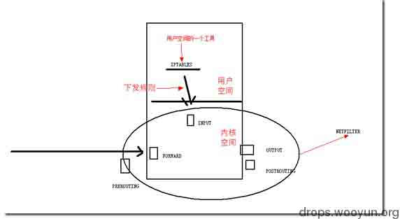
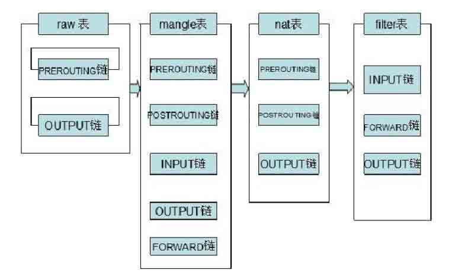
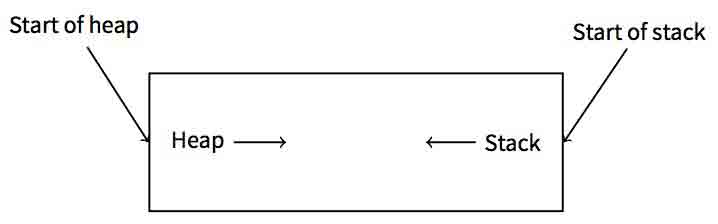
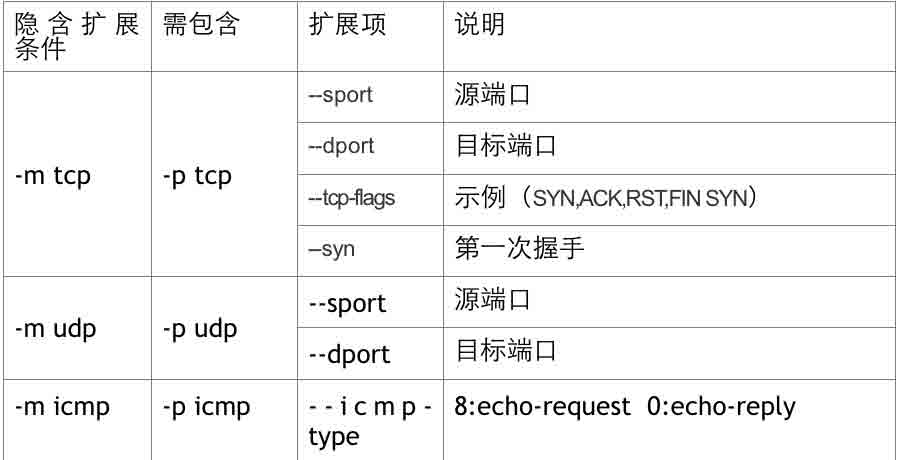
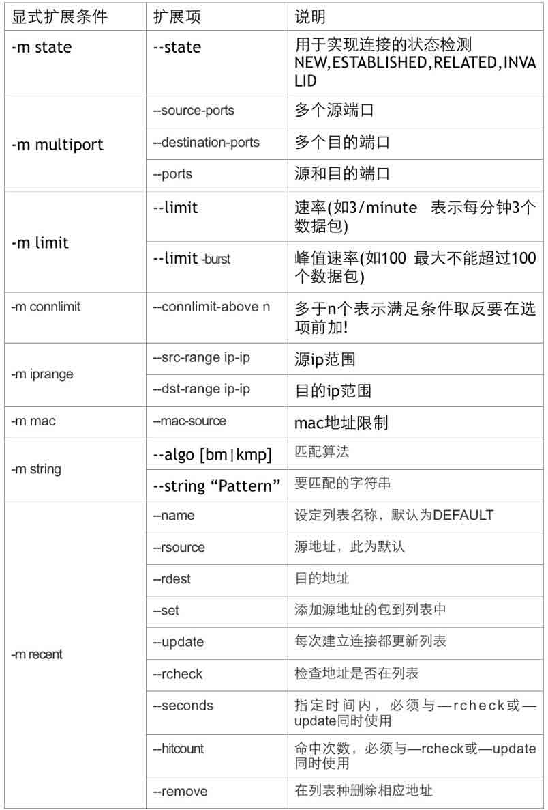

# Iptables 入门教程

2014/04/21 15:14 | [zhangsan](http://drops.wooyun.org/author/zhangsan "由 zhangsan 发布") | [技术分享](http://drops.wooyun.org/category/tips "查看 技术分享 中的全部文章"), [运维安全](http://drops.wooyun.org/category/%e8%bf%90%e7%bb%b4%e5%ae%89%e5%85%a8 "查看 运维安全 中的全部文章") | 占个座先 | 捐赠作者

## 0x00 iptables 介绍

* * *

linux 的包过滤功能，即 linux 防火墙，它由 netfilter 和 iptables 两个组件组成。

netfilter 组件也称为内核空间，是内核的一部分，由一些信息包过滤表组成，这些表包含内核用来控制信息包过滤处理的规则集。

iptables 组件是一种工具，也称为用户空间，它使插入、修改和除去信息包过滤表中的规则变得容易。



## 0x01 iptables 的结构

* * *

iptables 的结构：

```
iptables -> Tables -> Chains -> Rules 
```

简单地讲，tables 由 chains 组成，而 chains 又由 rules 组成。iptables 默认有四个表 Filter, NAT, Mangle, Raw，其对于的链如下图。



## 0x02 iptables 工作流程

* * *



## 0x03 filter 表详解

* * *

### 1\. 在 iptables 中，filter 表起过滤数据包的功能，它具有以下三种内建链：

```
INPUT 链 – 处理来自外部的数据。 
OUTPUT 链 – 处理向外发送的数据。 
FORWARD 链 – 将数据转发到本机的其他网卡设备上。 
```

### 2\. 数据流向场景

访问本机：在 INPUT 链上做过滤

本机访问外部：在 OUTPUT 链上做过滤

通过本机访问其他主机:在 FORWARD 链上做过滤

### 3\. Iptables 基本操作

启动 iptables：`service iptables start`

关闭 iptables：`service iptables stop`

重启 iptables：`service iptables restart`

查看 iptables 状态：`service iptables status`

保存 iptables 配置：`service iptables save`

Iptables 服务配置文件：`/etc/sysconfig/iptables-config`

Iptables 规则保存文件：`/etc/sysconfig/iptables`

打开 iptables 转发：`echo "1"> /proc/sys/net/ipv4/ip_forward`

## 0x04 iptables 命令参考

* * *

命令：

```
iptables [ -t 表名] 命令选项 [链名] [条件匹配] [-j 目标动作或跳转] 
```

### 1\. 表名

表名：`Filter, NAT, Mangle, Raw`

起包过滤功能的为表 Filter，可以不填，不填默认为 Filter

### 2\. 命令选项

| 选项名 | 功能及特点 |
| --- | --- |
| -A | 在指定链的末尾添加（--append）一条新的规则 |
| -D | 删除（--delete）指定链中的某一条规则，按规则序号或内容确定要删除的规则 |
| -I | 在指定链中插入（--insert）一条新的规则，默认在链的开头插入 |
| -R | 修改、替换（--replace）指定链中的一条规则，按规则序号或内容确定 |
| -L | 列出（--list）指定链中的所有的规则进行查看，默认列出表中所有链的内容 |
| -F | 清空（--flush）指定链中的所有规则，默认清空表中所有链的内容 |
| -N | 新建（--new-chain）一条用户自己定义的规则链 |
| -X | 删除指定表中用户自定义的规则链（--delete-chain） |
| -P | 设置指定链的默认策略（--policy） |
| -n | 用数字形式（--numeric）显示输出结果，若显示主机的 IP 地址而不是主机名 |
| -P | 设置指定链的默认策略（--policy） |
| -v | 查看规则列表时显示详细（--verbose）的信息 |
| -V | 查看 iptables 命令工具的版本（--Version）信息 |
| -h | 查看命令帮助信息（--help） |
| --line-number | 查看规则列表时，同时显示规则在链中的顺序号 |

### 3\. 链名

可以根据数据流向来确定具体使用哪个链，在 Filter 中的使用情况如下：

```
INPUT 链 – 处理来自外部的数据。 
OUTPUT 链 – 处理向外发送的数据。 
FORWARD 链 – 将数据转发到本机的其他网卡设备上。 
```

### 4\. 条件匹配

条件匹配分为基本匹配和扩展匹配，拓展匹配又分为隐式扩展和显示扩展。

a)基本匹配包括：

| 匹配参数 | 说明 |
| --- | --- |
| -p | 指定规则协议，如 tcp, udp,icmp 等，可以使用 all 来指定所有协议 |
| -s | 指定数据包的源地址参数，可以使 IP 地址、网络地址、主机名 |
| -d | 指定目的地址 |
| -i | 输入接口 |
| -o | 输出接口 |

b)隐式扩展包括：



c)常用显式扩展



### 5\. 目标值

数据包控制方式包括四种为：

```
ACCEPT：允许数据包通过。 
DROP：直接丢弃数据包，不给出任何回应信息。 
REJECT：拒绝数据包通过，必须时会给数据发送端一个响应信息。 
LOG：在/var/log/messages 文件中记录日志信息，然后将数据包传递给下一条规则。 
QUEUE：防火墙将数据包移交到用户空间 
RETURN：防火墙停止执行当前链中的后续 Rules，并返回到调用链(the calling chain) 
```

## 0x05 Iptables 常见命令

* * *

a) 1\. 删除 iptables 现有规则

```
iptables –F 
```

b) 2\. 查看 iptables 规则

```
iptables –L（iptables –L –v -n） 
```

c) 3\. 增加一条规则到最后

```
iptables -A INPUT -i eth0 -p tcp --dport 80 -m state --state NEW,ESTABLISHED -j ACCEPT 
```

d) 4.添加一条规则到指定位置

```
iptables -I INPUT 2 -i eth0 -p tcp --dport 80 -m state --state NEW,ESTABLISHED -j ACCEPT 
```

e) 5.  删除一条规则

```
iptabels -D INPUT 2 
```

f) 6.修改一条规则

```
iptables -R INPUT 3 -i eth0 -p tcp --dport 80 -m state --state NEW,ESTABLISHED -j ACCEPT 
```

g) 7\. 设置默认策略

```
iptables -P INPUT DROP 
```

h) 8.允许远程主机进行 SSH 连接

```
iptables -A INPUT -i eth0 -p tcp --dport 22 -m state --state NEW,ESTABLISHED -j ACCEPT 
iptables -A OUTPUT -o eth0 -p tcp --sport 22 -m state --state ESTABLISHED -j ACCEPT 
```

i) 9.允许本地主机进行 SSH 连接

```
iptables -A OUTPUT -o eth0 -p tcp --dport 22 -m state --state NEW,ESTABLISHED -j ACCEPT 
iptables -A INTPUT -i eth0 -p tcp --sport 22 -m state --state ESTABLISHED -j ACCEPT 
```

j) 10.允许 HTTP 请求

```
iptables -A INPUT -i eth0 -p tcp --dport 80 -m state --state NEW,ESTABLISHED -j ACCEPT 
iptables -A OUTPUT -o eth0 -p tcp --sport 80 -m state --state ESTABLISHED -j ACCEPT 
```

k) 11.限制 ping 192.168.146.3 主机的数据包数，平均 2/s 个，最多不能超过 3 个

```
iptables -A INPUT -i eth0 -d 192.168.146.3 -p icmp --icmp-type 8 -m limit --limit 2/second --limit-burst 3 -j ACCEPT 
```

l) 12.限制 SSH 连接速率(默认策略是 DROP)

```
iptables -I INPUT 1 -p tcp --dport 22 -d 192.168.146.3 -m state --state ESTABLISHED -j ACCEPT  
iptables -I INPUT 2 -p tcp --dport 22 -d 192.168.146.3 -m limit --limit 2/minute --limit-burst 2 -m state --state NEW -j ACCEPT 
```

## 0x06 如何正确配置 iptables

* * *

a) 1\. 删除现有规则

iptables -F

b) 2.  配置默认链策略

```
iptables -P INPUT DROP 
iptables -P FORWARD DROP 
iptables -P OUTPUT DROP 
```

c) 3\. 允许远程主机进行 SSH 连接

```
iptables -A INPUT -i eth0 -p tcp –dport 22 -m state –state NEW,ESTABLISHED -j ACCEPT 
iptables -A OUTPUT -o eth0 -p tcp –sport 22 -m state –state ESTABLISHED -j ACCEPT 
```

d) 4\. 允许本地主机进行 SSH 连接

```
iptables -A OUTPUT -o eth0 -p tcp –dport 22 -m state –state NEW,ESTABLISHED -j ACCEPT 
iptables -A INPUT -i eth0 -p tcp –sport 22 -m state –state ESTABLISHED -j ACCEPT 
```

e) 5\. 允许 HTTP 请求

```
iptables -A INPUT -i eth0 -p tcp –dport 80 -m state –state NEW,ESTABLISHED -j ACCEPT 
iptables -A OUTPUT -o eth0 -p tcp –sport 80 -m state –state ESTABLISHED -j ACCEPT 
```

## 0x07 使用 iptables 抵抗常见攻击

* * *

### 1.防止 syn 攻击

思路一：限制 syn 的请求速度（这个方式需要调节一个合理的速度值，不然会影响正常用户的请求）

```
iptables -N syn-flood 

iptables -A INPUT -p tcp --syn -j syn-flood 

iptables -A syn-flood -m limit --limit 1/s --limit-burst 4 -j RETURN 

iptables -A syn-flood -j DROP 
```

思路二：限制单个 ip 的最大 syn 连接数

```
iptables –A INPUT –i eth0 –p tcp --syn -m connlimit --connlimit-above 15 -j DROP 
```

### 2\. 防止 DOS 攻击

利用 recent 模块抵御 DOS 攻击

```
iptables -I INPUT -p tcp -dport 22 -m connlimit --connlimit-above 3 -j DROP 
```

单个 IP 最多连接 3 个会话

```
iptables -I INPUT -p tcp --dport 22 -m state --state NEW -m recent --set --name SSH 
```

只要是新的连接请求，就把它加入到 SSH 列表中

```
Iptables -I INPUT -p tcp --dport 22 -m state NEW -m recent --update --seconds 300 --hitcount 3 --name SSH -j DROP 
```

5 分钟内你的尝试次数达到 3 次，就拒绝提供 SSH 列表中的这个 IP 服务。被限制 5 分钟后即可恢复访问。

### 3\. 防止单个 ip 访问量过大

```
iptables -I INPUT -p tcp --dport 80 -m connlimit --connlimit-above 30 -j DROP 
```

### 4\. 木马反弹

```
iptables –A OUTPUT –m state --state NEW –j DROP 
```

### 5\. 防止 ping 攻击

```
iptables -A INPUT -p icmp --icmp-type echo-request -m limit --limit 1/m -j ACCEPT 
```

个人见解，不足之处求指正。

版权声明：未经授权禁止转载 [zhangsan](http://drops.wooyun.org/author/zhangsan "由 zhangsan 发布")@[乌云知识库](http://drops.wooyun.org)

分享到：

### 相关日志

*   [Mysql 安全配置](http://drops.wooyun.org/tips/2245)
*   [snmp 弱口令引起的信息泄漏](http://drops.wooyun.org/tips/409)
*   [fail2ban 防暴力破解介绍使用](http://drops.wooyun.org/tips/3029)
*   [MongoDB 安全配置](http://drops.wooyun.org/%e8%bf%90%e7%bb%b4%e5%ae%89%e5%85%a8/2470)
*   [使用 OpenSSH 证书认证](http://drops.wooyun.org/tips/1055)
*   [对 *nix WEB 服务器的一个隐藏威胁](http://drops.wooyun.org/tips/2646)