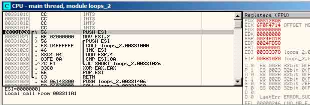
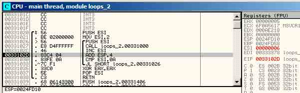
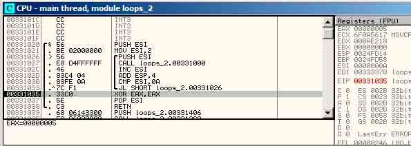
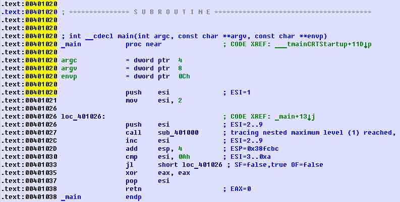
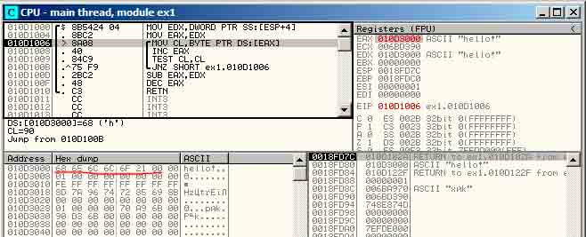
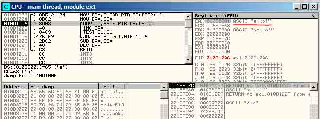
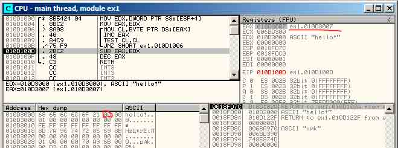
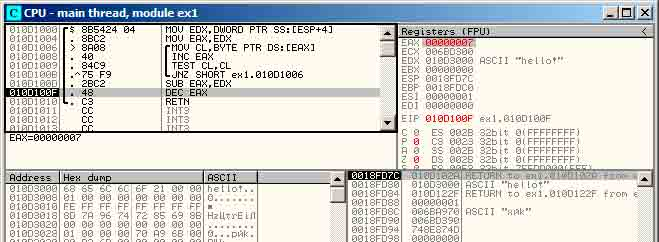
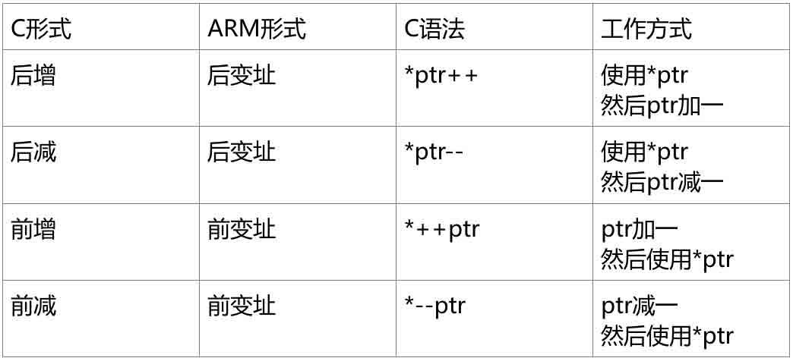

# 逆向基础（四）

2014/05/23 14:59 | [Reverse Engineering](http://drops.wooyun.org/author/reverse-engineering "由 Reverse Engineering 发布") | [二进制安全](http://drops.wooyun.org/category/binary "查看 二进制安全 中的全部文章"), [技术分享](http://drops.wooyun.org/category/tips "查看 技术分享 中的全部文章") | 占个座先 | 捐赠作者

## 第十一章

* * *

## 选择结构 switch()/case/default

## 11.1 一些例子

```
void f (int a)
{
    switch (a)
    {
        case 0: printf ("zero
"); break;
        case 1: printf ("one
"); break;
        case 2: printf ("two
"); break;
        default: printf ("something unknown
"); break;
    };
};

```

### 11.1.1 X86

反汇编结果如下（MSVC 2010）：

清单 11.1: MSVC 2010

```
tv64 = -4       ; size = 4
_a$ = 8         ; size = 4
_f  PROC
    push    ebp
    mov     ebp, esp
    push    ecx
    mov     eax, DWORD PTR _a$[ebp]
    mov     DWORD PTR tv64[ebp], eax
    cmp     DWORD PTR tv64[ebp], 0
    je      SHORT $LN4@f
    cmp     DWORD PTR tv64[ebp], 1
    je      SHORT $LN3@f
    cmp     DWORD PTR tv64[ebp], 2
    je      SHORT $LN2@f
    jmp     SHORT $LN1@f
$LN4@f:
    push    OFFSET $SG739 ; ’zero’, 0aH, 00H
    call    _printf
    add     esp, 4
    jmp     SHORT $LN7@f
$LN3@f:
    push    OFFSET $SG741 ; ’one’, 0aH, 00H
    call    _printf
    add     esp, 4
    jmp     SHORT $LN7@f
$LN2@f:
    push    OFFSET $SG743 ; ’two’, 0aH, 00H
    call    _printf
    add     esp, 4
    jmp     SHORT $LN7@f
$LN1@f:
    push    OFFSET $SG745 ; ’something unknown’, 0aH, 00H
    call    _printf
    add     esp, 4
$LN7@f:
    mov     esp, ebp
    pop     ebp
    ret     0
_f    ENDP

```

输出函数的 switch 中有一些 case 选择分支，事实上，它是和下面这个形式等价的：

```
void f (int a)
{
    if (a==0)
        printf ("zero
");
    else if (a==1)
        printf ("one
");
    else if (a==2)
        printf ("two
");
    else
        printf ("something unknown
");
};

```

当 switch()中有一些 case 分支时，我们可以看到此类代码，虽然不能确定，但是，事实上 switch()在机器码级别上就是对 if()的封装。这也就是说，switch()其实只是对有一大堆类似条件判断的 if()的一个语法糖。

在生成代码时，除了编译器把输入变量移动到一个临时本地变量 tv64 中之外，这块代码对我们来说并无新意。

如果是在 GCC 4.4.1 下编译同样的代码，我们得到的结果也几乎一样，即使你打开了最高优化（-O3）也是如此。

让我们在微软 VC 编译器中打开/Ox 优化选项： cl 1.c /Fa1.asm /Ox

清单 11.2: MSVC

```
_a$ = 8                 ; size = 4
_f  PROC
    mov     eax, DWORD PTR _a$[esp-4]
    sub     eax, 0
    je      SHORT $LN4@f
    sub     eax, 1
    je      SHORT $LN3@f
    sub     eax, 1
    je      SHORT $LN2@f
    mov     DWORD PTR _a$[esp-4], OFFSET $SG791 ; ’something unknown’, 0aH, 00H
    jmp     _printf
$LN2@f:
    mov     DWORD PTR _a$[esp-4], OFFSET $SG789 ; ’two’, 0aH, 00H
    jmp     _printf
$LN3@f:
    mov     DWORD PTR _a$[esp-4], OFFSET $SG787 ; ’one’, 0aH, 00H
    jmp     _printf
$LN4@f:
    mov     DWORD PTR _a$[esp-4], OFFSET $SG785 ; ’zero’, 0aH, 00H
    jmp     _printf
_f ENDP

```

我们可以看到浏览器做了更多的难以阅读的优化（Dirty hacks）。

首先，变量的值会被放入 EAX，接着 EAX 减 0。听起来这很奇怪，但它之后是需要检查先前 EAX 寄存器的值是否为 0 的，如果是，那么程序会设置上零标志位 ZF（这也表示了减去 0 之后，结果依然是 0），第一个条件跳转语句 JE（Jump if Equal 或者同义词 JZ - Jump if Zero）会因此触发跳转。如果这个条件不满足，JE 没有跳转的话，输入值将减去 1，之后就和之前的一样了，如果哪一次值是 0，那么 JE 就会触发，从而跳转到对应的处理语句上。

（译注：SUB 操作会重置零标志位 ZF，但是 MOV 不会设置标志位，而 JE 将只有在 ZF 标志位设置之后才会跳转。如果需要基于 EAX 的值来做 JE 跳转的话，是需要用这个方法设置标志位的）。

并且，如果没有 JE 语句被触发，最终，printf()函数将收到“something unknown”的参数。

其次：我们看到了一些不寻常的东西——字符串指针被放在了变量里，然后 printf()并没有通过 CALL，而是通过 JMP 来调用的。 这个可以很简单的解释清楚，调用者把参数压栈，然后通过 CALL 调用函数。CALL 通过把返回地址压栈，然后做无条件跳转来跳到我们的函数地址。我们的函数在执行时，不管在任何时候都有以下的栈结构（因为它没有任何移动栈指针的语句）：

```
· ESP —— 指向返回地址
· ESP+4 —— 指向变量 a （也即参数） 
```

另一方面，当我们这儿调用 printf()函数的时候，它也需要有与我们这个函数相同的栈结构，不同之处只在于 printf()的第一个参数是指向一个字符串的。 这也就是你之前看到的我们的代码所做的事情。

我们的代码把第一个参数的地址替换了，然后跳转到 printf()，就像第一个没有调用我们的函数 f()而是先调用了 printf()一样。 printf()把一串字符输出到 stdout 中，然后执行 RET 语句， 这一句会从栈上弹出返回地址，因此，此时控制流会返回到调用 f()的函数上，而不是 f()上。

这一切之所以能发生，是因为 printf()在 f()的末尾。在一些情况下，这有些类似于 longjmp()函数。当然，这一切只是为了提高执行速度。

ARM 编译器也有类似的优化，请见 5.3.2 节“带有多个参数的 printf()函数调用”。

### 11.1.2 ARM： 优化后的 Keil + ARM 模式

```
.text:0000014C             f1
.text:0000014C 00 00 50 E3          CMP R0, #0
.text:00000150 13 0E 8F 02          ADREQ R0, aZero     ; "zero
"
.text:00000154 05 00 00 0A          BEQ loc_170
.text:00000158 01 00 50 E3          CMP R0, #1
.text:0000015C 4B 0F 8F 02          ADREQ R0, aOne      ; "one
"
.text:00000160 02 00 00 0A          BEQ loc_170
.text:00000164 02 00 50 E3          CMP R0, #2
.text:00000168 4A 0F 8F 12          ADRNE R0, aSomethingUnkno ; "something unknown
"
.text:0000016C 4E 0F 8F 02          ADREQ R0, aTwo      ; "two
"
.text:00000170
.text:00000170                      loc_170             ; CODE XREF: f1+8
.text:00000170                                          ; f1+14
.text:00000170 78 18 00 EA          B __2printf

```

我们再一次看看这个代码，我们不能确定的说这就是源代码里面的 switch()或者说它是 if()的封装。

但是，我们可以看到这里它也在试图预测指令（像是 ADREQ（相等）），这里它会在 R0=0 的情况下触发，并且字符串“zero”的地址将被加载到 R0 中。如果 R0=0，下一个指令 BEQ 将把控制流定向到 loc_170 处。顺带一说，机智的读者们可能会文，之前的 ADREQ 已经用其他值填充了 R0 寄存器了，那么 BEQ 会被正确触发吗？答案是“是”。因为 BEQ 检查的是 CMP 所设置的标记位，但是 ADREQ 根本没有修改标记位。

还有，在 ARM 中，一些指令还会加上-S 后缀，这表明指令将会根据结果设置标记位。如果没有-S 的话，表明标记位并不会被修改。比如，ADD（而不是 ADDS）将会把两个操作数相加，但是并不会涉及标记位。这类指令对使用 CMP 设置标记位之后使用标记位的指令，例如条件跳转来说非常有用。

其他指令对我们来说已经很熟悉了。这里只有一个调用指向 printf（），在末尾，我们已经知道了这个小技巧（见 5.3.2 节）。在末尾处有三个指向 printf（）的地址。 还有，需要注意的是如果 a=2 但是 a 并不在它的选择分支给定的常数中时，“CMP R0, #2”指令在这个情况下就需要知道 a 是否等于 2。如果结果为假，ADRNE 将会读取字符串“something unknown
”到 R0 中，因为 a 在之前已经和 0、1 做过是否相等的判断了，这里我们可以假定 a 并不等于 0 或者 1。并且，如果 R0=2，a 指向的字符串“two
”将会被 ADREQ 载入 R0。

### 11.1.3 ARM： 优化后的 Keil + thumb 模式

```
.text:000000D4          f1
.text:000000D4 10 B5            PUSH    {R4,LR}
.text:000000D6 00 28            CMP     R0, #0
.text:000000D8 05 D0            BEQ     zero_case
.text:000000DA 01 28            CMP     R0, #1
.text:000000DC 05 D0            BEQ     one_case
.text:000000DE 02 28            CMP     R0, #2
.text:000000E0 05 D0            BEQ     two_case
.text:000000E2 91 A0            ADR     R0, aSomethingUnkno ; "something unknown
"
.text:000000E4 04 E0            B       default_case
.text:000000E6 ;
-------------------------------------------------------------------------
.text:000000E6          zero_case                           ; CODE XREF: f1+4
.text:000000E6 95 A0            ADR     R0, aZero           ; "zero
"
.text:000000E8 02 E0            B       default_case
.text:000000EA ;
-------------------------------------------------------------------------
.text:000000EA          one_case                            ; CODE XREF: f1+8
.text:000000EA 96 A0            ADR     R0, aOne            ; "one
"
.text:000000EC 00 E0            B       default_case
.text:000000EE          ;
-------------------------------------------------------------------------
.text:000000EE          two_case                            ; CODE XREF: f1+C
.text:000000EE 97 A0            ADR     R0, aTwo            ; "two
"
.text:000000F0                  default_case                ; CODE XREF: f1+10
.text:000000F0                                              ; f1+14
.text:000000F0 06 F0 7E F8      BL      __2printf
.text:000000F4 10 BD            POP     {R4,PC}
.text:000000F4           ; End of function f1

```

正如我之前提到的，在 thumb 模式下并没有什么功能来连接预测结果，所以这里的 thumb 代码有点像容易理解的 x86 CISC 代码。

## 11.2 许多例子

在有许多 case 分支的 switch()语句中，对编译器来说，转换出一大堆 JE/JNE 语句并不是太方便。

```
void f (int a)
{
    switch (a)
    {
        case 0: printf ("zero
"); break;
        case 1: printf ("one
"); break;
        case 2: printf ("two
"); break;
        case 3: printf ("three
"); break;
        case 4: printf ("four
"); break;
        default: printf ("something unknown
"); break;
    };
};

```

### 11.2.1 x86

反汇编结果如下（MSVC 2010）：

清单 11.3: MSVC 2010

```
tv64 = -4           ; size = 4
_a$ = 8             ; size = 4
_f      PROC
    push    ebp
    mov     ebp, esp
    push    ecx
    mov     eax, DWORD PTR _a$[ebp]
    mov     DWORD PTR tv64[ebp], eax
    cmp     DWORD PTR tv64[ebp], 4
    ja      SHORT $LN1@f
    mov     ecx, DWORD PTR tv64[ebp]
    jmp     DWORD PTR $LN11@f[ecx*4]
$LN6@f:
    push    OFFSET $SG739 ; ’zero’, 0aH, 00H
    call    _printf
    add     esp, 4
    jmp     SHORT $LN9@f
$LN5@f:
    push    OFFSET $SG741 ; ’one’, 0aH, 00H
    call    _printf
    add     esp, 4
    jmp     SHORT $LN9@f
$LN4@f:
    push    OFFSET $SG743 ; ’two’, 0aH, 00H
    call    _printf
    add     esp, 4
    jmp     SHORT $LN9@f
$LN3@f:
    push    OFFSET $SG745 ; ’three’, 0aH, 00H
    call    _printf
    add     esp, 4
    jmp     SHORT $LN9@f
$LN2@f:
    push    OFFSET $SG747 ; ’four’, 0aH, 00H
    call    _printf
    add     esp, 4
    jmp     SHORT $LN9@f
$LN1@f:
    push    OFFSET $SG749 ; ’something unknown’, 0aH, 00H
    call    _printf
    add     esp, 4
$LN9@f:
    mov     esp, ebp
    pop     ebp
    ret     0
    npad    2
$LN11@f:
    DD  $LN6@f ; 0
    DD  $LN5@f ; 1
    DD  $LN4@f ; 2
    DD  $LN3@f ; 3
    DD  $LN2@f ; 4
_f     ENDP

```

好的，我们可以看到这儿有一组不同参数的 printf()调用。 它们不仅有内存中的地址，编译器还给它们带上了符号信息。顺带一提，这些符号标签也都存在于$LN11@f 内部函数表中。

在函数最开始，如果 a 大于 4，控制流将会被传递到标签$LN1@f 上，这儿会有一个参数为“something unknown”的 printf()调用。

如果 a 值小于等于 4，然后我们把它乘以 4，加上$LN1@f 的函数地址。这就是在函数表内部构造地址的方法，这样可以正好指向我们需要的元素。比如 a 等于 2。 那么，2×4=8（在 32 位进程下，所有的函数表元素的长度都只有 4 字节），$LN11@f 的函数表地址+8——这样就能取得$LN4@f 标签的位置。 JMP 将从函数表中获得$LN4@f 的地址，然后跳转向它。

这个函数表，有时候也叫做跳转表（jumptable）。

然后，对应的，printf()的参数就是“two”了。 字面意思， JMP DWORD PTR $LN11@f[ECX*4] 指令意味着“ 跳转到存储在$LN11@f + ecx * 4 地址上的双字”。 npad（64）是一个编译时语言宏，它用于对齐下一个标签，这样存储的地址就会按照 4 字节（或者 16 字节）对齐。这个对于处理器来说是十分合适的，因为通过内存总线、缓存从内存中获取 32 位的值是非常方便而且有效率的。

让我们看看 GCC 4.4.1 生成的代码：

清单 11.4： GCC 4.4.1

```
        public f
f       proc near ; CODE XREF: main+10

var_18  = dword ptr -18h
arg_0   = dword ptr 8
        push    ebp
        mov     ebp, esp
        sub     esp, 18h ; char *
        cmp     [ebp+arg_0], 4
        ja      short loc_8048444
        mov     eax, [ebp+arg_0]
        shl     eax, 2
        mov     eax, ds:off_804855C[eax]
        jmp     eax
loc_80483FE:                    ; DATA XREF: .rodata:off_804855C
        mov     [esp+18h+var_18], offset aZero ; "zero"
        call    _puts
        jmp     short locret_8048450
loc_804840C:                    ; DATA XREF: .rodata:08048560
        mov     [esp+18h+var_18], offset aOne ; "one"
        call    _puts
        jmp     short locret_8048450
loc_804841A:                    ; DATA XREF: .rodata:08048564
        mov     [esp+18h+var_18], offset aTwo ; "two"
        call    _puts
        jmp     short locret_8048450
loc_8048428:                    ; DATA XREF: .rodata:08048568
        mov     [esp+18h+var_18], offset aThree ; "three"
        call    _puts
        jmp     short locret_8048450
loc_8048436:                    ; DATA XREF: .rodata:0804856C
        mov     [esp+18h+var_18], offset aFour ; "four"
        call    _puts
        jmp     short locret_8048450
loc_8048444:                    ; CODE XREF: f+A
        mov     [esp+18h+var_18], offset aSomethingUnkno ; "something unknown"
        call    _puts
locret_8048450:                 ; CODE XREF: f+26
                                ; f+34...
        leave
        retn
f       endp

off_804855C dd offset loc_80483FE ; DATA XREF: f+12
            dd offset loc_804840C
            dd offset loc_804841A
            dd offset loc_8048428
            dd offset loc_8048436

```

基本和 VC 生成的相同，除了少许的差别：参数 arg_0 的乘以 4 操作被左移 2 位替换了（这集合和乘以 4 一样）（见 17.3.1 节）。 然后标签地址从 off_804855C 处的数组获取，地址计算之后存储到 EAX 中，然后通过 JMP EAX 跳转到实际的地址上。

### 11.2.2 ARM： 优化后的 Keil + ARM 模式

```
00000174                f2
00000174 05 00 50 E3            CMP     R0, #5                  ; switch 5 cases
00000178 00 F1 8F 30            ADDCC   PC, PC, R0,LSL#2        ; switch jump
0000017C 0E 00 00 EA            B       default_case            ; jumptable 00000178 default case
00000180                ; -------------------------------------------------------------------------
00000180
00000180                loc_180                         ; CODE XREF: f2+4
00000180 03 00 00 EA            B       zero_case       ; jumptable 00000178 case 0
00000184                ; -------------------------------------------------------------------------
00000184
00000184                loc_184                         ; CODE XREF: f2+4
00000184 04 00 00 EA            B       one_case        ; jumptable 00000178 case 1
00000188                ; -------------------------------------------------------------------------
00000188
00000188                loc_188                         ; CODE XREF: f2+4
00000188 05 00 00 EA            B       two_case        ; jumptable 00000178 case 2
0000018C                ; -------------------------------------------------------------------------
0000018C
0000018C                loc_18C                         ; CODE XREF: f2+4
0000018C 06 00 00 EA            B       three_case      ; jumptable 00000178 case 3
00000190                ; -------------------------------------------------------------------------
00000190
00000190                loc_190                         ; CODE XREF: f2+4
00000190 07 00 00 EA            B       four_case       ; jumptable 00000178 case 4
00000194                ; -------------------------------------------------------------------------
00000194
00000194                zero_case                       ; CODE XREF: f2+4
00000194                                                ; f2:loc_180
00000194 EC 00 8F E2            ADR     R0, aZero       ; jumptable 00000178 case 0
00000198 06 00 00 EA            B       loc_1B8
0000019C                ; -------------------------------------------------------------------------
0000019C
0000019C one_case                                       ; CODE XREF: f2+4
0000019C                                                ; f2:loc_184
0000019C EC 00 8F E2            ADR     R0, aOne        ; jumptable 00000178 case 1
000001A0 04 00 00 EA            B       loc_1B8
000001A4                ; -------------------------------------------------------------------------
000001A4
000001A4                two_case                        ; CODE XREF: f2+4
000001A4                                                ; f2:loc_188
000001A4 01 0C 8F E2            ADR     R0, aTwo        ; jumptable 00000178 case 2
000001A8 02 00 00 EA            B       loc_1B8
000001AC                ; -------------------------------------------------------------------------
000001AC
000001AC                three_case                      ; CODE XREF: f2+4
000001AC                                                ; f2:loc_18C
000001AC 01 0C 8F E2            ADR     R0, aThree ; jumptable 00000178 case 3
000001B0 00 00 00 EA            B       loc_1B8
000001B4 ; -------------------------------------------------------------------------
000001B4
000001B4                four_case                       ; CODE XREF: f2+4
000001B4                                                ; f2:loc_190
000001B4 01 0C 8F E2            ADR     R0, aFour       ; jumptable 00000178 case 4
000001B8
000001B8                loc_1B8                         ; CODE XREF: f2+24
000001B8                                                ; f2+2C
000001B8 66 18 00 EA            B       __2printf
000001BC ; -------------------------------------------------------------------------
000001BC
000001BC                default_case                    ; CODE XREF: f2+4
000001BC                                                ; f2+8
000001BC D4 00 8F E2            ADR     R0, aSomethingUnkno ; jumptable 00000178 default case
000001C0 FC FF FF EA            B       loc_1B8
000001C0                ; End of function f2

```

这个代码利用了 ARM 的特性，这里 ARM 模式下所有指令都是 4 个字节。

让我们记住 a 的最大值是 4，任何更大额值都会导致它输出“something unknown
”。

最开始的“CMP R0, #5”指令将 a 的值与 5 比较。

下一个“ADDCC PC, PC, R0, LSL#2”指令将仅在 R0<5 的时候执行（CC = Carry clear ， 小于）。所以，如果 ADDCC 并没有触发（R0>=5 时），它将会跳转到 default _case 标签上。

但是，如果 R0<5，而且 ADDCC 触发了，将会发生下列事情：

R0 中的值会乘以 4，事实上，LSL#2 代表着“左移 2 位”，但是像我们接下来（见 17.3.1 节）要看到的“移位”一样，左移 2 位代表乘以 4。

然后，我们得到了 R0 * 4 的值，这个值将会和 PC 中现有的值相加，因此跳转到下述其中一个 B（Branch 分支）指令上。

在 ADDCC 执行时，PC 中的值（0x180）比 ADDCC 指令的值（0x178）提前 8 个字节，换句话说，提前 2 个指令。

这也就是为 ARM 处理器通道工作的方式：当 ADDCC 指令执行的时候，此时处理器将开始处理下一个指令，这也就是 PC 会指向这里的原因。

如果 a=0，那么 PC 将不会和任何值相加，PC 中实际的值将写入 PC 中（它相对之领先 8 个字节），然后跳转到标签 loc_180 处。这就是领先 ADDCC 指令 8 个字节的地方。

在 a=1 时，PC+8+a*4 = PC+8+1*4 = PC+16= 0x184 将被写入 PC 中，这是 loc_184 标签的地址。

每当 a 上加 1，PC 都会增加 4，4 也是 ARM 模式的指令长度，而且也是 B 指令的长度。这组里面有 5 个这样的指令。

这 5 个 B 指令将传递控制流，也就是传递 switch（）中指定的字符串和对应的操作等等。

### 11.2.3 ARM： 优化后的 Keil + thumb 模式

```
000000F6                        EXPORT  f2
000000F6                f2
000000F6 10 B5                  PUSH    {R4,LR}
000000F8 03 00                  MOVS    R3, R0
000000FA 06 F0 69 F8            BL      __ARM_common_switch8_thumb ; switch 6 cases
000000FA                ;
-------------------------------------------------------------------------
000000FE 05                     DCB 5
000000FF 04 06 08 0A 0C 10      DCB 4, 6, 8, 0xA, 0xC, 0x10 ; jump table for switch
statement
00000105 00                     ALIGN 2
00000106
00000106                zero_case                       ; CODE XREF: f2+4
00000106 8D A0                  ADR       R0, aZero       ; jumptable 000000FA case 0
00000108 06 E0                  B       loc_118
0000010A ;
-------------------------------------------------------------------------
0000010A
0000010A                    one_case                    ; CODE XREF: f2+4
0000010A 8E A0                  ADR       R0, aOne        ; jumptable 000000FA case 1
0000010C 04 E0                  B       loc_118
0000010E ;
-------------------------------------------------------------------------
0000010E
0000010E                    two_case                    ; CODE XREF: f2+4
0000010E 8F A0                  ADR       R0, aTwo        ; jumptable 000000FA case 2
00000110 02 E0                  B       loc_118
00000112 ;
-------------------------------------------------------------------------
00000112
00000112                    three_case                  ; CODE XREF: f2+4
00000112 90 A0                  ADR       R0, aThree      ; jumptable 000000FA case 3
00000114 00 E0                  B       loc_118
00000116 ;
-------------------------------------------------------------------------
00000116
00000116                    four_case                   ; CODE XREF: f2+4
00000116 91 A0                  ADR       R0, aFour       ; jumptable 000000FA case 4
00000118
00000118                    loc_118                     ; CODE XREF: f2+12
00000118                                                ; f2+16
00000118 06 F0 6A F8            BL        __2printf
0000011C 10 BD                  POP       {R4,PC}
0000011E ;
-------------------------------------------------------------------------
0000011E
0000011E                    default_case                ; CODE XREF: f2+4
0000011E 82 A0                  ADR       R0, aSomethingUnkno ; jumptable 000000FA default
case
00000120 FA E7                  B         loc_118

000061D0                        EXPORT __ARM_common_switch8_thumb
000061D0                    __ARM_common_switch8_thumb ; CODE XREF: example6_f2+4
000061D0 78 47                  BX          PC
000061D0                    ;
---------------------------------------------------------------------------
000061D2 00 00                  ALIGN 4
000061D2                    ; End of function __ARM_common_switch8_thumb
000061D2
000061D4                        CODE32
000061D4
000061D4                    ; =============== S U B R O U T I N E
=======================================
000061D4
000061D4
000061D4                    __32__ARM_common_switch8_thumb  ; CODE XREF:
    __ARM_common_switch8_thumb
000061D4 01 C0 5E E5            LDRB    R12, [LR,#-1]
000061D8 0C 00 53 E1            CMP     R3, R12
000061DC 0C 30 DE 27            LDRCSB  R3, [LR,R12]
000061E0 03 30 DE 37            LDRCCB  R3, [LR,R3]
000061E4 83 C0 8E E0            ADD     R12, LR, R3,LSL#1
000061E8 1C FF 2F E1            BX      R12
000061E8                ; End of function __32__ARM_common_switch8_thumb

```

一个不能确定的事实是 thumb、thumb-2 中的所有指令都有同样的大小。甚至可以说是在这些模式下，指令的长度是可变的，就像 x86 一样。

所以这一定有一个特别的表单，里面包含有多少个 case（除了默认的 case），然后和它们的偏移，并且给他们每个都加上一个标签，这样控制流就可以传递到正确的位置。 这里有一个特别的函数来处理表单和处理控制流，被命名为 __ARM_common_switch8_thumb。它由“BX PC”指令开始，这个函数用来将处理器切换到 ARM 模式，然后你就可以看到处理表单的函数。不过对我们来说，在这里解释它太复杂了，所以我们将省去一些细节。

但是有趣的是，这个函数使用 LR 寄存器作为表单的指针。还有，在这个函数调用后，LR 将包含有紧跟着“BL __ARM_common_switch8_thumb”指令的地址，然后表单就由此开始。

当然，这里也不值得去把生成的代码作为单独的函数，然后再去重用它们。因此在 switch（）处理相似的位置、相似的 case 时编译器并不会生成相同的代码。

IDA 成功的发觉到它是一个服务函数以及函数表，然后给各个标签加上了合适的注释，比如 jumptable 000000FA case 0。

## 第十二章 循环结构

* * *

## 12.1 x86

在 x86 指令集中，有一些独特的 LOOP 指令，它们会检查 ECX 中的值，如果它不是 0 的话，它会逐渐递减 ECX 的值（减一），然后把控制流传递给 LOOP 操作符提供的标签处。也许，这个指令并不是多方便，所以，我没有看到任何现代编译器自动使用它。如果你看到哪里的代码用了这个结构，那它很有可能是程序员手写的汇编代码。

顺带一提，作为家庭作业，你可以试着解释以下为什么这个指令如此不方便。

C/C++循环操作是由 for()、while()、do/while()命令发起的。

让我们从 for()开始吧。

这个命令定义了循环初始值（为循环计数器设置初值），循环条件（比如，计数器是否大于一个阈值？），以及在每次迭代（增/减）时和循环体中做什么。

```
for (初始化； 条件； 每次迭代时执行的语句)
｛
    循环体；
｝ 
```

所以，它生成的代码也将被考虑为 4 个部分。

让我们从一个简单的例子开始吧：

```
#include <stdio.h>
void f(int i)
{
    printf ("f(%d)
", i);
};
int main()
{
    int i;
    for (i=2; i<10; i++)
    f(i);
    return 0;
};

```

反汇编结果如下（MSVC 2010）：

清单 12.1: MSVC 2010

```
_i$ = -4
_main     PROC
        push    ebp
        mov     ebp, esp
        push    ecx
        mov     DWORD PTR _i$[ebp], 2       ; loop initialization
        jmp     SHORT $LN3@main
$LN2@main:
        mov     eax, DWORD PTR _i$[ebp]     ; here is what we do after each iteration:
        add     eax, 1                      ; add 1 to i value
        mov     DWORD PTR _i$[ebp], eax
$LN3@main:
        cmp     DWORD PTR _i$[ebp], 10      ; this condition is checked *before* each iteration
        jge     SHORT $LN1@main             ; if i is biggest or equals to 10, let’s finish loop
        mov     ecx, DWORD PTR _i$[ebp]     ; loop body: call f(i)
        push    ecx
        call    _f
        add     esp, 4
        jmp     SHORT $LN2@main             ; jump to loop begin
$LN1@main:                                  ; loop end
        xor     eax, eax
        mov     esp, ebp
        pop     ebp
        ret     0
_main ENDP

```

看起来没什么特别的。

GCC 4.4.1 生成的代码也基本相同，只有一些微妙的区别。

清单 12.1: GCC 4.4.1

```
main        proc near           ; DATA XREF: _start+17
var_20      = dword ptr -20h
var_4       = dword ptr -4
            push    ebp
            mov     ebp, esp
            and     esp, 0FFFFFFF0h
            sub     esp, 20h
            mov     [esp+20h+var_4], 2 ; i initializing
            jmp     short loc_8048476
loc_8048465:
            mov     eax, [esp+20h+var_4]
            mov     [esp+20h+var_20], eax
            call    f
            add     [esp+20h+var_4], 1 ; i increment
loc_8048476:
            cmp     [esp+20h+var_4], 9
            jle     short loc_8048465 ; if i<=9, continue loop
            mov     eax, 0
            leave
            retn
main        endp

```

现在，让我们看看如果我们打开了优化开关会得到什么结果（/Ox）：

清单 12.3: 优化后的 MSVC

```
_main PROC
    push esi
    mov esi, 2
$LL3@main:
    push esi
    call _f
    inc esi
    add esp, 4
    cmp esi, 10 ; 0000000aH
    jl SHORT $LL3@main
    xor eax, eax
    pop esi
    ret 0
_main ENDP

```

要说它做了什么，那就是：本应在栈上分配空间的变量 i 被移动到了寄存器 ESI 里面。因为我们这样一个小函数并没有这么多的本地变量，所以它才可以这么做。 这么做的话，一个重要的条件是函数 f（）不能改变 ESI 的值。我们的编译器在这里倒是非常确定。假设编译器决定在 f（）中使用 ESI 寄存器的话，ESI 的值将在函数的初始化阶段被压入栈保存，并且在函数的收尾阶段将其弹出（注：即还原现场，保证程序片段执行前后某个寄存器值不变）。这个操作有点像函数开头和结束时的 PUSH ESI/ POP ESI 操作对。

让我们试一试开启了最高优化的 GCC 4.4.1（-03 优化）。

清单 12.4: 优化后的 GCC 4.4.1

```
main    proc near
var_10  = dword ptr -10h
        push    ebp
        mov     ebp, esp
        and     esp, 0FFFFFFF0h
        sub     esp, 10h
        mov     [esp+10h+var_10], 2
        call    f
        mov     [esp+10h+var_10], 3
        call    f
        mov     [esp+10h+var_10], 4
        call    f
        mov     [esp+10h+var_10], 5
        call    f
        mov     [esp+10h+var_10], 6
        call    f
        mov     [esp+10h+var_10], 7
        call    f
        mov     [esp+10h+var_10], 8
        call    f
        mov     [esp+10h+var_10], 9
        call    f
        xor     eax, eax
        leave
        retn
main endp

```

GCC 直接把我们的循环给分解成顺序结构了。

循环分解（Loop unwinding）对这些没有太多迭代次数的循环结构来说是比较有利的，移除所有循环结构之后程序的效率会得到提升。但是，这样生成的代码明显会变得很大。

好的，现在我们把循环的最大值改为 100。GCC 现在生成如下：

清单 12.5: GCC

```
        public main
main    proc near
var_20  = dword ptr -20h
        push    ebp
        mov     ebp, esp
        and     esp, 0FFFFFFF0h
        push    ebx
        mov     ebx, 2 ; i=2
        sub     esp, 1Ch
        nop     ; aligning label loc_80484D0 (loop body begin) by 16-byte border
loc_80484D0:
        mov     [esp+20h+var_20], ebx ; pass i as first argument to f()
        add     ebx, 1 ; i++
        call    f
        cmp     ebx, 64h ; i==100?
        jnz     short loc_80484D0 ; if not, continue
        add     esp, 1Ch
        xor     eax, eax ; return 0
        pop     ebx
        mov     esp, ebp
        pop     ebp
        retn
main endp

```

这时，代码看起来非常像 MSVC 2010 开启/Ox 优化后生成的代码。除了这儿它用了 EBX 来存储变量 i。 GCC 也确信 f（）函数中不会修改 EBX 的值，假如它要用到 EBX 的话，它也一样会在函数初始化和收尾时保存 EBX 和还原 EBX，就像这里 main（）函数做的事情一样。

### 12.1.1 OllyDbg

让我们通过/Ox 和/Ob0 编译程序，然后放到 OllyDbg 里面查看以下结果。

看起来 OllyDbg 能够识别简单的循环，然后把它们放在一块，为了演示方便，大家可以看图 12.1。

通过跟踪代码（F8， 步过）我们可以看到 ESI 是如何递增的。这里的例子是 ESI = i = 6： 图 12.2。

9 是 i 的最后一个循环制，这也就是为什么 JL 在递增的最后不会触发，之后函数结束，如图 12.3。



图 12.1： OllyDbg main（）开始



图 12.2： OllyDbg： 循环体刚刚递增了 i，现在 i=6



图 12.3： OllyDbg 中 ESI=10，循环终止

### 12.1.2 跟踪

像我们所见的一样，手动在调试器里面跟踪代码并不是一件方便的事情。这也就是我给自己写了一个跟踪程序的原因。

我在 IDA 中打开了编译后的例子，然后找到了 PUSH ESI 指令（作用：给 f（）传递唯一的参数）的地址，对我的机器来说是 0x401026，然后我运行了跟踪器：

```
tracer.exe -l:loops_2.exe bpx=loops_2.exe!0x00401026

```

BPX 的作用只是在对应地址上设置断点然后输出寄存器状态。

在 tracer.log 中我看到执行后的结果：

```
PID=12884|New process loops_2.exe
(0) loops_2.exe!0x401026
EAX=0x00a328c8 EBX=0x00000000 ECX=0x6f0f4714 EDX=0x00000000
ESI=0x00000002 EDI=0x00333378 EBP=0x0024fbfc ESP=0x0024fbb8
EIP=0x00331026
FLAGS=PF ZF IF
(0) loops_2.exe!0x401026
EAX=0x00000005 EBX=0x00000000 ECX=0x6f0a5617 EDX=0x000ee188
ESI=0x00000003 EDI=0x00333378 EBP=0x0024fbfc ESP=0x0024fbb8
EIP=0x00331026
FLAGS=CF PF AF SF IF
(0) loops_2.exe!0x401026
EAX=0x00000005 EBX=0x00000000 ECX=0x6f0a5617 EDX=0x000ee188
ESI=0x00000004 EDI=0x00333378 EBP=0x0024fbfc ESP=0x0024fbb8
EIP=0x00331026
FLAGS=CF PF AF SF IF
(0) loops_2.exe!0x401026
EAX=0x00000005 EBX=0x00000000 ECX=0x6f0a5617 EDX=0x000ee188
ESI=0x00000005 EDI=0x00333378 EBP=0x0024fbfc ESP=0x0024fbb8
EIP=0x00331026
FLAGS=CF AF SF IF
(0) loops_2.exe!0x401026
EAX=0x00000005 EBX=0x00000000 ECX=0x6f0a5617 EDX=0x000ee188
ESI=0x00000006 EDI=0x00333378 EBP=0x0024fbfc ESP=0x0024fbb8
EIP=0x00331026
FLAGS=CF PF AF SF IF
(0) loops_2.exe!0x401026
EAX=0x00000005 EBX=0x00000000 ECX=0x6f0a5617 EDX=0x000ee188
ESI=0x00000007 EDI=0x00333378 EBP=0x0024fbfc ESP=0x0024fbb8
EIP=0x00331026
FLAGS=CF AF SF IF
(0) loops_2.exe!0x401026
EAX=0x00000005 EBX=0x00000000 ECX=0x6f0a5617 EDX=0x000ee188
ESI=0x00000008 EDI=0x00333378 EBP=0x0024fbfc ESP=0x0024fbb8
EIP=0x00331026
FLAGS=CF AF SF IF
(0) loops_2.exe!0x401026
EAX=0x00000005 EBX=0x00000000 ECX=0x6f0a5617 EDX=0x000ee188
ESI=0x00000009 EDI=0x00333378 EBP=0x0024fbfc ESP=0x0024fbb8
EIP=0x00331026
FLAGS=CF PF AF SF IF
PID=12884|Process loops_2.exe exited. ExitCode=0 (0x0)

```

我们可以看到 ESI 寄存器是如何从 2 变为 9 的。

甚至于跟踪器可以收集某个函数调用内所有寄存器的值，所以它被叫做跟踪器（a trace）。每个指令都会被它跟踪上，所有感兴趣的寄存器值都会被它提示出来，然后收集下来。 然后可以生成 IDA 能用的.idc-script。所以，在 IDA 中我知道了 main()函数地址是 0x00401020，然后我执行了：

```
tracer.exe -l:loops_2.exe bpf=loops_2.exe!0x00401020,trace:cc

```

bpf 的意思是在函数上设置断点。

结果是我得到了 loops_2.exe.idc 和 loops_2.exe_clear.idc 两个脚本。我加载 loops_2.idc 到 IDA 中，然后可以看到图 12.4 所示的内容。

我们可以看到 ESI 在循环体开始时从 2 变化为 9，但是在递增完之后，它的值从 9（译注：作者原文是 3，但是揣测是笔误，应为 9。）变为了 0xA（10）。我们也可以看到 main（）函数结束时 EAX 被设置为了 0。

编译器也生成了 loops_2.exe.txt，包含有每个指令执行了多少次和寄存器值的一些信息：

清单 12.6: loops_2.exe.txt

```
0x401020 (.text+0x20), e= 1 [PUSH ESI] ESI=1
0x401021 (.text+0x21), e= 1 [MOV ESI, 2]
0x401026 (.text+0x26), e= 8 [PUSH ESI] ESI=2..9
0x401027 (.text+0x27), e= 8 [CALL 8D1000h] tracing nested maximum level (1) reached,
skipping this CALL 8D1000h=0x8d1000
0x40102c (.text+0x2c), e= 8 [INC ESI] ESI=2..9
0x40102d (.text+0x2d), e= 8 [ADD ESP, 4] ESP=0x38fcbc
0x401030 (.text+0x30), e= 8 [CMP ESI, 0Ah] ESI=3..0xa
0x401033 (.text+0x33), e= 8 [JL 8D1026h] SF=false,true OF=false
0x401035 (.text+0x35), e= 1 [XOR EAX, EAX]
0x401037 (.text+0x37), e= 1 [POP ESI]
0x401038 (.text+0x38), e= 1 [RETN] EAX=0

```

生成的代码可以在此使用：



图 12.4： IDA 加载了.idc-script 之后的内容

## 12.2 ARM

### 12.2.1 无优化 Keil + ARM 模式

```
main
    STMFD   SP!, {R4,LR}
    MOV     R4, #2
    B       loc_368
; ---------------------------------------------------------------------------

loc_35C                 ; CODE XREF: main+1C
    MOV     R0, R4
    BL      f
    ADD     R4, R4, #1
loc_368                 ; CODE XREF: main+8
    CMP     R4, #0xA
    BLT     loc_35C
    MOV     R0, #0
    LDMFD   SP!, {R4,PC}

```

迭代计数器 i 存储到了 R4 寄存器中。

```
“MOV R4,#2”初始化 i。
“MOV R0, R4”和”BL f”指令组成循环体，第一个指令为 f（）准备参数，第二个用来调用它。
“ADD R4, R4, #1”指令在每次迭代中为 i 加一。
“CMP R4，#0xA”将 i 和 0xA（10）比较，下一个指令 BLT（Branch Less Than，分支小于）将在 i<10 时跳转。
否则， R0 将会被写入 0（因为我们的函数返回 0），然后函数执行终止。 
```

### 12.2.2 优化后的 Keil + ARM 模式

```
_main
        PUSH    {R4,LR}
        MOVS    R4, #2

loc_132             ; CODE XREF: _main+E
        MOVS    R0, R4
        BL      example7_f
        ADDS    R4, R4, #1
        CMP     R4, #0xA
        BLT     loc_132
        MOVS    R0, #0
        POP     {R4,PC}

```

事实上，是一样的。

### 12.2.3 优化后的 Xcode（LLVM） + thumb-2 模式

```
_main
    PUSH    {R4,R7,LR}
    MOVW    R4, #0x1124 ; "%d
"
    MOVS    R1, #2
    MOVT.W  R4, #0
    ADD     R7, SP, #4
    ADD     R4, PC
    MOV     R0, R4
    BLX     _printf
    MOV     R0, R4
    MOVS    R1, #3
    BLX     _printf
    MOV     R0, R4
    MOVS    R1, #4
    BLX     _printf
    MOV     R0, R4
    MOVS    R1, #5
    BLX     _printf
    MOV     R0, R4
    MOVS    R1, #6
    BLX     _printf
    MOV     R0, R4
    MOVS    R1, #7
    BLX     _printf
    MOV     R0, R4
    MOVS    R1, #8
    BLX     _printf
    MOV     R0, R4
    MOVS    R1, #9
    BLX     _printf
    MOVS    R0, #0
    POP     {R4,R7,PC}

```

事实上，printf 是在我的 f（）函数里调用的：

```
void f(int i)
{
   // do something here
   printf ("%d
", i);
};

```

所以，LLVM 不仅仅是拆解了（unroll）循环，而且还把我的短函数 f（）给作为内联函数看待了，这样，它把它的函数体内插了 8 遍，而不是用一个循环来解决。对于我们这种简短的函数来说，编译器这样做是有可能的。

## 12.3 更多的一些事情

在编译器生成的代码里面，我们可以发现在 i 初始化之后，循环体并不会被执行，转而是先检查 i 的条件，在这之后才开始执行循环体。这么做是正确的，因为，如果循环条件在一开始就不满足，那么循环体是不应当被执行的。比如，在下面的例子中，就可能出现这个情况：

```
for (i=0; i<total_entries_to_process; i++)
    loop_body;

```

如果 total_entries_to_process 等于 0，那么循环体就不应该被执行。这就是为什么应当在循环体被执行之前检查循环条件。 但是，开启编译器优化之后，如果编译器确定不会出现上面这种情况的话，那么条件检查和循环体的语句可能会互换（比如我们上面提到的简单的例子以及 Keil、Xcode（LLVM）、MSVC 的优化模式）。

## 第十三章 strlen()

* * *

现在，让我们再看一眼循环结构。通常，strlen（）函数是由 while（）来实现的。这就是 MSVC 标准库中 strlen 的做法：

```
int my_strlen (const char * str)
{
    const char *eos = str;
    while( *eos++ ) ;
    return( eos - str - 1 );
}
int main()
{
    // test
    return my_strlen("hello!");
};

```

## 13.1 x86

### 13.1.1 无优化的 MSVC

让我们编译一下：

```
_eos$ = -4                  ; size = 4
_str$ = 8                   ; size = 4
_strlen PROC
    push    ebp
    mov     ebp, esp
    push    ecx
    mov     eax, DWORD PTR _str$[ebp]   ; place pointer to string from str
    mov     DWORD PTR _eos$[ebp], eax   ; place it to local varuable eos
$LN2@strlen_:
    mov     ecx, DWORD PTR _eos$[ebp]   ; ECX=eos

    ; take 8-bit byte from address in ECX and place it as 32-bit value to EDX with sign extension

    movsx   edx, BYTE PTR [ecx]
    mov     eax, DWORD PTR _eos$[ebp]   ; EAX=eos
    add     eax, 1 ; increment EAX
    mov     DWORD PTR _eos$[ebp], eax   ; place EAX back to eos
    test    edx, edx                    ; EDX is zero?
    je      SHORT $LN1@strlen_          ; yes, then finish loop
    jmp     SHORT $LN2@strlen_          ; continue loop
$LN1@strlen_:

    ; here we calculate the difference between two pointers

    mov     eax, DWORD PTR _eos$[ebp]
    sub     eax, DWORD PTR _str$[ebp]
    sub     eax, 1                      ; subtract 1 and return result
    mov     esp, ebp
    pop     ebp
    ret     0
_strlen_ ENDP

```

我们看到了两个新的指令：MOVSX（见 13.1.1 节）和 TEST。

关于第一个：MOVSX 用来从内存中取出字节然后把它放到一个 32 位寄存器中。MOVSX 意味着 MOV with Sign-Extent（带符号扩展的 MOV 操作）。MOVSX 操作下，如果复制源是负数，从第 8 到第 31 的位将被设为 1，否则将被设为 0。

现在解释一下为什么要这么做。

C/C++标准将 char（译注：1 字节）类型定义为有符号的。如果我们有 2 个值，一个是 char，另一个是 int（int 也是有符号的），而且它的初值是-2（被编码为 0xFE），我们将这个值拷贝到 int（译注：一般是 4 字节）中时，int 的值将是 0x000000FE，这时，int 的值将是 254 而不是-2。因为在有符号数中，-2 被编码为 0xFFFFFFFE。 所以，如果我们需要将 0xFE 从 char 类型转换为 int 类型，那么，我们就需要识别它的符号并扩展它。这就是 MOVSX 所做的事情。

请参见章节“有符号数表示方法”。（35 章）

我不太确定编译器是否需要将 char 变量存储在 EDX 中，它可以使用其中 8 位（我的意思是 DL 部分）。显然，编译器的寄存器分配器就是这么工作的。

然后我们可以看到 TEST EDX, EDX。关于 TEST 指令，你可以阅读一下位这一节（17 章）。但是现在我想说的是，这个 TEST 指令只是检查 EDX 的值是否等于 0。

### 13.1.2 无优化的 GCC

让我们在 GCC 4.4.1 下测试：

```
        public strlen
strlen  proc near

eos     = dword ptr -4
arg_0   = dword ptr 8

        push    ebp
        mov     ebp, esp
        sub     esp, 10h
        mov     eax, [ebp+arg_0]
        mov     [ebp+eos], eax

loc_80483F0:
        mov     eax, [ebp+eos]
        movzx   eax, byte ptr [eax]
        test    al, al
        setnz   al
        add     [ebp+eos], 1
        test    al, al
        jnz     short loc_80483F0
        mov     edx, [ebp+eos]
        mov     eax, [ebp+arg_0]
        mov     ecx, edx
        sub     ecx, eax
        mov     eax, ecx
        sub     eax, 1
        leave
        retn
strlen  endp

```

可以看到它的结果和 MSVC 几乎相同，但是这儿我们可以看到它用 MOVZX 代替了 MOVSX。 MOVZX 代表着 MOV with Zero-Extend（0 位扩展 MOV）。这个指令将 8 位或者 16 位的值拷贝到 32 位寄存器，然后将剩余位设置为 0。事实上，这个指令比较方便的原因是它将两条指令组合到了一起：xor eax,eax / mov al, [...]。

另一方面来说，显然这里编译器可以产生如下代码： mov al, byte ptr [eax] / test al, al，这几乎是一样的，但是，EAX 高位将还是会有随机的数值存在。 但是我们想一想就知道了，这正是编译器的劣势所在——它不能产生更多能让人容易理解的代码。严格的说， 事实上编译器也并没有义务为人类产生易于理解的代码。

还有一个新指令，SETNZ。这里，如果 AL 包含非 0， test al, al 将设置 ZF 标记位为 0。 但是 SETNZ 中，如果 ZF == 0（NZ 的意思是非零，Not Zero），AL 将设置为 1。用自然语言描述一下，如果 AL 非 0，我们就跳转到 loc_80483F0。编译器生成了少量的冗余代码，不过不要忘了我们已经把优化给关了。

### 13.1.3 优化后的 MSVC

让我们在 MSVC 2012 下编译，打开优化选项/Ox：

清单 13.1: MSVC 2010 /Ox /Ob0

```
_str$ = 8               ; size = 4
_strlen     PROC
            mov     edx, DWORD PTR _str$[esp-4] ; EDX -> 指向字符的指针
            mov     eax, edx                    ; 移动到 EAX
$LL2@strlen:
            mov     cl, BYTE PTR [eax]          ; CL = *EAX
            inc     eax                         ; EAX++
            test    cl, cl                      ; CL==0?
            jne     SHORT $LL2@strlen           ; 否，继续循环
            sub     eax, edx                    ; 计算指针差异
            dec     eax                         ; 递减 EAX
            ret     0
_strlen ENDP

```

现在看起来就更简单点了。但是没有必要去说编译器能在这么小的函数里面，如此有效率的使用如此少的本地变量，特殊情况而已。

INC / DEC 是递增 / 递减指令，或者换句话说，给变量加一或者减一。

### 13.1.4 优化后的 MSVC + OllyDbg

我们可以在 OllyDbg 中试试这个（优化过的）例子。这儿有一个简单的最初的初始化：图 13.1。 我们可以看到 OllyDbg

找到了一个循环，然后为了方便观看，OllyDbg 把它们环绕在一个方格区域中了。在 EAX 上右键点击，我们可以选择“Follow in Dump”，然后内存窗口的位置将会跳转到对应位置。我们可以在内存中看到这里有一个“hello！”的字符串。 在它之后至少有一个 0 字节，然后就是随机的数据。 如果 OllyDbg 发现了一个寄存器是一个指向字符串的指针，那么它会显示这个字符串。

让我们按下 F8（步过）多次，我们可以看到当前地址的游标将在循环体中回到开始的地方：图 13.2。我们可以看到 EAX 现在包含有字符串的第二个字符。

我们继续按 F8，然后执行完整个循环：图 13.3。我们可以看到 EAX 现在包含空字符（）的地址，也就是字符串的末尾。同时，EDX 并没有改变，所以它还是指向字符串的最开始的地方。现在它就可以计算这两个寄存器的差值了。

然后 SUB 指令会被执行：图 13.4。 差值保存在 EAX 中，为 7。 但是，字符串“hello!”的长度是 6，这儿 7 是因为包含了末尾的。但是 strlen（）函数必须返回非 0 部分字符串的长度，所以在最后还是要给 EAX 减去 1，然后将它作为返回值返回，退出函数。



图 13.1： 第一次循环迭代起始位置



图 13.2：第二次循环迭代开始位置



图 13.3： 现在要计算二者的差了



图 13.4： EAX 需要减一

### 13.1.5 优化过的 GCC

让我们打开 GCC 4.4.1 的编译优化选项（-O3）：

```
        public strlen
strlen  proc near

arg_0   = dword ptr 8

        push    ebp
        mov     ebp, esp
        mov     ecx, [ebp+arg_0]
        mov     eax, ecx

loc_8048418:
        movzx   edx, byte ptr [eax]
        add     eax, 1
        test    dl, dl
        jnz     short loc_8048418
        not     ecx
        add     eax, ecx
        pop     ebp
        retn
strlen endp

```

这儿 GCC 和 MSVC 的表现方式几乎一样，除了 MOVZX 的表达方式。

但是，这里的 MOVZX 可能被替换为`mov dl, byte ptr [eax]`。

可能是因为对 GCC 编译器来说，生成此种代码会让它更容易记住整个寄存器已经分配给 char 变量了，然后因此它就可以确认高位在任何时候都不会有任何干扰数据的存在了。

之后，我们可以看到新的操作符 NOT。这个操作符把操作数的所有位全部取反。可以说，它和 XOR ECX, 0fffffffh 效果是一样的。NOT 和接下来的 ADD 指令计算差值然后将结果减一。在最开始的 ECX 出存储了 str 的指针，翻转之后会将它的值减一。

请参考“有符号数的表达方式”。（第三十五章）

换句话说，在函数最后，也就是循环体后面其实是做了这样一个操作：

```
ecx=str;
eax=eos;
ecx=(-ecx)-1;
eax=eax+ecx
return eax 
```

这样做其实几乎相等于：

```
ecx=str;
eax=eos;
eax=eax-ecx;
eax=eax-1;
return eax 
```

为什么 GCC 会认为它更棒呢？我不能确定，但是我确定上下两种方式都应该有相同的效率。

## 13.2 ARM

### 13.2.1 无优化 Xcode (LLVM) + ARM 模式

清单 13.2: 无优化的 Xcode（LLVM）+ ARM 模式

```
_strlen

eos     = -8
str     = -4
        SUB     SP, SP, #8 ; allocate 8 bytes for local variables
        STR     R0, [SP,#8+str]
        LDR     R0, [SP,#8+str]
        STR     R0, [SP,#8+eos]

loc_2CB8                ; CODE XREF: _strlen+28
        LDR     R0, [SP,#8+eos]
        ADD     R1, R0, #1
        STR     R1, [SP,#8+eos]
        LDRSB   R0, [R0]
        CMP     R0, #0
        BEQ     loc_2CD4
        B       loc_2CB8
; ----------------------------------------------------------------

loc_2CD4                ; CODE XREF: _strlen+24
        LDR     R0, [SP,#8+eos]
        LDR     R1, [SP,#8+str]
        SUB     R0, R0, R1 ; R0=eos-str
        SUB     R0, R0, #1 ; R0=R0-1
        ADD     SP, SP, #8 ; deallocate 8 bytes for local variables
        BX      LR

```

无优化的 LLVM 生成了太多的代码，但是，这里我们可以看到函数是如何在栈上处理本地变量的。我们的函数里只有两个本地变量，eos 和 str。

在这个 IDA 生成的列表里，我把 var_8 和 var_4 命名为了 eos 和 str。

所以，第一个指令只是把输入的值放到 str 和 eos 里。

循环体从 loc_2CB8 标签处开始。

循环体的前三个指令（LDR、ADD、STR）将 eos 的值载入 R0，然后值会加一，然后存回栈上本地变量 eos。

下一条指令“LDRSB R0, [R0]”（Load Register Signed Byte，读取寄存器有符号字）将从 R0 地址处读取一个字节，然后把它符号扩展到 32 位。这有点像是 x86 里的 MOVSX 函数（见 13.1.1 节）。因为 char 在 C 标准里面是有符号的，所以编译器也把这个字节当作有符号数。我已经在 13.1.1 节写了这个，虽然那里是相对 x86 来说的。 需要注意的是，在 ARM 里会单独分割使用 8 位或者 16 位或者 32 位的寄存器，就像 x86 一样。显然，这是因为 x86 有一个漫长的历史上的兼容性问题，它需要和他的前身：16 位 8086 处理器甚至 8 位的 8080 处理器相兼容。但是 ARM 确是从 32 位的精简指令集处理器中发展而成的。因此，为了处理单独的字节，程序必须使用 32 位的寄存器。 所以 LDRSB 一个接一个的将符号从字符串内载入 R0，下一个 CMP 和 BEQ 指令将检查是否读入的符号是 0，如果不是 0，控制流将重新回到循环体，如果是 0，那么循环结束。 在函数最后，程序会计算 eos 和 str 的差，然后减一，返回值通过 R0 返回。

注意：这个函数并没有保存寄存器。这是因为由 ARM 调用时的转换，R0-R3 寄存器是“临时寄存器”（scratch register），它们只是为了传递参数用的，它们的值并不会在函数退出后保存，因为这时候函数也不会再使用它们。因此，它们可以被我们用来做任何事情，而这里其他寄存器都没有使用到，这也就是为什么我们的栈上事实上什么都没有的原因。因此，控制流可以通过简单跳转（BX）来返回调用的函数，地址存在 LR 寄存器中。

### 13.2.2 优化后的 Xcode (LLVM) + thumb 模式

清单 13.3: 优化后的 Xcode（LLVM） + thumb 模式

```
_strlen
        MOV     R1, R0

loc_2DF6                ; CODE XREF: _strlen+8
        LDRB.W  R2, [R1],#1
        CMP     R2, #0
        BNE     loc_2DF6
        MVNS    R0, R0
        ADD     R0, R1
        BX      LR

```

在优化后的 LLVM 中，为 eos 和 str 准备的栈上空间可能并不会分配，因为这些变量可以永远正确的存储在寄存器中。在循环体开始之前，str 将一直存储在 R0 中，eos 在 R1 中。

“LDRB.W R2, [R1],#1”指令从 R1 内存中读取字节到 R2 里，按符号扩展成 32 位的值，但是不仅仅这样。 在指令最后的#1 被称为“后变址”（Post-indexed address），这代表着在字节读取之后，R1 将会加一。这个在读取数组时特别方便。

在 x86 中这里并没有这样的地址存取方式，但是在其他处理器中却是有的，甚至在 PDP-11 里也有。这是 PDP-11 中一个前增、后增、前减、后减的例子。这个很像是 C 语言（它是在 PDP-11 上开发的）中“罪恶的”语句形式*ptr++、*++ptr、*ptr--、*--ptr。顺带一提，C 的这个语法真的很难让人记住。下为具体叙述：



C 语言作者之一的 Dennis Ritchie 提到了这个可能是由于另一个作者 Ken Thompson 开发的功能，因此这个处理器特性在 PDP-7 中最早出现了（参考资料[28][29]）。因此，C 语言编译器将在处理器支持这种指令时使用它。

然后可以指出的是循环体的 CMP 和 BNE，这两个指令将一直处理到字符串中的 0 出现为止。

MVNS（翻转所有位，也即 x86 的 NOT）指令和 ADD 指令计算 cos-str-1.事实上，这两个指令计算出 R0=str+cos。这和源码里的指令效果一样，为什么他要这么做的原因我在 13.1.5 节已经说过了。

显然，LLVM，就像是 GCC 一样，会把代码变得更短或者更快。

### 13.2.3 优化后的 Keil + ARM 模式

清单 13.4: 优化后的 Keil + ARM 模式

```
_strlen
        MOV     R1, R0
loc_2C8                 ; CODE XREF: _strlen+14
        LDRB    R2, [R1],#1
        CMP     R2, #0
        SUBEQ   R0, R1, R0
        SUBEQ   R0, R0, #1
        BNE     loc_2C8
        BX      LR

```

这个和我们之前看到的几乎一样，除了 str-cos-1 这个表达式并不在函数末尾计算，而是被调到了循环体中间。 可以回忆一下-EQ 后缀，这个代表指令仅仅会在 CMP 执行之前的语句互相相等时才会执行。因此，如果 R0 的值是 0，两个 SUBEQ 指令都会执行，然后结果会保存在 R0 寄存器中。

版权声明：未经授权禁止转载 [Reverse Engineering](http://drops.wooyun.org/author/reverse-engineering "由 Reverse Engineering 发布")@[乌云知识库](http://drops.wooyun.org)

分享到：

### 相关日志

*   [逆向基础（六）](http://drops.wooyun.org/tips/2177)
*   [逆向基础（三）](http://drops.wooyun.org/tips/1963)
*   [逆向基础（五）](http://drops.wooyun.org/tips/2112)
*   [逆向基础（十二）](http://drops.wooyun.org/tips/3167)
*   [逆向基础（七）](http://drops.wooyun.org/tips/2282)
*   [逆向基础（八）](http://drops.wooyun.org/tips/2451)