# Duo Security 研究人员对 PayPal 双重验证的绕过

2014/07/09 16:31 | [Fireweed](http://drops.wooyun.org/author/Fireweed "由 Fireweed 发布") | [漏洞分析](http://drops.wooyun.org/category/papers "查看 漏洞分析 中的全部文章") | 占个座先 | 捐赠作者

from: https://www.duosecurity.com/blog/duo-security-researchers-uncover-bypass-of-paypal-s-two-factor-authentication

## 0x00 简介

* * *

来自 Duo Security 高级研究团队 Duo Labs 的人员，发现有可能绕过 PayPal 的双重验证机制（用 PayPal 自己的话来说是 Security Key 机制）。研究人员发现在 PayPal 的 API web service（api.paypal.com）里存在一个认证方面的缺陷，包括 PayPal 自己官方的移动应用和很多第三方应用都会用到这个 API。

截至到这篇文章发布（6 月 25 日），Paypal 还只是暂时采取了规避措施，官方也在努力修复此问题。为了让 PayPal 的用户意识到他们账户的安全性，我们决定将漏洞公开。

在漏洞研究过程中，我们也要感谢来自 EverydayCarry 的 Dan 的帮助。

## 0x01 影响

* * *

攻击者只需要一个账户和密码就可以绕过 PayPal 的二次验证机制，导致 PayPal 的 Security Key 机制形同虚设。

PayPal 的移动端并不支持二次认证账户，所以移动端的应用在登陆的时候会忽略第二步验证，导致攻击者可以一步登陆成功。

我们在这里写了一个 POC 来说明这个问题，在这个 POC 里，我们模拟移动端应用直接去请求 PayPal API，但是这些账户都是没有通过二次认证的。这个 POC 与两个独立的 PayPal API 通信，一个负责认证（通过基本的凭证），还有一个负责转账。

注意，这个漏洞并不影响 web 端的接口。但是攻击者依然可以直接通过 API 获取信息，所以影不影响 web 端无所谓。

## 0x02 技术细节

* * *

这个漏洞主要出在 PayPal API 的认证上（api.paypal.com），由于此系统主要是通过 OAuth 来认证和授权的，并没有强制执行两步认证，所以出了问题。

从视频里可以看到，PayPal 的 ios 客户端在现实用户账户信息和历史交易记录的时候并没有强制用户退出。正是这个特性，我们可以看看背后发生了什么。利用 Burp 截获 PayPal 客户端的请求，我们仔细分析了认证过程，重点关注开启了双重认证账户和没有开启双重认证账户之间的区别。

下面的截图是一个到 api.paypal.com 的 OAuth 请求。请求 body 里面除了其他参数，主要有认证凭证（用户名和密码）和一些设备指纹信息。这个请求与 PayPal 官方开发者文档中描述的完全一样，并没有什么不对的地方。

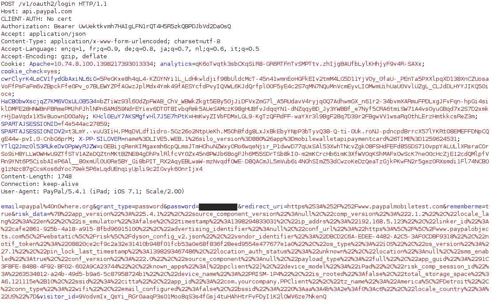

但是在下面这个截图里，我们看到上面请求的 response ，在这个 JSON 里我们看到了一些 PayPal web 服务 url，各种 token（主要是跟 OAuth 相关的），还有双重认证的属性。

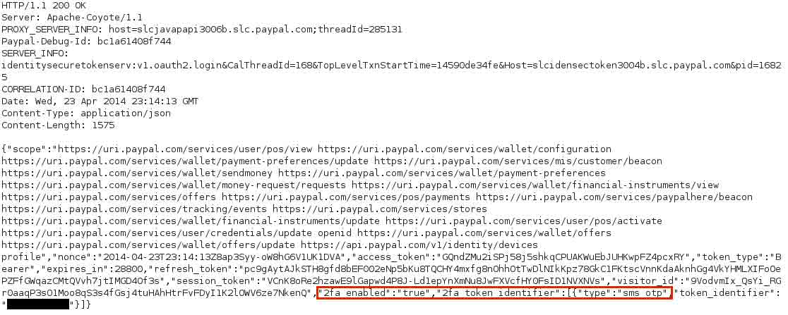

注意上图中红框部分，这里的双重认证属性值是 true，因此会导致移动应用跳转到登陆页并且会弹出错误信息，比如提醒设备目前还不支持双重认证。

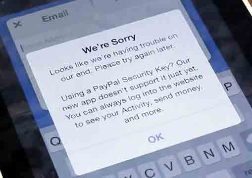

android 客户端也是同样的请求，同样的错误提示。

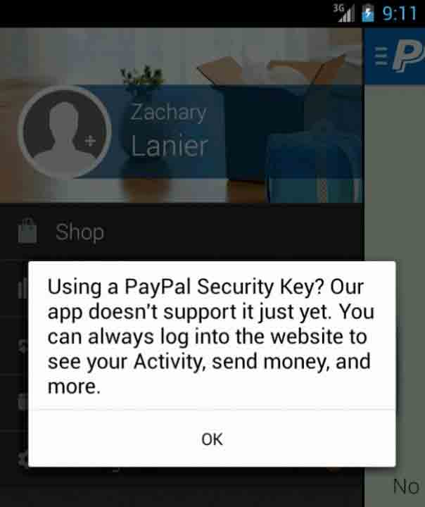

利用 Burp 将 2fa_enabled 属性值修改为 false，

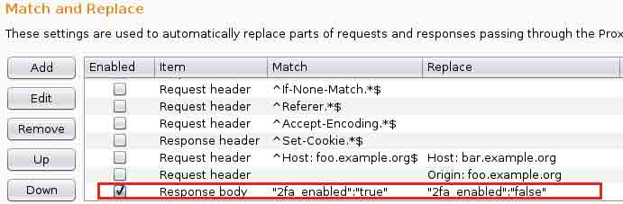

修改了值以后，尽管账户并没有进行第二步认证，但是应用并没有出错。尽管漏洞是出在服务端，但是这个问题相当于客户端已经通过了两步认证。

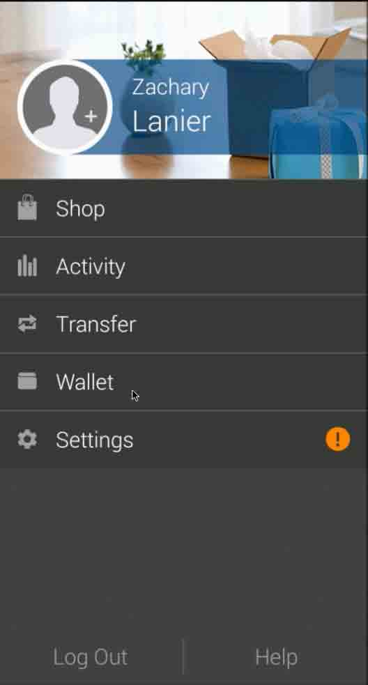

回到开始那个认证的请求的 response，我们发现 JSON 里还有一个 session id。

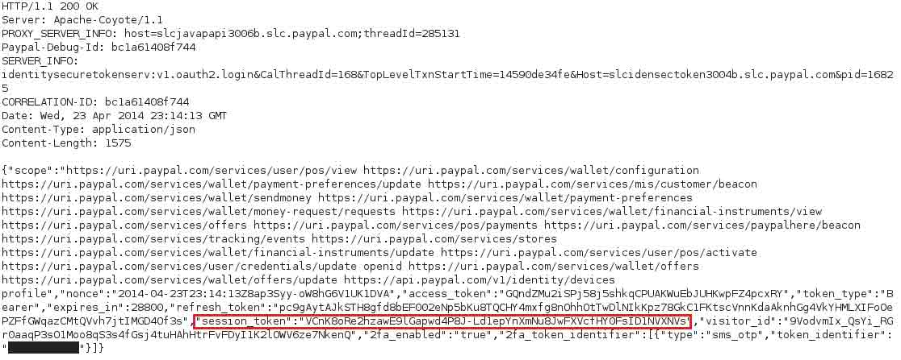

我们都知道，这个 session id 可以用来授权 mobileclient.paypal.com，mobileclient.paypal.com 这个站点提供了基于 SOAP 协议的 API 服务，可以用来做一些账户方面的附加功能，包括但不限于转账。

现在我们来模拟移动端的转账步骤，可以看到，转账是客户端和服务端基于 SOAP 封装的请求来进行的。整个过程可以分解为四个步骤，每个步骤都需要一个独一无二的值。

下面截图是一个例子，描述了利用上文中的 session id 来向 mobileclient.paypal.com 发起请求：

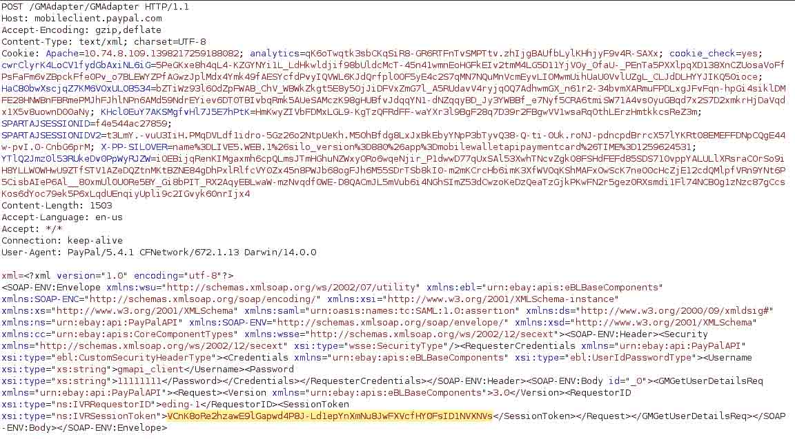

这里我们用 py 写了一个 POC，模拟移动端去利用这个漏洞。这个脚本的参数包括用户名、密码、一个美元账户、一个接受账户。具体有以下步骤：

1.  在 api.paypal.com 认证。
2.  显示一些受限的账户信息（包括“钱包”，链接的资金账户，比如借记卡和信用卡）
3.  获取 session_token（session id）的值。
4.  利用这个 session id 在 mobileclient.paypal.com 进行一些账户操作，比如转账。

下面的截图是我们利用 POC 脚本从一个已经开启双重认证的账户向一个接受账户中转账了 1 美元。

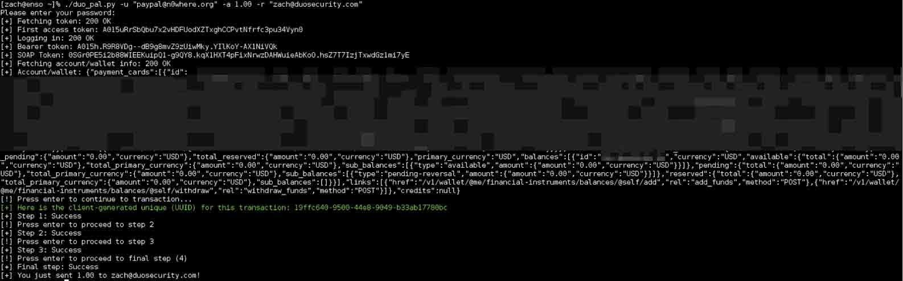

下面的截图是转账证明：

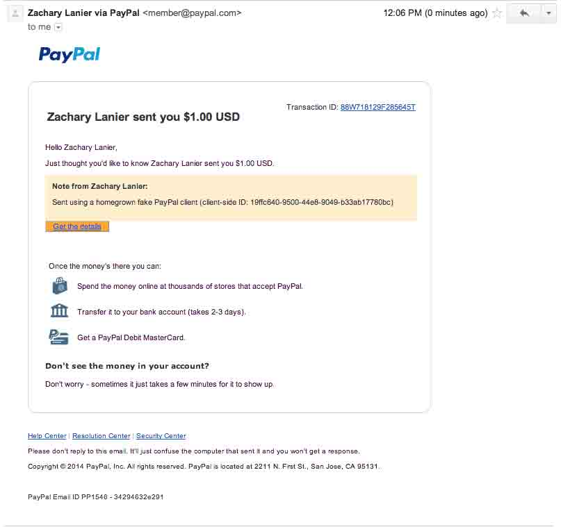

我们在 6 月 23 号重新测试了这个漏洞，发现 PayPal 官方已经在着手修复这个漏洞。开启了双重认证的账户在请求 api.paypal.com 的时候已经不会返回 session_token 了，也避免了直接与 mobileclient.paypal.com 通信。

但是钱包信息依然没有屏蔽，意味着这个漏洞还是有一些危害。下面这个截图是我们用 POC 重新测试的结果，注意 session_token 已经没有了。

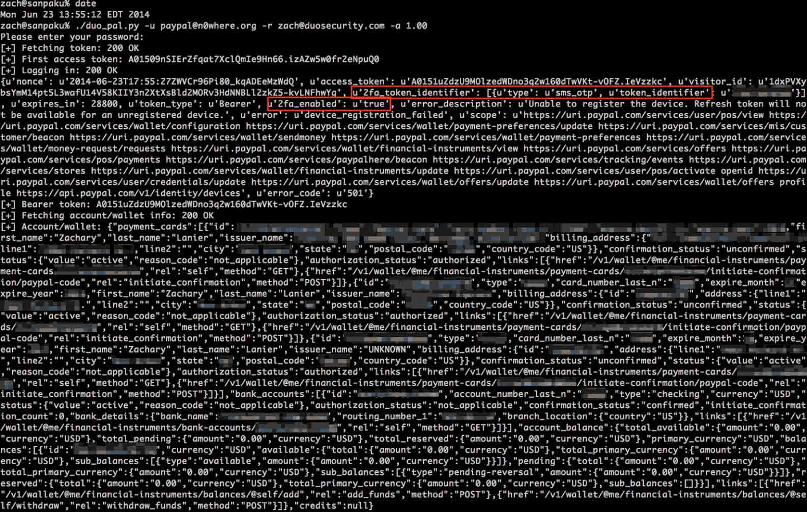

利用官方的移动客户端，可以更加明显的看出 PayPal 官方已经更改了 API 服务的认证流程。

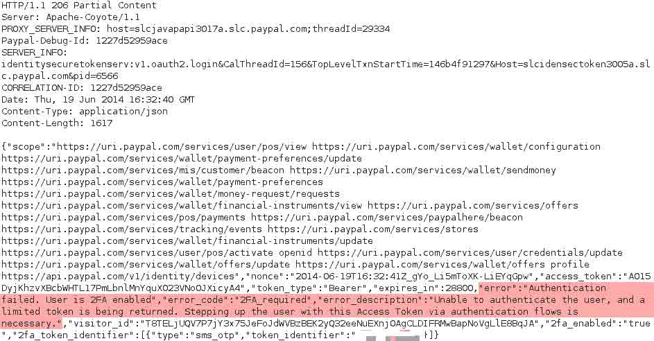

在 6 月 24 号，我们又测试了这个问题，发现钱包信息已经屏蔽。下面截图是测试结果，没有 access_token 了也就意味着不能在 api.paypal.com 进行任何操作，包括查看钱包信息。

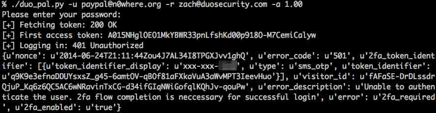

## 0x03 结论

* * *

虽然说现在的厂商推出双重验证机制能更好的保护用户的信息和账户安全，但是如果一旦被绕过，这些可能就成为浮云。用户很有可能会被这些厂商的承诺所麻痹。现在越来越多的用户信息在互联网上传播，通过一个设计安全的双重验证机制来提高账户安全已经迫在眉睫。

最后我们希望 PayPal 官方能很好的修复这个漏洞，并且推动移动客户端和第三方应用也支持双重验证机制。

版权声明：未经授权禁止转载 [Fireweed](http://drops.wooyun.org/author/Fireweed "由 Fireweed 发布")@[乌云知识库](http://drops.wooyun.org)

分享到：

### 相关日志

*   [OAuth 安全指南](http://drops.wooyun.org/papers/1989)
*   [PHP 后门新玩法：一款猥琐的 PHP 后门分析](http://drops.wooyun.org/papers/1215)
*   [Clickjacking 简单介绍](http://drops.wooyun.org/papers/104)
*   [雅虎某分站的 XSS 导致雅虎邮箱沦陷](http://drops.wooyun.org/papers/1024)
*   [老外的一份渗透测试报告](http://drops.wooyun.org/papers/576)
*   [ISCC2014 writeup](http://drops.wooyun.org/papers/2419)