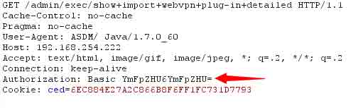
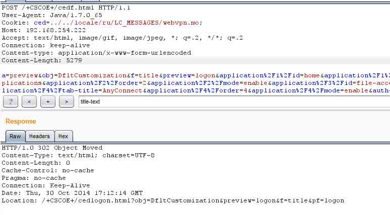
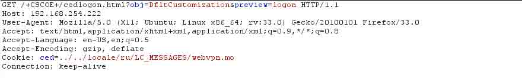
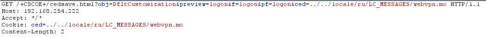

# Cisco ASA Software 远程认证绕过漏洞

2014/11/01 12:59 | [百度安全攻防实验室](http://drops.wooyun.org/author/百度安全攻防实验室 "由 百度安全攻防实验室 发布") | [漏洞分析](http://drops.wooyun.org/category/papers "查看 漏洞分析 中的全部文章") | 占个座先 | 捐赠作者

## 0x01 漏洞简介

* * *

Cisco ASA Software 的部分管理接口在身份认证时存在验证逻辑问题，导致攻击者可以绕过身份认证，实现未授权操作。

## 0x02 漏洞原理

* * *

默认情况下，ASA 的管理接口通过 basic auth+cookie 的方式进行认证，如下图：

 

漏洞存在于 Configuration 选项卡的 Customization 页面的 preview 功能。此页面用于修改 webvpn 的用户登录页面。但 Preview 的管理请求处理逻辑缺乏 Basic Auth 认证，仅仅通过验证 cookie 的有效性来进行判定。但 Cookie 验证逻辑上存在问题， Lua 代码如下：

```
Function CheckAsdmSession(cookie,no_redirect)

省略部分代码..
Local f = io.open(‘asdm/’..cookie, “r”)
If f ~= nil then
    f:close()
    return true;
end 
```

可以看出，在 CheckAsdmSession 函数中，仅仅校验该函数 cookie 传入的文件存在与否。通过修改 Cookie 中 ced 的值，设置为设备上存在的文件，如 `Ced=../../locale/ru/LC_MESSAGES/webvpn.mo`，即可达到绕过验证的效果。



我们可以通过对`/+CSCOE+/cedf.html`页面的请求查看 preview 页面的修改结果。



现有系统对于 preview 页面的生效需要进行 basic auth 校验的，但固件版本保留了老的生效接口/+CSCOE+/cedsave.html（老接口不需要进行 basic auth 认证），通过调用此接口，即可完成对 login page 的 html 代码的修改。如下：



通过修改登录页的代码，攻击者截获用于登录 VPN 的账号密码，也可以进行诸如劫持、挂马等操作。

## 0x03 漏洞修复

* * *

目前 cisco 已经针对固件提供了修复方案，受影响的 ASA 版本可以通过官方通告进行查看。VPN 类设备多属于企业的入口，提醒各公司运维人员以最高优先级修复。 官方链接： [`tools.cisco.com/security/center/content/CiscoSecurityAdvisory/cisco-sa-20141008-asa`](http://tools.cisco.com/security/center/content/CiscoSecurityAdvisory/cisco-sa-20141008-asa)

版权声明：未经授权禁止转载 [百度安全攻防实验室](http://drops.wooyun.org/author/百度安全攻防实验室 "由 百度安全攻防实验室 发布")@[乌云知识库](http://drops.wooyun.org)

分享到：

### 相关日志

*   [CVE-2014-3393 详细分析与复现](http://drops.wooyun.org/papers/3451)
*   [STRUTS2 的 getClassLoader 漏洞利用](http://drops.wooyun.org/papers/1151)
*   [WebView 中接口隐患与手机挂马利用](http://drops.wooyun.org/papers/548)
*   [通过 nginx 配置文件抵御攻击](http://drops.wooyun.org/tips/734)
*   [利用 ROP 绕过 DEP（Defeating DEP with ROP）调试笔记](http://drops.wooyun.org/papers/3602)
*   [BCTF Writeup](http://drops.wooyun.org/papers/1071)