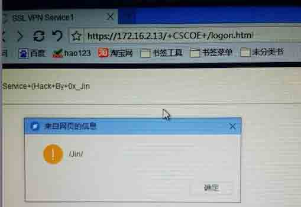
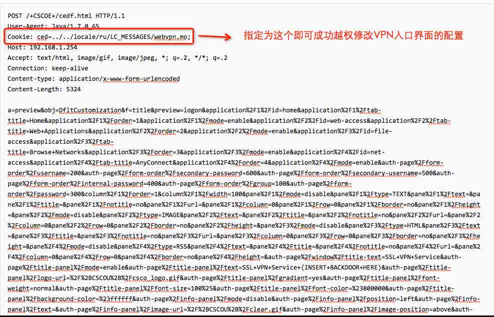
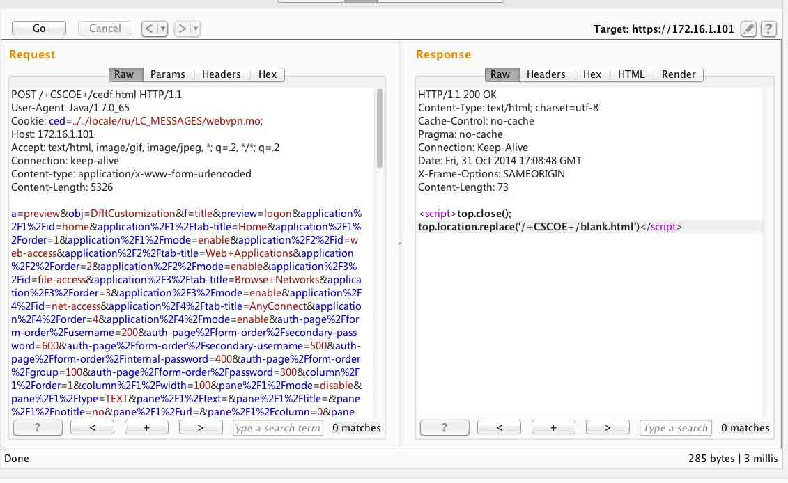
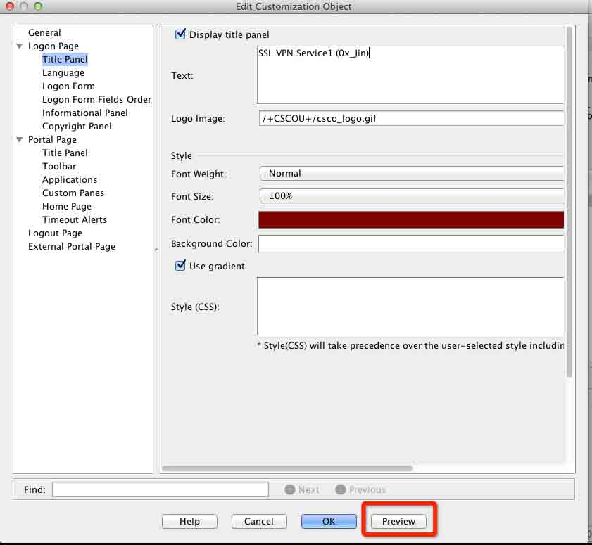
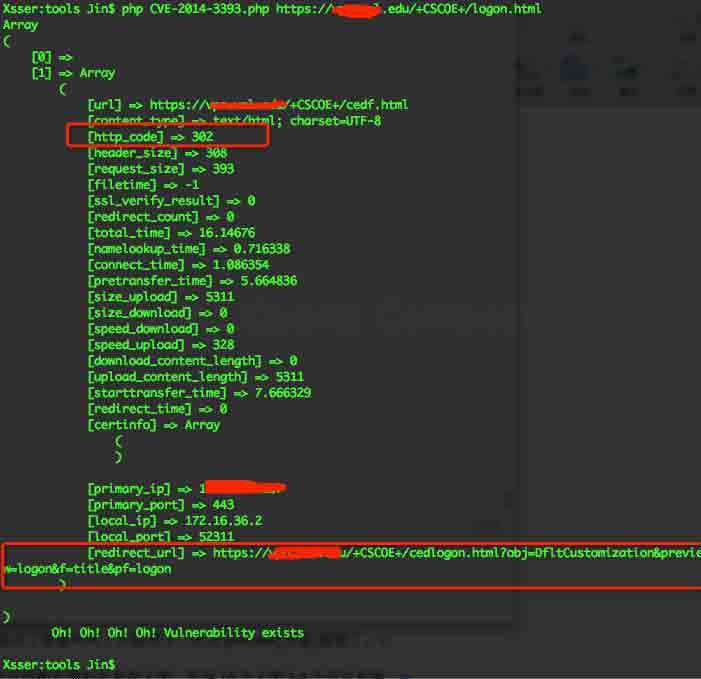

# CVE-2014-3393 详细分析与复现

2014/11/01 13:06 | [0x_Jin](http://drops.wooyun.org/author/0x_Jin "由 0x_Jin 发布") | [漏洞分析](http://drops.wooyun.org/category/papers "查看 漏洞分析 中的全部文章") | 占个座先 | 捐赠作者

## 0x00 漏洞简介：

* * *

Cisco Adaptive Security Appliance (ASA) Software 在 Clientless SSL VPN 入口自定义框架在实现上存在安全漏洞，未经身份验证的远程攻击者可利用此漏洞修改 Clientless SSL VPN 入口内容，导致窃取凭证、跨站脚本及其他攻击。此漏洞源于没有正确实现 Clientless SSL VPN 入口自定义框架内的身份验证检查。

## 0x01 漏洞详情：

* * *

首先问题总结一下就是越权，在思科 VPN 的登录入口设置处可以设置一些 title 以及 logo 等。但是这些地方是可以被越权修改掉的，并且这些地方还存在 xss。 如下图：



这个是本地搭建一个 VPN 然后来复现的，这是更改的 vpn 入口处的 title，插入的 JS。 那么为什么会造成这个原因呢？我们来看下[老外的文章](http://breenmachine.blogspot.ca/2014/10/cisco-asa-ssl-vpn-backdoor-poc-cve-2014.html)。

里面曾说到：

> check on some of the administrative interface pages can be bypassed by
> 
> setting the cookie value to any valid file on the file system.

在一些管理界面的可以通过设置 cookie 值为文件系统上存在的文件即可绕过登录。(英文渣，对着 google 翻译扣下来的英文)

具体缺陷代码如下：

```
Function CheckAsdmSession(cookie,no_redirect)
……..
Local f = io.open(‘asdm/’..cookie, “r”)
If f ~= nil then
f:close()
return true;
end 
```

单单这样可能比较难理解，我们来结合检测方式来看一遍。同样在上个连接中老外给了这样一个 post 包(burpsuite)的。



可以看到上图的 POST 包中指定了 Cookie 为`ced=../../locale/ru/LC_MESSAGES/webvpn.mo`; 如果对方存在这个漏洞且能利用的话是会得到这样一个返回值:


http 状态码为 302，这样的话就代表存在且能利用造成影响。 为什么我要说存在且能利用造成影响，难道还有存在且不能造成影响的？ 还别说，真有。一开始我认为这个漏洞，这么厉害那么影响肯定广泛结果自己复现后发现并不是那样，利用起来有个条件 看下图：



跟上图相比 cookie 值也设置了，post 包的内容又是一样，地址又是一样。 为什么这次会返回 200 呢？秉着刨根问底的精神，我又仔仔细细的测了一遍，重新搭了几次 VPN 做一步记录一下。 最后发现了关键所在，就是 Cisco ASDM 上你必须点过 Configuration 选项卡的 Customization 页面的 preview(预览)按钮。 如果没有点过 preview(预览)按钮的话，即使是存在漏洞的版本也不能利用造成影响。 如下图：



所以当你去测试存在漏洞的设备时，却发现返回的是 200 请不要胡思乱想，就是这个原因。 另外经过测试发现，点过之后如果设备没有关机重启那么可以一直利用，如果关机重启了那就呵呵了只能等下一次点 preview(预览)按钮了。

但是也不要觉得鸡肋，今天我跟我的小伙伴写了个 exp 用来检测(真的只是检测)，测试的都是国外有名的大学，发现 10 个大学 3-4 个可以利用。



说了这么久如何检测，那么我们来说正事，我们应该如何复现攻击呢？

在[这个](http://breenmachine.blogspot.ca/2014/10/cisco-asa-ssl-vpn-backdoor-poc-cve-2014.htmlp://breenmachine.blogspot.ca/2014/10/cisco-asa-ssl-vpn-backdoor-poc-cve-2014.html)链接中，老外给了一个 burpsuite 的包，我们可以重载包来恢复状态，恢复后就有 4 个 Repeater，我们只需把 host 跟 target 都修改成目标依次发包就可以了！

关于更多的资料在 Ruxcon2014 上已经有[大神写的 PDF](https://ruxcon.org.au/assets/2014/slides/Breaking%20Bricks%20Ruxcon%202014.pdf)了

附视频: [CVE-2014-3393](http://static.youku.com/v1.0.0423/v/swf/loader.swf?VideoIDS=XODE2MDE0NjQ4&embedid=MTIzLjEzOC43OS44AjIwNDAwMzY2MgIC&wd=&vext=pid%3D%26emb%3DMTIzLjEzOC43OS44AjIwNDAwMzY2MgIC%26bc%3D%26type%3D0)

受影响版本：

*   cpe:/a:cisco:adaptive_security_appliance_software:8.2.0.45
*   cpe:/a:cisco:adaptive_security_appliance_software:8.2.1
*   cpe:/a:cisco:adaptive_security_appliance_software:8.2.1.1
*   cpe:/a:cisco:adaptive_security_appliance_software:8.2.2
*   cpe:/a:cisco:adaptive_security_appliance_software:8.2.2.10
*   cpe:/a:cisco:adaptive_security_appliance_software:8.2.2.12
*   cpe:/a:cisco:adaptive_security_appliance_software:8.2.2.16
*   cpe:/a:cisco:adaptive_security_appliance_software:8.2.2.17
*   cpe:/a:cisco:adaptive_security_appliance_software:8.2.3
*   cpe:/a:cisco:adaptive_security_appliance_software:8.2.4
*   cpe:/a:cisco:adaptive_security_appliance_software:8.2.4.1
*   cpe:/a:cisco:adaptive_security_appliance_software:8.2.4.4
*   cpe:/a:cisco:adaptive_security_appliance_software:8.2.5
*   cpe:/a:cisco:adaptive_security_appliance_software:8.2.5.13
*   cpe:/a:cisco:adaptive_security_appliance_software:8.2.5.22
*   cpe:/a:cisco:adaptive_security_appliance_software:8.2.5.26
*   cpe:/a:cisco:adaptive_security_appliance_software:8.2.5.33
*   cpe:/a:cisco:adaptive_security_appliance_software:8.2.5.40
*   cpe:/a:cisco:adaptive_security_appliance_software:8.2.5.41
*   cpe:/a:cisco:adaptive_security_appliance_software:8.2.5.46
*   cpe:/a:cisco:adaptive_security_appliance_software:8.2.5.48
*   cpe:/a:cisco:adaptive_security_appliance_software:8.2.5.50
*   cpe:/a:cisco:adaptive_security_appliance_software:8.3.1
*   cpe:/a:cisco:adaptive_security_appliance_software:8.3.1.1
*   cpe:/a:cisco:adaptive_security_appliance_software:8.3.1.4
*   cpe:/a:cisco:adaptive_security_appliance_software:8.3.1.6
*   cpe:/a:cisco:adaptive_security_appliance_software:8.3.2
*   cpe:/a:cisco:adaptive_security_appliance_software:8.3.2.13
*   cpe:/a:cisco:adaptive_security_appliance_software:8.3.2.23
*   cpe:/a:cisco:adaptive_security_appliance_software:8.3.2.25
*   cpe:/a:cisco:adaptive_security_appliance_software:8.3.2.31
*   cpe:/a:cisco:adaptive_security_appliance_software:8.3.2.33
*   cpe:/a:cisco:adaptive_security_appliance_software:8.3.2.34
*   cpe:/a:cisco:adaptive_security_appliance_software:8.3.2.37
*   cpe:/a:cisco:adaptive_security_appliance_software:8.3.2.39
*   cpe:/a:cisco:adaptive_security_appliance_software:8.3.2.4
*   cpe:/a:cisco:adaptive_security_appliance_software:8.3.2.40
*   cpe:/a:cisco:adaptive_security_appliance_software:8.3.2.41
*   cpe:/a:cisco:adaptive_security_appliance_software:8.4.1
*   cpe:/a:cisco:adaptive_security_appliance_software:8.4.1.11
*   cpe:/a:cisco:adaptive_security_appliance_software:8.4.1.3
*   cpe:/a:cisco:adaptive_security_appliance_software:8.4.2.1
*   cpe:/a:cisco:adaptive_security_appliance_software:8.4.2
*   cpe:/a:cisco:adaptive_security_appliance_software:8.4.2.8
*   cpe:/a:cisco:adaptive_security_appliance_software:8.4.3
*   cpe:/a:cisco:adaptive_security_appliance_software:8.4.3.8
*   cpe:/a:cisco:adaptive_security_appliance_software:8.4.3.9
*   cpe:/a:cisco:adaptive_security_appliance_software:8.4.4
*   cpe:/a:cisco:adaptive_security_appliance_software:8.4.4.1
*   cpe:/a:cisco:adaptive_security_appliance_software:8.4.4.3
*   cpe:/a:cisco:adaptive_security_appliance_software:8.4.4.5
*   cpe:/a:cisco:adaptive_security_appliance_software:8.4.4.9
*   cpe:/a:cisco:adaptive_security_appliance_software:8.4.5
*   cpe:/a:cisco:adaptive_security_appliance_software:8.4.5.6
*   cpe:/a:cisco:adaptive_security_appliance_software:8.4.6
*   cpe:/a:cisco:adaptive_security_appliance_software:8.4.7
*   cpe:/a:cisco:adaptive_security_appliance_software:8.4.7.3
*   cpe:/a:cisco:adaptive_security_appliance_software:8.4.7.15
*   cpe:/a:cisco:adaptive_security_appliance_software:8.4.7.22
*   cpe:/a:cisco:adaptive_security_appliance_software:8.6.1
*   cpe:/a:cisco:adaptive_security_appliance_software:8.6.1.1
*   cpe:/a:cisco:adaptive_security_appliance_software:8.6.1.10
*   cpe:/a:cisco:adaptive_security_appliance_software:8.6.1.12
*   cpe:/a:cisco:adaptive_security_appliance_software:8.6.1.13
*   cpe:/a:cisco:adaptive_security_appliance_software:8.6.1.14
*   cpe:/a:cisco:adaptive_security_appliance_software:8.6.1.2
*   cpe:/a:cisco:adaptive_security_appliance_software:8.6.1.5
*   cpe:/a:cisco:adaptive_security_appliance_software:9.0.1
*   cpe:/a:cisco:adaptive_security_appliance_software:9.0.2
*   cpe:/a:cisco:adaptive_security_appliance_software:9.0.2.10
*   cpe:/a:cisco:adaptive_security_appliance_software:9.0.3
*   cpe:/a:cisco:adaptive_security_appliance_software:9.0.3.6
*   cpe:/a:cisco:adaptive_security_appliance_software:9.0.3.8
*   cpe:/a:cisco:adaptive_security_appliance_software:9.0.4
*   cpe:/a:cisco:adaptive_security_appliance_software:9.0.4.1
*   cpe:/a:cisco:adaptive_security_appliance_software:9.0.4.17
*   cpe:/a:cisco:adaptive_security_appliance_software:9.0.4.20
*   cpe:/a:cisco:adaptive_security_appliance_software:9.0.4.5
*   cpe:/a:cisco:adaptive_security_appliance_software:9.0.4.7
*   cpe:/a:cisco:adaptive_security_appliance_software:9.1..1
*   cpe:/a:cisco:adaptive_security_appliance_software:9.1.1.4
*   cpe:/a:cisco:adaptive_security_appliance_software:9.1.2
*   cpe:/a:cisco:adaptive_security_appliance_software:9.1.2.8
*   cpe:/a:cisco:adaptive_security_appliance_software:9.1.3
*   cpe:/a:cisco:adaptive_security_appliance_software:9.1.3.2
*   cpe:/a:cisco:adaptive_security_appliance_software:9.1.4
*   cpe:/a:cisco:adaptive_security_appliance_software:9.1.5
*   cpe:/a:cisco:adaptive_security_appliance_software:9.1.5.10
*   cpe:/a:cisco:adaptive_security_appliance_software:9.1.5.15
*   cpe:/a:cisco:adaptive_security_appliance_software:9.3.1

修复方案： 目前思科已在 2014 年 10 月 8 号发布了补丁，连接： [`tools.cisco.com/security/center/content/CiscoSecurityAdvisory/cisco-sa-20141008-asa`](http://tools.cisco.com/security/center/content/CiscoSecurityAdvisory/cisco-sa-20141008-asa)

附 burpsuite 包的下载地址：https://github.com/breenmachine/various

版权声明：未经授权禁止转载 [0x_Jin](http://drops.wooyun.org/author/0x_Jin "由 0x_Jin 发布")@[乌云知识库](http://drops.wooyun.org)

分享到：

### 相关日志

*   [Cisco ASA Software 远程认证绕过漏洞](http://drops.wooyun.org/papers/3459)
*   [Codeigniter 利用加密 Key（密钥）的对象注入漏洞](http://drops.wooyun.org/papers/1449)
*   [雅虎某分站的 XSS 导致雅虎邮箱沦陷](http://drops.wooyun.org/papers/1024)
*   [PHP 绕过 open_basedir 列目录的研究](http://drops.wooyun.org/tips/3978)
*   [Laravel cookie 伪造,解密,和远程命令执行](http://drops.wooyun.org/papers/1515)
*   [CVE-2014-3566 SSLv3 POODLE 原理分析](http://drops.wooyun.org/papers/3194)