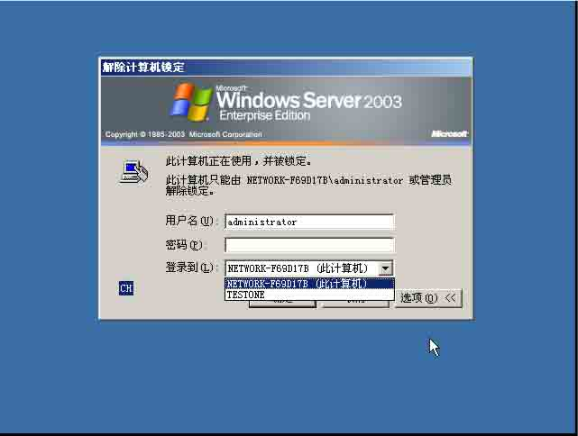
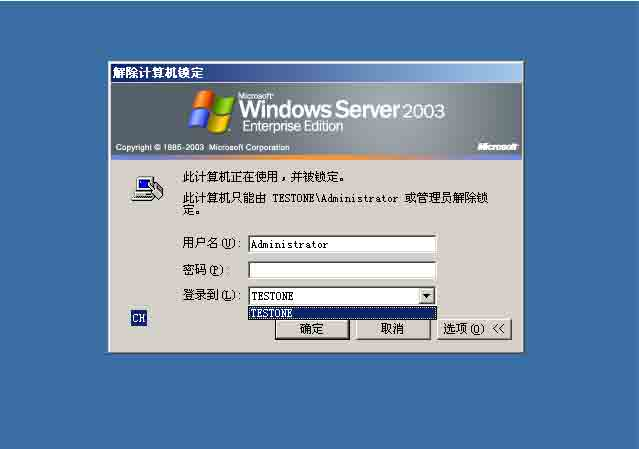

# 域内渗透基本技巧

2013/08/07 18:50 | [碧云涛](http://drops.wooyun.org/author/碧云涛 "由 碧云涛 发布") | [技术分享](http://drops.wooyun.org/category/tips "查看 技术分享 中的全部文章") | 占个座先 | 捐赠作者

## 0x00 什么是域

* * *

有人说域是一种组织结构，是个安全边界。域也有另为一个名字，“活动目录”。不管域是什么，它总有一些特点，有了它，对管理一个机构的组织单元，人员，特别是计算机就方便了许多，特别是计算机，因为域就是建立在计算机上的。加入域里的计算机，共享文件，共享上网就会很方便。

域里有个比较重要的角色，域控制器(DC)。它有至高无上的权限，它可以在域里对其他计算机(DA)胡作非为。域控制器里还有域内所有用户的帐号密码(曾在一个机房的机架上看到一张字条，上面写着"帐号密码是黑客攻击的首要目标"，当时偶就笑抽了，机架的锁上还写着"这里锁住的是企业的秘密")。

综上所诉，域就是我们在进行渗透测试时，会碰到的一种网络环境。对域比较直观的展示时，在登录 3389 时，在域里的机器会多一个下拉框，见图。



如果“登录到”这个下拉框没有显示，请点击“选项（0）”按钮显示。仔细看，这个下拉框有两个选项，一个是此计算机，本地登录。一个是 TESTONE 域。再看下图



这个 3389 登录界面里的“登录到”下拉框只有一个选项 TESTONE。没有此计算机的选项。没错，这台机器就是 DC，变身成 DC 的机器本地帐户会被禁用，所以不能登录本机，只能登录到域中（一些书上是这样说的，偶学艺不精，没有准确验证过）。所以 DC 是伟大的。

## 0x01 寻找域控制

* * *

假设我们现在已经在一个域里，当然不是正常的存在。因为我们正在做渗透测试呢，而不是坐在公司里上班打 dota。

一般情况下会有两种情况，第一：我们能登录一台域里服务器的 3389。第二：我们用远程控制软件控制了一台域里的个人机器。只要有其中一种，你一定想，并很快拥有另一种。

好，情况已经这样美好了，我们下一步该做点什么了，有人说赶紧把毛片和种子下回来，作为一个脱离低级趣味的人来说，我绝对我大声的对他说，俺硬盘里还有云存储里的资源比他多的多，极品的多，还费的着下他的，切！

第一步我觉得不是导 hash，而是再给对方种一个或者两个不同的远控，留条后路，然后导 hash，查看各种信息。导 hash 的工具 gsecdump,wce 等，网上都可以下到。

关于导 hash，分为导处本地存储的 hash 和正在登录状态用户的 hash，正在登录用户的 hash 就有可能导到域管理员的，假设你在一台域里的服务器上转悠，这时，刚好管理员用域控管理帐户来视察这台服务器，那么内存里就有了他的 hash，这时里运行一下工具，hash 到手，不要说你破解不出来，没关系，还有那个法国神器，直接给它显示明文吧,没有明文也没关系，还可以 hash 注入！

关于查看些有用的信息，下面引用网上广为流传的命令。

```
net view
               查看同一域/工作组的计算机列表
net view /domain
       查看域/工作组列表
net view /domain:Secwing
    查看 Secwing 域中 计算机列表
net group /domain
      查看所在域的组
net user /domain
       查看所在域用户
net user /domain zerosoul 12345678
     修改域用户密码，需要域管理员权限，或者 Ctrl+Alt+Del 点击修改则不需要域管理员权限
net localgroup administrators SECWINGzerosoul /add
        域 Users 组用户添加到本地 Administrators 组，需要本地管理员或域管理员在本机登陆域后进行 
```

下面的命令 只能用于 域控制器:

```
net group "Domain controllers"
     查看域控制器(如果有多台)
net group
                      查看域的组
net group "domain admins"
      查看域管理员
net group "domain users"
       查看域管理员 
```

PS:打开配置域控制器向导的命令

```
dcpromo

psexec /accepteula 绕过第一次验证窗口
mstsc /admin 远程桌面登录到 console 会话解决 hash 无法抓出问题 
```

我们查看信息的目的是找出域控制器，网上一般提出过很多方法参考地址

[`hi.baidu.com/cao2109/item/6f7115687616e5166895e682`](http://hi.baidu.com/cao2109/item/6f7115687616e5166895e682)

不过偶觉得微软提供的方法更好用(一个朋友教的，在此感谢)。官方解说:

[`msdn.microsoft.com/zh-cn/cc755655%28zh-cn,WS.10%29.aspx`](http://msdn.microsoft.com/zh-cn/cc755655%28zh-cn,WS.10%29.aspx)

对，就是用 dsquery。在 2003 自带，system32 目录里。要在 xp 执行，把 dsquery.exe 和 dsquery.dll 拷贝出来放在同目录就可以用了。dsquery 不仅可以找域控制器，在一台普通域里的机器上就可以运行，列出域里的基本信息，包括组织单元，计算机，用户，子网，联系人（说实话，偶不懂这个耶）等。

找到域控后，很多时候不止一台域控。现在不管你用什么方法，exp 啊，0day 啊，hash 注入呀，弱口令呀，社工呀，Arp 呀，苍井空啊。弄到域控的权限，有了域管理员的帐号和密码，那么在域里 YY 就不愁了。

## 0x02 自由飞翔

* * *

假设现在我们拿到了域控管理员的帐号和密码，我们可以登录域内一台服务器，当然域控也没问题。不过管理会经常登域控，这样偷情肯定很容易被发现，所以最好找一台没有什么作用，被遗弃的服务器上去操作。

有了帐号密码，IPC 链接。内网为了共享啥的方便，server 服务都不会关闭，要是我自己电脑 server 和 workstation 是肯定要关的。假设我们的域管理员名字是 CK，密码是 123456，域的名字叫 ALIYUN。我要到域里 ip 为 192.168.4.6 的机器上执行命令。我就去会敲出。

```
net use 192.168.4.6c$ 123456 /user:ALIYUNCK 
```

要是这个 IP 其实不在域里，那么把 ALIYUN 的地方改成 192.168.4.6，用户名改成 administrator，然后再试试，可能有惊喜哦。

要是命令执行成功，执行 net use 可以看到已经建立的映射。

然后用 psexec 来执行命令，第一次运行请记得跳过验证

```
psexec /accepteula 绕过第一次验证窗口 
```

不然坐在电脑面前的那个她会吓死的（你要在远控里的话）。

建立映射后，在交互式的 cmdshell 里，比如 3389 上去打开的 cmdshell 执行

```
Psexec -s 192.168.4.6 cmd.exe 
```

就可以得到一个 192.168.4.6 机器上的一个 cmd.exe.前提是已经 net use 映射成功了，接下来要干什么，就看你的了。

这是在交互式的 cmdshell 里，要是在远控里自带的 cmdshell 呢？一般远控里的 cmdshell 会用到管道来实现的，而 psexec 在回显的时候或许也用了管道，这样在执行下面的语句是可能会出现问题。

```
Psexec -s 192.168.4.6 cmd.exe /c ipconfig 
```

回显会出现时有时无的情况，弹一个交互式的 cmdshell 就不用想了，除非远控实现的是一个完全交互式的 cmdshell，这个东西有吗？答案是有的。见下面链接:

[`forum.eviloctal.com/thread-40208-1-1.html`](http://forum.eviloctal.com/thread-40208-1-1.html)

不过有方法可以弥补这个缺陷，net use 成功后，在远控里是可以访问对方的文件系统的,192.168.4.6C$,这样就可以写文件进去,比如写到 C 盘，写批处理，在里面写想执行的命令并把回显结果重定向到文件，一次写入多条效率比较高，还可以重复使用，就像这样：

```
Ipconfig /all >> C:pp.txt 
```

然后再执行

```
psexec -s 192.168.4.6 cmd.exe /c C:a.bat 
```

这样在远控里把回显的 txt 下回来就算行了，还便于保存，是不是很麻烦呀！

监视管理员：

虽然拿到域管理员的密码可以在域里玩，当跟域里有联系而且重要的机器可能并不在域里，比如帮助域里机器上网的代理服务器，邮件网关等。 要想在这些机器上玩，就只有监视管理员了，找到管理员的机器，给他种个马，种个 keyloger(键盘记录)，或者专门的 3389 登录记录器也可以。当然运气好，可能在他电脑找到一个 password.txt 就发达了。管理员的浏览器也是藏密码的地方，他应该会经常登录一些需要密码验证的地方，然后他可能会保存密码，那么我们就要导出他的密码，那样会收获不小哦。

## 0x03 问题与提高

* * *

如果你只有远控，对方网络在内网。你无法直接登录服务器上的 3389,那就只有端口转发了。 如果对方内网不能直接上网，只能通过一个代理服务器上网，比如 ISA，squid 撒的，再加上一个会随时断你线的防火墙，那么麻烦就大了。就算一些木马能出来，一般的端口转发也出不来啊～。

这种情况我想到两种出路：

一 找到内网里可以直接出来的机器，比如管理员为了方便下片什么的开放的。其实可以直接找管理员。（还有一个思路，看对方内网里发邮件到外面的邮件头，一般都是邮件中继信息，一步一步跟就从内网到外网了，要是有基于邮件协议的木马就爽 YY 了，中了以后直接劫持邮件客服端，隐蔽的发邮件，控制信息由邮件出去）

二 写程序，搞定代理，刺穿防火墙。

**Tags:** [域](http://drops.wooyun.org/tag/%e5%9f%9f), [渗透](http://drops.wooyun.org/tag/%e6%b8%97%e9%80%8f)

版权声明：未经授权禁止转载 [碧云涛](http://drops.wooyun.org/author/碧云涛 "由 碧云涛 发布")@[乌云知识库](http://drops.wooyun.org)

分享到：

### 相关日志

*   [从哲学角度看渗透之关于渗透与高智商电影](http://drops.wooyun.org/tips/510)
*   [SqlServer 2005 Trigger](http://drops.wooyun.org/tips/3464)
*   [PHP 安全编码](http://drops.wooyun.org/tips/135)
*   [得到内网域管理员的 5 种常见方法](http://drops.wooyun.org/tips/646)
*   [使用 LDAP 查询快速提升域权限](http://drops.wooyun.org/pentesting/2125)
*   [Attacking MongoDB](http://drops.wooyun.org/papers/850)