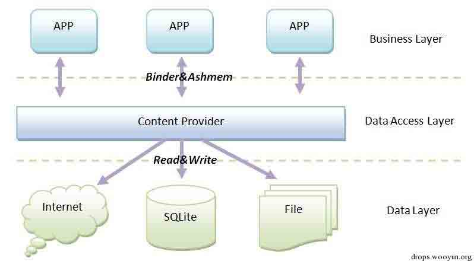
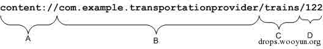
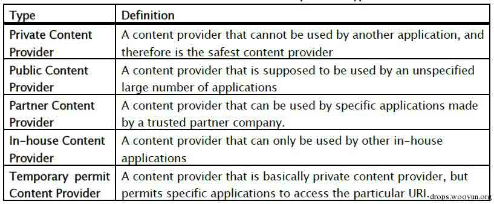
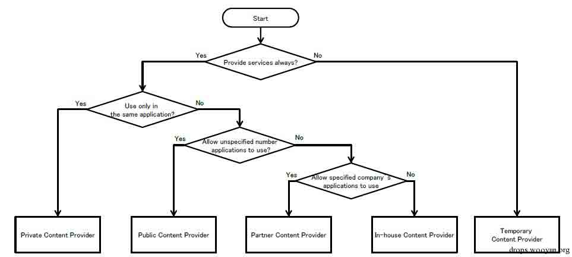

# Android Content Provider Security

2014/12/12 10:37 | [瘦蛟舞](http://drops.wooyun.org/author/瘦蛟舞 "由 瘦蛟舞 发布")   | [技术分享](http://drops.wooyun.org/category/tips "查看 技术分享 中的全部文章"), [移动安全](http://drops.wooyun.org/category/mobile "查看 移动安全 中的全部文章")  | 占个座先  | 捐赠作者

## 0x00 科普

* * *

内容提供器用来存放和获取数据并使这些数据可以被所有的应用程序访问。它们是应用程序之间共享数据的唯一方法；不包括所有 Android 软件包都能访问的公共储存区域。Android 为常见数据类型（音频，视频，图像，个人联系人信息，等等）装载了很多内容提供器。你可以看到在 android.provider 包里列举了一些。你还能查询这些提供器包含了什么数据。当然，对某些敏感内容提供器，必须获取对应的权限来读取这些数据。

如果你想公开你自己的数据，你有两个选择：你可以创建你自己的内容提供器（一个 ContentProvider 子类）或者你可以给已有的提供器添加数据，前提是存在一个控制同样类型数据的内容提供器且你拥有读写权限。



## 0x01 知识要点

* * *

参考：[`developer.android.com/guide/topics/providers/content-providers.html`](http://developer.android.com/guide/topics/providers/content-providers.html)

**Content URIs**

content URI 是一个标志 provider 中的数据的 URI．Content URI 中包含了整个 provider 的以符号表示的名字(它的 authority) 和指向一个表的名字(一个路径)．当你调用一个客户端的方法来操作一个 provider 中的一个表，指向表的 content URI 是参数之一．



A. 标准前缀表明这个数据被一个内容提供器所控制。它不会被修改。

B. URI 的权限部分；它标识这个内容提供器。对于第三方应用程序，这应该是一个全称类名（小写）以确保唯一性。权限在 <provider>元素的权限属性中进行声明：</provider>

```
<provider name=".TransportationProvider"
      authorities="com.example.transportationprovider"
      . . .  > 
```

C. 用来判断请求数据类型的路径。这可以是 0 或多个段长。如果内容提供器只暴露了一种数据类型（比如，只有火车），这个分段可以没有。如果提供器暴露若干类型，包括子类型，那它可以是多个分段长-例如，提供"land/bus", "land/train", "sea/ship", 和"sea/submarine"这 4 个可能的值。

D. 被请求的特定记录的 ID，如果有的话。这是被请求记录的 _ID 数值。如果这个请求不局限于单个记录， 这个分段和尾部的斜线会被忽略：

```
content://com.example.transportationprovider/trains 
```

**ContentResolver**

ContentResolver 的方法们提供了对存储数据的基本的"CRUD" (增删改查)功能

```
getIContentProvider() 
      Returns the Binder object for this provider.

delete(Uri uri, String selection, String[] selectionArgs) -----abstract
      A request to delete one or more rows.

insert(Uri uri, ContentValues values) 
      Implement this to insert a new row.

query(Uri uri, String[] projection, String selection, String[] selectionArgs, String sortOrder) 
      Receives a query request from a client in a local process, and returns a Cursor.

update(Uri uri, ContentValues values, String selection, String[] selectionArgs) 
      Update a content URI.

openFile(Uri uri, String mode) 
      Open a file blob associated with a content URI.

```

**Sql 注入**

sql 语句拼接

```
// 通过连接用户输入到列名来构造一个选择条款
String mSelectionClause =  "var = " + mUserInput;

```

参数化查询

```
// 构造一个带有占位符的选择条款
String mSelectionClause =  "var = ?";

```

**权限**

下面的 <uses-permission>元素请求对用户词典的读权限：</uses-permission>

```
<uses-permission android:name="android.permission.READ_USER_DICTIONARY"> 
```

申请某些 protectionLevel="dangerous"的权限

```
<uses-permission android:name="com.huawei.dbank.v7.provider.DBank.READ_DATABASE"/>

<permission android:name="com.huawei.dbank.v7.provider.DBank.READ_DATABASE" android:protectionLevel="dangerous"></permission> 
```

android:protectionLevel

normal:默认值。低风险权限，只要申请了就可以使用，安装时不需要用户确认。

dangerous：像 WRITE_SETTING 和 SEND_SMS 等权限是有风险的，因为这些权限能够用来重新配置设备或者导致话费。使用此 protectionLevel 来标识用户可能关注的一些权限。Android 将会在安装程序时，警示用户关于这些权限的需求，具体的行为可能依据 Android 版本或者所安装的移动设备而有所变化。

signature：这些权限仅授予那些和本程序应用了相同密钥来签名的程序。

signatureOrSystem:与 signature 类似，除了一点，系统中的程序也需要有资格来访问。这样允许定制 Android 系统应用也能获得权限，这种保护等级有助于集成系统编译过程。

**API**

Contentprovider 组件在 API-17（android4.2）及以上版本由以前的 exported 属性默认 ture 改为默认 false。

Contentprovider 无法在 android2.2（API-8）申明为私有。

```
<!-- *** POINT 1 *** Do not (Cannot) implement Private Content Provider in Android 2.2 (API Level 8) or earlier. -->
<uses-sdk android:minSdkVersion="9" android:targetSdkVersion="17" /> 
```

**关键方法**

*   public void addURI (String authority, String path, int code)
*   public static String decode (String s)
*   public ContentResolver getContentResolver()
*   public static Uri parse(String uriString)
*   public ParcelFileDescriptor openFile (Uri uri, String mode)
*   public final Cursor query(Uri uri, String[] projection,String selection, String[] selectionArgs, String sortOrder)
*   public final int update(Uri uri, ContentValues values, String where,String[] selectionArgs)
*   public final int delete(Uri url, String where, String[] selectionArgs)
*   public final Uri insert(Uri url, ContentValues values)

## 0x02 content provider 分类

* * *





这个老外分的特别细，个人认为就分 private、public、in-house 差不多够用。

## 0x03 安全建议

* * *

1.  minSdkVersion 不低于 9
2.  不向外部 app 提供的数据的私有 content provider 设置 exported=“false”避免组件暴露(编译 api 小于 17 时更应注意此点)
3.  使用参数化查询避免注入
4.  内部 app 通过 content provid 交换数据设置 protectionLevel=“signature”验证签名
5.  公开的 content provider 确保不存储敏感数据
6.  Uri.decode() before use ContentProvider.openFile()
7.  提供 asset 文件时注意权限保护

## 0x04 测试方法

* * *

1、反编译查看 AndroidManifest.xml（drozer 扫描）文件定位 content provider 是否导出，是否配置权限，确定 authority

```
drozer:
run app.provider.info -a cn.etouch.ecalendar

```

2、反编译查找 path，关键字`addURI`、hook api 动态监测推荐使用 zjdroid

3、确定 authority 和 path 后根据业务编写 POC、使用 drozer、使用小工具 Content Provider Helper、adb shell // 没有对应权限会提示错误

```
adb shell：
adb shell content query --uri <URI> [--user <USER_ID>] [--projection <PROJECTION>] [--where <WHERE>] [--sort <SORT_ORDER>]
content query --uri content://settings/secure --projection name:value --where "name='new_setting'" --sort "name ASC"
adb shell content insert --uri content://settings/secure --bind name:s:new_setting --bind value:s:new_value
adb shell content update --uri content://settings/secure --bind value:s:newer_value --where "name='new_setting'"
adb shell content delete --uri content://settings/secure --where "name='new_setting'"

```

```
drozer：
run app.provider.query content://telephony/carriers/preferapn --vertical

```

## 0x05 案例

* * *

**案例 1：直接暴露**

*   [WooYun: 盛大 Youni 有你 Android 版敏感信息泄露(可读用户本地消息)](http://www.wooyun.org/bugs/wooyun-2013-041595)
*   [WooYun: 新浪微博 Android 应用本地信息泄露](http://www.wooyun.org/bugs/wooyun-2013-016854)
*   [WooYun: 盛大起点读书 Android 客户端 token 等用户敏感信息泄露](http://www.wooyun.org/bugs/wooyun-2013-021089)
*   [WooYun: 傲游浏览器限制不严格可导致网页欺诈攻击](http://www.wooyun.org/bugs/wooyun-2013-039290)
*   [WooYun: 搜狗手机浏览器隐私泄露和主页篡改漏洞二合一（需要手机里有恶意应用）](http://www.wooyun.org/bugs/wooyun-2013-042609)
*   [WooYun: 酷派 S6 流量监控绕过（偷跑流量不是事儿）](http://www.wooyun.org/bugs/wooyun-2014-085432)
*   [WooYun: 酷派最安全手机 s6 通知栏管理权限绕过](http://www.wooyun.org/bugs/wooyun-2014-084500)

**案例 2：需权限访问**

*   [WooYun: 米聊 Android 版敏感信息泄露(可读用户本地消息)](http://www.wooyun.org/bugs/wooyun-2013-041521)
*   [WooYun: 华为网盘 content provider 组件可能泄漏用户信息](http://www.wooyun.org/bugs/wooyun-2014-057590)
*   [WooYun: 人人客户端权限问题导致隐私泄露](http://www.wooyun.org/bugs/wooyun-2013-039697)

**案例 3：openFile 文件遍历**

*   [WooYun: 赶集网 Android 客户端 Content Provider 组件任意文件读取漏洞](http://www.wooyun.org/bugs/wooyun-2013-044407)
*   [WooYun: 猎豹浏览器（Android 版）任意私有文件数据可被本地第三方窃取漏洞](http://www.wooyun.org/bugs/wooyun-2013-047098)
*   [WooYun: 58 同城 Android 客户端远程文件写入漏洞](http://www.wooyun.org/bugs/wooyun-2013-044411)

Override openFile method

错误写法 1：

```
private static String IMAGE_DIRECTORY = localFile.getAbsolutePath();
public ParcelFileDescriptor openFile(Uri paramUri, String paramString)
    throws FileNotFoundException {
  File file = new File(IMAGE_DIRECTORY, paramUri.getLastPathSegment());
  return ParcelFileDescriptor.open(file, ParcelFileDescriptor.MODE_READ_ONLY);
}

```

错误写法 2：URI.parse()

```
private static String IMAGE_DIRECTORY = localFile.getAbsolutePath();
public ParcelFileDescriptor openFile(Uri paramUri, String paramString)
    throws FileNotFoundException {
    File file = new File(IMAGE_DIRECTORY, Uri.parse(paramUri.getLastPathSegment()).getLastPathSegment());
    return ParcelFileDescriptor.open(file, ParcelFileDescriptor.MODE_READ_ONLY);
}

```

POC1：

```
String target = "content://com.example.android.sdk.imageprovider/data/" + "..%2F..%2F..%2Fdata%2Fdata%2Fcom.example.android.app%2Fshared_prefs%2FExample.xml";

ContentResolver cr = this.getContentResolver();
FileInputStream fis = (FileInputStream)cr.openInputStream(Uri.parse(target));

byte[] buff = new byte[fis.available()];
in.read(buff);

```

POC2：double encode

```
String target = "content://com.example.android.sdk.imageprovider/data/" + "%252E%252E%252F%252E%252E%252F%252E%252E%252Fdata%252Fdata%252Fcom.example.android.app%252Fshared_prefs%252FExample.xml";

ContentResolver cr = this.getContentResolver();
FileInputStream fis = (FileInputStream)cr.openInputStream(Uri.parse(target));

byte[] buff = new byte[fis.available()];
in.read(buff);

```

解决方法 Uri.decode()

```
private static String IMAGE_DIRECTORY = localFile.getAbsolutePath();
  public ParcelFileDescriptor openFile(Uri paramUri, String paramString)
      throws FileNotFoundException {
    String decodedUriString = Uri.decode(paramUri.toString());
    File file = new File(IMAGE_DIRECTORY, Uri.parse(decodedUriString).getLastPathSegment());
    if (file.getCanonicalPath().indexOf(localFile.getCanonicalPath()) != 0) {
      throw new IllegalArgumentException();
    }
    return ParcelFileDescriptor.open(file, ParcelFileDescriptor.MODE_READ_ONLY);
  }

```

## 0x06 参考

* * *

[`www.securecoding.cert.org/confluence/pages/viewpage.action?pageId=111509535`](https://www.securecoding.cert.org/confluence/pages/viewpage.action?pageId=111509535)

[`www.jssec.org/dl/android_securecoding_en.pdf`](http://www.jssec.org/dl/android_securecoding_en.pdf)

[`developer.android.com/intl/zh-cn/reference/android/content/ContentProvider.html`](http://developer.android.com/intl/zh-cn/reference/android/content/ContentProvider.html)

## 0x07 相关阅读

[`zone.wooyun.org/content/15097`](http://zone.wooyun.org/content/15097)

[`drops.wooyun.org/tips/2997`](http://drops.wooyun.org/tips/2997)

版权声明：未经授权禁止转载 [瘦蛟舞](http://drops.wooyun.org/author/瘦蛟舞 "由 瘦蛟舞 发布")@[乌云知识库](http://drops.wooyun.org)

分享到：碎银子打赏，作者好攒钱娶媳妇：


### 相关日志

*   [Android Activtity Security](http://drops.wooyun.org/tips/3936)
*   [Android UXSS 阶段性小结及自动化测试](http://drops.wooyun.org/tools/3186)
*   [Android Broadcast Security](http://drops.wooyun.org/tips/4393)
*   [Android Logcat Security](http://drops.wooyun.org/tips/3812)
*   [Android 证书信任问题与大表哥](http://drops.wooyun.org/tips/3296)
*   [Android App Injection&&Drozer; Use](http://drops.wooyun.org/tips/2997)