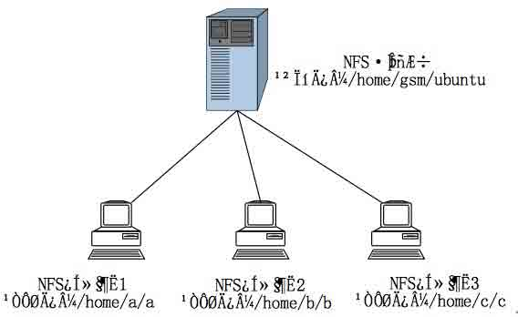
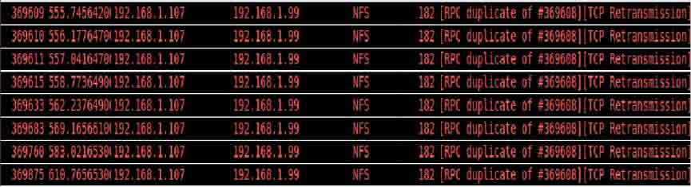

# 无线多操作系统启动之 uInitrd 阶段 NFS 挂载篇

2014/06/06 14:23 | [Focusstart](http://drops.wooyun.org/author/Focusstart "由 Focusstart 发布") | [技术分享](http://drops.wooyun.org/category/tips "查看 技术分享 中的全部文章") | 占个座先 | 捐赠作者

## 0x00 背景

* * *

项目组在无线环境下实现了 Ubuntu12.04 和 Android4.0 系统在 Pandaboard ES 开发板上的无线加载、启动及切换。启动过程中操作系统内核 uImage 和临时根文件系统 uInitrd 通过 wifi 网络加载到 SD 卡中，SD 卡中只有轻量级的操作系统引导程序及我们特制的 meta OS，系统实际的根文件系统 rootfs 存储于远程的服务器上，我们使用 NFS 协议在无线环境下挂载实际的根文件系统完成系统的启动。目前，国内无线多操作系统引导技术文档资料较少，支持多操作系统启动的手机主要有两款：一个是西班牙手机厂商 Geeksphone 开发的一款代号为 Revolution 的手机，另外一个是谷歌发布的 Nexus 系列。在这分享无线多操作系统启动过程中通过 NFS 协议挂载远程服务器上实际文件系统的一些经验，一种可行的技术手段。目前是在局域网环境，性能有限，仅供大家参考。想分三部分来讲。

```
（1）操作系统引导程序 Boot Loader 的改造；
（2）系统镜像文件 uImage 的改造；
（3）系统启动过程中 uInitrd 阶段 NFS 挂载相关问题。 
```

本文主要讲解 uInitrd 阶段 NFS 挂载相关问题，以 Ubuntu12.04 系统为例进行说明，Android 系统先留着。

附上 demo 图一张：


## 0x01 NFS 概述

* * *

NFS，即 Network File System 网络文件系统协议。NFS 协议可以透过网络，让不同的机器、不同的操作系统彼此分享文件。它与 Windows 系统中的文件资源共享类似，不同的是 NFS 是在 UNIX/Linux 系统下实现的。NFS 协议是通过网络将用户远程服务器上的数据挂载到本地目录，从而实现远程数据本地透明获取与访问的一种方式。NFS 服务器与客户端挂载示意图如下图所示：



服务器将目录`/home/gsm/ubuntu`设为共享目录，其他的客户端主机可以将该共享目录挂在指定的某个目录下。挂载成功后，就可以在挂载目录下看到与`/home/gsm/ubuntu`完全一样的子目录和文件。

要完成 uInitrd 阶段 NFS 的挂载，首先了解 Linux 系统的启动流程。

## 0x02 Linux 系统启动流程分析

* * *

```
（1）硬件加电自检、初始化；
（2）读取配置文件并执行操作系统引导程序 Boot Loader；
（3）读取 Boot Loader 的参数配置文件 boot.scr，将内核 uImage 加载到内存中执行，uImage 开始检测硬件与加载驱动程序；
（4）uImage 执行完成后，uInitrd 加载到内存中执行，uInitrd 解压调用 init 脚本。注：uInitrd 是 Linux 系统启动过程中使用的临时根文件系统，在 Linux 启动之前，Boot Loader 会将它加载到内存中，内核启动的时候会将这个文件解开作为根文件系统使用；
（5）init 脚本创建相应的文件目录，挂载到相应的文件系统。最后完成交权，切换到系统实际的文件系统。 
```

由 Linux 系统的启动流程可知要实现智能移动终端通过无线网络将操作系统内核镜像文件 uImage 和临时根文件系统 uInitrd 加载到终端上执行，并在 uInitrd 阶段通过 NFS 协议挂载服务器上的实际根文件系统 rootfs，完成系统交权、启动。首先要完成的是 Boot Loader 的改造（这里略过不讲），Boot Loader 读取配置文件将对应系统的 uImage 和 uInitrd 加载到内存中执行。然后，需要对系统内核 uImage 进行改造（略过不讲），最后需要对 uInitrd 进行改造（也就是本文重点要介绍的）。

主要包括三方面：

```
（1）uInitrd 无线模块的添加；
（2）uInitrd 启动阶段 init 脚本的修改；
（3）NFS 挂载脚本以及无线配置函数等相关函数的定义。 
```

## 0x03 NFS 无线挂载实现

* * *

### Step 1:

Init 脚本中有这么几行代码：

```
maybe_break mount  
   log_begin_msg "Mounting root file system..."  
   . /scripts/${BOOT}  
   parse_numeric ${ROOT}  
   mountroot 
```

Linux 系统本地启动时，/scripts/${BOOT}中的 BOOT 参数默认为 local，所以当系统改为 NFS 挂载远程文件系统启动时，BOOT 参数要改为 nfs。将/scripts/local 改为/scripts/nfs，即本地启动改为 NFS 挂载启动。

### Step 2:

Init 脚本中添加 wifi 配置函数 wifi_networking，函数在/scripts/functions 文件中定义。

```
wifi_networking()
{
    wpa_supplicant -B -iwlan0 -c /etc/wpa_supplicant/wpa_supplicant.conf
    ifconfig wlan0 192.168.1.99 netmask 255.255.255.0 
    route add default gw 192.168.1.1
} 
```

### Step 3:

修改 scripts 目录下 nfs 文件，指定 nfsmount 目录，设定挂载参数

### Step 4：

在 etc/wpa_supplicant/wpa_supplicant.conf 中设定 wifi 参数

### Step 5：

rootfs 中配置无线参数；

### Step 6：

当执行到 init 脚本最后一行代码时 run-init ${rootmnt} ${init}，系统的启动交给将要进入的系统的${init}，并输出，完成系统的交权，这里我们将 run-init 修改为/sbin/init。

## 0x04 NFS 协议分析

* * *

目前制约性能的一些主要因素。在启动过程中通过 wireshark 抓包分析可以知道，当终端与服务器的连接出现问题的时候，比如无线网络突然出现问题的时候，终端将不断地尝试与服务器重新建立连接直到与服务器的连接恢复正常。在每次尝试重连不成功后，连接的时间间隔将成指数级增长。（这里我们使用的 NFS 协议版本为 V3，使用的传输协议为 TCP/IP 协议）



除此之外，在无线网络环境下，数据块丢包是经常出现的，如果出现了一个丢包，这丢失的数据块会被重传。无线网络的不稳定性增加了数据块丢失率。在这段期间，NFS 客户端将不断地向 NFS 服务器请求重传丢失的块直至客户端成功收到丢失的块。（以太网有最大传输单元 MTU 的限制，为 1500 字节，所以数据传输过程会进行分块）


对 NFS 协议有一定研究的欢迎交流，包括 NFS 协议改进，并发环境以及 NFS 读写块大小，传输协议使用等参数设置问题。了解 pNFS 协议的求指导。

版权声明：未经授权禁止转载 [Focusstart](http://drops.wooyun.org/author/Focusstart "由 Focusstart 发布")@[乌云知识库](http://drops.wooyun.org)

分享到：

### 相关日志

*   [Tor 隐身大法 —— 用 Tor 来帮助我们进行渗透测试](http://drops.wooyun.org/tips/1226)
*   [攻击 JavaWeb 应用[7]-Server 篇[1]](http://drops.wooyun.org/tips/604)
*   [域内渗透基本技巧](http://drops.wooyun.org/tips/421)
*   [nmap 脚本使用总结](http://drops.wooyun.org/tips/2188)
*   [Linux PAM&&PAM;后门](http://drops.wooyun.org/tips/1288)
*   [Volatility FAQ](http://drops.wooyun.org/papers/2854)