# Pfsense HA（高可用性群集）

2014/11/25 10:42 | [合天智汇](http://drops.wooyun.org/author/合天智汇 "由 合天智汇 发布") | [运维安全](http://drops.wooyun.org/category/%e8%bf%90%e7%bb%b4%e5%ae%89%e5%85%a8 "查看 运维安全 中的全部文章") | 占个座先 | 捐赠作者

## 0x00 前言

* * *

前段时间公司防火墙所在物理机死机了，导致公司网络瘫痪。公司各网站无法访问，所以才想到去研究这个 Pfsense HA。正好公司在准备举办一个比赛，作为安全工作者，肯定有压力啦！！各个方面都要去考虑是否存在安全隐患。这个防火墙必然也在考虑的范围之内，如果这个防火墙被破坏者弄挂了怎么搞了？？？那比赛是不是就没法进行了。

这名字有点高大上的感觉啊！其实说白了，就是弄两 pfsense 防火墙，一台挂了，另外一台马上接管工作，不至于中断业务。

## 0x01 Pfsense&&HA 简单介绍

* * *

pfSense 是一个基于 FressBSD，专为防火墙和路由器功能定制的开源版本。它被安装在计算机上作为网络中的防火墙和路由器存在，并以可靠性著称，且提供往往只存在于昂贵商业防火墙才具有的特性。

HA(High Available), 高可用性群集，是保证业务连续性的有效解决方案，一般有两个或两个以上的节点，且分为活动节点及备用节点。通常把正在执行业务的称为活动节点，而作为活动节点的一个备份的则称为备用节点。当活动节点出现问题，导致正在运行的业务（任务）不能正常运行时，备用节点此时就会侦测到，并立即接续活动节点来执行业务。

## 0x02 Pfsense HA 深入

* * *

简单绘了个拓扑图：

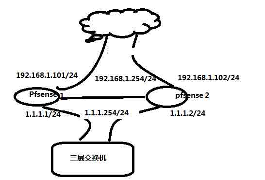

拓扑图确实有点不咋的啊！可以说是有点难看，有什么好的软件可以给我推荐下啊！

简单的说下上面那个图，这个实验我是在我的虚拟机上面弄的。

Pfsense1 + Pfsense2 = Pfsense HA

WAN:192.168.1.101 192.168.1.102 192.168.1.254

GW: 192.168.1.1 192.168.1.1 192.168.1.1

LAN:1.1.1.1 1.1.1.2 1.1.1.254

也就是在三层交换机上只要一条默认路由就好，这个条默认路由就指向 1.1.1.254。 这个 ip 是由 Pfsense1 和 Pfsense2 虚拟出来的。

如果你仔细观察的话，会发现我少了东西。呵呵！就是中间不是还有一根线么？？？

怎么你这里没体现出来了？？？？

中间这根线是心跳线，是 MASTER 和 BACKUP 通信用的，当 BACKUP 发现 MASTER 挂了，它就会自动切换状态变成 MASTER。这里我用的 LAN 口这根线做为心跳线。（这样有个缺点就是广播包有点多，对交换机的负担相对有点重）

注：在弄 Pfsense HA 过程中 Pfsense1 和 Pfsense2 有两个状态一个是 MASTER，一个是 BACKUP。

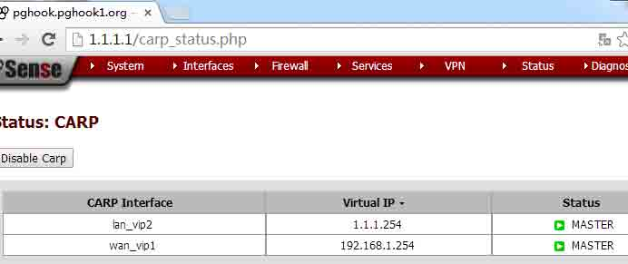

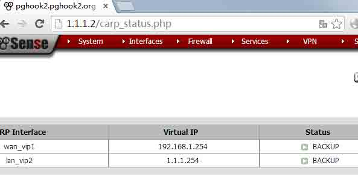

## 0x03 具体实现 Pfsense HA

* * *

## A 增加虚拟 ip

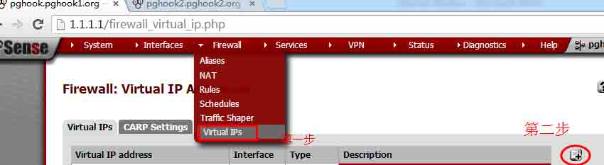

增加 wlan 口的虚拟 ip

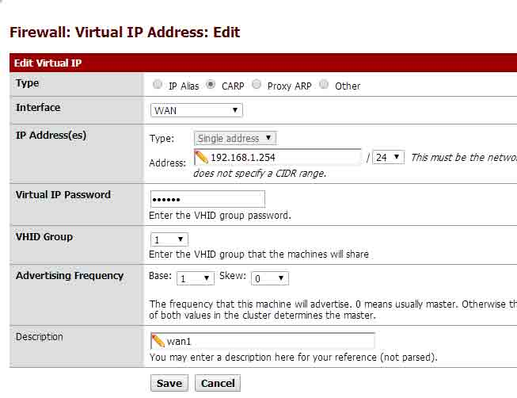

增加 lan 口的虚拟 ip

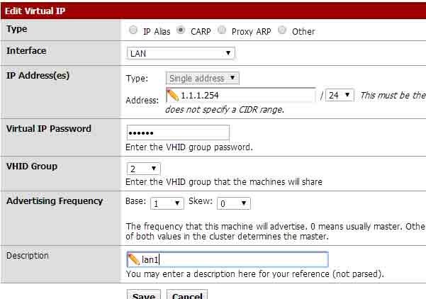

都弄完成了

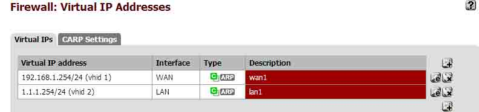

## B CARP 设置

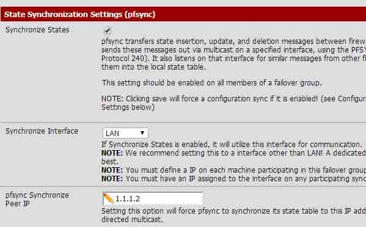

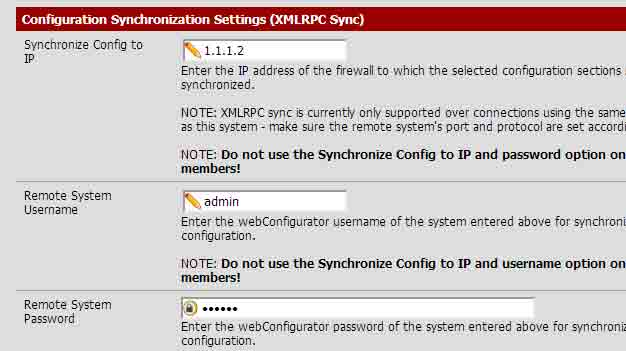

下面还有各种同步选项，请根据自己的实际情况去勾选。

弄好了后，你就可以登录到 http://1.1.1.254/index.php 上去配置。

也就是 MASTER 防火墙上去配置。在 MASTER 防火墙上配置了数据会同步到 BACKUP（有个前提啊！前提是你勾选了那个勾。），所以不用当心这个数据的问题。

## 0x04 简单的看个端口转发吧

* * *

这里需要在 MASTER 防火墙做了个端口转发

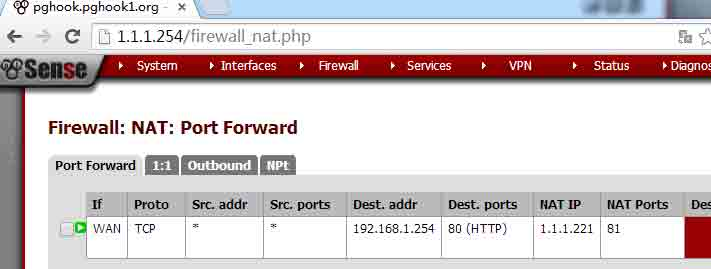

到 BACKUP 上面来看，数据已经同步过来了。

说明下：配置防火墙请一定要到 MASTER 防火墙上面去配置，在 BACKUP 上配了是没用的。

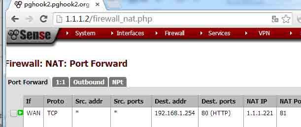

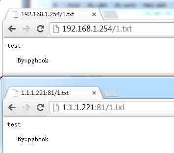

我把 MASTER 防火墙关机，BACKUP 防火墙马上接管成为 MASTER 防火墙， 照样不影响访问 254。

好吧！就介绍到这里，有问题欢迎大家来和我交流。

版权声明：未经授权禁止转载 [合天智汇](http://drops.wooyun.org/author/合天智汇 "由 合天智汇 发布")@[乌云知识库](http://drops.wooyun.org)

分享到：

### 相关日志

*   [Android Adobe Reader 任意代码执行分析(附 POC)](http://drops.wooyun.org/papers/1440)
*   [Memcache 安全配置](http://drops.wooyun.org/papers/865)
*   [从乌云看运维安全那点事儿](http://drops.wooyun.org/papers/410)
*   [Openssl 多个安全补丁简易分析危害及修复方案](http://drops.wooyun.org/papers/2185)
*   [邮箱伪造详解](http://drops.wooyun.org/papers/534)
*   [浅谈互联网中弱口令的危害](http://drops.wooyun.org/papers/234)