# 一次 app 抓包引发的 Android 分析（续）

2014/09/11 15:01 | [Elegance](http://drops.wooyun.org/author/Elegance "由 Elegance 发布") | [技术分享](http://drops.wooyun.org/category/tips "查看 技术分享 中的全部文章"), [移动安全](http://drops.wooyun.org/category/mobile "查看 移动安全 中的全部文章") | 占个座先 | 捐赠作者

## 0x00 起因

* * *

首先说明下，本文不是正统的《一次 app 抓包引发的 Android 分析记录》的续篇，只是分析的某 APP 和起因是一样的，故借题。然而本文所做的分析解决了《一次 app 抓包引发的 Android 分析记录》所留下的问题，故称为续。

移动应用已不像起初，burpuite 代理改遍天下。交叉编译、传输加密、DEX 加壳等防护方式开始再慢慢应用，我们已经很难再肆意的抓包改数据了。

文中所分析的 APP 也是，将加密算法交叉编译至 so 库中，对传输参数进行整体加密。分析 arm 汇编代码是一条路子，但已然令大部分人望而生畏。然而安全总是充满着各种奇思淫意，就算不走汇编，依旧能找到其它路子。

接下来通过这篇文章向各位分享下分析过程。

## 0x01 整体思路

* * *

我们此次分析的目的是为了还原传输过程中的 request 和 response，当然更重要的是要能控制 request 中的参数。为此我们需要了解参数是如何加密的。通过《一次 app 抓包引发的 Android 分析记录》我们知道加密函数是 libGoblin.so 中的 e 函数，但似乎通过它要还原出解密函数不是那么容易。

不过既然知道了参数是何函数进行加密，那我们只要再知道参数是什么样的格式，直接调用这个函数来加密伪造后的数据，而后抓包替换掉对应的参数不就可以了吗？

为此我采取的策略是在 json 数据进入加密函数之前将其截获，这样就能知道参数是以什么样的格式传递。知道了具体的参数格式，便可伪造数据抓包改包。

## 0x02 解析 request

* * *

首先来看下一个 request，如下图参数都是加密的，本小节目的就是为了搞清楚下面这一串是什么东西。

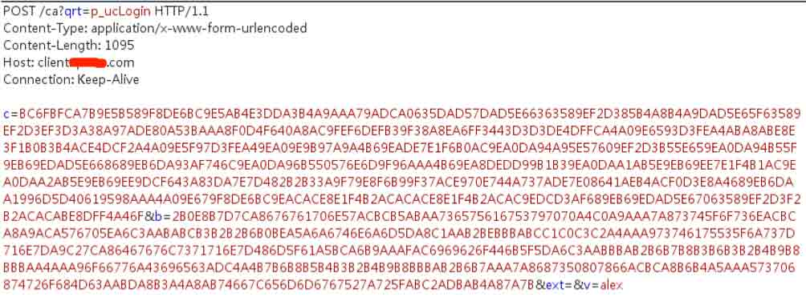

万年不变的第一步，apktool 反编译、dex2jar 反编译。当然代码混淆了，不过这不影响我们分析。android 发送网络请求主要采用 JDK 的 HttpURLConnection 和 Apache 的 HttpClient，搜索跟这两个相关的函数和字段以及请求的 URL。而这些特征函数和字段，通常是不会进行混淆的。Andbug 动态跟踪亦可，本次通文采用静态代码分析，故如此！

通过 AndroidManifest.xml 了解 app 的结构，找到主包名等等。jd-gui 查看 java 代码，request 是 POST 请求，所以搜索 post、HttpPost 字眼看看：

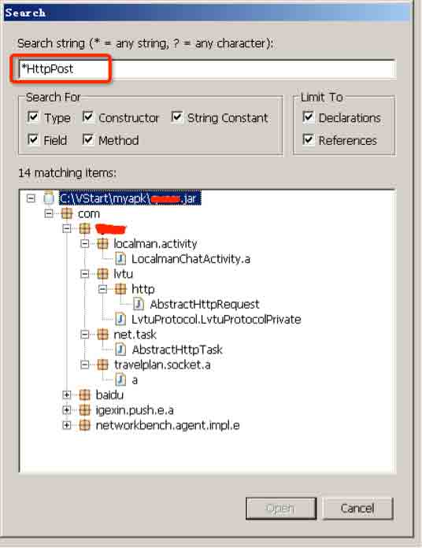

利用如上方式，反复通过搜索 http 请求方法及请求 URL 等特征缩小范围，最终定位到 AbstractHttpRequest 类，该类是抽象类并拥有很多有趣的方法。而 CommonTask 类扩展了 AbstractHttpRequest 类。通过阅读代码知道该类为关键类。《一次 app 抓包引发的 Android 分析记录》文中亦说明了，此处不再赘述！

而 c 参数被 AbstractHttpRequest 的 chrome()处理，跟进该函数：

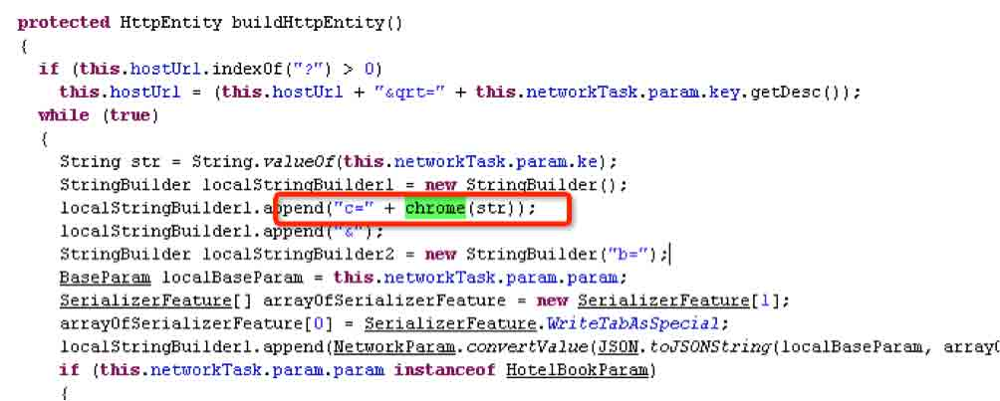

str 为字符串常量“6000lex”和 json 数据一起进入 NetworkParam 的 convertValue(),跟进：

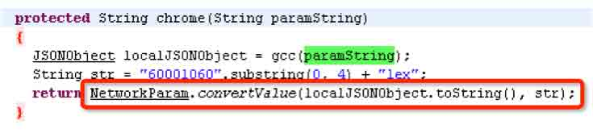

在 convertValue()中最终调用了加密函数，因此我们在 Goblin.e 加密 paramString1 和 paramString2 之前将这两个参数通过 log 打印出来就知道请求的数据到底是什么东西了。

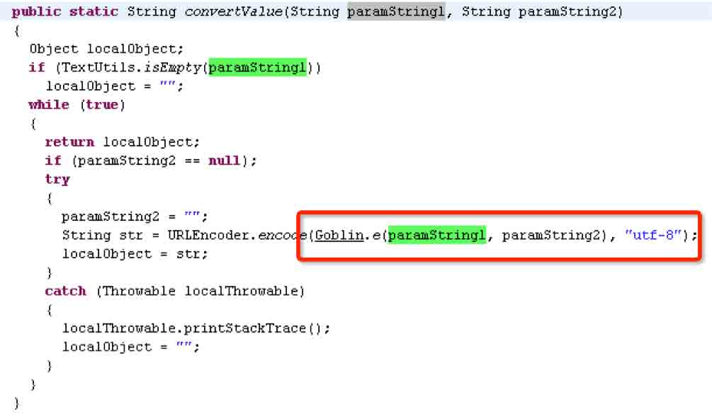

用文本编辑器打开 com.xxx.net 下的 NetworkParam.smali 定位到 convertValue()函数,在 Goblin.e 处添加如下代码：

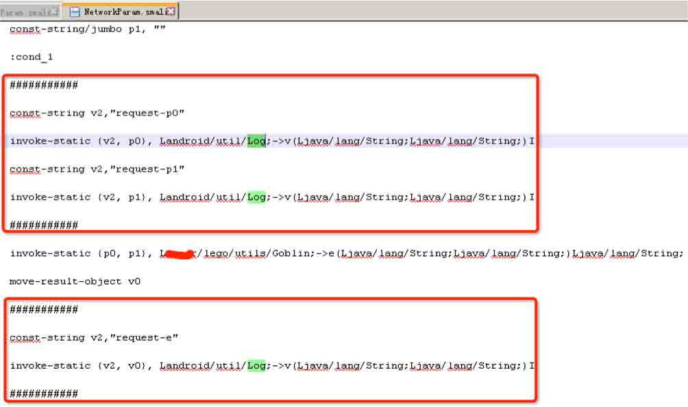

通过修改 smali 代码将加密前后的字符串打印出来，重打包签名后安装，查看 logcat 日志:

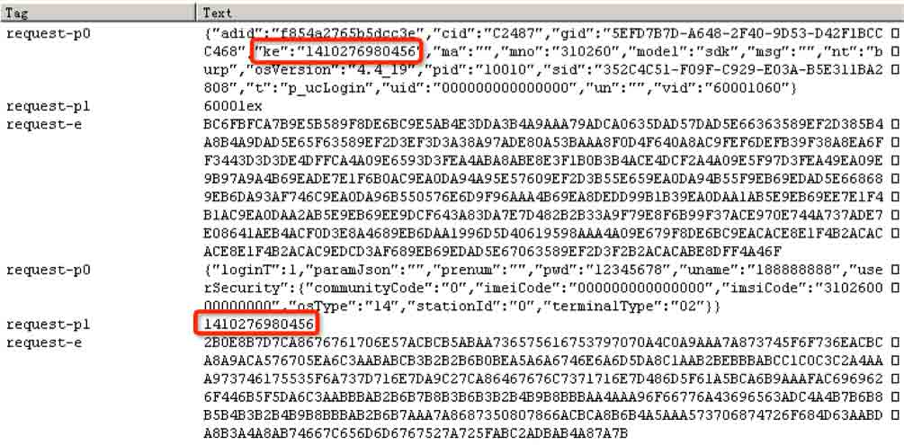

如上图所示，现在我们已经知道了参数传递的格式了。然而日志中还出现了预料之外的数据。照上分析 p1 应该为常量“6000lex”，而图中却出现了时间戳。对比传输的数据（下图），发现上图第二个 request-e 是 b 参数的密文。而 b 的明文正是登陆信息。搜索 convertValue 发现 b 也是调用该函数加密，故导致此现象。

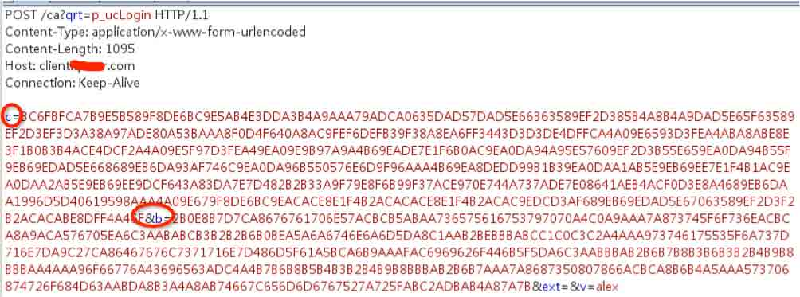

通过如上分析，最终确定了登陆时 c 和 b 格式分别为：

```
c={“adid":"f854a2765b5dcc3e","cid":"C2487","gid":"5EFD7B7D-A648-2F40-9D53-D42F1BCCC468","ke":"1410276980456","ma":"","mno":"310260","model":"sdk","msg":"","nt":"burp","osVersion":"4.4_19","pid":"10010","sid":"352C4C51-F09F-C929-E03A-B5E311BA2808","t":"p_ucLogin","uid":"000000000000000","un":"","vid":"60001060"} 

b={"loginT":1,"paramJson":"","prenum":"","pwd":"xxxx","uname":"xxxx","userSecurity":{"communityCode":"0","imeiCode":"000000000000000","imsiCode":"310260000000000","osType":"14","stationId":"0","terminalType":"02"}} 
```

由于 c 中的 ke 和 b 的加密因子一样。猜测服务端解密时，先通过“6000lex”解密出 c，获取 ke 的值，再通过 ke 解密出 b 参数。

实际上上面那个猜想是正确的，而《一次 app 抓包引发的 Android 分析记录》中所做的猜想也是正确的。Goblin.d()就是解密函数。

《一次 app 抓包引发的 Android 分析记录》中所记录的：

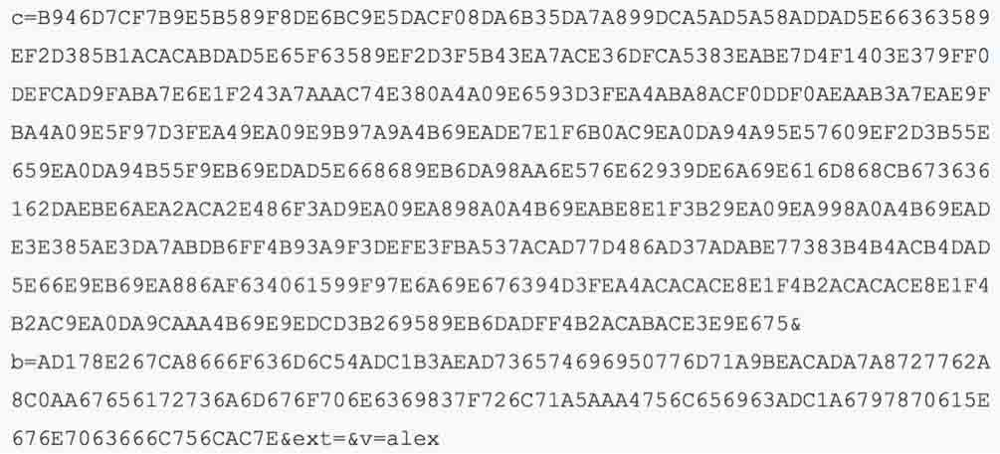

利用 Goblin.d()解密后为：

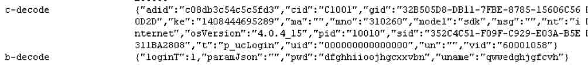

至于《一次 app 抓包引发的 Android 分析记录》中为何解密会失败，下面章节会说明到！

## 0x03 解析 response

* * *

如下，response 响应报文亦是乱七八糟的一堆。这样就算我们能改包了，也无法判断结果到底是否正确。因此在开始改包之前，必须先解密 response。

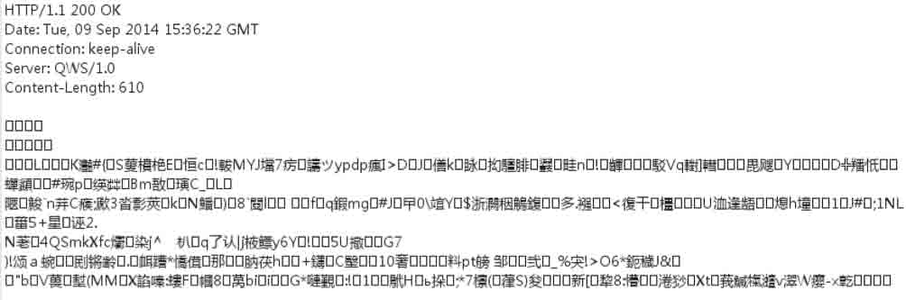

通过 0x02 的分析知道 app 是用 Apache 的 HttpClient 进行 post 请求。而 HttpClient 获取 response 报文是通过 getEntity()函数。故直接搜索 getEntity，有了 0x02 的分析，轻松定位到 AbstractHttpRequest 类的 getResult 方法，由于此处 dex2jar 反编译错误。所以直接分析 smali 代码。

打开 AbstractHttpRequest.smali:

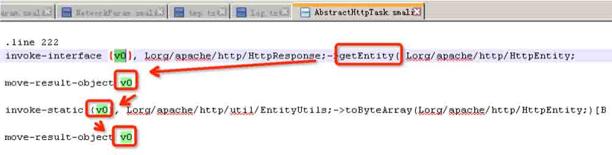

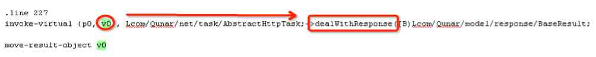

getEntity()结果为 v0，v0 最终进入到 dealWithResponse(),而 dealWithResponse 返回一个 Object 而不是 String，所以继续跟进 dealWithResponse():

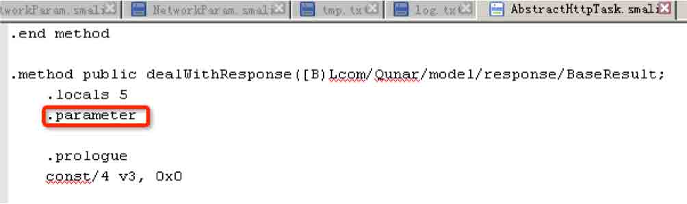

dealWithResponse 只有一个参数，故跟踪 p1:

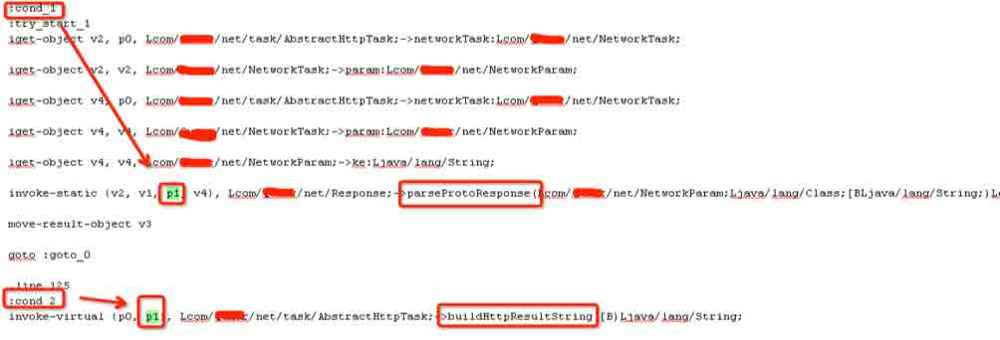

p1 最终进行到 parseProtoResponse()和 buildHttpResultString()中,跟进 parseProtoResponse()：

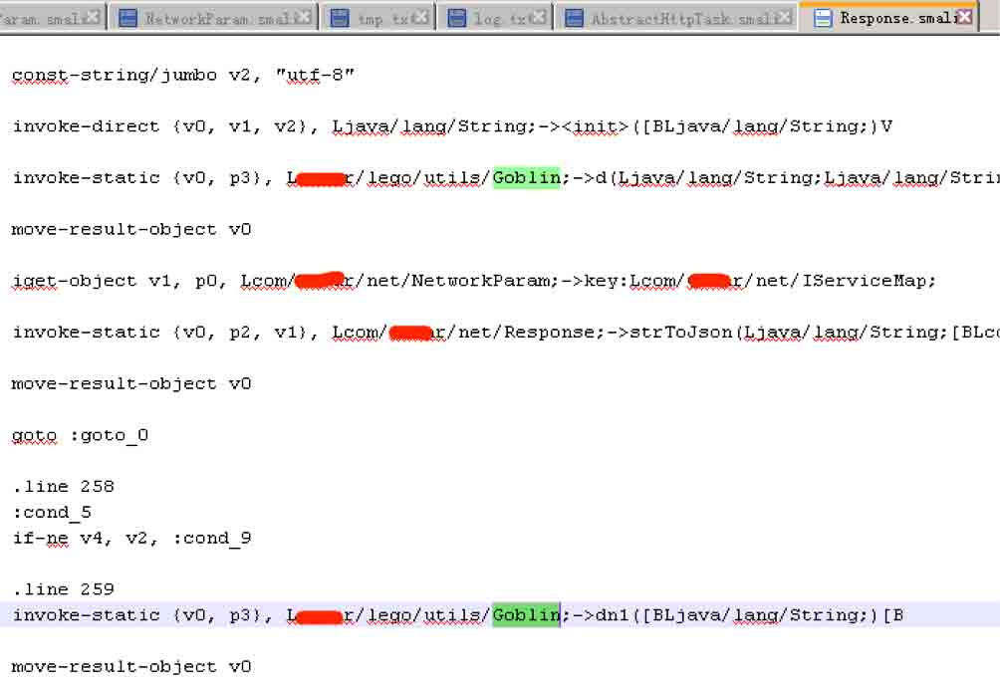

parseProtoResponse()中调用了 Goblin 中的函数，可能这个函数就是我们想要的。先放着。我们再看看 buildHttpResultString()这个函数，此处直接 jd-gui 查看：

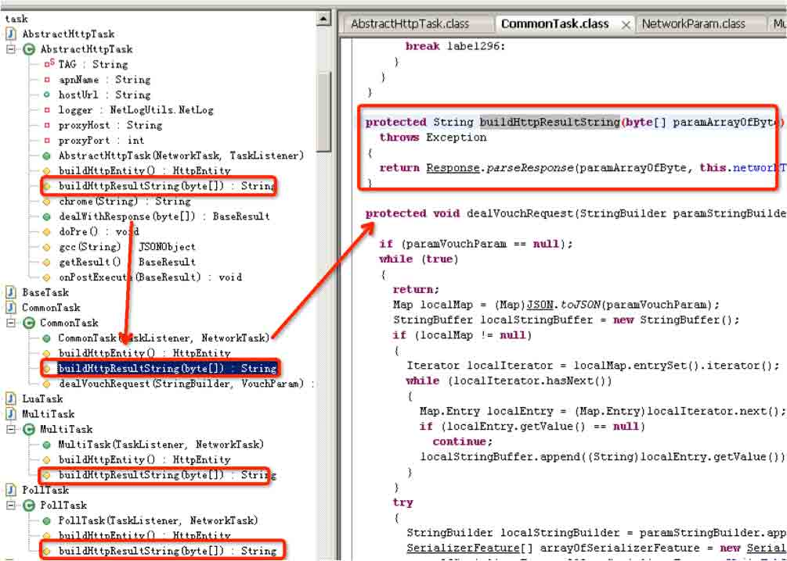

buildHttpResultString()是个抽象类，具体代码在 CommonTask、MultiTask、PollTask 中实现。而这几个类中最终都是调用 Response 类的 pareResponse()方法，而 pareResponse()也调用了 Goblin 中的解密函数。parseProtoResponse()也是 Response 类一个方法。所以我们将解密响应报文的函数定位在这两个函数中。接下来就是验证下是否正确。

修改 Response.smali 中的 parseProtoResponse()和 pareResponse()，将解密后的结果通过日志打印出来：

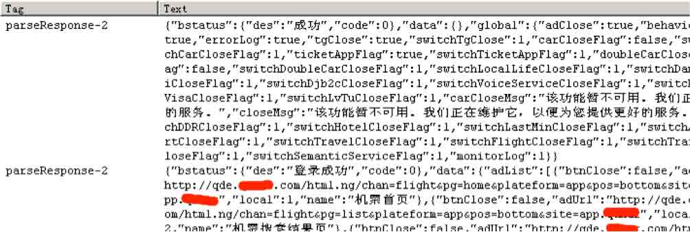

在 parseProtoResponse()和 pareResponse()中标记了几处，但最终只出现如上结果，故确认解密函数为 pareResponse()。

## 0x04 控制 request

* * *

至此我们已经完全看到了 request 和 response 传输的明文内容，如下所示，一个完成的请求响应过程：

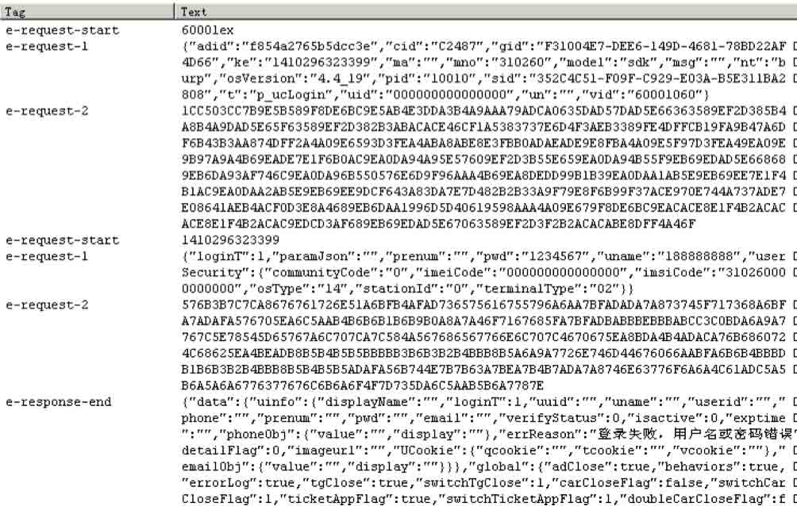

当然我们目的是为了测试，所以必须要能改 request 请求才可以。

尝试一：

既然我们知道了 request 的加密函数，那么在自己的 APP 中调用，加密完替换掉 burp 拦截到得数据即可。

新建一个 app 引用同样的 Goblin 类，进行加解密测试，测试代码如下：

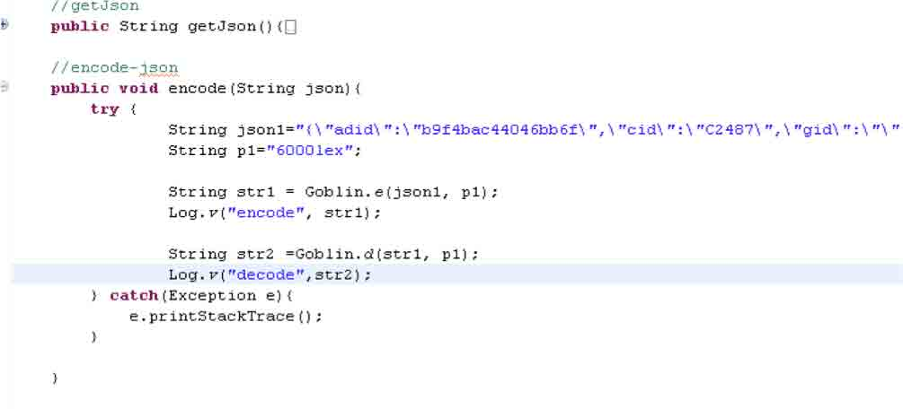

加密可以加密，但实际上加密结果和原始的密文不一样。而解密却失败，失败的原因正和《一次 app 抓包引发的 Android 分析记录》中所做的测试一样。

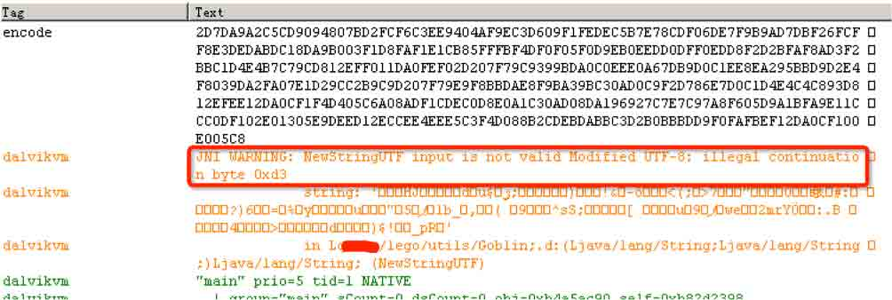

发生了 JNI WARNING：NewStringUTF input is not valid Modified UTF-8 错误，而这个错误是由于在 JNI 中，google 修改了 UTF8 的标准，当正常 UTF8 中包含了不符合这个标准的字节时，checkJNI 函数就会报这个错，导致应用崩溃。

在 google 中亦有关于此错误的报告：

https://code.google.com/p/android/issues/detail?id=64892        

https://code.google.com/p/android/issues/detail?id=25386

然而直接将原始密文拿来解密却可以正常解码，所以问题出可能出在加密环节。折腾半天，没有发现适合我们这边的处理办法。但在测试过程中发现，在原始 APP 应用中通过修改 smali 代码可以正常加解密。难道 so 中还有检测环境？当然这个得查看 arm 汇编才知道。

既然如此，那直接改造原始 app 吧。

尝试二：

改造思路：在原始 APP 内部中拦截参数—>通过外部修改拦截到的参数—>放行参数，后续按正常流程进行

在原始 app 内部中拦截参数，只要在让参数再进入加密之前进入到我们控制的函数中即可。为了方便说明。我们先来看看如何通过外部修改内部拦截的参数。

借助 android 的广播机制，我们能实现实时的跟 app 进行交互。因此，也能实时的让外部跟 app 内部进行数据交互。新建一个 myBroadcast 类，代码如下：

```
public class myBroadcast extends BroadcastReceiver{ public static boolean sw = false; public static boolean swc = false; public static boolean swb = false; public static String datac = null; public static String datab = null; public static String kec = "6000lex";

    // 接收广播
    public void onReceive(Context context, Intent intent) {     
        Log.i("broadcast-intent",intent.toString());

        String action = intent.getAction();
        if(action.equals("com.test.broadcast1")){
            sw = intent.getBooleanExtra("sw", true);   // 控制是否拦截
            swc = intent.getBooleanExtra("swc", false);// 控制拦截 c      
            swb = intent.getBooleanExtra("swb",false); // 控制拦截 b

        }
        else if(action.equals("com.test.broadcast2")){
            datac = intent.getStringExtra("datac");    // 接收 c
            datab = intent.getStringExtra("datab");    // 接收 b
        }       
        Log.v("receiver-data:sw:swc:swb|datac:datab",sw+":"+swc+":"+swb+"|"+datac+":"+datab);
    }

    // 延迟函数
    public static void delay(){     
        try {
            Thread.currentThread();
            Thread.sleep(3000);
        } catch (InterruptedException e) {
            e.printStackTrace();
        }
    }

    // 修改函数
    public static String alter(String ke,String json){
        Log.v("json-data-1",ke+":"+json);

        while(sw){
            delay();
            if(ke.equals(kec)){
                if(swc){
                    if(datac!=null){
                        json = datac;
                        Log.v("json-data1-2",json);
                        break;
                    }                                           
                }
                else{
                    break;
                }
            }
            else{
                if(swb){
                    if(datab!=null){
                        json =datab;
                        Log.v("json-data2-2",json);
                        break;                  
                    }
                }
                else{
                    break;
                }
            }                       
        }   
        return json;
    }

}

```

利用 onReceive 实时接收外部数据，利用 alter 函数检测外部是否发送了拦截指令。当收到拦截的指令时，调用 delay()函数进行循环延时，直到接收到伪造的数据或者关闭拦截。

将 myBroadcast 类转化为 smali 代码。把 myBroadcast.smali 放在 NetworkParam.smali 同级目录下。并在 AndroidManifest.xml 中注册 myBroadcast 这个 receiver，且将 exproted 设置为 true。

即允许该 receiver 被外部访问。

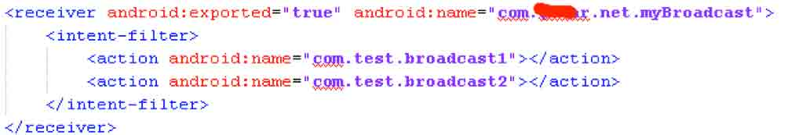

这样我们就能在 NetworkParam.smali 中使用这个 receiver

接下来，我们来修改 NetworkParam.smali，使其接收我们的指令。在 Goblin.e 前后修改如下：

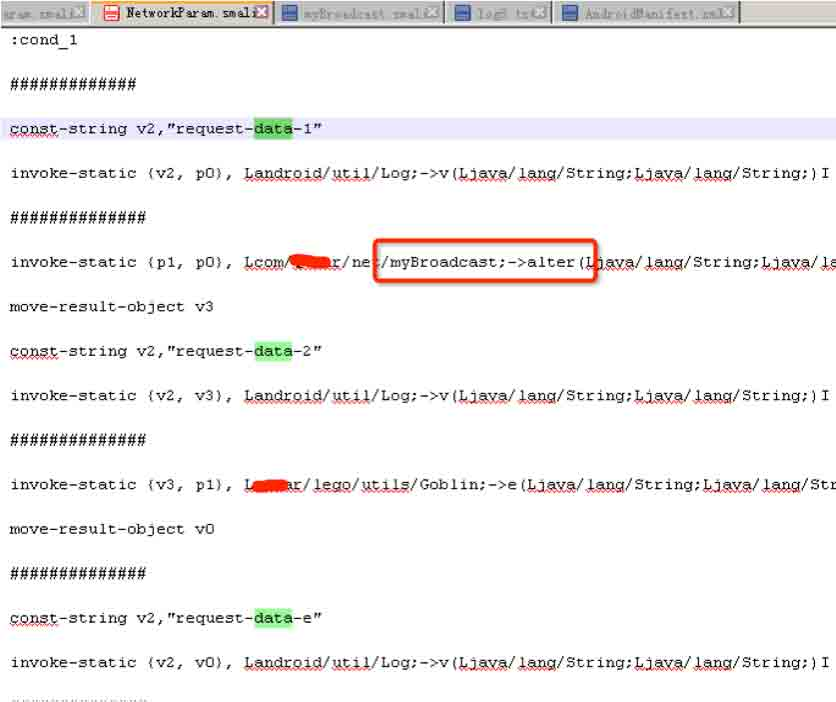

让 p0 进入 alter()函数，修改后结果保存至 v3，让 v3 替换 p0 进入到 Goblin.e()中。“request-data-1”打印出原来的参数，“json-data-1”打印出进入 alter 函数中的参数。“request-data-2”打印出修改后的参数，“request-data-e”，打印出加密后的参数。

修改完后，重新打包、签名、安装，运行查看 logcat 日志：

1、 默认设置是不拦截，所以 logcat 日志中应该能完整得看到

```
“request-data-1”—>“json-data-1”—>“request-data-2(不变)”—>“request-data-e”—>“response-data” 
```

测试如下：

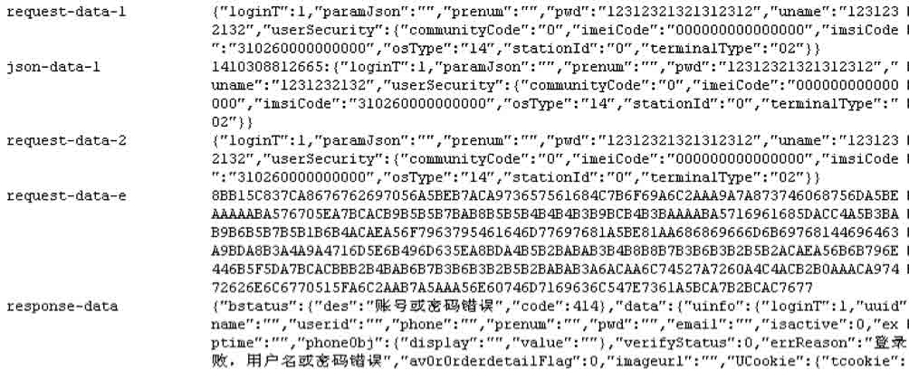

和预期一样

2、 设置拦截指令，即 sw 为 true，拦截数据进入循环延迟并等待接收伪造的参数。所以 logcat 日志中应该只能看到“request-data-1”—>”json-data-1”,测试如下：

am 命令发送广播：

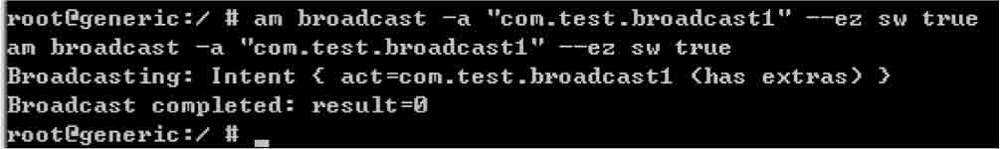

Logcat 日志，如预期，数据被拦截，应用一直处于加载当中：

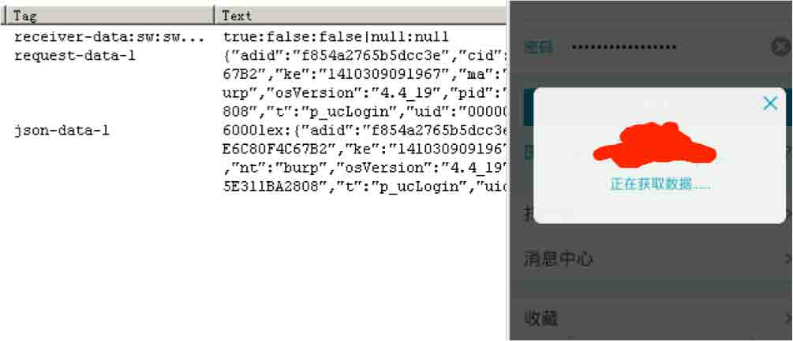

3、发送伪造数据，按照设计。此时 logcat 日志中应该能看到

```
“request-data-1”—>“json-data-1”—>“request-data-2(修改后)”—>“request-data-e”—>“response-data” 
```

测试如下：

发送广播指令，拦截 b 参数,放行 c 参数：

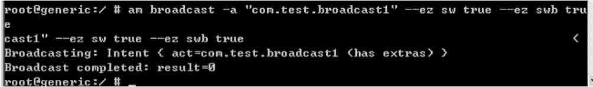

Logcat 日志显示如下，c(带 600lex 的)被放行，b(带时间戳的)被拦截：

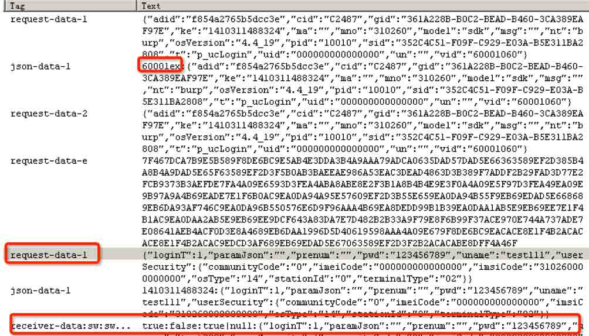

am 命令发送 datab 数据，将 uname 改为 test222：

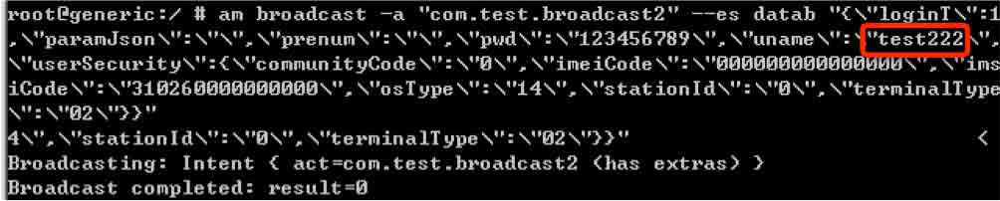

结果如下，receiver 接收到伪造的数据后，将原 b 参数进行修改后放行：

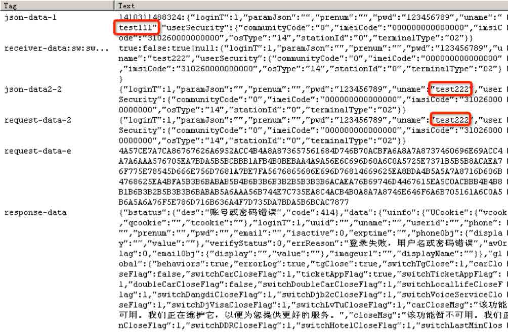

和预期一样。

## 0x05 结语

* * *

最终，我们实现了查看传输明文信息，并控制了 request 请求报文。即便它采用 so 加密。我们依旧可以尽情的测试了~

版权声明：未经授权禁止转载 [Elegance](http://drops.wooyun.org/author/Elegance "由 Elegance 发布")@[乌云知识库](http://drops.wooyun.org)

分享到：

### 相关日志

*   [Android 证书信任问题与大表哥](http://drops.wooyun.org/tips/3296)
*   [Android Broadcast Security](http://drops.wooyun.org/tips/4393)
*   [APK 签名校验绕过](http://drops.wooyun.org/mobile/4296)
*   [一种新的攻击方法——Java-Web-Expression-Language-Injection](http://drops.wooyun.org/tips/2494)
*   [JAVA 逆向&反混淆-追查 Burpsuite 的破解原理](http://drops.wooyun.org/tips/2689)
*   [Android Activtity Security](http://drops.wooyun.org/tips/3936)