# 攻击 JavaWeb 应用[7]-Server 篇[1]

2013/09/22 15:39 | [园长](http://drops.wooyun.org/author/园长 "由 园长 发布") | [web 安全](http://drops.wooyun.org/category/web "查看 web 安全 中的全部文章"), [技术分享](http://drops.wooyun.org/category/tips "查看 技术分享 中的全部文章") | 占个座先 | 捐赠作者

## java 应用服务器

* * *

Java 应用服务器主要为应用程序提供运行环境，为组件提供服务。Java 的应用服务器很多，从功能上分为两类：JSP 服务器和 Java EE 服务器。

### 常见的 Server 概述

常见的 Java 服务器:Tomcat、Weblogic、JBoss、GlassFish、Jetty、Resin、IBM Websphere、Bejy Tiger、Geronimo、Jonas、Jrun、Orion、TongWeb、BES Application Server、ColdFusion、Apusic Application Server、Sun Application Server 、Oracle9i/AS、Sun Java System Application Server。

Myeclipse 比较方便的配置各式各样的 Server，一般只要简单的选择下 Server 的目录就行了。  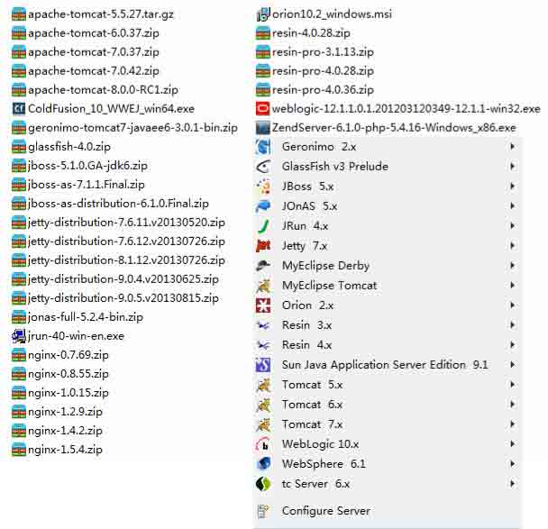

部署完成后启动进入各个 Server 的后台：

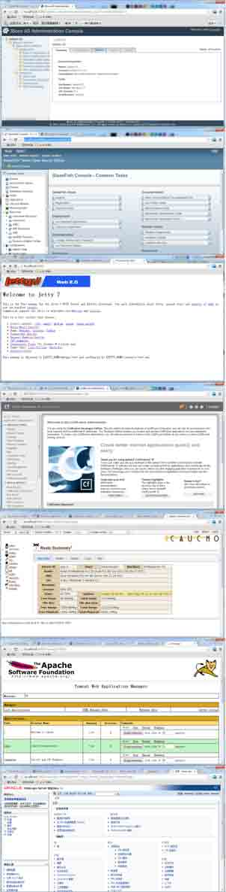 

### 构建 WebShell war 文件

```
1、打开 Myeclipse 新建 Web 项目
2、把 jsp 放到 WebRoot 目录下
3、导出项目为 war 文件 
```

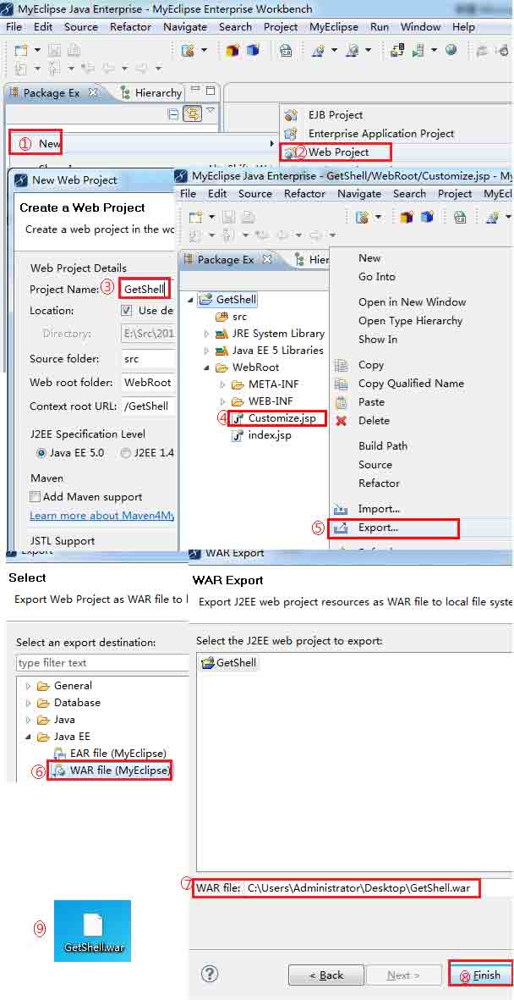 

## Tomcat

* * *

Tomcat 服务器是一个免费的开放源代码的 Web 应用服务器，属于轻量级应用服务器，在中小型系统和并发访问用户不是很多的场合下被普遍使用，是开发和调试 JSP 程序的首选。

### Tomcat 版本

Tomcat 主流版本:5-6-7，最新版 Tomcat8 刚发布不久。Tomcat5 较之 6-7 在文件结构上有细微的差异，6-7-8 没有大的差异。最新版的 Tomcat8 主要新增了：Servlet 3.1, JSP 2.3, EL 3.0 and Web Socket 1.0 支持。

版本详情说明：[`tomcat.apache.org/whichversion.html`](http://tomcat.apache.org/whichversion.html)

结构目录：

Tomcat5：

```
Bin、common、conf、LICENSE、logs、NOTICE、RELEASE-NOTES、RUNNING.txt、Server、shared、Temp、webapps、work 
```

Tomcat6-8：

```
Bin、conf、lib、LICENSE、logs、NOTICE、RELEASE-NOTES、RUNNING.txt、temp、webapps、work 
```

关注 conf 和 webapps 目录即可。conf 目录与非常重要的 tomcat 配置文件比如登录帐号所在的 tomcat-users.xml；域名绑定目录、端口、数据源(部分情况)、SSL 所在的 server.xml；数据源配置所在的 context.xml 文件，以及容器初始化调用的 web.xml。

源码下载：

Tomcat6：[`svn.apache.org/repos/asf/tomcat/tc6.0.x/tags/TOMCAT_6_0_18/`](http://svn.apache.org/repos/asf/tomcat/tc6.0.x/tags/TOMCAT_6_0_18/)

Tomcat7：[`svn.apache.org/repos/asf/tomcat/tc7.0.x/trunk/`](http://svn.apache.org/repos/asf/tomcat/tc7.0.x/trunk/)

### Tomcat 默认配置

#### 1、tomcat-users.xml

Tomcat5 默认配置了两个角色：tomcat、role1。其中帐号为 both、tomcat、role1 的默认密码都是 tomcat。不过都不具备直接部署应用的权限，默认需要有 manager 权限才能够直接部署 war 包，Tomcat5 默认需要安装 Administration Web Application。Tomcat6 默认没有配置任何用户以及角色，没办法用默认帐号登录。

配置详解：http://tomcat.apache.org/tomcat-7.0-doc/manager-howto.html#Introduction

#### 2、context.xml

Tomcat 的上下文，一般情况下如果用 Tomcat 的自身的数据源多在这里配置。找到数据源即可用对应的帐号密码去连接数据库。

```
<Context>
    <WatchedResource>WEB-INF/web.xml</WatchedResource>
    <Resource name="jdbc/u3" auth="Container" type="javax.sql.DataSource"
              maxActive="100" maxIdle="30" maxWait="10000"
              username="xxxxx" password="xxxx" driverClassName="com.mysql.jdbc.Driver"
              url="jdbc:mysql://192.168.0.xxx:3306/xxx?autoReconnect=true"/>
</Context> 
```

#### 3、server.xml

Server 这个配置文件价值非常高，通常的访问端口、域名绑定和数据源可以在这里找到，如果想知道找到域名对应的目录可以读取这个配置文件。如果有用 Https，其配置也在这里面能够找到。

#### 4、web.xml

web.xml 之前讲 MVC 的时候有提到过，项目初始化的时候会去调用这个配置文件这个文件一般很少有人动但是不要忽略其重要性，修改 web.xml 可以做某些 YD+BT 的事情。

### Tomcat 获取 WebShell

#### Tomcat 后台部署 war 获取 WebShell

登录 tomcat 后台：http://xxx.com/manager/html，一般用`WAR file to deploy`就行了，`Deploy directory or WAR file located on server`这种很少用。

1>Deploy directory or WAR file located on server

Web 应用的 URL 入口、XML 配置文件对应路径、WAR 文件或者该 Web 应用相对于/webapps 目录的文件路径，然后单击 按钮，即可发布该 Web 应用，发布后在 Application 列表中即可看到该 Web 应用的信息。这种方式只能发布位于/webapps 目录下的 Web 应用。

2>WAR file to deploy

选择需要发布的 WAR 文件，然后单击 Deploy，即可发布该 Web 应用，发布后在 Application 列表中即可看到该 Web 应用的信息。这种方式可以发布位于任意目录下的 Web 应用。

其中，第二种方式实际上是把需要发布的 WAR 文件自动复制到/webapps 目录下，所以上述两种方式发布的 Web 应用都可以通过在浏览器地址栏中输入 http://localhost:8080/Web 进行访问。

 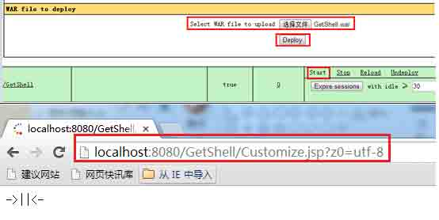

```
Tips:
当访问 xxxx.com 找不到默认管理地址怎么办?
1:http://xxxx.com/manager/html 查看是否存在
2:ping xxxx.com 获取其 IP 地址，在访问：http://111.111.111.111/manager/html
3:遍历 server.xml 配置读取配置 
```

### Tomcat 口令爆破

Tomcat 登录比较容易爆破，但是之前说过默认不对其做任何配置的时候爆破是无效的。

Tomcat 的认证比较弱，Base64(用户名:密码)编码，请求：” /manager/html/”如果响应码不是 401（未经授权：访问由于凭据无效被拒绝。）即登录成功。

```
conn.setRequestProperty("Authorization", "Basic " + new BASE64Encoder().encode((user + ":" + pass).getBytes())); 
```

### Tomcat 漏洞

Tomcat5-6-7 安全性并不完美，总是被挖出各种稀奇古怪的安全漏洞。在 CVE 和 Tomcat 官网也有相应的漏洞信息详情。

#### 怎样找到 Tomcat 的历史版本:

[`archive.apache.org/dist/tomcat/`](http://archive.apache.org/dist/tomcat/)

#### Tomcat 历史版本漏洞?

Tomcat 官网安全漏洞公布：

Apache Tomcat - Apache Tomcat 5 漏洞： [`tomcat.apache.org/security-5.html`](http://tomcat.apache.org/security-5.html)

Apache Tomcat - Apache Tomcat 6 漏洞： [`tomcat.apache.org/security-6.html`](http://tomcat.apache.org/security-6.html)

Apache Tomcat - Apache Tomcat7 漏洞： [`tomcat.apache.org/security-7.html`](http://tomcat.apache.org/security-7.html)

CVE 通用漏洞与披露: [`cve.scap.org.cn/cve_list.php?keyword=tomcat&action=search&p=1`](http://cve.scap.org.cn/cve_list.php?keyword=tomcat&action=search&p=1)

Cvedetails ： [`www.cvedetails.com/product/887/Apache-Tomcat.html?vendor_id=45`](http://www.cvedetails.com/product/887/Apache-Tomcat.html?vendor_id=45) [`www.cvedetails.com/vulnerability-list/vendor_id-45/product_id-887/Apache-Tomcat.html`](http://www.cvedetails.com/vulnerability-list/vendor_id-45/product_id-887/Apache-Tomcat.html)

Sebug: [`sebug.net/appdir/Apache+Tomcat`](http://sebug.net/appdir/Apache+Tomcat)

#### 怎样发现 Tomcat 有那些漏洞?

1、通过默认的报错页面（404、500 等）可以获取到 Tomcat 的具体版本，对照 Tomcat 漏洞。

2、利用 WVS 之类的扫描工具可以自动探测出对应的版本及漏洞。

#### 怎样快速确定是不是 Tomcat?

请求响应为:Server:Apache-Coyote/1.1 就是 tomcat 了。

#### Tomcat 稀奇古怪的漏洞：

Tomcat 的安全问题被爆过非常多，漏洞统计图：

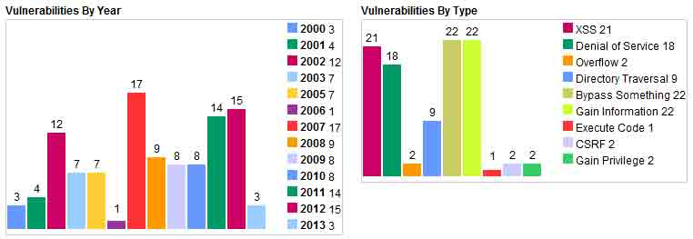

有一些有意思的漏洞，比如：Insecure default password CVE-2009-3548(影响版本: 6.0.0-6.0.20)

The Windows installer defaults to a blank password for the administrative user. If this is not changed during the install process, then by default a user is created with the name admin, roles admin and manager and a blank password.在 windows 安装版 admin 默认空密码漏洞，其实是用户安装可能偷懒，没有设置密码…


这样的问题在 tar.gz 和 zip 包里面根本就不会存在。有些漏洞看似来势汹汹其实鸡肋得不行如：Unexpected file deletion in work directory CVE-2009-2902 都已经有 deploy 权限了，闹个啥。

Tomcat 非常严重的漏洞（打开 Tomcat security-5、6、7.html 找）：

```
Important: Session fixation CVE-2013-2067 (6.0.21-6.0.36) 
Important: Denial of service CVE-2012-3544 (6.0.0-6.0.36) 
Important: Denial of service CVE-2012-2733 (6.0.0-6.0.35) 
Important: Bypass of security constraints CVE-2012-3546 (6.0.0-6.0.35) 
Important: Bypass of CSRF prevention filter CVE-2012-4431 (6.0.30-6.0.35) 
Important: Denial of service CVE-2012-4534 (6.0.0-6.0.35) 
Important: Information disclosure CVE-2011-3375 (6.0.30-6.0.33) 
Important: Authentication bypass and information disclosure CVE-2011-3190 (6.0.0-6.0.33) (………………………………………………….) 
Important: Directory traversal CVE-2008-2938 (6.0.18) 
Important: Directory traversal CVE-2007-0450 (6.0.0-6.0.9) 
```

如果英文亚历山大的同学，对应的漏洞信息一般都能够在中文的 sebug 找到。

Sebug：

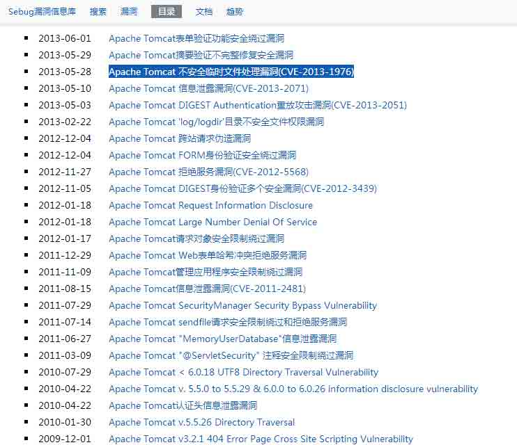

CVE 通用漏洞与披露：

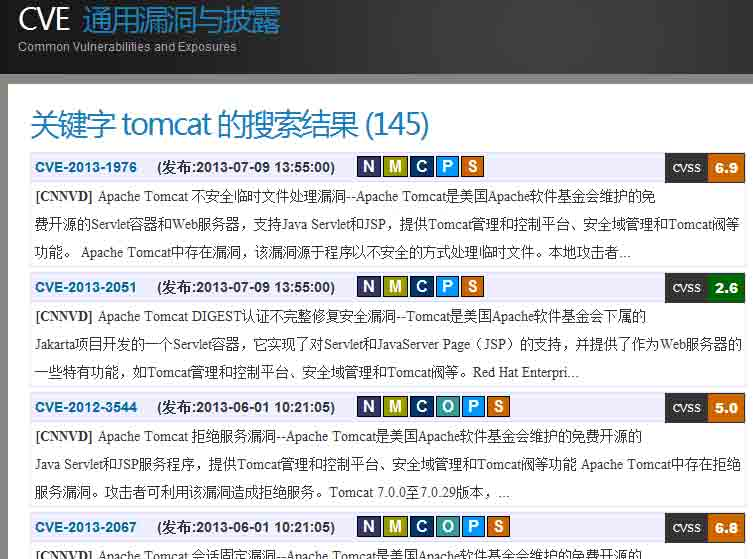

## Resin

* * *

Resin 是 CAUCHO 公司的产品，是一个非常流行的 application server，对 servlet 和 JSP 提供了良好的支持，性能也比较优良，resin 自身采用 JAVA 语言开发。

Resin 比较有趣的是默认支持 PHP! Resin 默认通过 Quercus 动态的去解析 PHP 文件请求。（Resin3 也支持，详情：[`zone.wooyun.org/content/2467`](http://zone.wooyun.org/content/2467)）

### Resin 版本

Resin 主流的版本是 Resin3 和 Resin4，在文件结构上并没有多大的变化。Resin 的速度和效率非常高，但是不知怎么 Resin 似乎对 Quercus 更新特别多。

4.0.x 版本更新详情：[`www.caucho.com/resin-4.0/changes/changes.xtp`](http://www.caucho.com/resin-4.0/changes/changes.xtp)

3.1.x 版本更新详情：[`www.caucho.com/resin-3.1/changes/changes.xtp`](http://www.caucho.com/resin-3.1/changes/changes.xtp)

### Resin 默认配置

#### 1、resin.conf 和 resin.xml

Tomcat 和 Rsin 的核心配置文件都在 conf 目录下，Resin3.1.x 默认是 resin.conf 而 4.0.x 默认是 resin.xml。resin.conf/resin.xml 是 Resin 最主要配置文件，类似 Tomcat 的 server.xml。

#### 1>数据源:

第一节的时候有谈到 resin 数据源就是位于这个文件，搜索 database（位于 server 标签内）即可定位到具体的配置信息。

#### 2>域名绑定

搜索 host 即可定位到具体的域名配置，其中的 root-directory 是域名绑定的对应路径。很容易就能够找到域名绑定的目录了。

```
<host id="javaweb.org" root-directory=".">
      <host-alias-regexp>^([^/]*).javaweb.org</host-alias-regexp>
      <web-app id="/" root-directory="D:/web/xxxx/xxxx"/>
</host> 
```

### Resin 默认安全策略

#### 1>管理后台访问权限

Resin 比较 BT 的是默认仅允许本机访问管理后台，这是因为在 resin.conf 当中默认配置禁止了外部 IP 请求后台。

```
<resin:set var="resin_admin_external" value="false"/> 
```

修改为 true 外部才能够访问。

#### 2>Resin 后台管理密码

Resin 的管理员密码需要手动配置，在 resin.conf/resin.xml 当中搜索 management。即可找到不过需要注意的是 Resin 的密码默认是加密的，密文是在登录页自行生成。比如 admin 加密后的密文大概会是：yCGkvrQHY7K8qtlHsgJ6zg== 看起来仅是 base64 编码不过不只是 admin 默认的 Base64 编码是：YWRtaW4= Resin,翻了半天 Resin 终于在文档里面找到了：[`www.caucho.com/resin-3.1/doc/resin-security.xtp`](http://www.caucho.com/resin-3.1/doc/resin-security.xtp)

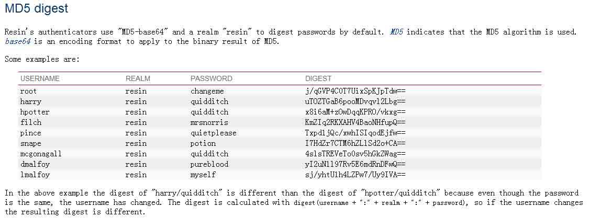

虽说是 MD5+Base64 加密但是怎么看都有点不对，下载 Resin 源码找到加密算法：

```
package com.caucho.server.security.PasswordDigest 
```

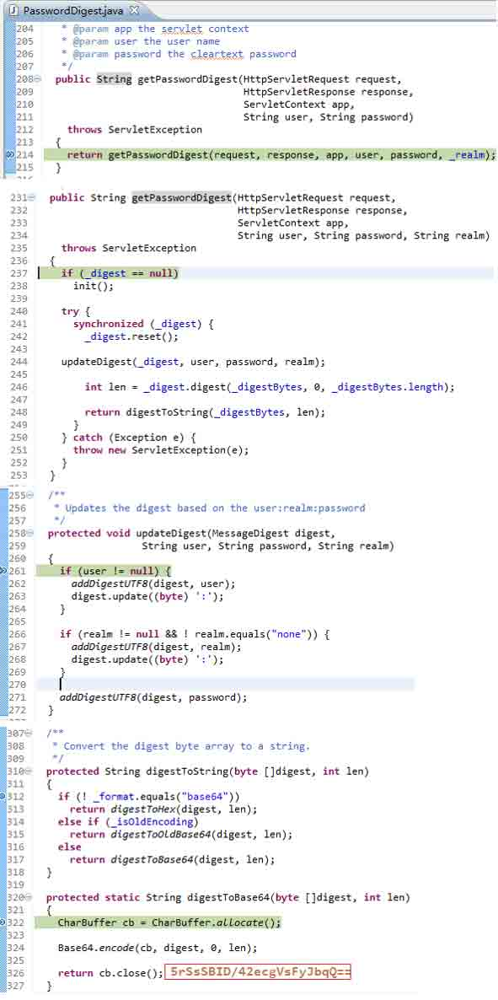

这加密已经没法反解了，所以就算找到 Resin 的密码配置文件应该也没法破解登录密码。事实上 Resin3 的管理后台并没有其他 Server（相对 JBOSS 和 Weblogic）那么丰富。而 Resin4 的管理后台看上去更加有趣。

Resin4 的加密方式和 Resin3 还不一样改成了 SSHA：

```
admin_user : admin
admin_password : {SSHA}XwNZqf8vxNt5BJKIGyKT6WMBGxV5OeIi 
```

详情：[`www.caucho.com/resin-4.0/admin/security.xtp`](http://www.caucho.com/resin-4.0/admin/security.xtp)

Resin3：


Resin4：

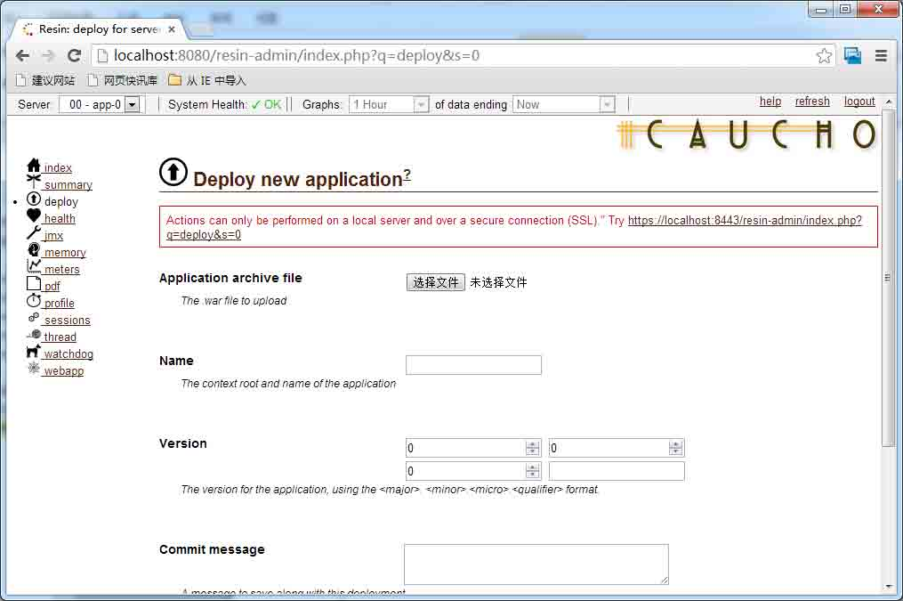

### Resin 获取 WebShell

As of Resin 4.0.0, it is now possible to deploy web applications remotely to a shared repository that is distributed across the cluster. This feature allows you to deploy once to any triad server and have the application be updated automatically across the entire cluster. When a new dynamic server joins the cluster, the triad will populate it with these applications as well.

Web Deploy war 文件大概是从 4.0.0 开始支持的，不过想要在 Web deploy 一个应用也不是一件简单的事情，首先得先进入后台。然后还得以 Https 方式访问。不过命令行下部署就没那没法麻烦。Resin3 得手动配置 web-app-deploy。 最简单的但又不爽办法就是想办法把 war 文件上传到 resin-pro-3.1.13webapps 目录下，会自动部署（就算 Resin 已启动也会自动部署，不影响已部署的应用）。

Resin3 部署详情：[`www.caucho.com/resin-3.1/doc/webapp-deploy.xtp`](http://www.caucho.com/resin-3.1/doc/webapp-deploy.xtp)

Resin4 部署 War 文件详情：[`www.caucho.com/resin-4.0/admin/deploy.xtp`](http://www.caucho.com/resin-4.0/admin/deploy.xtp)

Resin4 进入后台后选择 Deploy,不过还得用 SSL 方式请求。Resin 要走一个”非加密通道”。

To deploy an application remotely: log into the resin-admin console on any triad server. Make sure you are connecting over SSL, as this feature is not available over a non-encrypted channel. Browse to the "webapp" tab of the resin-admin server and at the bottom of the page, enter the virtual host, URL, and local .war file specifying the web application, then press "Deploy". The application should now be deployed on the server. In a few moments, all the servers in the cluster will have the webapp.

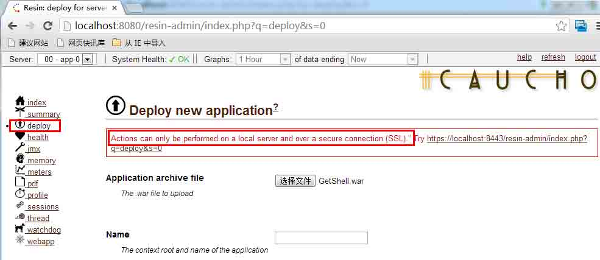

Resin4 敢不敢再没节操点？默认 HTTPS 是没有开的。需要手动去打开:

```
conf 
```

esin.properties

```
# https : 8443 
```

默认 8443 端口是关闭的，取消这一行的注释才能够使用 HTTPS 方式访问后台才能够 Web Deploy war。

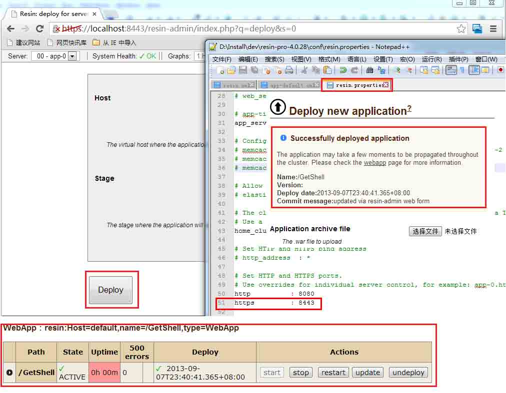

部署成功访问: [`localhost:8080/GetShell/Customize.jsp`](http://localhost:8080/GetShell/Customize.jsp) 即可获取 WebShell。

### Resin 漏洞

Resin 相对 Tomcat 的安全问题来说少了很多，Cvedetails 上的 Resin 的漏洞统计图：

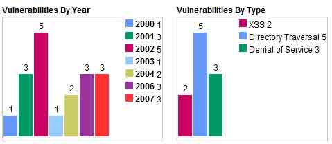

Cvedetails 统计详情： [`www.cvedetails.com/product/993/Caucho-Technology-Resin.html?vendor_id=576`](http://www.cvedetails.com/product/993/Caucho-Technology-Resin.html?vendor_id=576)

Cvedetails 漏洞详情： [`www.cvedetails.com/vulnerability-list/vendor_id-576/product_id-993/Caucho-Technology-Resin.html`](http://www.cvedetails.com/vulnerability-list/vendor_id-576/product_id-993/Caucho-Technology-Resin.html)

CVE 通用漏洞与披露： [`cve.scap.org.cn/cve_list.php?keyword=resin&action=search&p=1`](http://cve.scap.org.cn/cve_list.php?keyword=resin&action=search&p=1)

Resin3.1.3:

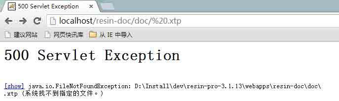

Fixed BugList: [`bugs.caucho.com/changelog_page.php`](http://bugs.caucho.com/changelog_page.php)

## Weblogic

* * *

WebLogic 是美国 bea 公司出品的一个 application server 确切的说是一个基于 Javaee 架构的中间件，BEA WebLogic 是用于开发、集成、部署和管理大型分布式 Web 应用、网络应用和数据库应用的 Java 应用服务器。将 Java 的动态功能和 Java Enterprise 标准的安全性引入大型网络应用的开发、集成、部署和管理之中。

### Weblogic 版本

Oracle 简直就是企业应用软件终结者，收购了 Sun 那个土鳖、Mysql、BAE Weblogic 等。BAE 在 2008 初被收购后把 BAE 终结在 Weblogic 10。明显的差异应该是从 10.x 开始到最新的 12c。这里主要以 Weblogic9.2 和最新的 Weblogic 12c 为例。

### Weblogic 默认配置

Weblogic 默认端口是 7001，Weblogic10g-12c 默认的管理后台是：http://localhost:7001/console

Weblogic10 以下默认后台地址是：http://192.168.80.1:7001/console/login/LoginForm.jsp

管理帐号是在建立 Weblogic 域的时候设置的。

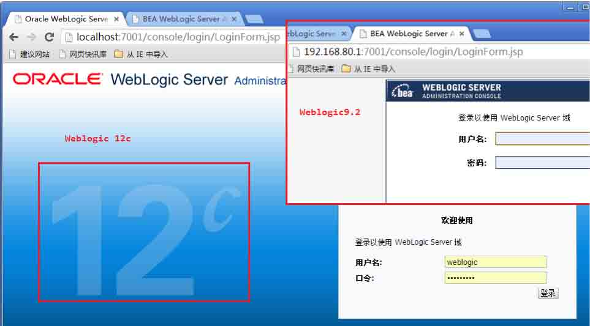

Weblogic 控制台：

[enter link description here](http://static.wooyun.org/20141017/2014101711455629318_png.jpg)

Weblogic10 以下默认管理帐号:weblogic 密码：weblogic。关于 Weblogic10++的故事还得从建域开始，默认安装完 Weblogic 后需要建立一个域。

### WebLogic 中的"域"?

域环境下可以多个 WebLogic Server 或者 WebLogic Server 群集。域是由单个管理服务器管理的 WebLogic Server 实例的集合。 Weblogic10++域默认是安装完成后由用户创建。帐号密码也在创建域的时候设置，所以这里并不存在默认密码。当一个域创建完成后配置文件和 Web 应用在：Weblogic12user_projectsdomains”域名”。

### Weblogic 默认安全策略

### 1、Weblogic 默认密码文件:

Weblogic 9 采用的 3DES（三重数据加密算法）加密方式，Weblogic 9 默认的管理密码配置文件位于：

```
weblogic_9weblogic92samplesdomainswl_serverserversexamplesServersecurityoot.properties 
```

#### boot.properties：

```
# Generated by Configuration Wizard on Sun Sep 08 15:43:13 GMT 2013
username={3DES}fy709SQ4pCHAFk+lIxiWfw==
password={3DES}fy709SQ4pCHAFk+lIxiWfw== 
```

Weblogic 12c 采用了 AES 对称加密方式，但是 AES 的 key 并不在这文件里面。默认的管理密码文件存放于：

```
Weblogic12user_projectsdomainsase_domainserversAdminServersecurityoot.properties 
```

(base_domain 是默认的”域名”)。

#### boot.properties：

```
boot.properties：
# Generated by Configuration Wizard on Tue Jul 23 00:07:09 CST 2013
username={AES}PsGXATVgbLsBrCA8hbaKjjA91yNDCK78Z84fGA/pTJE=
password={AES}Z44CPAl39VlytFk1I5HUCEFyFZ1LlmwqAePuJCwrwjI= 
```

怎样解密 Weblogic 密码?

Weblogic 12c：

```
Weblogic12user_projectsdomainsase_domainsecuritySerializedSystemIni.dat 
```

Weblogic 9：

```
weblogic_9weblogic92samplesdomainswl_serversecuritySerializedSystemIni.dat 
```

解密详情：[`drops.wooyun.org/tips/349`](http://drops.wooyun.org/tips/349) 、[`www.blogjava.net/midea0978/archive/2006/09/07/68223.html`](http://www.blogjava.net/midea0978/archive/2006/09/07/68223.html)

### 2、Weblogic 数据源(JNDI)

Weblogic 如果有配置数据源，那么默认数据源配置文件应该在：

```
Weblogic12user\_projectsdomainsase\_domainconfigconfig.xml 
```

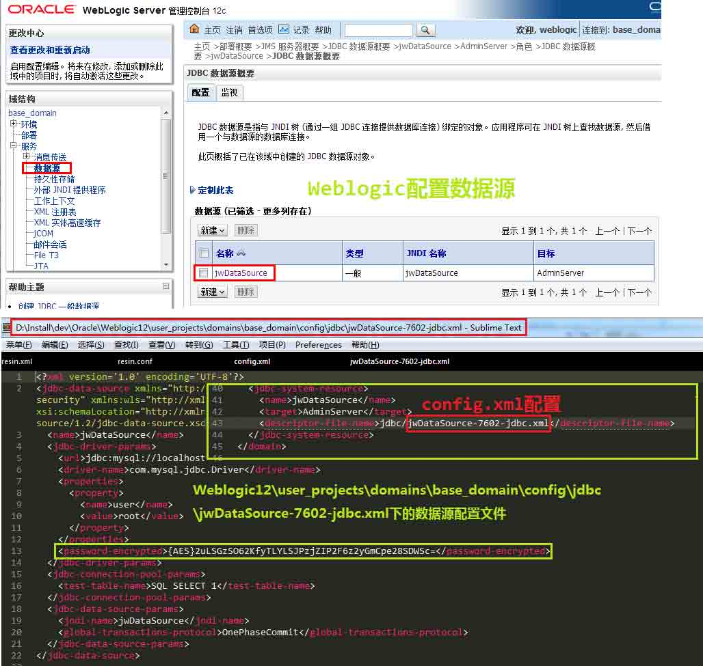

### Weblogic 获取 Webshell 

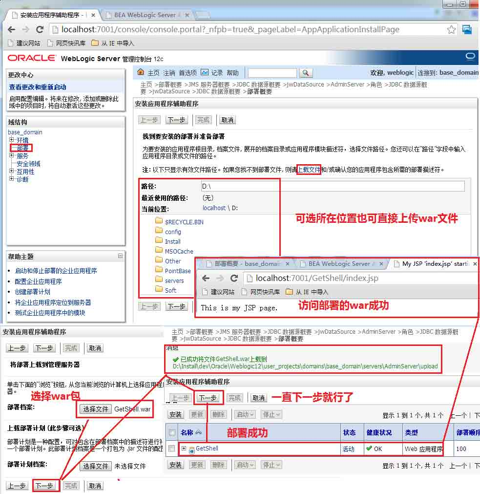

Weblogic 9 GetShell： [`drops.wooyun.org/tips/402`](http://drops.wooyun.org/tips/402)

## Websphere

* * *

WebSphere 是 IBM 的软件平台。它包含了编写、运行和监视全天候的工业强度的随需应变 Web 应用程序和跨平台、跨产品解决方案所需要的整个中间件基础设施，如服务器、服务和工具。

### Websphere 版本

Websphere 现在主流的版本是 6-7-8，老版本的 5.x 部分老项目还在用。GetShell 大致差不多。6、7 测试都有“默认用户标识 admin 登录”，Websphere 安装非常麻烦，所以没有像之前测试 Resin、Tomcat 那么细测。

### Websphere 默认配置

默认的管理后台地址（注意是 HTTPS）： [`localhost:9043/ibm/console/logon.jsp`](https://localhost:9043/ibm/console/logon.jsp)

默认管理密码：

```
1、admin (测试 websphere6-7 默认可以直接用 admin 作为用户标识登录，无需密码) 
2、websphere/ websphere
3、system/ manager 
```

默认端口：

```
管理控制台端口 9060
管理控制台安全端口 9043
HTTP 传输端口 9080
HTTPS 传输端口 9443
引导程序端口 2809
SIP 端口 5060
SIP 安全端口 5061
SOAP 连接器端口 8880
SAS SSL ServerAuth 端口 9401
CSIV2 ServerAuth 侦听器端口 9403
CSIV2 MultiAuth 侦听器端口 9402
ORB 侦听器端口 9100
高可用性管理通讯端口(DCS) 9353
服务集成端口 7276
服务集成安全端口 7286
服务集成器 MQ 互操作性端口 5558
服务集成器 MQ 互操作性安全端口 5578 
```

8.5 安装的时候创建密码： 

[enter link description here](http://static.wooyun.org/20141017/2014101711455696316_png.jpg)

Websphere8.5 启动信息：

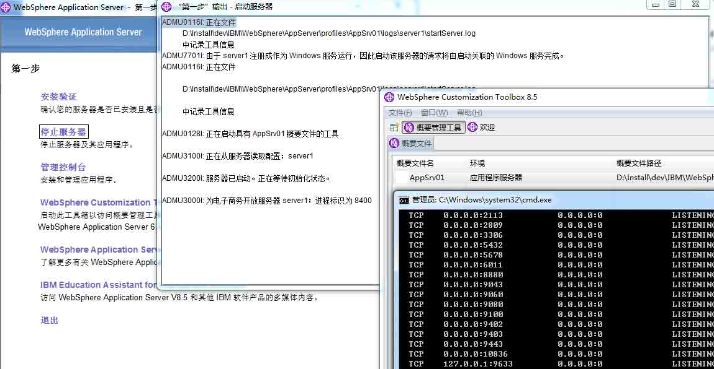

Websphere8.5 登录页面： https://localhost:9043/ibm/console/logon.jsp

[enter link description here](http://static.wooyun.org/20141017/2014101711455610557_png.jpg)

Websphere8.5 WEB 控制台：

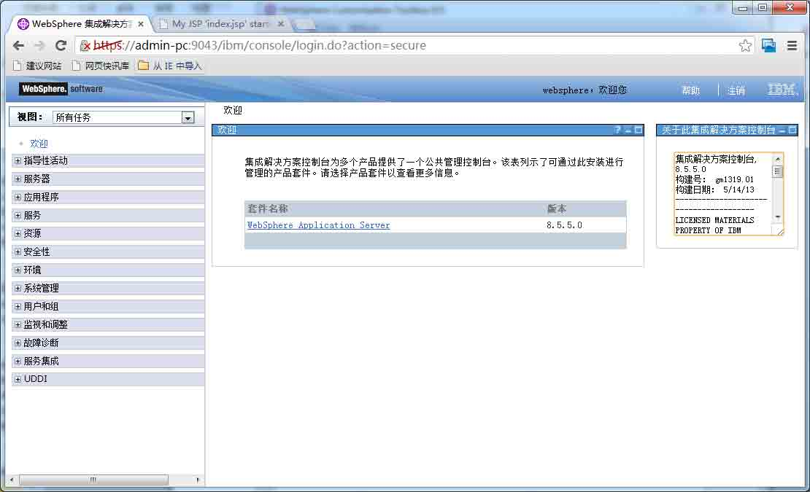

Websphere6-7 默认控制台地址也是： http://localhost:9043/ibm/console，此处用 admin 登录即可。

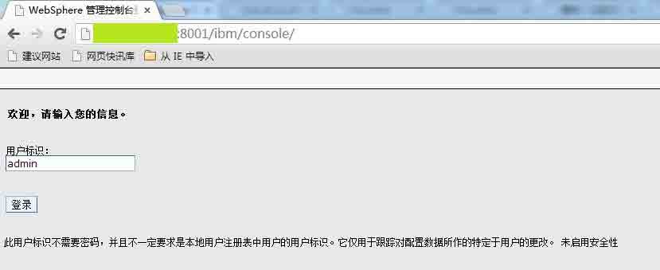

### Websphere GetShell

本地只安装了 8.5 测试，Websphere 安装的确非常坑非常麻烦。不过 Google HACK 到了其余两个版本 Websphere6 和 Websphere7。测试发现 Websphere GetShell 一样很简单，只是比较麻烦，一般情况直接默认配置 Next 就行了。Websphere7 和 Websphere8 GetShell 基本一模一样。

#### Websphere6 GetShell

需要注意的是 Websphere6 默认支持的 Web 应用是 2.3(web.xml 配置的 web-app_2_3.dtd)直接上 2.5 是不行的，请勿霸王硬上弓。其次是在完成部署后记得保存啊亲，不然无法生效。

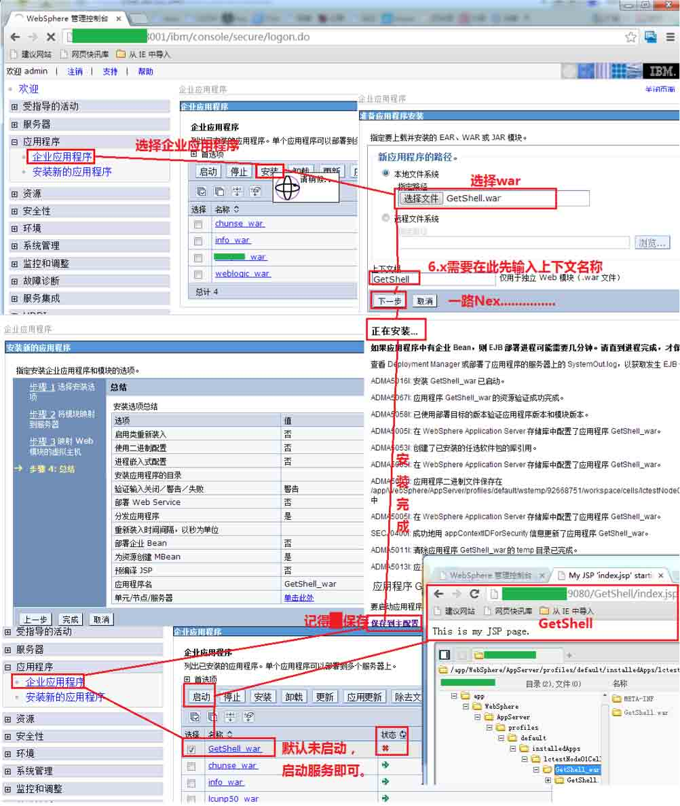

#### Websphere8.5 GetShell

部署的时候记得写上下文名称哦，不让无法请求到 Shell。

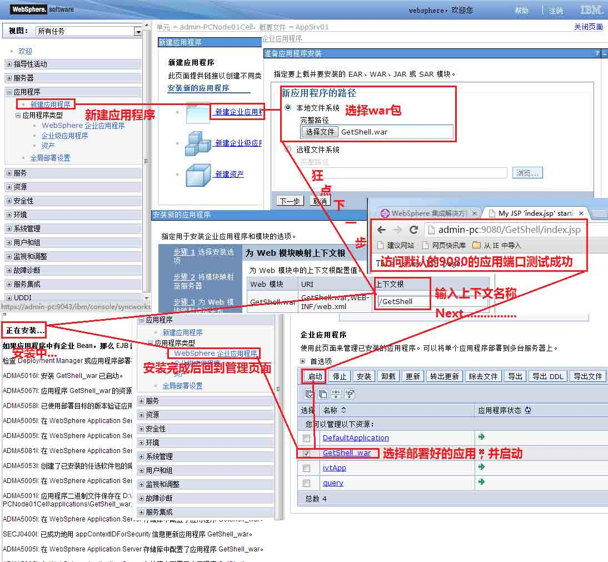

注意：

如果在 Deploy 低版本的 Websphere 的时候可能会提示 web.xml 错误，这里其实是因为支持的 JavaEE 版本限制，把 war 包里面的 web.xml 改成低版本就行了，如把 app2.5 改成 2.3。

```
<?xml version="1.0" encoding="UTF-8"?>
<!DOCTYPE web-app PUBLIC "-//Sun Microsystems, Inc.//DTD Web Application 2.3//EN" "http://java.sun.com/dtd/web-app_2_3.dtd">
<web-app>
    <welcome-file-list>
        <welcome-file>index.jsp</welcome-file>
    </welcome-file-list>
</web-app> 
```

## GlassFish

* * *

GlassFish 是 SUN 的产品，但是作为一只优秀的土鳖 SUN 已经被 Oracle 收购了，GlassFish 的性能优越对 JavaEE 的支持自然最好，最新的 Servlet3.1 仅 GlassFish 支持。

### GlassFish 版本

GlassFish 版本比较低调，最高版本 GlassFish4 可在官网下载： http://glassfish.java.net/ 。最新 4.x 版刚发布不久。所以主流版本应当还是 v2-3,3 应该更多。支持 php(v3 基于 Quercus),jRuby on Rails 和 Phobos 等多种语言。

### GlassFish 默认配置

默认 Web 控制后台： http://localhost:4848

默认管理密码： GlassFish2 默认帐号 admin 密码 adminadmin 。

GlassFish3、4 如果管理员不设置帐号本地会自动登录，但是远程访问会提示配置错误。

```
Configuration Error 
Secure Admin must be enabled to access the DAS remotely. 
```

默认端口：

```
使用 Admin 的端口 4848。
使用 HTTP Instance 的端口 8080。
使用 JMS 的端口 7676。
使用 IIOP 的端口 3700。
使用 HTTP_SSL 的端口 8181。
使用 IIOP_SSL 的端口 3820。
使用 IIOP_MUTUALAUTH 的端口 3920。
使用 JMX_ADMIN 的端口 8686。
使用 OSGI_SHELL 的默认端口 6666。
使用 JAVA_DEBUGGER 的默认端口 9009。 
```

默认数据源：


### GlassFish GetShell 

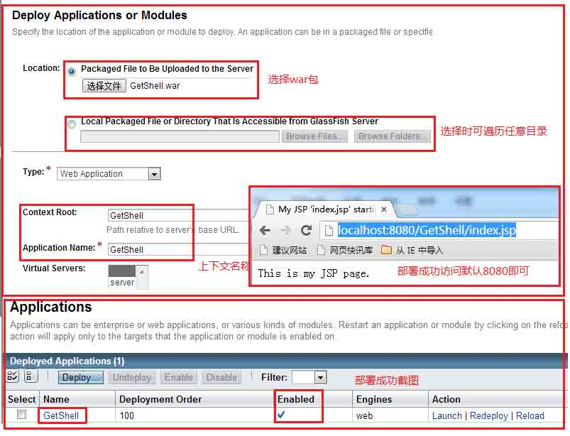

版权声明：未经授权禁止转载 [园长](http://drops.wooyun.org/author/园长 "由 园长 发布")@[乌云知识库](http://drops.wooyun.org)

分享到：

### 相关日志

*   [攻击 JavaWeb 应用[1]-JavaEE 基础](http://drops.wooyun.org/tips/163)
*   [Hacking weblogic](http://drops.wooyun.org/tips/402)
*   [攻击 JavaWeb 应用[5]-MVC 安全](http://drops.wooyun.org/tips/347)
*   [Bypass xss 过滤的测试方法](http://drops.wooyun.org/tips/845)
*   [攻击 JavaWeb 应用[2]-CS 交互安全](http://drops.wooyun.org/tips/164)
*   [HttpOnly 隐私嗅探器](http://drops.wooyun.org/tips/2834)