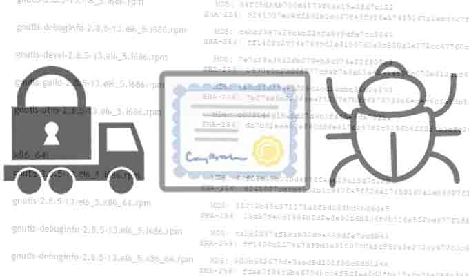

# GnuTLS 和 Apple 证书验证的 bugs 并非为同一个

2014/03/07 10:37 | [News](http://drops.wooyun.org/author/news "由 News 发布") | [业界资讯](http://drops.wooyun.org/category/news "查看 业界资讯 中的全部文章") | 占个座先 | 捐赠作者

GnuTLS 的 bug 与 Apple goto fail 的 bug 都导致了验证 TLS 和 SSL 证书问题，但是他们两个实际上并非是同一个，虽然都是把假的证书也当成有效的证书。

霍普金斯大学的一位密码学教授说：“GnuTLS 是一个编码错误，返回了错误的变量，而苹果可能是一个剪切和粘贴的失误。”

goto 命令在这两个 bug 当中都出现了，goto fail 语句是 C 语言遇到错误的时候一个标准执行流程。判断证书是否有效的代码应该返回一个 true 或者 false 的布尔值。但是这个 GnuTLS 的 bug，返回的是一个负数的特殊错误代码。

这个 bug 就是当其中的一个函数返回一个负数的错误代码，这个错误代码当做一个布尔型，而不是真正的一个数字，但是布尔型的判断当中，只要是非 0 就是 true，因此，这个错误在布尔判断中当成了真，形成了这个 bug。

这个 GnuTLS 的 bug 是被 Red Hat 审计出来的，GnuTLS 是一个安全通讯库，实现了 SSL、TLS 和 DTLS 协议和相关技术。提供了简单的 C 语言编程接口用来访问这些安全通讯协议，提供解析和读写 X.509、PKCS #12、OpenPGP 和其他相关结构。特点是可移植性和高效。使用并没有 OpenSSL 广泛，也没有部署在 iOS 设备上，但是在 Linux 和很多开源程序当中有使用。

原文：[`threatpost.com/goto-aside-gnutls-and-apple-bugs-are-not-the-same/104626`](http://threatpost.com/goto-aside-gnutls-and-apple-bugs-are-not-the-same/104626)

版权声明：未经授权禁止转载 [News](http://drops.wooyun.org/author/news "由 News 发布")@[乌云知识库](http://drops.wooyun.org)

分享到：

### 相关日志

*   [马航 MH370 航班被黑了？](http://drops.wooyun.org/news/1202)
*   [通过伪造乌克兰相关文件进行传播的恶意软件 MiniDuke](http://drops.wooyun.org/news/1373)
*   [网络安全威胁周报——第 201410 期](http://drops.wooyun.org/news/1034)
*   [NSA 暗中监视中国政府和企业网络（目标华为）](http://drops.wooyun.org/news/1289)
*   [APPLE IOS 7.1 修复了超过 20 个代码执行的漏洞](http://drops.wooyun.org/news/1057)
*   [一种被命名为 Chameleon 的病毒可以通过 WiFi 相互之间传播](http://drops.wooyun.org/news/976)