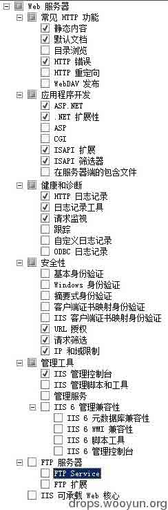
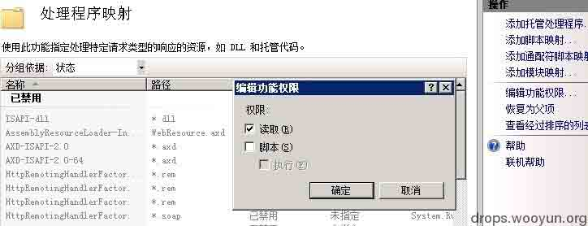
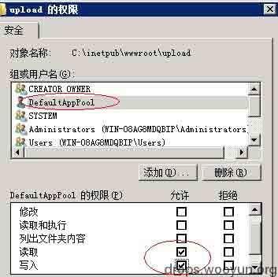
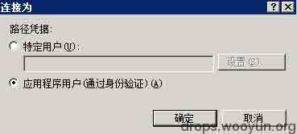
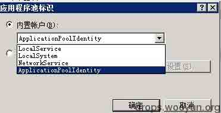
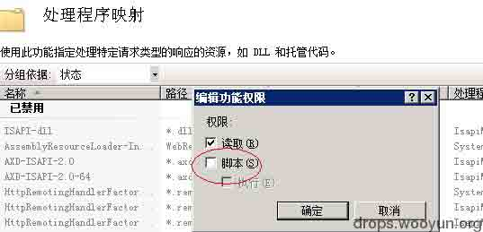

# IIS7.5 安全配置研究

2014/03/07 10:38 | [zhangsan](http://drops.wooyun.org/author/zhangsan "由 zhangsan 发布") | [漏洞分析](http://drops.wooyun.org/category/papers "查看 漏洞分析 中的全部文章"), [运维安全](http://drops.wooyun.org/category/%e8%bf%90%e7%bb%b4%e5%ae%89%e5%85%a8 "查看 运维安全 中的全部文章") | 占个座先 | 捐赠作者

## 0x00 测试环境

* * *

**操作系统：**Windows Server 2008 R2 Enterprise Service Pack 1 x64 **IIS 版本：**IIS7.5 **程序：**asp.net

## 0x01 IIS7.5 的安装

* * *



**http 常见功能：**开启静态内容，默认文档，HTTP 错误；目录浏览，WebDAV 发布如无特殊要求，不要开启；HTTP 重定向可根据需要开启。

**应用程序开发：**这个可根据实际情况开启，如为 asp.net 的开启 ASP.NET，.NET 扩展性，ISAPI 扩展，ISAPI 筛选；在服务器端的包含文件根据需要开启。

**健康和诊断：**建议开启 HTTP 日志记录，日志记录工具，请求监视；其他可根据需要开启。

**安全性：**建议开启 URL 授权，请求筛选，IP 和域限制；其他根据需要开启。

性能，管理工具，ftp 服务器，IIS 可承载的 Web 核心可根据开启。

## 0x02 IIS7.5 权限配置介绍

* * *

IIS7.5 涉及两个账户，一个为匿名账户，一个为应用程序池账户。在磁盘的 NTFS 权限设置中，匿名账户只需要拥有对网站目录的读取权限即可；而应用程序池账户需要根据程序实际情况给予相应权限，比如：需要去写文件，则要给予写权限，需要去调用一个程序（如 cmd.exe）则需要给予执行权限。总之，对文件的访问，首先需要有匿名账户的访问权限，然后再根据程序的操作需要什么样的权限给予应用程序池账户相应的权限。

### 研究发现的几个基本问题：

```
1\. 上传目录的写入权限由应用程序池账户决定；
2\. 应用程序池默认对于的账户为 IIS APPPOOL\{app pool name}，且属于 IIS_IUSRS 组；
3\. 默认的匿名账户为 IUSR 账户，且属于 authenticated users 组；
4\. 任何用户都属于 USERS 组，且手工删除后仍然属于 USERS 组；
5\. 上传木马之后，能够看到的目录是由应用程序池账户决定的；
6\. 在此测试环境下，USERS 组默认拥有网站目录的写入权限；
7\. 一个 aspx 文件的运行跟 NTFS 的运行权限无关；
8\. 对于网站的匿名账户只需要对网站目录有读取权限；
9\. 应用程序池账户运行 aspx 也只需要读取权限，但是如果要写文件需则写权限，要执行其他程序则需要执行权限； 
```

## 0x03 常见服务器被入侵威胁及解决措施

* * *

### 常见服务器入侵威胁：

```
1\. webdav 直接上传 webshell
2\. 通过程序文件上传漏洞上传 webshell
3\. webshell 的权限过高导致被提权 
```

### 解决常见问题措施：

#### 1\. 解决 webdav 问题

在安装的时候直接不安装 webdav 组件

#### 2.防止上传的木马文件执行

可以在 IIS 中设置需要上传文件的目录，处理程序映射中的编辑功能权限中的脚本去掉，这样即使上传了木马文件在此目录，也是无法执行的。



上传目录取消应用程序池账户的执行权限



#### 3\. 防止木马执行后看到网站目录之外的文件

可以设置进程池账户对其他文件夹无读取权限。

#### 4\. 防止木马执行后可执行 cmd

取消进程池账户的 NTFS 执行权限。

#### 5\. 防止木马执行后运行 cmd 权限过高

进程池账户选择权限较低的账户，最好就是默认的账户。

## 0x04 推荐安全配置方案

* * *

### 安全配置简单配置：

#### 1\. 匿名账户使用默认的 IUSR。



#### 2\. 应用程序池使用默认的标识，对于的账户为 IIS AppPool\应用程序池名称。



#### 3.IIS 中对上传目录设置为脚本不可执行



### 加强安全配置：

```
1\. 匿名账户使用默认的“应用程序用户”也就是对应的 IUSR。
2\. 应用程序池账户使用默认的 IIS AppPool\应用程序池名称。
3\. 删除 everyone，users 在所有磁盘上的权限。
4\. 删除 users 在 system32 上的所有权限（需要先修改所有者为 administrator）。
5\. 在网站目录下给予 IUSR 读取权限。
6\. 在网站目录下给予 IIS AppPool\应用程序池名称读取权限，如果程序中有特殊要求的权限，如写入文件等，则再对应的目录下给予相应的权限，如写入权限。
7\. 在网站要求的上传目录给予 IIS AppPool\应用程序池名称写入权限，但是不给予执行权限。
8\. 在 IIS 中取消上传目录的脚本执行权限。 
```

### 注意：

1.  以上两种配置均使用默认的应用程序池账户，如果自定义，最好是将自定义加入 IIS_IUSRS 组。
2.  IIS7.5 中建立多个站点的时候，如果使用默认的应用程序池账户，系统会默认产生如 IIS AppPool\各个不同的应用程序池名称。
3.  Asp.net 程序在第一次访问编译的时候，应用程序池账户需要拥有 system32 文件夹的读取和执行权限

## 0x05 疑问

* * *

1.  在测试过程中发现，访问 aspx 程序，如果匿名账户为自定义的账户，则需要给自定义的匿名账户在文件夹`C:\Windows\Microsoft.NET\Framework64\v2.0.50727\Temporary ASP.NET Files`上的写入权限；但是，如果使用默认的匿名账户，也就是 IUSR 时，需要给予应用程序池账户在此文件夹上的写入权限。疑问点在于此文件夹到底是需要哪个账户的写入权限，因为选择默认的匿名账户时，即时禁止 IUSR 在此文件的写入权限，只要应用程序池账户在此文件夹有写权限，一样运行正常?

2.  当匿名用户为程序默认的时候，应该就是 IUSR，但为什么又传递的进程池账户?

版权声明：未经授权禁止转载 [zhangsan](http://drops.wooyun.org/author/zhangsan "由 zhangsan 发布")@[乌云知识库](http://drops.wooyun.org)

分享到：

### 相关日志

*   [NTP 反射型 DDos 攻击 FAQ/补遗](http://drops.wooyun.org/papers/955)
*   [SQL SERVER 2008 安全配置](http://drops.wooyun.org/tips/1670)
*   [Rsync 安全配置](http://drops.wooyun.org/papers/161)
*   [IIS WebDAV 安全配置](http://drops.wooyun.org/papers/238)
*   [加盐 hash 保存密码的正确方式](http://drops.wooyun.org/papers/1066)
*   [Oracle 安全配置](http://drops.wooyun.org/%e8%bf%90%e7%bb%b4%e5%ae%89%e5%85%a8/2547)