# 一只 android 短信控制马的简单分析

2014/09/18 14:51 | [瘦蛟舞](http://drops.wooyun.org/author/瘦蛟舞 "由 瘦蛟舞 发布")   | [漏洞分析](http://drops.wooyun.org/category/papers "查看 漏洞分析 中的全部文章"), [移动安全](http://drops.wooyun.org/category/mobile "查看 移动安全 中的全部文章")  | 占个座先  | 捐赠作者

## 0x00 起因

* * *

[WooYun: 仿冒电信运营商掌上营业厅的大规模钓鱼事件(大量用户银行卡中招 CVV2 与密码泄露)](http://www.wooyun.org/bugs/wooyun-2014-076180)

然后有大牛在某电信网厅钓鱼站找到一款 android app 让我看看，就有了接下来的分析。

## 0x01 观察

* * *

拿到应用后先装到测试机上观察下,启动程序后立即监控到其向 15501730287 号码发送短信，内容为*软件已安装，但未被 jh。当前手机型号 nexus5。*

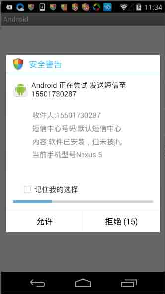

之后跳转到*要激活设备管理器吗？*的界面，如果不小心点了激活那卸载就将需要点手法了。

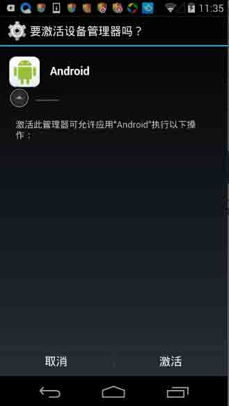

不 root 的话需要到设备管理器里取消勾选才能正常卸载，如果 root 也可以直接删文件。

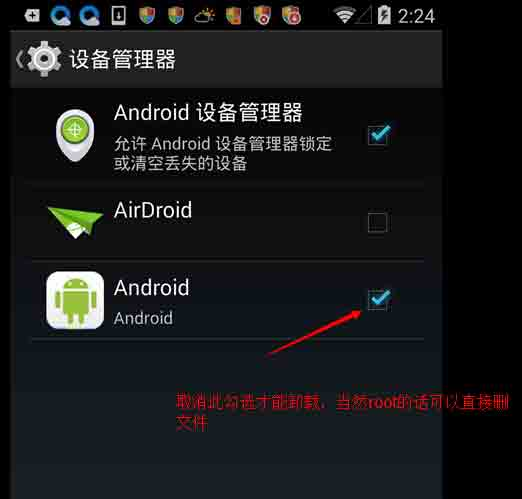

当受害者点击激活后还会发送短信通知黑客

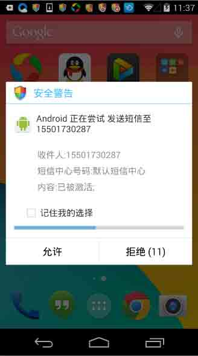

当然你点取消同样也发送短信黑客

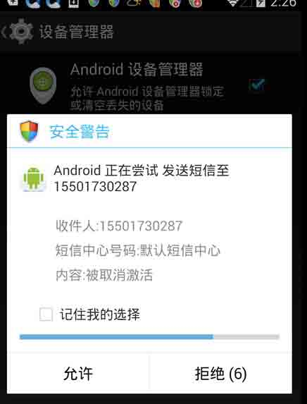

当完成这一系列动作后发现木马程序图片消失，并且无法通过系统自带应用管理直接卸载。

## 0x02 分析

* * *

之后是解包反编译看源码咯，当然没有想象的顺利。因为这些个木马要对抗杀软肯定经过加壳处理的。在 apk 包中看到了 libAPKProtect.so 这个东西，那接下来就要针对性的脱壳啦。选择使用 zjdroid（需 xposed 框架）脱壳。大致流程如下：

```
添加 locat：zjdroid-shell-com.oliuyht.iujyhtgr.m
得到 PID：the app target id = 5585

am broadcast -a com.zjdroid.invoke --ei target 5585 --es cmd '{"action":"dump_dexinfo"}'

filepath:/data/app/com.oliuyht.iujyhtgr.m-1.apk mCookie:1899531496

am broadcast -a com.zjdroid.invoke --ei target 5585 --es cmd '{"action":"dump_class","dexpath":"/data/app/com.oliuyht.iujyhtgr.m-1.apk"}'

am broadcast -a com.zjdroid.invoke --ei target 5585 --es cmd '{"action":"backsmali","dexpath":"/data/app/com.oliuyht.iujyhtgr.m-1.apk"}'

the dexfile data save to =/data/data/com.oliuyht.iujyhtgr.m/files/dexfile.dex 
```

之后在用 JEB 或 dex2jar 反编译，然后就可以静态分析 app 了。文件较少功能肯定不会太复杂，之前有提到过程序采用了 apkprotect 防护。

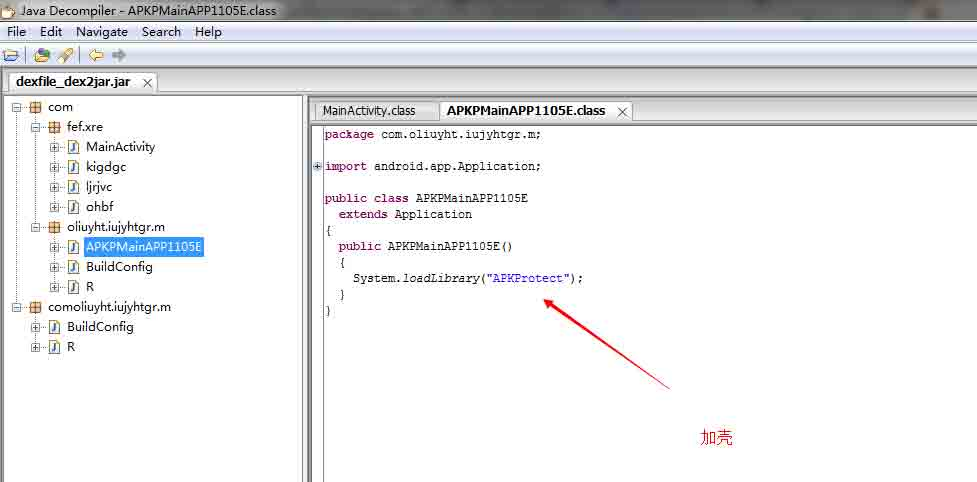

查看配置申请权限如下（到这里目测是个短信劫持马）

```
<uses-permission android:name="android.permission.WRITE_SMS"/>
<uses-permission android:name="android.permission.SEND_SMS"/>
<uses-permission android:name="android.permission.INTERNET"/>
<uses-permission android:name="android.permission.READ_SMS"/>
<uses-permission android:name="android.permission.RECEIVE_SMS"/> 
```

配置文件还注册了两个 activity 和两个 broadcast。

再看主界面代码，当主界面被第一次调用后就禁用此组件相应桌面图片也会消失。

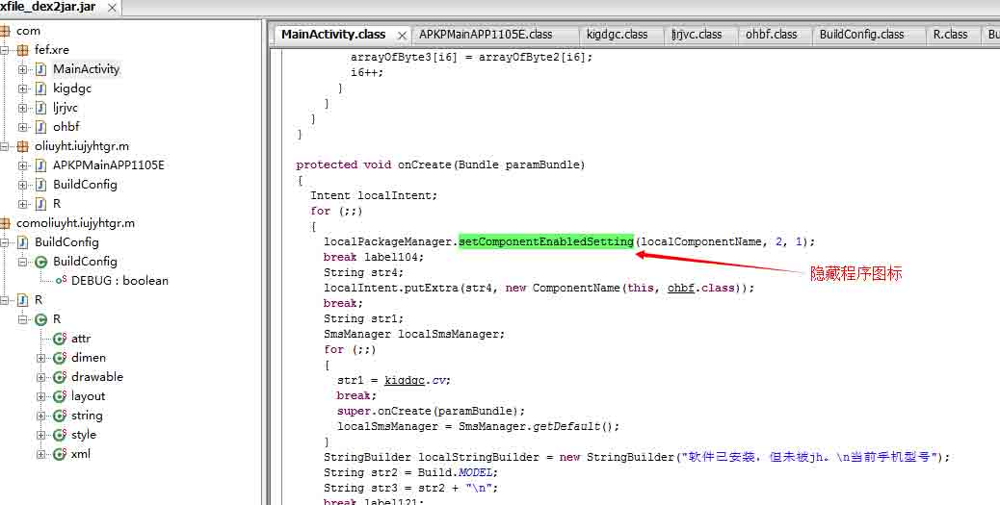

然后执行发送短信*软件已安装，但未被 jh。n 当前手机型号 Build.MODEL*，通知黑客。

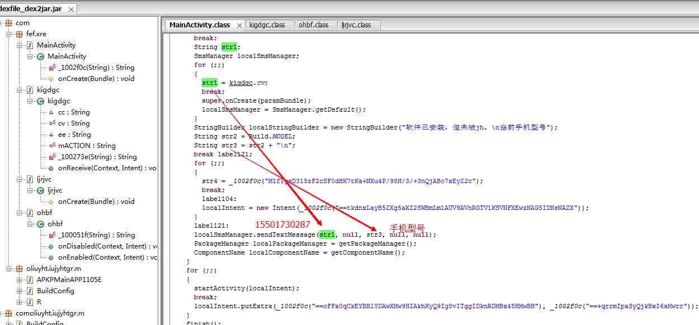

启动“激活设备管理”界面等待用户点击（一定程度防卸载）。

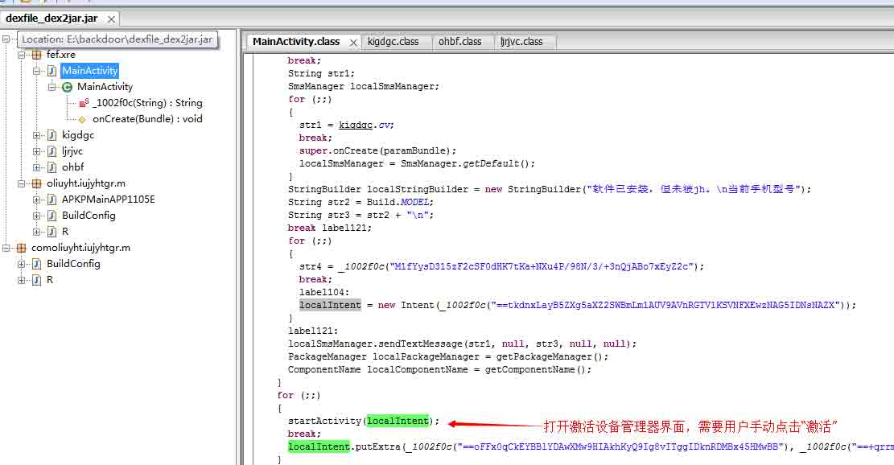

程序总共发了 7 条短信 6 条是发给 15501730287 其中四条是*安装成功，激活成功，发送成功*这类消息用来判断受害者状态，剩余两条是用来窃验证码之类的机密短信。只有一条短信是根据黑客发送的短信提取出号码以及内容再发送。就是说黑客可以用短信控制你发送指定短信到指定号码。

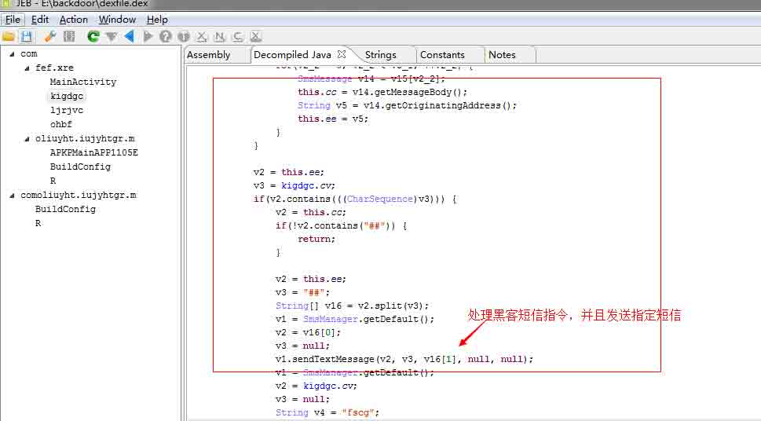

*kigdgc*类中硬编码了黑客接收短信的号码

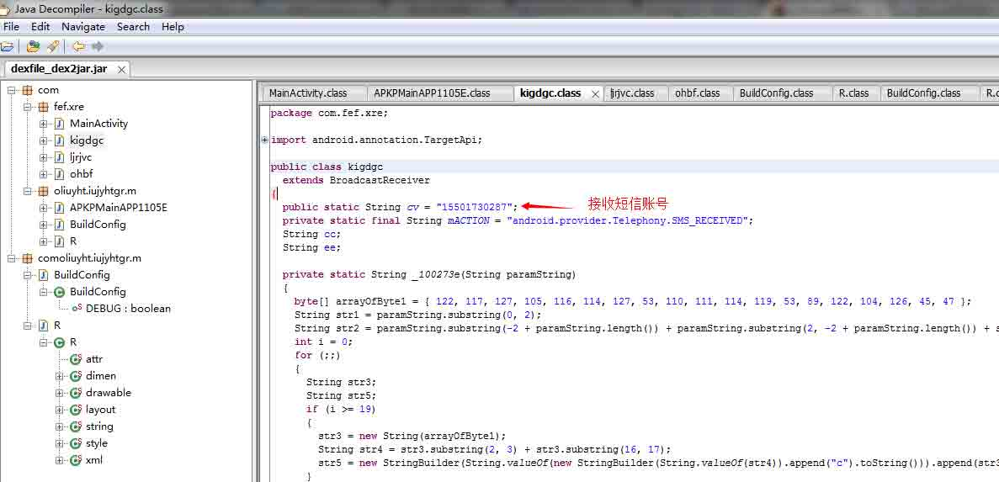

整个 app 大致功能如下

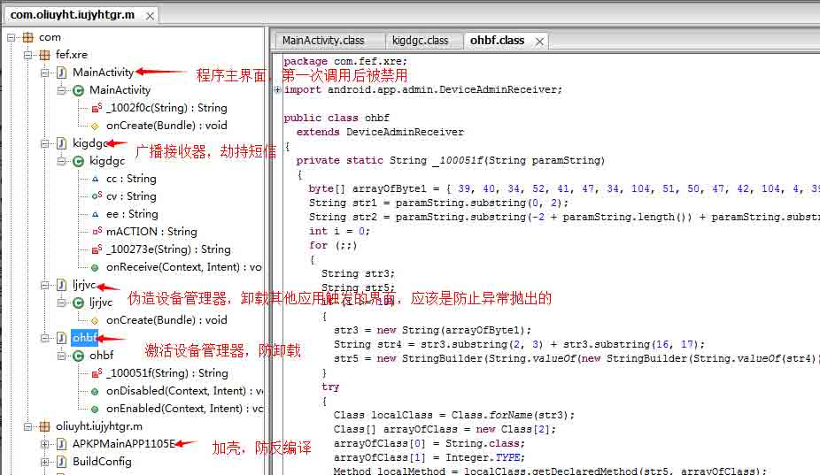

## 0x03 总结

* * *

大致就分析到这里，是一款可以窃取用户电信以及通过短信远程控制手机发送任意短信的短信劫持木马。黑客做了一系列的伪造和防御比如：伪装系统应用、隐藏图标、加壳、*this.abortBroadcast();*隐藏指令短信。预计黑客可以通过短信控制受害者发送一些吸费软短信，或者发送欺诈短信（比如大宝剑被抓给 xxxxxxxx 打 2W 块才能放人）当然短信是从本人手机发出就更具欺骗性了。还可以借此绕过一些验证如预留手机确认等（结合上文提到的钓鱼漏洞这个可能是主要目的）。

## 0x04 查杀

* * *

LBE 正常查杀(安装时就拦截到了)

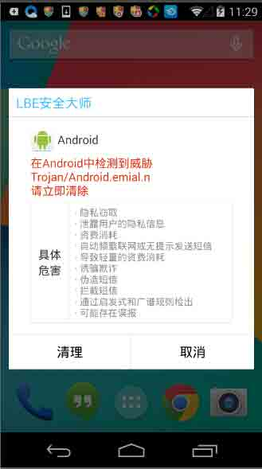

腾讯手机管家未检测到

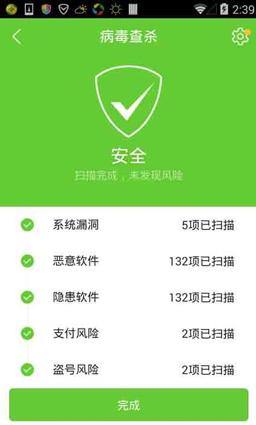

版权声明：未经授权禁止转载 [瘦蛟舞](http://drops.wooyun.org/author/瘦蛟舞 "由 瘦蛟舞 发布")@[乌云知识库](http://drops.wooyun.org)

分享到：碎银子打赏，作者好攒钱娶媳妇：


### 相关日志

*   [Android Broadcast Security](http://drops.wooyun.org/tips/4393)
*   [Android uncovers master-key 漏洞分析](http://drops.wooyun.org/papers/219)
*   [安卓 Bug 17356824 BroadcastAnywhere 漏洞分析](http://drops.wooyun.org/papers/3912)
*   [Android App Injection&&Drozer; Use](http://drops.wooyun.org/tips/2997)
*   [WebView 中接口隐患与手机挂马利用](http://drops.wooyun.org/papers/548)
*   [Intent scheme URL attack](http://drops.wooyun.org/papers/2893)