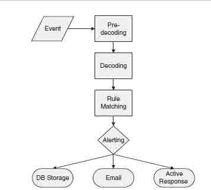
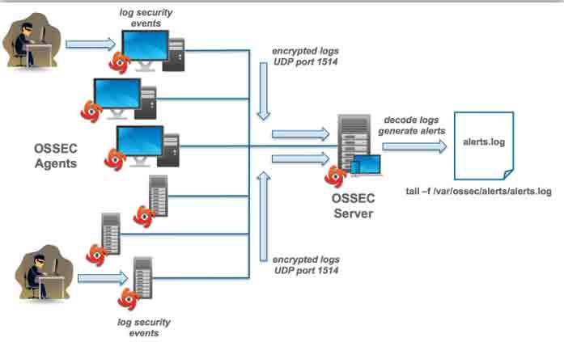
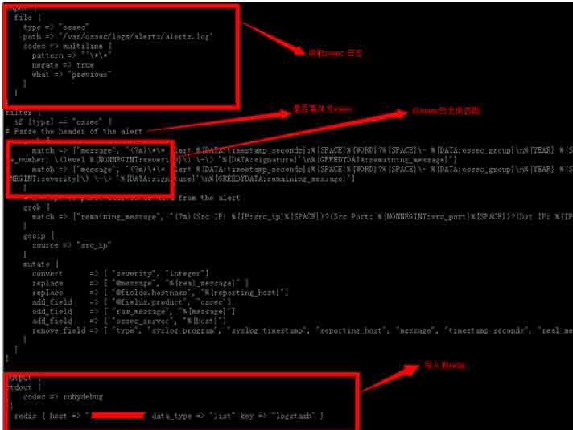
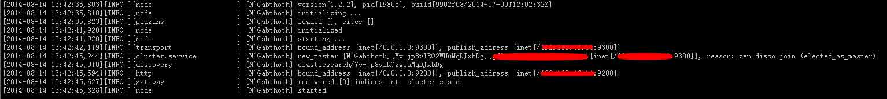
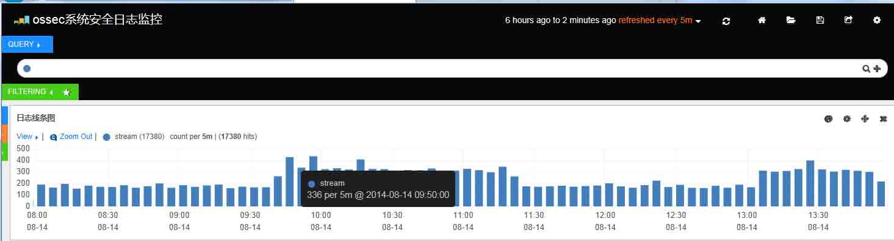
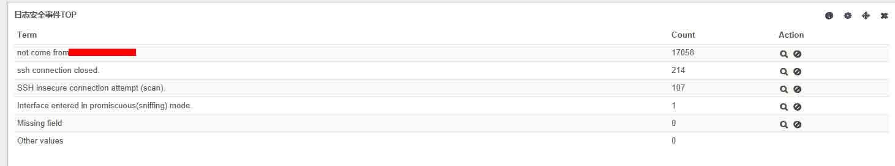

# 基于 ossec logstash es 大数据安全关联分析 

2014/08/15 10:58 | [winsyk](http://drops.wooyun.org/author/winsyk "由 winsyk 发布") | [技术分享](http://drops.wooyun.org/category/tips "查看 技术分享 中的全部文章"), [运维安全](http://drops.wooyun.org/category/%e8%bf%90%e7%bb%b4%e5%ae%89%e5%85%a8 "查看 运维安全 中的全部文章") | 占个座先 | 捐赠作者

## 0x00 前言：

* * *

对于大数据我相信大多数人都不陌生，特别现在是在大数据时代，当下流行的技术很多人都可以朗朗上口比如 hadoop、hbase、spark、storm，那么在数据收集中，是否有好的解决办法来帮助企业进行安全管理及策略分析呢，笔者搜索了很多资料，通过自己的实践分享一篇我对大数据日志分析及处理的见解，本篇技术是基于 logstash elasticsearch、redis 结合 ossec 来做的开源方案。 在《无处可藏》中斯诺登提到 NSA 对网络及数据收集的原则是收集一切，在企业安全上也需要做到如此，众所周知安全的风险来自于边界，黑客也会挑一些比较边缘的业务进行入侵，但这些东西我们都没记录但对于后续的应急响应和入侵检测来说就无从谈起，所以在企业内做大数据的原则也是“收集一切”。 开篇提到的这些主要是为了下文做铺垫，本文基于系统安全日志来做收集及处理，希望能给大家提供一些思路，整体为开源技术，屌丝安全的本质是“快”，当前社会唯快不破。

## 0x01: 技术架构： 使用到的工具如下：

* * *

> Ossec（事件源、alert 源）
>   Logstash （日志收集、分割日志)
>   Elasticsearch (全文搜索)
>   Kibana3 (日志展现)
>   Redis（用于数据存储，防止数据丢失）

使用该方案好处：opensource， 不方便处：资料较少，尤其是对 Kibana

## 0x02：实施方案：

* * *

关于如何安装，请参考： https://app.yinxiang.com/shard/s21/sh/f4e62686-16ef-4549-beb1-c5124b232df6/f538a1ea304ff4191acf494a1a1bd4f9

## 0x03：技术实践：

* * *

**1、 系统日志收集：**

操作系统日志收集可以采取 syslog、rsyslog 等技术，本文使用 syslog 主要对于收集日志安全日志，日志内容范围为/var/log/secure，、/var/log/lastlog 等，/var/log/secure 内基于用户的登录失败、登录异常、是否从白名单 ip 登录等都可以审计到，然后来做关联分析，更多的维度需要各位看官自己去发现和探索，本文不深入讲解。

日志收集作用： 应用场景：系统安全日志薄弱在黑客防御过程中，如果日志被删除，syslog 服务被暂停，这些都会对系统入侵分析造成麻烦，难以追溯。

**2、 入侵检测系统 ossec：**

Syslog 日志进来后不能不做分析，如果不分析，数据就不会被用活只是死数据，这里用到开源 ids 系统，Ossec，Ossec 大家或许并不陌生，ossec 支持 2 种模式：1、ossec agent； 2、基于 syslog 方式对日志做收集，通过客户端配置 syslog 将日志传送到 ossec server，然后 ossec server 会通过对分析日志进格式化处理规则解析，判断异常并且对其做处理，比如写入数据库，触发告警，如图 1 为处理日志过程。



如图 2 为 ossec 整个工作过程：



**3、 日志集中化管理 logstash:**

Logstash 是一个完全开源的工具，他可以对你的日志进行收集、分析，并将其存储供以后使用（如，搜索），您可以使用它。说到搜索，logstash 带有一个 web 界面，搜索和展示所有日志，但因为 logstash 的管理界面不如 kibana 美观，这里使用 Kibana 做日志展现。 我安装的 logstash 版本为:logstash-1.2.2-flatjar.jar,通过命令:

```
java -jar logstash-1.2.2-flatjar.jar agent -f logstash_agent.conf 
```

将 logstash 启动，logstash_agent.conf 内容如下图：



对上图 logstash 内容进行分解，它一共做了这些事。

1.  通过读取 ossec alert log,将数据读取到 logstash agent。
2.  Logstash 判断事件源是否为 ossec，如果是则对其进行分割字段；
3.  将处理后的 logstash 日志写入到 redis；
4.  使用 redis 的目的是为了将 logstash 读取的日志缓存到 redis 内，防止数据丢失。

**4、 全文检索 elasticsearch：**

ElasticSearch 是一个基于 Lucene 构建的开源，分布式，RESTful 搜索引擎。设计用于云计算中，能够达到实时搜索，稳定，可靠，快速，安装使用方便。 在本文中 ElasticSearch 主要的作用，通过 es 读取 logstash 内 ossec 日志进行全文检索，方便后续日志展现及搜索，es 默认端口为 9200，成功开启 es 后会提示如下：



ElasticSearch 启动后可以通过访问 http://127.0.0.1:9200 来查看 es 工作是否正常，出现如下数据证明 es 正常工作 9300 端口主要用于和 es 集群通信发数据。

```
{
  "status" : 200,
  "name" : "N'Gabthoth",
  "version" : {
    "number" : "1.2.2",
    "build_hash" : "9902f08efc3ad14ce27882b991c4c56b920c9872",
    "build_timestamp" : "2014-07-09T12:02:32Z",
    "build_snapshot" : false,
    "lucene_version" : "4.8"
  },
  "tagline" : "You Know, for Search"
} 
```

通过读取之前写入到 redis 里的数据，将 redis 内数据写入到 es 里，如下配置实现：

```
input {
    redis 
    {
    host => "127.0.0.1"
    data_type =>"list"
    port => "6379"
    key => "logstash"
    type => "ossec"
    }
}

output {
stdout { codec => rubydebug }
 if [type] == "ossec" {
   elasticsearch {
     host => "127.0.0.1"
     port => "9300"
     #cluster => "ossec"
     index => "logstash-ossec-%{+YYYY.MM.dd}"
     index_type => "ossec"
     template_name => "template-ossec"
     template => "/usr/local/share/logstash/elasticsearch_template.json"
     template_overwrite => true
        }
   }
} 
```

**5、 日志展现：**

既然已经将上述工作都做到位了，那么需要有界面来展现劳动成果及后续进行日志分析，这里使用 kibana 来做展现，关于 kibana 各位请自行搜索，我只简单说下我的理解，它的资料很少，笔者在学习过程中也是一路摸索，推荐大家使用这个 dashboard 来展现日志，下载地址：https://github.com/magenx/Logstash/blob/master/kibana/kibana_dashboard.json **6、 结果展现：**





**6.1、 结合 Ossec 应用场景：**

举例，我们在日常的运维环境中会有常见的登录事件，并且也会限制一些 ip 是否能登录该主机，在 ossec 内我们定制一条规则来判断是否有入侵者使用其他 ip 进行登录。 在 ossec 里我们可以定制一条规则在 sshd_rules.xml 中，规则如下：

```
<rule id="5739" level="10">
   <if_sid>5700</if_sid>
   <group>authentication_failure</group>
   <srcip>!10.10.2.1</srcip>
   <description>not come from 10.10.2.1</description>
   </rule>
</group> 
```

if_sid 是匹配 syslog,sshd，如下规则：

```
<!-- SSHD messages -->
<group name="syslog,sshd,">
  <rule id="5700" level="0" noalert="1">
    <decoded_as>sshd</decoded_as>
    <description>SSHD messages grouped.</description>
</rule> 
```

如果有用户触发到该规则，kibana 会展现告警如下：


## 0x04：

* * *

借用一句话，安全这个东西就是这样的，你遇到的我没遇到过，我遇到的你可能也没有遇到过，其实只要一说，大家就都明白了。 ” 希望此文对你有帮助，谢谢！

版权声明：未经授权禁止转载 [winsyk](http://drops.wooyun.org/author/winsyk "由 winsyk 发布")@[乌云知识库](http://drops.wooyun.org)

分享到：

### 相关日志

*   [DNS 域传送信息泄露](http://drops.wooyun.org/papers/64)
*   [反向代理的有趣用法](http://drops.wooyun.org/tips/509)
*   [PHP 安全编码](http://drops.wooyun.org/tips/135)
*   [远程备份数据库和文件的方法](http://drops.wooyun.org/tips/783)
*   [Linux 被 DDOS&CC 攻击解决实例](http://drops.wooyun.org/tips/2457)
*   [fail2ban 防暴力破解介绍使用](http://drops.wooyun.org/tips/3029)