# CoolShell 解密游戏的 WriteUp

2014/08/05 11:41 | [LinE](http://drops.wooyun.org/author/LinE "由 LinE 发布") | [技术分享](http://drops.wooyun.org/category/tips "查看 技术分享 中的全部文章") | 占个座先 | 捐赠作者

游戏地址：[`fun.coolshell.cn/`](http://fun.coolshell.cn/)

一个很有意思的小游戏，也很费脑子的说 TAT

## 0-Fuck your brain

本关地址：[`fun.coolshell.cn/first.html`](http://fun.coolshell.cn/first.html)

进去以后，发现一些乱七八糟的东西，下面一行提示：My brain has been fucked，通过 BaiDu 得知这是一种编程语言，称之为 Brain Fuck（我不会说当我看到这个着实汗了一把），然后在网上找到编译器

编译器代码

```
#include <stdio.h>
int  p, r, q;
char a[5000], f[5000], b, o, *s=f;
void interpret(char *c)
{
    char *d;
    r++;
    while( *c ) {
        switch(o=1,*c++) {
            case '<': p--;        break;             case '>': p++;        break;
            case '+': a[p]++;     break;
            case '-': a[p]--;     break;
            case '.': putchar(a[p]); fflush(stdout); break;
            case ',': a[p]=getchar();fflush(stdout); break;
            case '[':
                for( b=1,d=c; b && *c; c++ )
                b+=*c=='[', b-=*c==']';
                if(!b) {
                    c[-1]=0;
                    while( a[p] )
                    interpret(d);
                    c[-1]=']';
                    break;
                }
            case ']':
                puts("UNBALANCED BRACKETS"), exit(0);
            case '#':
  if(q>2)
                printf("- - - - - - - - - -/n%*s/n",*a,a[1],a[2],a[3],a[4],a[5],a[6],a[7],a[8],a[9],3*p+2,"^");
                break;
            default: o=0;
        }
 if( p100)
            puts("RANGE ERROR"), exit(0);
    }
    r--;
}
main(int argc,char *argv[])
{
    FILE *z;
    q=argc;
    if(z=fopen(argv[1],"r")) {
 while( (b=getc(z)) > 0 )
            *s++=b;
        *s=0;
        interpret(f);
    }
}

```

把该编译器代码存为 test.c

然后编译

```
gcc test.c -o test 
```

得到的 test 即为该语言编译器，编译的时候有俩 Warning，很抱歉我无视了这个 Warning…

然后将 Brain Fuck 的代码存为 test.bf

在 shell 下执行即可得到答案

```
./test test.bf 
```

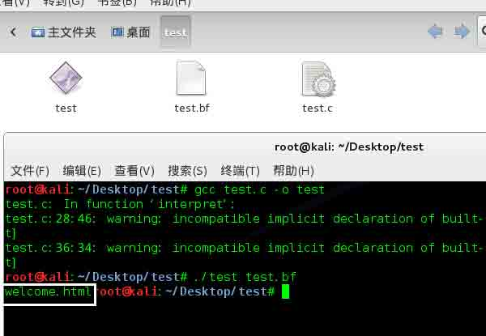

如图，得到第一关地址

## 1-Multiply

本关地址：[`fun.coolshell.cn/welcome.html`](http://fun.coolshell.cn/welcome.html)

首先进去看到一个序列

```
2,3,6,18,108,? 
```

然后上面给出了算法 X * Y，观察序列可得知后一个数字是前两个数的积，于是得出？地方为 18*108=1944

打开[`fun.coolshell.cn/1944.html`](http://fun.coolshell.cn/1944.html)可以看到 X 已经成了红色，同时得到另一个提示“其中一个答案为 1944”，即 X=1944

然后找寻另一个数字，看到另一个提示

What is the meaning of life, the universe and everything?

扔到 Google 中，找到 Wiki 中的一个提示

根据道格拉斯·亚当斯的小说《银河系漫游指南》，42 是“生命、宇宙以及任何事情的终极答案”。因此，42 也经常被用来向这一作品致敬，例如：

您若在 Google 输入 the answer to life, the universe, and everything，Google 会直接回答 42——而且还是用 Google 计算器算出来的。

可以得到 Y=42

输入[`fun.coolshell.cn/42.html`](http://fun.coolshell.cn/42.html)也可以验证这一点，然后`X\*Y=1944\*42=81648`

得到下一关地址 81648.html

## 2-Keyboard

本关地址:[`fun.coolshell.cn/81648.html`](http://fun.coolshell.cn/81648.html)

首先进去，一个硕大的键盘，不过这个键盘貌似有些问题，键盘上一些键和现在用的 qwerty 键盘有些出入，该图上有个超链，得知该种键盘被称之为 Dvorak 键盘，是为了更快的提高打字速度而设计出来了，通常是程序猿和打字猿使用率较高（隐隐感觉这两个职业没差别….）

先把 Dvorak 键盘的布局换成 QWERTY 的布局，如图

黑色为 Dvorak 布局，红色为 QWERTY 布局

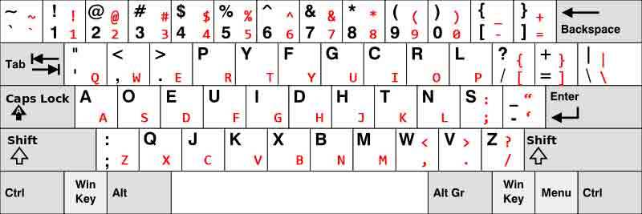

把给出的提示用 QWERTY 布局表示出来即可

This Code

```
//这是给出的代码
macb() ? lpcbyu(&gbcq/_\021%ocq\012\0_=w(gbcq)/_dak._=}_ugb_[0q60)s+ 
```

This Code

```
//这是 QWERTY 布局下代码
main() { printf(&unix["\021%six\012\0"],(unix)["have"]+"fun"-0x60);} 
```

把该代码编译之后得到一个程序，运行返回结果 unix，过关，如图

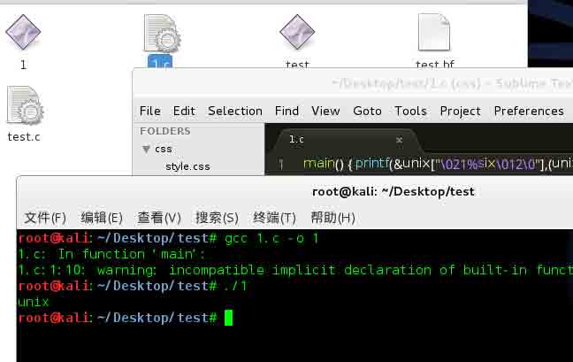

## 3-QR Code

本关地址:[`fun.coolshell.cn/unix.html`](http://fun.coolshell.cn/unix.html)

首先映入眼帘的是一个二维码,使用二维码识别工具可得到下面提示的码表，如图


得到字符转换码表为

```
[abcdefghijklmnopqrstuvwxyz] <=> [pvwdgazxubqfsnrhocitlkeymj] 
```

然后转换字符，使用 python 语言,源代码为

```
#Thanks For Code by Mutalisk
content_de = '''Wxgcg txgcg ui p ixgff, txgcg ui p epm. I gyhgwt mrl lig txg ixgff wrsspnd tr irfkg txui \
hcrvfgs, nre, hfgpig tcm liunz txg crt13 ra "ixgff" tr gntgc ngyt fgkgf.'''.lower()

content = ''

keychr_de = 'pvwdgazxubqfsnrhocitlkeymj'
keychr = 'abcdefghijklmnopqrstuvwxyz'

for s_chr in content_de:
    if s_chr in keychr_de:
        content = content + keychr[keychr_de.index(s_chr)]
    else:
        content = content + s_chr

print content 
```

转换后截图如下

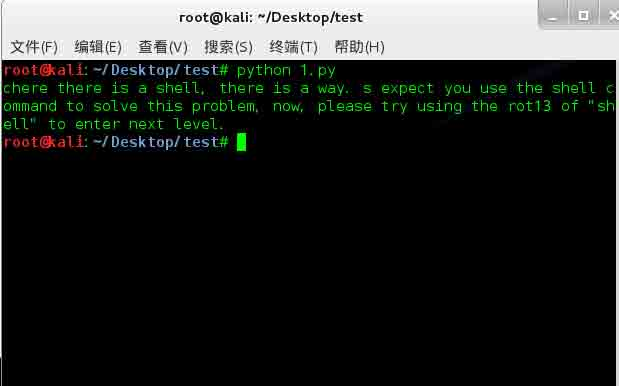

转换出结果为：Where there is a shell, there is a way. I expect you use the shell command to solve this problem, now, please try using the rot13 of “shell” to enter next level.

翻译出来意思为：只要有 shell 就会有办法咩我希望你捏，能使用 shell 命令去解决这个问题咩，那么现在捏，请使用 rot13 来过关咩

然后打开 url：[`fun.coolshell.cn/shell.html`](http://fun.coolshell.cn/shell.html)

得到新的提示：You really are close, but the “shell” is not the final answer.

翻译过来为：你已经很接近正确答案了咩，但可惜 shell 不是最终的答案咩.

然后使用 rot13 来加密 shell 得到字符串，furyy,过关

```
echo 'shell'|tr '[A-Za-z]' '[N-ZA-Mn-za-m]' 
```

## 4-cat

本关地址:http://fun.coolshell.cn/furyy.html

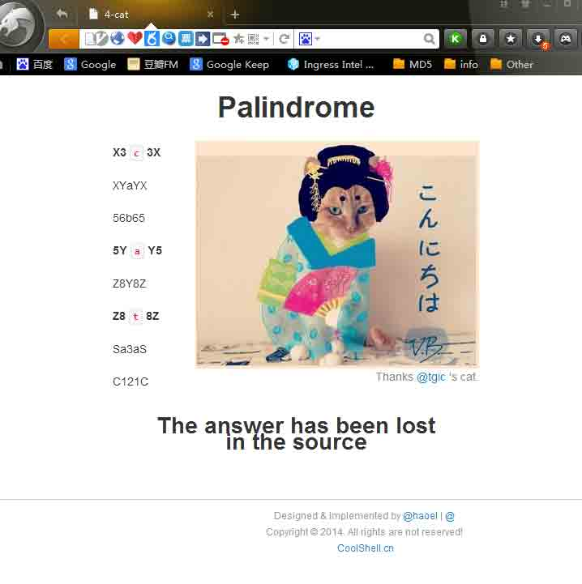

首先看提示，提示说答案在源代码的底部，拉到底下，惊呆了 TAT


这一坨 TM 是什么…

然后仔细看了一下标题 Palindrome 还有左边的一些，可以看到这关是以回文为主体的，找正则大牛帮我写了一个正则.

```
(\[A-Z])([0-9])a-z\(\1)|(\[0-9])([A-Z])a-z\(\5) 
```

然后把 html 中注释掉的东西拉到[`tool.oschina.net/regex`](http://tool.oschina.net/regex)匹配一下，得出结果如图

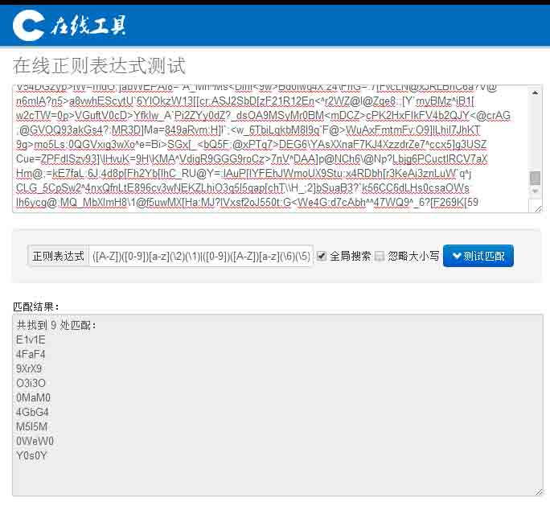

得出这些回文

共找到 9 处匹配：

```
E1v1E
4FaF4
9XrX9
O3i3O
0MaM0
4GbG4
M5l5M
0WeW0
Y0s0Y 
```

然后观察网页主体的回文，可以看到 cat 来自于回文中央的那个字符串的拼接，把刚才得出的匹配中间字符拼接出来即为 key:variables

## 5-variables

本关地址:[`fun.coolshell.cn/variables.html`](http://fun.coolshell.cn/variables.html)

本页提示：继续跑，你会找到你要的结果

点击图片，进入一个 url，[`fun.coolshell.cn/n/2014`](http://fun.coolshell.cn/n/2014)，页面返回一个数字，既然提示是继续跑，里面唯一可控的只有 url 后面的数字，那么就去跑这个数字，这个页面显示的数字放到 url 进行下次循环。

用 Seraph 写了个小程序跑了一下，秒出

```
dim a
function main
    start = "2014"
    a = GetHTTP("http://fun.coolshell.cn/n/"&start)
    Print(a)
    for ForCount = 1 to 999999
        CStr(a)
        a = GetHTTP("http://fun.coolshell.cn/n/"& a )
        Print(a)
    next
end function 
```

如图，得出 key 为 tree


## 6-tree

本关地址：[`fun.coolshell.cn/tree.html`](http://fun.coolshell.cn/tree.html)

看图就可以知道，这特么是二叉树….

花了 3 个小时，对这个树进行了复原，复原图如下

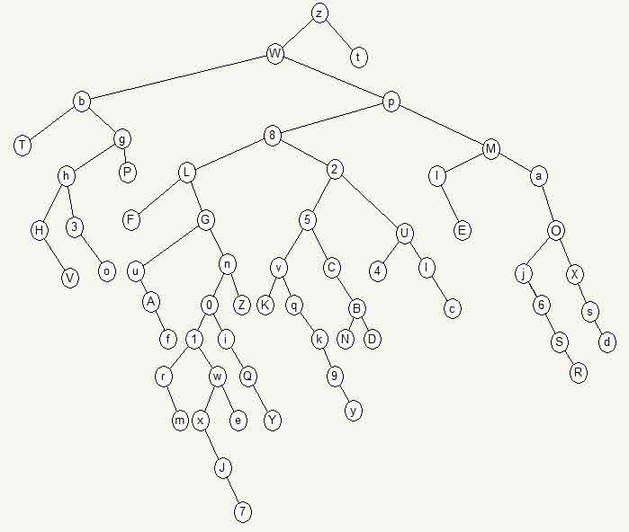

吐槽一下，这么复杂的树这是要死人的节奏啊

有了树结构图之后就可以得出前序(Pre-order):

z, W, b, T, g, h, H, V, 3, o, P, p, 8, L, F, G, u, A, f, n, 0, 1, r, m, w, x, J, 7, e, i, Q, Y, Z, 2, 5, v, K, q, k, 9, y, C, B, N, D, U, 4, l, c, M, I, E, a, j, 6, S, R, o, X, s, d

同时由图得知该二叉树最深路径为:z, W, p, 8, L, G, n, 0, 1, w, x, J, 7

然后把最深路径作为 pass 带入 openssl 中解密那个 base64 的字符串即可得到明文

```
echo U2FsdGVkX1+gxunKbemS2193vhGGQ1Y8pc5gPegMAcg=|openssl enc -aes-128-cbc -a -d -pass pass:zWp8LGn01wxJ7 
```

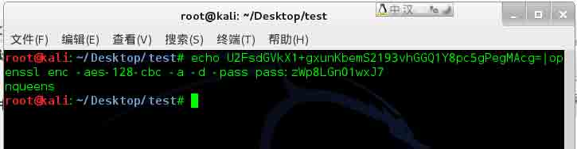

得到明文为 nqueens 过关

## 7-N Queen

本关地址:http://fun.coolshell.cn/nqueens.html

历史上著名的 N 皇后问题，给出的范例为 8 皇后，求 9 皇后，code 为从右往左，皇后依次在纵坐标上的顺序

在网上找了一份 N 皇后算法代码，可得到 9 皇后问题有 352 个解，然后修改了一下代码，可以直接生成出题目所要求的 code，得到 352 个 code

```
/**
* n 皇后问题
* date       : 2010-3-12
* author     : lee
* change     ：LinE
* change date：2014-8-4
*/

#include <stdio.h>
#include <stdlib.h>
#include <math.h>

#define QUEEN 9    // the number of the queen
#define INITIAL -10000  //defines the initial value of  the board 

//container
int a[QUEEN];

//check if the queen can be placed on the position
int valid(int row, int col);
//initialize the board
void clear();
//print the result
void print();
//run the n-queen program 
void queen();

int main(void)
{
    clear();
    queen();
    return 0;
}

void clear()
{
    int *p;
    for (p = a; p < a + QUEEN; ++p) {
        *p = INITIAL;
    }
}

void print()
{
    int i, j,l;
    for (i = 0; i < QUEEN; ++i) {
        for (j = 0; j < QUEEN; ++j) {
            if (a[i] != j) {
               //printf("%c ", '.');
             }
            else
            {
                 l=j+1;
                printf("%d",l);
                //printf("%c ", '#');
            }
        }
    }
    printf("\n");
    //printf("--------------------------------------------\n");
}

int valid(int row, int col)
{
    int i;
    for (i = 0; i < QUEEN; ++i) {
        if (a[i] == col || abs(i - row) == abs(a[i] - col)) 
            return 0;
    }

    return 1;
}

void queen()
{
    int n = 0;
    int i = 0, j = 0;
    while (i < QUEEN) {

        while (j < QUEEN) {
            if (valid(i, j)) { //test if the queen can be placed on the position
                a[i] = j;     //place the queen on the next line
                j = 0;
                break;
            } else {         // if not, check the next position
                ++j;
            }
        }

        if (a[i] == INITIAL) {   //if the current queen can't find its place
            if (i == 0)        // and this is the first line ,then program end
                break;
            else  {           //else   backtrack
                --i;
                j = a[i] + 1;
                a[i] = INITIAL;
                continue;
            }
        }

        if (i == QUEEN - 1) {  //already got a solution, print the result
            //printf("answer %d : \n", ++n);
            print();
        //  _sleep(600);
            j = a[i] + 1;
            a[i] = INITIAL;
            continue;

        } 

        ++i;      // go on to place the queen on the next line if has any more 
    }
} 
```

把该程序编译后，执行的结果重定向到 code.txt 做下一步的使用

```
gcc queen.c -o queen
./queen>code.txt 
```

然后编写一个 php 脚本，来对所得的解法爆破

```
<?php
$f = fopen("/root/Desktop/test/code.txt","r");
$passwd="zWp8LGn01wxJ7";
$hash="e48d316ed573d3273931e19f9ac9f9e6039a4242";
while (!feof($f))
{
    $code = fgets($f);
    if (sha1($passwd.$code)===$hash) {
        //因为 fgets 自带了一个换行符，故这里不需要再添加"\n"了
        echo $code;
     } 
}
fclose($f)
?> 
```

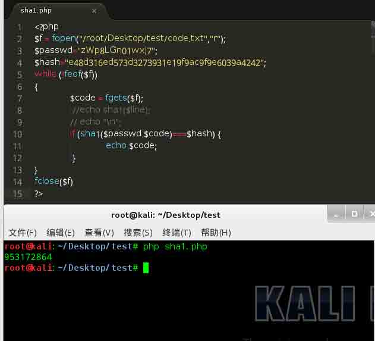

## 8-Excel Column

本关地址：[`fun.coolshell.cn/953172864.html`](http://fun.coolshell.cn/953172864.html)

感觉这题和 Excel 关系不大，主要还是一个幂运算，这个类似于 16 进制转 10 进制运算，可以把它看成 26 进制转 10 进制，首先求出来式子当中各个字母在字母表中的位置

```
C—-3  
O—-15  
L—-12  
S—-19  
H—-8  
E—-5 
```

然后列出算法，计算出 COOLSHELL 和 SHELL 在 10 进制下的数字

算法可以参考[`www.cnblogs.com/lavezhang/archive/2012/05/14/2499000.html`](http://www.cnblogs.com/lavezhang/archive/2012/05/14/2499000.html)这里来查看

```
COOLSHELL = 3*26⁸+15*26⁷+15*26⁶+12*26⁵+19*26⁴+8*26³+5*26²+12*26¹+12*26⁰ = 751743486376
    SHELL = 19*26⁴+8*26³+5*26²+12*26¹+12*26⁰ = 8826856 
```

写了一个 C 语言小程序，发现数值太大溢出了，换成长整之后还是溢出了 TAT，后来朋友让我把公式丢谷歌，果然万能的 Google 帮我计算出了答案

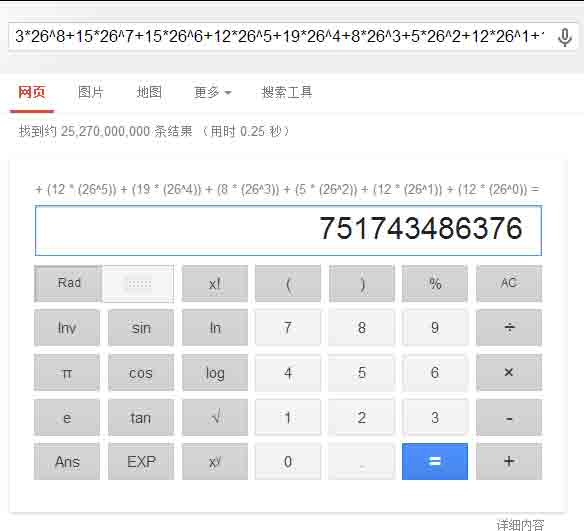

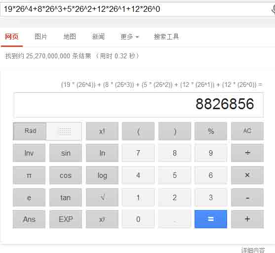

直接结算结果

```
COOLSHELL / SHELL = 85165 
```

然后对这个数字循环计算除数余数，每一步都只取整数部分，答案立马就出来了

```
//个位计算
85165 / 26 = 3275
85165 % 26 = 15   //O
//十位计算
 3275 / 26 = 125
 3275 % 26 = 25   //Y
//百位计算
  125 / 26 = 4
  125 % 26 = 21   //U
//千位计算
    4 / 26 = 0
    4 % 26 = 4    //D 
```

最终结果为 DUYO，后来自己写了个 python 的小程序也实现了这个过程

```
import math

COOLSHELL = 3*26**8+15*26**7+15*26**6+12*26**5+19*26**4+8*26**3+5*26**2+12*26**1+12*26**0
SHELL = 19*26**4+8*26**3+5*26**2+15*26**1+15*26**0
print 'COOLSHELL=',COOLSHELL
print 'SHELL=',SHELL
NUM = int(COOLSHELL / SHELL) + 1
print 'COOLSHELL / SHELL=',NUM
temp = NUM
a = temp / 26
b = temp % 26
c4 = chr( b + 64)
print 'a=',a
print 'b=',b
print c4
temp = a
a = temp / 26
b = temp % 26
c3 = chr( b + 64)
print 'a=',a
print 'b=',b
print c3
temp = a
a = temp / 26
b = temp % 26
c2 = chr( b + 64)
print 'a=',a
print 'b=',b
print c2
temp = a
a = temp / 26
b = temp % 26
c1 = chr( b + 64)
print 'a=',a
print 'b=',b
print c1
print 'Pass is :',c1+c2+c3+c4 
```

## 9-Fraternal Organisation

本关地址：http://fun.coolshell.cn/DUYO.html

首先看提示，提示意思为，如果你能找到上述图片关系，那么这关将会很容易

然后把图片 DOWN 下来，左边是猪圈（pigpens），右边是共济会的标志（Freemasonry）

然后以这二者为关键词去搜索，得到一个关联的词语，猪圈密码，然后按照猪圈密码的翻译图对照下面的密文译成明文即可

该图为共济会的猪圈密码密文对照表

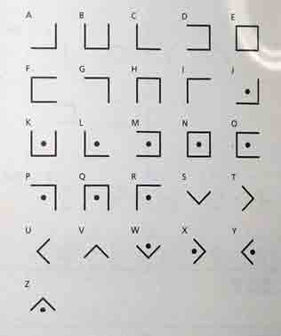

对照上题目，很快就可以翻译出密码明文为 helloworld

然后，木有然后了，游戏到此结束，通关了

通关证明


版权声明：未经授权禁止转载 [LinE](http://drops.wooyun.org/author/LinE "由 LinE 发布")@[乌云知识库](http://drops.wooyun.org)

分享到：

### 相关日志

*   [CVE-2013-4547 Nginx 解析漏洞深入利用及分析](http://drops.wooyun.org/tips/2006)
*   [逆向基础（四）](http://drops.wooyun.org/tips/2046)
*   [XSS 与字符编码的那些事儿 —科普文](http://drops.wooyun.org/tips/689)
*   [PHP 绕过 open_basedir 列目录的研究](http://drops.wooyun.org/tips/3978)
*   [Hack.lu 2014 Writeup](http://drops.wooyun.org/tips/3420)
*   [Flappy Bird 恶意程序详细分析](http://drops.wooyun.org/tips/1314)