# LDAP 注入与防御剖析

2014/02/26 15:53 | [r00tgrok](http://drops.wooyun.org/author/r00tgrok "由 r00tgrok 发布") | [技术分享](http://drops.wooyun.org/category/tips "查看 技术分享 中的全部文章") | 占个座先 | 捐赠作者

[目录]

```
0x00 前言 
0x01 LDAP 出现背景 
0x02 LDAP 的特性 
0x03 LDAP 注入攻击剖析 
0x04 防御 LDAP 注入 
0x05 本文小结 
0x06 参考资料 
```

## 0x00 前言

* * *

前些日子笔者在看 OWASP 测试指南时看到了对 LDAP 注入攻击的介绍，对此产生了兴趣，可是上面谈论的东西太少，在网上经过一番搜索之后找到了构成本文主要来源的资料，整理出来分享给大家。

本文主要分为两部分，第一部分为对 LDAP 的介绍，包括 LDAP 的应用背景和它的一些特性。第二部分也是本文的重点，讲解 LDAP 的注入攻防，读者朋友可以看到虽说是攻防，但实际侧重注入攻击层面。第一部分主要整理自 IBM Redbooks 前三章对 LDAP 的介绍，第二部分主要来自笔者对 08 年黑帽大会 paper 的翻译。文章结尾会做一个小结，也会举例说明 LDAP 在现实中的真实存在性，最后本文会给出所参考过的资料信息。

## 0x01 LDAP 出现背景

* * *

LDAP(Lightweight Directory Access Protocol):轻量级目录访问协议，是一种在线目录访问协议，主要用于目录中资源的搜索和查询，是 X.500 的一种简便的实现。　　　　　
随着互联网的广泛使用，web 应用的数量呈爆炸式的增长，而这些应用的资源和数据呈分布式存储于目录中。通常不同的应用会有专属于自己相关数据的目录，即专有目录，专有目录数量的增长导致了信息孤岛(一种不能与其他相关信息系统之间进行互操作或者说协调工作的信息系统)的出现，系统和资源的共享及管理变得日益困难。

以查找联系人和加密证书为例，太多的目录明显会给计算机搜索带来巨大的压力，当然随之出现了相应的解决方案，如 X.500，不过在介绍 X.500 之前先讨论一下目录和关系型数据库之间的一些关系，因为前面提到了 web 应用的数据是存储在目录中，而不是数据库中。的确，目录和数据库有很多共同之处，都能存储数据、并能在一定程度进行搜索和查询。另外还有一种玩笑的说法，使用数据库存在注入攻击，怎么样才能避免呢?使用 LDAP 代替数据库吧，当然这只是玩笑，LDAP 的出现可以追溯到 1980 年，而针对数据库的 SQLI 则到 2000 年左右才出现。

不同之处在于目录适合于存放静态数据，而且不同于数据库，目录中存储的数据无论在类型和种类较之数据库中的数据都要更为繁多，包括音频、视频、可执行文件、文本等文件，另外目录中还存在目录的递归。相比之下，数据库中存储的数据在格式和类型都有较严格的约束，数据库有索引、视图、能处理事务(通常包含了一个序列的对数据库的读/写操作)。简单来说数据库更多见于处理专有类型的数据，而目录则具有通用用途。目录中的内容发生变化后会给搜索操作带来不便，因而目录服务在进行优化后更适宜于读访问，而非写、修改等操作。

X.500 申明了目录客户端和目录服务器使用的目录访问协议(DAP)，然而作为应用层协议，DAP 要求完整的 7 层 OSI 协议栈操作，会要求比小环境(配置、资源有限的环境)所能提供的更多的资源，因此需要一种轻量级的协议来代替 X.500，LDAP 正是因此而生。

## 0x02 LDAP 特性

* * *

简单了解一下 LDAP：LDAP 不定义客户端和服务端的工作方式，但会定义客户端和服务端的通信方式，另外，LDAP 还会定义 LDAP 数据库的访问权限及服务端数据的格式和属性。LDAP 有三种基本的通信机制：没有处理的匿名访问；基本的用户名、密码形式的认证；使用 SASL、SSL 的安全认证方式。LDAP 和很多其他协议一样，基于 tcp/ip 协议通信，注重服务的可用性、信息的保密性等等。部署了 LDAP 的应用不会直接访问目录中的内容，一般通过函数调用或者 API，应用可以通过定义的 C、Java 的 API 进行访问，Java 应用的访问方式为 JNDI(Java Naming and Directory Interface)。

LDAP 目录以入口(entry，目录中存储的基本信息单元)的形式存储和组织数据结构，每个入口有一个唯一标识自己的专属名称(distnguished name)，DN 由一系列 RDNs(ralative distinguished names)组成。另外还有两个常见的结构，对象类和属性。对象类(object class)会定义独一的 OID，每个属性(attribute)也会分配唯一的 OID 号码。看一下定义对象类和属性的例子：

初始对象类定义：

```
objectclass: top
objectclass: person 
```

详细对象类定义：

```
objectclass: person
objectclasses=( 2.5.6.6 NAME 'person' DESC 'Defines entries that generically represent people.' SUP 'top' STRUCTURAL MUST ( cn $ sn ) MAY ( userPassword $ telephoneNumber $ seeAlso $ description ) ) 
```

属性定义：

```
attributetypes=( 2.5.4.4 NAME ( 'sn' 'surName' ) DESC 'This is the X.500 surname attribute, which contains the family name of a person.' SUP 2.5.4.41 EQUALITY 2.5.13.2 ORDERING 2.5.13.3 SUBSTR 2.5.13.4 USAGE userApplications ) 
```

LDAP 以目录信息树形式存储信息，包含入口、对象、属性，关系图如下：

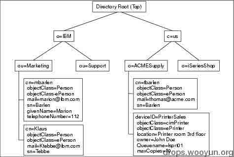

入口点和属性之间的关系为：

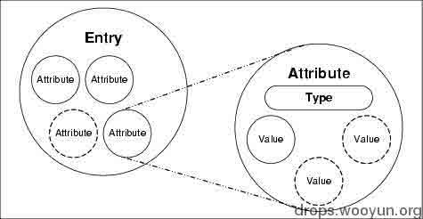

上述就是笔者对 LDAP 数据结构的简单介绍了，LDAP 既然主要用于搜索查询，那它是怎么查询的呢？

search 语法：

```
attribute operator value search filter options:( "&" or "|" (filter1) (filter2) (filter3) ...) ("!" (filter)) 
```

主要根据属性和值进行搜索，就如浏览网页时我们通常并不会直接浏览某个目录，而是其下存在的某个文件。

LDAP 的 URL 形式为：

```
ldap://<host>:<port>/<path>
<path>:<dn>[?<artribute>[?<scope>?<filter>]] 
```

例如： 

```
ldap://austin.ibm.com/ou=Austin,o=IBM
ldap:///ou=Austin,o=IBM??sub?(cn=Joe Q. Public) 
```

看得出来在 URL 中这里使用逗号分隔查询，而数据库查询则使用'&'号，这是 LDAP 特有的，另外这里 o 表示组织(organization)，u 表示单元(unit)，cn 表示 country name，可以查阅相关资了解这种简短表示法。

## 0x03 LDAP 注入攻击剖析

* * *

### 1.引言

近年来高速发展的信息技术使得组织的数据库中存储的数据急剧增加，这些数据很大一部分对于组织、他们的客户及合作伙伴而言是敏感、不可泄露和至关重要的。

因而，在组织的内部防火墙后通常都安装有数据库，同时有入侵机制机制对其进行保护，并且只能由部分应用进行访问。为了访问数据库，用户必须连接这些应用并向数据库提交查询。当这些应用表现不当、没有过滤用户输入就提交查询时，使用数据库的风险就会上升。

超过 50%的 Web 应用漏洞都跟输入验证有关，这使得代码注入技术的利用成为可能。这些攻击近年来如雨后春笋般出现，引发了系统和应用严重的安全问题。SQL 注入技术是使用和研究得最广泛的，但除此之外还存在和其他语言或协议相关的注入技术，如 Xpath 和 LDAP。

要防止出现此类攻击引发的后果，需要研究各种代码注入的可能性，并将其公之于众，让所有的程序员和管理员都知晓。本文将会深入分析 LDAP 注入技术，因为所有基于 LDAP 树的 Web 应用都可能存在这种攻击的漏洞。

利用 LDAP 注入技术的关键在于控制用于目录搜索服务的过滤器。使用这些技术，攻击者可能直接访问 LDAP 目录树下的数据库，及重要的公司信息。情况还可能比这更严重，因为许多应用的安全性依赖于基于 LDAP 目录的单点登录环境。

尽管导致这些后果的漏洞易于理解和修复，它们却一直存在，因为人们对这种攻击和它们所能造成的后果知之甚少。之前有这种漏洞利用的参考资料，但它们并不适用于大多数形形色色的现代 LDAP 服务实施方案。本文的主要作用在于对可能利用的新 LDAP 注入技术做一个展示，并做一个深度分析。

本部分的组织如下：第二和第三节解阐述了 LDAP 的基础知识，这些基础有助于理解在接下来的章节展示中使用的技术。第四节展示了两种典型的 LDAP 注入技术，并用案例进行说明示范。第五节用更多地例子说明了盲 LDAP 注入是如何完成的。最后，第六节是一些对抗这些攻击的安全建议。

### 2\. LDAP 概览

轻量级目录访问协议是通过 TCP/IP 查询和修改目录服务的协议，使用最广泛的 LDAP 服务如微软的 ADAM(Active Directory Application Mode)和 OpenLDAP。

LDAP 目录服务是用于共享某些通用属性的存储和组织信息的软件应用程序,信息基于目录树入口被结构化，而服务器提供方便的浏览和搜索等服务。LDAP 是面向对象的，因此 LDAP 目录服务中的每一个入口都是一个对象实例，并且必须对应该对象属性的规则。

由于 LDAP 目录服务的层次化的性质，基于读取的查询得到了优化，而写查询则受到抑制。

LDAP 同样基于客户端/服务器模型，最常见的操作时使用过滤器搜索目录入口。客户端向服务器发送查询，服务器则响应匹配这些过滤器的目录入口。

LDAP 过滤器定义于 RFC4515 中，这些过滤器的结构可概括如下：

```
Fileter = (filtercomp)
Filtercomp = and / or / not / item
And = & filterlist
Or = | filterlist
Not = ! filter
Filterlist = 1*filter
Item = simple / present / substring
Simple = “=” / “~=” / ”>=” / “<=”
Present = attr =*
Substring = attr “=” [initial]*[final]
Initial = assertion value
Final = assertion value 
```

所有过滤器必须置于括号中，只有简化的逻辑操作符`(AND、OR、NOT)`和关系操作符`(=、>=、<=、~=)`可用于构造它们。特殊符“*”可用来替换过滤器中的一个或多个字符。

除使用逻辑操作符外，RFC4256 还允许使用下面的单独符号作为两个特殊常量：

```
(&)     ->Absolute TRUE 
(|)     ->Absolute FALSE 
```

### 3\. 常见的 LDAP 环境

LDAP 服务是许多公司和机构日常操作的关键组成部分，目录服务如微软的 Microsoft Active Directory，Novell E-Directory 和 RedHat Directory 服务都基于 LDAP 协议。不过也有其他的应用和服务会利用 LDAP 服务。

这些应用和服务通常需要不同的目录(单独认证)来工作。例如，一个域需要一个目录，邮箱和销售列表也需要一个单独的目录，另外远程访问、数据库和其他 Web 应用都需要目录。基于 LDAP 服务的新目录有多种用途，用于作为用户认证的集中化信息容器和使能单点登录环境。这个场景通过减少管理的复杂度、提升安全性和容错能力而提高了生产力。基本上，基于 LDAP 服务的应用使用目录处于如下用途之一：

```
—访问控制 
—权限管理 
—资源管理 
```

由于 LDAP 服务对于公司网络的重要性，LDAP 服务器通常和其他数据库服务器一起放置于后端。图一展示了部署公司网络的典型场景，记住这个场景对于理解后面展示的注入技术的含义是很有用的。

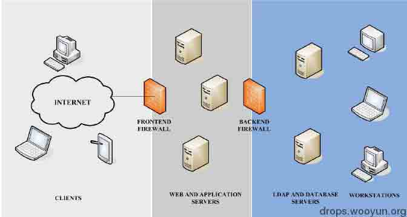

图一

### 4\. Web 应用中的 LDAP 注入

LDAP 注入攻击和 SQL 注入攻击相似，因此接下来的想法是利用用户引入的参数生成 LDAP 查询。一个安全的 Web 应用在构造和将查询发送给服务器前应该净化用户传入的参数。在有漏洞的环境中，这些参数没有得到合适的过滤，因而攻击者可以注入任意恶意代码。

记住第二节中说道的 LDAP 过滤器的结构和使用得最广泛的 LDAP：ADAM 和 OpenLDAP，下面的结论将会致代码注入：

`(attribute=value)`:如果过滤器用于构造查询单缺少逻辑操作符，如`value)(injected_filter`的注入会导致两个过滤器`(attribute=value)(injected\_filter)`。在 OpenLDAP 实施中，第二个过滤器会被忽略，只有第一个会被执行。而在 ADAM 中，有两个过滤器的查询是不被允许的，因而这个注入毫无用处。

`(|(attribute=value)(second_filter)) or (&(attribute=value)(second_filter))`:如果第一个用于构造查询的过滤器有逻辑操作符，形如`value)(injected_filter)`的注入会变成如下过滤器：`(&(attribute=value)(injected_filter)) (second_filter)`。虽然过滤器语法上并不正确，OpenLDAP 还是会从左到右进行处理，忽略第一个过滤器闭合后的任何字符。一些 LDAP 客户端 Web 组成会忽略第二个过滤器，将 ADAM 和 OpenLDAP 发送给第一个完成的过滤器，因而存在注入。

一些应用框架在将请求发送给服务器之前会检查过滤器是否正确，在这种情况下，过滤器语义上必须是正确的，其注入如：`value)(injected_filter))(&(1=0`。这会导致出现两个不同的过滤器，第二个会被忽略：`(&(attribute=value)(injected_filter))(&(1=0)(second_filter))`。

既然第二个过滤器会被 LDAP 服务器忽略，有些部分便不允许有两个过滤器的查询。这种情况下，只能构建一个特殊的注入以获得单个过滤器的 LDAP 查询。`value)(injected_filter`这样的注入产生的结果是：`(&(attribute=value)(injected_filter)(second_filter))`。

测试一个应用是否存在代码注入漏洞典型的方法是向服务器发送会生成一个无效输入的请求。因此，如果服务器返回一个错误消息，攻击者就能知道服务器执行了他的查询，他可以利用代码注入技术。回想一下之前讨论的，我们可以将注入环境分为两种：AND 注入环境和 OR 注入环境。

### 4.1 AND 注入

这种情况，应用会构造由”&”操作符和用户引入的的参数组成的正常查询在 LDAP 目录中搜索，例如：

```
(&(parameter1=value1)(parameter2=value2)) 
```

这里 Value1 和 value2 是在 LDAP 目录中搜索的值，攻击者可以注入代码，维持正确的过滤器结构但能使用查询实现他自己的目标。 

#### 4.1.1 案例 1：绕过访问控制

一个登陆页有两个文本框用于输入用户名和密码(图二)。Uname 和 Pwd 是用户对应的输入。为了验证客户端提供的 user/password 对，构造如下 LDAP 过滤器并发送给 LDAP 服务器：

```
(&(USER=Uname)(PASSWORD=Pwd)) 
```

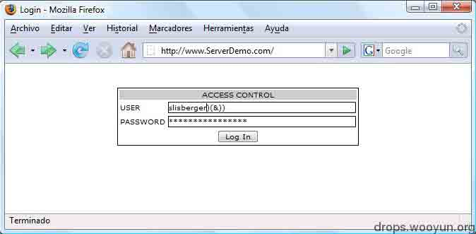

图二

如果攻击者输入一个有效地用户名，如 r00tgrok，然后再这个名字后面注入恰当的语句，password 检查就会被绕过。

使得 Uname=slisberger)(&))，引入任何字符串作为 Pwd 值，构造如下查询并发送给服务器：

```
(&(USER= slisberger)(&)(PASSWORD=Pwd)) 
```

LDAP 服务器只处理第一个过滤器，即仅查询`(&(USER=slidberger)(&))`得到了处理。这个查询永真，因而攻击者无需有效地密码就能获取对系统的访问(图三)。

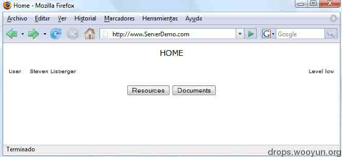

图三

#### 4.1.2 案例二：权限提升

现假设下面的查询会向用户列举出所有可见的低安全等级文档：

```
(&(directory=document)(security_level=low)) 
```

这里第一个参数`document`是用户入口，low 是第二个参数的值。如果攻击者想列举出所有可见的高安全等级的文档，他可以利用如下的注入：

```
document)(security_level=*))(&(directory=documents 
```

生成的过滤器为：

```
(&(directory=documents)(security_level=*))(&(direcroty=documents)(security_level=low)) 
```

LDAP 服务器仅会处理第一个过滤器而忽略第二个，因而只有下面的查询会被处理：

```
(&(directory=documents)(security_level=*)) 
```

而

```
(&(direcroty=documents)(security_level=low)) 
```

则会被忽略。结果就是，所有安全等级的可用文档都会列举给攻击者，尽管他没有权限查看它们。

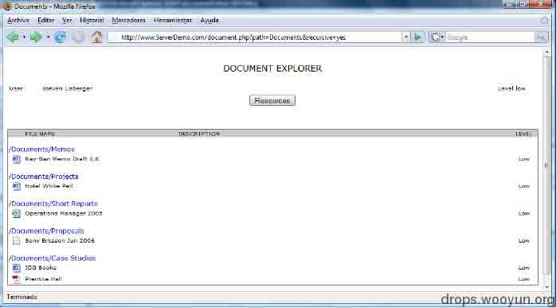

图四 低安全等级的文档

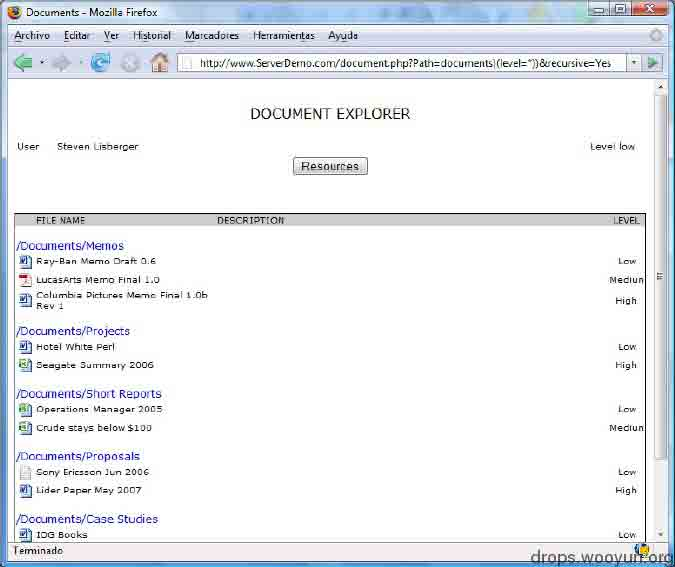

图五 所有安全等级的文档

### 4.2 OR 注入

这种情况，应用会构造由”|”操作符和用户引入的的参数组成的正常查询在 LDAP 目录中搜索，例如：

```
(|(parameter1=value1)(parameter2=value2)) 
```

这里 Value1 和 value2 是在 LDAP 目录中搜索的值，攻击者可以注入代码，维持正确的过滤器结构但能使用查询实现他自己的目标。

#### 4.2.1 案例 1：信息泄露

假设一个资源管理器允许用户了解系统中可用的资源(打印机、扫描器、存储系统等)。这便是一个典型的 OR 注入案例，因为用于展示可用资源的查询为：

```
(|(type=Rsc1)(type=Rsc2)) 
```

Rsc1 和 Rsc2 表示系统中不同种类的资源，在图六中，Rsc1=printer，Rsc2=scanner 用于列出系统中所以可用的打印机和扫描器。

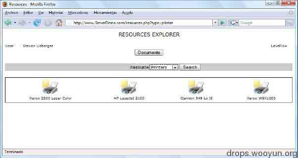

图六

如果攻击者输入`Rsc=printer)(uid=*)`，则下面的查询被发送给服务器：

```
(|(type=printer)(uid=*))(type=scanner) 
```

LDAP 服务器会响应所有的打印机和用户对象，见图七

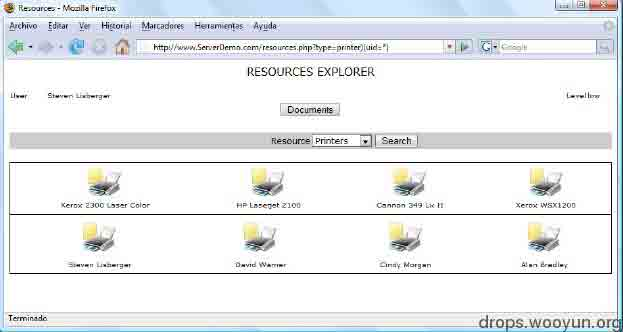

图七

### 5\. LDAP 盲注入

假设攻击者可以从服务器响应中推测出什么，尽管应用没有报出错信息，LDAP 过滤器中注入的代码却生成了有效的响应或错误。攻击者可以利用这一行为向服务器问正确的或错误的问题。这种攻击称之为盲攻击。LDAP 的盲注攻击比较慢但容易实施，因为它们基于二进制逻辑，能让攻击者从 lDAP 目录提取信息。

#### 5.1 AND 盲注

假设一个 Web 应用想从一个 LDAP 目录列出所有可用的 Epson 打印机，错误信息不会返回，应用发送如下的过滤器：         

```
(&(objectClass=printer)(type=Epson*)) 
```

使用这个查询，如果有可用的 Epson 打印机，其图标就会显示给客户端，否则没有图标出现。如果攻击者进行 LDAP 盲注入攻击

```
*)(objectClass=*))(&(objectClass=void 
```

Web 应用会构造如下查询：      

```
(&(objectClass=*)(objectClass=*))(&(objectClass=void)(type=Epson*)) 
```

仅第一个 LDAP 过滤器会被处理：

```
(&(objectClass=*)(objectClass=*)) 
```

结果是，打印机的图标一定会显示到客户端，因为这个查询总是会获得结果：过滤器 objectClass=*总是返回一个对象。当图标被显示时响应为真，否则为假。

从这一点来看，使用盲注技术比较容易，例如构造如下的注入：         

```
(&(objectClass=*)(objectClass=users))(&(objectClass=foo)(type=Epson*))
(&(objectClass=*)(objectClass=resources))(&(objectClass=foo)(type=Epson*)) 
```

这种代码注入的设置允许攻击者推测可能存在于 LDAP 目录服务中不同对象类的值。当响应 Web 页面至少包含一个打印机图标时，对象类的值就是存在的，另一方面而言，如果对象类的值不存在或没有对它的访问，就不会有图标出现。

LDAP 盲注技术让攻击者使用基于 TRUE/FALSE 的技术访问所有的信息。

#### 5.2 OR 盲注

这种情况下，用于推测想要的信息的逻辑与 AND 是相反的，因为使用的是 OR 逻辑操作符。接下来使用的是同一个例子，OR 环境的注入为：

```
(|(objectClass=void)(objectClass=void))(&(objectClass=void)(type=Epson*)) 
```

这个 LDAP 查询没有从 LDAP 目录服务获得任何对象，打印机的图标也不会显示给客户端(FALSE)。如果在响应的 Web 页面中有任何图标，则响应为 TRUE。故攻击者可以注入下列 LDAP 过滤器来收集信息：      

```
(|(objectClass=void)(objectClass=users))(&(objectClass=void)(type=Epson*))
(|(objectClass=void)(objectClass=resources))(&(objectClass=void)(type=Epson*)) 
```

### 5.3 利用案例

在本节中，部署了 LDAP 环境以展示上面说到的注入技术的使用，另外也描述了利用这些漏洞可能造成的影响及这些攻击对当前系统安全性的重要影响。

在本例中，printerstatus.php 页面接收 idprinter 参数构造如下的 LDAP 搜索过滤器：       

```
(&(idprinter=value1)(objectclass=printer)) 
```

#### 5.3.1 发现属性

LDAP 盲注技术可以通过利用 Web 应用中内建的搜索过滤器首部的 AND 操作符，获得 LDAP 目录服务的敏感信息。例如，给出图八中为打印机对象定义的属性和图九中找个查询的响应页面，这里`value1=HPLaserJet2100`

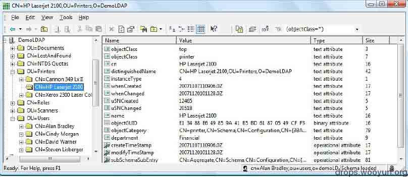

图八

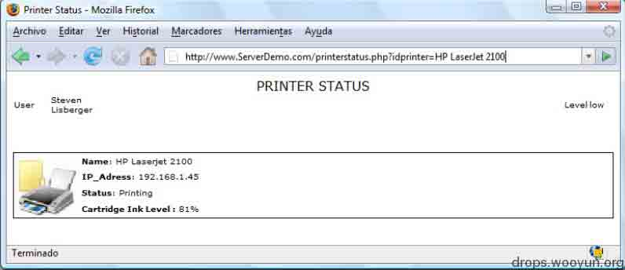

图九

一个属性发现攻击可以使用下面的 LDAP 注入：

```
(&(idprinter=HPLaserJet2100)(ipaddresss=*))(objectclass=printer)
(&(idprinter=HPLaserJet2100)(departments=*))(objectclass=printer) 
```

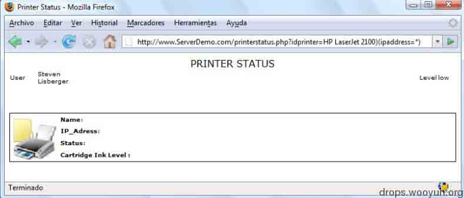

图十 属性不存在时的响应

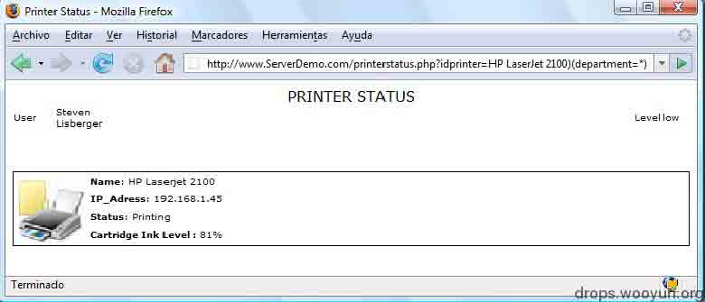

图十一 属性存在时的响应

很显然，攻击者可以根据返回的结果判断属性是否存在。在第一种情况中，应用没有给出打印机的信息，因为属性 ipaddress 并不存在或不可访问(FALSE)。另一方面，第二种情况中，响应页面显示了打印机的状态，department 属性存在且可以访问。进一步说，可以使用 LDAP 注入获得一些属性的值。例如，假设攻击者想获得 department 属性的值：他可以使用 booleanization 和字符集削减技术，这将在下一节中介绍。

#### 5.3.2 Booleanization

攻击者可以使用字母、数字搜索提取属性的值，这个想法的关键在于将一个复杂的值转化为 TRUE/FALSE 列表。这个机制，通常称为 booleanization，大意是二值化吧，图十二概括了该机制，可用于不同的方式。

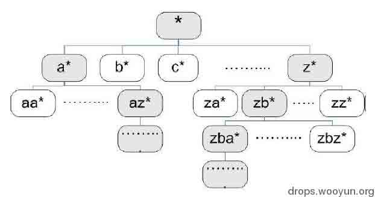

假设攻击者想知道 department 属性的值，处理如下：

```
(&(idprinter=HPLaserJet2100)(department=a*))(object=printer))
(&(idprinter=HPLaserJet2100)(department=f*))(object=printer))
(&(idprinter=HPLaserJet2100)(department=fa*))(object=printer)) 
```

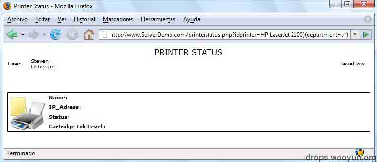

图十三 值不是以’a’开始

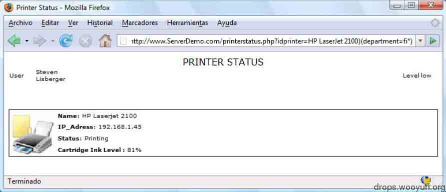

图十四 值以’fi’开始

如图九所示，本例中 department 的值是 financial，用”a”的尝试没有获取任何打印机信息，因而第一个字母不是”a”。测试过其他字母后，唯一能正常返回的只有”f”，接下来测试第二个字母，当为”i”时才正常返回，如图十四，以此类推即可获得 department 的值。

### 5.3.3 字符集削减

攻击者可以使用字符集削减技术减少获得信息所需的请求数，为完成这一点，他使用通配符测试给定的字符在值中是否为`*anywhere*`：

```
(&(idprinter=HPLaserJet2100)(department=*b*))(object=printer))
(&(idprinter=HPLaserJet2100)(department=*n*))(object=printer)) 
```

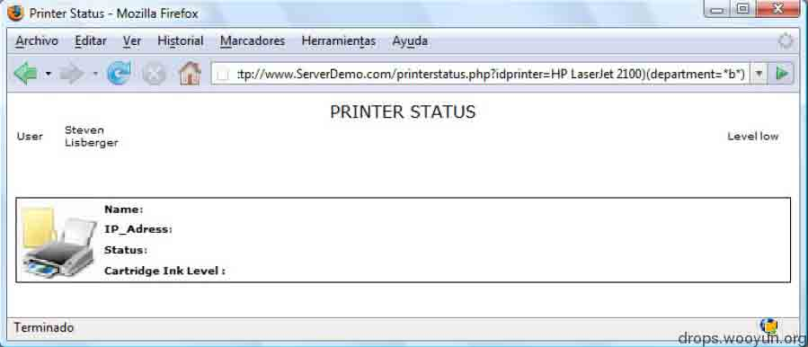

图十五 department 的之中没有字母”b”

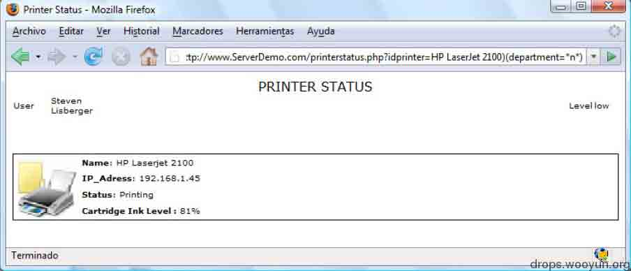

图十六 department 的之中没有字母”n”

图十五是测试”b”的响应页面，没有结果说明没有字母”b”，图十六中响应正常，意味着’n’出现在 department 值中。

通过这样处理，构成 depaetment 值的字母是哪些就可以知道了，一旦字符集削减完成，只有发现的那些字母会用于 booleanization 处理，因此减少了请求的数量。

## 0x04 防御 LDAP 注入

* * *

前面演示的攻击都是作用于应用层，因此网络层的防火墙和入侵检测机制无法防御这些 LDAP 注入攻击。然而遵循最小化暴露点和最小化权限的原则可以减小或最小化其影响。

用于防御代码注入技术的机制包括防御性编程、复杂的输入验证、动态检查和源代码分析，减轻 LDAP 注入的工作必须涉及相似的技术。

之前的 LDAP 注入攻击演示都在从客户端发送给服务器的参数中包含了特殊字符，因而有必要在发送查询给服务器之前对变量进行检查和净化处理。

总而言之，我们看到圆括号、星号、逻辑操作符、关系运操作符在应用层都必须过滤。

无论什么时候，只要可能，构造 LDAP 搜索过滤器的值在发送给 LDAP 服务器查询之前都要用应用层有效地值列表来核对。

图十七包含了 LDAP 中用到的特殊字符和需要转义处理的字符：

左边的字符在正常情况下是不会用到的，如果在用户的输入中出现了需要用反斜杠转义处理。而右边的圆括号这些如果不过滤的话就会导致过滤器闭合而生产攻击者需要的 filter，这里看到不仅是用反斜杠处理，还将字符变成了相应的 ASCII 码值，这些符号本不该出现。

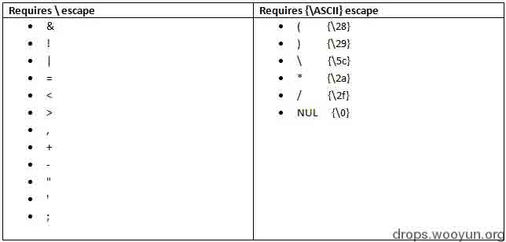

图十七

上面这些字符的处理在 RFC2254 中都能找到，具体实现可参考如下一段 PHP 代码：

```
function ldapspecialchars($string) {
    $sanitized=array('\\' => '\5c',
                     '*' => '\2a',
                     '(' => '\28',
                     ')' => '\29',
                     "\x00" => '\00');

    return str_replace(array_keys($sanitized),array_values($sanitized),$string);
}

```

对 LDAP 服务而言防御注入并不像 SQL 注入那么复杂，只要把守好数据的入口和出口就能有效的防御攻击 ，图十八是转义前后对比的例子

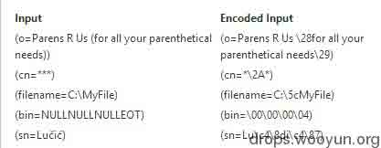

## 0x05 本文小结

* * *

文章开始的 LDAP 介绍到后面 LDAP 注入与防御部分，读者朋友可能发现关于 LDAP 的介绍存在部分内容上的重叠，之所以保留，主要是考虑到这重叠的部分是以不同的视角去看待的。IBM Redbooks 的介绍更多多从企业层面出发，而后面的译文则更多地从一个安全研究者的角度看待问题，内容上差不多，但是体现了个体与整体之间的不同。 再总结一下本文的内容，本文主要分为两部分，第一部分是对 LDAP 的介绍，又分为背景介绍和特性的简单介绍；本文第二部分讨论 LDAP 注入攻击和防御，攻击分为普通注入和盲注入，并给出了对应的测试案例。从篇幅上来说，本文重点在 LDAP 注入这一部分，并不是说防御这一块不重要，而是因为 LDAP 虽然类似于数据库，但是在查询上相比更为简单，对于其防御可以参考数据库的防御措施。另外理解 LDAP 的特性也很重要，因为部署该服务，除了我们说的注入攻击之外，服务器管理、配置不当也会引发安全问题。

## 0x06 参考资料

* * *

本文到这里就差不多要结束了，在此再提两点：LDAP 服务开启的端口是 389，如果发现某个服务器上开启了该端口很可能就是开启了 LDAP 服务，针对 LDAP 的软件有 ldapbroswer、ldap blind explorer；之前说到 LDAP 注入漏洞在现实生活中真实存在，在这里给出一个 LDAP 信息泄露的例子，虽然不一定是 LDAP 注入直接导致的，但足以说明会造成巨大危害，同时也有例可循：

[WooYun: 腾讯某服务配置不当内部海量敏感信息泄露!](http://www.wooyun.org/bugs/wooyun-2013-045626)

[WooYun: 腾讯某研发中心某系统多用户弱口令可能导致该产品线及业务受影响!](http://www.wooyun.org/bugs/wooyun-2013-046031)

以下是形成本文的过程中参考过较重要的资料：

[`www.redbooks.ibm.com/redbooks/SG244986/wwhelp/wwhimpl/js/html/wwhelp.htm`](http://www.redbooks.ibm.com/redbooks/SG244986/wwhelp/wwhimpl/js/html/wwhelp.htm)

[`www.blackhat.com/presentations/bh-europe-08/Alonso-Parada/Whitepaper/bh-eu-08-alonso-parada-WP.pdf`](https://www.blackhat.com/presentations/bh-europe-08/Alonso-Parada/Whitepaper/bh-eu-08-alonso-parada-WP.pdf)

[`blog.nci.ca/nciblog/2013/6/12/ldap-injection`](http://blog.nci.ca/nciblog/2013/6/12/ldap-injection)

[`stackoverflow.com/questions/3028770/preventing-ldap-injection`](http://stackoverflow.com/questions/3028770/preventing-ldap-injection)

版权声明：未经授权禁止转载 [r00tgrok](http://drops.wooyun.org/author/r00tgrok "由 r00tgrok 发布")@[乌云知识库](http://drops.wooyun.org)

分享到：

### 相关日志

*   [使用 LDAP 查询快速提升域权限](http://drops.wooyun.org/pentesting/2125)
*   [Android uncovers master-key 漏洞分析](http://drops.wooyun.org/papers/219)
*   [xss 挑战赛 writeup](http://drops.wooyun.org/tips/3059)
*   [XSS 与字符编码的那些事儿 —科普文](http://drops.wooyun.org/tips/689)
*   [fuzzing XSS filter](http://drops.wooyun.org/tips/879)
*   [逆向基础（九）](http://drops.wooyun.org/tips/2459)