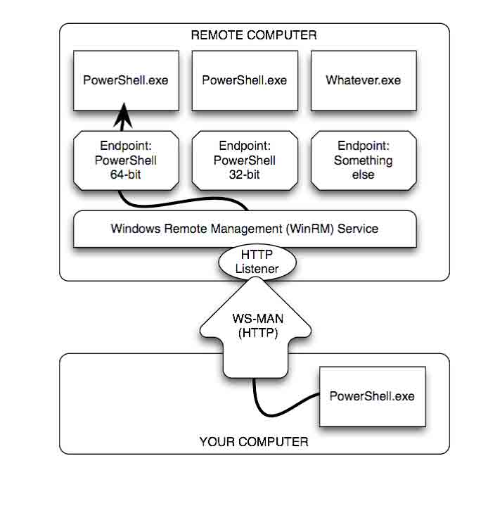
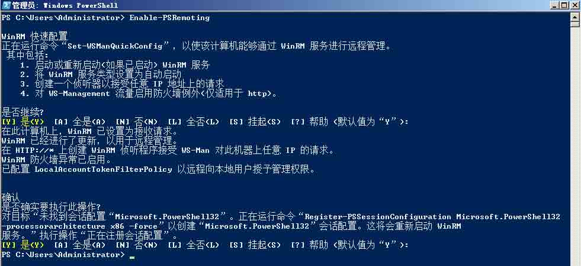
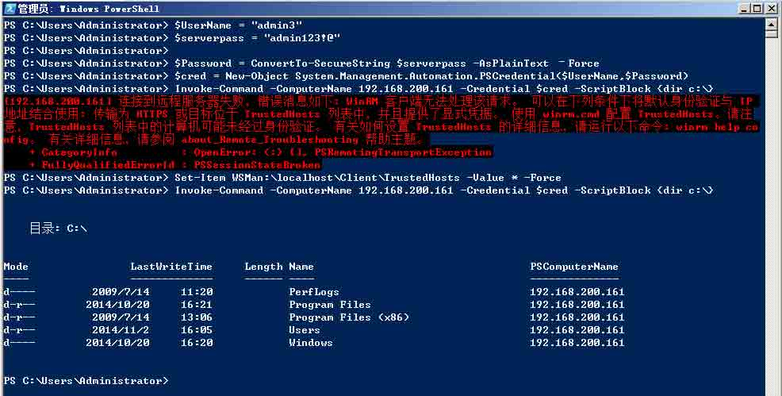
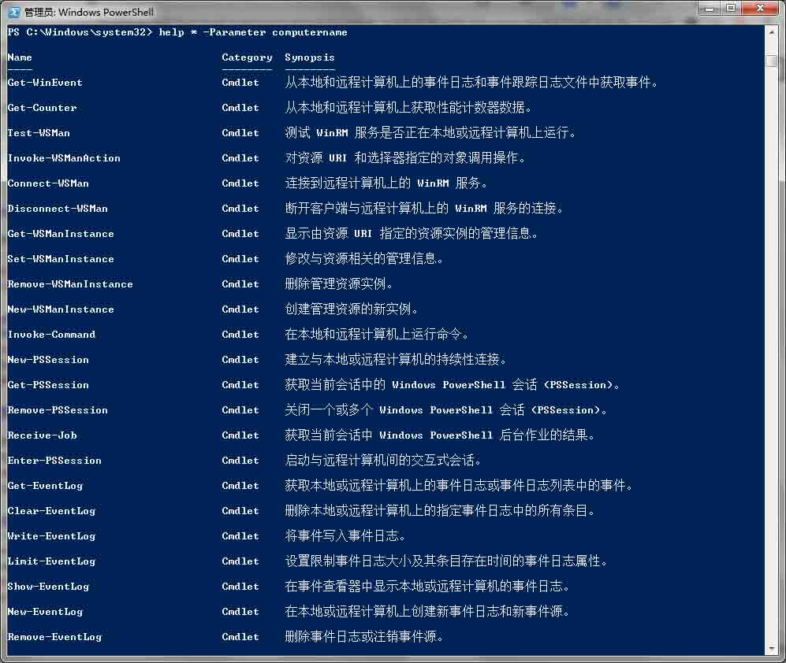
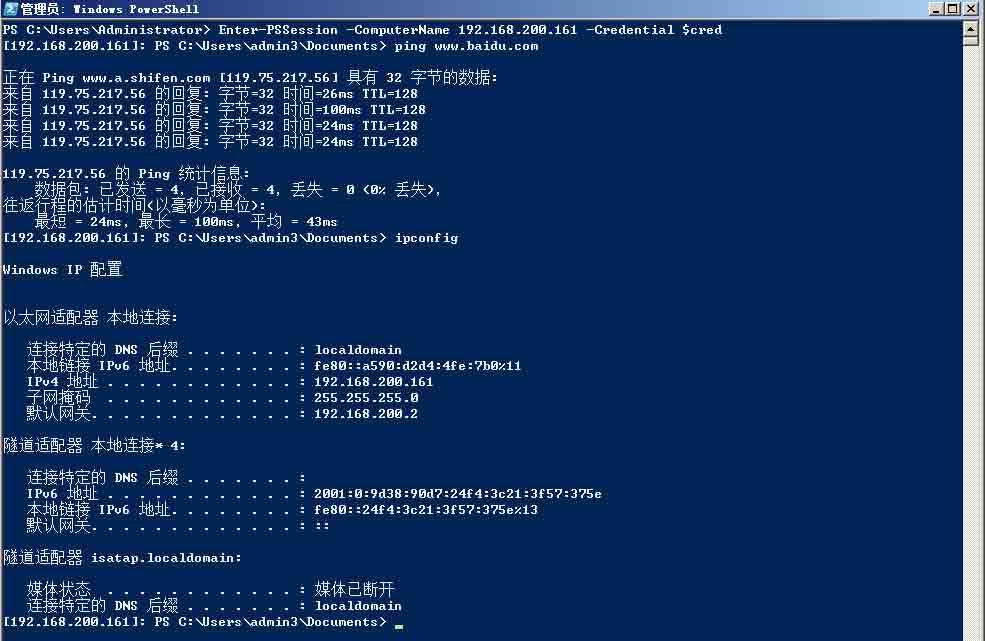
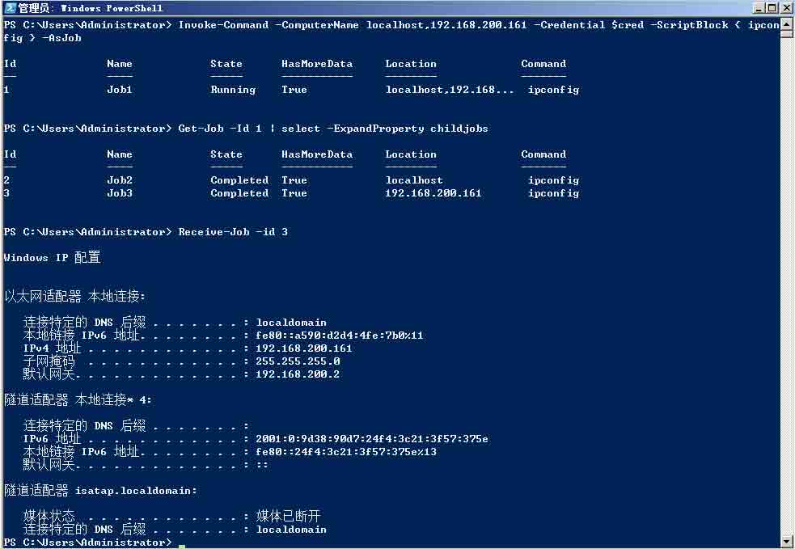
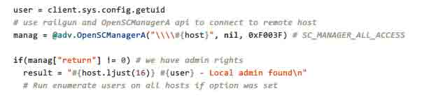
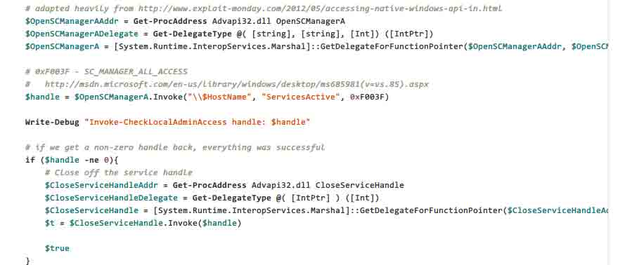

# Powershell tricks::Powershell Remoting

2014/11/03 10:03 | [DM_](http://drops.wooyun.org/author/DM_ "由 DM_ 发布") | [技术分享](http://drops.wooyun.org/category/tips "查看 技术分享 中的全部文章") | 占个座先 | 捐赠作者

## 0x01 简介

* * *

Powershell Remoting 建立在 windows WinRM 服务之上，可以一对一或一对多远程控制，也可以建立 HTTP 或 HTTPS 的“listeners”，使用 WS-MAM 协议接收远程传递的命令。

Windows 远程管理(WinRM)是 WS-Management 协议的 Microsoft 实现，该协议为使用 Web 服务的本地计算机和远程计算机之间的通信提供了一种安全的方式。 也就是说在 WS-MAN 协议基础上，客户端运行环境可以多样化。 比如[openwsman](https://github.com/Openwsman/openwsman)。



图片来源：v3 Secrets of PowerShell Remoting

## 0x02 远程管理

* * *

Powershell Remoting 在 windows server 2008 以前默认是不开启的，需要通过 administrator 用户执行 Enable-PSRemoting 命令开启。



在 windows server 2012 中，Powershell Remoting 默认开启。

在 windows 下，powershell 默认使用 winrm 进行远程管理，winrm 版本不同默认的监听端口也不同。如下：

> The default ports for winrm 1.1 are http port 80 and https port 443
> 
> The default ports for winrm 2.x are http port 5985 and https port 5986

可以在参考[这里](http://technet.microsoft.com/en-us/library/ff520073(WS.10).aspx)判断 winrm 版本。

通过`Enable-PSRemoting`命令打开 PS 远程，默认是启动了 Kerberos 认证。这个方法只适合两台电脑在相同域或信任域内的指定电脑（名字可以带后缀）.但它不支持跨域、域外或 IP 地址。

如果要跨域、或指定 IP 地址执行时我们可以在客户端这里执行下面的代码，需要将所有或单一远程主机添加在信任表中。

```
Set-Item WSMan:\localhost\Client\TrustedHosts -Value * -Force 
```

删除所有远程信任主机

```
Clear-Item WSMan:\localhost\Client\TrustedHosts 
```

如果要删除单一远程主机，则可以执行：

```
$newvalue = ((Get-ChildItem WSMan:\localhost\Client\TrustedHosts).Value).Replace("computer01,","")
Set-Item WSMan:\localhost\Client\TrustedHosts $newvalue 
```

更改 computer01。

列出所有远程信任主机

```
Get-Item WSMan:\localhost\Client\TrustedHosts 
```

在使用远程执行时如果只提供用户名，那么则会弹窗输入密码。此时我们可以建立 PSCredential 对象将用户名和密码保存在里面。然后再传递给`-Credential`参数。`-ScriptBlock`参数后跟要执行的代码。

```
$UserName = "admin3"
$serverpass = "admin123!@"

$Password = ConvertTo-SecureString $serverpass -AsPlainText –Force
$cred = New-Object System.Management.Automation.PSCredential($UserName,$Password)

invoke-command -ComputerName localhost -Credential $cred -ScriptBlock { ipconfig } 
```



使用`help * -Parameter computername`命令可以列出所有默认可以远程使用的命令。并且认证过程都可以像上面的代码一样传递$cred。

之后写个 for 循环就可以一对多的执行了。



如果输出内容过于冗杂，还可以使用`ConvertTo-Csv`或者`ConvertTo-Html`将 powershell 对象的输出转换为 html 或者 csv。

如果想一对一获取交互式 powershell，可以像这样执行`Enter-PSSession`：

```
Enter-PSSession -ComputerName 192.168.200.161 -Credential $cred 
```



## 0x03 多任务分发

* * *

在使用`invoke-command` 的时候，`computername` 可为多个参数。在执行的时候可以使用`-Asjob`参数将执行过程放在后台。 接收回显的时候可以使用`get-job`查看`job id`，然后用`receive-job`接收全部回显结果。 但是如果我只是想查看某个远程主机的执行结果呢？ 那么就可以像下面这样做：

```
Get-Job -Id 1 | select -ExpandProperty childjobs 
```

得到`child job id`之后，再用 `receive-job` 接收回显结果。



## 0x04 域内信息搜集

* * *

基本的信息搜集(日志、进程、服务等)可以靠上面列出的命令来收集，但是远程执行`invoke-command`是需要凭证的，如果是在域内我们是不是可以先用`nltest`搜集下信任域？

在 windows 中有个`System.DirectoryServices.ActiveDirectory`命名空间，和 windows 域有关。 其下有个类 Domain，其中`GetAllTrustRelationships()`方法可以获得信任域。

那么在 powershell 就可以这样执行：

```
([System.DirectoryServices.ActiveDirectory.Domain]::GetCurrentDomain()).GetAllTrustRelationships() 
```

获得域之前的信任关系。 如果需要自行开发脚本，也可以参考下面的文档。

除此之外，还记得之前 metasploit 笔记中那个`local_admin_search`模块吗？`veil-powerview`中也有通过相同的方式实现了这一过程。

两种不同的脚本都通过调用 OpenSCManagerA API 连接远程主机测试是否成功。



Local_admin_search.rb



Invoke-CheckLocalAdminAccess

附[veil-powerview 作者博客中](http://www.harmj0y.net/blog/penetesting/finding-local-admin-with-the-veil-framework/)的测试截图：


## 0x05 参考

* * *

*   [`www.harmj0y.net/blog/redteaming/trusts-you-might-have-missed/`](http://www.harmj0y.net/blog/redteaming/trusts-you-might-have-missed/)
*   [`msdn.microsoft.com/en-us/library/system.directoryservices.activedirectory.domain(v=vs.110).aspx`](http://msdn.microsoft.com/en-us/library/system.directoryservices.activedirectory.domain(v=vs.110).aspx)

*   [`www.blackhat.com/docs/us-14/materials/arsenal/us-14-Schroeder-The-Veil-Framework-Slides.pdf`](https://www.blackhat.com/docs/us-14/materials/arsenal/us-14-Schroeder-The-Veil-Framework-Slides.pdf)

*   [`www.blackhat.com/docs/us-14/materials/arsenal/us-14-Schroeder-The-Veil-Framework-Slides.pdf`](https://www.blackhat.com/docs/us-14/materials/arsenal/us-14-Schroeder-The-Veil-Framework-Slides.pdf)

*   [v3 Secrets of PowerShell Remoting.pdf](http://powershell.org/wp/2012/08/06/ebook-secrets-of-powershell-remoting/)

## 0x06 powershell pentest project 学习推荐

* * *

整理的过程发现了很多牛人的博客和项目，在这里分享一下。

**Powershell HID attack toolkit** ：[`github.com/samratashok/Kautilya`](https://github.com/samratashok/Kautilya)

**post exploitation** ：[`github.com/samratashok/nishang`](https://github.com/samratashok/nishang)

**Remote DLL inject** ：[`github.com/clymb3r`](https://github.com/clymb3r)

**aspx 的 Powershell webshell** ：[`github.com/samratashok/nishang/tree/master/Antak- WebShell`](https://github.com/samratashok/nishang/tree/master/Antak-WebShell)

**Veil Post exploitation** ：[`github.com/Veil-Framework/Veil-PowerView`](https://github.com/Veil-Framework/Veil-PowerView)

**A PowerShell Post-Exploitation Framework** ：[`github.com/mattifestation/PowerSploit`](https://github.com/mattifestation/PowerSploit)

**local privilege escalation** : [`github.com/HarmJ0y/PowerUp`](https://github.com/HarmJ0y/PowerUp)

版权声明：未经授权禁止转载 [DM_](http://drops.wooyun.org/author/DM_ "由 DM_ 发布")@[乌云知识库](http://drops.wooyun.org)

分享到：

### 相关日志

*   [给 CISCO 设备中后门的方法–TCL 以及路由安全](http://drops.wooyun.org/tips/85)
*   [Powershell and Windows RAW SOCKET](http://drops.wooyun.org/tips/4707)
*   [配置 ModSecurity 防火墙与 OWASP 规则](http://drops.wooyun.org/tips/2614)
*   [弱随机化种子漏洞科普](http://drops.wooyun.org/papers/1419)
*   [2014 年澳大利亚信息安全挑战 CySCA CTF 官方 write up Web 篇](http://drops.wooyun.org/tips/2444)
*   [Powershell tricks::Bypass AV](http://drops.wooyun.org/tips/3353)