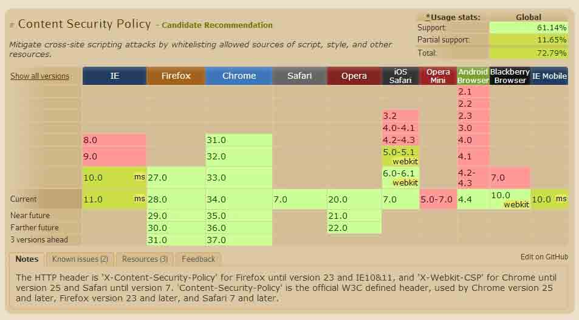
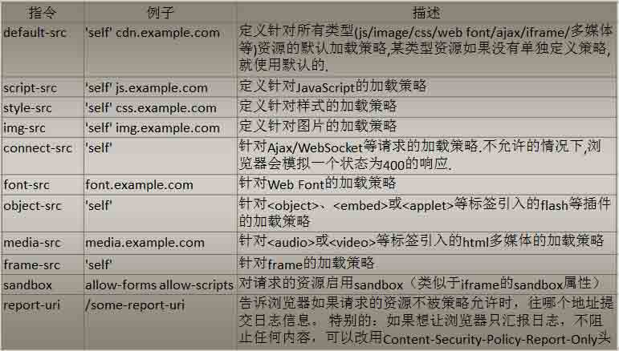
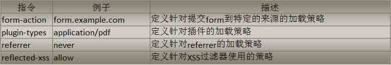
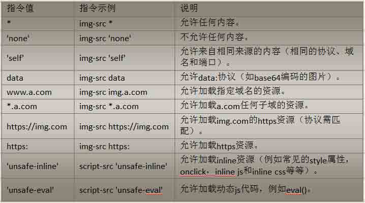
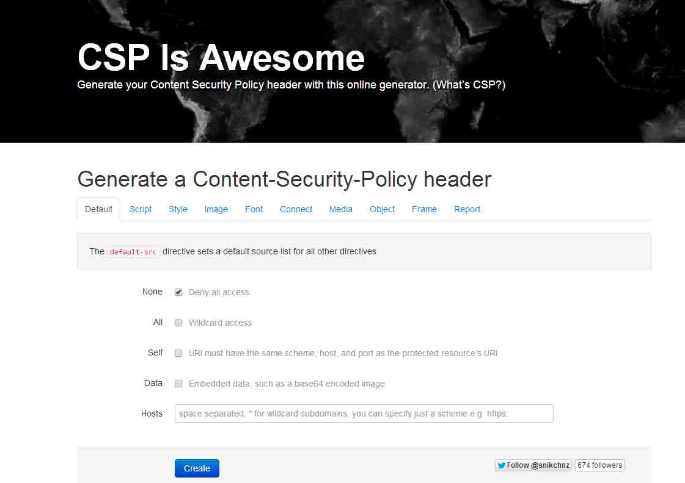
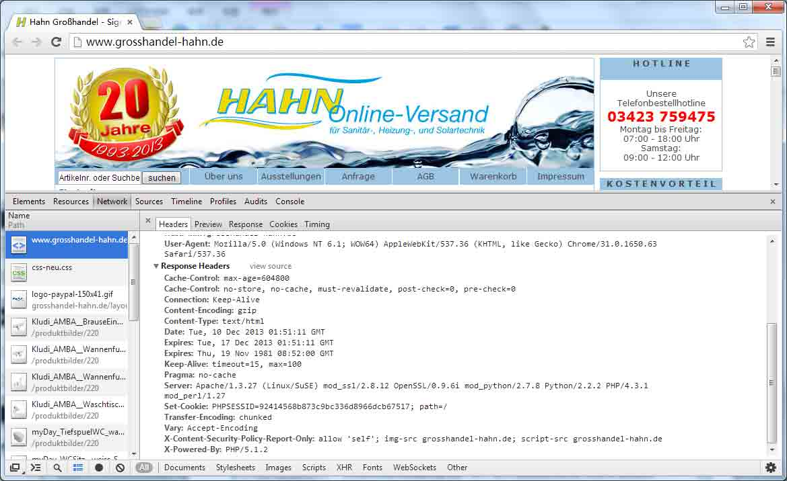
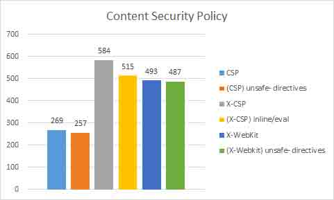

# 浏览器安全策略说之内容安全策略 CSP

2014/04/17 14:50 | [天融信阿尔法实验室](http://drops.wooyun.org/author/天融信阿尔法实验室 "由 天融信阿尔法实验室 发布") | [web 安全](http://drops.wooyun.org/category/web "查看 web 安全 中的全部文章"), [技术分享](http://drops.wooyun.org/category/tips "查看 技术分享 中的全部文章") | 占个座先 | 捐赠作者

目录

```
0x00         前言
0x01         CSP 概念
0x02         CSP 发展时间轴
0x03         CSP 语法
0x04         CSP 默认特性
0x05         CSP 例子
0x06         CSP 的错误使用
0x07         CSP 分析报告
0x08         CSP 的使用率统计
0x09         CSP Bypass
0x0a         CSP 总结
0x0b         参考 
```

## 0x00 前言

* * *

一直说要去写个浏览器安全策略系列，10 篇安全策略的内容虽早已成竹在胸，但写出来却要花费好多时间。CSP 这篇已于一个月前写出来，而后筹备 Blog 上线用了一段时间，不容易。FirstBlood，第一篇文章就献给阿尔法实验室和浏览器中一个伟大而又被忽略的安全策略 CSP 吧。好酒值得细细去品，好的安全策略也一样。废话少说，下面正式进入文章主题。

2013 年 11 月 Veracode 给出的报告指出，全球前 1000000 网站中仅有 269 个网站使用了 W3C 规范的 CSP 策略头 Content-Security-Policy。而在 2014 年 2 月 ZoomEye 给出的测试报告中，国内排名前 7000 的域名没有使用 CSP，国内 1 千万的域名（含子域名）中仅发现 7 个使用了 CSP 策略，其中还有 3 个网站 CSP 语法使用错误。

如果说 CSP 是一个伟大的安全策略，为何全球范围内网站使用率如此之低？是 CSP 自身的设计存在问题，还是网站管理员们没有去充分了解和利用它。CSP 到底是一个什么样的安全策略，是像人们普遍说的它是 XSS 攻击的终结者吗？

带着以上的疑问，本文将从 CSP 的概念、发展时间轴、语法使用、如何正确部署 CSP、CSP 的自有特性、如何利用 CSP 产生攻击报告、CSP 当前使用率、Bypass CSP 等众多方面，来给大家全面介绍 CSP 这个伟大而又被忽视的安全策略。

## 0x01 CSP 概念

* * *

内容安全策略（Content Security Policy，简称 CSP）是一种以可信白名单作机制，来限制网站中是否可以包含某来源内容。默认配置下不允许执行内联代码（`<script>`块内容，内联事件，内联样式），以及禁止执行 eval() , newFunction() , setTimeout([string], …) 和 setInterval([string], …) 。

## 0x02 CSP 发展时间轴

* * *

毋容置疑 CSP 是一个伟大的策略，但 CSP 从最初设计到被 W3C 认可制定成通用标准，却经历了一个漫长而曲折的过程。

### CSP 模型首次被提出

这要从 2007 年说起，当时 XSS 攻击已经在 OWASP TOP10 攻击中排名第一位，CSP 的最初的设想就在这一年被 Mozilla 项目组的 Gervase Markham 和 WEB 安全界大牛 Robert Hansen ‘rsnake’两人共同提出的。

### 浏览器首次使用 CSP

2011 年 3 月 Firefox 4.0 发布，首次把 CSP 当作一种正式的安全策略规范使用到浏览器中。当时火狐使用的是自己定义的 X-Content-Security-Policy 头。单从 CSP 推广上来看，Firefox4.0 的发布是划时代的，虽然此时的 CSP 只是 Firefox 自己定义的一个内部标准。但在此之后，CSP 的概念被全球迅速推广。

### Chrome 使用 CSP

随后在 2011 年 9 月，谷歌在 Chrome 浏览器 14.0 版本发布时加入 CSP，而 Chrome 浏览器使用的也是自己的 CSP 标准，它使用 X-Webkit-CSP 头进行对 CSP 的解析，这个头从字面上更能看出来 Chrome 浏览器使用的是 Webkit 内核。此时世界主流的 2 大浏览器 Chrome、Firefox 都已经支持了 CSP。

### W3C 起草 CSP 标准

作为标准发布的 W3C 组织顺其自然在 2011 年 11 月在官网上发布了 CSP1.0 草案。W3C 的 CSP1.0 草案的语法和 Firefox 和 Chrome 中截然不同，随着时间的推移 1 年后，W3C 的 CSP1.0 草案已经到了推选阶段，基本可以正式发布。

### 全面支持 W3C 标准的 CSP

在 2012 年 2 月 Chrome25 版本发布时，宣布支持 W3C 标准的 CSP1.0。2013 年 6 月 Firefox 宣布在 23 版本中全面支持 W3C 的 CSP1.0 标准。同样是在 2013 年 6 月，W3C 发布 CSP1.1 标准，里面又加入了不少语法，现在大多浏览器还都不支持。IE10 中开始支持 CSP 中的’sandbox’语法，其他语法暂不支持。

目前 CSP 各个浏览器支持情况可以去[`caniuse.com/#feat=contentsecuritypolicy`](http://caniuse.com/#feat=contentsecuritypolicy)查看

cspuse

## 0x03 CSP 语法

* * *

### CSP1.0 指令



### CSP1.1 新增指令



### CSP 语法



## 0x04 CSP 默认特性

* * *

### 阻止内联代码执行

CSP 除了使用白名单机制外，默认配置下阻止内联代码执行是防止内容注入的最大安全保障。这里的内联代码包括：`<script>`块内容，内联事件，内联样式。

### (1) script 代码，`<script>……<scritp>`

对于`<script>`块内容是完全不能执行的。例如：

```
<script>getyourcookie()</script>

```

### (2) 内联事件

```
<a href="" onclick="handleClick();"></a>
<a href="javascript:handleClick();"></a>

```

### (3) 内联样式

```
<div style="display:none"></div>

```

虽然 CSP 中已经对 script-src 和 style-src 提供了使用”unsafe-inline”指令来开启执行内联代码，但为了安全起见还是慎用”unsafe-inline”。

### EVAL 相关功能被禁用

用户输入字符串，然后经过 eval()等函数转义进而被当作脚本去执行。这样的攻击方式比较常见。于是乎 CSP 默认配置下，eval() , newFunction() , setTimeout([string], …) 和 setInterval([string], …)都被禁止运行。

比如：

```
alert(eval("foo.bar.baz"));
window.setTimeout("alert('hi')", 10);
window.setInterval("alert('hi')", 10);
new Function("return foo.bar.baz");

```

如果想执行可以把字符串转换为内联函数去执行。

```
alert(foo && foo.bar && foo.bar.baz); 
window.setTimeout(function() { alert('hi'); }, 10); 
window.setInterval(function() { alert('hi'); }, 10); 
function() { return foo && foo.bar && foo.bar.baz };

```

同样 CSP 也提供了”unsafe-eval”去开启执行 eval()等函数，但强烈不建议去使用”unsafe-eval”这个指令。

## 0x05 CSP 例子

### 例子 1

网站管理员想要所有的内容均来自网站自己的域，不包括子域。

```
Content-Security-Policy: default-src 'self' 
```

### 例子 2

网站管理员想要所有的内容来自网站自己的域，还有其他子域的内容。

```
Content-Security-Policy: default-src 'self' *.mydomain.com 
```

### 例子 3

网站管理员想要网站接受信任任意域的图像，指定域的音频视频和指定域的脚本。

```
Content-Security-Policy: default-src 'self'; img-src *; media-src media1.com media2.com; script-src userscripts.example.com 
```

在这条策略中，默认情况下，网站只允许加载自己域的内容。但也有例外：

```
img-src * 使用*通配符可以加载任意域的图片。
media-src media1.com media2.com 视频音频只允许加载这两个域的
script-src userscripts.example.com 脚本只能加载 userscripts.example.com 域的 
```

### 例子 4

网站管理员确保在线银行所有内容都通过 SSL 加载，确保信息不会被截获。

```
Content-Security-Policy: default-src https://onlinebanking.jumbobank.com 
```

### 例子 5

看 github.com 的真实 CSP 例子。Github 允许加载任何域的内容，但只能加载指定域的脚本，只能加载指定域的样式并可以执行内联样式，只能通过 SSL 加载指定域的 flash 插件。

```
Content-Security-Policy:default-src *; script-src 'self' https://github.global.ssl.fastly.net  https://ssl.google-analytics.com https://collector-cdn.github.com  https://embed.github.com https://raw.github.com; style-src 'self' 'unsafe-inline' https://github.global.ssl.fastly.net; object-src https://github.global.ssl.fastly.net 
```

### 在线 CSP 编写

在线 CSP 编写，可以协助和帮助网站管理员编写出适合自己站点的 CSP。http://cspisawesome.com/



## 0x06 CSP 的错误使用

* * *

CSP 的语法和指令并不复杂，但如果没有充分了解网站业务和安全需求，错误的使用 CSP 则会适得其反。

（1）我在 2013 年底访问 http://www.grosshandel-hahn.de/，发现 CSP 策略明显使用错误。



可以看到使用 X-Content-Security-Policy-Report-Only。此头的意思是让浏览器只汇报日志，不阻止任何内容。但这条策略里却没有给出接收信息日志的地址。

（2）Content-Security-Policy: default-src https:; frame-src test.com;。这个策略方案是有问题的，此头限制 https 以外的所有资源，但又允许 iframe 通过 http 进行加载。现实中，这样的场景应该很难出现。

## 0x07 CSP 分析报告

* * *

对于网站管理员来说 CSP 的一个强大功能是它可以产生试图攻击你网站的分析报告。你可以用 report-uri 指令使浏览器发送 HTTP POST 请求把攻击报告以 JSON 格式传送到你指定的地址。接下来给大家介绍你的站点如何配置来接收攻击报告。

### 启用报告

默认情况下，违规报告不会发送。为了能使用违规报告，你必须使用 report-uri 指令，并至少提供一个接收地址。

```
Content-Security-Policy: default-src self; report-uri http://reportcollector.example.com/collector.cgi 
```

如果想让浏览器只汇报报告，不阻止任何内容，可以改用 Content-Security-Policy-Report-Only 头。

### 违规报告语法

该报告 JSON 对象包含以下数据：

```
blocked-uri：被阻止的违规资源
document-uri：拦截违规行为发生的页面
original-policy：Content-Security-Policy 头策略的所有内容
referrer：页面的 referrer
status-code：HTTP 响应状态
violated-directive：违规的指令 
```

### 违规报告例子

http://example.com/signup.html 中 CSP 规定只能加载 cdn.example.com 的 CSS 样式。

```
Content-Security-Policy: default-src 'none'; style-src cdn.example.com; report-uri /test/csp-report.php 
```

signup.html 中的代码类似与这样：

```
<!DOCTYPE html>
<html>
  <head>
    <title>Sign Up</title>
    <link rel="stylesheet" href="css/style.css">
  </head>
  <body>
    ... Content ...
  </body>
</html>

```

你能从上面的代码找出错误吗？策略是只允许加载 cdn.example.com 中的 CSS 样式。但 signup.html 试图加载自己域的 style.css 样式。这样违反了策略，浏览器会向 http://example.com/test/csp-report.php 发送 POST 请求提交报告，发送格式为 JSON 格式。

```
{
  "csp-report": {
    "document-uri": "http://example.com/signup.html",
    "referrer": "",
    "blocked-uri": "http://example.com/css/style.css",
    "violated-directive": "style-src cdn.example.com",
    "original-policy": "default-src 'none'; style-src cdn.example.com; report-uri /_/csp-reports",
  }
}

```

你从上面可以看到 blocked-uri 给出了详细的阻断地址 http://example.com/css/style.css，但也并不是每次都是这样。比如试图从 http://anothercdn.example.com/stylesheet.css 加载 CSS 样式时，浏览器将不会传送完整的路径，只会给出 http://anothercdn.example.com/这个地址。这样做是为了防止泄漏跨域的敏感信息。

服务端 csp-report.php 代码可以这样写：

```
<?php 
$file = fopen('csp-report.txt', 'a');
$json = file_get_contents('php://input');
$csp = json_decode($json, true);
foreach ($csp['csp-report'] as $key => $val) {
    fwrite($file, $key . ': ' . $val . "
");
}
fwrite($file, 'End of report.' . "
");
fclose($file);
?>

```

## 0x08 CSP 的使用率统计

* * *

CSP 的全球范围使用率非常低，而且增加的也非常缓慢。根据 Veracode 在 2013 年 11 月给出的报告指出，全球前 1000000 网站中仅有 269 个网站使用了 W3C 规范的 CSP 策略头 Content-Security-Policy。584 个网站在使用 X-Content-Security-Policy 策略头和 487 个网站在使用 X-Webkit-CSP 策略头，这两个协议头已经被废弃，但还没有被禁用。

而使用 Content-Security-Policy-Report-Only 进行单独接收攻击报告的网站只有 24 个。而统计中也指出，发现大量网站使用 unsafe-inline 这个指令，分析其原因可能是由于开发人员很难在页面中彻底消除内联脚本，这很让人失望，所有只能要求制定的 CSP 策略更加严谨。



[`blog.veracode.com/2013/11/security-headers-on-the-top-1000000-websites-november-2013-report/`](http://blog.veracode.com/2013/11/security-headers-on-the-top-1000000-websites-november-2013-report/)

对于国内网站使用 CSP 的情况，我给余弦打了个招呼，ZoomEye 对此进行了统计。2014 年 2 月发来的统计结果在非常不乐观。根据 ZoomEye 的统计：国内排名前 7000 的域名没有使用 CSP，国内 1 千万的域名（含子域名）中发现 7 个使用了 CSP 策略，其中还有 3 个网站 CSP 语法使用错误。7 个网站中 3 个网站是知乎，知乎网站值得表扬。列表如下：

```
www.zhihu.com
www.zhi.hu
zhimg.com
www.applysquare.com
www.pipapai.com CSP 语法错误
www.icyprus.cn  CSP 语法错误
www.uyitec.cn  CSP 语法错误 
```

在网站安全防御方面，我们还要有很长的路要走。虽然 CSP 安全策略头只是网站安全整体防御中的一小部分，但合理的利用还是可以起到很好的防护作用。然而在我们分析的百万网站中，CSP 的使用率是极其的低，从这一点来说 CSP 在国内就应该广泛的给网站管理员进行科普。

## 0x09 CSP Bypass

* * *

一个安全策略从诞生开始将会时不时的有一个叫“Bypass”的小伙伴跟随左右。而从辩证角度来讲，多加载一种安全策略，就多了一种 Bypass 的维度。一旦 Bypass 出现，就意味着将有一种设计者没有考虑到的方法或技巧，将破坏策略的原有规则。

CSP 也亦是如此，在一次次被绕过然后在一次次修复过程中，来完善自己的语法和指令。

### bypass AngularJS 系列绕过

AngularJS 是为数不多的支持 CSP 模式的 MVC 框架，在早起版本中可以构造多种方式绕过 CSP 防御。

CSP Bypasses with AngularJS 1.0.8 and 1.1.5

例如：XSS via Click & Hover (ng-click & ng-mouseover attribute)

```
<?php
header('X-Content-Security-Policy: default-src \'self\' ajax.googleapis.com');
header('Content-Security-Policy: default-src \'self\' ajax.googleapis.com');
header('X-Webkit-CSP: default-src \'self\' ajax.googleapis.com');
header('Set-Cookie: abc=123');
?><!doctype html>
<html ng-app ng-csp>
<head>
<script src="http://ajax.googleapis.com/ajax/libs/angularjs/1.1.5/angular.min.js"></script>
</head>
<body ng-click="$event.view.alert(1)">
        Click me
        <h1 ng-mouseover="$event.target.ownerDocument.defaultView.alert(2)">Hover me</h1>
</body>

```

更多的可以看[`code.google.com/p/mustache-security/wiki/AngularJS`](https://code.google.com/p/mustache-security/wiki/AngularJS)

### 策略优先级绕过

在浏览器的保护策略中，有很多是重复的。比如 A 策略可以抵御 C 攻击，B 策略也可以抵御 C 攻击。此处的抵御可以是阻断也可以是放行。于是当 AB 同时作用于 C 攻击上时，Bypass 就可能发生。

（1）Iframe sandbox 和 CSP sandbox

当 iframe sandbox 允许执行 JS，而 CSP 不允许执行 JS，问题就发生了，CSP 就被 bypass 了。

```
//evil.com
<iframe sandbox="allow-scripts" src="//victim.com/csp.html">
//victim.com
<?php
header('X-Content-Security-Policy: default-src \'self\'');
header('Content-Security-Policy: default-src \'self\'');
header('X-Webkit-CSP: default-src \'self\'');
header('Set-Cookie: abc=123');
?><!doctype html>
<body onclick="alert(1)">
Click me
</body>

```

详细的讨论可以看这里：[`bugzilla.mozilla.org/show_bug.cgi?id=886164`](https://bugzilla.mozilla.org/show_bug.cgi?id=886164)

（2）XSS Auditor 和 CSP

关于 XSS Auditor 和 CSP，这里我想进行一次更开放式的讨论。以 Chrome 中测试为例，当 XSS Auditor 和 CSP 同时作用到一段 JS 代码上，会有怎样一个效果呢。比如 XSS Auditor 设置的是阻断，CSP 里设置 unsafe-inline 放行，结果还是被阻断。这是由于浏览器解析 JS 脚本的时候先使用了 XSS auditor 这层安全防御策略，所以 CSP 中的 unsafe-inline 这个指令并没有起作用，从广义的角度来看，CSP 中的策略被 Bypass 了。浏览器的策略中，类似与这样的情况还有很多。比如下面介绍的这个。

（3） X-Frame-Options 和 CSP frame

当 a.com 设置 X-Frame-Options:deny，b.com 设置 CSP frame-src a.com，那么 b.com 是否可以 iframe a.com 呢。测试中发现 a.com 还是不能被 b.com 包含的。你可以认为浏览器解析中，X-Frame-Options 优先级大于 CSP frame。

## 0x0a CSP 总结

* * *

充分了解 CSP 安全策略的语法和指令，并最大程度的合理的去利用和部署这些策略，努力把安全策略发挥到极致，使其最终把危害降低到最低。

CSP 并不能消除内容注入攻击，但可以有效的检测并缓解跨站攻击和内容注入攻击带来的危害。

CSP 不是做为防御内容注入(如 XSS)的第一道防线而设计，而最适合部署在纵深防御体系中。

关于为什么 CSP 的使用率如此之低。究其原因，CSP 虽然提供了强大的安全保护，但是他也造成了如下问题：Eval 及相关函数被禁用、内嵌的 JavaScript 代码将不会执行、只能通过白名单来加载远程脚本。这些问题阻碍 CSP 的普及，如果要使用 CSP 技术保护自己的网站，开发者就不得不花费大量时间分离内联的 JavaScript 代码和做一些调整。

没有被绕过的策略不是好的策略，而从辩证角度来讲，多加载一种安全策略，就多了一种 Bypass 的维度。在安全领域“Bypass”始终是一个曼妙而鬼魅的名字。

应该把 CSP 安全策略视为是一把可以直插心脏的锋利的尖刀，而不是一根电线杆子杵在那。

## 0x0b 参考

* * *

[`www.w3.org/TR/CSP11/`](http://www.w3.org/TR/CSP11/)
[`www.w3.org/TR/CSP/`](http://www.w3.org/TR/CSP/)
[`www.html5rocks.com/en/tutorials/security/content-security-policy/`](http://www.html5rocks.com/en/tutorials/security/content-security-policy/)
[`ruxcon.org.au/assets/slides/CSP-kuza55.pptx`](http://ruxcon.org.au/assets/slides/CSP-kuza55.pptx)
[`code.google.com/p/mustache-security/wiki/AngularJS`](https://code.google.com/p/mustache-security/wiki/AngularJS)
[`content-security-policy.com/`](http://content-security-policy.com/)
[`github.com/blog/1477-content-security-policy`](https://github.com/blog/1477-content-security-policy)
[`cspisawesome.com/`](http://cspisawesome.com/)
[`developer.mozilla.org/en-US/docs/Security/CSP/Using_Content_Security_Policy`](https://developer.mozilla.org/en-US/docs/Security/CSP/Using_Content_Security_Policy)
[`benvinegar.github.io/csp-talk-2013/#1`](http://benvinegar.github.io/csp-talk-2013/#1)
[`caniuse.com/#feat=contentsecuritypolicy`](http://caniuse.com/#feat=contentsecuritypolicy)
[`www.imququ.com/post/content-security-policy-reference.html`](https://www.imququ.com/post/content-security-policy-reference.html)
[`docs.angularjs.org/api/ng.directive:ngCsp`](http://docs.angularjs.org/api/ng.directive:ngCsp)
[`developer.mozilla.org/en-US/docs/Security/CSP/Using_CSP_violation_reports`](https://developer.mozilla.org/en-US/docs/Security/CSP/Using_CSP_violation_reports)
[`stackoverflow.com/questions/14629534/json-post-in-php-csp-report`](http://stackoverflow.com/questions/14629534/json-post-in-php-csp-report)
[`mathiasbynens.be/notes/csp-reports`](http://mathiasbynens.be/notes/csp-reports)
[`www.madirish.net/556`](http://www.madirish.net/556)
[`www.veracode.com/blog/2013/11/security-headers-on-the-top-1000000-websites-november-2013-report/`](http://www.veracode.com/blog/2013/11/security-headers-on-the-top-1000000-websites-november-2013-report/)
[`github.com/google/CSP-Validator`](https://github.com/google/CSP-Validator)
[`www.benmarshall.me/content-security-policy/`](http://www.benmarshall.me/content-security-policy/)
[`www.slideshare.net/x00mario/jsmvcomfg-to-sternly-look-at-javascript-mvc-and-templating-frameworks`](http://www.slideshare.net/x00mario/jsmvcomfg-to-sternly-look-at-javascript-mvc-and-templating-frameworks)
[`trends.builtwith.com/javascript/Angular-JS`](http://trends.builtwith.com/javascript/Angular-JS)
[`developer.chrome.com/extensions/contentSecurityPolicy`](http://developer.chrome.com/extensions/contentSecurityPolicy)
[`cs.ucsb.edu/~adoupe/static/dedacota-ccs2013.pdf`](http://cs.ucsb.edu/~adoupe/static/dedacota-ccs2013.pdf)

版权声明：未经授权禁止转载 [天融信阿尔法实验室](http://drops.wooyun.org/author/天融信阿尔法实验室 "由 天融信阿尔法实验室 发布")@[乌云知识库](http://drops.wooyun.org)

分享到：

### 相关日志

*   [XSS 和字符集的那些事儿](http://drops.wooyun.org/papers/1327)
*   [Linux PAM&&PAM;后门](http://drops.wooyun.org/tips/1288)
*   [软件漏洞分析技巧分享](http://drops.wooyun.org/tips/1261)
*   [Burp Suite 使用介绍（二）](http://drops.wooyun.org/tools/1629)
*   [Google 对 Gmail 的所有通信进行 SSL 加密](http://drops.wooyun.org/news/1269)
*   [Web 前端攻防](http://drops.wooyun.org/tips/2686)