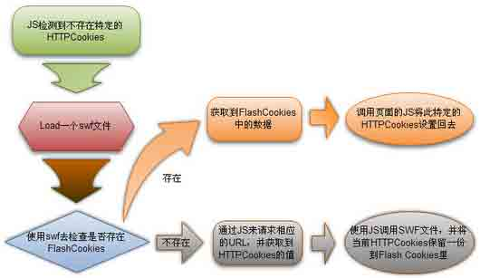

# 撞库扫号防范

2014/08/16 18:58 | [小胖胖要减肥](http://drops.wooyun.org/author/小胖胖要减肥 "由 小胖胖要减肥 发布")   | [技术分享](http://drops.wooyun.org/category/tips "查看 技术分享 中的全部文章"), [运维安全](http://drops.wooyun.org/category/%e8%bf%90%e7%bb%b4%e5%ae%89%e5%85%a8 "查看 运维安全 中的全部文章")  | 占个座先  | 捐赠作者

## 0x00 背景

* * *

撞库扫号攻击已经是 Top 10 Security Risks for 2014 之一，不管你的网站密码保存的额多好，但是面试已经泄露的账号密码，撞库扫号防御还是一个相当重要的环节。之前一篇普及了扫号的基本防止防范和危害。

本篇讲详细解决面对技术同步在进步的黑色产品如何更好地防止撞库扫号。由于涉及相关内部策略，也只是抛砖引玉。

撞库扫号，无非是自动化或者脚本化执行用户名密码来进行登陆，通过页面跳转 302 状态或者返回特征及包的大小，是否重新 set-cookies 来判断是否登陆成功。 那么可以通过哪些方式来缓解恶意用户的批量行为？

## 0x01 细节

* * *

一般，传统企业会在登陆页面直接增加验证码，不过由于自动化验证码识别脚本早已出现，简单的验证码识别已经不是什么问题。这种方式很难作为防止有针对性的恶意攻击。

其次，一些考虑用户体验的企业会在用户账户或者密码输入错误几次后，跳出一个比较难脚本识别的验证码（当然用户也不太好识别），由于维度较少，也比较容易绕过。

那么我们就需要更多的维度去做策略，来提高攻击者的成本防止恶意撞库扫号行为。

我们可以捕获识别用户的唯一参数来控制。

基本要求为：难伪造，易获取，保留时间较长等。

当前帆布指纹识别炙手可热，同一机器，相同浏览器 Canvas 都是一样的，甚至是重装。详见 http://security.tencent.com/index.php/blog/msg/59，具体是用就看各自需求。


相关测试代码：

```
<html>
<head>
<script type="text/javascript">
function bin2hex(s) {
  //  discuss at: http://phpjs.org/functions/bin2hex/
  // original by: Kevin van Zonneveld (http://kevin.vanzonneveld.net)
  // bugfixed by: Onno Marsman
  // bugfixed by: Linuxworld
  // improved by: ntoniazzi (http://phpjs.org/functions/bin2hex:361#comment_177616)
  //   example 1: bin2hex('Kev');
  //   returns 1: '4b6576'
  //   example 2: bin2hex(String.fromCharCode(0x00));
  //   returns 2: '00'

  var i, l, o = '',
    n;

  s += '';

  for (i = 0, l = s.length; i < l; i++) {
    n = s.charCodeAt(i)
      .toString(16);
    o += n.length < 2 ? '0' + n : n;
  }

  return o;
}

var canvas = document.createElement('canvas');
var ctx = canvas.getContext('2d');
var txt = 'http://security.tencent.com/';
ctx.textBaseline = "top";
ctx.font = "14px 'Arial'";
ctx.textBaseline = "tencent";
ctx.fillStyle = "#f60";
ctx.fillRect(125,1,62,20);
ctx.fillStyle = "#069";
ctx.fillText(txt, 2, 15);
ctx.fillStyle = "rgba(102, 204, 0, 0.7)";
ctx.fillText(txt, 4, 17);
var b64 = canvas.toDataURL().replace("data:image/png;base64,","");
var bin = atob(b64);
var crc = bin2hex(bin.slice(-16,-12));
console.log(crc);
document.write(crc)
</script>

</head>
<body>
</body>

```

Flash cookies 是很多防止撞库扫号经常是用的一个方式，但有一个缺点，safari 不支持 flash。不过可以作为一个重要的维度之一。

Cookies 的话不用多说，最多是用的一个方式，且有多种玩法，如是否含有 cookies，对 cookies 的某个值进行验证等。

(1) Flash Cookies 和 Cookies 有什么区别？

```
1、存储大小不同 cookies 仅允许存储 4KB，而 flash cookies 则存储 100KB—这只是默认的，还可以调整大小。
2、存储时长不同 一般来说，cookies 是有消亡期的，它会在一段时间后自动消失；而 flash cookies 并不，如果你没有删除它，它就永远保留在你的电脑上。
3、存储位置不同 普通 cookies 的位置人们并不需要知道，因为他们可以通过许多软件进行删除，甚至浏览器本身都内置了这一功能。而 flash cookies 则是存储在 C:\Documents and Settings\用户名\Application Data\Macromedia\Flash Player 文件夹下。其中#sharedobjects 文件夹用于存储 flash cookies，macromedia.com 存储 flash cookies 的全局设置。 
```

(2) 要实现 Flash Cookie 永远存储的功能，显然，首先要实现 Flash Cookie 与 Http Cookie 的互通，所以，在技术上使用 JavaScript 与 ActionScript 的来进行沟通显然是最好的选择，因为在这两种语言之间，除了语法上相近，从沟通上也有着完美的实现。下面我们来看看实现流程（如图所示）：



ActionScript 实现实现参考：http://www.biaodianfu.com/flash-cookies.html

最后还有一些 js 获取用户相关数据的方法，如用户行为轨迹，用户点击事件等来判断人机行为。

这块可以根据不同需要使用 js 相关 keydown，keyup，mousedown，mouseup 等事件记录即可。

当然，有了那么多维度参数的同时还有一个参数不可忘记，就是 ip，虽然对于现在的用户，这个限制已经是亡羊补牢，但是运用的好也会有出奇的效果。

下面我就对撞库扫号规则的制定稍微涉及下，具体还需要大家以自己的实际业务，通过数据分析，去制定符合自己业务的策略。

不过我们要了解攻防是 2 个不断持续，不断改进的过程，策略也是要应势而变，不断优化。

```
1 针对用户输入密码错误，输入账号不存在制定相关策略，以不同层级出现不同等级验证码，和进行相应阻断。
2 针对同一个 ip 的请求数和时间维度，，以不同层级出现不同等级验证码，和进行相应阻断。
3 如使用帆布指纹识，则判断请求是否提交该参数，如没有考虑相应不同安全措施。（此项在未成熟应用情况下只是维度之一）
4 使用 flash cookies，则判断请求提交是否含有该参数，并且统计单一 flash cookies 请求量给予合理的安全策略。
5 使用 cookies，则判断请求是否含有 cookies，或者 cookies 某个值，并统计单一 cookies 或 cookies 某值请求量，给予合理的安全策略。
6 使用 js 获取参数提交，则判断请求是否含有该参数，比如是否有鼠标位置移动，键盘输入，输入等待等，给予合理的安全策略。 
```

## 0x02 总结

* * *

上面所说的策略也只是抛砖引玉，具体的还是要根据当前自己的日志从实际出发，慢慢进行策略调优，达到一个可接受点。

扫号风险会一直持续，之前刚刚公布某国外黑客有用 12 亿人登陆密码。互联网账户安全事件频发，更让我们应该关注到扫号撞库这个本非属于漏洞的漏洞。

版权声明：未经授权禁止转载 [小胖胖要减肥](http://drops.wooyun.org/author/小胖胖要减肥 "由 小胖胖要减肥 发布")@[乌云知识库](http://drops.wooyun.org)

分享到：

### 相关日志

*   [snmp 弱口令引起的信息泄漏](http://drops.wooyun.org/tips/409)
*   [Top 10 Security Risks for 2014](http://drops.wooyun.org/news/2731)
*   [账号安全之扫号](http://drops.wooyun.org/tips/2073)
*   [header 的安全配置指南](http://drops.wooyun.org/tips/1166)
*   [Openssl 多个安全补丁简易分析危害及修复方案](http://drops.wooyun.org/papers/2185)
*   [IIS7.5 安全配置研究](http://drops.wooyun.org/papers/1019)