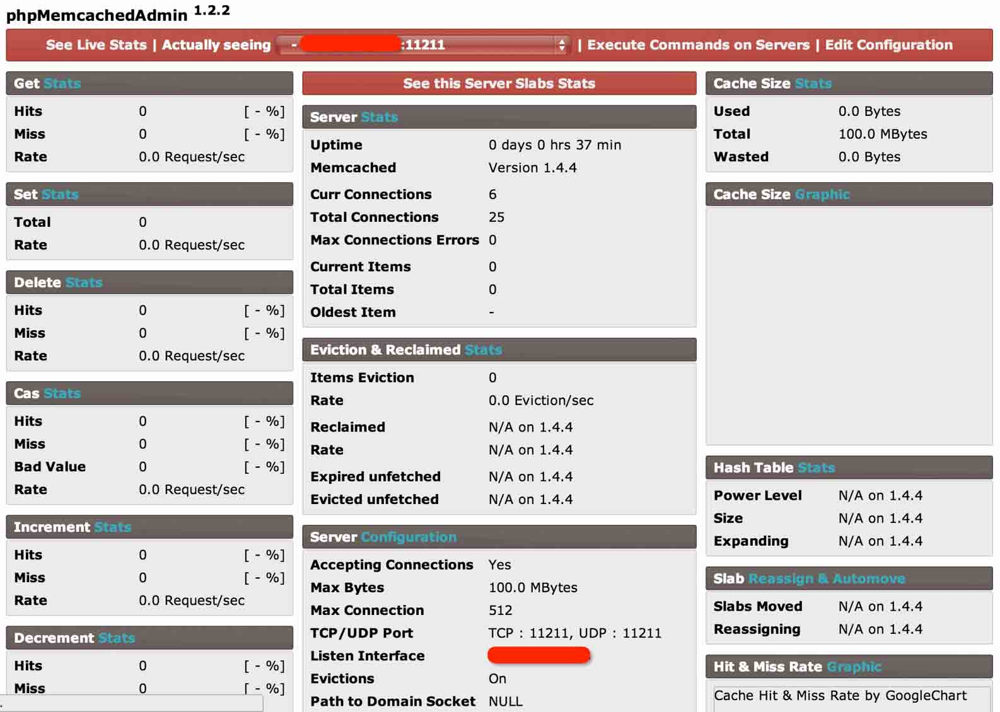
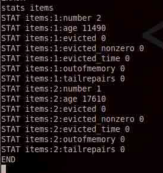
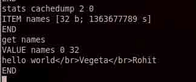

# Memcache 安全配置

2014/01/20 17:59 | [瞌睡龙](http://drops.wooyun.org/author/瞌睡龙 "由 瞌睡龙 发布") | [漏洞分析](http://drops.wooyun.org/category/papers "查看 漏洞分析 中的全部文章"), [运维安全](http://drops.wooyun.org/category/%e8%bf%90%e7%bb%b4%e5%ae%89%e5%85%a8 "查看 运维安全 中的全部文章") | 占个座先 | 捐赠作者

## 0x00 Memcache 简介

* * *

Memcache 是一个高性能的分布式的内存对象缓存系统，通过在内存里维护一个统一的巨大的 hash 表，它能够用来存储各种格式的数据，包括图像、视频、文件以及数据库检索的结果等。简单的说就是将数据调用到内存中，然后从内存中读取，从而大大提高读取速度。

Memcache 是 danga 的一个项目，最早是 LiveJournal 服务的，最初为了加速 LiveJournal 访问速度而开发的，后来被很多大型的网站采用。

Memcached 是以守护程序方式运行于一个或多个服务器中，随时会接收客户端的连接和操作。

## 0x01 搭建 Memcache 服务

* * *

```
yum install memcached 
```

安装 memcache 服务端

```
yum -y install php-pecl-memcache 
```

安装 php 扩展操作 memcache

```
php -m | grep memcache 
```

查看 php 扩展是否安装成功

```
memcached -d -m 100 -u root -l x.x.x.x -p 11211 -c 512 -P /tmp/memcached.pid 
```

参数说明：

```
-d 选项是启动一个守护进程；
-m 是分配给 Memcache 使用的内存数量，单位是 MB，我这里是 100MB；
-u 是运行 Memcache 的用户，我这里是 root；
-l 是监听的服务器 IP 地址我这里指定了服务器的 IP 地址 x.x.x.x；
-p 是设置 Memcache 监听的端口，我这里设置了 11211，最好是 1024 以上的端口；
-c 选项是最大运行的并发连接数，默认是 1024，我这里设置了 512，按照你服务器的负载量来设定；
-P 是设置保存 Memcache 的 pid 文件，我这里是保存在 /tmp/memcached.pid； 
```

想要结束 memcache 进程

```
kill `cat /tmp/memcached.pid` 
```

设置开机启动

```
chkconfig memcached on 
```

phpMemcachedAdmin 图形化界面，操作 memcache，类似 phpmyadmin

[`blog.elijaa.org/index.php?pages/phpMemcachedAdmin-Installation-Guide`](http://blog.elijaa.org/index.php?pages/phpMemcachedAdmin-Installation-Guide)

最新版默认界面



Execute Commands on Servers 那里可以执行命令。

当然了用 telnet 其实是一样的。

## 0x02 memcache 匿名访问危害

* * *

在乌云提交的漏洞当中，有很多因为 memecache 限制不严格，导致信息泄露的问题：

[WooYun: memcached 未作 IP 限制导致缓存数据可被攻击者控制](http://www.wooyun.org/bugs/wooyun-2010-0790)

[WooYun: 通过 Memcache 缓存直接获取某物流网用户密码等敏感数据](http://www.wooyun.org/bugs/wooyun-2013-037301)

[WooYun: 56.com memcached 端口可以远程使用](http://www.wooyun.org/bugs/wooyun-2013-023891)

从 memcache 中获取信息通常是先查看 items 信息：

stats items



```
stats cachedump <item: id> <返回结果数量,0 代表返回全部> 
```



除了查看信息，通用可以修改删除信息。

phpMemcachedAdmin 执行命令那里也有个可以搜索 key 的脚本，并且支持正则匹配。

## 0x03 查找可匿名访问 memcache 的方式

* * *

memcache 默认是 11211 端口，可使用 nmap 扫描有开 11211 端口的服务器。

```
nmap -n --open -p 11211 X.X.X.X/24 
```

然后 telnet 上，执行下

```
stats items 
```

看看是否有返回结果。

## 0x04 安全配置

* * *

Memcache 服务器端都是直接通过客户端连接后直接操作，没有任何的验证过程，这样如果服务器是直接暴露在互联网上的话是比较危险，轻则数据泄露被其他无关人员查看，重则服务器被入侵，因为 Mecache 是以 root 权限运行的，况且里面可能存在一些我们未知的 bug 或者是缓冲区溢出的情况，这些都是我们未知的，所以危险性是可以预见的。

### 内网访问

最好把两台服务器之间的访问是内网形态的，一般是 Web 服务器跟 Memcache 服务器之间。普遍的服务器都是有两块网卡，一块指向互联网，一块指向内网，那么就让 Web 服务器通过内网的网卡来访问 Memcache 服务器，我们 Memcache 的服务器上启动的时候就监听内网的 IP 地址和端口，内网间的访问能够有效阻止其他非法的访问。

```
# memcached -d -m 1024 -u root -l 192.168.0.200 -p 11211 -c 1024 -P /tmp/memcached.pid 
```

Memcache 服务器端设置监听通过内网的 192.168.0.200 的 ip 的 11211 端口，占用 1024MB 内存，并且允许最大 1024 个并发连接

### 设置防火墙

防火墙是简单有效的方式，如果却是两台服务器都是挂在网的，并且需要通过外网 IP 来访问 Memcache 的话，那么可以考虑使用防火墙或者代理程序来过滤非法访问。 一般我们在 Linux 下可以使用 iptables 或者 FreeBSD 下的 ipfw 来指定一些规则防止一些非法的访问，比如我们可以设置只允许我们的 Web 服务器来访问我们 Memcache 服务器，同时阻止其他的访问。

```
# iptables -F
# iptables -P INPUT DROP
# iptables -A INPUT -p tcp -s 192.168.0.2 --dport 11211 -j ACCEPT
# iptables -A INPUT -p udp -s 192.168.0.2 --dport 11211 -j ACCEPT 
```

上面的 iptables 规则就是只允许 192.168.0.2 这台 Web 服务器对 Memcache 服务器的访问，能够有效的阻止一些非法访问，相应的也可以增加一些其他的规则来加强安全性，这个可以根据自己的需要来做。

版权声明：未经授权禁止转载 [瞌睡龙](http://drops.wooyun.org/author/瞌睡龙 "由 瞌睡龙 发布")@[乌云知识库](http://drops.wooyun.org)

分享到：碎银子打赏，作者好攒钱娶媳妇：


### 相关日志

*   [Rsync 安全配置](http://drops.wooyun.org/papers/161)
*   [SVN 安装配置及安全注意事项](http://drops.wooyun.org/tips/352)
*   [闲扯下午引爆乌云社区“盗窃”乌云币事件](http://drops.wooyun.org/papers/382)
*   [Openssl 多个安全补丁简易分析危害及修复方案](http://drops.wooyun.org/papers/2185)
*   [Kippo 蜜罐指南](http://drops.wooyun.org/papers/4578)
*   [OGNL 设计及使用不当造成的远程代码执行漏洞](http://drops.wooyun.org/papers/340)