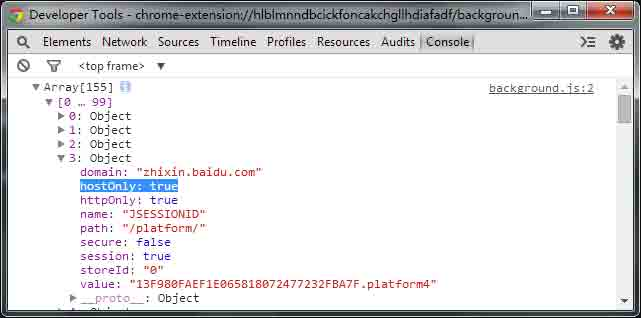
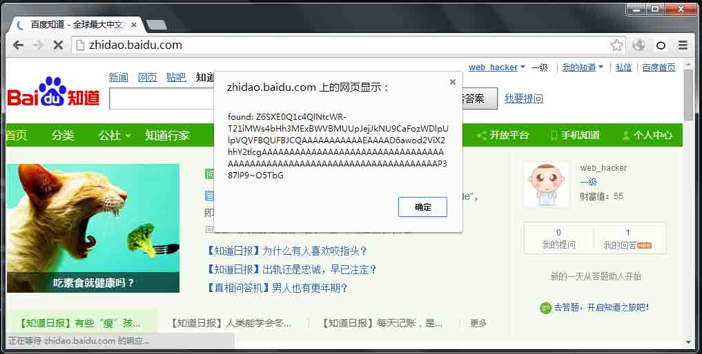
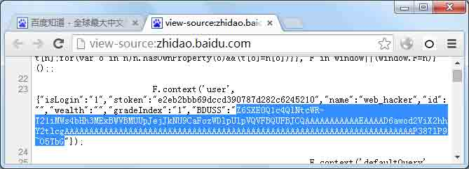
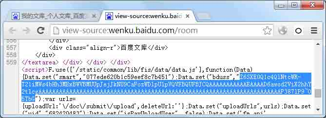
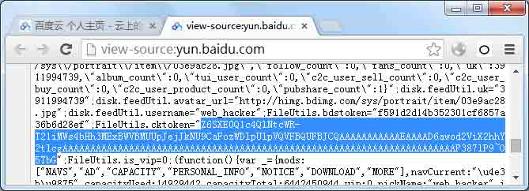
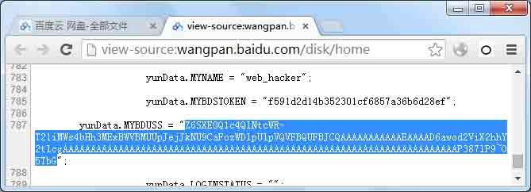
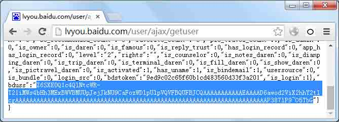
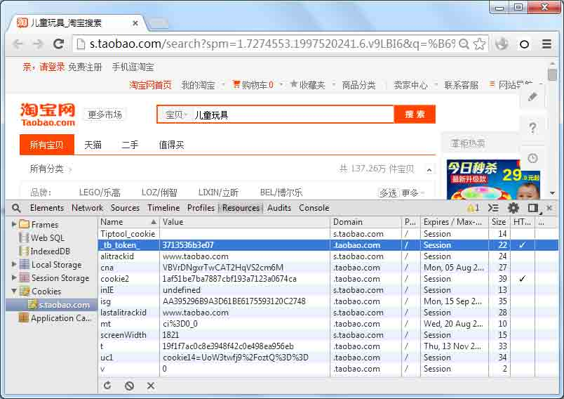
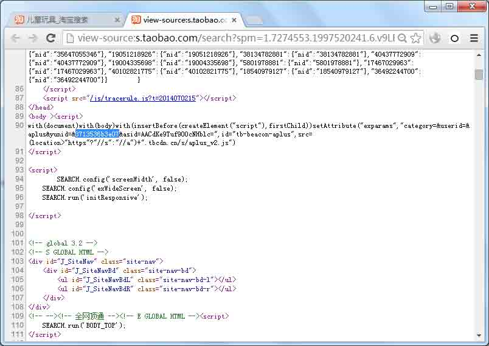

# HttpOnly 隐私嗅探器

2014/08/19 11:29 | [EtherDream](http://drops.wooyun.org/author/EtherDream "由 EtherDream 发布") | [web 安全](http://drops.wooyun.org/category/web "查看 web 安全 中的全部文章"), [技术分享](http://drops.wooyun.org/category/tips "查看 技术分享 中的全部文章") | 占个座先 | 捐赠作者

## 0x00 前言

* * *

终于赶上个想写点东西的日子，原本打算继续更新那拖了好久的流量劫持系列的博客和工具。不过中午闲来无事去乌云逛了圈，发现百度的漏洞又双叒叕上头条了！而且还是那个 BDUSS 泄露的问题，记不得这已经是第几回了。尽管这事和咱没啥关系，但本着拯救世界和平的目的，还是打算去研究下：）

既然是 cookie 泄露，无非就两种。要么就是硬伤，例如之前 Apache 就会因为太多的请求头，导致 HttpOnly 也被输出到错误页里，当然这种严重的漏洞，随着补丁的更新很快就能解决；另一个当然就是内伤，由于程序猿的粗心大意，把重要的数据不加掩盖就放到页面里了。

前者很好解决，把在线的服务器都扫描一遍，修复一个就少一个。而后者就不那么容易了，产品经常更新迭代，谁也不能保证每次升级之后是否出现新的隐患。

既然找不到一劳永逸的方案，不如就用最简单最原始的土办法 —— 暴力穷举：把网页一个个抓回来，看看里面是否出现隐私数据了。当然你会说这也太挫太低效了，不过事实上这种方案还是有意义的，至少能很快的找出一些明显的问题。而且在此基础上，我们还可以再做优化和改进，让它变得更完善。

说到抓网页，大家总是先想到蜘蛛。虽然全自动化的流程是我们的终极目标，但在目前遐想阶段，就开始搞这么复杂的一套系统，还是不合适。而且如今遍地都是 AJAX 的交互网页，蜘蛛也很难爬到一些动态数据。

所以，不如先从最简单的开始：Chrome 插件。在我们平时看网页的时候，同时对页面进行分析。这样既节省了蜘蛛服务，而且还充分利用了真实的用户行为，覆盖到更多的动态交互内容。

## 0x01 获取隐私数据

* * *

使用 Chrome 插件来实现这个基本功能，是非常简单的。只要得到了带 HttpOnly 的 cookie 值，在浏览页面时扫描下 HTML 字符就可以了。

首先得获取浏览器的 cookie 数据库，得到我们想要的。例如，我们获取所有百度域下的 cookie：

```
chrome.cookies.getAll({domain: 'baidu.com'}, function(cookies) {
    console.dir(cookies);
});

```



稍加过滤即可获得 HttpOnly 的数据。

详细 API 可以[参考这里](https://developer.chrome.com/extensions/cookies)。关于 Chrome 插件开发这里就不详细介绍了。

值得注意的是，有些 cookie 值很简单，例如 1、true、ok 之类的；或者很常见，例如用户名、日期数字等，这些都得排除掉，否则会有太多的匹配。

## 0x02 扫描页面内容

* * *

有了关键字列表，我们就可以对页面内容做分析了。

我们新建一个 content 脚本，向 background 脚本获取列表。之后在页面的 DOMContentLoaded 事件里，即可对文档的 HTML 进行关键字扫描了：

```
// content.js
chrome.extension.sendRequest('GET_LIST', function(list) {

    window.addEventListener('DOMContentLoaded', function() {
        var html = document.documentElement.outerHTML;

        list.forEach(function(item) {
            if (html.indexOf(item) >= 0) {
                alert('found: ' + item);
            }
        });
    });
});

// background.js
chrome.extension.onRequest.addListener(function(message, sender, sendResponse) {
    if (message == 'GET_LIST') {
        sendResponse(list);
    }
});

```

到此，一个最简易的隐私嗅探器完成了。我们马上就来试验下，看看是否有效果。

先试试百度首页上的几个产品。不到 10 秒钟，就逮到了一个：



打开源文件一搜，果然看见了传说中带 HttpOnly 的 BDUSS：



赶紧测试其他页面。开始的几分钟时间里，不断发现新的泄漏点：







。。。

不过十分钟后，出现的越来越少了。我们是不是漏了些什么东西？

## 0x03 扩大扫描范围

* * *

显然，如果只扫描 HTML 内容，这和爬虫有什么区别？

我们之所以做成浏览器插件，就是为了能得到真实的用户行为操作。要是放弃了那些通过交互产生的动态数据，意义就大幅下降了。

遗憾的是，Chrome API 里并没有获得网络数据的接口。即使是 HTML，我们也是通过 

 元素的 outerHTML 勉强得到的。

不过对于 AJAX 这类请求，我们有很简单的解决方案：钩子程序。

我们向页面中里注入一段脚本，覆盖原生 XMLHttpRequest 的方法，即可监控动态的数据了：

```
var _xhr_open = XMLHttpRequest.prototype.open;

function handlerXhrReady() {
    check(this.responseText, 'XHR: ' + this._url);
}

XMLHttpRequest.prototype.open = function(method, url) {
    if (!this._url) {
        this._url = url;
        this.addEventListener('readystatechange', handlerXhrReady);
    }
    _xhr_open.apply(this, arguments);
};

```

当页面使用 AJAX 加载数据时，我们即可监控其中的数据了。

类似的，我们还可以跟踪 URL 的变化，监控 HttpOnly 的数据有没有输出到地址栏里：

```
var address = location.href;

window.addEventListener('hashchange', function(e) {
    check(location.hash, 'location.hash');
});

var _pushState = History.prototype.pushState,
    _replaceState = History.prototype.replaceState;

History.prototype.pushState = function(data, title, url) {
    check(url, 'pushState');
    _pushState.apply(this, arguments);
};

History.prototype.replaceState = function(data, title, url) {
    check(url, 'replaceState');
    _replaceState.apply(this, arguments);
};

function scanAddress() {
    check(location.href, 'location.href');
}

```

对于这些调用 DOM API 的接口，我们都可以通过事件监听，或者钩子程序进行捕捉。

我们再来测试下，很快就发现刚才遗漏的一例：



对于其他网站，同样也存在这类问题：





多的不计其数。。。

由于 Chrome 插件以及 DOM 规范的限制，另一种常见的内容仍无法轻易获取，那就是 JSONP 脚本。外链脚本的 text 内容是无法获得的，而且使用 JSONP 大多是为了跨域，因此通过 xhr 去代理自然不可行。如果使用纯前端解决这个问题的话，可以尝试分析 JSONP 的回调接口，并勾住它。

## 0x04 更智能的分析

* * *

到目前为止，我们只是用最简单的字符串匹配，来检验是否泄露。现实中，泄露点的字符稍有转义，我们就无法识别了。因此，我们需要更智能的匹配算法。

例如某个 HttpOnly 的值为 hello|1234567，现实中很有可能是以 hello%7C1234567 的形式存在的。脚本转义、URL 转义、HTML 实体转义...所以无论在哪，符号往往是不靠谱的，但字母和数字则相对稳定的多。

因此，我们可以提取数据中的字符数字(\w) 部分，作为扫描项。隐私数据虽然很长，但大多都是冗余的，因此提取其中部分作为特征，仍然不会有错失。

即使有少量误报，也没什么事。宁可误报，也不漏报。

除了转义，还有可能将隐私数据经过简单的编码之后输出了，例如 Base64。这些弱算法可以轻易还原出原始数据，但通常很难发现。

因此，我们可以将所有的数据，事先做一些简单的算法，同时将它们也作为检测目标，这样就能更深层次的挖掘泄漏点了。

## 0x05 深度嗅探

* * *

事实上，除了 HttpOnly 的 cookie，我们还可以将其他数据也作为侦测目标。

我们可以创建一个测试账号，将其手机号，密码，身份证等各种私密信息都作为待检测的隐私数据，这样就能全方位的分析出，哪些信息遭到了泄露。

例如，曾经有网站为了偷懒，将找回密码的答案直接输出到了页面脚本变量里，而不是在后端判断。这时，我们就能很快追踪到泄漏点。

版权声明：未经授权禁止转载 [EtherDream](http://drops.wooyun.org/author/EtherDream "由 EtherDream 发布")@[乌云知识库](http://drops.wooyun.org)

分享到：

### 相关日志

*   [CVE-2012-0053 详解](http://drops.wooyun.org/papers/501)
*   [SCTF-WriteUp](http://drops.wooyun.org/tips/4243)
*   [Browser Security-css、javascript](http://drops.wooyun.org/tips/150)
*   [[XSS 神器]XssEncode chrome 插件 – 0x_Jin](http://drops.wooyun.org/tools/738)
*   [SSLStrip 的未来 —— HTTPS 前端劫持](http://drops.wooyun.org/tips/3199)
*   [利用 CSP 探测网站登陆状态（alipay/baidu 为例）](http://drops.wooyun.org/tips/4482)

上一篇:[逆向基础（十一）](http://drops.wooyun.org/tips/2812)下一篇:[短域名进化史](http://drops.wooyun.org/tips/2839)

### 楼被抢了 13 层了... 抢座、[Rss 2.0](http://drops.wooyun.org/tips/2834/feed)或者 [Trackback](http://drops.wooyun.org/tips/2834/trackback)

*    玉林嘎 | 2014/08/19 12:48 | # 

    感觉很牛逼的样子

    回复该留言
*    [0x_Jin](http://xss1.com) | 2014/08/19 16:37 | # 

    洞主 写成插件吧，貌似 chrome 得开发版 才有 getAll ?

    回复该留言
*    zj1244 | 2014/08/19 19:00 | # 

    不错的想法，赞

    回复该留言
*    [小森森](http://www.senorsen.com) | 2014/08/19 20:35 | # 

    想法不错，写好插件然后随便上网就能找 cookie 泄露了。。

    回复该留言
*    xsser | 2014/08/20 09:06 | # 

    我擦啊我擦啊 太多猪一样队友了

    回复该留言
*    ceason | 2014/08/20 10:34 | # 

    赞一个

    回复该留言
*    latershow | 2014/08/21 14:35 | # 

    原来度娘可以被如此 N 连插

    回复该留言
*    pangshenjie | 2014/08/21 20:35 | # 

    楼主这么屌，厂长知道么

    回复该留言
*    phithon | 2014/08/24 22:11 | # 

    好思路啊！！！

    回复该留言
*    aNsSe | 2014/08/26 21:47 | # 

    让我学到了很多

    回复该留言
*    SarahCla | 2014/09/04 14:42 | # 

    ：）能共享一下源码吗？谢谢。

    回复该留言
*    withdrawn | 2014/09/12 14:04 | # 

    我在 content.js 里
    XMLHttpRequest.prototype.open=null;
    alert(XMLHttpRequest.prototype.open);
    弹出的是 null 但回到页面里的 XMLHttpRequest.prototype.open 还是没变？

    回复该留言
    *    EtherDream | 2014/09/16 15:09 | # 

        绕开 chrome 的 sandbox，注入代码到页面运行。

        function page_module() {
        //....
        }
        var spt = document.createElement('script');
        spt.innerHTML = '(' + page_module + ')()';
        document.documentElement.appendChild(spt);

        回复该留言

### 发表评论

点击这里取消回复。<textarea name="comment" cols="50" rows="8" id="comment" tabindex="4"></div> <div class="calibre48"> <input name="captcha" type="text" id="captcha" value="" class="textfield"/>  <label for="comment">验证码*</label> </div> <p class="calibre8"><input name="submit" type="submit" id="submit" tabindex="5" value="发表评论[Ctrl+Enter]"/> <input name="comment_post_ID" type="hidden" id="comment_post_ID" value="2834"/> <input name="comment_parent" type="hidden" id="comment_parent" value="0"/> </p> <p class="calibre50"><input name="akismet_comment_nonce" type="hidden" id="akismet_comment_nonce" value="902aba6349"/></p> </div> </div> </div> <div id="sidebar" class="calibre5"> <div class="calibre5"> <h3 class="calibre15 sigil_not_in_toc">公告</h3> <div class="calibre5"><span class="calibre13">召唤时事热点以及目前知识库略缺的内容。</span><br class="calibre5"/> 议题召唤中的内容：<br class="calibre5"/><br class="calibre5"/> 1\. 最新的事件分析和安全预警<br class="calibre5"/> 2\. 乌云主站漏洞总结<br class="calibre5"/> 3\. 业内前沿最新技术<br class="calibre5"/><br class="calibre5"/> 如果你觉得有更好的议题方向<br class="calibre5"/> 可以直接 <a href="http://drops.wooyun.org/newsend">投稿</a> 或者发邮件到 drops@wooyun.org</div> </div> <div class="calibre5"> <h3 class="calibre15 sigil_not_in_toc">订阅更新</h3> <ul class="calibre_feed_list"> <li class="calibre4"> <a title="点击订阅" href="../..//feed"></a> <a title="一键订阅到深蓝阅读" target="_blank" href="http://bluereader.org/?do=add&url=drops.wooyun.org/feed"></a> </li> </ul> </div> <div class="calibre5"> <h3 class="calibre15 sigil_not_in_toc">分类</h3> <ul class="calibre_feed_list"> <li class="calibre4"><a title="漏洞分析" href="http://drops.wooyun.org/category/papers">漏洞分析</a> (157) </li> <li class="calibre4"><a title="技术分享" href="http://drops.wooyun.org/category/tips">技术分享</a> (261) </li> <li class="calibre4"><a title="工具收集" href="http://drops.wooyun.org/category/tools">工具收集</a> (28) </li> <li class="calibre4"><a title="业界资讯" href="http://drops.wooyun.org/category/news">业界资讯</a> (27) </li> <li class="calibre4"><a title="查看 运维安全 下的所有文章" href="http://drops.wooyun.org/category/%e8%bf%90%e7%bb%b4%e5%ae%89%e5%85%a8">运维安全</a> (63) </li> <li class="calibre4"><a title="查看 web 安全 下的所有文章" href="http://drops.wooyun.org/category/web">web 安全</a> (122) </li> <li class="calibre4"><a title="查看 渗透案例 下的所有文章" href="http://drops.wooyun.org/category/pentesting">渗透案例</a> (5) </li> <li class="calibre4"><a title="查看 移动安全 下的所有文章" href="http://drops.wooyun.org/category/mobile">移动安全</a> (25) </li> <li class="calibre4"><a title="查看 无线安全 下的所有文章" href="http://drops.wooyun.org/category/wireless">无线安全</a> (6) </li> <li class="calibre4"><a title="查看 数据库安全 下的所有文章" href="http://drops.wooyun.org/category/database">数据库安全</a> (3) </li> <li class="calibre4"><a title="查看 二进制安全 下的所有文章" href="http://drops.wooyun.org/category/binary">二进制安全</a> (34) </li> </ul> </div> <div class="calibre5"> <h3 class="calibre15 sigil_not_in_toc">最新日志</h3> <ul class="calibre_feed_list"> <li class="calibre4"><a title="隐写术总结" href="http://drops.wooyun.org/tips/4862">隐写术总结</a></li> <li class="calibre4"><a title="PHP 中的内存破坏漏洞利用（CVE-2014-8142 和 CVE-2015-0231）（连载之第一篇）" href="http://drops.wooyun.org/papers/4864">PHP 中的内存破坏漏洞利用（CVE-2014-8142 和 CVE-2015-0231）（连载之第一篇）</a></li> <li class="calibre4"><a title="Exploiting “BadIRET” vulnerability (CVE-2014-9322, Linux kernel privilege escalation)" href="http://drops.wooyun.org/papers/4860">Exploiting “BadIRET” vulnerability (CVE-2014-9322, Linux kernel privilege escalation)</a></li> <li class="calibre4"><a title="显示每个 CPU 的 IDT 信息" href="http://drops.wooyun.org/tips/4854">显示每个 CPU 的 IDT 信息</a></li> <li class="calibre4"><a title="深入分析 Fiesta Exploit Kit" href="http://drops.wooyun.org/tips/4858">深入分析 Fiesta Exploit Kit</a></li> <li class="calibre4"><a title="Win10 安全特性之执行流保护" href="http://drops.wooyun.org/tips/4839">Win10 安全特性之执行流保护</a></li> <li class="calibre4"><a title="RansomWeb:一种新兴的 web 安全威胁" href="http://drops.wooyun.org/papers/4834">RansomWeb:一种新兴的 web 安全威胁</a></li> <li class="calibre4"><a title="由 Ghost 漏洞引发的“血案”" href="http://drops.wooyun.org/papers/4823">由 Ghost 漏洞引发的“血案”</a></li> <li class="calibre4"><a title="理解 php 对象注入" href="http://drops.wooyun.org/papers/4820">理解 php 对象注入</a></li> <li class="calibre4"><a title="使用 sqlmap 中 tamper 脚本绕过 waf" href="http://drops.wooyun.org/tools/4760">使用 sqlmap 中 tamper 脚本绕过 waf</a></li> </ul> </div> <div class="calibre5"> <h3 class="calibre15 sigil_not_in_toc">最新评论</h3> <ul class="calibre_feed_list"><li class="calibre4"><span>正在加载...</span></li> <li id="rc-comment-temp" class="calibre4"><div class="calibre5"/><div class="calibre5"/><div class="calibre5"/></li> <li id="rc-ping-temp" class="calibre4"><span/></li> </ul> </div> </div> <div id="footer" class="calibre5"> Powered by <a href="http://wordpress.org/">WordPress</a> | GZai Theme by <a title="GZai Theme produced by 鬼仔" href="http://huaidan.org/">鬼仔</a> </div> <div class="calibre47"> </div> </body></html></textarea>