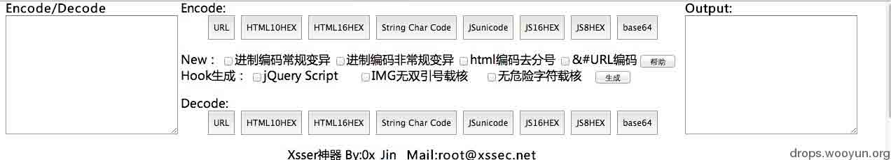
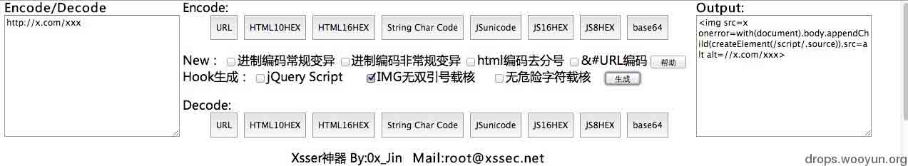

# [XSS 神器]XssEncode chrome 插件 - 0x_Jin

2013/11/15 16:44 | [0x_Jin](http://drops.wooyun.org/author/0x_Jin "由 0x_Jin 发布") | [web 安全](http://drops.wooyun.org/category/web "查看 web 安全 中的全部文章"), [工具收集](http://drops.wooyun.org/category/tools "查看 工具收集 中的全部文章") | 占个座先 | 捐赠作者

## 0x00 闲扯

* * *

好吧继上一篇文章之后，就没发文章了！(其实是一直在写但是写的很少还凑不起一篇文章而已)

但是这几天对插件进行了一定的改良了 因为在自己在实际的 XSS 过程中也发现了自己的插件 还不够强大！

不能够百分之百的满足自己的需求！所以就根据自己平常的需求给加了上去！

我想做到玩 XSS 一个工具即可解决需求！所以感觉即使是现在的插件也还有很大的不足！

所以很希望得到你们的意见 东凑一块 西凑一块写成一个真正的一个插件解决需求！

(现在想给 hook 生成功能块加一个 是否自动把 hook 转换成短链接！但是。。。在技术上有点问题)

另外还有什么其他的功能 或者一些比较猥琐的小技巧 希望大家提出来 我加上。。。

比如在 chrome 里隐藏 payload 。。。我一直在想如何才能构造一段被 chrome 认为是无效的字符。。并且还能够执行！

## 0x01 界面以及功能介绍

* * *

**兼容性没做所以在不同的分辨率下会乱码。。。这个不会做**

**分辨率：1280 X 800  (求教)**



### 编码

请把需要编码的字符放在左边的输入框内 Encode / Decode 

然后点击中间上方的 Encode 按钮 选择你要编码的类型 然后点击相应的按钮即可！

经过相应编码后的内容便会在右边的 Output 框中！

### 新功能介绍

进制编码常规变异：

进制编码包括：

```
html 编码的十进制编码
html 编码的十六进制编码
javascript 的十六进制编码
javascript 的八进制编码 
```

### 进制编码常规变异的功能：

会给编码前面的数字多加 7 个 0，因为 IE 对进制编码加 0，只识别到八个 0，多了的话就认为这不是个有效的值了！

也有很多程序过滤规则也是这样写的！他们会把你变异了的值给解析回来，然后再判断是不是危险字符！

### 适用场景：

当进制编码被解析回来，再次过滤了的时候，比如 &#60 在过滤程序中被还原回来再次过滤了！

但是&#0060 没有在过滤程序中被还原回来，但是在页面中被浏览器被解析还原了，那么就可以用进制编码的常规变异！

### 进制编码非常规变异：

进制编码非常规变异功能：

会给编码的数字前面多加 10 个 0！原因同上！

适用场景：

当进制编码被解析回来，再次过滤了的时候，比如 &#60 或者 &#000000060 都被还原回来，再次过滤的话，那么便可以用非常规变异！

IE 识别到 8 个 0 可是 chrome 能识别到更多的 0！很多过滤程序都是根据 IE 的 8 个 0 来写的！所以更多的 0 也是一种绕过方式！

使用心得：以上的功能都是自己亲身经历到的 当时是某 GOV 的站 在这里贴出 payload 吧 以及笔记

```
search?str=xxxx%3Ca%20href=%22data:text/html;%26%230000000000000000098ase64%26%230000000000000044%20PGltZyBzcmM9eCBvbmVycm9yPWFsZXJ0KDEpPg==%22%3Etest%3C/a%3E 
```

缺陷参数：str

过滤规则够 BT 但是同样能绕！

会把提交的编码 给解码 然后再插入到网页中！然后再对网页内的值进行检查 过滤！

base64 --> %26%230000000000000000098ase64

首先%26%23 会被还原成 &#  于是变成了： &#00000000098 于是被还原成：b
b 插入到页面 再检查 b+ase64  = base64 满足规则  于是又过滤成 ba<x>se64  绕过失败！</x>

但是如果 b 的 html 十进制编码 再多加几个 000  便不会被他给解码  但是在浏览器中又会被解码 于是便可以这样绕过！

### html 编码去分号：

(此选项可配合其他选项一起使用 比如进行 html 编码时 勾选常规变异 + 去 html 编码分号)

ps:小伙伴们勿淘气别选了 常规变异 又勾选非常规变异。。。 那你到底是要闹哪样！

还有勾选编码时  也勾选了 hook 生成的话 那么我不知道你要闹那样。。

如果要对生成的钩子进行编码的话 那么就弄两次吧 一次：生成 复制 ，二次： 粘贴 编码！

## 使用场景：

html 实体编码的分号在大部分情况下都是可以去掉的 能减少输入字符！我有强迫症。。 

我一般选择 html 实体编码的时候 都会必勾选！

## &#URL 编码：

这个对我来说真的是经常用到！比如在测试反射型 XSS 以及 DOM XSS 时！

因为&#在 url 中都有特殊的含义 我们很多时候都是把他们当做一个 html 实体编码表示的方式而已！

可是浏览器不会这样认为，& 会被认为是参数的分隔符 比如一个 url:

```
http://xssec.net/?x=1&c=2&d=4 
```

如果我们在 url 上写&号是会被当成参数分隔符的 进行一下 url 编码就号了！

#号呢，就是 location.hash 获取的值以及什么的 所以这种字符还是 url 编码的好~

比如以下这个 payload:

```
search.php?searchfield=xsser%c0\%22%20onfocus=%26%2397%26%23108%26%23101%26%23114%26%23116%26%2340%26%2347%26%2374%26%23105%26%23110%26%2347%26%2341%20autofocus//&imageField=%CB%D1%CB%F7 
```

大家还原下编码就能看到原本的字符了！

Hook 生成

基本介绍 ：把你的钩子(hook)放入到左边的 Encode 里 然后勾选你要进行生成的 hook 类型！然后点后面的生成就好了！

每次请选择一种，别淘气 我没写太多的判断 js。。。 精力有限！

下面贴几个演示吧：



在钩子生成方面做的不是特别好，也是自己经验不足的原因 大家有更猥琐的 加载钩子的 payload 求 pm 加上去！

下载链接：

[xss-encode_20131115121612.crx_.zip](http://static.wooyun.org/20141017/2014101711311922017.zip)

联系方式：

mail:root@xssec.net

http://t.qq.com/Ox_Jin

版权声明：未经授权禁止转载 [0x_Jin](http://drops.wooyun.org/author/0x_Jin "由 0x_Jin 发布")@[乌云知识库](http://drops.wooyun.org)

分享到：

### 相关日志

*   [无声杯 xss 挑战赛 writeup](http://drops.wooyun.org/tips/2671)
*   [HttpOnly 隐私嗅探器](http://drops.wooyun.org/tips/2834)
*   [XSS 与字符编码的那些事儿 —科普文](http://drops.wooyun.org/tips/689)
*   [Web 前端攻防](http://drops.wooyun.org/tips/2686)
*   [InsightScan:Python 多线程 Ping/端口扫描 + HTTP 服务/APP 探测，可生成 Hydra 用的 IP 列表](http://drops.wooyun.org/tools/427)
*   [一种自动化检测 Flash 中 XSS 方法的探讨](http://drops.wooyun.org/tips/1985)