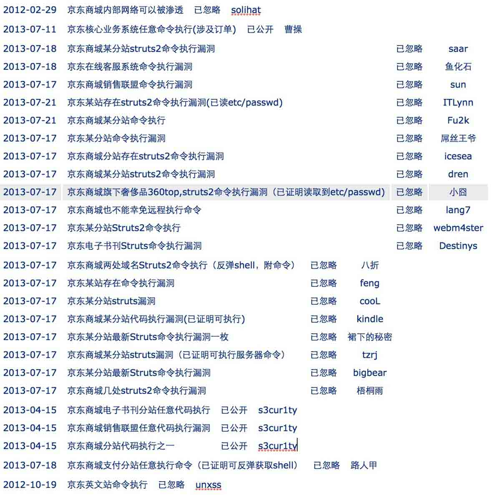

# 电商网站的安全性

2013/11/19 14:19 | [瞌睡龙](http://drops.wooyun.org/author/瞌睡龙 "由 瞌睡龙 发布") | [漏洞分析](http://drops.wooyun.org/category/papers "查看 漏洞分析 中的全部文章"), [运维安全](http://drops.wooyun.org/category/%e8%bf%90%e7%bb%b4%e5%ae%89%e5%85%a8 "查看 运维安全 中的全部文章") | 占个座先 | 捐赠作者

## 0x00 背景

* * *

电商网站由于是直接涉及到金钱的交易，对其本身的安全性要求很高。

这样才能保证普通网民在其网站做金钱交易的时候，不会发生安全问题。

双 11 刚过，看着那一个一个突破以往的数字，让人惊叹网购的力量。

但是这背后，可能存在哪些安全性的问题呢？

普通网民在网购的时候应该注意些什么呢？

从国业内影响力最大的漏洞报告平台 wooyun 上来看一下吧（拿淘宝，京东，苏宁做例子做个统计。）。

## 0x01 细节

* * *

### 淘宝

淘宝号称亚洲最大、最安全的网上交易平台。

双 11 最耀眼的网购平台，taobao 在 wooyun 上被提交的漏洞，在电商上算得上是最多的。

或许是树大招风吧，对其感兴趣的白帽子也很多，所以导致平台上 taobao 的漏洞多于其他电商。

但是国内电商平台本身的安全性来讲，我相信淘宝其平台本身肯定是最好的。

来看一下淘宝网的漏洞统计：

#### xss 漏洞

关于 xss 漏洞是指攻击者可在对方网站插入自己可供的一段 js 代码，从而控制浏览者的浏览器的部分权限。

xss 的危害通常在 sns 社区中显现出来，有人会拿来做恶作剧、做蠕虫，对用户形成骚扰，产生垃圾信息。

有人会拿来诱惑用户点击攻击链接，从而盗取用户身份。

在网购平台上来讲，最大的利用当属钓鱼购物，这种可以直接转化为利益的攻击方式：

从 wooyun 上的一个案例中可窥探一下针对 taobao 做黑产的一角：

[WooYun: Taobao 站内有 Xss 蠕虫蔓延](http://www.wooyun.org/bugs/wooyun-2010-01003)

几个含金量很高的 xss 技巧：

[WooYun: 淘宝网 utf-7 代码注入跨站漏洞](http://www.wooyun.org/bugs/wooyun-2011-01608)

[WooYun: 淘宝网 COOKIES 盗取[flash 编程安全+apache http-only cookie 泄漏利用]](http://www.wooyun.org/bugs/wooyun-2012-07085)

[WooYun: 淘宝主域名下多处 Dom XSS](http://www.wooyun.org/bugs/wooyun-2013-019556)

[WooYun: 一个 flash 的 0day 导致的淘宝网存储 xss 【续集】](http://www.wooyun.org/bugs/wooyun-2013-040838)

#### url 跳转

url 跳转漏洞的介绍见此：

[`drops.wooyun.org/papers/58`](http://drops.wooyun.org/papers/58)

url 跳转同样是经常被用来钓鱼。

通过跳转绕过阿里旺旺的钓鱼网址检测系统：

[WooYun: 淘宝网钓鱼最新过旺提示（淘宝钓鱼的福音）](http://www.wooyun.org/bugs/wooyun-2012-010837)

#### 钓鱼的其他手段

在厂商已经把安全性做了很好的前提下，仍然不能保证网民一定不会被钓鱼。

下面看看一些其他的钓鱼手段：

钓鱼淘宝卖家，收集密码的后台被白帽子拿下上报 wooyun

[WooYun: 淘宝卖家遭钓鱼大量店长中招（钓鱼后台揭秘）](http://www.wooyun.org/bugs/wooyun-2013-034374)

这个 style 使用的让人眼前一亮：

[WooYun: 淘宝网一处另类钓鱼](http://www.wooyun.org/bugs/wooyun-2011-01261)

#### 程序设计缺陷

[WooYun: 淘宝第三方应用权限验证错误(可修改 19.8 万店铺任意宝贝标题)](http://www.wooyun.org/bugs/wooyun-2013-037073)

[WooYun: 来往导致淘宝账号可被破解波及余额宝支付宝](http://www.wooyun.org/bugs/wooyun-2013-041388)

[WooYun: 天猫积分支付缺乏二次验证（本人已被盗）](http://www.wooyun.org/bugs/wooyun-2013-017601)

修改 ccs 样式修改商品的信息，人才啊：

[WooYun: 利用 css 淘宝网商品信息任意修改](http://www.wooyun.org/bugs/wooyun-2012-014174)

[WooYun: 手机淘宝网 session 劫持，可进一步发展为蠕虫](http://www.wooyun.org/bugs/wooyun-2012-013794)

[WooYun: 淘网址 sina oauth 认证登录漏洞](http://www.wooyun.org/bugs/wooyun-2012-011104)

这种支付的漏洞，真没想到 taobao 也会有：

[WooYun: 淘宝网某处存在严重支付漏洞](http://www.wooyun.org/bugs/wooyun-2012-07293)

[WooYun: 淘宝网，任何人可随意拿走任意店铺、任意商品信息](http://www.wooyun.org/bugs/wooyun-2012-04163)

#### 业务逻辑

[WooYun: 淘宝应用钓鱼](http://www.wooyun.org/bugs/wooyun-2012-011908)

[WooYun: 淘宝卖家 0 元加入消保，并且点亮消保图标，不用话 1000 元了](http://www.wooyun.org/bugs/wooyun-2012-06383)

[WooYun: 淘宝货到付款骗局](http://www.wooyun.org/bugs/wooyun-2011-01940)

#### 客户端问题

[WooYun: 阿里旺旺的一个远程任意代码执行漏洞（发送消息即中）](http://www.wooyun.org/bugs/wooyun-2013-033412)

[WooYun: 淘宝浏览器 3.0.2.604 修改配置可能导致本地的 DLL 注入](http://www.wooyun.org/bugs/wooyun-2013-025715)

[WooYun: 淘宝应用 iphone 设计缺陷可无限制猜试密码](http://www.wooyun.org/bugs/wooyun-2012-07876)

[WooYun: 淘宝 android 手机客户端登陆信息可被键盘记录](http://www.wooyun.org/bugs/wooyun-2011-02259)

#### 服务器配置问题

[WooYun: 淘宝网某应用 svn 信息导致代码泄露](http://www.wooyun.org/bugs/wooyun-2012-012665)

[WooYun: 淘宝某分站存在 nginx 解析漏洞](http://www.wooyun.org/bugs/wooyun-2012-05677)

[WooYun: 阿里旺旺域名列目录](http://www.wooyun.org/bugs/wooyun-2011-03801)

[WooYun: 淘宝网 dns 域传送泄露漏洞](http://www.wooyun.org/bugs/wooyun-2010-0776)

#### 信息泄露

[WooYun: 淘宝店铺匿名评论简单获得匿名买家 ID](http://www.wooyun.org/bugs/wooyun-2013-026521)

[WooYun: 淘宝 solr 暴露在外网](http://www.wooyun.org/bugs/wooyun-2013-024137)

[WooYun: 淘宝网 Minebdb 系统未做权限认证](http://www.wooyun.org/bugs/wooyun-2013-024136)

[WooYun: (新) 淘宝网成交记录用户 ID 泄露漏洞(附上扫号程序)](http://www.wooyun.org/bugs/wooyun-2012-015627)

[WooYun: 淘宝网成交记录用户 ID 泄露漏洞](http://www.wooyun.org/bugs/wooyun-2012-014004)

[WooYun: 淘宝某系统未授权访问及目录浏览](http://www.wooyun.org/bugs/wooyun-2012-09363)

[WooYun: 淘宝首页爆出绝对路径](http://www.wooyun.org/bugs/wooyun-2012-07917)

能猜到这个地址，我只想说，人才：

[WooYun: 淘宝某分站存在 cookie 泄漏问题](http://www.wooyun.org/bugs/wooyun-2012-03924)

[WooYun: 淘宝后台两枚](http://www.wooyun.org/bugs/wooyun-2012-04515)

#### web 程序其他漏洞

[WooYun: 淘测试某两处盲注](http://www.wooyun.org/bugs/wooyun-2012-07867)

[WooYun: 淘测试多处 SQL 注入及任意文件上传 BUG](http://www.wooyun.org/bugs/wooyun-2013-020575)

struts 惹的祸：

struts 这个框架近几年被爆多次远程代码执行漏洞，导致很多使用改框架的公司受害：

[WooYun: 疑似淘宝内部某业务命令执行](http://www.wooyun.org/bugs/wooyun-2012-011636)

[WooYun: 淘宝某分站最新 Struts 命令执行漏洞一枚](http://www.wooyun.org/bugs/wooyun-2013-029160)

[WooYun: 淘宝某业务存在命令执行](http://www.wooyun.org/bugs/wooyun-2013-029215)

[WooYun: 淘宝某分站最新 Struts 命令执行漏洞又一枚](http://www.wooyun.org/bugs/wooyun-2013-029312)

#### 其他

即使平台本身没有问题，也会有人做各种钓鱼的页面，采用各种手段来骗取网购用户在其制作的假网站中消费，骗取钱财。

针对 taobao 的钓鱼程序：

[WooYun: 一套淘宝钓鱼程序](http://www.wooyun.org/bugs/wooyun-2010-0938)

针对钓鱼网址 taobao 的确比较难直接将其关闭，但是也做了很多措施。

如下面白帽子提交漏洞：

[WooYun: 一套淘宝钓鱼程序](http://www.wooyun.org/bugs/wooyun-2010-0938)

下面的 taobao 厂商的回复：

```
感谢反馈。
这类问题不在淘宝控制范围内，我们没办法限制他的产生，但一直在尽力控制钓鱼链接对用户产生的危害：
1\. 我们会在旺旺聊天信息中提示风险，同时建议用户不在旺旺以外的 IM 软件中谈淘宝相关的交易。
2\. 我们会对 IM 旺旺和会员反馈进行监控，结合各类检测模型，尽量在第一时间发现新产生的钓鱼链接，在 IM 中进行封禁。
3\. 我们积极与外部厂商（浏览器、杀毒软件、安全管理软件等）合作，将钓鱼链接信息同步，起到更好的保护作用。
4\. 我们将马上上线一个钓鱼链接在线举报平台，欢迎各位积极举报。 
```

例如最近被公开很火的针对路由使用默认密码

[WooYun: 双十一淘宝论坛惊现“路由器 CSRF”恶意攻击代码（其他论坛可能一样中招）](http://www.wooyun.org/bugs/wooyun-2013-042571)

#### 淘宝总结

以上漏洞并未列出全部的漏洞，提了一些比较典型的问题。

淘宝业务较多，逻辑复杂，出现了 struts 命令执行等获得服务器的漏洞，以及泄露匿名用户信息，支付漏洞以及 xss，url 跳转可被钓鱼的漏洞等。

### 京东

京东商城-专业的数码网上购物商城

由于京东线上业务逻辑远没有淘宝那么复杂，所以漏洞总数在 wooyun 上并不如 taobao 多。

但是漏洞的严重程度，远大于 taobao。

从漏洞的忽略程度来看，京东 12 年的时候可能刚组建专门的安全团队。

对安全问题逐渐重视。

xss 也有很多，就不一一列举了

#### 安全事件

[WooYun: 360buy 京东商城内部网络被渗透](http://www.wooyun.org/bugs/wooyun-2011-03184)

#### 程序逻辑

[WooYun: 京东物流后台未授权访问可以修改收货状态（刷返券）](http://www.wooyun.org/bugs/wooyun-2013-028267)

[WooYun: 京东某系统页面未授权可查询任意订单配送状态](http://www.wooyun.org/bugs/wooyun-2013-028143)

[WooYun: 京东商城用户资料完全泄漏](http://www.wooyun.org/bugs/wooyun-2011-03789)

[WooYun: 京东商城<39 元商品不交运费](http://www.wooyun.org/bugs/wooyun-2011-03501)

#### URL 跳转

[WooYun: 京东商城跳转漏洞（严重](http://www.wooyun.org/bugs/wooyun-2011-03422)

[WooYun: 京东商城分站存在跳转漏洞](http://www.wooyun.org/bugs/wooyun-2011-03407)

#### 信息泄露

[WooYun: 京东敏感信息泄露](http://www.wooyun.org/bugs/wooyun-2011-02196)

[WooYun: 京东商城主站存在信息泄漏洞](http://www.wooyun.org/bugs/wooyun-2011-02361)

#### 客户端问题

[WooYun: 京东商城 android 客户端缺陷导致欺骗](http://www.wooyun.org/bugs/wooyun-2013-041514)

#### SQL 注入

[WooYun: 京东团购网 SQL 注射，可获取用户信息。](http://www.wooyun.org/bugs/wooyun-2011-03901)

[WooYun: 京东商场某分站 SQL 注射](http://www.wooyun.org/bugs/wooyun-2011-03298)

#### struts

京东从.net 转向 java，使用的 struts，被坑惨了：



#### 服务器配置

[WooYun: 京东奢侈品商城解析漏洞](http://www.wooyun.org/bugs/wooyun-2012-05908)

#### 逻辑问题

[WooYun: 京东某活动逻辑缺陷导致可刷京豆](http://www.wooyun.org/bugs/wooyun-2013-041321)

其实一个公司对安全的重视程度怎么样，从下面这个漏洞就可以基本看出个大概。

该漏洞详情还未完全公开，核心白帽子可以查看：

[WooYun: 大公司诟病系列#1 重置京东任意用户密码](http://www.wooyun.org/bugs/wooyun-2013-041105)

#### 京东总结

总体来说存在的安全问题大大小小也不少，但是相对于以前，已经对安全重视很多。

希望京东内部能够更加重视安全，毕竟做电商的，用户金钱有了损伤还是很严重的。

### 苏宁易购

苏宁易购，是苏宁电器集团的新一代 B2C 网上商城，于 2009 年 8 月 18 日上线试运营。2010 年 1 月 25 日，苏宁电器在南京总部宣布，公司的 B2C 网购平台“苏宁易购”将于 2 月 1 日正式上线，并将自主采购、独立运营，苏宁电器也由此正式出手电子商务 B-t-C 领域。

#### sql 注入

嗯。。。sql 注入也会有这么多：

[WooYun: 苏宁某分站存在 sql 注入漏洞](http://www.wooyun.org/bugs/wooyun-2013-040427)

[WooYun: 苏宁官网建党工作 SQL 注入漏洞](http://www.wooyun.org/bugs/wooyun-2013-039598)

[WooYun: 苏宁某站点 SQL 注入漏洞](http://www.wooyun.org/bugs/wooyun-2013-037257)

[WooYun: 苏宁某系统登录处 SQL 注射漏洞](http://www.wooyun.org/bugs/wooyun-2013-037155)

[WooYun: 苏宁一处 SQL 注入 Root 权限](http://www.wooyun.org/bugs/wooyun-2013-034756)

[WooYun: 苏宁易购某分站 SA 权限 SQL 注入，可 shell 可渗透](http://www.wooyun.org/bugs/wooyun-2013-034664)

[WooYun: 苏宁某站点 SQL 注射](http://www.wooyun.org/bugs/wooyun-2013-024916)

[WooYun: 苏宁某二级配置错误大量信息泄露+SQL 注射](http://www.wooyun.org/bugs/wooyun-2013-022499)

[WooYun: 苏宁某注册接口 SQL 盲注漏洞+XSS](http://www.wooyun.org/bugs/wooyun-2013-018897)

[WooYun: 苏宁易购某分站盲注](http://www.wooyun.org/bugs/wooyun-2012-012278)

[WooYun: 苏宁易购某 DB2 盲注](http://www.wooyun.org/bugs/wooyun-2012-010082)

[WooYun: 苏宁易购某分站注谢可得到用户联系方式等重要信息](http://www.wooyun.org/bugs/wooyun-2012-09176)

#### 程序逻辑

[WooYun: 苏宁易购某云产品缺陷可造成他人信息泄露](http://www.wooyun.org/bugs/wooyun-2013-039802)

[WooYun: 苏宁易购某站越权操作及缺陷](http://www.wooyun.org/bugs/wooyun-2013-038641)

[WooYun: 苏宁易购的半个支付漏洞](http://www.wooyun.org/bugs/wooyun-2012-011132)

[WooYun: 再爆苏宁某站点重大漏洞](http://www.wooyun.org/bugs/wooyun-2012-010561)

[WooYun: 苏宁易购电话充值信息泄露](http://www.wooyun.org/bugs/wooyun-2012-08595)

### 比较严重的问题

[WooYun: 苏宁某分站弱口令可控 189 万用户信息](http://www.wooyun.org/bugs/wooyun-2013-041586)

[WooYun: 苏宁某分站存在可被入侵风险（机房内网可被渗透）](http://www.wooyun.org/bugs/wooyun-2013-027545)

[WooYun: 苏宁某子站任意密码修改](http://www.wooyun.org/bugs/wooyun-2013-027603)

[WooYun: 苏宁易购的几个严重安全漏洞合集（任意文件读取，任意命令执行）](http://www.wooyun.org/bugs/wooyun-2013-018202)

[WooYun: 苏宁漏洞大礼包一份 （Shell+跨盘任意下载+内部平台数据库+上万份内部文件任意浏览...）](http://www.wooyun.org/bugs/wooyun-2013-026047)

[WooYun: 苏宁某站点服务器沦陷](http://www.wooyun.org/bugs/wooyun-2012-010280)

支付漏洞

[WooYun: 苏宁某站点存在严重漏洞](http://www.wooyun.org/bugs/wooyun-2012-010351)

### 苏宁易购总结

苏宁易购不太清楚是否有自己的安全团队，其安全性做的一般，大小问题不少，希望再接再厉：）

## 0x02 总结

* * *

从乌云的平台上可以看到，大如淘宝的电商平台，拥有专业的安全团队，但是由于业务过多，依然可能存在可被获取服务器权限的漏洞。

其他电商网站有的刚配上专业的安全团队，有的可能对安全的重视程度还未达到需要配专业安全团队的地步，但大都在努力保证其安全性。

包括淘宝等一些互联网公司也在努力对网民做钓鱼的防范意识教育，全面的保证网民在网购上的安全性。

希望各电商能与白帽子共同努力，打造一个安全的电商平台。：）

版权声明：未经授权禁止转载 [瞌睡龙](http://drops.wooyun.org/author/瞌睡龙 "由 瞌睡龙 发布")@[乌云知识库](http://drops.wooyun.org)

分享到：碎银子打赏，作者好攒钱娶媳妇：


### 相关日志

*   [IIS7.5 安全配置研究](http://drops.wooyun.org/papers/1019)
*   [CDN 流量放大攻击思路](http://drops.wooyun.org/papers/679)
*   [一些常见的重置密码漏洞分析整理](http://drops.wooyun.org/papers/2035)
*   [邮箱伪造详解](http://drops.wooyun.org/papers/534)
*   [从乌云看运维安全那点事儿](http://drops.wooyun.org/papers/410)
*   [浅谈互联网中弱口令的危害](http://drops.wooyun.org/papers/234)