# 如何用意念获取附近美女的手机号码

2013/09/09 17:05 | [Metasploit](http://drops.wooyun.org/author/Metasploit "由 Metasploit 发布") | [技术分享](http://drops.wooyun.org/category/tips "查看 技术分享 中的全部文章") | 占个座先 | 捐赠作者

## 0x00 背景

* * *

那是一个漆黑的夜晚，北风凛凛，我和我的小伙伴们结伴走在回家的路上。下面……没有了，哈哈……我是标题党！

言归正传，我和我的小伙伴们住的地方离某知名艺术大学比较近，某天晚上下班回家，在开门的时候碰到几位美女，发现她们住在我们对面，使我们这群 IT 基友们甚是激动。巴不得凑上去对美女说一句“我是修电脑的，你家电脑慢不慢，我免费帮你弄下？”。

YY 归 YY，但我们这群搞 IT 的都是比较内敛的，怎么好意思主动搭讪，因为我们都是有身份证的人。回到屋里很不淡定，苦思冥想好几分钟；“我们不好意思问她们要，为什么不让他们主动给我们呢？”

## 0x01 准备

* * *

我们附近没有 CMCC 信号，我们就想搭建一个免费的 CMCC，让她们主动来输入手机号认证，岂不更好，下面是实施计划。

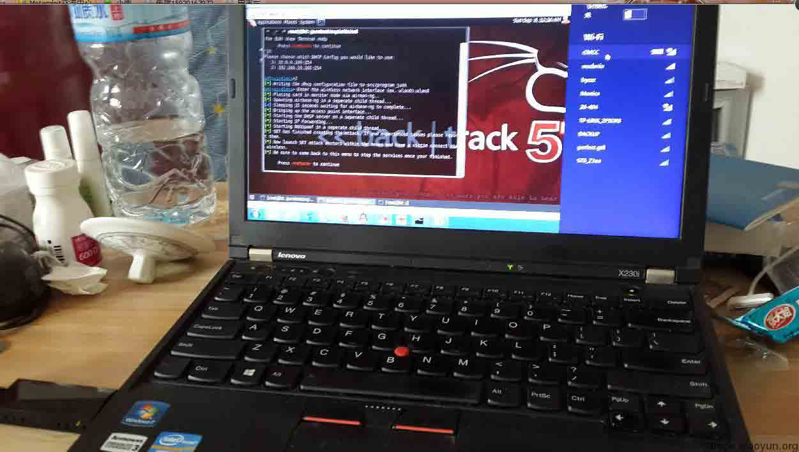

准备：无线网卡（8137）、bt5、钓鱼页面

### 一：插入无线网卡进入 BT5,把网卡启动起来，给 eth0 配个 ip

```
#ifconfig eth0 up 
#ifconfig wlan0 up 
#ifconfig eht0 192.168.10.2/24 
```

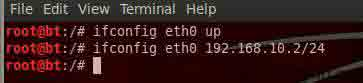

### 二：下面要安装 dhcp 和配置

```
#apt-get install dhcp3-server 
```

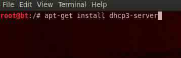

```
# vi /etc/default/dhcp3-server 
```

INTERFACES="eth0" 修改为 INTERFACES="at0"


```
# vi /etc/dhcp3/dhcpd.conf 
```

把下面贴进去，或者改成自己想要分的网段。

```
default-lease-time 600; 
max-lease-time 7200; 
option subnet-mask 255.255.255.0; 
option broadcast-address 192.168.10.255; 
option routers 192.168.10.2; 
option domain-name-servers 192.168.10.1; 
option domain-name "www.metasploit.cn"; 
subnet 192.168.10.0 netmask 255.255.255.0 { 
range 192.168.10.10 192.168.10.100; 
} 
```

如图

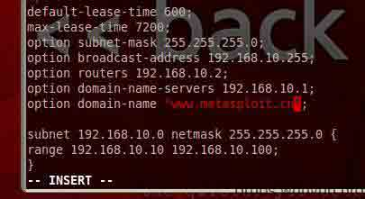

### 三：启动 apache 和配置钓鱼页面

```
# /etc/init.d/apache2 start 
# cd /var/www/    //进入网站目录，bt5 里 apache 默认首页是 index.html 
#vi index.html    //修改成自己的钓鱼页面，这里为了演示，我插入基础钓鱼 
```

BT5 里面我安装的有 XSS 平台，这里的 Ip 要注意，要和刚才我们在 dhcp 配置文件里面分配的 ip 段同网段，否则别人连接进来，访问不了的；

当然如果你直接伪造成移动 CMCC 页面也行！

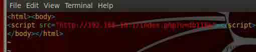

### 四：准备的差不多了，神器该派出来了

```
# cd /pentest/exploits/set/ 
# ./set 
```

这里选择第一个 set>1

1)  Social-Engineering Attacks

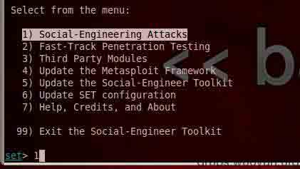

下一步

这里选择第一个 set>8

8) WirelessAccess Point Attack Vector

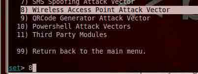

下一步

set:wireless>1 //选择 1 启动

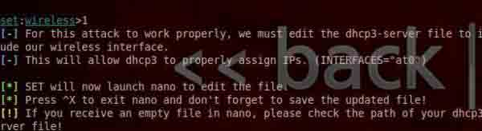

会提示让你编辑 dhcp3-server 这个文件。按 Ctrl+x 直接退出就可以，因为之前我们编辑过了。

下一步

选择分配的 Ip 段

set:wireless>2

Enter the wireless network interface (ex. wlan0):wlan0 //选择 wlan0

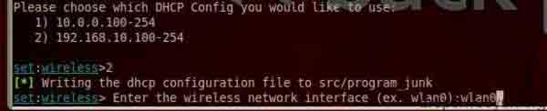

（忘记说一个，# vi /pentest/exploits/set/config/set_config.py 更改为自己想要的 AP 名字，我这里改成 CMCC）

下面是效果

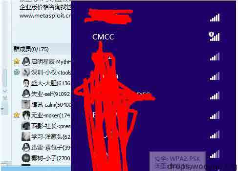

连接 AP 不用输入密码

打开任意网站都会跳到我的钓鱼页面

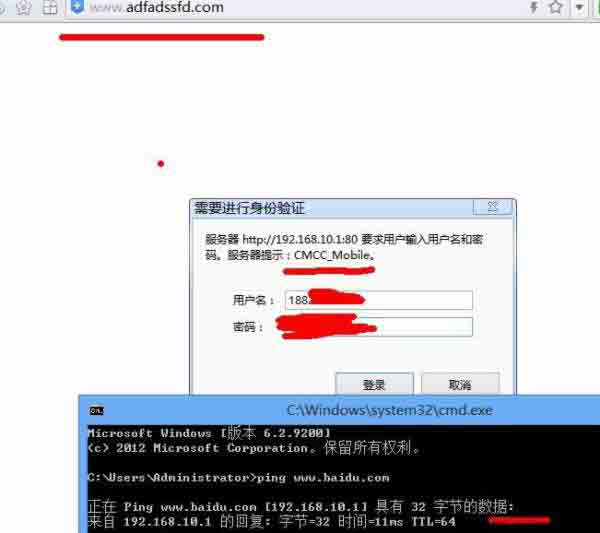

手机 UC 登陆效果


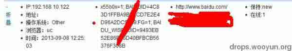

总结:

钓了 2 天，钓到 10 多个“美女”手机号码，效果还是不错，如果伪造成 cmcc 登陆页面，效果会更好！ （仅限技术研究，切勿用于法非用途！！！后果自负）

版权声明：未经授权禁止转载 [Metasploit](http://drops.wooyun.org/author/Metasploit "由 Metasploit 发布")@[乌云知识库](http://drops.wooyun.org)

分享到：

### 相关日志

*   [Rsync 安全配置](http://drops.wooyun.org/papers/161)
*   [lnmp 虚拟主机安全配置研究](http://drops.wooyun.org/tips/2866)
*   [Powershell tricks::Bypass AV](http://drops.wooyun.org/tips/3353)
*   [使用 OpenSSH 证书认证](http://drops.wooyun.org/tips/1055)
*   [linux symbolic link attack tutorial](http://drops.wooyun.org/papers/4762)
*   [隐写术总结](http://drops.wooyun.org/tips/4862)