# “暗云”BootKit 木马详细技术分析

2015/01/30 12:58 | [腾讯电脑管家](http://drops.wooyun.org/author/腾讯电脑管家 "由 腾讯电脑管家 发布") | [二进制安全](http://drops.wooyun.org/category/binary "查看 二进制安全 中的全部文章") | 占个座先 | 捐赠作者

## 0x00 “暗云”木马简介：

* * *

“暗云”是一个迄今为止最复杂的木马之一，感染了数以百万的计算机， 暗云木马使用了很多复杂的、新颖的技术来实现长期地潜伏在用户的计算机系统中。其使用了 BootKit 技术，直接感染磁盘的引导区，感染后即使重装系统格式化硬盘也无法清除该木马。该木马使用了很多创新的技术，有以下特点：

第一、隐蔽性非常高，通过 Hook 磁盘驱动实现对已感染的 MBR 进行保护，防止被安全软件检测和清除，并且使用对象劫持技术躲避安全人员的手工检测。隐蔽性极高，截至目前为止，几乎所有的安全软件都无法检测和查杀该木马。

第二、云思想在暗云木马中的使用：木马以轻量级的身躯隐藏于磁盘最前端的 30 个扇区中，这些常驻与系统中代码并没有传统木马的功能，这些代码的功能仅仅是到执行的服务器（云端）下载其他功能代码到内存中直接执行，这些功能模块每次开机都由隐藏的模块从云端下载。因此木马体积小巧，且云端控制性强。

第三，Ring 3 与 Ring 0 的通信方式：微软正统的通信方式是 Ring 0 代码创建驱动设备，Ring 3 代码通过打开 Ring 0 创建的设备开实现相互之间的通信。常见的木马使用的通信方式则是在 Ring 0 对指定的 API 函数进行 Hook，而暗云木马是通过注册回调的方式来实现。

第四，操作系统全量兼容：一份 BootKit 同时兼容 x86、x64 两种版本的操作系统，且能够兼容 xp、win7 等当前主流的操作系统版本，因此影响范围十分广泛。在推广获利方面，该木马也是涵盖当前主流的推广获利渠道——推广小网站、推广手机应用、推广游戏、大网站加推广 ID。

第五，有效对抗杀软：有于木马的主体在内核中运行，且启动时间比所有的安全软件都早，因此大部分的安全软件无法拦截和检测该木马的恶意行为。木马能够在内核中直接结束部分安全软件进程，同时可以向任意安全软件进程插入 APC 执行。插入的 APC 代码不稳定，且会关闭安全软件的设备句柄，会导致安全软件崩溃或退出，大大减少了被检测的机率。

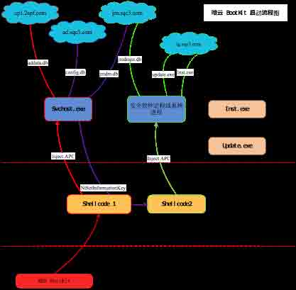

图 1\. 暗云 木马启动流程图（图中按红紫绿黑分四个模块）

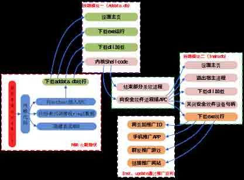

图 2 . 暗云木马模块功能分工示意图

## 0x01 常驻计算机模块（MBR）行为

* * *

## 1\. 概述：

* * *

电脑开机后，受感染的磁盘 MBR 第一时间获得 CPU 的控制权，其功能是将磁盘 3-63 扇区的木马主体加载到内存中解密执行，木马主体获得执行后通过挂钩 int 15 中断来获取第二次执行的机会，随后读取第二扇区中的备份 MBR 正常地引导系统启动。

系统引导启动时会通过 int 15 中断查询内存信息，此时挂钩 15 号中断的木马便得以第二次获得 CPU 控制权，获得控制权后木马挂钩 BILoadImageEx 函数，调用原始 15 号中断并将控制权交回给系统继续引导。

当系统引导代码调用 BILoadImageEx 加载 ntoskrnl.exe 时，木马便第三次获得控制权，获得控制权后木马再一次执行挂钩操作，此次挂钩的位置是 ntoskrnl.exe 的入口点，随后将控制权交给系统继续引导。

当引导完毕进入 windows 内核时，挂钩 ntoskrnl 入口点的木马代码第四次获得 CPU 控制权，此时木马已真正进入 windows 内核中，获得控制权后，分配一块内存空间，将木马内核的主功能代码拷贝到分配的空间中，并通过创建 PsSetCreateThreadNotifyRoutine 回调的方式使主功能代码得以执行。至此完成木马由 MBR 到 windows 内核的加载过程。

木马主功能代码的主要实现以下三个功能：1、劫持磁盘驱动实现隐藏和保护被感染的 MBR；2、向 ring3 的一个 svchost 进程插入 APC；3、通过设置注册表回调来接收 ring3 返回。

插入到 svchost 代码只实现一个简单的功能：判断操作系统类型，从云端下载相应的 Addata.dat 模块到本地，解密执行，云端模块的 URL 硬编码在 Shellcode 中。

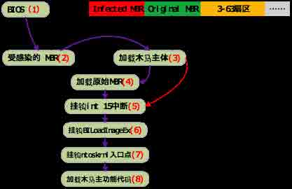

图 3\. BootKit 启动过程示意图

## 2\. 代码细节：

* * *

感染后的 MBR（黑）与原始 MBR（红）对比图

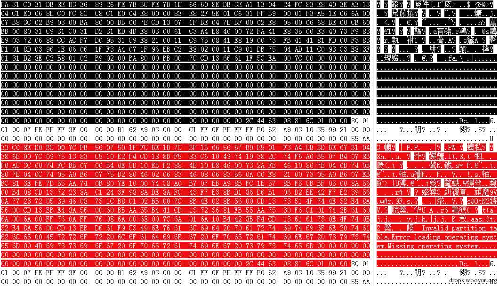

## 0x02 云端模块一（Addata.dat）行为

* * *

## 1\. 概述

* * *

此模块为木马云端配置的第一个模块，其格式固定，以简单的循环移位的方式进行加密，解密后的模块数据结构如下：


云端模块 1 解密后的数据结构

该模块的前 4 字节为标志“CODE”，仅作为数据合法性校验，校验成功后直接执行其后的 Shellcode，而 Shellcode 的功能则是负责将 Addata.dll 在内存中加载，最终从其入口点处开始执行之。

Addata.dll 的主要功能是下载者，其具体的行为仍然依赖于云端配置，其运行后首先会从云端下载配置文件，配置文件所在的 URL 为：http://ad.sqc3.com/update/config.db，该 URL 硬编码在文件中。下载后解析配置文件，由配置文件来决定代码中的功能是否执行，以及具体的参数信息，能够实现的功能以及实际配置文件信息如下表所示：

| 能实现的功能 | 开关 | 参数信息 |
| --- | --- | --- |
| 设置浏览器主页 | 关 | none |
| 检测指定杀软 | 关 | none |
| 下载 Dll 并 Load | 关 | none |
| 下载 Exe 并运行 | 关 | none |
| 下载 Shellcode 执行 | 关 | http://jm.sqc3.com/cn/jmdm.db，解密后传入内核 http://jm.sqc3.com/cn/jmdmx64.db（如果是 64 位系统） |

## 2\. 代码细节：

* * *

Addata.dll 中硬编码的配置文件 URL 信息

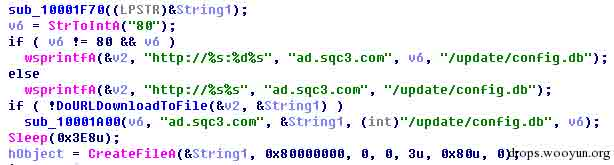

设置浏览器主页的相关代码

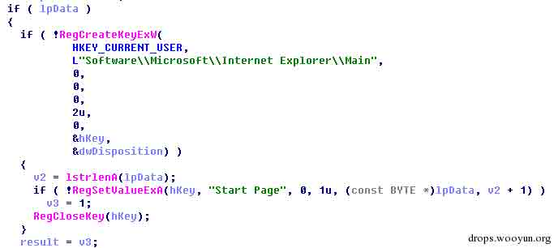

对下载的文件可进行不同的处理（LoadLibrary、CreateProcess、加载到内核执行），这里还有一个很有意思的代码：DeleFileA(“我真的凌乱了…….”)，作者都凌乱了，真的很复杂！

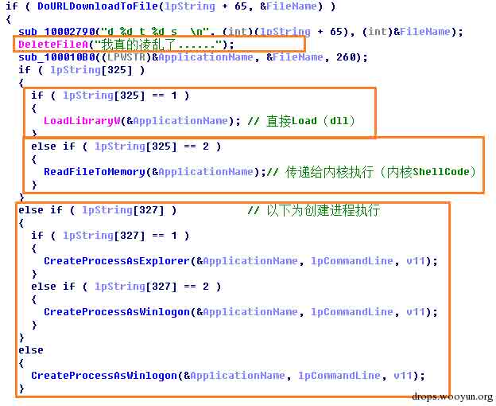

Shellcode 是通过 NtSetInformationKey 代入内核的（内核注册了 cmpCallBack）

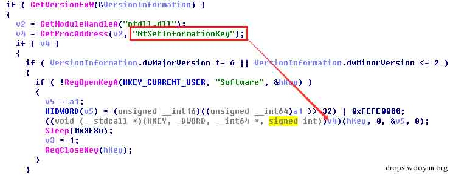

## 0x03 云端模块二（jmdm.db）行为

* * *

## 1\. 概述

* * *

此模块为木马云端配置的第二个模块，由云端模块一下载后传递到内核执行，已相对较为复杂的加密算法进行加密，其中文件的前 0x32 字节为解密 key，解密后的模块数据结构如下：

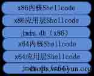

云端模块 2 解密后的数据结构

由于此木马同时兼容 32 位操作系统和 64 位操作系统，因此这个此模块包含两个版本，内核模块会根据操作系统的类型执行相应的 Shellcode，因为两套代码功能完全一致，以下仅分析 x86 部分。

该模块首先被 NtSetInformationKey 传入内核，由内核模块从内核 Shellcode 开始执行，内核 Shellcode 的功能有如下两个：

```
1）结束指定杀软进程，包括 kxetray.exe、kxescore.exe、QQPcTray.exe，由于管家的进程有 object 钩子防护，因此不会被干掉。

2）遍历进程，如果进程名为以下之一，则将尾部的应用层 Shellcode 以 apc 的方式插入到该进程中，插入一个进程后便退出遍历，不再插其他进程。具体进程列表如下：360tray.exe、360safe.exe、360sd.exe、360rp.exe、zhudongfangyu.exe、QQPcRtp.exe、KSafeSvc.exe、KSafeTray.exe、BaiduSdTray.exe、BaiduAnTray.exe、BadduAnSvc.exe、BaiduHips.exe、BaiduProtect.exe、wscntfy.exe、spoolsv.exe、alg.exe，以上进程名均硬编码于 Shellcode 中。 
```

应用层 Shellcode 被插入指定进程后开始执行，其功能是在内存中动态加载 jmdm.dll 文件并跳到其入口点执行。

jmdm.dll 的主要功能依然是下载者，其代码与 Addata.dll 有 60%以上的相似性，可以确定为同一份源码修改而来，其具体的行为仍然依赖于云端配置，其运行后首先会从云端下载配置文件，配置文件所在的 URL 为：http://jm.sqc3.com/cn/jmdmpz.db，该 URL 硬编码在文件中。下载后解析配置文件，由配置文件来决定代码中的功能是否执行，以及具体的参数信息，能够实现的功能以及实际配置文件信息如下表所示：

| 能实现的功能 | 开关 | 参数信息 |
| --- | --- | --- |
| 设置浏览器主页 | 关 | none |
| 关闭指定杀软句柄 | 开 | \Device\360SelfProtection \Device\360SpShadow0 \Device\qutmipc \FileSystem\Filters\FltMgrMsg \FileSystem\Filters\qutmdrv |
| 检测杀软进程 | 关 | none |
| 下载 Dll 并 Load | 关 | none |
| 下载 Exe 并运行 | 开 | http://tg.sqc3.com/tg/inst.exe http://tg.sqc3.com/tg/update.exe |

以上行为执行完毕后，木马会等待下载的 inst.exe、update.exe 运行完毕后重新创建一个新的宿主进程，随后调用 ExitProcess 退出原始宿主进程。

## 2\. 代码细节

* * *

调用 ZwTerminateProcess 结束安全软件进程 kxetray.exe、kxescore.exe、QQPcTray.exe，由于管家的进程有 object 钩子防护，因此不会被干掉。

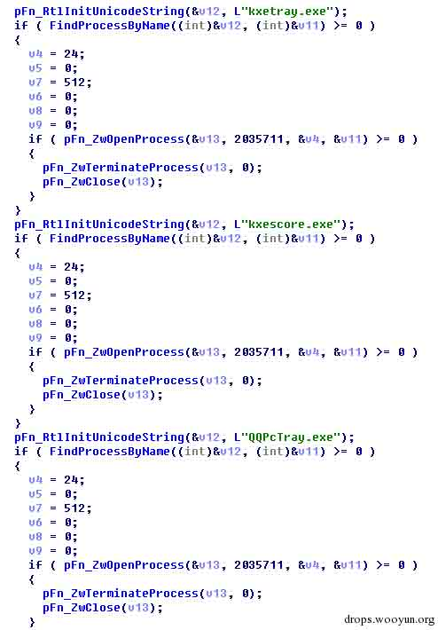

遍历进程，看进程是否在硬编码的进程列表中，如果是，则插入 apc，找到一个进程之后跳出循环，即只向一个进程插入 apc

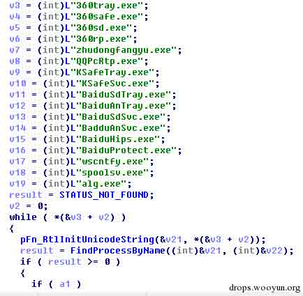

插 apc 的具体代码

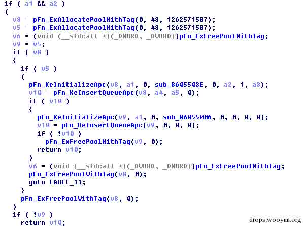

关闭名为\Device\qutmipc 等的设备句柄，名称字符串硬编码于文件中

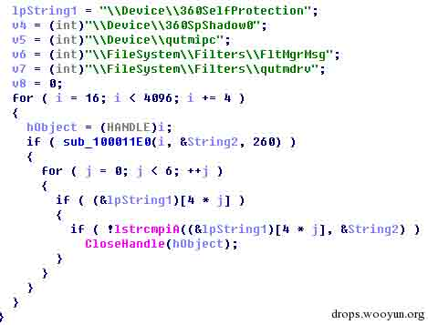

配置文件 http://jm.sqc3.com/cn/jmdmpz.db 的 URL 硬编码在文件中

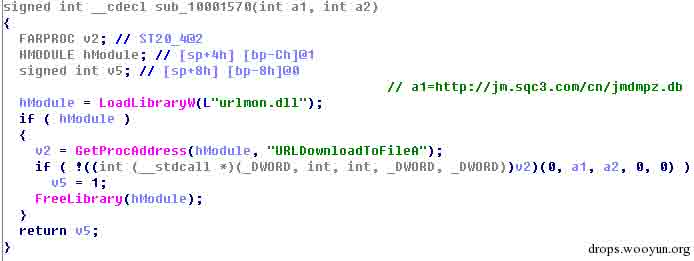

下载指定 URL 的文件到本地，加载或者运行

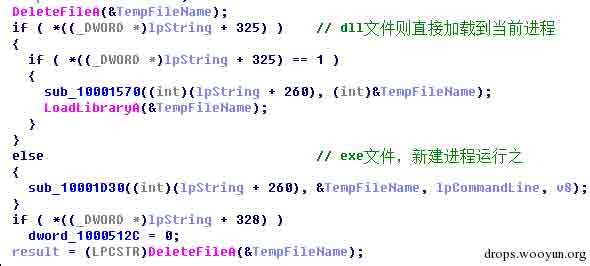

## 0x04 木马的盈利推广部分（inst .exe、update.exe）行为

* * *

## 1\. 概述：

* * *

木马的最终目的只有一个——盈利，而 inst.exe 和 update.exe，这连个落地的 PE 文件，则是真正能够使作者获得丰厚收益的模块，也是木马开始执行真正恶意的行为。

Inst.exe 运行后首先在桌面上释放一个名为“美女视频聊天”的快捷方式，该快捷方式指向一个 http://haomm.com，并带了一个推广 id，实现推广网站盈利。 Inst.exe 还会释放 XnfBase.dll、thpro32.dll 两个 dll 到%appdata%目录下，并通过注册服务的方式加载这两个 dll。 XnfBase.dll 实现的功能是 LSP 劫持，当用户使用浏览器浏览 www.hao123.com、www.baidu.com 等网站的时候在其网址尾部添加推广 ID，从而实现获利。thpro32.dll 实现的功能是：不断地删除系统中指定提供者的 LSP，防止其他木马或安全软件通过 LSP 再次修改推广 ID。

Update.exe 运行后会创建两个 svchost.exe 傀儡进程，并将解密出的功能模块分别注入到两个进程中，一个负责向安卓手机安装推广 app、另一个实现向含有“私服”等关键词的 QQ 群上传共享文件，用来推广私服游戏获利。

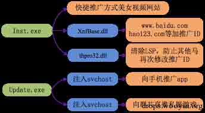 木马通过各种推广来实现盈利

## 2\. 代码细节：

当用户用浏览器访问 www.baidu.com 等网站时，为其添加推广 id，实现推广获利

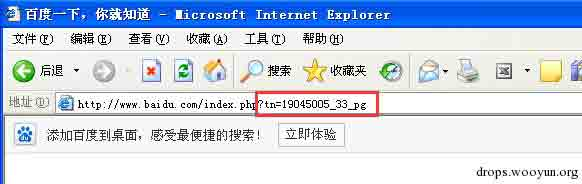

在桌面上创建的美女视频聊天快捷方式，推广 haomm.com 这个网站

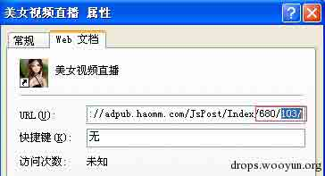

不断检测是否有 LSP 模块，有则删除，保护自己的推广 ID 不被修改

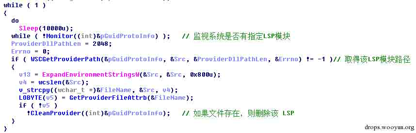

向指定名称的 QQ 群上传私服游戏，进行私服游戏的推广


版权声明：未经授权禁止转载 [腾讯电脑管家](http://drops.wooyun.org/author/腾讯电脑管家 "由 腾讯电脑管家 发布")@[乌云知识库](http://drops.wooyun.org)

分享到：

### 相关日志

*   [CVE2014-6287 分析报告](http://drops.wooyun.org/papers/3091)
*   [64 位 Linux 下的栈溢出](http://drops.wooyun.org/tips/2288)
*   [CVE-2014-4113 漏洞利用过程分析](http://drops.wooyun.org/papers/3331)
*   [漏扫工具 AWVS 命令执行](http://drops.wooyun.org/papers/1501)
*   [Win10 安全特性之执行流保护](http://drops.wooyun.org/tips/4839)
*   [教你解密 Gh0st 1.0 远控木马 VIP 版配置信息](http://drops.wooyun.org/tips/3589)