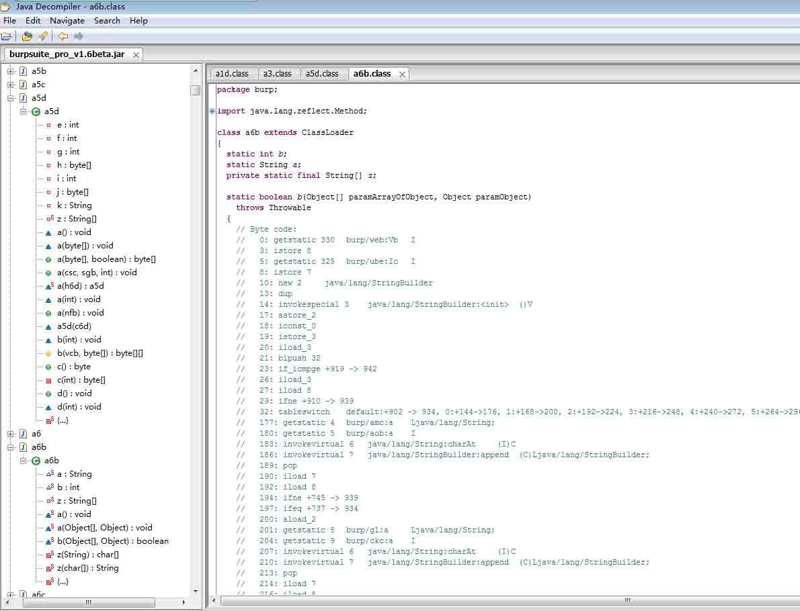
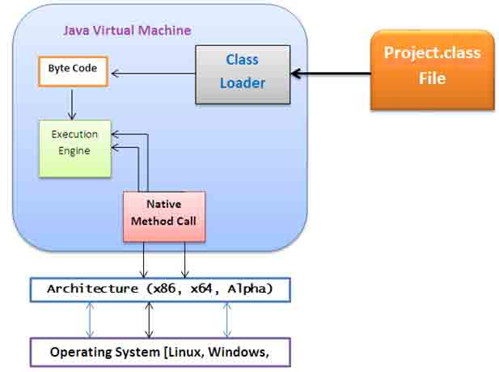
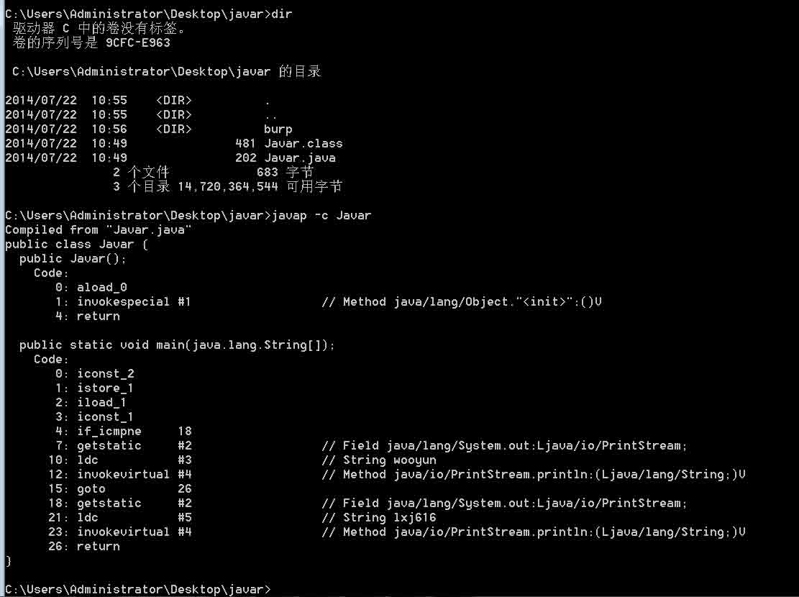
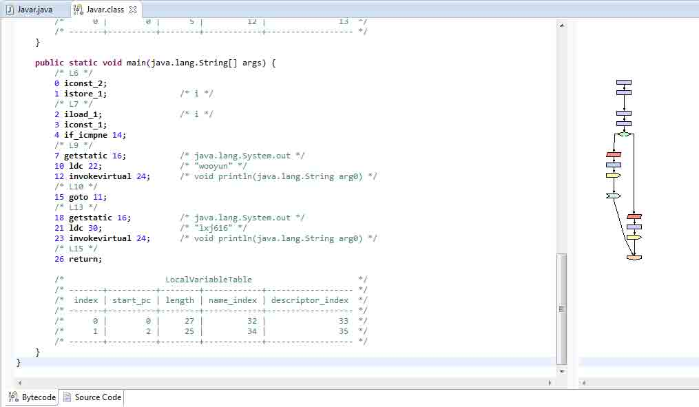
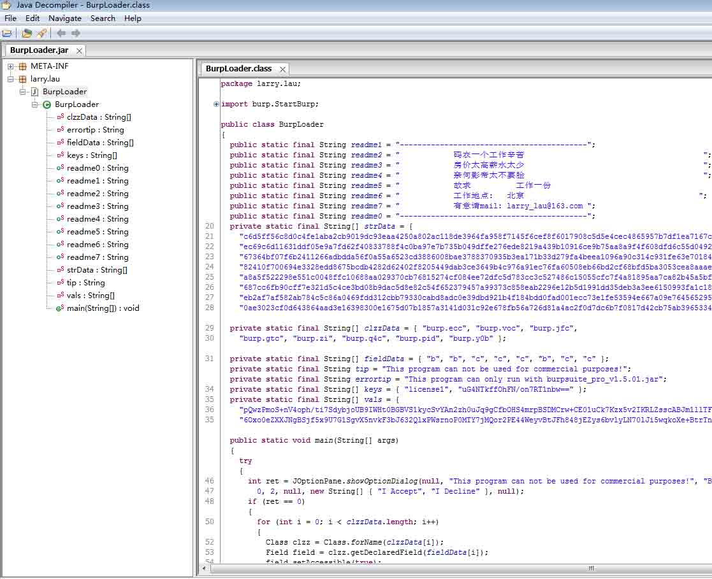
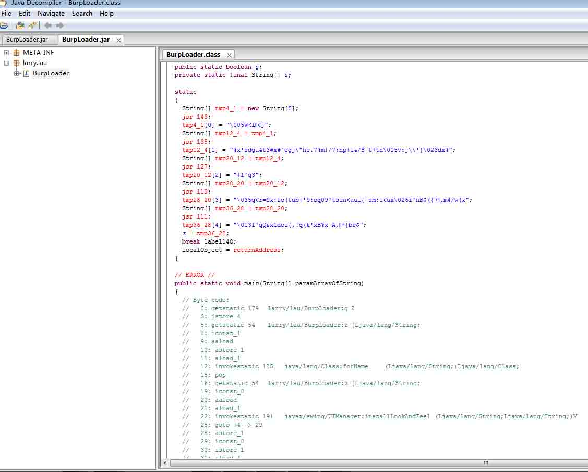
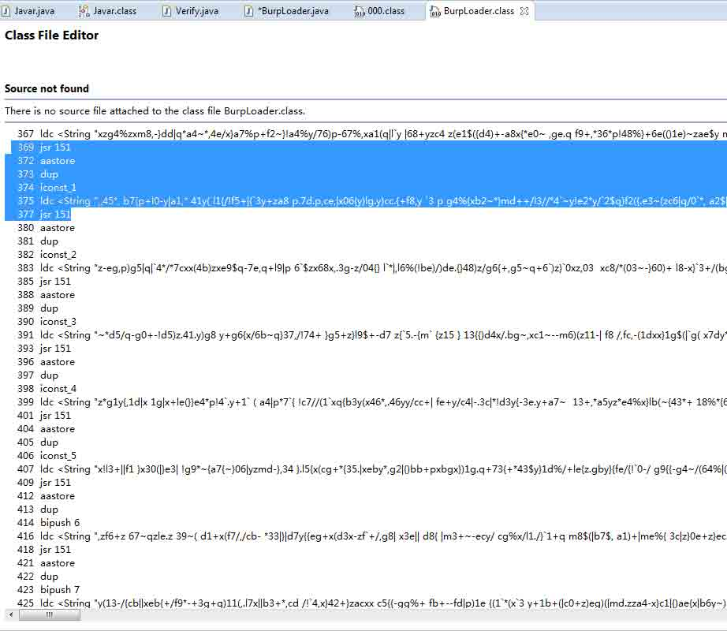
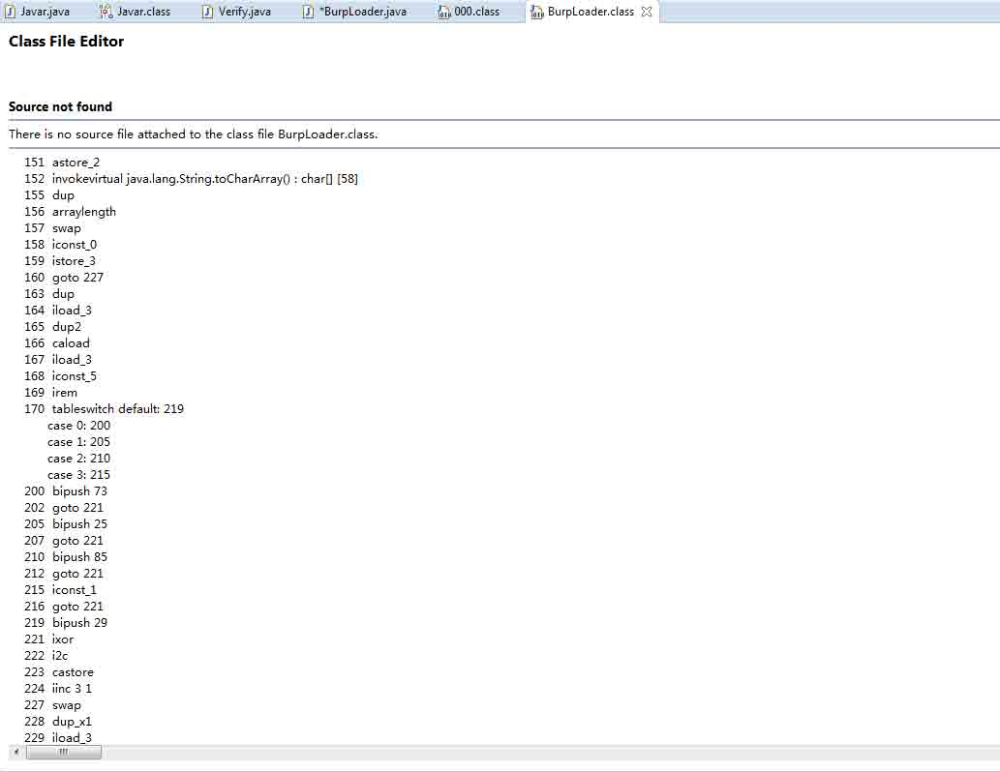
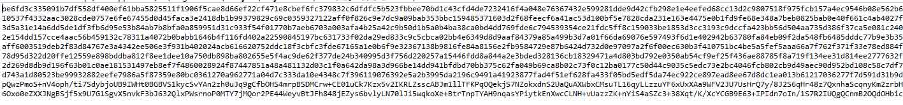

# JAVA 逆向&反混淆-追查 Burpsuite 的破解原理

2014/07/30 16:19 | [lxj616](http://drops.wooyun.org/author/lxj616 "由 lxj616 发布") | [技术分享](http://drops.wooyun.org/category/tips "查看 技术分享 中的全部文章") | 占个座先 | 捐赠作者

## 0x00 摘要：

* * *

本系列文章通过对 BurpLoader 的几个版本的逆向分析，分析 Burpsuite 的破解原理，分析 Burpsuite 认证体系存在的安全漏洞。

## 0x01 JD-GUI 的用途与缺陷：

* * *

JD-GUI 是一款从 JAVA 字节码中还原 JAVA 源代码的免费工具，一般情况下使用这款工具做 JAVA 逆向就足够了，但是由于其原理是从 JAVA 字节码中按照特定结构来还原对应的 JAVA 源代码，因此一旦字节码结构被打乱（比如说使用混淆器），那么 JD-GUI 就会失去它的作用，如图为使用 JD-GUI 打开 Burpsuite 时的显示：



显然，JD-GUI 没能还原 JAVA 源代码出来，因为 Burpsuite 使用了混淆器打乱了字节码结构 所以，JD-GUI 适用于‘没有使用混淆器’的 JAVA 字节码，而缺陷是一旦字节码结构被打乱，则无法发挥它的作用

## 0x02 字节码分析：

* * *

Java 的字节码并不像普通的二进制代码在计算机中直接执行，它通过 JVM 引擎在不同的平台和计算机中运行。



JVM 是一个基于栈结构的虚拟计算机，使用的是 JVM 操作码（及其助记符），在这一点上和普通二进制反汇编的过程非常相似。 对 Java 字节码进行反编译其实非常简单，JDK 内置的 Javap 工具即可完成这项任务。

示例：对 Javar.class 进行反编



注意 javap 的-c 参数是显示详细代码，否则只显示 method，而按照 java 的老规矩 Javar 不要加后缀名 同时你也可以使用 eclipse 的插件 Bytecode Visualizer 来反编译字节码



注意右面的流程图，大家在上程序设计导论课时都画过吧，现在发现它的用途了吧，一眼就看出是一个 if-else 结构，前两句定义 i 变量，然后取 i=2 压栈常数 1，比对 i 和 1 以后就都 java.lang.system.out 了，一个输出 wooyun，一个输出 lxj616。

## 0x03 老版本的 BurpLoader 分析：

* * *

随着 Burpsuite 的更新，BurpLoader 也在跟着进行更新，我们从老版本的 BurpLoader 入手，简要分析一下之前老版本的 burpsuite 破解原理。 本处选用了 1.5.01 版本的 BurpLoader 进行分析 首先试着用 JD-GUI 载入 BurpLoader：



成功还原了 BurpLoader 源代码，只可惜由于是对 burpsuite 的 patch，所以 burpsuite 的混淆在 burploader 里仍然可读性极差，不过可以推断 burploader 本身没有使用混淆工具。

```
public static void main(String[] args)
  {
    try
    {
      int ret = JOptionPane.showOptionDialog(null, "This program can not be used for commercial purposes!", "BurpLoader by larry_lau@163.com", 0, 2, null, new String[] { "I Accept", "I Decline" }, null);
      //显示选择对话框：这程序是出于学习目的写的，作者邮箱 larry_lau(at)163.com 
      if (ret == 0)  //选择我同意
      {
        //以下用到的是 java 反射机制，不懂反射请百度
        for (int i = 0; i < clzzData.length; i++)
        {
          Class clzz = Class.forName(clzzData[i]);
          //是 burpsuite 的静态类（名字被混淆过了，也没必要列出了）
          Field field = clzz.getDeclaredField(fieldData[i]);
         //静态类中的变量也被混淆过了，也不必列出了
          field.setAccessible(true);
        //访问 private 必须先设置这个，不然会报错

          field.set(null, strData[i]);
        //把变量设置成 strData（具体那一长串到底是什么暂不讨论）
        }

        Preferences prefs = Preferences.userNodeForPackage(StartBurp.class);
        //明显 preferences 是用来存储设置信息的
        for (int i = 0; i < keys.length; i++)
        {
          // key 和 val 能猜出是什么吧
          String v = prefs.get(keys[i], null);
          if (!vals[i].equals(v))
          {
            prefs.put(keys[i], vals[i]);
          }
        }
        StartBurp.main(args);
      }
    }
    catch (Exception e)
    {
      JOptionPane.showMessageDialog(null, "This program can only run with burpsuite_pro_v1.5.01.jar", "BurpLoader by larry_lau@163.com", 
        0);
    }
  }
} 
```

因此，BurpLoader 的原理就是伪造有效的 Key 来通过检测，Key 的输入是通过 preference 来注入的，而我猜测它为了固定 Key 的计算方法，通过反射把一些环境变量固定成常量了

## 0x04 新版本的 BurpLoader 分析：

* * *

以下用 1.6beta 版的 BurpLoader 进行分析： 首先用 JD-GUI 尝试打开 BurpLoader：



看来这个版本的 BurpLoader 对字节码使用了混淆，这条路走不通了 于是直接读字节码吧！



大家可以看到这里的字符串都是混淆过的，每一个都 jsr 到 151 去解密



这段解密代码特点非常明显，一个 switch 走 5 条路，给 221 传不同的解密 key，这不就是 Zelix KlassMaster 的算法吗？ 简单的异或而已，轻松写出解密机：

```
public class Verify {
    private static String decrypt(String str) {
        char key[] = new char[] {73,25,85,1,29};
        char arr[] = str.toCharArray();
        for (int i = 0; i < arr.length; i++) {
            arr[i] ^= key[i % 5];
        }
        return new String(arr);
    }

    public static void main (String args[]) {
        System.out.println(decrypt("%x'sdgu4t3#x#`egj\"hs.7%m|/7;hp+l&/S t7tn\5v:j\'}_dx%"));
    }
} 
```

里面的 5 个密钥就是上图 bipush 的传参，别忘了 iconst_1 的那个 1 解密出来是：`larry.lau.javax.swing.plaf.nimbus.NimbusLook:4`

其实这里解密出字符串没有什么用处，因为我们已经拿到老版本的源代码了，不过在别的软件逆向分析中可能会非常有用

## 0x05 总结&POC

* * *

以下为我修改后的 BurpLoader，其中的恶意代码我已经去除，并将修改前的原值输出，大家可以在添加 burpsuite jar 包后编译运行这段代码

```
package stratburp;

import burp.StartBurp; 
import java.lang.reflect.Field; 
import java.util.prefs.Preferences; 
import javax.swing.JOptionPane; 

public class startburp 
{ 

  private static final String[] clzzData = { "burp.ecc", "burp.voc", "burp.jfc",  
    "burp.gtc", "burp.zi", "burp.q4c", "burp.pid", "burp.y0b" }; 

  private static final String[] fieldData = { "b", "b", "c", "c", "c", "b", "c", "c" }; 
  private static final String errortip = "This program can only run with burpsuite_pro_v1.5.01.jar"; 
  private static final String[] keys = { "license1", "uG4NTkffOhFN/on7RT1nbw==" }; 

  public static void main(String[] args) 
  { 
    try 
    { 
        for (int i = 0; i < clzzData.length; i++) 
        { 
          Class clzz = Class.forName(clzzData[i]); 
          Field field = clzz.getDeclaredField(fieldData[i]); 
          field.setAccessible(true); 

          //field.set(null, strData[i]); 
          System.out.println(field.get(null));
        } 

        Preferences prefs = Preferences.userNodeForPackage(StartBurp.class); 
        for (int i = 0; i < keys.length; i++) 
        { 
          String v = prefs.get(keys[i], null); 
          System.out.println(prefs.get(keys[i], null));
        } 
        StartBurp.main(args); 
    } 
    catch (Exception e) 
    { 
      JOptionPane.showMessageDialog(null, "This program can only run with burpsuite_pro_v1.5.01.jar", "Notice",0); 
    } 
  } 
} 
```

其效果如截图所示



其中前 8 行输出为之前 BurpLoader 恶意修改的目标原值（对我的计算机而言），同一台设备运行多少遍都是不变的，后面的 key 由于我之前运行过 BurpLoader 因此是恶意修改后的值（但是由于前 8 行没有修改因此不能通过 Burpsuite 验证），可见 BurpLoader 其实是使用了同一个密钥来注册所有不同计算机的，只不过修改并固定了某些参与密钥计算的环境变量而已，这大概就是 Burpsuite 破解的主要思路了，至于最初能用的 license 是怎么计算出来的，我们以后再研究

版权声明：未经授权禁止转载 [lxj616](http://drops.wooyun.org/author/lxj616 "由 lxj616 发布")@[乌云知识库](http://drops.wooyun.org)

分享到：

### 相关日志

*   [一种新的攻击方法——Java-Web-Expression-Language-Injection](http://drops.wooyun.org/tips/2494)
*   [一次 app 抓包引发的 Android 分析（续）](http://drops.wooyun.org/tips/2986)
*   [The FLARE On Challenge 题解](http://drops.wooyun.org/tips/2988)
*   [Android 证书信任问题与大表哥](http://drops.wooyun.org/tips/3296)
*   [Spring 框架问题分析](http://drops.wooyun.org/tips/2892)
*   [基于 snmp 的反射攻击的理论及其实现](http://drops.wooyun.org/tips/2106)