# android 测试环境搭建

2014/07/24 14:22 | [瘦蛟舞](http://drops.wooyun.org/author/瘦蛟舞 "由 瘦蛟舞 发布")   | [技术分享](http://drops.wooyun.org/category/tips "查看 技术分享 中的全部文章"), [移动安全](http://drops.wooyun.org/category/mobile "查看 移动安全 中的全部文章")  | 占个座先  | 捐赠作者

## 0x01 测试机选择：真机 or 模拟器

* * *

**1.1 三大主流模拟器对比**

|      |       Android Emulator      |       Android-x86      |       GenyMotion      |
|       价格      |       free      |       free      |       Free: Non-commercial Paid: Freelance, Business      |
|       速度      |       Slow for ARM – Faster for x86      |       Fast      |       Very fast      |
|       支持版本      |       Android Virtual Devices (All android versions)      |       Only certain preconfigured devices, mostly tablet (Android 2.2-4.4)      |       Pre-configured images for many tablet & phone devices of Google, HTC, LG, Motorola, Samsung, Sony (Android 2.3, 4.x)      |
|       HTTP 代理      |       Yes (command-line option)      |       Yes, via GUI      |       Yes, via GUI      |
|       Transparent Man-in-the-middle      |       Yes – via DNS server      |       Yes, via Virtualbox      |       Yes, via Virtualbox      |
|       Pre-rooted      |       Yes      |       Yes      |       Yes      |
|       虚拟机安全装时间      |       5 minutes      |       15 minutes      |       5 minutes      |
|       相机支持      |       Since Android 4.0      |       Very limited      |       Yes      |
|       GPS 支持      |       Yes      |       No      |       Yes      |
|       Spoof IDs      |       No      |       No      |       Paid version      |
|       Drag&Drop Support      |       No      |       No      |       Yes      |
|       谷歌商店      |       No, but can be installed      |       Yes      |       No, but can be installed      |
|       开发者工具支持      |       Yes      |       Yes      |       Yes, via plugins      |
|       镜像支持      |       One      |       Offline, via Virtualbox      |       Offline, via Virtualbox      |

**1.2 总结**

真机快功能全，模拟器成本低 有条件的话建议真机模拟器混合使用 如果用模拟器的话建议 GenyMotion

## 0x02 探测修改流量

* * *

**2.1 http 代理设置**

电脑代理：Fiddler、burp suite 等

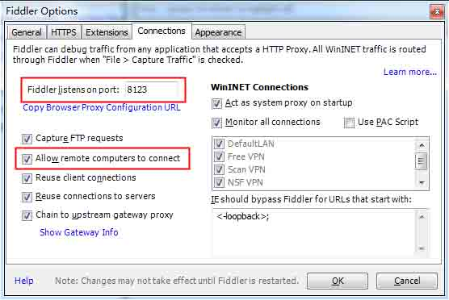

手机代理：proxydroid 等

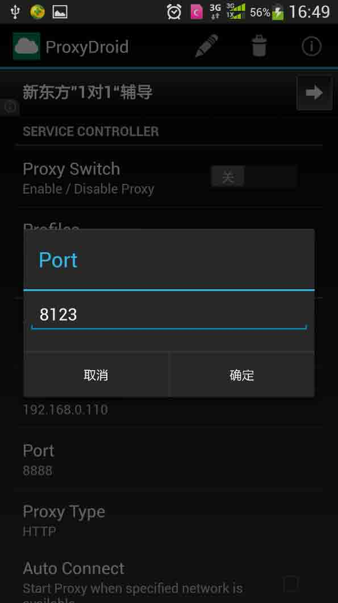

Proxydorid 运行机制

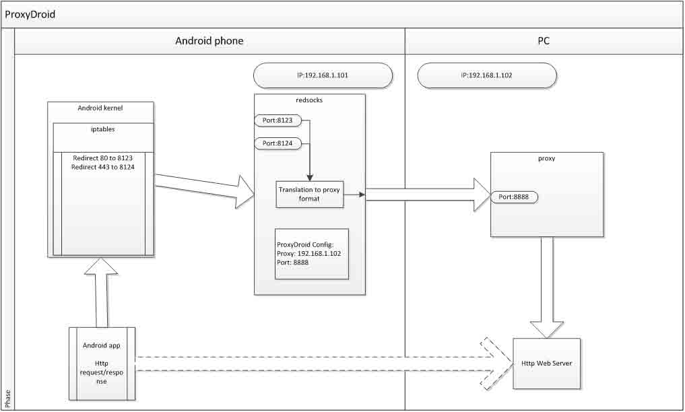

默认设置只能代理 80 和 443 的 http 流量，如果是其他端口的 http 流量就需要配置 iptables 转发端口到手机的 8123 或者 8124 端口上。

**2.2 Ad-hoc 无线网络**

简单说就是用自己电脑开个 wifi 热点，这样做比直接在同 LAN 中设置代理的好处是，android 上的代理软件不一定会把所有流量转发到 pc 上，如果自己 pc 开的热点就不会存在该问题，这样就可以用 wireshark 抓取这些不能代理的流量了。 设置方法如下： Dos 下运行，设置热点

```
netsh wlan set hostednetwork mode=allow ssid=test key=test1234 
```

控制面板里共享网络

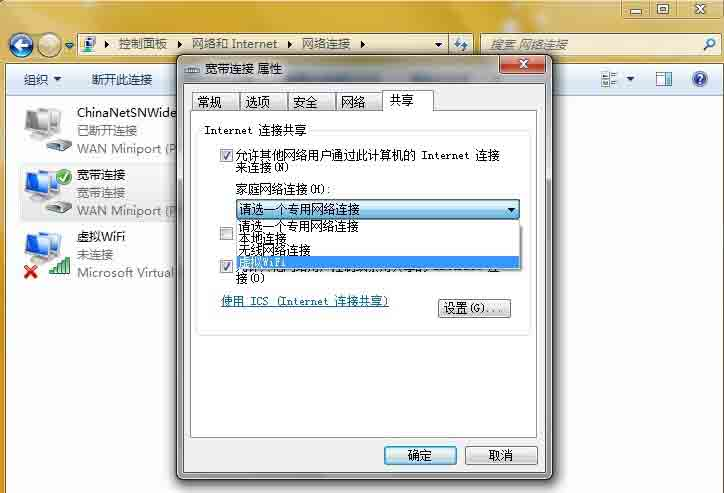

Dos 下运行开启热点

```
netsh wlan start hostednetwork 
```

**2.3 ssl 证书**

从 fiddler 中导出证书

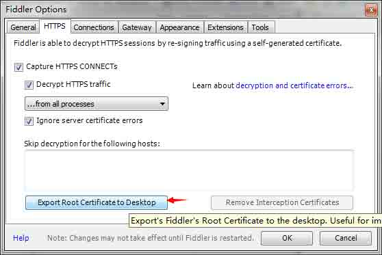

手机中安装 fiddler 证书


有些 app 自带证书，可以解包查看

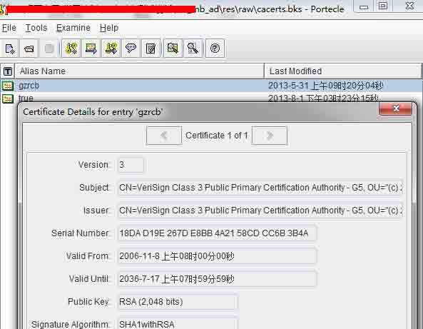

然后合并导入手机中

## 0x03 探测修改本地存储

* * *

**3.1 Root 设备**

Root 后才能进入应用数据目录

**3.2 本地存储检索**

文件种类： databases - SQLite 数据 shared_prefs – 程序私有文件 cache – 缓存数据 lib – 本地库 files – 其他文件 少数应用在 sd 卡中也存储数据

**3.3 文件管理器应用**

ES 文件浏览器（不能打开 sqlite）

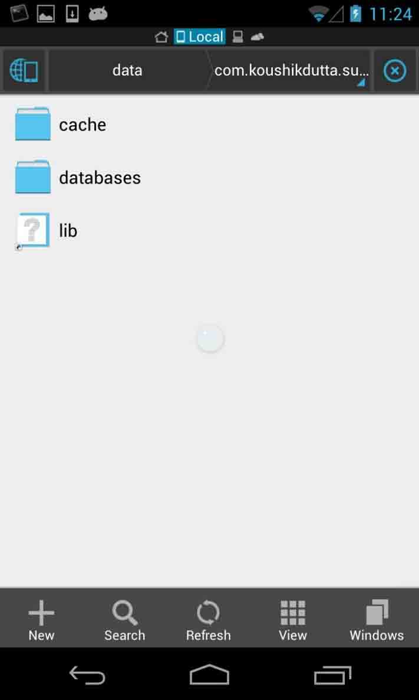

RE（root explorer 能直接打开 sqlite，要好用一些）

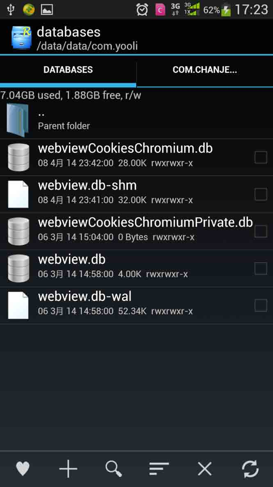

**3.4 ADB pull**

如果用的 es 没办法打开 sqlite 所以才有这步，用 re 的话就不需要这步可以在手机上直接查看。不过 pull 到 pc 上看起来更直观点。 Root 权限才能对应用程序目录进行操作。

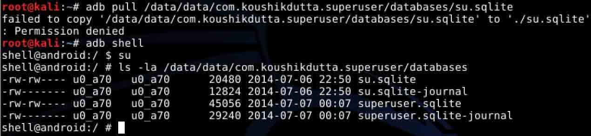

Chmod 把权限改为 777 就可以 pull 到 pc 上查看了。

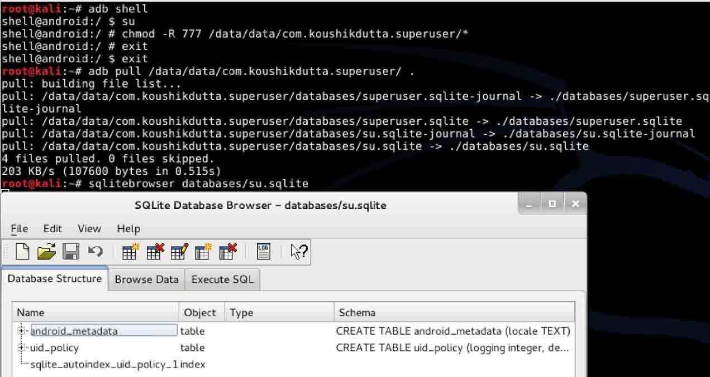

**3.5 SSH root server**

安装 SSHdroid，设置好参数即可远程 ssh 上 android 设备。

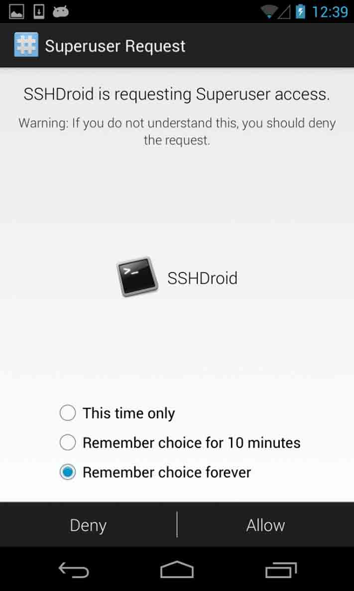

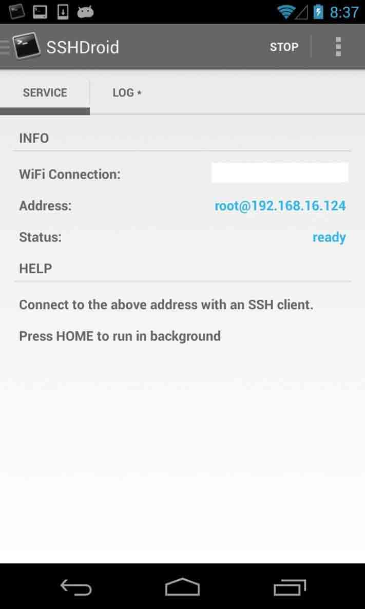

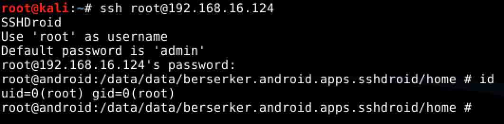

**3.6 快照分析**

通过快照进行差异对比能够快速发现一些本地存储的敏感信息。

在进行操作如输入用户信息前拍下应用目录快照，就是复制一下。


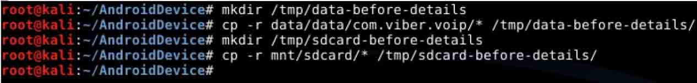

然后进行进行登陆操作拍下再拍下快照


最后用 diff 比较两次快照

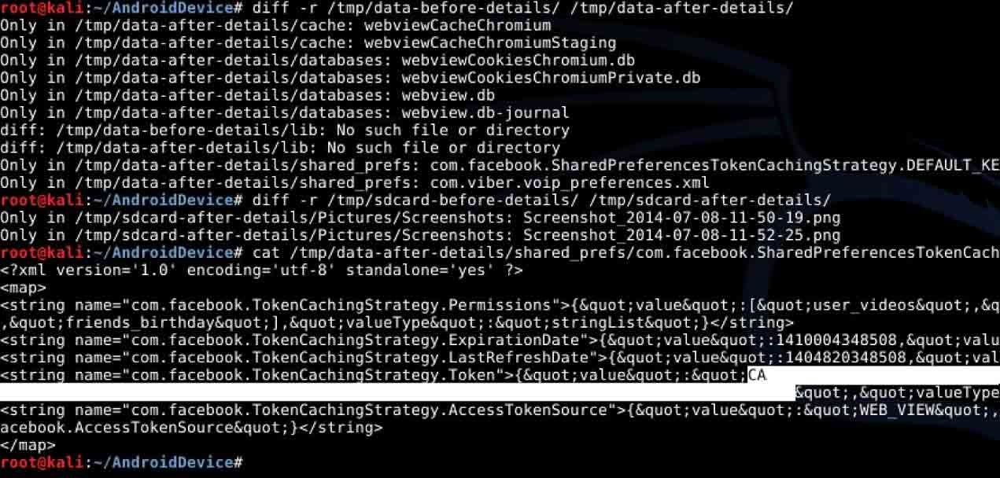

总结：这种方法适合文件较多的应用，文件少的应用直接观察文件修改时间，然后进行查看。

**3.7 常见漏洞**

不必要的敏感信息存储
敏感信息明文存储在外置设备如 sd 卡中
敏感信息明文存储在私有目录下
用弱加密算法加密敏感数据
加密敏感数据用程序的硬编码的静态密钥
加密敏感数据的动态密钥存储在全局可读或者私有目录下

## 0x04 案例

* * *

Logcat 信息泄漏

[WooYun: 光大银行 Android 手机客户端密码明文泄漏](http://www.wooyun.org/bugs/wooyun-2012-014590)

shared_prefs 信息泄漏

[WooYun: 苏宁易购用户敏感信息泄露](http://www.wooyun.org/bugs/wooyun-2012-014308)

[WooYun: 百度安卓设计不当重要资讯泄漏](http://www.wooyun.org/bugs/wooyun-2014-054438)

明文传输

[WooYun: 微付通 Android 客户端敏感信息明文存储](http://www.wooyun.org/bugs/wooyun-2014-053037)

ssl 证书失效

[WooYun: 中信银行"动卡空间“Android 客户端缺陷导致用户名密码等信息被劫持](http://www.wooyun.org/bugs/wooyun-2013-027985)

版权声明：未经授权禁止转载 [瘦蛟舞](http://drops.wooyun.org/author/瘦蛟舞 "由 瘦蛟舞 发布")@[乌云知识库](http://drops.wooyun.org)

分享到：碎银子打赏，作者好攒钱娶媳妇：


### 相关日志

*   [Samsung S Voice attack](http://drops.wooyun.org/tips/2736)
*   [Android App Injection&&Drozer; Use](http://drops.wooyun.org/tips/2997)
*   [Android Broadcast Security](http://drops.wooyun.org/tips/4393)
*   [Android 证书信任问题与大表哥](http://drops.wooyun.org/tips/3296)
*   [Android Logcat Security](http://drops.wooyun.org/tips/3812)
*   [Android Content Provider Security](http://drops.wooyun.org/tips/4314)