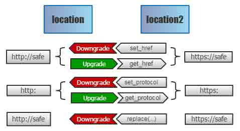
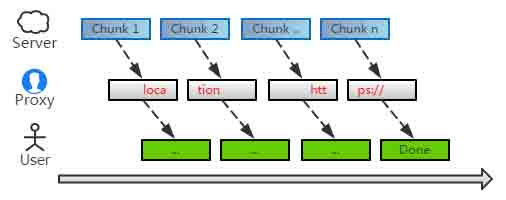
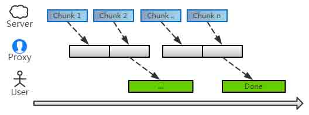
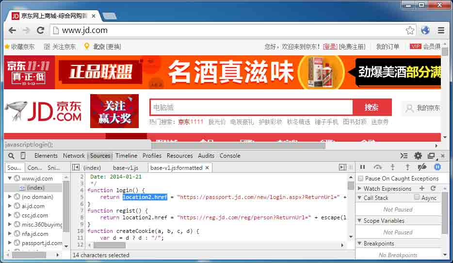
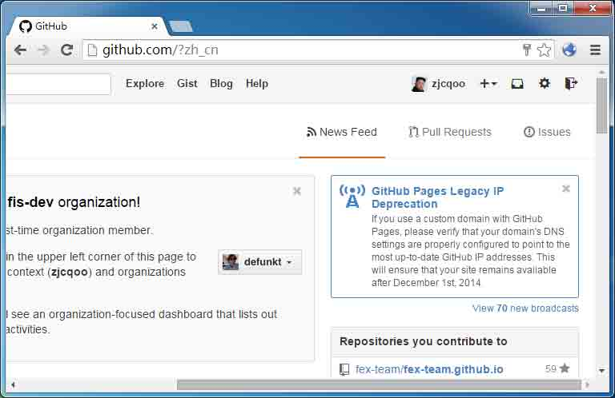

# SSLStrip 终极版 —— location 劫持

2014/11/11 10:15 | [EtherDream](http://drops.wooyun.org/author/EtherDream "由 EtherDream 发布") | [web 安全](http://drops.wooyun.org/category/web "查看 web 安全 中的全部文章") | 占个座先 | 捐赠作者

## 前言

* * *

之前介绍了 [HTTPS 前端劫持](http://www.cnblogs.com/index-html/p/ssl-frontend-hijack.html) 的方案，虽然很有趣，然而现实却并不理想。其唯一、也是最大的缺陷，就是无法阻止脚本跳转。若是没有这个缺陷，那就非常完美了 —— 当然也就没有必要写这篇文章了。

说到底，还是因为无法重写 `location` 这个对象 —— 它是脚本跳转的唯一渠道。尽管也流传一些 Hack 能勉强实现，但终究是不靠谱的。

事实上，在最近封稿的 HTML5 标准里，已非常明确了 [location](http://www.w3.org/TR/2014/REC-html5-20141028/browsers.html#window) 的地位 —— Unforgeable。


这是个不幸的消息。不过也是件好事，让我们彻底打消各种偏门邪道的念头，寻求一条全新的出路。

## 替换明文 URL

* * *

上回也提到，可以参考 SSLStrip 那样，把脚本里的 HTTPS URL 全都替换成 HTTP 版本，即可满足部分场合。

当然，缺陷也是显而易见的。只要 URL 不是以明文出现 —— 例如通过字符串拼接而成，那就完全无法识别了，最终还是无法避免跳转到 HTTPS 页面上。

这种情况并不少见，所以我们需要更先进的解决方案。

## 替换 location

* * *

尽管我们无法重写 location，但要山寨一个和 location 功能一样的玩意，还是非常容易的。我们只需定义几个 getter 和 setter，即可模拟出一个功能完全相同的 `location2`。但如何将原先的 location 映射过来呢？

这时，后端的作用就发挥出来了。类似替换 HTTPS URL，这次我们只关注脚本里的 location 字符，把它们都改成 location2 —— 于是所有和地址栏相关的读写，都将落到我们的代理上面。之后能做什么，不用说大家也都明白吧。


*   代理所有的 setter：如果跳转到 HTTPS 就将其拦下，然后降级到 HTTP 版本上。

*   代理所有的 getter：如果当前处于降级的页面，我们将返回的路径都还原 HTTPS 字符，即可骗过协议判断脚本，让那些自检功能彻底失效！



相比之前的 URL 替换，这个方案完美太多 —— **URL 是动态创建的非常普遍，但 location 不是明文出现的，及其罕见**。

除非脚本是加密过的，否则即使用 Uglify 那样的压缩工具，也不会把全局变量给混淆。至于人为刻意去转义它，更是无稽之谈了。

```
if (window['loc\ation'].protocol != 'https:') {
    // ...
}

```

到此，我们的目标已经明确了：

*   前端：实现一个 location 代理。

*   后端：将脚本里出现的 location 替换成代理变量名。

## 处理外链脚本

* * *

虽然替换页面脚本的内容并不困难，但对于外链脚本，那就不容乐观了。

现实中，不少页面外链了 **HTTPS 绝对路径** 的脚本。这时，我们的中间人就无能为力了。为了避免这种情况，我们仍需替换页面里的 HTTPS URL，让中间人能掌控更多的资源。


要替换 URL 倒也不难，一个简单的正则就能实现 —— 但既然使用正则，我们面对的只能是字符串了。

然而事实上，收到的都是最原始的二进制数据，甚至未必都是 UTF-8 的。在上一篇文章里，我们为了简单，直接使用二进制的方式注入。但在如今，这个方法显然不可行了。

使用二进制，不仅难以控制，而且很不严谨。我们很难得知匹配到的是独立的字符，还是一个宽字符的部分字节。因此，我们还是得用传统可靠的方式来处理字符串。

## 处理字集编码

* * *

我们得借助字集转换库，例如大名鼎鼎的 iconv，来协助完成这件事：

*   首先将二进制数据转换成 UTF-8 字符串

*   有了标准的字符串，我们的正则即可顺利执行了

*   将处理完的字符串，重新换回先前的编码

尽管这一来一回得折腾两次，性能又得耗费不少，但这仍是必须的。

事实上，这个过程也不是想象的那么顺利。有相当多的服务器，并没有在返回的 `Content-Type` 里指定编码字集，于是我们只能尝试从页面的 `<meta>` 中获取。

但这个标签兼容诸多规范，例如过去的：

```
<META HTTP-EQUIV="Content-Type" CONTENT="text/html; CHARSET=GBK">

```

以及如今流行的：

```
<meta charset="GBK" />

```

尽管通过正则很容易获取，但用正则的前提还是得先有字符串，于是我们陷入了僵局。

不过好在标签、属性、字集名，基本都是纯 ASCII 字符，所以可先将二进制转成默认的 UTF-8 字符串，从中取出字集信息，然后再进行转码。

## 处理数据分块

* * *

得益于丰富的第三方扩展，上述问题都不难解决。

然而，之前提到过『前端劫持』的一个巨大优势 —— 无需处理所有数据，只需在第一个 chunk 里注入代码即可。但现在，这项优势面临着严峻的考验。

我们要替换页面里的 HTTPS 资源、location 变量等等，它们会出现在页面的各个位置。如果我们对每个 chunk 进行单独过滤、转发，这样会有问题吗？

现实中，未必都是这样理想的 —— 总会有那么一定的几率，替换的关键字正好跨越两个 chunk：



这时候，残缺的首尾都无法匹配到，于是就会出现遗漏。关键字越长，出现的几率也就越大。对于 URL 这样长的字符串来说，这是一个潜在的隐患。

要完美解决这个问题，是比较麻烦的。不过有个简单的办法：我们可以扣留下 chunk 末尾部分字符，拼接到下个 chunk 的之前，从而降低遗漏的可能。

当然，如果不考虑用户体验的话，还是收集完所有数据，最后一次性处理，最省事了。


事实上还有更好的方案：中间人开启一个缓冲区，将收到数据暂时缓存其中。当数据积累到一定量、或者超过多久没有数据时，才开始批量处理缓存队列。

这样就可以避免 **频繁的 chunk 上下文处理**，同时也 **不会长时间阻塞用户的响应时间**，自然是两全其美的。



这是不是有点类似 TCP nagle 的味道呢。

## 前端 location 代理

* * *

讲完了后端的相关细节，我们继续回到前端的话题上。

实现一个 location 的代理很简单，不过值得留意的细节倒是不少：

*   location 不仅存在于 `window`，其实 `document` 里也有个相同的。

*   location 对象本身也是可以被赋值的，效果等同于 location.href。（`[PutForwards=href, ...]`已经很好的解释了）

*   同理，location 的 `toString` 返回的也是 `href` 属性。

*   如果带有 location2 的脚本被缓存住了，那么用户在没有劫持的页面里，也许就会报错。所以还得留一条兼容的后路。

*   ......

只要考虑充分，实现一个 location 的切面还算是比较容易的。

## 动态脚本劫持

* * *

前面谈到替换页面的 HTTPS URL，以确保外链脚本明文传输。

然而现实中，并非所有脚本都是静态的。如今这个脚本泛滥的时代，动态加载模块是很常见的事。如果引入的是一个 HTTPS 的脚本，那么我们的中间人又无从下手了。

不过值得庆幸的是，模块拦截不像 location 那样无法实现。现实中，有非常多的方法可以拦截动态模块。在之前写的[《XSS 前端防火墙 —— 可疑模块拦截》](http://www.cnblogs.com/index-html/p/xss-frontend-firewall-2.html) 一文里，已经详细讨论过各种方法和细节，这里正好派上用场。

事实上，除了脚本外，框架页同样也存在这个问题。上一篇文章里，我们采用 CSP 来阻挡 HTTPS 的框架页。但那仅仅是**屏蔽**，并不是真正意义的拦截。只有加上如今这套钩子系统，才算一个完善的拦截系统。

## 演示

* * *

说了那么多，真正的核心无非就是改变脚本里的 location 变量而已，其他的一切都只是为了辅助它。

下面我们找几个之前无法成功的网站，试验下这个加强版的劫持工具。

上一篇文章里提到京东登录，就是通过脚本跳转的。我们首先就拿它测试：



当流量经过中间人代理，页面和脚本里的 location 都变成了我们的变量名。于是之后和地址栏相关的一切，尽在我们的掌控之中了：


注意地址栏里有一个 `zh_cn` 的标记，那正是 URL 向下转型后的识别暗号。

通过 `location2` 获取到的一切属性，看起来就像在 HTTPS 页面上一模一样。即使脚本里有自检功能，也会被我们的虚拟环境所欺骗。

点击登录，自然是成功的。


毕竟，HTTPS 和 HTTP 只是传输上的差异。在应用层上，页面是无法知晓的 —— 除了询问脚本的 location，但它已被我们劫持了。

除了京东的脚本跳转，财付通网站则是通过非主流的 `<meta http-equiv="refresh">` 进行的。

好在我们对页面里的 HTTPS URL 都替换了，所以仍然能够跳转到降级后的页面：


> 值得注意的是，如果是从 QQ 图标里点进来的，那么页面就直接进入 HTTPS 版本，就不会被劫持了。但从第三方过来那就听天由命了。

由于一般开发人员的思维，是不可能转义 location 这个变量的。因此这套方案几乎可以通杀所有的安全站点。


当然，外国的网站也是一样的。只要之前没有被 `HSTS` 所缓存，劫持依旧轻松自如。




......

所以，只要发挥无尽的想象，实现一个工程化的通用劫持方案，依然是可行的。

## 防范措施

* * *

如果你是仔细看完本文的话，应该早就想到如何应对了。

事实上，由于 JS 具有超强的灵活性，几乎无法从静态源码推测运行时的行为。

因此，只要将涉及 `location` 相关操作，进行简单的转义混淆，就能躲过中间人的劫持了。毕竟，要在劫持流量的同时，还要对脚本进行语法分析，这个代价不免有点大了。

版权声明：未经授权禁止转载 [EtherDream](http://drops.wooyun.org/author/EtherDream "由 EtherDream 发布")@[乌云知识库](http://drops.wooyun.org)

分享到：

### 相关日志

*   [SSLStrip 的未来 —— HTTPS 前端劫持](http://drops.wooyun.org/tips/3199)
*   [URL Hacking – 前端猥琐流](http://drops.wooyun.org/tips/750)
*   [XSS 与字符编码的那些事儿 —科普文](http://drops.wooyun.org/tips/689)
*   [SVN 安装配置及安全注意事项](http://drops.wooyun.org/tips/352)
*   [2014 年澳大利亚信息安全挑战 CySCA CTF 官方 write up Web 篇](http://drops.wooyun.org/tips/2444)
*   [Hacking weblogic](http://drops.wooyun.org/tips/402)